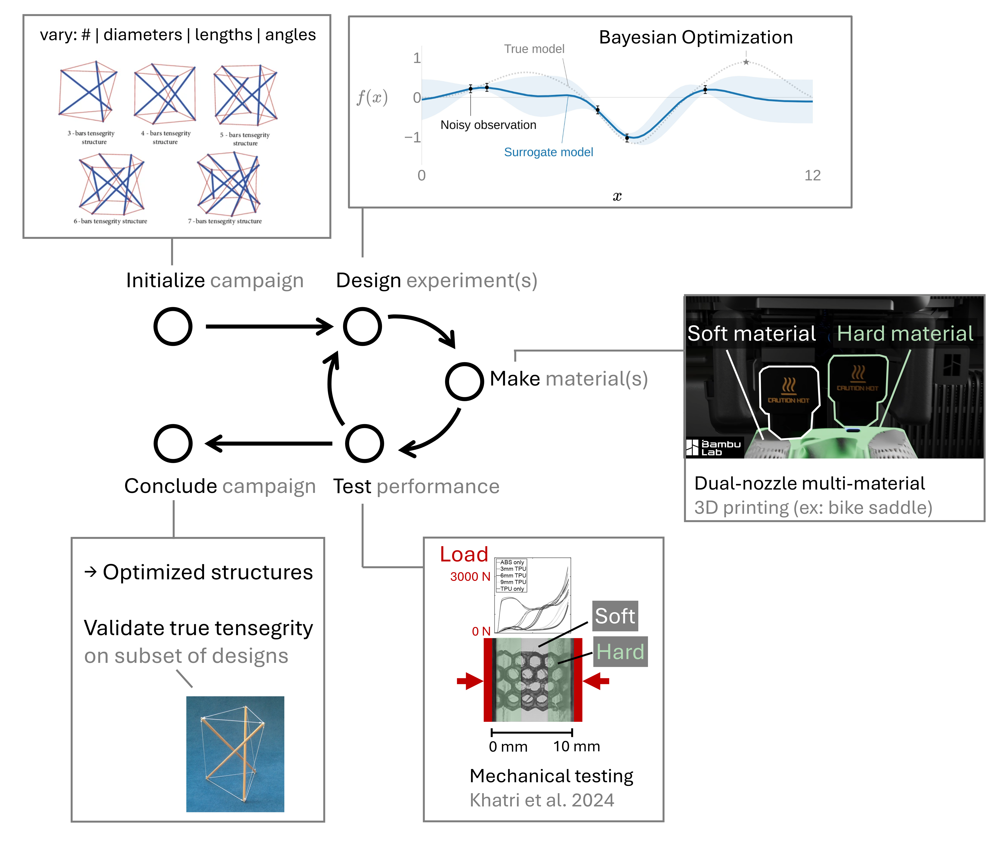

# Bayesian optimization of 3D-printed tensegrity structures for energy absorption

We print tensegrity-inspired structures on a dual-nozzle 3D printer (rigid PLA struts and flexible TPU tendons, printed together as one piece), drop-test them on an instrumented drop tower, and use Bayesian optimization to choose the next batch of designs. The goal is lightweight structures that absorb impact energy well. The project is mentored undergraduate research in Mechanical Engineering at Brigham Young University (BYU).

This repository is the companion to Marcus Madsen's talk at ASME IDETC-CIE 2026, "Closed-Loop Bayesian Optimization of Multi-Material 3D-Printed Tensegrity-Inspired Energy Absorbers" (track DAC-10: Design of Engineering Materials and Structures).

If you arrived from the talk's QR code: most of the current work sits on open pull requests, not on this main branch, so this page points to where things actually live. File links go to the latest version on the file's branch, and each has a pinned permalink beside it in case that branch later changes or goes away.

## Start here

- **Extended abstract** (2 pages): [idetc-abstract.pdf](https://github.com/vertical-cloud-lab/tensegrity-optimization/blob/main/idetc-abstract.pdf) ([permalink](https://github.com/vertical-cloud-lab/tensegrity-optimization/blob/592b5a6/idetc-abstract.pdf)). The IDETC-CIE 2026 submission the talk is based on.
- **Journal manuscript draft**: [manuscript.pdf](https://github.com/vertical-cloud-lab/tensegrity-optimization/blob/copilot/vertical-cloud-labtensegrity-optimization/manuscript/manuscript.pdf) ([permalink](https://github.com/vertical-cloud-lab/tensegrity-optimization/blob/827301d/manuscript/manuscript.pdf)), with [supplementary material](https://github.com/vertical-cloud-lab/tensegrity-optimization/blob/copilot/vertical-cloud-labtensegrity-optimization/manuscript/supplementary.pdf) ([permalink](https://github.com/vertical-cloud-lab/tensegrity-optimization/blob/827301d/manuscript/supplementary.pdf)). "Experiment-Driven Bayesian Optimization of the Impact Response of Multi-Material 3D-Printed Tensegrity-Inspired Structures", aimed at the ASME Journal of Mechanical Design. Methods and background are drafted; results are placeholders until the experimental campaign finishes. The draft evolves on [PR #76](https://github.com/vertical-cloud-lab/tensegrity-optimization/pull/76) (tracked in [issue #75](https://github.com/vertical-cloud-lab/tensegrity-optimization/issues/75)) and has been through five rounds of mock peer review.
- **The talk itself**: slides, figures, and video clips are assembled on [PR #84](https://github.com/vertical-cloud-lab/tensegrity-optimization/pull/84) (tracked in [issue #83](https://github.com/vertical-cloud-lab/tensegrity-optimization/issues/83)). An early snapshot of the deck is in the repo: [IDETC Tensegrity Slides Draft 1.pptx](https://github.com/vertical-cloud-lab/tensegrity-optimization/blob/claude/issue-83-20260715-2018/presentation/Slide%20Decks/IDETC%20Tensegrity%20Slides%20Draft%201.pptx) ([permalink](https://github.com/vertical-cloud-lab/tensegrity-optimization/blob/e6b536f/presentation/Slide%20Decks/IDETC%20Tensegrity%20Slides%20Draft%201.pptx)).
- **Original proposal**: [proposal.pdf](https://github.com/vertical-cloud-lab/tensegrity-optimization/blob/main/proposal.pdf) ([permalink](https://github.com/vertical-cloud-lab/tensegrity-optimization/blob/592b5a6/proposal.pdf)). The BYU Mentored Research Grant proposal this project grew out of.

*One of the printed test articles, a T3 prism (three rigid struts suspended in a tendon network), on the drop tower. Frame from our drop-test footage; more clips are on [PR #84](https://github.com/vertical-cloud-lab/tensegrity-optimization/pull/84).*

## Where the project stands

- [Issue #99](https://github.com/vertical-cloud-lab/tensegrity-optimization/issues/99): status review across the whole project.
- [Issue #85](https://github.com/vertical-cloud-lab/tensegrity-optimization/issues/85): defining the search space for the T3 optimization campaign.
- [Issue #98](https://github.com/vertical-cloud-lab/tensegrity-optimization/issues/98) and [PR #102](https://github.com/vertical-cloud-lab/tensegrity-optimization/pull/102): the first Sobol print batch (T-3_01), with the ID-to-design key and as-printed files.
- [Issue #101](https://github.com/vertical-cloud-lab/tensegrity-optimization/issues/101): tally of every drop recorded so far.

## Design, printing, and drop testing

- [PR #35](https://github.com/vertical-cloud-lab/tensegrity-optimization/pull/35): parametric T3 prism CAD with sliced, print-ready multi-material files for the Bambu Lab H2D.
- [PR #39](https://github.com/vertical-cloud-lab/tensegrity-optimization/pull/39): joint designs that anchor a TPU tendon inside a PLA strut, with validation prints.
- [PR #66](https://github.com/vertical-cloud-lab/tensegrity-optimization/pull/66): support strategies that keep printed TPU tendons clean.
- [PR #86](https://github.com/vertical-cloud-lab/tensegrity-optimization/pull/86): drop-test protocol and analysis of the first recorded drops.
- [PR #28](https://github.com/vertical-cloud-lab/tensegrity-optimization/pull/28): the Lansmont M23 drop tower and Polytec laser vibrometer we test on.
- [PR #97](https://github.com/vertical-cloud-lab/tensegrity-optimization/pull/97) and [PR #100](https://github.com/vertical-cloud-lab/tensegrity-optimization/pull/100), from [issue #94](https://github.com/vertical-cloud-lab/tensegrity-optimization/issues/94): primers on drop-tower energy-absorption metrics and what we can actually measure.
- [PR #74](https://github.com/vertical-cloud-lab/tensegrity-optimization/pull/74), from [issue #71](https://github.com/vertical-cloud-lab/tensegrity-optimization/issues/71): checking the drop-tower accelerometers against each other.

## Optimization and simulation

- [PR #30](https://github.com/vertical-cloud-lab/tensegrity-optimization/pull/30): Bayesian-optimization campaign scaffold built with honegumi and Ax.
- [PR #33](https://github.com/vertical-cloud-lab/tensegrity-optimization/pull/33): tensegrity drop simulations (MuJoCo, PyBullet, PyChrono, and others) wired into a Bayesian-optimization loop.
- [PR #24](https://github.com/vertical-cloud-lab/tensegrity-optimization/pull/24): choosing the design variables for the PLA + TPU structures.

## Background and literature

- [PR #22](https://github.com/vertical-cloud-lab/tensegrity-optimization/pull/22): reference models of canonical tensegrity structures, plus literature surveys.
- [PR #58](https://github.com/vertical-cloud-lab/tensegrity-optimization/pull/58): close read of Davami et al. 2025 on the dynamic response of additively manufactured tensegrity.
- [Issue #87](https://github.com/vertical-cloud-lab/tensegrity-optimization/issues/87): options for activating pre-tension in printed structures.
- [literature/](https://github.com/vertical-cloud-lab/tensegrity-optimization/tree/main/literature): collected papers. LaTeX sources for the abstract and proposal are at the repository root.

## Proposals and next venues

- [PR #14](https://github.com/vertical-cloud-lab/tensegrity-optimization/pull/14): NASA Space Grant fellowship proposal.
- [Issue #78](https://github.com/vertical-cloud-lab/tensegrity-optimization/issues/78) and [PR #73](https://github.com/vertical-cloud-lab/tensegrity-optimization/pull/73): abstract for TMS 2027.
- [PR #43](https://github.com/vertical-cloud-lab/tensegrity-optimization/pull/43): survey of funding venues for a larger follow-on project.

These lists are curated; the full set of threads is in the [issues](https://github.com/vertical-cloud-lab/tensegrity-optimization/issues) and [pull requests](https://github.com/vertical-cloud-lab/tensegrity-optimization/pulls) tabs.

## People

Jeffrey R. Hill (PI) and Sterling G. Baird (co-PI), Department of Mechanical Engineering, Brigham Young University, with undergraduate researchers including Marcus Madsen.

Much of the exploratory work in the pull requests above was drafted by AI coding agents (GitHub Copilot and Claude Code) steered through the issue threads here; [issue #103](https://github.com/vertical-cloud-lab/tensegrity-optimization/issues/103) estimates what that usage would have cost.
