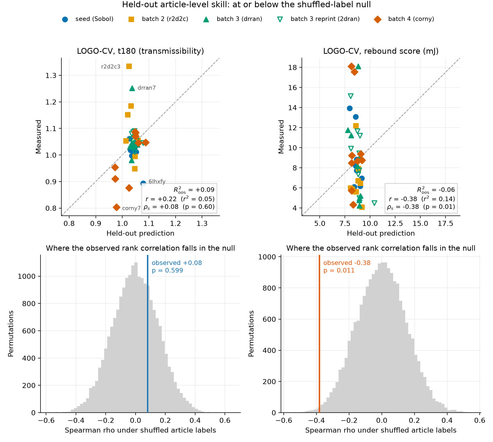
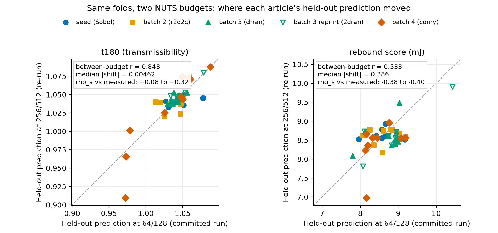
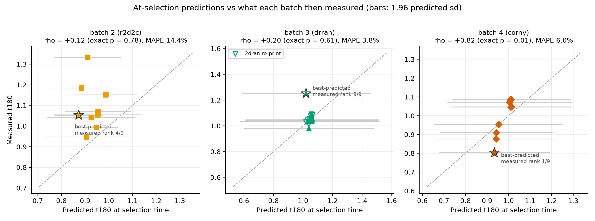
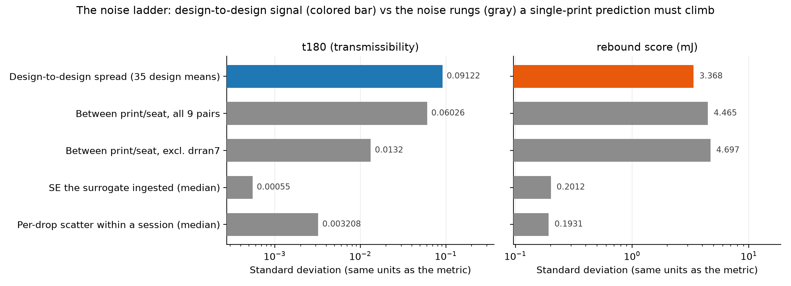

# Cross-validation signal audit

**Question (PR #76, 2026-09-22):** "Do we have any predictive signal in this
dataset? Like, at all? Also weird that you're reporting r, was expecting to
see r^2." Plus Audrey's question from the same meeting: are the bungee cords
that keep the print in place interfering with the measurements?

Everything here is recomputed from the committed campaign snapshots vendored
in [`data/`](data/README.md) by [`cv_signal_audit.py`](cv_signal_audit.py)
(fixed seed, exact permutation enumeration where n = 9 makes it cheap; all
numbers in [`metrics.json`](metrics.json)). The recomputation matches the
archived Ax diagnostics to 1e-4 on r and MAPE for both LOGO runs, so the
numbers in the manuscript's LOGO figure are real, not a processing artifact.

**2026-09-22 update:** the LOGO-CV was re-run at the library-default NUTS
budget (256 samples / 512 warmup per fold) after PR #76 flagged that the
campaign's committed run had used a reduced 64/128 budget. The re-run is
now the primary input here; the 64/128 run is kept as a comparison, and
Section 2's budget subsection reports what changed. Short version: t180's
rank statistics were materially understated at the reduced budget, and the
rebound anti-signal is budget-robust.

## Verdict

The one-sentence answer: **the dataset contains real t180 design signal
and the model uses it, prospectively for the job the campaign needs
(ranking new candidates within the sampled region) and, at the full MCMC
budget, detectably in held-out rank statistics too; what remains out of
reach is the magnitude of a single print's outcome, and the rebound score
has anti-signal at every level.**

Four levels, from harshest test to the decision-relevant one (LOGO rows
are the 256/512 re-run; the 64/128 numbers they replace are in the budget
subsection of Section 2):

| Level | Test | t180 | Rebound score |
|---|---|---|---|
| Article, full space | LOGO-CV, 44 articles | R2_oos +0.12, rho_s +0.32 (p = 0.036): **weak rank signal** | rho_s = -0.40 (p = 0.008), R2_oos = -0.05: **anti-signal** |
| Article, exploit cluster | LOGO-CV, the 35 articles in t180 [0.95, 1.10] | r = +0.52 (p = 0.003), rho_s = +0.41 (p = 0.015), MAPE 2.2%: **yes, within-cluster** | not separately testable |
| Design (collapse reprints) | LOGO-CV on 35 design means | rho_s +0.37 (p = 0.032): **weak rank signal** | rho_s = -0.30 (p = 0.080): **anti-signal trend** |
| Selection (what BO needs) | at-selection predictions vs the batch then measured | batch 4: rho_s = +0.82, exact p = 0.011: **yes** | rho_s +0.17 to +0.55, all p > 0.13: **no** |

The model-free context: a second physical print of the same design
predicts its twin at ICC <= 0 within the exploit cluster (t180 pair rank
correlation +0.08 over the 9 pairs, rebound -0.18). At the reduced budget
the surrogate's +0.08 looked pinned to that ceiling; at the full budget it
clears it. No contradiction: the pair statistic bounds one noisy print
predicting another (noise on both sides), while a model prediction is a
smooth function of the design with no seat noise of its own, so it can
out-rank a single reprint, and an ICC estimated from 9 pairs is wide
anyway. Magnitude prediction is still noise-limited; ordering is not as
hopeless as the reduced-budget run made it look.

## 1. The r vs r^2 question first

Three different quantities have been floating around, and they answer
different questions:

- **Pearson r** (what the LOGO figure annotates, because Ax's
  `compute_diagnostics` reports "Correlation coefficient" = Pearson and
  "Rank correlation" = Spearman): linear association only. It ignores bias
  and scale, so a model that predicts 1.03 for everything from 0.80 to 1.33
  can still post a positive r.
- **r^2** (squared Pearson): same information, squared. On this data it
  makes things look worse, not better: t180 r = +0.29 becomes r^2 = 0.08,
  and rebound's r^2 = 0.13 hides that the correlation is **negative**.
  Quoting r^2 alone would have obscured the campaign's single most alarming
  CV result.
- **Out-of-sample R^2** (1 minus SSE over the squared error of predicting
  each held-out design with the mean of the other designs' articles): the
  honest "is the model better than no model" number. It can be negative,
  and for rebound it is.

The full set, article level (n = 44, 256/512 re-run):

| Metric | r | r^2 | rho_s (perm p) | R2_oos | MAPE | RMSE vs mean-predictor RMSE |
|---|---|---|---|---|---|---|
| t180 | +0.29 [95% CI -0.01, +0.54] | 0.08 | +0.32 (0.036) | **+0.12** | 4.8% | 0.082 vs 0.088 |
| Rebound (mJ) | -0.36 [-0.59, -0.07] | 0.13 | -0.40 (0.008) | **-0.05** | 38.8% | 3.84 vs 3.76 |

So the direct answer to "expected r^2": for a parity plot the pair worth
reporting is **R2_oos plus a rank statistic with a permutation p**, with
r^2 quoted alongside r whenever Pearson appears. The audit figures and
tables here do that throughout, and the manuscript's surrogate-audit
paragraph should too when it is next touched.

## 2. Article level: weak rank skill, magnitudes still noise-limited

All numbers in this section are from the 256/512 re-run unless labeled
otherwise; the budget subsection below shows both runs side by side.

- t180: R2_oos = +0.12 against the honest per-fold baseline (+0.08 against
  the global mean). Rank correlation now clears the shuffled-label null:
  rho_s = +0.32, permutation p = 0.036. Predictions still shrink hard to
  the pooled mean (sd(pred)/sd(obs) = 0.32) while the posterior stays wide
  (median held-out sd 0.104 vs data sd 0.087) and roughly calibrated (89%
  of articles inside 1.96 posterior sd). Read together: the model mostly
  reports the pooled distribution, but the small adjustments it makes
  around that mean are ordered in the right direction more often than
  chance.
- The Pearson r is less fragile than at the reduced budget but still
  jackknife-sensitive: r = +0.29 full-sample, +0.40 with r2d2c3 removed,
  about +0.22 with corny6 or corny7 removed. Of the nine articles outside
  the cluster, the model put only 4 on the correct side of the median
  (coin-flip p = 1.0): the strong attenuators and amplifiers are still
  found by testing, not by prediction.
- Inside the cluster (35 articles in [0.95, 1.10]) the association is now
  solid under both tests: r = +0.52 (perm p = 0.003), rho_s = +0.41
  (p = 0.015), R2_oos = +0.19, MAPE 2.2%. At 64/128 this was the fragile
  part (rho_s = +0.22, p = 0.21); the extra chain budget is what firmed it
  up.
- Asked the coarser question acquisition actually asks ("which articles
  measure below unity?"), the model now discriminates well: AUC = 0.84
  (p = 0.002, 9 attenuators), up from 0.68 (p = 0.10) at the reduced
  budget.
- Rebound: significantly anti-correlated at every formulation (rank
  p = 0.008, Pearson p = 0.020, AUC for picking the better half = 0.33,
  p = 0.059), and slightly stronger at the full budget than at 64/128.
  The model learned print luck and inverts the truth on held-out designs;
  negative R2_oos means the pooled mean is strictly better. This confirms
  the pre-registered Edison objection to `e_rebound` (task `3e398131`)
  with three more batches of evidence, and the budget experiment rules out
  "underfit MCMC" as its explanation.
- Multiplicity: several t180 looks now land between p = 0.002 and
  p = 0.04, and they are correlated views of one dataset, not independent
  confirmations. The reason to take the rank signal seriously is not any
  single p here but that it points the same way as the prospective
  selection-level test in Section 3, which involves no cross-validation at
  all.

Design level (averaging the nine reprint pairs into design means, n = 35)
now agrees with the article level: t180 rho_s = +0.37 (p = 0.032), up
from +0.05 (p = 0.76) at the reduced budget; rebound rho_s = -0.30
(p = 0.080).

### The NUTS budget experiment (re-run 2026-09-22)

PR #76 flagged that the committed LOGO run had used reduced per-fold NUTS
settings (64 samples / 128 warmup, 4 retained SAAS draws after thinning)
versus the 256/512 library default that every campaign candidate-generation
fit used, and that its commit-message claim of being "direction-stable vs
128/256" had no committed artifact behind it. The re-run settles both
points. Same code path as the campaign script (`fit_saasbo` with
`refit_on_cv=True`, one NUTS refit per design fold, reprint pairs held out
together), driven fold-by-fold by
[`rerun_logocv_full_nuts.py`](rerun_logocv_full_nuts.py) with each fold
committed as it landed; outputs in
[`data/full-nuts-rerun/`](data/full-nuts-rerun/) in the campaign formats.
35 folds, about 74 s per fold on 4 CPU cores.

Archived Ax diagnostics, both runs:

| Diagnostic | t180 at 64/128 | t180 at 256/512 | Rebound at 64/128 | Rebound at 256/512 |
|---|---|---|---|---|
| Pearson r | +0.22 | +0.29 | -0.38 | -0.36 |
| Rank correlation | +0.08 | +0.32 | -0.38 | -0.40 |
| MAPE | 5.0% | 4.8% | 39.4% | 38.8% |
| MSE | 0.0071 | 0.0068 | 15.02 | 14.76 |
| Fisher exact test p | 0.62 | 0.065 | 0.98 | 1.00 |
| Mean prediction CI | 0.370 | 0.362 | 2.141 | 2.131 |

How a rank correlation quadruples while MAPE barely moves: the predictions
themselves moved very little (t180 median |shift| 0.005, about 5% of the
data sd; between-budget r = 0.84), but the model's prediction spread is
only a third of the data sd, so shifts of that size reorder articles
within the shrunken band. The rank statistics were the budget-sensitive
quantities; the magnitudes, MAPE, and the calibration numbers (89%/93%
coverage, near-identical posterior sd) were not. Verdict on the old
caveats: the direction-stability claim held for rebound and failed for
t180's rank statistics, and the worry about 4 retained draws distorting
the sd-derived numbers did not materialize. The reliability ceiling
(model-free) and Section 3 (at-selection predictions from full-budget
campaign fits) never depended on this either way.

## 3. Selection level: the signal that actually exists

The campaign committed posterior predictions for every recommended batch
before printing it ([`data/t3-prism-bo-round{1,3,4}-predictions.csv`](data/)).
Scoring those archived predictions against what each batch then measured is
a prospective test, immune to CV leakage and to the NUTS budget question
(these fits always ran at 256/512):

| Batch | Model trained on | rho_s (exact perm p) | MAPE | 95% interval coverage | Best-predicted article, measured rank |
|---|---|---|---|---|---|
| 2 (r2d2c) | 8 seed articles | +0.12 (0.78) | 14.4% | 56% | r2d2c9, 4 of 9 |
| 3 (drran) | 17 articles | +0.20 (0.61) | 3.8% | 100% | drran7, **9 of 9** |
| 3 reprint (2dran), same predictions | 17 articles | **+0.72 (0.037)** | 1.6% | 100% | 2dran7, 2 of 9 |
| 4 (corny) | 35 articles | **+0.82 (0.011)** | 6.0% | 100% | corny7, **1 of 9** |

Read together with the reliability ceiling, this table is the whole story:

- **Batch 2**: the seed-only model was badly optimistic (mean bias +0.17,
  half the articles outside its own 95% intervals). No skill.
- **Batch 3 is the controlled experiment on print noise.** The same frozen
  predictions rank one print of the nine designs at +0.20 and the re-print
  of the same nine designs at +0.72. The model did not change between those
  two rows; the physical prints did. drran7 was predicted best and measured
  worst (1.251), then its twin measured mid-pack (1.029). Single prints
  scramble rankings; the model was closer to the design truth than print 1
  made it look.
- **Batch 4**: by 35 training articles the model ranked its own recommended
  batch at rho_s = +0.82 (exact p = 0.011, the strongest single result
  here; it survives a four-test Bonferroni at 0.043) and its top pick,
  corny7, measured best in the batch and best in the campaign (0.803,
  single seating, re-seat pending). Part of the rho is the easier task of
  separating the batch's two design families (tall low-twist vs wide
  high-twist), but picking corny7 within the attenuating family was the
  campaign's stated goal, and it happened by prediction, not luck
  (rank 1 of 9 has chance probability 0.11 on its own, and the trend across
  batches 2 to 4 is monotone with training size).
- Pooled across the three prospective batches (print 1 only, permutations
  within batch): mean rho_s = +0.38, p = 0.065.
- Campaign-level corroboration: hypervolume at the fixed reference moved
  3.155 to 5.195 (+65%), and the best measured t180 moved 0.893 (Sobol
  seed) to 0.803 (model-chosen).

Sections 2 and 3 now tell one story instead of two. At the reduced NUTS
budget they looked contradictory (no held-out rank signal, yet strong
prospective batch ranking); at the full budget the LOGO rank statistics
point the same way as the selection-level test, weaker because LOGO asks
the harder question: predict a design you have never seen, anywhere in a
9-variable space, from at most 34 other designs, one print each, versus
ranking nine candidates in the region being sampled. What stays out of
reach at every budget is the magnitude of a single print's outcome.

## 4. The noise ladder, and Audrey's bungee question

| Rung (sd) | t180 | Rebound (mJ) |
|---|---|---|
| Per-drop scatter within a session (median) | 0.0032 | 0.19 |
| SE the surrogate ingested (median) | 0.00055 | 0.20 |
| Between print/seat (9 pairs, excl. drran7) | 0.0132 | 4.70 |
| Between print/seat (all 9 pairs) | 0.0603 | 4.46 |
| Design-to-design spread (35 design means) | 0.0912 | 3.37 |

For t180 the design spread is roughly 7 times the typical print/seat noise:
design signal exists, which is why selection works. For rebound the
between-print rung **exceeds** the design spread: there is no design signal
print-to-print, which is why every rebound test in this audit fails. The
surrogate was told articles are 24 times more precise than prints actually
repeat (0.00055 vs 0.0132), which is how it learned print luck.

### What the bungee cords are and why they are a suspect

Rig facts from the record:

- The Lansmont tower is **bungee-assisted**: elastic cords accelerate the
  carriage downward faster than gravity, so an unrestrained specimen cannot
  stay seated during the descent. Restraint is structurally required, not a
  convenience ([issue #36, Jeffrayhill1, 2026-05-26](https://github.com/vertical-cloud-lab/tensegrity-optimization/issues/36)).
- The specimen hold-down as designed: short bungee cords threaded across
  the top tendons, hooked into notches on the top acrylic plate
  ([issue #36, me-madsen, 2026-05-28](https://github.com/vertical-cloud-lab/tensegrity-optimization/issues/36)).
  The manuscript's fabrication figure calls the fixture the
  "bungee-assisted drop-tower base plate".
- The pre-registered adversarial objectives review (Edison task `3e398131`)
  already flagged that the rebound "hop" reading is unvalidated and asked
  for a restrained-versus-unrestrained test with synchronized video; the SI
  records that check as still open.

Mechanics, in numbers. An article weighs 18.5 to 22.3 g, so its weight is
about 0.19 to 0.22 N. Any hold-down tension of order 1 N is therefore
**five times the article's weight**, and it varies with how far the cords
were stretched at that particular seating. Two consequences:

1. **Rebound.** The score assumes ballistic flight under g
   (e_reb = g t_second / (2 dv)). Against cord tension F the effective
   deceleration is g(1 + F/mg); at F = 1 N that is about 6 g, so t_second
   (and the score) compresses by that factor, seat by seat, with whatever
   tension that seating happened to apply. This is a sufficient mechanism
   for rebound's observed noise floor (pair ratios 0.38x to 2.9x,
   between-print sd above the design spread), though the record cannot
   isolate it from print variation because cord state was never logged.
2. **t180.** During the ~1.6 ms pulse the structure carries peak forces of
   order 40 to 50 N (200 to 236 G on ~20 g), so a ~1 N preload is a 2 to 5%
   effect. More importantly, the preload sets the tendon slack state of a
   structure the model treats as having zero pretension, and it varies seat
   to seat. Seat-to-seat variation is the campaign's dominant known error
   term, and unlike the session-level covariates audited on 2026-09-22
   (chamber RH, weather, spool age, which cap out at ~10% of residual RMSE),
   cord preload lives at exactly the level where the error budget says the
   variance is.

What existing data can and cannot say: nothing was recorded per seating
about the cords, so no retrospective attribution is possible. The one weak
indirect check is height: if taller articles take more cord stretch, t180
should track H through preload. The seed batch showed rho(t180, H) = +0.83
over 8 articles, but the association vanishes across all 44
(rho = +0.02), so the record neither supports nor rules out a
height-preload confound; the seed-era association was a small-sample
artifact either way.

### The experiment that settles it

Three conditions, chosen so each contrast isolates one thing:

- **A**: current configuration (bungee assist + specimen cords).
- **B**: gravity drop, no assist, no specimen cords, height raised toward
  the 77 in maximum Jeff identified (2026-06-02) to compensate input
  severity.
- **C**: gravity drop with specimen cords, matched to B's input. C vs B
  isolates the cords; A vs C isolates the assist.

Articles: one strong hopper (6lhxfy), one low-hop reference (bpx68c), and
corny7 while its scheduled re-seat confirmation is on the tower anyway.
Replication unit: the **seating**, not the drop. Per condition use at least
5 stabilized drops per seat and at least 3 independent seats (re-hook the
cords each time). At the pair-based seat sd of about 1.3% in t180, three
seats per condition resolve a shift of roughly 3%, five seats roughly 2%;
any cord effect on rebound of the predicted magnitude (multiples, not
percent) is unmissable at n = 3 seats. Log per seating: cord ID, hook notch
or stretch length, and a spring-scale tension reading. Film at 959 fps per
the batch-4 protocol so the same session settles the second-event identity
question from the Edison review. If the cords stay, those three logged
numbers make cord preload a testable covariate in the replicate
rank-stability study (manuscript Section 3.5).

Per sgbaird's note on PR #76 (2026-09-22), it is worth running the backup
modality in tandem on the same articles: a quasi-static compression test
(the load-frame campaign already planned in the manuscript) plus a bench
weight-drop onto a stationary article. Both are free of carriage restraint
entirely, so they give a cord-free reference ordering of the same designs.
If condition A vs C shows the cords matter, the campaign has a measured
bridge to the backup rig instead of starting one cold.

## Files

- [`cv_signal_audit.py`](cv_signal_audit.py): the full recomputation
  (deterministic; run `python3 cv_signal_audit.py` from this directory).
- [`metrics.json`](metrics.json): every number in this document, for both
  NUTS budgets.
- [`figures/`](figures/): the four figures above.
- [`data/`](data/README.md): vendored input snapshots with provenance,
  including the primary full-budget LOGO re-run under
  [`data/full-nuts-rerun/`](data/full-nuts-rerun/).
- [`rerun_logocv_full_nuts.py`](rerun_logocv_full_nuts.py): the resumable
  driver that produced the 256/512 re-run on 2026-09-22 (same model code
  path as
  [`bo/t3_prism_bo_diagnostics.py` on the campaign branch](https://github.com/vertical-cloud-lab/tensegrity-optimization/blob/bbf7a62/bo/t3_prism_bo_diagnostics.py)
  at `bbf7a62`, plus per-fold checkpoint commits and per-fold seeding; its
  docstring records the exact invocation). The committed 64/128 run
  remains in `data/` as the comparison variant.
