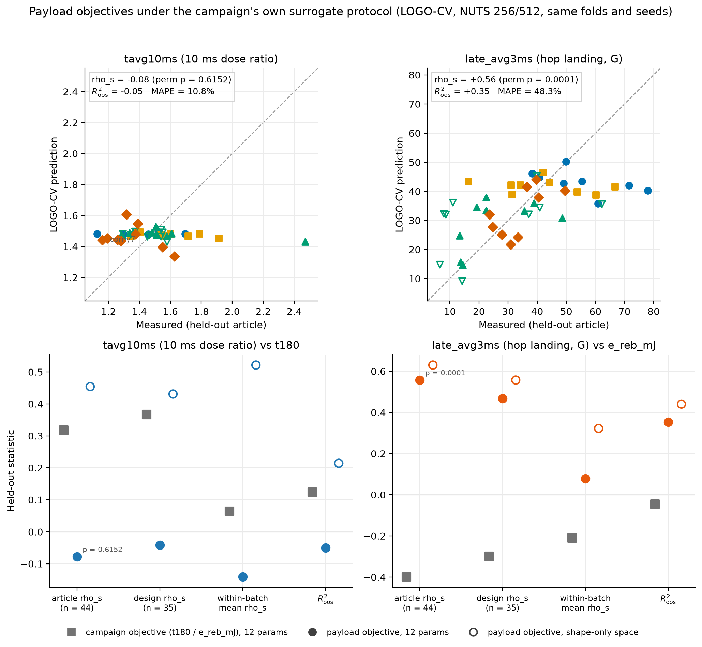
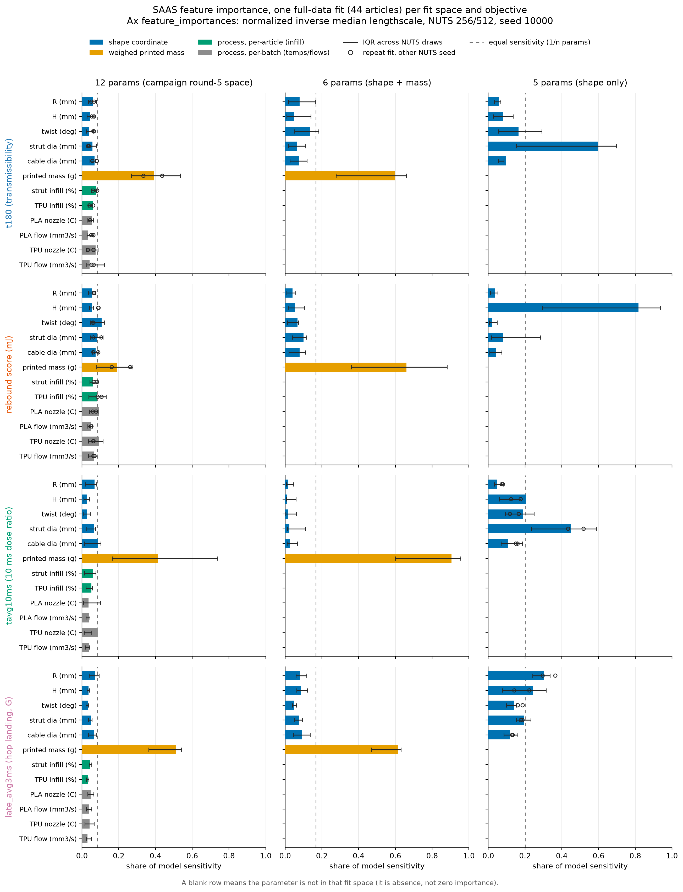
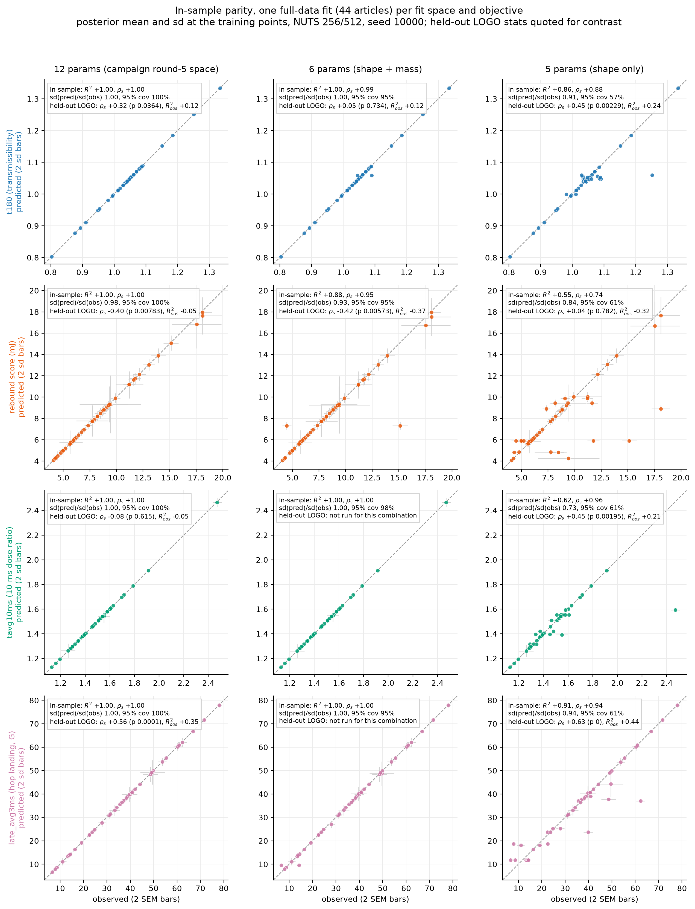
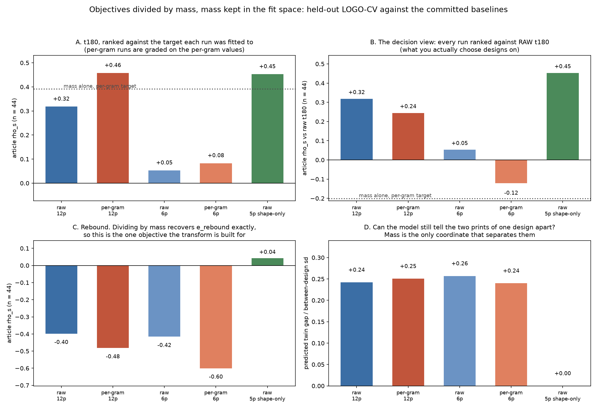
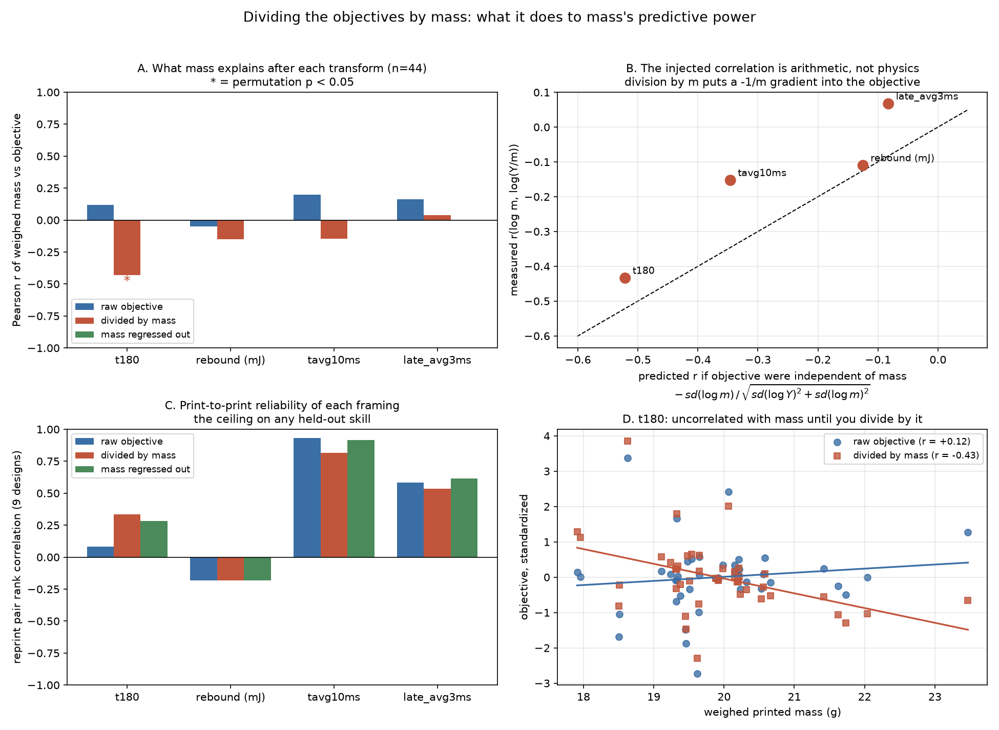

# Cross-validation signal audit

**Question (PR #76, 2026-09-22):** "Do we have any predictive signal in this
dataset? Like, at all? Also weird that you're reporting r, was expecting to
see r^2." Plus Audrey's question from the same meeting: are the bungee cords
that keep the print in place interfering with the measurements?

Everything here is recomputed from the committed campaign snapshots vendored
in [`data/`](data/README.md) by [`cv_signal_audit.py`](cv_signal_audit.py)
(fixed seed, exact permutation enumeration where n = 9 makes it cheap; all
numbers in [`metrics.json`](metrics.json)). The recomputation matches the
archived Ax diagnostics to 1e-4 on r and MAPE for both LOGO runs, so the
numbers in the manuscript's LOGO figure are real, not a processing artifact.

**2026-09-22 update:** the LOGO-CV was re-run at the library-default NUTS
budget (256 samples / 512 warmup per fold) after PR #76 flagged that the
campaign's committed run had used a reduced 64/128 budget. The re-run is
now the primary input here; the 64/128 run is kept as a comparison, and
Section 2's budget subsection reports what changed. Short version: t180's
rank statistics were materially understated at the reduced budget, and the
rebound anti-signal is budget-robust.

**2026-09-23 update:** Section 6 adds a fit-space ablation (asked on PR
#111): the LOGO-CV re-run in the rounds-1-and-2 six-parameter space
(shape + weighed mass) and in a shape-only space. The surprise is that
the weighed-mass input, present since round 1, was carrying the rebound
anti-signal and suppressing t180's held-out ordering; shape-only posts
the best rank statistics in this audit. The 12-parameter numbers
elsewhere in this document are unchanged and remain the primary record
of the model the campaign actually ran.

## Verdict

The one-sentence answer: **the dataset contains real t180 design signal
and the model uses it, prospectively for the job the campaign needs
(ranking new candidates within the sampled region) and, at the full MCMC
budget, detectably in held-out rank statistics too; what remains out of
reach is the magnitude of a single print's outcome, and the rebound score
has anti-signal at every level.**

Four levels, from harshest test to the decision-relevant one (LOGO rows
are the 256/512 re-run; the 64/128 numbers they replace are in the budget
subsection of Section 2):

| Level | Test | t180 | Rebound score |
|---|---|---|---|
| Article, full space | LOGO-CV, 44 articles | R2_oos +0.12, rho_s +0.32 (p = 0.036): **weak rank signal** | rho_s = -0.40 (p = 0.008), R2_oos = -0.05: **anti-signal** |
| Article, exploit cluster | LOGO-CV, the 35 articles in t180 [0.95, 1.10] | r = +0.52 (p = 0.003), rho_s = +0.41 (p = 0.015), MAPE 2.2%: **yes, within-cluster** | not separately testable |
| Design (collapse reprints) | LOGO-CV on 35 design means | rho_s +0.37 (p = 0.032): **weak rank signal** | rho_s = -0.30 (p = 0.080): **anti-signal trend** |
| Selection (what BO needs) | at-selection predictions vs the batch then measured | batch 4: rho_s = +0.82, exact p = 0.011: **yes** | rho_s +0.17 to +0.55, all p > 0.13: **no** |

The model-free context: a second physical print of the same design
predicts its twin at ICC <= 0 within the exploit cluster (t180 pair rank
correlation +0.08 over the 9 pairs, rebound -0.18). At the reduced budget
the surrogate's +0.08 looked pinned to that ceiling; at the full budget it
clears it. No contradiction: the pair statistic bounds one noisy print
predicting another (noise on both sides), while a model prediction is a
smooth function of the design with no seat noise of its own, so it can
out-rank a single reprint, and an ICC estimated from 9 pairs is wide
anyway. Magnitude prediction is still noise-limited; ordering is not as
hopeless as the reduced-budget run made it look.

Section 5 is the paper trail: every claim of predictive signal posted
during the campaign, with links, and what became of each one. Section 6
re-runs the LOGO-CV in reduced fit spaces and finds the verdict's t180
row understates what the data supports: with the weighed-mass input
removed, held-out design ranking reaches rho_s = +0.51 (p = 0.0017), and
the rebound anti-signal turns out to be an artifact of that input rather
than of the data. Section 7 re-runs the same protocol under the
payload-dose objectives from the adjacent payload-protection analysis:
in the campaign's 12-parameter space the reliably measured `tavg10ms`
shows no held-out skill at all, and in the shape-only space it becomes
the strongest within-batch design ranking in the audit (rho_s +0.52,
p 0.0006), the same space experiment as Section 6 with a louder
answer; the proposed `late_avg3ms` second objective is predictable in
both spaces, with a session-confound caveat on the pooled number.

## 1. The r vs r^2 question first

Three different quantities have been floating around, and they answer
different questions:

- **Pearson r** (what the LOGO figure annotates, because Ax's
  `compute_diagnostics` reports "Correlation coefficient" = Pearson and
  "Rank correlation" = Spearman): linear association only. It ignores bias
  and scale, so a model that predicts 1.03 for everything from 0.80 to 1.33
  can still post a positive r.
- **r^2** (squared Pearson): same information, squared. On this data it
  makes things look worse, not better: t180 r = +0.29 becomes r^2 = 0.08,
  and rebound's r^2 = 0.13 hides that the correlation is **negative**.
  Quoting r^2 alone would have obscured the campaign's single most alarming
  CV result.
- **Out-of-sample R^2** (1 minus SSE over the squared error of predicting
  each held-out design with the mean of the other designs' articles): the
  honest "is the model better than no model" number. It can be negative,
  and for rebound it is.

The full set, article level (n = 44, 256/512 re-run):

| Metric | r | r^2 | rho_s (perm p) | R2_oos | MAPE | RMSE vs mean-predictor RMSE |
|---|---|---|---|---|---|---|
| t180 | +0.29 [95% CI -0.01, +0.54] | 0.08 | +0.32 (0.036) | **+0.12** | 4.8% | 0.082 vs 0.088 |
| Rebound (mJ) | -0.36 [-0.59, -0.07] | 0.13 | -0.40 (0.008) | **-0.05** | 38.8% | 3.84 vs 3.76 |

So the direct answer to "expected r^2": for a parity plot the pair worth
reporting is **R2_oos plus a rank statistic with a permutation p**, with
r^2 quoted alongside r whenever Pearson appears. The audit figures and
tables here do that throughout, and the manuscript's surrogate-audit
paragraph should too when it is next touched.

## 2. Article level: weak rank skill, magnitudes still noise-limited

All numbers in this section are from the 256/512 re-run unless labeled
otherwise; the budget subsection below shows both runs side by side.

- t180: R2_oos = +0.12 against the honest per-fold baseline (+0.08 against
  the global mean). Rank correlation now clears the shuffled-label null:
  rho_s = +0.32, permutation p = 0.036. Predictions still shrink hard to
  the pooled mean (sd(pred)/sd(obs) = 0.32) while the posterior stays wide
  (median held-out sd 0.104 vs data sd 0.087) and roughly calibrated (89%
  of articles inside 1.96 posterior sd). Read together: the model mostly
  reports the pooled distribution, but the small adjustments it makes
  around that mean are ordered in the right direction more often than
  chance.
- The Pearson r is less fragile than at the reduced budget but still
  jackknife-sensitive: r = +0.29 full-sample, +0.40 with r2d2c3 removed,
  about +0.22 with corny6 or corny7 removed. Of the nine articles outside
  the cluster, the model put only 4 on the correct side of the median
  (coin-flip p = 1.0): the strong attenuators and amplifiers are still
  found by testing, not by prediction.
- Inside the cluster (35 articles in [0.95, 1.10]) the association is now
  solid under both tests: r = +0.52 (perm p = 0.003), rho_s = +0.41
  (p = 0.015), R2_oos = +0.19, MAPE 2.2%. At 64/128 this was the fragile
  part (rho_s = +0.22, p = 0.21); the extra chain budget is what firmed it
  up.
- Asked the coarser question acquisition actually asks ("which articles
  measure below unity?"), the model now discriminates well: AUC = 0.84
  (p = 0.002, 9 attenuators), up from 0.68 (p = 0.10) at the reduced
  budget.
- Rebound: significantly anti-correlated at every formulation (rank
  p = 0.008, Pearson p = 0.020, AUC for picking the better half = 0.33,
  p = 0.059), and slightly stronger at the full budget than at 64/128.
  The model learned print luck and inverts the truth on held-out designs;
  negative R2_oos means the pooled mean is strictly better. This confirms
  the pre-registered Edison objection to `e_rebound` (task `3e398131`)
  with three more batches of evidence, and the budget experiment rules out
  "underfit MCMC" as its explanation.
- Multiplicity: several t180 looks now land between p = 0.002 and
  p = 0.04, and they are correlated views of one dataset, not independent
  confirmations. The reason to take the rank signal seriously is not any
  single p here but that it points the same way as the prospective
  selection-level test in Section 3, which involves no cross-validation at
  all.

Design level (averaging the nine reprint pairs into design means, n = 35)
now agrees with the article level: t180 rho_s = +0.37 (p = 0.032), up
from +0.05 (p = 0.76) at the reduced budget; rebound rho_s = -0.30
(p = 0.080).

### The NUTS budget experiment (re-run 2026-09-22)

PR #76 flagged that the committed LOGO run had used reduced per-fold NUTS
settings (64 samples / 128 warmup, 4 retained SAAS draws after thinning)
versus the 256/512 library default that every campaign candidate-generation
fit used, and that its commit-message claim of being "direction-stable vs
128/256" had no committed artifact behind it. The re-run settles both
points. Same code path as the campaign script (`fit_saasbo` with
`refit_on_cv=True`, one NUTS refit per design fold, reprint pairs held out
together), driven fold-by-fold by
[`rerun_logocv_full_nuts.py`](rerun_logocv_full_nuts.py) with each fold
committed as it landed; outputs in
[`data/full-nuts-rerun/`](data/full-nuts-rerun/) in the campaign formats.
35 folds, about 74 s per fold on 4 CPU cores.

Archived Ax diagnostics, both runs:

| Diagnostic | t180 at 64/128 | t180 at 256/512 | Rebound at 64/128 | Rebound at 256/512 |
|---|---|---|---|---|
| Pearson r | +0.22 | +0.29 | -0.38 | -0.36 |
| Rank correlation | +0.08 | +0.32 | -0.38 | -0.40 |
| MAPE | 5.0% | 4.8% | 39.4% | 38.8% |
| MSE | 0.0071 | 0.0068 | 15.02 | 14.76 |
| Fisher exact test p | 0.62 | 0.065 | 0.98 | 1.00 |
| Mean prediction CI | 0.370 | 0.362 | 2.141 | 2.131 |

How a rank correlation quadruples while MAPE barely moves: the predictions
themselves moved very little (t180 median |shift| 0.005, about 5% of the
data sd; between-budget r = 0.84), but the model's prediction spread is
only a third of the data sd, so shifts of that size reorder articles
within the shrunken band. The rank statistics were the budget-sensitive
quantities; the magnitudes, MAPE, and the calibration numbers (89%/93%
coverage, near-identical posterior sd) were not. Verdict on the old
caveats: the direction-stability claim held for rebound and failed for
t180's rank statistics, and the worry about 4 retained draws distorting
the sd-derived numbers did not materialize. The reliability ceiling
(model-free) and Section 3 (at-selection predictions from full-budget
campaign fits) never depended on this either way.

## 3. Selection level: the signal that actually exists

The campaign committed posterior predictions for every recommended batch
before printing it ([`data/t3-prism-bo-round{1,3,4}-predictions.csv`](data/)).
Scoring those archived predictions against what each batch then measured is
a prospective test, immune to CV leakage and to the NUTS budget question
(these fits always ran at 256/512):

| Batch | Model trained on | rho_s (exact perm p) | MAPE | 95% interval coverage | Best-predicted article, measured rank |
|---|---|---|---|---|---|
| 2 (r2d2c) | 8 seed articles | +0.12 (0.78) | 14.4% | 56% | r2d2c9, 4 of 9 |
| 3 (drran) | 17 articles | +0.20 (0.61) | 3.8% | 100% | drran7, **9 of 9** |
| 3 reprint (2dran), same predictions | 17 articles | **+0.72 (0.037)** | 1.6% | 100% | 2dran7, 2 of 9 |
| 4 (corny) | 35 articles | **+0.82 (0.011)** | 6.0% | 100% | corny7, **1 of 9** |

Read together with the reliability ceiling, this table is the whole story:

- **Batch 2**: the seed-only model was badly optimistic (mean bias +0.17,
  half the articles outside its own 95% intervals). No skill.
- **Batch 3 is the controlled experiment on print noise.** The same frozen
  predictions rank one print of the nine designs at +0.20 and the re-print
  of the same nine designs at +0.72. The model did not change between those
  two rows; the physical prints did. drran7 was predicted best and measured
  worst (1.251), then its twin measured mid-pack (1.029). Single prints
  scramble rankings; the model was closer to the design truth than print 1
  made it look.
- **Batch 4**: by 35 training articles the model ranked its own recommended
  batch at rho_s = +0.82 (exact p = 0.011, the strongest single result
  here; it survives a four-test Bonferroni at 0.043) and its top pick,
  corny7, measured best in the batch and best in the campaign (0.803,
  single seating, re-seat pending). Part of the rho is the easier task of
  separating the batch's two design families (tall low-twist vs wide
  high-twist), but picking corny7 within the attenuating family was the
  campaign's stated goal, and it happened by prediction, not luck
  (rank 1 of 9 has chance probability 0.11 on its own, and the trend across
  batches 2 to 4 is monotone with training size).
- Pooled across the three prospective batches (print 1 only, permutations
  within batch): mean rho_s = +0.38, p = 0.065.
- Campaign-level corroboration: hypervolume at the fixed reference moved
  3.155 to 5.195 (+65%), and the best measured t180 moved 0.893 (Sobol
  seed) to 0.803 (model-chosen).

Sections 2 and 3 now tell one story instead of two. At the reduced NUTS
budget they looked contradictory (no held-out rank signal, yet strong
prospective batch ranking); at the full budget the LOGO rank statistics
point the same way as the selection-level test, weaker because LOGO asks
the harder question: predict a design you have never seen, anywhere in a
9-variable space, from at most 34 other designs, one print each, versus
ranking nine candidates in the region being sampled. What stays out of
reach at every budget is the magnitude of a single print's outcome.

## 4. The noise ladder, and Audrey's bungee question

| Rung (sd) | t180 | Rebound (mJ) |
|---|---|---|
| Per-drop scatter within a session (median) | 0.0032 | 0.19 |
| SE the surrogate ingested (median) | 0.00055 | 0.20 |
| Between print/seat (9 pairs, excl. drran7) | 0.0132 | 4.70 |
| Between print/seat (all 9 pairs) | 0.0603 | 4.46 |
| Design-to-design spread (35 design means) | 0.0912 | 3.37 |

For t180 the design spread is roughly 7 times the typical print/seat noise:
design signal exists, which is why selection works. For rebound the
between-print rung **exceeds** the design spread: there is no design signal
print-to-print, which is why every rebound test in this audit fails. The
surrogate was told articles are 24 times more precise than prints actually
repeat (0.00055 vs 0.0132), which is how it learned print luck.

### What the bungee cords are and why they are a suspect

Rig facts from the record:

- The Lansmont tower is **bungee-assisted**: elastic cords accelerate the
  carriage downward faster than gravity, so an unrestrained specimen cannot
  stay seated during the descent. Restraint is structurally required, not a
  convenience ([issue #36, Jeffrayhill1, 2026-05-26](https://github.com/vertical-cloud-lab/tensegrity-optimization/issues/36)).
- The specimen hold-down as designed: short bungee cords threaded across
  the top tendons, hooked into notches on the top acrylic plate
  ([issue #36, me-madsen, 2026-05-28](https://github.com/vertical-cloud-lab/tensegrity-optimization/issues/36)).
  The manuscript's fabrication figure calls the fixture the
  "bungee-assisted drop-tower base plate".
- The pre-registered adversarial objectives review (Edison task `3e398131`)
  already flagged that the rebound "hop" reading is unvalidated and asked
  for a restrained-versus-unrestrained test with synchronized video; the SI
  records that check as still open.

Mechanics, in numbers. An article weighs 18.5 to 22.3 g, so its weight is
about 0.19 to 0.22 N. Any hold-down tension of order 1 N is therefore
**five times the article's weight**, and it varies with how far the cords
were stretched at that particular seating. Two consequences:

1. **Rebound.** The score assumes ballistic flight under g
   (e_reb = g t_second / (2 dv)). Against cord tension F the effective
   deceleration is g(1 + F/mg); at F = 1 N that is about 6 g, so t_second
   (and the score) compresses by that factor, seat by seat, with whatever
   tension that seating happened to apply. This is a sufficient mechanism
   for rebound's observed noise floor (pair ratios 0.38x to 2.9x,
   between-print sd above the design spread), though the record cannot
   isolate it from print variation because cord state was never logged.
2. **t180.** During the ~1.6 ms pulse the structure carries peak forces of
   order 40 to 50 N (200 to 236 G on ~20 g), so a ~1 N preload is a 2 to 5%
   effect. More importantly, the preload sets the tendon slack state of a
   structure the model treats as having zero pretension, and it varies seat
   to seat. Seat-to-seat variation is the campaign's dominant known error
   term, and unlike the session-level covariates audited on 2026-09-22
   (chamber RH, weather, spool age, which cap out at ~10% of residual RMSE),
   cord preload lives at exactly the level where the error budget says the
   variance is.

What existing data can and cannot say: nothing was recorded per seating
about the cords, so no retrospective attribution is possible. The one weak
indirect check is height: if taller articles take more cord stretch, t180
should track H through preload. The seed batch showed rho(t180, H) = +0.83
over 8 articles, but the association vanishes across all 44
(rho = +0.02), so the record neither supports nor rules out a
height-preload confound; the seed-era association was a small-sample
artifact either way.

### The experiment that settles it

Three conditions, chosen so each contrast isolates one thing:

- **A**: current configuration (bungee assist + specimen cords).
- **B**: gravity drop, no assist, no specimen cords, height raised toward
  the 77 in maximum Jeff identified (2026-06-02) to compensate input
  severity.
- **C**: gravity drop with specimen cords, matched to B's input. C vs B
  isolates the cords; A vs C isolates the assist.

Articles: one strong hopper (6lhxfy), one low-hop reference (bpx68c), and
corny7 while its scheduled re-seat confirmation is on the tower anyway.
Replication unit: the **seating**, not the drop. Per condition use at least
5 stabilized drops per seat and at least 3 independent seats (re-hook the
cords each time). At the pair-based seat sd of about 1.3% in t180, three
seats per condition resolve a shift of roughly 3%, five seats roughly 2%;
any cord effect on rebound of the predicted magnitude (multiples, not
percent) is unmissable at n = 3 seats. Log per seating: cord ID, hook notch
or stretch length, and a spring-scale tension reading. Film at 959 fps per
the batch-4 protocol so the same session settles the second-event identity
question from the Edison review. If the cords stay, those three logged
numbers make cord preload a testable covariate in the replicate
rank-stability study (manuscript Section 3.5).

Per sgbaird's note on PR #76 (2026-09-22), it is worth running the backup
modality in tandem on the same articles: a quasi-static compression test
(the load-frame campaign already planned in the manuscript) plus a bench
weight-drop onto a stationary article. Both are free of carriage restraint
entirely, so they give a cord-free reference ordering of the same designs.
If condition A vs C shows the cords matter, the campaign has a measured
bridge to the backup rig instead of starting one cold.

## 5. The paper trail: every signal claim posted during the campaign

Sterling's follow-up on PR #111 (2026-09-23): "I really thought there
was some indication of signal at some point during the campaign,
somewhere in one of the many issue or PR comments and corresponding
analysis." The recollection is accurate. Held-out skill was reported,
with numbers, five separate times during the campaign, and the
trajectory of those numbers is itself a finding: each report quoted the
cross-validation the campaign had run by then, and the apparent skill
shrank every time the test got harder, with the full-budget re-run of
Section 2 the one partial recovery. In order:

| Date | Where | Reported | Where it stands now |
|---|---|---|---|
| 2026-08-21 | [PR #102](https://github.com/vertical-cloud-lab/tensegrity-optimization/pull/102#issuecomment-5373212774) | Seed-data LOOCV (7 articles): t180 MAPE 3.0%, r 0.57, rank corr 0.64; "real (if weak) out-of-sample skill on t180, and none at all on e_reb_mJ" (rebound rank corr -0.14). | Direction real, size a small-n artifact: the honest n = 44 number is rho_s +0.32 (p = 0.036), and only at the full NUTS budget. |
| 2026-08-25 | [PR #102](https://github.com/vertical-cloud-lab/tensegrity-optimization/pull/102#issuecomment-5403276797) | 17-fold LOOCV after round 2: t180 rank corr 0.60, rebound **0.70**; "the rebound objective went from no out-of-sample skill to the best-ranked metric in the fit". The campaign's [`bo/README.md`](https://github.com/vertical-cloud-lab/tensegrity-optimization/blob/bbf7a62/bo/README.md#L1150) still reads "the model now has genuine out-of-sample ordering skill on both objectives". | The strongest claim on record, and the rebound half did not survive: the 2dran reprints later measured pair ratios 0.38x to 2.9x with pair rank corr -0.18, and LOGO-CV flips rebound to -0.38 / -0.40 at either budget. |
| 2026-08-25 | [PR #102](https://github.com/vertical-cloud-lab/tensegrity-optimization/pull/102#issuecomment-5404402380) | LOOCV evolution: t180 rank corr +0.76 on the 8 seed articles alone, +0.60 with round 2; rebound +0.24 to +0.70, headlined "clear learning", with its own caveat that rank correlations at n = 8 swing by tenths between NUTS realizations. | +0.76 is the highest held-out surrogate number posted during the campaign; the caveat was the operative sentence. Nothing near it reappears at any larger n. |
| 2026-09-07 | [PR #102](https://github.com/vertical-cloud-lab/tensegrity-optimization/pull/102#issuecomment-5576244863) | 26-fold LOOCV: t180 +0.19, rebound +0.30; "the honest headline: held-out skill went down, not up". The same comment names trial 37 best-predicted of the round-4 batch. | The turn of the arc, confirmed here. Trial 37 became corny7, which measured 0.803, best in the campaign: the one forecast that came true. |
| 2026-09-15 | [PR #102](https://github.com/vertical-cloud-lab/tensegrity-optimization/pull/102#issuecomment-5688705830) | First LOGO-CV (44 articles, 64/128 NUTS): t180 rank +0.08, rebound -0.38; "the round-4 LOOCV's apparent rebound skill was partly the model predicting print luck". | The rebound half held; the t180 half was the budget artifact Section 2 documents: 256/512 restores +0.32 (p = 0.036). |
| 2026-09-15 | [PR #102](https://github.com/vertical-cloud-lab/tensegrity-optimization/pull/102#issuecomment-5673199005) | Batch-4 ingestion: hypervolume 3.155 to 5.195 (+65%), corny7 measured best in the campaign. | Quantified in Section 3 as the audit's strongest result: batch-4 rho_s = +0.82, exact p = 0.011. |

So the impression traces to real, quoted numbers, chiefly the two
2026-08-25 LOOCV comments. Why they did not survive: (1) sample size,
since rank correlations over 7 or 8 articles swing by tenths between
NUTS realizations, and seven of the eight seed t180 values sat within
0.07 of each other; (2) print noise, since rebound's between-print
scatter exceeds its design spread (Section 4), so rankings of single
prints are dominated by print draws, and the reprints showed those
rankings do not survive a second print; (3) the test and the model both
changing shape, since the space grew from 6 to 12 parameters between
the 17-fold and 26-fold runs (four new axes batch-confounded), and once
reprints existed plain LOO kept the held-out article's twin in
training, which LOGO-CV corrects; and (4) one genuine under-count, the
64/128 NUTS budget of the first LOGO run, whose correction in Section 2
is what reconciles the early t180 impression with the final verdict:
a weak t180 rank signal is really there.

Claims outside the surrogate-CV lane, for completeness:

- **Simulation vs bench** (PR #33 branch): Tier-B simulated t180
  rank-correlates with measured t180 at rho = +0.75 (n = 7, p = 0.052;
  [2026-08-24](https://github.com/vertical-cloud-lab/tensegrity-optimization/pull/33#issuecomment-5401694720)),
  and Tier-C lander volumetric SEA at rho = -0.93 (n = 7, exact
  p = 0.0028;
  [issue #99 synthesis, 2026-09-02](https://github.com/vertical-cloud-lab/tensegrity-optimization/issues/99#issuecomment-5512926802)).
  Both are screening associations picked from roughly 30 candidate
  observables at n = 7, reframed as exploratory by the Edison
  statistics audit
  ([PR #76, 2026-08-22](https://github.com/vertical-cloud-lab/tensegrity-optimization/pull/76#issuecomment-5382633502)),
  and neither has been re-scored against the full 35-design record.
  That re-score became its own task on 2026-09-23 (sgbaird on PR #111).
- **corr(mass, t180) = 0.83** over the 7 mapped round-1 articles
  ([2026-08-21](https://github.com/vertical-cloud-lab/tensegrity-optimization/pull/102#issuecomment-5365706779)),
  the finding that created `e_reb_mJ`. A confound, not signal: the
  constant-mass rounds broke it to 0.07 by round 4.
- **Defect grade vs transmissibility, rho = -0.90** (p = 0.04, 5
  specimens) in the felt-stack era
  ([PR #86, 2026-07-30](https://github.com/vertical-cloud-lab/tensegrity-optimization/pull/86#issuecomment-5137176775)),
  flagged in the same comment as pseudo-replication with three rival
  explanations, the strongest being mount re-seating.

Search provenance for this section: all 1,477 issue and PR conversation
comments, all 127 review comments, and all 110 issue/PR bodies were
dumped via the GitHub API and searched; other branches via a blobless
mirror (the durable copies of the surrogate claims live in
`bo/README.md` on the campaign branch); this branch via ripgrep. No
deleted-content search was needed, since every claim was found live.

## 6. The fit-space experiment: the original six parameters, and where mass belongs

**The ask ([PR #111, 2026-09-23](https://github.com/vertical-cloud-lab/tensegrity-optimization/pull/111#issuecomment-5798888653)):**
what if we ignored the six parameters added in round 3 and built the model
on the original six, making sure mass is in the parameter space?

Two facts about the spaces first. The rounds-1-and-2 fit space was exactly
six parameters: the five shape coordinates plus the article's weighed
printed mass (`mass_printed_g`, bounds 17.5 to 24.0 g), so "the six"
already includes mass; it has been a fit dimension since round 1,
deliberately a `RangeParameter` so Ax's `RemoveFixed` transform could not
strip it. The six added in round 3 are print-process settings, and they
are structurally two different things: the two infill percentages vary
article by article within batches 3 and 4, while the four filament-level
settings (nozzle temperatures, flow limits) take exactly one value per
batch, which makes them batch labels as far as the fit is concerned. And
on "mass is a normalized quantity in the objectives": it is the reverse.
`t180` is a ratio with no mass in it, and the rebound objective is mass
multiplied, `e_reb_mJ = e_rebound x m_printed x g x h`; the per-gram
variant divides that same mass back out.

So the experiment is `fit_parameters(include_process=False)` on the full
44-article record, plus a shape-only control (mass removed too) that
isolates what the mass input contributes.
[`rerun_logocv_param_ablation.py`](rerun_logocv_param_ablation.py) ran
both at the same 256/512 budget, folds, per-fold seeds, and code path as
the primary re-run (per-fold commits, outputs under
[`data/ablation-six-param/`](data/ablation-six-param/) and
[`data/ablation-shape-only/`](data/ablation-shape-only/));
[`score_param_ablation.py`](score_param_ablation.py) applies the audit
scorecard unchanged (all numbers in
[`metrics-param-ablation.json`](metrics-param-ablation.json), each run
cross-checked against its archived Ax diagnostics).

t180, held out (article n = 44, design n = 35, cluster n = 35):

| Statistic | 12 params | 6 params (shape + mass) | 5 params (shape only) |
|---|---|---|---|
| Article rho_s (perm p) | +0.32 (0.036) | +0.05 (0.73) | **+0.45 (0.002)** |
| Design-mean rho_s (p) | +0.37 (0.032) | +0.06 (0.75) | **+0.51 (0.0017)** |
| Within-batch rho_s, mean of 5 | +0.06 | -0.17 | +0.21 |
| Exploit-cluster rho_s (p) | **+0.41 (0.015)** | -0.07 (0.70) | +0.25 (0.14) |
| Attenuator AUC (p) | 0.84 (0.002) | 0.71 (0.051) | 0.81 (0.004) |
| R2_oos vs fold-train mean | +0.12 | +0.12 | +0.24 |
| MAPE | 4.8% | 5.2% | 5.0% |
| 95% coverage | 89% | 84% | 70% |

Rebound, held out:

| Statistic | 12 params | 6 params | 5 params |
|---|---|---|---|
| Article rho_s (perm p) | -0.40 (0.008) | -0.42 (0.006) | **+0.04 (0.78)** |
| Design-mean rho_s (p) | -0.30 (0.080) | -0.31 (0.070) | **0.00 (1.0)** |
| R2_oos vs fold-train mean | -0.05 | -0.37 | -0.32 |

The proposed model is the one configuration that is worse than both
alternatives. Dropping the process dimensions alone (keeping mass) took
the article-level t180 rank correlation from +0.32 back to +0.05, the
level the reduced-NUTS run had been criticized for, with the design-level
and cluster views collapsing along with it. Dropping mass as well
produced the strongest held-out t180 ordering of any run in this audit,
article and design level, pooled and within batch, and it erased the
rebound anti-signal outright: not into skill, into zero, which is what
honest ignorance of a noise-floored metric should look like.

The mechanism reads off the data structure. The four filament settings
are constant within every batch, so in the 12-parameter space they hand
the model each batch's calibration offset (batch-mean t180 spans 0.987
to 1.092 across the five print sessions, larger than the article sd of
0.087, and the 12-param run's pooled skill is mostly between-batch:
batch-mean parity r = +0.65 while its mean within-batch rho is +0.06);
the infills additionally vary per article in batches 3 and 4, real
inputs the ablation removed. That is why 12 beats 6. Mass is the
opposite case: it is the only coordinate that separates a reprint twin
from its original (twins share design and trial process values), and
the twins are not symmetric noise, since every 2dran article weighed
0.17 to 0.34 g more than its drran twin and read t180 +0.028 higher on
average. The weighed-mass axis is therefore a print-session label
wearing physical units, and at fixed target mass (the constant-mass
manifold from round 2 on) its residual variation is print scatter, which
is exactly the campaign's own reason for pinning generation to a
+/- 0.01 g slab ("the tolerance is a fact about the printer, not a
design variable"). Feeding each article's own weighed mass into the fit
let between-print luck masquerade as a gradient, defeating the replicate
structure the reprints were built to provide; with six competing
dimensions the SAAS prior leaned on it hard (the 6-param run is the
worst of the three), with twelve it was diluted, and with it gone the
model finally treats twins as replicates. Rebound, whose between-print
scatter exceeds its design spread, is where that gradient did the most
damage, and removing it is what the anti-signal's disappearance
confirms.

Caveats, before anyone re-plans the campaign around a +0.45: each
variant is one NUTS realization (the budget experiment in Section 2
showed rank statistics on this data move by tenths under perturbations
that leave magnitudes alone; the per-fold seeds in each `state.json`
make exact replication one command). The shape-only run's posterior is
overconfident (95% coverage 70% vs the 12-param run's 89%), so its
uncertainties should not be trusted even where its ordering is good.
And this section adds more looks at one dataset; the multiplicity
paragraph in Section 2 applies with extra force.

What this recommends, if a round 6 ever fits again: take
`mass_printed_g` out of the fit space (or fit the intensive per-gram
rebound, which removes the same mass factor from the objective side),
keep the process dimensions only if cross-batch calibration is wanted
and preferably as an explicit session covariate rather than filament
values doubling as batch labels, and re-run this ablation on the
enlarged record before believing any of it moved.

## 7. The payload-objective re-score: the reliable metric needs the clean fit space

**The ask ([PR #111, 2026-09-24](https://github.com/vertical-cloud-lab/tensegrity-optimization/pull/111#issuecomment-5814916338)):**
re-score the BO campaign itself under `tavg10ms`, the 10 ms
moving-average dose ratio from
[`analysis/payload-protection-metrics/`](../payload-protection-metrics/README.md),
which measures the same attenuation physics as t180 (design-level rho
+0.72) with print-to-print reliability +0.93 where t180 manages +0.08.
The second fit metric is `late_avg3ms_g`, the hop-landing severity
channel that analysis proposed as the replacement for the rebound
objective, so the whole replacement pair gets the held-out audit in one
run. Before the re-fit, the seed sessions were re-ingested in full (all
101 drops instead of the first ~26), after which the reproduced
pipeline matches the committed campaign aggregates to about 1e-16 for
all 45 sessions; the payload objective values ingested here are from
that refreshed record, as mean and SEM = sd/sqrt(n) over the same
stabilized drops the campaign aggregated, exactly how t180 and
e_reb_mJ went in ([`data/payload-objectives.csv`](data/payload-objectives.csv)).

[`rerun_logocv_payload_objective.py`](rerun_logocv_payload_objective.py)
holds everything else at the audit's standard protocol (round-5
snapshot, `fit_saasbo` with `refit_on_cv=True`, NUTS 256/512, the same
35 design folds and per-fold seeds as the primary re-run, fold order
asserted identical) and swaps the fit metrics per article. Two spaces,
one commit per fold each: the campaign's own 12-parameter space
([`data/objective-tavg10ms/`](data/objective-tavg10ms/)) and the
five-coordinate shape-only space Section 6 recommends
([`data/objective-tavg10ms-shape-only/`](data/objective-tavg10ms-shape-only/)).
[`score_payload_objective.py`](score_payload_objective.py) applies the
audit scorecard (numbers in
[`metrics-payload-objective.json`](metrics-payload-objective.json),
each run cross-checked against its archived Ax diagnostics; the
12-parameter campaign baseline is re-derived with the same seed and
reproduces the audit's metrics.json).

Transmission objective, held out (article n = 44, design n = 35):

| Statistic | t180, 12 params | tavg10ms, 12 params | tavg10ms, shape only |
|---|---|---|---|
| Article rho_s (perm p) | +0.32 (0.036) | -0.08 (0.62) | **+0.45 (0.0019)** |
| Design-mean rho_s (p) | +0.37 (0.032) | -0.04 (0.81) | **+0.43 (0.010)** |
| Within-batch rho_s, mean of 5 (perm p) | +0.06 (0.69) | -0.14 (0.39) | **+0.52 (0.0006)** |
| R2_oos vs fold-train mean | +0.12 | -0.05 | +0.21 |
| MAPE | 4.8% | 10.8% | 8.1% |
| Shrinkage (pred sd / obs sd) | 0.32 | 0.17 | 0.42 |

Second objective, held out:

| Statistic | e_reb_mJ, 12 params | late_avg3ms, 12 params | late_avg3ms, shape only |
|---|---|---|---|
| Article rho_s (perm p) | -0.40 (0.008) | +0.56 (0.0001) | **+0.63 (< 1e-5)** |
| Design-mean rho_s (p) | -0.30 (0.080) | +0.47 (0.005) | **+0.56 (0.0007)** |
| Within-batch rho_s, mean of 5 (perm p) | -0.21 (0.19) | +0.08 (0.63) | **+0.32 (0.045)** |
| R2_oos vs fold-train mean | -0.05 | +0.35 | +0.44 |
| Better-half AUC (p) | 0.33 (0.059) | 0.82 (0.0003) | 0.87 (< 1e-4) |

Two results, each the opposite of the naive expectation.

**The surrogate cannot rank the reliable transmission metric in the
space the campaign fit.** Swapping t180 (noise-limited but +0.32
held-out rank skill) for tavg10ms (nearly noise-free at design level)
did not transfer the skill; it erased it, article, design, and
within-batch alike, even though the two metrics agree at +0.60 across
the same articles. The mechanism is visible in the posterior: the SAAS
fit shrank its tavg10ms predictions to 17% of the data sd (t180: 32%),
and cable diameter, the strongest real driver of the metric (observed
article rho +0.60), survives into the predictions at only +0.21. The
model does catch part of the tails (four of the six best-measured
articles sit in its predicted top 8), but it also inverts the damaged
prints: drran7, the bubbled-tendon article that is the worst payload
dose in the record, is predicted best of all 44, because print damage
lives in no fit coordinate.

The shape-only run then turns the diagnosis into a demonstration. With
mass and the process dimensions removed, the same protocol ranks
tavg10ms at +0.45 article-level, +0.43 on design means, and **+0.52
within batch (permutation p 0.0006), positive in all four
model-recommended batches (+0.50 to +0.75; the Sobol seed batch, at
+0.02, is the one hard case)**. That within-batch number is the best
anywhere in this audit; for comparison, the shape-only t180 run of
Section 6 managed +0.21. The model also puts corny7 at predicted rank
2 of 44, which is its observed rank, and it predicts each reprint twin
identically (twins share all five coordinates), which is the correct
thing to do for a metric whose observed twin agreement is +0.93. So
the reliable metric is learnable after all, and Section 6's conclusion
lands harder here than it did for t180: the weighed-mass axis and the
process labels are not merely unhelpful for tavg10ms, they are the
difference between no skill and the strongest design ranking the
campaign data supports. The 12-parameter structure that flattered t180
(process dimensions carrying between-batch calibration) actively
buries the metric that measures the design honestly.

**The proposed second objective is the first one the surrogate has
ever predicted with conviction, and that is exactly why it needs the
bungee experiment.** late_avg3ms swings from e_reb's anti-signal to
the strongest article-level held-out result anywhere in this audit
(rho_s +0.56 at permutation p 0.0001, R2_oos +0.35, better-half AUC
0.82, 100% coverage at 95%). But the decomposition says most of that
is between print sessions: batch-mean landing severity spans 25 G
(round-3 pairs) to 56 G (seed), the model reproduces the five batch
means at r = +0.95, and the within-batch residual is +0.08. In the
12-parameter space the process dimensions are one-value-per-batch
labels (Section 6), so the honest reading is that the model learned
which session an article came from, and sessions genuinely differ in
landing severity. Whether that between-session difference is design
physics carried by mass and infill, or rig state (cord routing, seat
wear, strap tension drifting across the campaign), is exactly the
question the Section 4 bungee experiment was specified to settle, and
`late_avg3ms` inherits it in full. The shape-only run bounds how much
of the skill the confound can own: with no session-identifying input
available (no mass, no process values), the model still ranks landing
severity at +0.63 pooled and **+0.32 within batch (p 0.045; +0.53 to
+0.85 in the drran/2dran/corny batches)**, so a genuine
design-to-landing-severity component exists on top of whatever the
session piece is. The seed batch is the exception in this channel
(within-batch -0.57), consistent with the payload analysis's note that
the late channel drifts across the long seed sessions.

Caveats: one NUTS realization per run, as in Section 6 (per-fold seeds
in each `state.json`); this section adds two more objectives' worth of
looks at the same 44 articles, so the Section 2 multiplicity paragraph
applies again; and tavg10ms's MAPE sits higher than t180's partly
because the metric's own span is three times wider, so the two MAPE
columns are not directly comparable.

What this says for a round 6: adopt `tavg10ms` as the bench objective
(that case is measurement quality and it stands) **and fit it in the
shape-only space**, which is the same prescription Section 6 reached
from the t180 side; the two experiments now agree from independent
directions. Do not fit the payload metrics in the current 12-parameter
space, where the reliable metric reads as unlearnable. Keep the
posterior's error bars at arm's length either way (95% coverage 73%
in both shape-only runs, the same overconfidence Section 6 flagged).
And treat late_avg3ms's pooled skill as partly session-confounded
until cord state is logged per seating (the three-condition experiment
in Section 4); its within-batch component is the part a round 6 can
already trust.

## 8. Full-data model internals: feature importance and in-sample parity

[Asked in this PR's comments on 2026-09-25](https://github.com/vertical-cloud-lab/tensegrity-optimization/pull/111#issuecomment-5825708242):
show feature importance for a model trained on all of the data, for
each combination of fit space and objective, plus a parity plot of the
fully trained model's predictions with uncertainty, to spot-check
overfitting. [`full_fit_importance_parity.py`](full_fit_importance_parity.py)
ran one full-data SAASBO fit (all 44 articles, nothing held out) for
each of the three fit spaces (12-parameter round-5 space, 6-parameter
shape plus mass, 5-parameter shape-only) crossed with both objective
pairs (t180 + e_reb_mJ, and tavg10ms + late_avg3ms from Section 7), at
the audit's standard protocol: campaign code at `bbf7a62`, NUTS
256/512, `torch.manual_seed(10000)`, so each fit is the same model
state its LOGO rerun refit from. Importance is the campaign's own
convention (Ax `feature_importances`: inverse median ARD lengthscale
across the MCMC draws, normalized to sum to 1 on the unit-cube
transformed space), drawn with the interquartile band across the 256
retained draws. Four extra fits repeat two combinations at two other
NUTS seeds, which turns the "one NUTS realization" caveat of Sections
6 and 7 into a measured number. Outputs:
[`figures/full-fit-feature-importance.png`](figures/full-fit-feature-importance.png),
[`figures/full-fit-parity.png`](figures/full-fit-parity.png),
[`metrics-full-fit.json`](metrics-full-fit.json), and the raw per-fit
records under [`data/full-fit/`](data/full-fit/).

**Weighed printed mass is the top-ranked input of every fit that
contains it**: all eight such fits, both objective pairs, both spaces
(share 0.19 to 0.51 of total sensitivity among 12 parameters, 0.60 to
0.91 among six). In the shape-only space the sensitivity lands on
geometry instead: strut diameter 0.60 and twist 0.16 for t180, strut
diameter 0.45 and H 0.20 for tavg10ms, R 0.30 and H 0.24 for the hop
landing, H 0.82 for rebound. Two reading caveats. This is model
sensitivity, not univariate correlation: cable diameter, the strongest
single observed correlate of t180 and tavg10ms, sits third for t180
because SAAS splits credit among correlated inputs. And the
interquartile bands are wide: 44 points do not settle a lengthscale
posterior, and that spread is as much a part of the answer as the bar.

**The parity plots confirm overfitting exactly where the LOGO gaps
said it was: every space containing mass memorizes the data.**

| Held out, article level | 12 params | 6 (shape+mass) | 5 (shape only) |
|---|---|---|---|
| t180 in-sample R2 / rho_s | +1.00 / +1.00 | +1.00 / +0.99 | +0.86 / +0.88 |
| t180 held-out LOGO rho_s | +0.32 | +0.05 | +0.45 |
| Rebound in-sample R2 / rho_s | +1.00 / +1.00 | +0.88 / +0.95 | +0.55 / +0.74 |
| Rebound held-out LOGO rho_s | -0.40 | -0.42 | +0.04 |
| tavg10ms in-sample R2 / rho_s | +1.00 / +1.00 | +1.00 / +1.00 | +0.62 / +0.96 |
| tavg10ms held-out LOGO rho_s | -0.08 | no LOGO run | +0.45 |
| late_avg3ms in-sample R2 / rho_s | +1.00 / +1.00 | +1.00 / +1.00 | +0.91 / +0.94 |
| late_avg3ms held-out LOGO rho_s | +0.56 | no LOGO run | +0.63 |

The mechanism is the one Section 6 identified, now visible point by
point. Weighed mass is a unique label per article (reprint twins
included), so a GP given mass can drive every training residual to
near zero regardless of whether the objective is learnable: the
12-parameter t180 fit's median posterior sd at its own training points
is 0.001 against a data sd of 0.087, a model that is certain of
memorized values. Its 95 to 100 percent in-sample coverage is the
trivial kind (residuals near zero), and its in-sample parity is
indistinguishable between an objective it can rank held-out (t180,
+0.32) and ones it cannot (rebound -0.40, tavg10ms -0.08). In-sample
fit quality carries no information about skill here; only the held-out
comparison separates the spaces, which is why Sections 6 and 7 are
LOGO experiments. The shape-only column is the honest one by
construction: reprint twins share every coordinate while their
measurements differ, so the model cannot interpolate both, and the
scatter that remains is real. The clearest single point is drran7, the
bubbled print with the worst payload dose in the record (tavg10ms
2.47): the 12- and 6-parameter fits place it exactly on the diagonal
(memorized via its mass), while the shape-only fit predicts 1.59 for
it, the same honest failure that made LOGO rank it best-of-44 in the
12-parameter space (Section 7).

Two further numbers worth keeping. Calibration: the shape-only fits'
in-sample 95 percent coverage is 57 to 61 percent, overconfident even
at their own training points, consistent with (and worse than) the 70
to 73 percent LOGO coverage; the round-6 instruction to distrust the
error bars needs no held-out data to justify. Realization noise: across
the repeat seeds, importance shares move by up to 0.07 (12-parameter
campaign fit) and 0.10 (shape-only payload fit) in absolute share,
comfortably inside the drawn interquartile bands, while in-sample R2
and rho_s move by at most 0.002. As in the NUTS-budget experiment,
attribution and ordering statistics carry the realization noise;
magnitude fit statistics do not.

## 9. Dividing the objectives by mass

**The ask ([PR #111, 2026-09-25](https://github.com/vertical-cloud-lab/tensegrity-optimization/pull/111#issuecomment-5826839776)):**
why not just divide each objective by mass, or normalize some other way,
so that mass has no predictive power relative to the objectives?

It is the right question to press on, and Section 6 answered a narrower
one than it sounded like. This section runs the transform and measures
it. Three framings of each of the four audited objectives, built by
[`mass_normalization_checks.py`](mass_normalization_checks.py) into
[`data/mass-normalized-objectives.csv`](data/mass-normalized-objectives.csv)
(all numbers in
[`metrics-mass-normalization.json`](metrics-mass-normalization.json)):

- **raw**, the objective as the campaign ingested it;
- **per gram**, the objective divided by that article's weighed printed
  mass, which is the literal ask;
- **mass regressed out**, the residual from an ordinary least squares fit
  on mass, which sets the mass correlation to zero by construction and is
  the version of the same idea that is guaranteed to do what it says.

Standard error propagation through the transforms treats the weighed mass
as exact, because it is a scale reading and far more precise than the
drop-to-drop scatter: SE(Y/m) = SE(Y)/m, and subtracting a fitted line
leaves each article's own measurement noise alone.

### 9.1 Division does not remove mass's leverage, and for t180 it creates it

Pearson r of weighed mass against the objective, over all 44 fit
articles, with permutation p:

| Objective | raw | divided by mass | mass regressed out |
|---|---|---|---|
| t180 | +0.12 (p 0.43) | **-0.43 (p 0.006)** | 0.00 (p 1.0) |
| rebound, `e_reb_mJ` | -0.05 (p 0.75) | -0.15 (p 0.32) | 0.00 (p 1.0) |
| `tavg10ms` | +0.20 (p 0.19) | -0.15 (p 0.32) | 0.00 (p 1.0) |
| `late_avg3ms` | +0.16 (p 0.30) | +0.04 (p 0.82) | 0.00 (p 1.0) |

Scored the way the rest of the audit scores things, held out on the same
35 design folds, predicting each article from nothing but its weighed
mass. Refitting a line inside every fold is itself biased when the
predictor carries no signal (dropping an article tilts the line away from
it, so a useless predictor scores negative rather than zero), so the
number reported is the excess over a null generated by running the
identical procedure with mass shuffled between articles:

| Objective | raw | divided by mass | mass regressed out |
|---|---|---|---|
| t180 | +0.16 (p 0.65) | **+0.73 (p 0.002)** | +0.05 (p 0.86) |
| rebound | -0.33 (p 0.40) | +0.14 (p 0.72) | -0.08 (p 0.66) |
| `tavg10ms` | +0.32 (p 0.41) | +0.23 (p 0.57) | -0.05 (p 0.78) |
| `late_avg3ms` | +0.28 (p 0.53) | -0.36 (p 0.39) | -0.05 (p 0.82) |

The only cell with held-out skill from mass alone is the one produced by
dividing by mass. Nothing about the articles changed; the transform wrote
the dependence in.

### 9.2 Why: three of the four objectives carry no factor of mass

`t180` is a dimensionless out-over-in peak ratio, `tavg10ms` is the same
kind of ratio over a 10 ms window, and `late_avg3ms` is an acceleration
in G. None of them contains a mass. Dividing such a quantity by m leaves
a -1/m gradient in the target, and how big that gradient looks depends
only on how much mass varies relative to how much the objective varies.
Working in logs, for an objective Y statistically independent of m,

    corr(log m, log(Y/m)) = -sd(log m) / sqrt( sd(log Y)^2 + sd(log m)^2 )

Mass spans a coefficient of variation of 5.2% across the 44 articles.
t180 spans 8.4%, which is only a little wider, so the prediction is -0.52
and the measured value is -0.43. The other three are wider relative to
mass and the injection is correspondingly smaller:

| Objective | CV | predicted r in logs | measured |
|---|---|---|---|
| t180 | 8.4% | -0.52 | -0.43 |
| `tavg10ms` | 15.2% | -0.35 | -0.15 |
| rebound | 43.0% | -0.12 | -0.11 |
| `late_avg3ms` | 49.9% | -0.08 | +0.07 |

The rebound objective is the exception, and it behaves exactly as the
premise of the ask expects, because it is the one objective that was
*built* by multiplying by mass: `e_reb_mJ = e_rebound x m x g x h`.
Dividing it back out is the correct operation, recovers `e_rebound x g x
h` exactly, and leaves no mass correlation worth the name (-0.15, p
0.32). The campaign has carried that per-gram form since round 2 in
[`bo/t3-prism-bo-objectives-mass-normalized.csv`](https://github.com/vertical-cloud-lab/tensegrity-optimization/blob/bbf7a62/bo/t3-prism-bo-objectives-mass-normalized.csv),
as a display mode; it had never been fitted, which Section 9.5 corrects.

### 9.3 The half the ask gets right: the within-session confound is real

The pooled correlation is not where mass's leverage lives. Inside a single
print session, heavier articles do read higher t180, and dividing by mass
removes almost exactly that:

| Objective | mean within-batch r(mass, objective), raw | divided by mass | mass regressed out |
|---|---|---|---|
| t180 | **+0.42** | **-0.10** | +0.34 |
| rebound | -0.22 | -0.32 | -0.18 |
| `tavg10ms` | +0.57 | +0.29 | +0.42 |
| `late_avg3ms` | -0.14 | -0.24 | -0.27 |

It also lifts t180's reprint reliability, the correlation between the
first and second print of the same nine designs, from +0.08 to +0.33
(mass regressed out: +0.28). That is the largest gain any transform in
this audit has produced on that statistic, and it matters, because
reprint reliability is the ceiling on any held-out skill. The other three
objectives do not gain: `tavg10ms` goes +0.93 to +0.82, `late_avg3ms`
+0.58 to +0.53, and rebound is unchanged at -0.18 (division recovers
`e_rebound`, whose pair reliability was already that).

So the instinct is sound and it found something. The catch for t180 is
that the two effects point opposite ways: division fixes the
within-session confound and creates a pooled one. Regressing mass out
gets most of the within-session fix (+0.42 to +0.34) and most of the
reliability gain (+0.28) with no pooled correlation and no held-out mass
skill, so if the goal is taken literally, subtraction satisfies it and
division does not.

Two costs to weigh before adopting either. Dividing t180 by mass reorders
the designs: design-level Spearman between the raw and per-gram rankings
is +0.73, against +0.91 to +0.99 for the other three objectives. The
per-gram top five drops `6lhxfy` and `r2d2c7` and promotes two seed
articles; `corny7` is first under both. And the strongest shape
coordinate correlation is essentially unchanged in every framing (t180
0.56 raw against 0.58 per gram), so the transform is not buying extra
design signal, it is moving the mass component around.

### 9.4 What no objective transform can reach: mass is a label, not just a scale

Section 6's finding was never that the objectives depend on mass. It was
that **weighed mass is a unique per-article label in the input space**.
Reading the design matrix the campaign actually fitted, out of
[`data/full-nuts-rerun/folds.jsonl`](data/full-nuts-rerun/), in all nine
reprint folds `mass_printed_g` is the only one of the twelve coordinates
that differs at all between a print and its reprint, and every 2dran
article is heavier than its drran twin, by 0.17 to 0.34 g. The twins are
identical to the model in every other respect.

That is addressability, not a causal gradient, and the difference is
measurable. Within the nine pairs, the correlation between the mass
difference and the t180 difference is **+0.01**: print-to-print mass
jitter does not move t180. It just makes each article individually
reachable, which is enough for a GP with a short lengthscale on that axis
to fit both twins separately.

An objective transform cannot touch that, because the label sits on the
input side. The diagnostic is whether the fitted model still gives the two
prints of one design different held-out predictions, expressed as the mean
absolute gap between a twin pair's predictions divided by the
between-design spread of predictions: 0.24 in the committed 12-parameter
run, 0.26 in the six-parameter run, and **0.00** in the shape-only run,
where the twins share every coordinate and the model is structurally
unable to separate them. Section 9.5 measures what the transform does to
that number.

### 9.5 The held-out test

Both framings of the transform leave mass in the fit space, which is the
whole point: the question is whether normalizing the objective removes
mass's predictive power without having to remove mass as an input.
[`rerun_logocv_mass_normalized.py`](rerun_logocv_mass_normalized.py) ran
`t180` and `e_reb_mJ` divided by mass through the audit's standard
protocol twice, once in the campaign's 12-parameter space and once in the
rounds-1-and-2 six-parameter space, at the same 256/512 NUTS budget, the
same 35 folds, and the same per-fold seeds as the raw-objective runs,
with the fold order asserted equal to them (outputs under
[`data/objective-per-gram/`](data/objective-per-gram/) and
[`data/objective-per-gram-six-param/`](data/objective-per-gram-six-param/)).
[`score_mass_normalized.py`](score_mass_normalized.py) grades them
alongside the three committed raw runs, which it reproduces exactly, and
refuses to report any run that does not match its own archived Ax
diagnostics.

A rank statistic computed on a transformed target is not comparable with
one computed on the original, so each run is graded twice: on the target
it was actually fitted to, and against **raw t180**, which is the
decision anyone actually makes.

| t180, held out | raw, 12p | **per gram, 12p** | raw, 6p | **per gram, 6p** | raw, 5p shape only |
|---|---|---|---|---|---|
| Article rho_s on the fitted target (p) | +0.32 (0.035) | **+0.46 (0.002)** | +0.05 (0.74) | +0.08 (0.59) | +0.45 (0.002) |
| **Article rho_s vs raw t180 (p)** | +0.32 (0.035) | **+0.24 (0.11)** | +0.05 (0.74) | **-0.12 (0.44)** | **+0.45 (0.002)** |
| Design-mean rho_s on target (p) | +0.37 (0.031) | +0.54 (0.001) | +0.06 (0.75) | +0.11 (0.51) | +0.51 (0.002) |
| Within-batch rho_s, mean of 5 | +0.06 | +0.05 | -0.17 | +0.00 | +0.21 |
| R2_oos vs fold-train mean | +0.12 | +0.16 | +0.12 | +0.05 | +0.24 |
| MAPE | 4.8% | 5.7% | 5.2% | 6.6% | 5.0% |
| Predicted twin gap / between-design sd | 0.24 | 0.25 | 0.26 | 0.24 | **0.00** |

The 12-parameter per-gram run looks like the best result in the table
until the grading is fixed. On its own target it reaches +0.46, better
than the raw run's +0.32; **on raw t180 it falls to +0.24**, worse than
the run it was supposed to improve, and no longer significant. And on the
same folds a straight line through weighed mass alone scores +0.39 on
that per-gram target, so almost the whole of the +0.46 is the 1/m
component the transform wrote in, not design knowledge. The same line
scores **-0.20** against raw t180, which is where the transferred version
of that skill goes.

The six-parameter space, where the ask was aimed, does not recover: +0.05
to +0.08 on the fitted target, and -0.12 against raw t180. Removing mass
from that space instead is what moves it, to +0.45.

The rebound objective is the cleanest case, because dividing it by mass
is the arithmetically correct de-normalization and recovers `e_rebound`
exactly:

| Rebound, held out | raw, 12p | per gram, 12p | raw, 6p | per gram, 6p | raw, 5p shape only |
|---|---|---|---|---|---|
| Article rho_s (p) | -0.40 (0.008) | **-0.48 (0.0009)** | -0.42 (0.006) | **-0.60 (<1e-4)** | **+0.04 (0.78)** |
| Design-mean rho_s (p) | -0.30 (0.079) | -0.38 (0.023) | -0.31 (0.071) | -0.53 (0.001) | 0.00 (1.0) |
| Within-batch rho_s, mean of 5 | -0.21 | -0.39 | -0.21 | -0.49 | +0.05 |

Taking mass out of the objective makes the anti-signal **stronger**, in
both spaces and at every level. So the anti-signal is not the mass factor
in `e_reb_mJ`; the only thing that has ever removed it is taking mass out
of the fit space (+0.04, n.s.).

The last row of the t180 table is the mechanism, measured. The predicted
gap between a reprint pair, in units of the between-design spread of
predictions, is 0.24 to 0.26 in every run that keeps mass as an input and
exactly 0.00 in the shape-only run. **Dividing the objective by mass
changes it by 0.01.** The addressability is a property of the input
space, and no transform of the target touches it.

### 9.6 Where this leaves round 6

The ask was right that mass should not be carrying predictive weight, and
it was right that there is a confound to attack: inside a print session
mass does track t180 at +0.42, and dividing it out removes that and
quadruples t180's reprint reliability. Two things it does not do. It does
not leave mass without predictive power over the objective, because three
of the four objectives carry no factor of mass and dividing by m writes a
-1/m gradient into them (for t180 that is a significant pooled
correlation of -0.43 and the only held-out mass-alone skill anywhere in
the check set, +0.73 above its null). And it does not address the
memorization Section 6 found, because that comes from mass being a unique
per-article label on the input side.

So the prescription from Sections 6 and 7 stands, with one addition
rather than a replacement:

- **Take `mass_printed_g` out of the fit space.** This is the only change
  measured to remove the twin addressability (predicted twin gap exactly
  0.00) and it is the best held-out t180 ordering in the audit (+0.45
  article, +0.51 design). It is also what the campaign's own generation
  policy already assumes, since `gen` pins candidates to a 0.01 g mass
  slab on the grounds that the tolerance is a fact about the printer
  rather than a design variable.
- **Use the intensive rebound objective if rebound is kept at all.**
  `e_reb_mJ = e_rebound x m x g x h` is the one objective that genuinely
  carries an arbitrary mass factor, and dividing it out is correct on its
  own terms. It does not rescue the objective (the anti-signal gets
  stronger, not weaker), which is a reason to replace rebound with
  `late_avg3ms` per Section 7, not a reason to keep the absolute form.
- **Do not divide `t180`, `tavg10ms`, or `late_avg3ms` by mass.** They are
  ratios and accelerations with no mass in them; dividing adds a spurious
  axis and, for t180, reorders the designs at Spearman +0.73 against the
  raw ranking for no gain against raw t180.
- **If a mass covariate is wanted despite all of the above**, subtract it
  rather than divide by it, fitted inside each fold so the transform never
  sees the held-out article. That keeps most of the within-session fix
  (+0.42 to +0.34) and most of the reliability gain (+0.08 to +0.28) with
  no pooled correlation and no held-out mass-alone skill (+0.05, p 0.86).
  It was not run through LOGO-CV here, so it is a recommendation with a
  measured basis rather than a measured result.

Caveats carried from Sections 6 and 7 and not reduced by this section:
one NUTS realization per run, so a tenth of rank correlation between two
runs should not be over-read (the Section 8 seed repeats bound the
full-fit statistics at 0.002, not the held-out ones), and the count of
looks at this one 44-article dataset keeps going up.

## Files

- [`cv_signal_audit.py`](cv_signal_audit.py): the full recomputation
  (deterministic; run `python3 cv_signal_audit.py` from this directory).
- [`metrics.json`](metrics.json): every number in this document, for both
  NUTS budgets.
- [`figures/`](figures/): the figures above.
- [`data/`](data/README.md): vendored input snapshots with provenance,
  including the primary full-budget LOGO re-run under
  [`data/full-nuts-rerun/`](data/full-nuts-rerun/).
- [`rerun_logocv_full_nuts.py`](rerun_logocv_full_nuts.py): the resumable
  driver that produced the 256/512 re-run on 2026-09-22 (same model code
  path as
  [`bo/t3_prism_bo_diagnostics.py` on the campaign branch](https://github.com/vertical-cloud-lab/tensegrity-optimization/blob/bbf7a62/bo/t3_prism_bo_diagnostics.py)
  at `bbf7a62`, plus per-fold checkpoint commits and per-fold seeding; its
  docstring records the exact invocation). The committed 64/128 run
  remains in `data/` as the comparison variant.
- [`rerun_logocv_param_ablation.py`](rerun_logocv_param_ablation.py): the
  same driver adapted to the reduced fit spaces of Section 6
  (`--variant six-param` and `--variant shape-only`), with guards that no
  observation is dropped by the subspace swap.
- [`score_param_ablation.py`](score_param_ablation.py) and
  [`metrics-param-ablation.json`](metrics-param-ablation.json): the
  Section 6 scorecard across the three fit spaces, and
  [`figures/param-ablation-comparison.png`](figures/param-ablation-comparison.png).
- [`rerun_logocv_payload_objective.py`](rerun_logocv_payload_objective.py):
  the Section 7 driver (fit metrics swapped to the payload pair from
  [`data/payload-objectives.csv`](data/payload-objectives.csv);
  `--shape-only` for the five-coordinate variant).
- [`score_payload_objective.py`](score_payload_objective.py) and
  [`metrics-payload-objective.json`](metrics-payload-objective.json):
  the Section 7 scorecard against the campaign-objective baseline, and
  [`figures/payload-objective-logocv.png`](figures/payload-objective-logocv.png).
- [`mass_normalization_checks.py`](mass_normalization_checks.py) and
  [`metrics-mass-normalization.json`](metrics-mass-normalization.json):
  the Section 9 cheap checks (pooled and within-session mass leverage,
  the arithmetic of a 1/m division, reprint reliability, rank agreement,
  design-signal retention, held-out skill from mass alone against a
  procedure-matched null, and which fit coordinates separate a reprint
  twin from its original), writing
  [`data/mass-normalized-objectives.csv`](data/mass-normalized-objectives.csv)
  and
  [`figures/mass-normalization-checks.png`](figures/mass-normalization-checks.png).
- [`rerun_logocv_mass_normalized.py`](rerun_logocv_mass_normalized.py):
  the Section 9 driver, the same protocol with the fit metrics divided
  by mass (`--variant per-gram`) or residualized against it
  (`--variant resid`), in either the 12-parameter or the six-parameter
  space (`--space`), both of which keep mass as an input.
- [`score_mass_normalized.py`](score_mass_normalized.py) and
  [`metrics-mass-normalized-logocv.json`](metrics-mass-normalized-logocv.json):
  the Section 9 scorecard, which grades each run both on the target it
  was fitted to and on the raw objective, alongside what mass alone buys
  on the same folds, and
  [`figures/mass-normalized-logocv.png`](figures/mass-normalized-logocv.png).
- [`full_fit_importance_parity.py`](full_fit_importance_parity.py) and
  [`metrics-full-fit.json`](metrics-full-fit.json): the Section 8
  full-data fits (importances with per-draw quantiles, in-sample
  predictions, seed repeats; raw records in
  [`data/full-fit/`](data/full-fit/)), and the two Section 8 figures.
