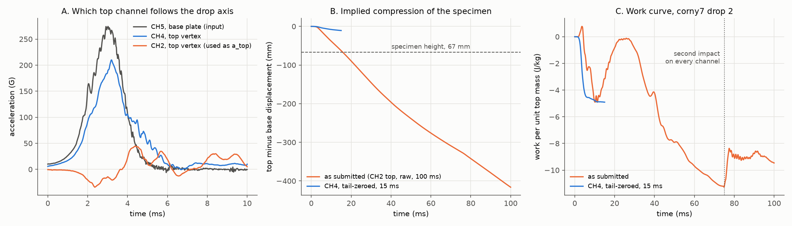
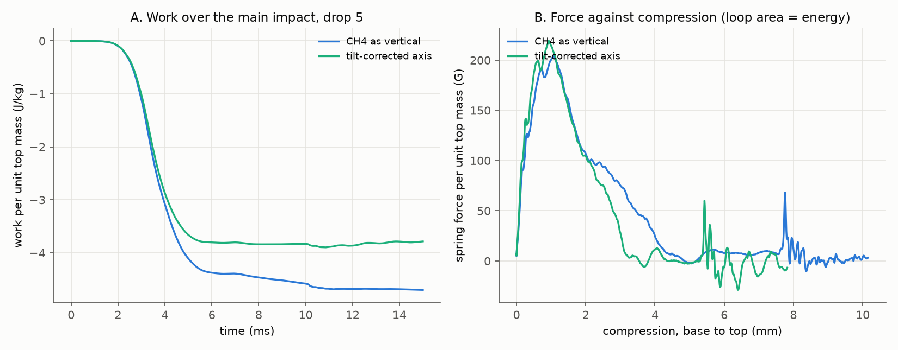
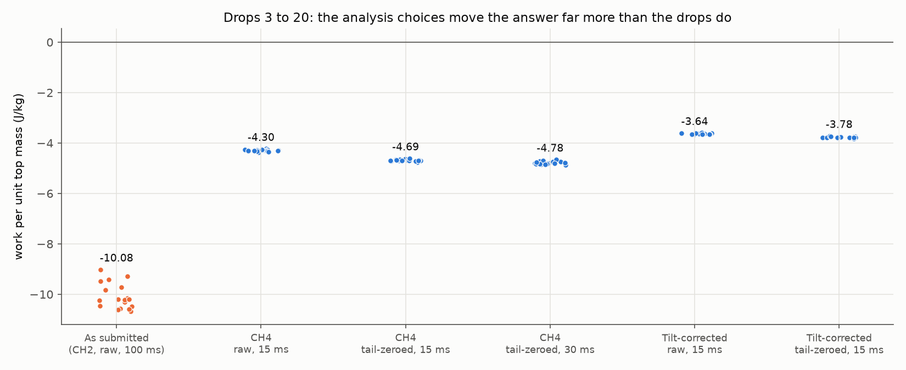
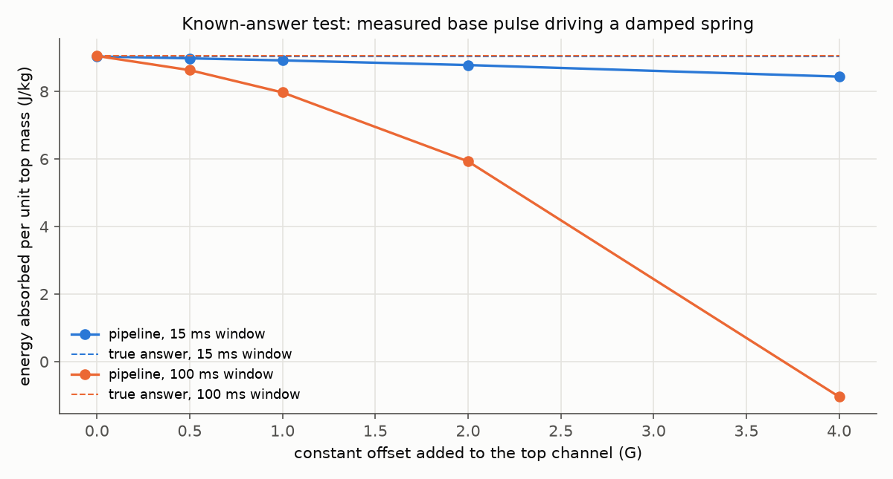

# Review of the work-done analysis of corny7 (issue #114)

Justin's analysis estimates the work done by the tensegrity specimen during a
drop, from the two accelerometers on the drop tower, as a second metric next
to transmissibility (T180). This folder holds his original files, a script
that reproduces and checks his numbers, corrected numbers for drops 3 to 20,
and an Edison Scientific review of the same material.

## Summary

- **The physics in the derivation is right.** Treating the specimen as a
  spring between the base plate and a point mass at the top vertex, the work
  $W = \int F_s\,(v_{top} - v_{bottom})\,dt$ with $F_s = m(g + a_{top})$ is
  the area of the force-compression loop. A negative total is the energy the
  spring took in and did not give back, which is what he set out to measure.
  The integration scheme is also fine.
- **One line in the implementation changes the answer by more than a factor
  of 2.** [`implimatation_or_work.py`](justin/implimatation_or_work.py) line 42
  passes `top1_x` (column CH2) as the top acceleration. CH2 is the top
  sensor's sideways X axis. The vertical axis is CH4 (Z).
- **Integrating 100 ms of raw data turns sensor offsets into most of the
  result.** With the submitted inputs, the top of the specimen ends up 341 mm
  (drop 1) and 416 mm (drop 2) below the base plate. The specimen is 67 mm
  tall. The record also contains a second impact at about 75 ms, which is
  the jump in both of the submitted plots.
- **Corrected, the result is 3.6 to 4.8 J per kg of top mass** (negative
  work, drops 3 to 20), depending on reasonable analysis choices. Drop to
  drop it repeats to 0.03 J/kg. The submitted value is about -10 J/kg.
- **The per-kg number cannot yet be turned into joules absorbed by the
  specimen.** Nothing heavy sits on top. The only mass above the specimen is
  a 0.8 g sensor, its wax, and a cable, against a 19.62 g specimen. A
  point mass on a massless spring does not describe that, and no mass
  estimate fixes it. A known payload on top would.

## Figures

**Figure 1.** The submitted computation on drop 2. (A) CH4 follows the base
plate (CH5); CH2 does not. (B) The top-minus-base displacement implied by the
submitted inputs passes the specimen's full height by 20 ms. (C) The
submitted work curve, including the step at the second impact near 75 ms,
next to the corrected curve.

**Figure 2.** Corrected work over the first 15 ms of drop 5 (A) and the
spring force against compression (B), with CH4 taken as vertical and with the
tilt-corrected axis described below. The area inside the force-compression
curve is the energy. A specimen that springs back should bring this curve
back toward zero compression. It does not: the compression keeps growing
after the force has dropped to zero, which shows the relative displacement
still carries a sensor mismatch even over 15 ms (see "What the corrected
number still depends on").

**Figure 3.** Work per unit top mass for drops 3 to 20 under the submitted
computation and five corrected variants. The spread between variants is
about 15 %; the spread between drops within a variant is under 1 %.

**Figure 4.** A known-answer test. The measured base-plate pulse from drop 5
drives a damped spring (natural frequency 100 Hz, damping ratio 0.15, chosen
so the peak compression is about 6 mm, similar to the data). The absorbed
energy is known exactly. With clean inputs the pipeline recovers it exactly.
A constant offset of the size seen in the raw top channels (1 to 4 G) costs
1 % to 7 % over a 15 ms window and 12 % to over 100 % over the full 100 ms.

## What is right

- **The model and its sign.** On the top mass, $F_s - mg = m\,a_{top}$, so
  $F_s = m(g + a_{top})$. The spring pushes the top up and the base down, so
  the work it does on its two ends is
  $W = \int F_s\,(v_{top} - v_{bottom})\,dt = \int F_s\,dL$, where $L$ is the
  spring's length. Compression ($dL < 0$) with a compressive force gives
  negative work: energy goes into the spring. $-W$ equals the energy
  dissipated if the spring ends the window in the state it started in.
  Otherwise, $-W$ also includes whatever is still stored.
- **The frame.** $W$ depends only on $v_{top} - v_{bottom}$, so the unknown
  impact velocity cancels, and setting `v0 = 0` for both ends is fine for the
  total. The separate "top work" and "bottom work" curves do depend on the
  frame, so on their own they do not mean anything physical.
- **The gravity term, given these sensors.** All channels are AC-coupled
  ICP (integrated circuit piezoelectric) sensors, so the data carry no static
  1 g ([supplementary material](https://github.com/vertical-cloud-lab/tensegrity-optimization/blob/be6b853/manuscript/supplementary.tex)).
  Adding $g$ to the measured acceleration is therefore the right form.
  (If the sensors' low-frequency cutoff were fast compared with the 0.56 s
  free fall, the baseline would drift toward the free-fall reading and the
  $+g$ would count gravity twice.) Either way the term is small: over the
  impact window it is about 2 % of the answer (-4.69 J/kg with it, -4.59
  J/kg without).
- **The quadrature.** Trapezoid velocity, trapezoid displacement increment,
  and a right-endpoint force give -4.671 J/kg, against -4.686 J/kg with a
  trapezoid on the force as well (0.3 %). At 50 kHz the integration rule is
  not a source of error.
- **Working per unit mass.** Because $F_s$ is proportional to $m$, the curve
  per unit top mass needs no mass at all. It is a well-defined quantity of
  the point-mass model.

## Problems, in order of how much they change the answer

| # | Problem | Where | Effect |
|---|---|---|---|
| 1 | CH2 (sideways X axis of the top sensor) used as the vertical top acceleration. CH4 is the drop axis: correlation with CH5 is 0.92 for CH4, -0.64 for CH3, and -0.11 for CH2 (drops 3 to 20). | `implimatation_or_work.py` line 42 | Changes the answer from about -4.3 to about -10 J/kg. Figure 1A. |
| 2 | 100 ms of raw, unzeroed data double-integrated. The raw channels sit well off zero after the impact (70 to 100 ms medians of about +0.8, +4.8, +2.1 and -0.8 G on CH2 to CH5). A constant offset $\epsilon$ adds $\epsilon t^2/2$ to displacement: 1 G over 100 ms is 49 mm. | lines 12 to 19 | Implied displacement of -341 mm (drop 1) and -416 mm (drop 2) on a 67 mm specimen. Figure 1B. |
| 3 | The 100 ms record contains a second impact near 75 ms that shows on every channel, including the base plate. The final value at 100 ms mixes two events. | whole-record integration | The step at 75 ms in both submitted plots. Figure 1C. |
| 4 | Drops 1 and 2 are the session's warm-up drops, which the lab leaves out of averages. | line 34 (`data[:, 0] == 2`) | Small for this specimen. Use drops 3 to 20 and report a mean and spread. |
| 5 | The top mass is not a point mass on a massless spring. There is no payload; the top sensor weighs 0.8 g and the specimen 19.62 g. | the model | Decides what the number means. See "What the number means". |

The implementation reads the CSV correctly otherwise: the time column is
converted from ms to s, and G to m/s² with 9.81.

## Corrected numbers

All values are work per unit top mass over the main impact, drops 3 to 20,
mean (standard deviation across drops). They are computed by
[`review_work_analysis.py`](review_work_analysis.py); per-drop values are in
[`results/per_drop_work.csv`](results/per_drop_work.csv).

| Top axis | Zeroing | Window | Work (J/kg) | Peak compression (mm) | Relative velocity at end (m/s) |
|---|---|---|---|---|---|
| As submitted: CH2 | none | 100 ms | -10.08 (0.51) | 383 to 428 | -3.5 |
| CH4 | none | 15 ms | -4.30 (0.03) | 7.1 | -0.02 |
| CH4 | tail median | 15 ms | -4.69 (0.03) | 10.1 | -0.42 |
| CH4 | tail median | 30 ms | -4.78 (0.06) | 12.1 | 0.07 |
| CH4 × 0.953 | none | 15 ms | -4.74 (0.03) | | -0.26 |
| Tilt-corrected | none | 15 ms | -3.64 (0.02) | 6.7 | -0.42 |
| Tilt-corrected | tail median | 15 ms | -3.78 (0.03) | 7.9 | -0.59 |

- **Tail median** is the lab's zeroing convention: subtract each channel's
  median over 70 to 100 ms. That window contains the second impact, so it is
  not a clean at-rest reference here.
- **CH4 × 0.953** puts the top sensor on the base sensor's scale using the
  side-by-side comparison in [PR #74](https://github.com/vertical-cloud-lab/tensegrity-optimization/pull/74#issuecomment-4673941024)
  (CH5 = 0.953 × CH4 on bare metal).
- **Tilt-corrected** projects the three top channels onto their dominant
  direction during the pulse (1 to 5 ms), about 22 degrees from CH4 toward
  CH3. This is right if the sensor sits tilted in its pocket, and wrong if
  CH3 is real sideways motion of the vertex. The data suggest at least some
  of it is real motion: the ratio CH3/CH4 swings from -0.26 to -0.74 during
  the pulse, and CH3 peaks 0.2 to 0.6 ms after CH4. A T3 prism twists as it
  compresses, so sideways motion at a vertex is expected. The two readings
  bracket the answer.

## What the corrected number still depends on

The relative displacement is a small difference between two large
integrals: each end moves about 65 mm in the falling frame over 15 ms, and
the specimen compresses by a few mm. A 5 % scale difference between the two
sensors is 3 mm of false compression. That is why figure 2B does not close,
and why the variants above disagree by 15 %. The work is less sensitive
than the displacement, because most of the drift builds up after the pulse,
when the force is close to zero.

Three things would pin it down, in order of cost:

1. Measure the top sensor's angle in its pocket (a photograph square to the
   pocket is enough). That settles CH4 against the tilt-corrected axis.
2. Enforce that the top and base end the event at the same velocity and the
   specimen returns to its free height (a boundary-condition drift
   correction), and report how much correction it needed.
3. Measure displacement directly: the Polytec laser vibrometer from
   [PR #28](https://github.com/vertical-cloud-lab/tensegrity-optimization/pull/28)
   on the top vertex, or high-speed video with the checkerboard in frame.

## What the number means for our application

The per-kg result is the energy the specimen takes from a point mass at its
top, per kilogram of that mass. To get joules you would multiply by the top
mass, and that is where the model and the test stop matching:

- The top sensor is a Dytran 3133A4 ([PR #74](https://github.com/vertical-cloud-lab/tensegrity-optimization/pull/74#issuecomment-4792400480))
  of 0.8 g, held with wax at one vertex. There is no payload, and the mounted
  hardware has never been weighed ([PR #97](https://github.com/vertical-cloud-lab/tensegrity-optimization/pull/97#issuecomment-5388795944)).
  With 0.8 g, -4.3 J/kg is about 3.4 mJ, roughly 1 % of the specimen's own
  kinetic energy at impact (0.5 × 19.62 g × (5.3 m/s)² ≈ 0.28 J).
- The specimen is about 25 times heavier than what sits on it, so the force
  at the base is not the force at the top, and $F_s = m(g + a_{top})$ is only
  the force needed to move the sensor. A common fix for a spring with mass
  is to add a third of the spring's mass to the tip mass, but that assumes a
  uniform spring, and a tensegrity is not one.
- The per-kg number is also not specific energy absorption (energy per kg
  of absorber), the usual crashworthiness metric. It is per kg of the mass on
  top.

As a ranking metric for the Bayesian optimization, the corrected per-kg
number is very repeatable (under 1 % across drops) and is computed from the
same channels as T180, so it could be logged as a secondary output once the
analysis protocol is fixed (axis, zeroing, window). It should not be
reported as energy absorbed in joules. The project's earlier review of
energy metrics reached the same conclusion for the current rig and listed
the routes to real joules ([PR #97 review](https://github.com/vertical-cloud-lab/tensegrity-optimization/blob/fb1917c/docs/drop-tower-energy-absorption-review.md)).

**The change that makes Justin's method measure joules: put a known payload
on top.** A rigid plate of known mass, much heavier than the specimen's
moving parts (for example 100 g or more), with the top sensor mounted on it.
Then $F = M(g + a)$ is the real force on the payload, the point-mass model
holds, and the same code returns joules. This is how packaging cushions are
tested (a guided platen of known mass dropped on the cushion, as in ASTM
D1596).

## The polynomial test

[`numarical_work.py`](justin/numarical_work.py) compares the numerical work
against a closed form for a polynomial acceleration, then fits a per-step
correction $u\,a(t) + v$ to the difference. Two findings:

- **The difference being corrected is not numerical error.** The reference
  solution `true_solution` was built with the velocity equal to zero at
  $t = 0$, while the numerical scheme starts from zero velocity at
  $t_0 = -0.66543$ s, where the reference velocity is $v_0 = 0.489$ m/s. That
  offset adds exactly $v_0(g + a)\,\Delta t$ per step, so the fit returns
  $u = v_0\Delta t = 3.9\times10^{-6}$ and $v = v_0 g\,\Delta t = 3.8\times10^{-5}$.
  With the numerical velocity started at 0.489 m/s instead, the work matches
  the reference to within 0.002 J with no correction (the remaining 0.002 J
  is the reference's own value at $t_0$). The correction should be dropped.
- **A clean polynomial cannot catch the problems that matter for the real
  data**: wrong channel, sensor offsets, a second impact, sensor scale
  mismatch. Figure 4 shows the kind of test that can: a simulated specimen
  driven by a measured pulse, with a known absorbed energy, then the same
  errors added on purpose.

A smaller point: for the top mass alone, the work has a closed form,
$W_{top} = m(\tfrac{1}{2}v_{top}^2 + g\,x_{top})$ (the work-energy theorem),
which is a quick check on any "top work" curve.

## Suggested next steps

Required before using this metric to rank designs:

1. Use CH4 for the top vertical acceleration (line 42).
2. Integrate over the main impact only (the first 15 ms), and use drops 3
   to 20.
3. Plot force against compression for every drop and check that the peak
   compression is under the specimen height and that the curve heads back
   toward zero compression.

Optional, in order of value:

4. Replace the polynomial test with the known-answer simulation in
   [`review_work_analysis.py`](review_work_analysis.py) (`synthetic_check`).
5. Measure the sensor's angle in its pocket.
6. Add a known payload mass on top, so the result is in joules.

## Edison review

The same material (both scripts, the derivation, the plots, and the corny7
export) was submitted to Edison Scientific as an analysis task on
2026-09-29. The task id and submit script are in [`edison/`](edison/), and
the results are added there once fetched.

## Files

| File | What it is |
|---|---|
| [`justin/`](justin/) | Justin's files as attached to issue #114: both scripts, the handwritten derivation ([PDF](justin/work-derivation-2026-09-29.pdf), [transcription](justin/derivation_transcribed.md)), his two plots, and [his stated intent](justin/intent.md) |
| [`review_work_analysis.py`](review_work_analysis.py) | Reproduces the submitted numbers, runs the corrected variants and the known-answer test, and draws the figures |
| [`results/`](results/) | Per-drop results, the known-answer test, and a summary |
| [`edison/`](edison/) | Edison submit script, task id, and fetched review |

To rerun: `python analysis/issue-114-work/review_work_analysis.py`. It needs
numpy, scipy, pandas and matplotlib, and downloads the corny7 waveform CSV
from the issue #110 export (commit `5cc4b1e`) on first use.
