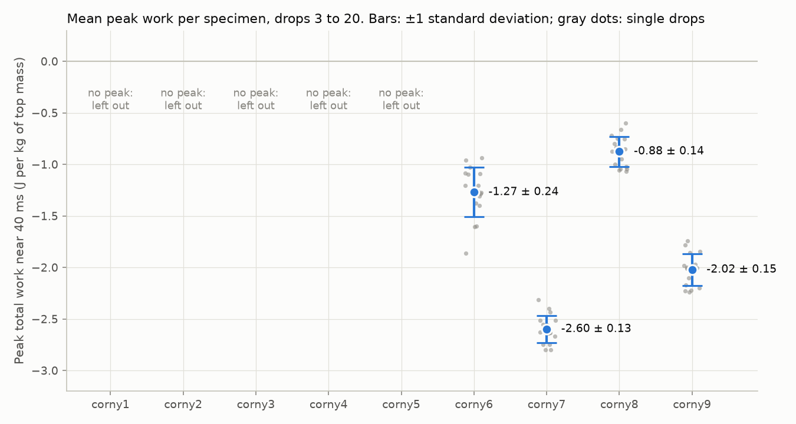
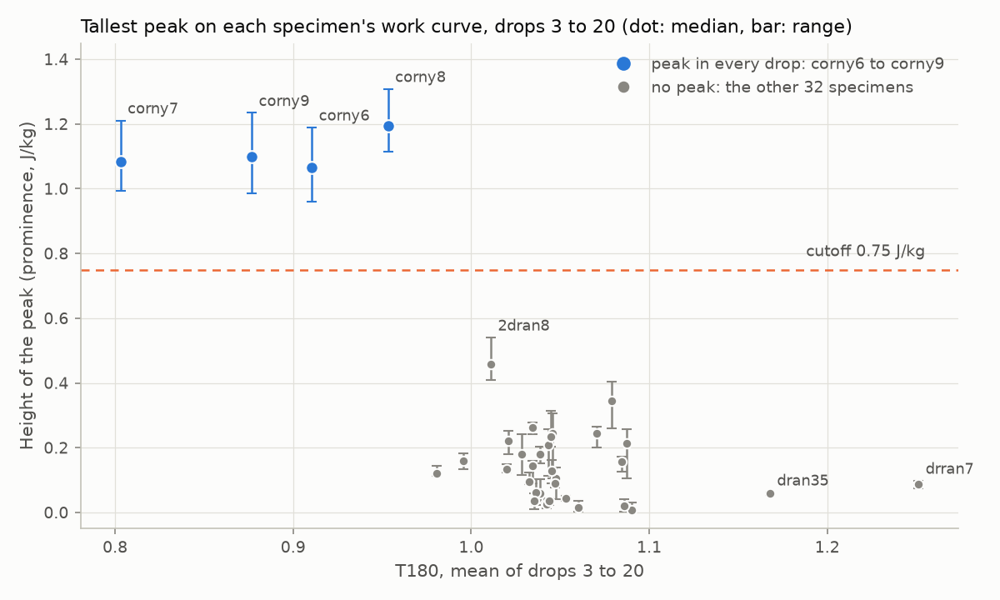
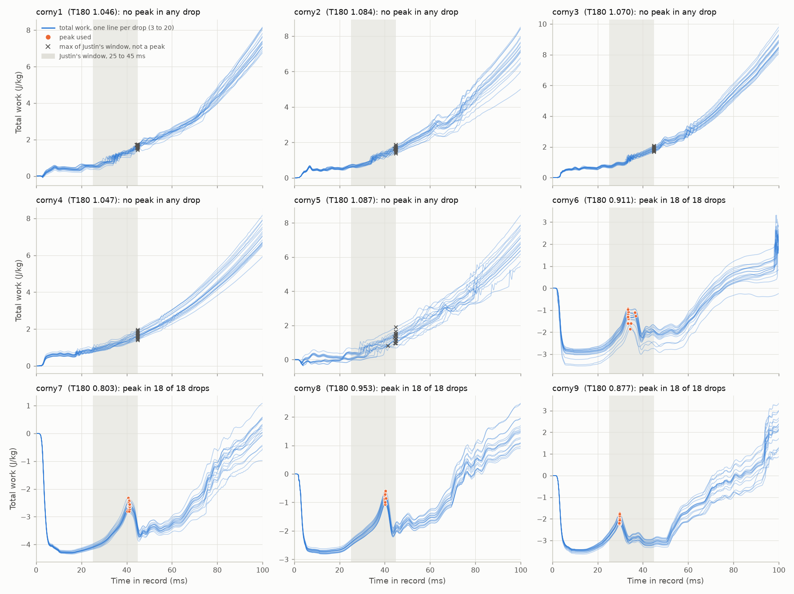
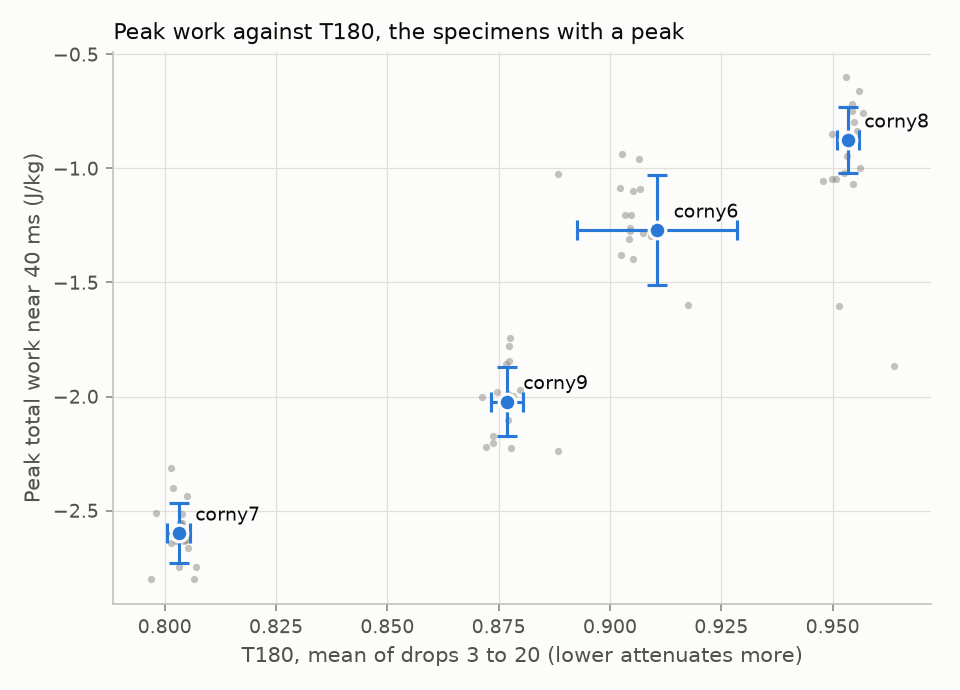

# Peak work near 40 ms for every specimen (issue #114)

Justin asked on 2026-10-06 for his updated work code to be run on every drop
of every specimen, with the peak of the total work near 40 ms taken as each
drop's value, and for the mean and standard deviation of that value per
specimen.

- **corny1 to corny9** are corny7's batch (round 4 of the Bayesian
  optimization): nine specimens, 20 drops each, recorded 2026-09-12 and
  2026-09-14.
- **drran1 to drran9, 2dran1 to 2dran9 and dran31 to dran39** are the three
  prints of round 3, 27 more specimens dropped the same way (2026-09-02 to
  2026-10-02).

All 36 were dropped 20 times from 60 in onto the 1/2 in polyurethane (PU) mat
with the same four accelerometer channels.

## Result

Justin's peak finder works on corny6, corny7, corny8 and corny9: every drop
from 3 to 20 has a clear peak inside his 25 to 45 ms window, and no drop
needed a corrected search. The other 32 specimens (corny1 to corny5 and all
27 round-3 specimens) have no peak in any drop, so they are left out.

| Specimen | Mean (J/kg) | Standard deviation (J/kg) |
|---|---|---|
| corny6 | -1.270 | 0.240 |
| corny7 | -2.599 | 0.133 |
| corny8 | -0.875 | 0.145 |
| corny9 | -2.022 | 0.152 |

Each value is over drops 3 to 20 (n = 18), the drops Justin's loop uses. The
standard deviation uses n - 1. The units are joules per kilogram of top mass,
because Justin's code sets m = 1.

## How each drop was checked

- The work curve is Justin's `numaric_work`, compiled straight out of
  [`justin/implimatation_or_work_2026-10-06.py`](justin/implimatation_or_work_2026-10-06.py)
  and called exactly as his loop calls it (CH4 as the top, CH5 as the bottom,
  m = 1, g = 9.81, v0 = -5.46). The corny7 mean comes out at -2.599 J/kg, the
  same as his plot.
- His peak is `max(work_z[1250:2250])`, the largest total work between 25
  and 45 ms. A pick counts as a peak only if it sits at least 0.5 ms inside
  the window and stands at least 0.75 J/kg above the curve on both sides (its
  prominence). If a pick failed, the script looked for the most prominent
  peak between 15 and 70 ms instead. That fallback found nothing anywhere.
- The 0.75 J/kg cutoff sits in a wide gap: the peaks on corny6 to corny9
  stand 0.96 to 1.31 J/kg tall, while the tallest bump on any of the other 32
  specimens is 0.54 J/kg (2dran8, a small step at positive work).

The 27 round-3 specimens look like corny1 to corny5:
[`figures/05_work_curves_round3.png`](figures/05_work_curves_round3.png).

## Why 32 specimens have no peak

- Their total work dips little or not at all at the impact (specimen means
  of -1.44 to 0.00 J/kg, and -0.26 to 0.00 on corny1 to corny5), against
  -2.7 to -4.3 J/kg for corny6 to corny9, and then climbs for the rest of the
  record. In 479 of their 576 drops, Justin's window maximum is just the
  45 ms edge of the window; in the rest it lands on a small bump. Either way
  his code would return +0.1 to +2.3 J/kg (specimen means).
- CH4 is the vertical axis on all 36 specimens, so the channel is not the
  cause. Over the first 15 ms, CH4 picks up 8 to 19 % more velocity than the
  base plate's CH5 on these 32, against 0 to 3 % on corny6 to corny9. The top
  therefore moves up relative to the base from the start, and the work goes
  positive.
- A massless spring under a point mass cannot give back more energy than it
  took in, so positive work means that model does not fit these specimens. A
  likely reason is that the specimen's own 20 g of struts and cables drives
  the 0.8 g sensor, which the model leaves out.
- The four with a peak are the short, high-twist round-4 designs (about
  67 mm tall, 80 degree twist), and they have the four lowest T180 values of
  the 36: 0.80 to 0.95, against 0.98 to 1.25 for the other 32.

## Other things worth knowing

- **The peak time depends on the specimen.** corny9 peaks at 29.7 ms,
  corny6 at 34.1 ms, corny8 at 40.1 ms and corny7 at 41.0 ms. All four fall
  inside 25 to 45 ms, but a future specimen could peak outside it, so a
  prominence check like the one in `work_all_specimens.py` is safer than a
  fixed window.
- **corny6's peak has two humps** (near 33.5 and 36.5 ms). Three of its 18
  drops (15, 17, 18) take the later hump because it is higher there. corny6
  also scatters most from drop to drop, as its T180 does (coefficient of
  variation 2 %, the batch's highest).
- **The peak work ranks the four specimens in the same order as T180**:
  corny7 loses the most energy and has the lowest T180, then corny9, corny6
  and corny8. That is four specimens, so treat it as a lead. Within one
  specimen the drop-to-drop scatter does not follow T180.
- The warm-up drops 1 and 2 are left out of the averages, as in Justin's loop,
  but they are in the per-drop table.

## Files

| File | What it holds |
|---|---|
| [`results/peak_work_summary.csv`](results/peak_work_summary.csv) | The table above |
| [`results/specimen_details.csv`](results/specimen_details.csv) | All 36 specimens: drops with a peak, mean peak time, lowest work at the impact, the CH4 to CH5 velocity ratio, the window maximum Justin's code returns, and T180 |
| [`results/per_drop_peak_work.csv`](results/per_drop_peak_work.csv) | All 720 drops, with each drop's peak status, value, time and prominence |
| [`waveforms/`](waveforms/) | The 50 kHz waveform CSV of corny1 to corny9, in the same format as the corny7 export, so Justin's script runs on any of them after changing the file name. The 27 round-3 CSVs (94 MB) are not committed; `fetch_waveforms.py` rebuilds them |
| [`work_all_specimens.py`](work_all_specimens.py) | Runs the analysis and draws the figures |
| [`fetch_waveforms.py`](fetch_waveforms.py) | Downloads the 720 captures from Box (about 6.5 GB) and writes `waveforms/`. Its corny7 output is byte-identical to the issue #110 export |
| [`box-ids/`](box-ids/) | Box file ids of each session, copied from the check-ins on PR #86 |
| [`justin/`](justin/) | Justin's script as uploaded on 2026-10-06 |

To reproduce: `python fetch_waveforms.py --raw <scratch folder>`, then
`python work_all_specimens.py`.
