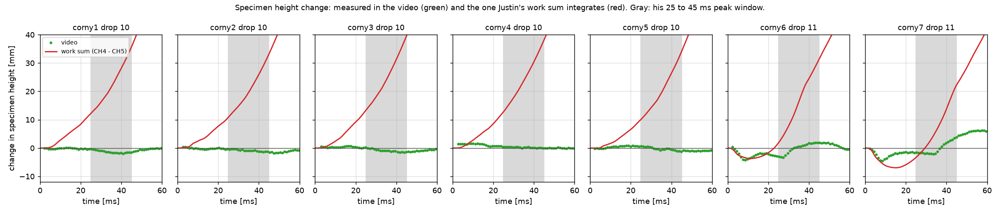

# corny1 to corny6: work graph next to the drop video

Marcus asked on issue #114 (2026-10-06) for the side-by-side video made for
corny7 ([`drop11-video`](https://github.com/vertical-cloud-lab/tensegrity-optimization/tree/8f1998f/analysis/issue-114-work/drop11-video))
for corny1 to corny6, to see what the specimen is doing at each point of the work
curve, and in particular why corny1 to corny5 report positive work.

## Videos

| specimen | drop filmed | video (14 s) | key frames | sync and height check |
|---|---|---|---|---|
| corny1 | 10 | [mp4](corny1_drop10_work_video.mp4), [gif preview](corny1_drop10_work_video_preview.gif) | [png](corny1_drop10_key_frames.png) | [png](corny1_drop10_sync_check.png) |
| corny2 | 10 | [mp4](corny2_drop10_work_video.mp4) | [png](corny2_drop10_key_frames.png) | [png](corny2_drop10_sync_check.png) |
| corny3 | 10 | [mp4](corny3_drop10_work_video.mp4) | [png](corny3_drop10_key_frames.png) | [png](corny3_drop10_sync_check.png) |
| corny4 | 10 | [mp4](corny4_drop10_work_video.mp4) | [png](corny4_drop10_key_frames.png) | [png](corny4_drop10_sync_check.png) |
| corny5 | 10 | [mp4](corny5_drop10_work_video.mp4) | [png](corny5_drop10_key_frames.png) | [png](corny5_drop10_sync_check.png) |
| corny6 | 11 | [mp4](corny6_drop11_work_video.mp4), [gif preview](corny6_drop11_work_video_preview.gif) | [png](corny6_drop11_key_frames.png) | [png](corny6_drop11_sync_check.png) |
| corny7 (for comparison) | 11 | [mp4](corny7_drop11_work_video.mp4) | [png](corny7_drop11_key_frames.png) | [png](corny7_drop11_sync_check.png) |

Each video is laid out like the corny7 one: a 1 s still at 0 ms, the 100 ms
record over 12 s (120 times slower than real time), then a 1 s still at 100 ms.

- **Left, top:** Justin's work graph for that drop, from his `numaric_work`
  copied unchanged from his 2026-10-06 upload
  ([`justin/implimatation_or_work_2026-10-06.py`](justin/implimatation_or_work_2026-10-06.py)):
  CH4 as the top, CH5 as the bottom, m = 1 kg, v0 = -5.46 m/s. The open circle is
  his "peak", the largest total work between 25 and 45 ms. The red line and dot
  move with the video.
- **Left, bottom (new):** the change in the specimen's height. Green dots are
  measured in the video. The red line is the height change inside Justin's work
  sum: the sum of his `dx_top - dx_bottom`, which is CH4 minus CH5 integrated
  twice (v0 cancels). The axis stops at 40 mm, so the red line runs off the top;
  the readout below gives its value.
- **Right:** the camera frame, rotated so down is down, with its frame number
  and the time it was taken.

corny7 is included because it is the specimen whose peak Justin picked, so it
shows what the same panels look like when the work dips and comes back.

## Which drop each clip caught

Each session filmed drops 1, 10 and 20. The camera clock ran 31.45 to 31.50 min
ahead of the recorder (PR #86, corny check-in). Taking that off each clip's
`CreationDate` gives the drop:

| clip | sidecar | camera clock | recorder clock | drop at that time |
|---|---|---|---|---|
| corny1-10th.MP4 | C0247M01 | 2026-09-12 14:47:25 | 14:15:55 to 14:15:58 | 10 (14:15:58) |
| corny2-10th.MP4 | C0250M01 | 2026-09-12 15:04:05 | 14:32:35 to 14:32:38 | 10 (14:32:38) |
| corny3-10th.MP4 | C0253M01 | 2026-09-12 15:20:33 | 14:49:03 to 14:49:06 | 10 (14:49:05) |
| corny4-10th.MP4 | C0256M01 | 2026-09-14 10:49:29 | 10:17:59 to 10:18:02 | 10 (10:17:59) |
| corny5-10th.MP4 | C0259M01 | 2026-09-14 11:06:41 | 10:35:11 to 10:35:14 | 10 (10:35:12) |
| corny6-10th.MP4 | C0262M01 | 2026-09-14 11:24:37 | 10:53:07 to 10:53:10 | 11 (10:53:08) |
| corny7-10th.MP4 | C0265M01 | 2026-09-14 11:42:40 | 11:11:10 to 11:11:13 | 11 (11:11:11) |

Drops 10 and 11 are past the two warm-up drops Justin's loop skips. Neighboring
drops are 40 to 45 s apart, so the pairing is not ambiguous. The drop 1 and
drop 20 clips were not used.

## What the videos show

**corny1 to corny5 (the positive ones).** These are the tall, 40 degree twist
designs (78 to 92 mm tall, 3.9 to 4.6 mm TPU cables). In the video they act like
a solid block: the carriage stops, the specimen rides on it, and the top stays
the same distance from the carriage. No squash is visible at impact, and the
cables stay taut. Measured from the video, the height stays within -2.0 to
+1.6 mm of its value in flight for the whole record, which is about the
tracking noise.

**corny6 (and corny7).** These are the short, 80 degree twist designs (67 mm
tall, 2.5 mm cables). In the video the top drops toward the carriage, the cables
go slack and bow out, and the top tilts. The squash is largest at 8 to 9 ms,
when the highest point of the top is 4.2 mm (corny6) and 4.5 mm (corny7) lower.
The specimen is back to full height, with the cables taut, by about 35 to 40 ms.



| specimen | drop | video: lowest (mm) | video at 15 ms | video at 41 ms | work sum at 15 ms | work sum at 41 ms | velocity change 0 to 15 ms, CH4 / CH5 (m/s) | total work at 15 ms (J/kg) | max of total, 25 to 45 ms (J/kg) |
|---|---|---|---|---|---|---|---|---|---|
| corny1 | 10 | -2.0 at 41 ms | +0.0 | -1.9 | +5.6 | +29.5 | 5.94 / 5.37 | +0.38 | +1.64 at 45.0 ms |
| corny2 | 10 | -1.8 at 47 ms | -0.3 | -1.2 | +4.5 | +27.3 | 5.94 / 5.29 | +0.60 | +1.75 at 45.0 ms |
| corny3 | 10 | -1.5 at 44 ms | +0.6 | -1.4 | +5.5 | +32.9 | 6.10 / 5.34 | +0.71 | +1.99 at 45.0 ms |
| corny4 | 10 | -0.2 at 60 ms | +1.4 | +0.0 | +5.6 | +31.9 | 5.92 / 5.35 | +0.64 | +1.88 at 45.0 ms |
| corny5 | 10 | -1.2 at 45 ms | +0.7 | -0.6 | +3.8 | +27.8 | 5.79 / 5.27 | -0.07 | +1.21 at 45.0 ms |
| corny6 | 11 | -4.2 at 9 ms | -2.1 | +1.6 | -3.3 | +25.8 | 5.43 / 5.24 | -3.47 | -1.60 at 34.7 ms |
| corny7 | 11 | -4.5 at 8 ms | -1.9 | +2.2 | -7.0 | +15.6 | 5.22 / 5.23 | -4.28 | -2.51 at 41.1 ms |

Heights are changes in mm, positive when the specimen is taller. A "max" at
45.0 ms is the edge of Justin's window, not a peak.

## Why corny1 to corny5 come out positive

The work sum multiplies the force on the top, m(g + a_top) from CH4, by how far
the top moves relative to the base, from CH4 minus CH5. Work is positive when
the force pushes the top up while the top moves up relative to the base. For
corny1 to corny5 the video shows the top not moving relative to the base, so
the true work is close to zero. The sum is positive because CH4 and CH5 do not
agree on the motion, in two ways:

1. **During the impact pulse.** Over the first 6 ms, CH4 records a 6 to 9%
   larger velocity change than CH5 (for example 5.83 against 5.48 m/s on
   corny1). In the video the top and the carriage move together: from 3 to
   15 ms their speeds differ by less than 0.1 m/s, while CH4 minus CH5 reaches
   +0.5 to +0.75 m/s by 15 ms. In the sum, the extra puts the top moving up
   relative to the base while the force is largest (CH4 peaks at 270 to
   450 G), so on corny1 to corny4 the work steps up by +0.25 to +0.54 J/kg in
   the first 5 ms instead of dipping. corny5 dips to -0.32 J/kg first.
2. **After the pulse.** From 15 to 100 ms, CH4 reads +2.3 to +3.2 G on average
   and CH5 reads -0.6 to -1.1 G, on all seven specimens. In the video the top
   stays within a few mm of the carriage over that time, which limits any real
   difference in their average accelerations to a few tenths of a G, so the 3.2 to
   3.9 G gap between the channels is sensor error. Integrated twice, a 3.9 G
   gap alone moves the top about 23 mm up relative to the base between 6 and
   41 ms. Multiplied by a force that CH4's offset keeps positive, that is the
   steady climb in the total work from 15 ms onward, and the reason the window
   maximum lands on its 45 ms edge.

The same gap shows on corny6 and corny7, so it comes from the sensors rather
than the specimen. On those two the first 15 ms is different: the specimen
really does squash, and the work sum's height follows the video's down to -3 to
-7 mm, so the dip in the work (to -3.5 and -4.3 J/kg) is real motion. After
about 20 ms the work sum's height climbs past the video's, and by 41 ms it is
13 to 24 mm more than the video shows. So part of the climb from the
dip to Justin's peak on corny6 to corny9 comes from the same drift. The 15 ms
values are less affected.

From the video alone I cannot say which channel is off; that needs a length
scale that does not come from CH5. [PR #74](https://github.com/vertical-cloud-lab/tensegrity-optimization/pull/74#issuecomment-4673941024)
found a 5% scale difference between the two sensors side by side.

## How the video and the graph are synced

Same method as the corny7 video: the green label on the carriage is tracked in
every frame by template matching. Its straight-line fall and its rebound cross
at the centroid of the impact pulse, which CH5 puts at 2.86 to 2.99 ms. That
pins every frame to the accelerometer clock (camera at 959.04 frames/s, so
1.043 ms per frame). The left panel of each `*_sync_check.png` overlays the
carriage path from the video on CH5 integrated twice through the impact; the
sync is good to about half a frame (0.5 ms). For corny7 this gives frame
1016.66 = 2.89 ms, matching the earlier video (1016.63 = 2.89 ms). The numbers
are in each `*_sync.json`.

## How the height change is measured

- In each frame the highest point of the specimen (its top nodes, where the CH4
  sensor sits) is found as the first column of white pixels between the left
  wall and the carriage. The specimen's height change is its distance to the
  tracked label, relative to the median from 50 to 95 ms, when the carriage is
  in the air and the specimen is unloaded.
- The pixel scale (3.9 to 4.6 px/mm) comes from the carriage's change in speed
  in the video matched to CH5's, as for corny7. One pixel is about 0.25 mm.
- Frames before 2 ms are left out. The carriage falls about 20 px per ms, so
  those frames are blurred, and there the tracked height reads 1.8 to 4.5 mm
  low.
- A template track of the top nodes is kept in each `*_video_track.csv` as a
  cross-check. On corny1 to corny5 it agrees with the highest-point track to
  within about 1 mm. On corny6 and corny7 it loses the top once the top twists.
- On corny6 and corny7 the top tilts as it squashes, so its highest point drops
  less than its middle, where the sensor is. Their -4.2 and -4.5 mm are lower
  bounds on the squash at the sensor. The corny7 top also keeps moving after
  40 ms (up to +6 mm at 55 ms), so its zero is uncertain by a few mm.

## Possible next steps (optional)

- Use corny1 to corny5 as a calibration: the video shows their top moving with
  the carriage, so any difference between CH4 and CH5 on those drops is sensor
  error. A drop with both sensors on the carriage would do the same more
  directly.
- Remove each channel's post-impact offset before integrating, or take the
  top-to-base motion from the video, and recompute the work.

## Reproduce

```bash
pip install numpy scipy matplotlib opencv-python-headless imageio-ffmpeg
python make_work_videos.py                 # all seven; or name some, e.g. corny1 corny6
```

On first run this downloads each specimen's 50 kHz CSV (commit `1aff9ff`, the
all-specimens run) and the 240 to 370 MB clips from the lab's Box share into
`_cache/` (ignored by git). The label and the top are found automatically in a
frame 40 frames after the impact guess listed in `SPECS`.
