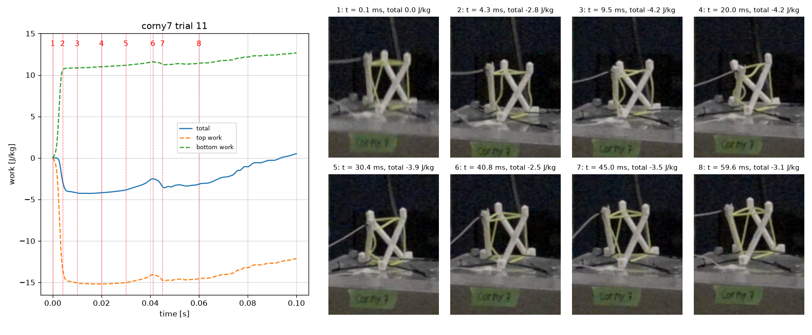

# corny7 drop 11: work graph next to the drop video

Justin asked on issue #114 (2026-10-06) for the work vs time graph on the left,
the drop video on the right, and a red line on the graph that moves with the
video, to connect the graph to how the structure deforms.

**Result:** [`corny7_drop11_work_video.mp4`](corny7_drop11_work_video.mp4),
14 s long: a 1 s still at 0 ms, then the full 100 ms record over 12 s (120 times
slower than real time), then a 1 s still at 100 ms. A smaller, lower-quality
GIF of the same video is in
[`corny7_drop11_work_video_preview.gif`](corny7_drop11_work_video_preview.gif).



## Why drop 11 and not drop 6

No video of drop 6 exists. corny7 was filmed on three drops only, following the
session's procedure of filming drops 1, 10 and 20. The camera clock ran 31.45 to
31.50 min ahead of the recorder on the other clips of that day, and the clip
named `corny7-10th.MP4` (sidecar `C0265M01.XML`) starts at 11:42:40 camera time.
That is 11:11:10 to 11:11:13 on the recorder clock: drop 11 (11:11:11), not
drop 10 (11:10:27). The corny check-in on PR #86 reached the same pairing.

Following Justin's fallback, the graph is regenerated for drop 11 with his
updated code. Drop 11 is not a warm-up drop and behaves like drop 6:

| | drop 6 | drop 11 |
|---|---|---|
| total work at 15 ms (J/kg) | -4.32 | -4.28 |
| largest total work between 25 and 45 ms (J/kg) | -2.63 at 41.5 ms | -2.51 at 41.1 ms |

## How the video and the graph are synced

The camera (Sony RX100 IV at 959.04 frames/s, so 1.043 ms per frame) and the
recorder have separate clocks, so the video is pinned to the accelerometer data
at the impact:

1. The carriage is tracked in every frame by matching the green "corny7" label.
   Before impact it falls in a straight line; after impact it bounces back up.
   For any pulse shape, those two paths cross at the centroid of the impact
   pulse.
2. The same centroid is computed from the base-plate accelerometer (CH5):
   2.89 ms on the recorder clock.
3. So video frame 1016.63 is 2.89 ms, and each frame after it is 1.043 ms
   later. The 0 to 100 ms record spans frames 1014 to 1110.

[`sync_check.png`](sync_check.png) overlays the carriage path from the video on
CH5 integrated twice. They agree through the impact, which is what sets the
sync. Later in the bounce they drift apart by a few mm because the pixel scale
and rebound speed are only approximate, which does not affect the timing. The
sync is good to about half a frame (0.5 ms). [`sync.json`](sync.json) has the
numbers.

## Reading the video

- The camera was mounted on its side. The video is rotated so down is down.
- The red line moves smoothly. The video advances one camera frame per 1.04 ms
  of drop time (every 0.125 s of video), so the fast part of the impact, 2 to
  6 ms, is only about four frames.
- Left: Justin's `numaric_work`, copied unchanged from his 2026-10-06 upload
  ([`justin/implimatation_or_work_2026-10-06.py`](justin/implimatation_or_work_2026-10-06.py)):
  CH4 as the top, CH5 as the bottom, m = 1 kg, v0 = -5.46 m/s. The open circle
  is his "peak", the largest total work between 25 and 45 ms.
- Right: the camera frame number and the time that frame was taken.

## Reproduce

```bash
pip install numpy scipy matplotlib opencv-python-headless imageio-ffmpeg
python make_work_video.py
```

On first run this downloads the corny7 CSV (commit `5cc4b1e`, issue #110) and
the 243 MB clip from the lab's Box share into `_cache/` (ignored by git). The
pixel boxes for tracking and cropping are set for this clip.
