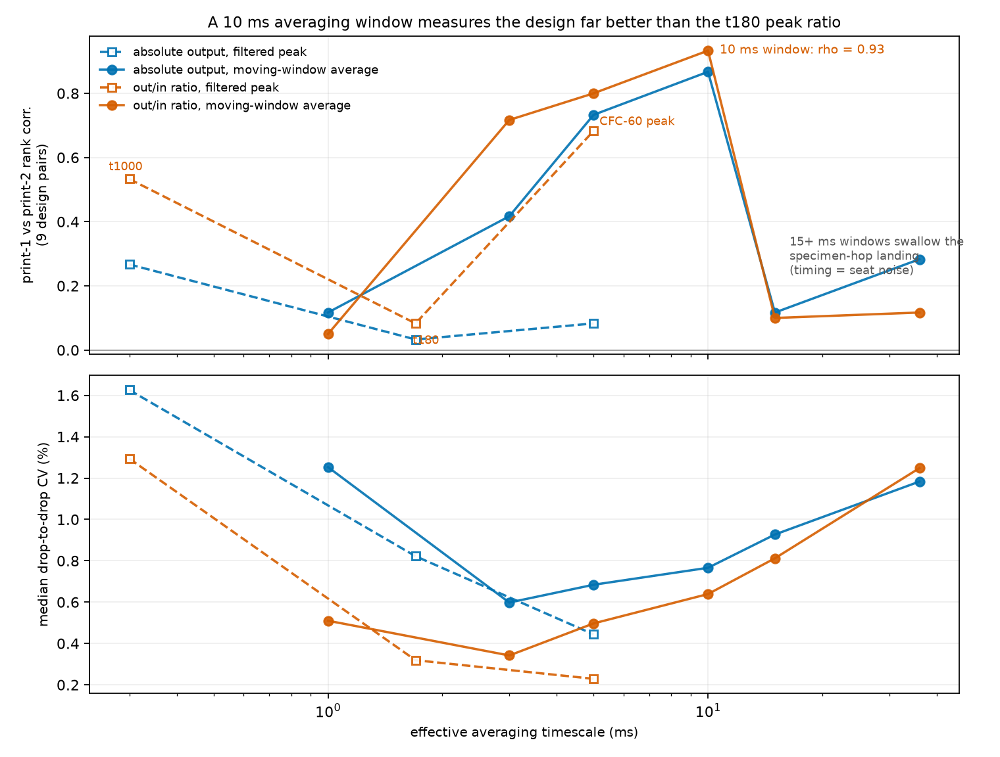
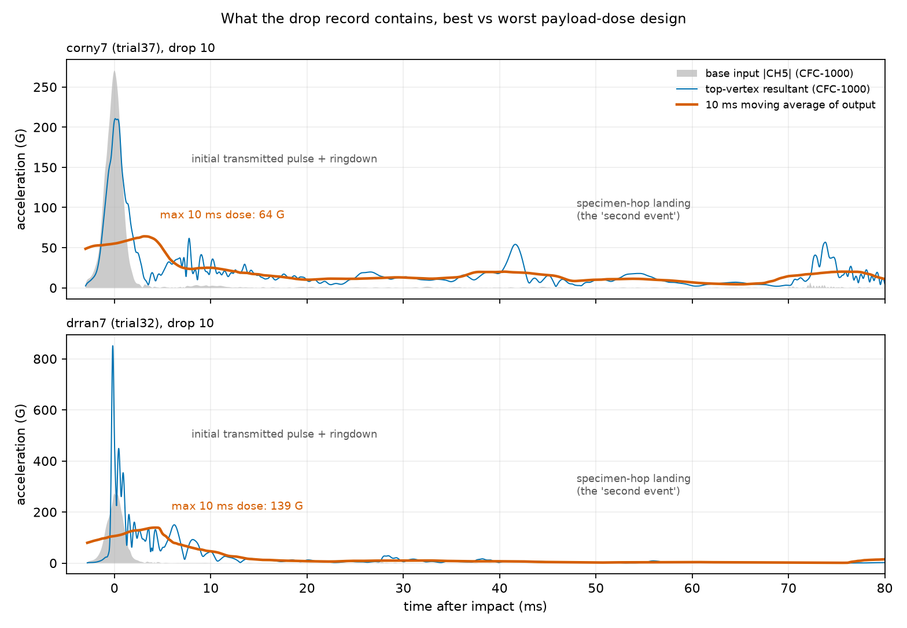
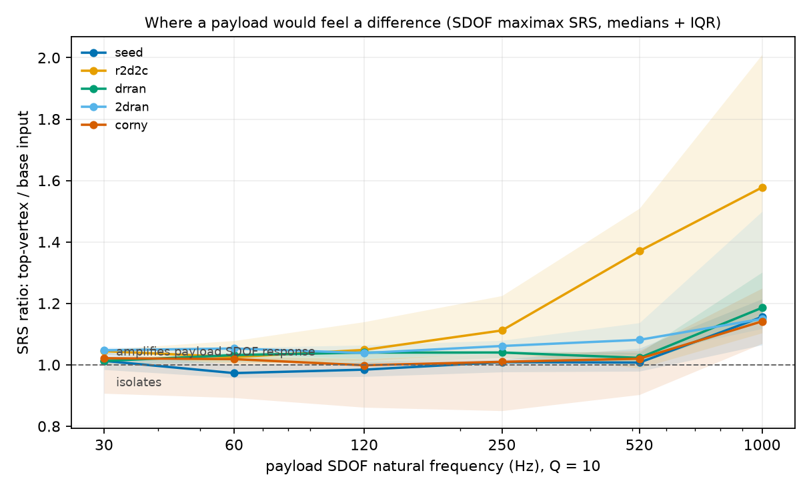
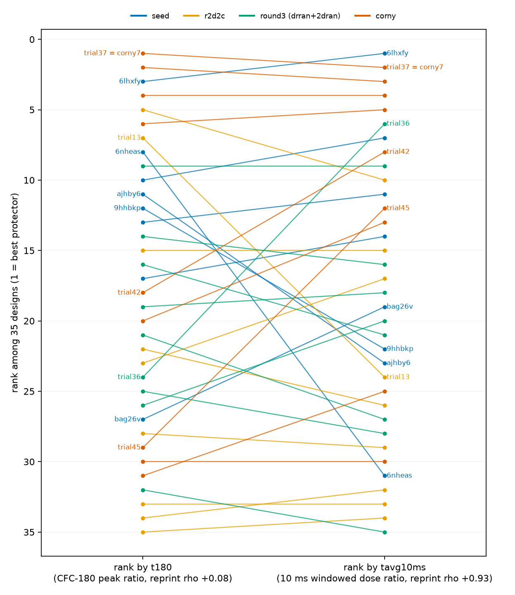

# Payload-protection metrics: time-averaged acceleration on the real campaign waveforms

**Question (PR #111, sgbaird, 2026-09-23):** what if the objective were the
maximum acceleration beyond the initial shock wave, taken over a
time-averaging window (or another noise filter), in the spirit of the
difference between the shock wave in a car crash and the slower
deceleration a person's internal organs feel, which is the framing Jeff
Hill has used for this rig all along? Does that get us closer to payload
protection (an egg drop, issue #46), and should the geometry move from
the T3 prism to the superball?

**Short answer: the proposed metric was computable on the actual campaign
record, so it is computed here rather than proposed.** Every per-drop
waveform of the campaign lives on the lab's public Box share; this audit
pulled 963 captures covering all 45 measured articles, reproduced the
campaign pipeline bit for bit as a control, and then scored the windowed
metrics. The user's instinct is vindicated in a specific, measurable way:
**a 10 ms moving-average dose ranks the designs with print-to-print
reliability +0.93 where the campaign's t180 peak ratio manages +0.08**,
while measuring the same attenuation physics (rho +0.70 against t180,
+0.59 against cable diameter). The organ-timescale metric is not a softer
version of the objective; on this rig it is the better-measured version
of it.

Everything is produced by three deterministic scripts:
[`fetch_campaign_waveforms.py`](fetch_campaign_waveforms.py) (Box
enumeration + selective download),
[`compute_drop_metrics.py`](compute_drop_metrics.py) (per-capture legacy
reproduction + new metrics), and
[`payload_metric_audit.py`](payload_metric_audit.py) (aggregation,
statistics, figures). Inputs and their provenance:
[`data/README.md`](data/README.md). All numbers:
[`metrics.json`](metrics.json) and [`tables/`](tables/).

## 0. Definitions

The bench pipeline already speaks crash-test language: `t180` and `t1000`
are peak ratios of top-vertex to base acceleration after SAE J211 channel
frequency class (CFC) low-pass filters (CFC-180 = 300 Hz, CFC-1000 =
1650 Hz Butterworth, zero phase). The new columns extend that family to
crash-test *dose* metrics, computed per drop on the CFC-1000-filtered
top-vertex tri-axis resultant (output) and base channel (input):

- `out_avg{W}ms_g`, `in_avg{W}ms_g`, `tavg{W}ms`: maximum over the record
  of the W-millisecond moving average, and the out/in ratio, for W in
  {1, 3, 5, 10, 15, 36}. W = 3 ms matches the automotive chest-clip
  timescale; W = 36 ms the HIC36 timescale. This is the "time-averaged
  max acceleration" from the trigger comment.
- `out_clip3ms_g`: the classic 3 ms clip (highest level sustained
  continuously for 3 ms).
- `hic15`, `hic36`: the Head Injury Criterion functional,
  max over windows of (t2 - t1) times (mean a)^2.5 (a in g). Reported as
  a functional only; no injury limit is claimed for a 20 g structure.
- `srs{f}_out_g`, `srs{f}_in_g`, `srs{f}_ratio`: maximax shock response
  spectrum (SRS), i.e. the peak response of a single-degree-of-freedom
  (SDOF) oscillator at natural frequency f (30 to 1000 Hz, Q = 10)
  riding the measured signal; the input-conditioned output SRS is
  exactly what the PR #97 metrics primer recommended as the replacement
  for T.
- `late_avg{3,10}ms_g`: the same moving-average max restricted to at
  least 15 ms after impact, which isolates the *second* event (the
  specimen-hop landing). This is the literal "beyond the initial shock
  wave" reading of the question.

## 1. Provenance: the waveforms exist, and the pipeline reproduces exactly

The campaign's TP4 captures (100 ms at 1.25 MHz, CH2 to CH4 top-vertex
tri-axis, CH5 base input) were never committed (about 20 GB), but every
session sits on the lab's public Box share, and the drop-test branch
committed both the manifests and an anonymous fetch script
(`scripts/fetch_box_shared_folder.py` on
`copilot/add-drop-test-protocol-again`). Enumerating the live share
found all 45 sessions, including two that no committed manifest covers
(`ajhby6` and `r2d2c3` to `r2d2c9`). Selection: every capture of the four
check-in batches (20 to 22 drops each), the first 26 signal numbers of
each 101-drop seed session (the campaign's own drop-count sensitivity
analysis showed first-20 aggregates reproduce full-101 aggregates).

Control: re-running the frozen pipeline on these downloads reproduces the
committed drop-results tables **to relative differences of about 1e-16
for all 36 check-in sessions** (r2d2c, drran, 2dran, corny; t180, t1000,
e_rebound, delta-v alike). The seed batch agrees to 0.7 % on t180 with
the known cause that this audit uses the first ~24 of its 101 drops.
One data quirk worth recording: the `r2d2c8` Box upload nests its
time-domain files as `..._Signal9_SignalN.csv` and names its series
table like a capture; naive `Signal` parsing mis-orders that session
(this audit initially did, and the committed pipeline's
`find_captures` silently drops the whole session if pointed at it).

## 2. The timescale ladder: reliability peaks at 5 to 10 ms, then falls off a cliff

Per metric: design-level span, drop-to-drop noise, and, decisive for an
optimization objective, the print-1 vs print-2 rank correlation across
the nine drran/2dran design pairs (the only reprint replication in the
record). Full table: [`tables/metric_ladder.csv`](tables/metric_ladder.csv).

| metric | timescale | design span | median drop CV | reprint rank corr (9 pairs) | rho vs t180 |
|---|---|--:|--:|--:|--:|
| `t1000` (CFC-1000 peak ratio) | ~0.3 ms | 142 % | 1.29 % | +0.53 | +0.83 |
| `t180` (campaign objective) | ~1.7 ms | 51 % | 0.32 % | **+0.08** | 1 |
| `tavg3ms` | 3 ms | 60 % | 0.34 % | +0.72 | +0.85 |
| `tavg5ms` | 5 ms | 61 % | 0.50 % | +0.80 | +0.83 |
| **`tavg10ms`** | 10 ms | 60 % | 0.64 % | **+0.93** | +0.70 |
| `tavg15ms` | 15 ms | 51 % | 0.81 % | +0.10 | +0.54 |
| `tavg36ms` | 36 ms | 40 % | 1.25 % | +0.12 | +0.20 |
| `srs60_ratio` (SDOF 60 Hz) | ~2.7 ms rise | 27 % | 0.24 % | +0.88 | +0.83 |
| `hic15_ratio` | <= 15 ms | 207 % | 0.88 % | +0.40 | +0.94 |
| `out_avg10ms_g` (absolute dose) | 10 ms | 60 % | 0.77 % | +0.87 | +0.69 |
| `late_avg3ms_g` (hop landing) | >= 15 ms after impact | 177 % | 6.3 % | +0.58 | -0.36 |
| `e_rebound` (campaign objective) | hop timing | 167 % | 2.7 % | -0.18 | -0.31 |

Three structural facts:

1. **The 5 to 10 ms averaging window is the sweet spot.** It spans the
   whole transmitted pulse plus early ringdown, so single-sample peak
   luck (which is what t180 measures at reprint rho +0.08) averages out,
   while the design-driven part of the response is retained. Reliability
   +0.80 to +0.93, and it still tracks t180 (+0.70) and cable diameter
   (+0.59): same physics, measured about an order of magnitude better.
   The t1000-over-t180 reliability advantage found in the adjacent
   sim-correlation audit (+0.53) was a rung on this ladder, not its top.
2. **The cliff at 15 ms is the specimen-hop landing entering the
   window.** The hop's timing (t_second, 20 to 70 ms) has reprint
   reliability -0.13; any metric whose window ingests the 15 to 70 ms
   segment inherits seat noise. This is the same mechanism the
   cross-validation audit identified behind e_rebound's failure, now
   visible as a sharp boundary in window space: impact-anchored windows
   measure the design, hop-spanning windows measure the seating.
3. **HIC inherits peak noise through its exponent.** The (mean a)^2.5
   weighting re-concentrates the functional on the shortest windows, so
   `hic15_out` reliability is +0.20 despite the averaging: dose
   functionals with power-law weighting do not buy the noise immunity
   the plain moving average does. Report HIC, do not optimize it. (In
   this data `hic36 = hic15` for every drop: the optimizing window never
   exceeds 15 ms.)

## 3. Where the dose lives: the initial pulse owns every window up to 10 ms

In 100 % of the 873 stabilized drops the maximum 10 ms window sits on
the initial impact (median window center 3.4 ms after impact). At organ
timescales the metric is still an impact property, just honestly
averaged; nothing later in the record ever dominates it.

"Beyond the initial shock wave" therefore has exactly one other
inhabitant: the specimen-hop landing at 20 to 70 ms, isolated here as
`late_avg3ms_g` (max 3 ms window at least 15 ms after impact). That
channel turns out to be the useful replacement for the broken rebound
objective:

- **Reliable where e_rebound is not:** reprint rank correlation +0.58
  (vs -0.18), because it measures the landing's severity, not its
  ballistic timing.
- **Uncorrelated with e_rebound** (rho +0.05, p 0.79): the timing score
  the campaign minimized was not measuring landing harshness at all.
- **It preserves the competing-objectives structure:** rho -0.36
  (p 0.044) against t180 and -0.43 against cable diameter: articles
  that transmit less of the initial pulse hop harder and land harder.
  The energy-routing trade-off the campaign framed as its Pareto front
  survives in reliable channels, with `tavg10ms` vs `late_avg3ms_g` as
  the measurable version of the pair.

The anatomy figure also shows what the worst tail looks like: the
highest payload dose in the record is `drran7` (design t32, the print
with bubbled TPU tendons), which turns a 270 G input into an 850 G
transmitted spike and a 139 G 10 ms dose, double the best designs. Print
quality owns the worst case, consistent with the reprint record (its
re-print measured ordinary).

## 4. SDOF payload physics: transparent below 120 Hz, and what that means for an egg

The input-conditioned output SRS (the PR #97 recommendation) at Q = 10:

- **At payload-organ frequencies (30 to 120 Hz) every batch sits at a
  ratio of 1.0.** A soft payload's SDOF response is set by the delivered
  velocity change, and the article cannot reduce the delta-v it passes
  along (about 5.3 m/s); it can only spread it in time, and 6 to 33 mm
  of simulated stroke does not stretch 5.3 m/s far enough to matter at
  60 Hz. The structures are transparent to a soft payload.
- **Differences open only near and above the 300 to 550 Hz structural
  mode**, where design (and the r2d2c batch, median srs520 ratio 1.37 vs
  1.03 for every other batch) modulates transmission. A stiffly-coupled
  payload would feel the design; a soft one would not.
- Absolute levels for a hypothetical top-vertex payload: 10 ms dose 64
  to 140 G, 60 Hz SDOF response 150 to 203 G across articles.

The egg-drop arithmetic follows directly. Keeping a payload under
`a_max` through a stop from v = 5.3 m/s needs stroke
`s >= v^2 / (2 a_max)`: about 14 mm at 100 g, 29 mm at 50 g, 72 mm at
20 g, *dedicated to the payload*, on top of what the mat consumes. The
T3 articles' own crush stroke (Tier-C simulated 6 to 33 mm) is at the
bottom of that range, which is why the SRS is transparent: **an egg
survives this rig only with a suspension designed to use most of the
cell height as stroke, which is a design change, not a metric change.**
That is precisely the payload-suspension architecture the superball
family was built around (next section), and it makes the egg drop
(issue #46) a natural phase-2 validation target rather than a bolt-on.

## 5. Objective recommendations

1. **Adopt `tavg10ms` (or `tavg5ms`) as the primary transmission
   objective in any re-scoring or future round.** It is the trigger
   comment's metric, it is drop-in computable from the same pipeline,
   and it converts the objective from one with essentially no
   print-to-print design signal (+0.08) to one with +0.93. The 44
   article values are in
   [`tables/specimen_metrics.csv`](tables/specimen_metrics.csv).
   `srs60_ratio` is the standards-aligned alternative (+0.88) if SRS
   language is preferred for the manuscript; the two rank designs
   similarly (rho +0.77).
2. **Replace e_rebound with `late_avg3ms_g` if a second objective is
   wanted.** It keeps the competing-objectives structure with actual
   reprint reliability, and it directly measures the thing worth
   minimizing (how hard the article slams back down). Its 6.3 % drop CV
   asks for the 20-drop SOP, which the campaign already runs. The
   bungee-cord experiment from the cv-signal audit still applies to it:
   cord state modulates the hop.
3. **Do not optimize HIC**; report HIC15 for payload-facing write-ups.
4. **Ranking robustness result for the campaign's story:** corny7
   (trial37) is top-5 under every variant tried (t180, tavg10ms,
   tavg36ms, absolute dose, HIC15); under the reliable `tavg10ms` it is
   rank 2, with the seed attenuator `6lhxfy` at rank 1. The optimizer's
   headline pick survives the objective redefinition; the mid-field
   reshuffles (t180 vs tavg10ms rank correlation +0.70, vs tavg36ms
   +0.20).

## 6. T3 prism vs superball

Grounded in what the repo already holds: reference geometry
`models/stl/superball_with_payload.stl` and `icosahedron.stl` (issue
#22 branch `copilot/fetch-designs-for-tensegrity-structures`), the
SUPERball v2 actuator brief (issue #47 branch), the Sabelhaus 2015
SUPERball reference in the PR #97 review, and the sim branch's Tier-C
architecture, which takes topology as a node/edge table
(`tprism_geometry`: STRUTS, CABLES), so a 6-bar port is a bounded task
(new table, 6 struts and 24 tendons, plus a suspended payload mass)
rather than a rewrite.

The honest framing: **switching geometry is not a fix for the
measurement problems this audit addressed (those are solved by the
metric), but it is the right move if payload protection becomes the
goal**, because the 6-bar icosahedron is payload-native: the payload
hangs in the center on tendons and the whole diameter is usable stroke,
which is exactly the budget section 4 shows the T3 lacks. Costs to plan
for: roughly double the strut count and support-heavier prints on the
H2D; the vertex key-seat mounting and the bungee strap scheme are
T3-specific and would need a redesign; drop orientation becomes a
variable (face-landing is the superball's design feature, and the
current SOP pins orientation); and the BO campaign restarts in a new
parameter space (the coordinate that dominates here, cable diameter,
plausibly transfers as a prior, and Tier-B/Tier-C sims can screen the
new space for pennies before any print). Recommendation: finish the T3
story re-scored under `tavg10ms`, then run a superball pilot *with the
payload objective and an instrumented payload from day one* (the July
500-drop sessions already ran a bottom tri-axis on CH6 to CH8, so the
TP4 has the spare channels for a payload accelerometer).

## 7. What was searched (per the repo convention)

This branch (ripgrep); all branch tips via blobless mirror (waveform
archives, drop-test pipeline, superball assets, sim topology); the live
Box share (all 45 sessions enumerated, 963 captures fetched); and the
issue/PR record via `gh api` (egg drop #46/#47, metrics primer #97,
SUPERball mentions, drop-test protocol PRs #67/#82/#86). Deleted-file
history was not swept.
