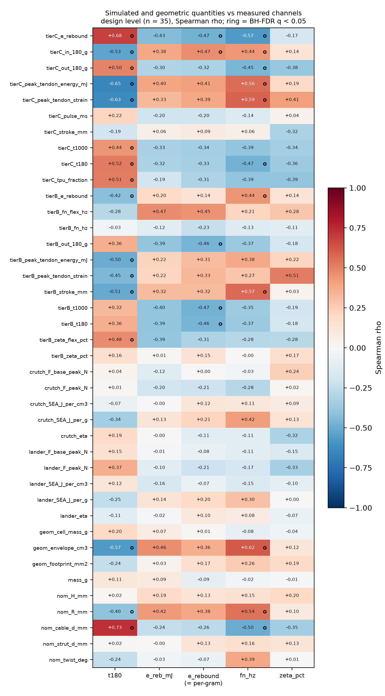
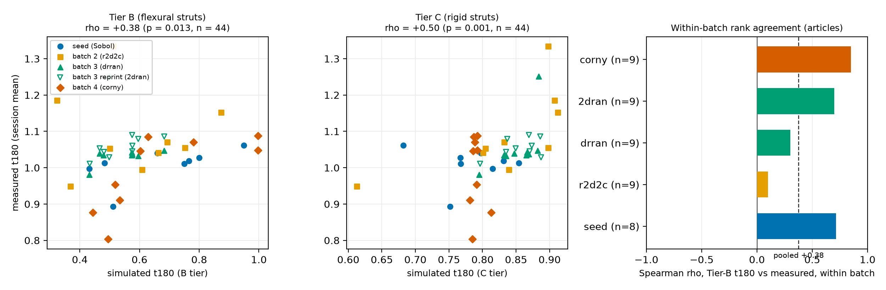
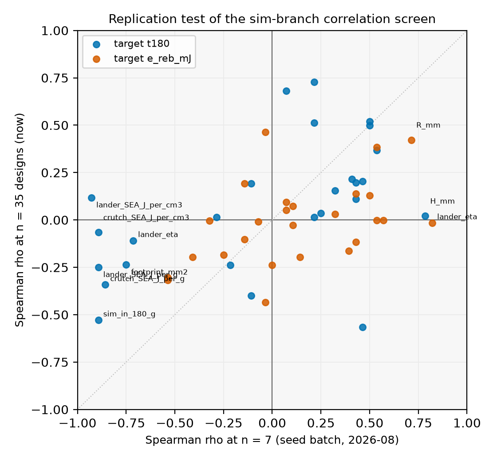
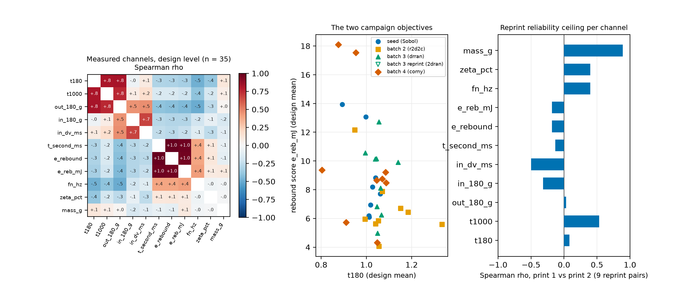

# Simulation-to-measurement correlation audit

**Question (PR #111, sgbaird, 2026-09-23):** bring in the simulation results
from issues #32/#33 and test whether the outcomes simulated there correlate
with the objectives measured on the drop tower; also check every other
prediction quantity discussed across the repo's issues and PRs for
correlations, now that the campaign has 44 measured articles. Special
interest: non-trivial relationships, competing objectives, and quantities
tied to a real performance criterion.

Everything here is recomputed by two deterministic scripts:
[`run_sims_on_articles.py`](run_sims_on_articles.py) re-runs the #33
simulators on every design-mapped article, and
[`correlation_audit.py`](correlation_audit.py) computes every statistic in
this document (Spearman rho with 20,000-draw permutation p, fixed seed;
Benjamini-Hochberg false discovery rate within each target; all numbers in
[`metrics.json`](metrics.json), full tables in [`tables/`](tables/), input
provenance in [`data/README.md`](data/README.md)).

Two structural caveats apply to every correlation below. First, batches 2
to 4 were chosen by the optimizer, so the pooled design cloud is adaptive,
not a random sample of the box; the within-batch statistics (permutations
restricted to batch) are the guard, and both views are reported wherever
they disagree. Second, at 35 designs a screen of this size will hand out
p < 0.05 by luck; the q column (false discovery rate) and the replication
section are the guards there.

## Verdict

1. **Yes, the #33 simulations correlate with the measured objectives**, and
   at n = 35 designs the picture is decisive where n = 7 was suggestive:
   the Tier-C drop-tower analogue's own `t180` tracks the measured `t180`
   at rho = +0.52 (p = 0.0015, q = 0.009), and both cheap tiers separate
   measured attenuators (t180 < 1) from amplifiers at AUC 0.80
   (p = 0.003), essentially matching the trained surrogate's held-out 0.84
   from the cross-validation audit next door. A 2-second simulation with no
   training data does most of what the GP's attenuator screen does.
2. **But partial correlations show the Tier-C signal is coordinate
   mediation, not extra physics.** Controlling for the five design
   coordinates, every Tier-C and regime observable collapses to
   insignificance; controlling for `cable_d_mm` alone does most of that.
   The measured `t180` is dominated by cable diameter (pooled rho = +0.73,
   within-batch +0.58, p = 0.0008: thicker TPU tendons transmit more), and
   Tier-C earns its correlation by responding to cable diameter the way
   the bench does. That is a genuine physics validation, but as a
   *predictor* Tier-C adds nothing a monotone function of the coordinates
   would not.
3. **Tier B is the exception and the sleeper result.** It is the best
   simulated within-batch ranker of `t180` (mean within-batch rho = +0.55,
   permutation-within-batch p = 0.0013, positive in all four batches), it
   retains the only coordinate-independent trace (partial rho = +0.30
   given all five coordinates, p = 0.08), and it is the only tier with
   signal inside the exploit cluster (rho = +0.43, p = 0.010, where Tier C
   reads +0.14). Its pooled article-level rho (+0.38) understates it
   because its bias shifts between design families. Tier C and Tier B rank
   the designs almost independently (rho = -0.14 between them), so they
   are complementary instruments, not redundant ones.
4. **The 2026-08 n = 7 screen mostly does not replicate**, exactly as its
   own multiplicity warning feared. Of its seven p < 0.05 hits, two
   survive at n = 35 with the same sign; the headline recommendation
   ("attach `SEA_J_per_cm3` to the campaign GP", rho = -0.93 then) is
   dead: lander `SEA_J_per_cm3` reads **+0.12** now. The lesson from that
   screen that did generalize is its `rel_span` guard: the two "survivors"
   with tiny simulated spans (`sim_in_180_g`, span 0.4 percent) should
   still be read as numerical degeneracy, not physics.
5. **Nothing simulated predicts the rebound score, and the campaign's two
   measured objectives genuinely compete.** Simulated restitution
   anti-predicts the measured one within every batch (rho = -0.55,
   p = 0.002), a structural result (the calibrated mat owns the loss
   budget, so simulated rebound is inverse mass bookkeeping). On the bench,
   measured `t180` and `e_reb_mJ` are negatively associated in all four
   batches (within-batch rho = -0.33, p = 0.06; article level -0.42,
   p = 0.006): articles that transmit less bounce more. Given the
   cross-validation audit's finding that rebound has no print-to-print
   design signal, the trade-off should be read as physical energy routing
   visible through heavy seat noise, with the bungee-cord question still
   open on top.
6. **The bench's own secondary channels carry real t180 information, which
   kills one proposal and creates another.** Ringdown damping `zeta_pct`
   anti-correlates with `t180` within batches (rho = -0.42, p = 0.027), so
   the standing recommendation of `zeta_pct` as an *independent* second
   objective (adopted when it read rho = +0.07 against `t180` at n = 7)
   loses its independence rationale. Meanwhile `t1000` tracks `t180` at
   rho = +0.82 while being roughly six times more reprint-stable (pair
   rank correlation +0.53 across the nine reprint pairs vs +0.08 for
   `t180`), which makes it the most promising same-physics, lower-noise
   objective variant in the record.
7. **Cleanly null, and worth having on the record:** article mass predicts
   neither objective (rho = +0.11 and +0.09; the e_reb_mJ mass-proxy worry
   from the simulation era does not apply on the bench, where mass spans
   only 24 percent), and the input severity the rig delivers does not
   drive `t180` (rho = -0.05), so the transmissibility ratio is doing its
   job of normalizing out the rig.

## 1. Inputs, and a geometry correction that changes an old conclusion

The measured side is the five committed drop-results tables (44 LOGO
articles across 35 designs, plus `amdjwm`, measured but design-unmapped).
The simulated side re-runs, unmodified, the sim branch's own instruments
at each article's as-printed geometry and weighed mass: Tier C
(`drop_tower_sim`, rigid struts, dead-band tendons, mat calibrated once to
the S0 input pulse), Tier B (`drop_tower_tierB`, six-segment flexural
struts, Kelvin-Voigt tendons, untuned literature loss factors), and the
crutch/lander regime evaluators (`bo_evaluator`), 46 articles and 37
designs in about 2 minutes total.

Building the roster surfaced a data-integrity result worth recording on
its own: the sim branch's 2026-08 article roster simulated the nine r2d2c
articles at the print dimensions of `t3-prism-bo-suggestions-round1.csv`,
a constant-printed-mass projection that was never printed. The campaign's
`t3-prism-bo-round1-designs.csv` (constant-solid-mass manifold, matching
the weighed 17.9 to 23.5 g spread) reproduces the drop-results geometry
columns exactly for all nine articles; the superseded projection is up to
~40 percent off in height. This resolves the "round-2 geometry disagrees
with the print key" note in the sim branch's `tier_promotion.md`, in the
direction opposite to the one it assumed, and it explains that document's
"pooling the round-2 articles destroys the Tier-B correlation
(rho = -0.10)": three of its ten pooled articles were simulated at the
wrong size. At the correct geometry, batch-1 Tier-B values reproduce the
2026-08 run to 3e-14 and the Tier-B correlation survives pooling (section
2). The Tier-A roster on the sim branch inherited the same wrong r2d2c
dims, so its comparisons below are quoted batch-1-only alongside the
polluted pooled number.

## 2. Simulated observables vs measured objectives

Design level (n = 35, reprint pairs averaged), the rows that clear
q < 0.05 with a predictor span above 1 percent, against measured `t180`:

| simulated / geometric observable | rho | perm p | q | rel span |
|---|--:|--:|--:|--:|
| `nom_cable_d_mm` (design coordinate) | +0.73 | 0.00005 | 0.0007 | 0.56 |
| `tierC_e_rebound` | +0.68 | 0.00005 | 0.0007 | **0.013** |
| `tierC_peak_tendon_energy_mJ` | -0.65 | 0.0001 | 0.0010 | 2.07 |
| `tierC_peak_tendon_strain` | -0.63 | 0.00005 | 0.0007 | 1.30 |
| `geom_envelope_cm3` | -0.57 | 0.0006 | 0.0044 | 2.10 |
| `tierC_t180` | +0.52 | 0.0015 | 0.0086 | 0.37 |
| `tierC_tpu_fraction` | +0.51 | 0.0018 | 0.0088 | 1.79 |
| `tierB_stroke_mm` | -0.51 | 0.0024 | 0.0104 | 2.18 |
| `tierB_peak_tendon_energy_mJ` | -0.50 | 0.0031 | 0.0122 | 2.18 |

(`tierC_e_rebound`'s span is 1.3 percent: a rank that strong on a spread
that thin is the `sim_in_180_g` failure mode from the old screen, kept in
the table as the reminder rather than as a finding.) The physical cluster
is coherent: articles whose simulations put more deformation into the
tendon network (higher strain, energy, stroke; larger envelope; thinner
cables; higher TPU share) measured lower transmissibility.

The mediation test is the important part. Rank-based partial correlations
against measured `t180`, design level:

| predictor | raw rho | rho with `cable_d` | partial given `cable_d` | partial given all 5 coords |
|---|--:|--:|--:|--:|
| `tierC_t180` | +0.52 | +0.52 | +0.24 (p = 0.16) | +0.15 (p = 0.39) |
| `tierC_peak_tendon_strain` | -0.63 | -0.84 | -0.07 (p = 0.70) | +0.12 (p = 0.48) |
| `geom_envelope_cm3` | -0.57 | -0.53 | -0.31 (p = 0.07) | +0.19 (p = 0.26) |
| `crutch_SEA_J_per_g` | -0.34 | -0.51 | +0.06 (p = 0.75) | +0.08 (p = 0.63) |
| `tierB_t180` | +0.36 | +0.25 | +0.26 (p = 0.13) | **+0.30 (p = 0.08)** |

Everything Tier C and the regime evaluators know about the bench is
carried by the design coordinates; Tier B is the only instrument with a
residual trace once the coordinates are controlled.

Within-batch (the adaptive-sampling guard; mean within-batch rho over the
four design batches, permutations within batch), against `t180`:
`nom_cable_d_mm` +0.58 (p = 0.0008), `tierB_t180` **+0.55 (p = 0.0013,
positive in all four batches: seed +0.71, r2d2c +0.10, drran +0.57,
corny +0.85)**, `tierC_peak_tendon_strain` -0.52 (p = 0.0035),
`tierC_t180` +0.44 (p = 0.012), `zeta_pct` -0.42 (p = 0.027). Two pooled
correlations that do *not* survive the within-batch view, and should be
treated as between-batch structure: `fn_hz` (-0.48 pooled, -0.20 within,
p = 0.31; the association is corny-only) and `geom_envelope_cm3` (-0.57
pooled, -0.25 within, p = 0.16).

Attenuator discrimination (AUC = probability a random measured attenuator
gets the lower simulated t180): Tier C 0.80 (p = 0.003), Tier B 0.80
(p = 0.003); the LOGO-CV surrogate's equivalent from the adjacent audit is
0.84 (p = 0.002). For rebound, no simulated channel is a usable predictor:
the strongest associations are *negative* (simulated restitution vs
measured `e_reb_mJ`: within-batch rho = -0.55, p = 0.002), and the only
geometric driver with within-batch support is `nom_R_mm` at +0.45
(p = 0.011): wider cells bounce more.

## 3. Replication of the 2026-08 correlation screen

The sim branch's `pr102_correlations.csv` screened ~30 observables against
both objectives at n = 7 and its write-up warned about multiplicity. The
warning was earned. 52 of its pairs are re-testable here; sign agreement
is 73 percent, the rank correlation between old and new rho is +0.50, and
of the seven p < 0.05 hits, two survive at n = 35 with the same sign:

| target | observable | rho at n = 7 | rho at n = 35 | verdict |
|---|---|--:|--:|---|
| t180 | `lander_SEA_J_per_cm3` | -0.93 | +0.12 | dead (was the headline pick) |
| t180 | `sim_in_180_g` | -0.89 | -0.53 | "survives", span 0.4 percent: degenerate |
| t180 | `crutch_SEA_J_per_cm3` | -0.89 | -0.07 | dead |
| t180 | `lander_SEA_J_per_g` | -0.89 | -0.25 | dead |
| t180 | `crutch_SEA_J_per_g` | -0.86 | -0.34 | weakly survives (p = 0.044) |
| t180 | `H_mm` | +0.79 | +0.02 | dead |
| e_reb_mJ | `lander_eta` | +0.82 | -0.02 | dead |

The correction flows one level up: the old screen's conclusion "the
purpose-built analogue is not the best predictor; the incidental regime
observables are" inverts at n = 35. The purpose-built analogue held its
effect size exactly (+0.50 then at p = 0.25, +0.52 now at p = 0.0015);
the incidental observables were the n = 7 noise.

Tier A (PolyFEM, viscoelastic, from the sim branch's 21-article run; 15
completed articles now measured): nothing credible orders the bench.
Batch-1-only (geometry-correct) rows: peak top-vertex g vs `t180`
rho = -0.61 (p = 0.17, n = 7; the sign at least agrees with the single
6lhxfy observation the tier-promotion write-up carried), article
restitution vs measured `e_rebound` rho = -0.05 (n = 7). The pooled
n = 15 restitution number (-0.53, p = 0.043) looks significant but is
built on the nine wrong-geometry r2d2c rows, so it does not count. Tier A
remains a mechanism demonstrator, not a predictor, and it is the most
expensive tier; there is no case here for promoting it into the loop.

## 4. Measured-vs-measured: competing objectives and channel quality

Named pairs (design level n = 35 / article level n = 45 including
`amdjwm`; within-batch p where quoted):

- **`t180` vs `e_reb_mJ`: rho = -0.33 (design, p = 0.049), -0.42 (article,
  p = 0.005), negative in all four batches (within-batch p = 0.06).** The
  campaign's two minimized objectives pull against each other: less
  transmission, more bounce-back. With rebound's reprint reliability at
  -0.18 (below), the honest reading is a real energy-routing tendency
  seen through severe seat noise, not a crisp design law.
- **`t180` vs `zeta_pct`: rho = -0.39 (p = 0.034), within-batch -0.42
  (p = 0.027).** More post-impact damping, less transmitted peak. This
  overturns the n = 7 independence reading that motivated `zeta_pct` as an
  orthogonal second objective; it is partially redundant with `t180`. The
  flip side: the bench ringdown carries transmissibility-relevant
  information, so `fn/zeta` earn their place as logged covariates.
- **`t180` vs `fn_hz`: rho = -0.48 pooled but -0.20 within batch
  (corny-only -0.75).** Between-batch structure; do not lean on it.
- **`t180` vs `t1000`: rho = +0.82.** Same physics, and `t1000` is the
  more design-determined measurement: reprint-pair rank correlation +0.53
  vs +0.08 for `t180` (nine drran/2dran pairs). If a future round wants a
  lower-noise primary objective, `t1000` (or a re-filtered `t180` with the
  same pipeline) is the first candidate to qualify.
- **Nulls that matter:** mass vs either objective (+0.11 / +0.09), input
  peak vs `t180` (-0.05), `in_dv` vs `e_reb_mJ` (-0.23, p = 0.18). The
  rig's input variation is not leaking into the transmissibility ranking.

Reprint reliability per channel (print 1 vs print 2 rank correlation over
the nine reprint pairs; the design-signal ceiling for anything computed
from that channel): `mass_g` +0.89, `t1000` +0.53, `fn_hz` +0.40 (n = 4
pairs), `zeta_pct` +0.40 (n = 4), `t180` +0.08, `out_180_g` +0.03,
`t_second/e_rebound/e_reb_mJ` -0.13 to -0.18, `in_dv_ms` -0.50. Mass is a
design property; the rebound family and the input delta-v behave as seat
noise, consistent with the bungee-cord mechanism flagged in the adjacent
audit.

Process parameters (rounds 3 and 4 varied infill percentages and nozzle
temperatures; n = 18 designs): the four temperature/flow channels all read
|rho| = 0.59 against `fn_hz` with identical magnitude, which is one
collinear axis, and it is confounded with the round split (drran vs corny
used different temperature bands), so it is logged in
[`tables/process_params_design_level.csv`](tables/process_params_design_level.csv)
as a flag for the next print plan rather than interpreted here.

## 5. Inventory: every candidate prediction quantity in the record

From the repo-wide comment sweep (all 110 issues and PRs, 1,481 issue
comments, 127 review comments, dumped via `gh api --paginate` on
2026-09-23) plus the campaign and sim trees. Status of each quantity ever
proposed as an objective or predictor:

| quantity | where proposed / lives | status here |
|---|---|---|
| `t180`, `e_reb_mJ` | campaign objectives | the two targets |
| `e_reb_mJ_per_g` | `bo/t3-prism-bo-objectives-mass-normalized.csv` | rank-identical to `e_rebound`; tested as such |
| `t1000` | drop pipeline | tested; the reliability finding above |
| `out/in_180_g`, `in_dv_ms`, `t_second_ms` | drop pipeline | tested; nulls and tautologies noted |
| `fn_hz`, `zeta_pct` | bench ringdown (PR #74 era), zeta proposed as objective 2026-08-24 | tested at n = 31 to 35; zeta's independence rationale gone |
| Tier-C `sim_t180`, `e_rebound`, tendon strain/energy, stroke, pulse | #33 `drop_tower_sim` | tested at n = 35 (section 2) |
| Tier-B `t180`, `fn/zeta`, strain/energy, stroke | #33 `drop_tower_tierB` | tested; the within-batch ranker |
| Tier-A peak g, restitution, `fn/zeta` | #33 `polyfem_tierA` | tested at n = 7 to 15; null |
| regime `F_peak/SEA/eta/F_base`, crutch + lander | #33 `bo_evaluator` | tested; n = 7 hits dead, `F_peak` span-degenerate as always |
| cell mass / envelope / footprint | #33 fairness analysis, bo_contrast envelope objective | tested; envelope's pooled -0.57 is between-batch |
| `peak_tendon_strain` as objective 2 | strain-era sim campaign | its *measured-side* validation is new here: sim strain tracks bench `t180` at -0.63 pooled / -0.52 within batch |
| process params (infill, temps, flows) | round 3/4 design tables | logged; collinear + round-confounded, not interpretable |
| chamber RH, weather, spool age | session covariates | audited 2026-09-22 on the campaign side (cap ~10 percent of residual RMSE); print-key RH too sparse to add here |
| quasi-static stiffness (load frame) | manuscript plan, PR #76 discussion | **no data yet**; the single best next measurement (breaks the cable-diameter collinearity with a cord-free rig) |
| video-derived rebound height / second-event identity | batch-4 protocol, Edison review | not digitized per article; would arbitrate the rebound timing question |
| shock response spectrum, HIC | discussed in sim/Edison threads | not computed on bench summaries; needs per-drop waveforms |

## 6. What this changes

1. **Retire the "attach regime SEA to the GP" idea** (n = 7 artifact). If
   a simulation prior enters the campaign model, the candidates that
   earned it are Tier-B `t180` (as a rank prior with a per-batch/family
   bias term, since its offset moves between families) and the design
   coordinate `cable_d_mm` itself, which the GP already has.
2. **Tier B, not Tier A, is the tier worth any further effort**, and the
   sim branch should re-run its Tier-B/Tier-A rosters on the corrected
   r2d2c geometry (`round1-designs`, not `suggestions-round1`) if those
   numbers are ever quoted again.
3. **`zeta_pct` moves from "independent second objective" to "logged
   covariate"**; `t1000`'s six-fold reliability advantage over `t180` at
   rho = +0.82 mutual correlation makes it the concrete candidate for a
   lower-noise primary channel in any re-scored or future round.
4. **The measured objective pair genuinely competes** (all four batches),
   so the Pareto framing is earned, but the rebound side of the front is
   built on a channel with negative reprint reliability; the bungee
   experiment in the adjacent audit is what would make that half of the
   front interpretable.
5. **The load-frame (quasi-static) campaign is the highest-value missing
   measurement** for the correlation program: every strong simulated
   predictor is collinear with cable diameter in the sampled cloud, and a
   bench stiffness number is the one cheap measurement that would separate
   compliance physics from the coordinate it rides on.

## Files

- [`run_sims_on_articles.py`](run_sims_on_articles.py): sim driver
  (Tier C + Tier B per article, regimes per design; ~2 min).
- [`correlation_audit.py`](correlation_audit.py): all statistics and
  figures; run `python3 correlation_audit.py` from this directory.
- [`metrics.json`](metrics.json), [`tables/`](tables/),
  [`figures/`](figures/), [`data/`](data/README.md).
