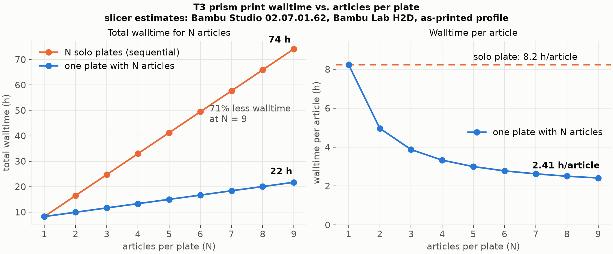

# Walltime gains from batch processing

Answers [issue #108](https://github.com/vertical-cloud-lab/tensegrity-optimization/issues/108)
(opened 2026-08-26): nozzle temperature and volumetric speed are per-plate
settings (one value per nozzle per job, see the round-3 discussion on
[#102](https://github.com/vertical-cloud-lab/tensegrity-optimization/pull/102)),
so plates of one article maximize process-parameter information per Bayesian
optimization round while plates of many articles minimize walltime. This
directory measures that trade-off with the actual slicer CLI for 1 through 9
simultaneous articles.

All numbers are Bambu Studio v02.07.01.62 estimates (the exact version that
produced the as-printed batch file), slicing the as-printed geometry and
profiles: Bambu Lab H2D, 0.6 mm nozzles on both extruders, 0.30 mm layers,
PLA Basic struts on extruder 1, TPU 85A tendons on extruder 2, tree (organic)
supports, print sequence by layer. Setup and reproduction steps are in
[SETUP.md](SETUP.md); raw numbers are in
[batch-walltime-results.csv](batch-walltime-results.csv).

## The sweep: N identical articles on one plate

N copies of Specimen 04 (median printed mass, 20.66 g) per plate, versus
printing the same N articles as N separate single-article plate jobs:

| Articles per plate | Plate time | Per article | Savings vs. solo plates |
|---|---|---|---|
| 1 | 8h 14m | 8h 14m | baseline |
| 2 | 9h 56m | 4h 58m | 40% |
| 3 | 11h 38m | 3h 53m | 53% |
| 4 | 13h 19m | 3h 20m | 60% |
| 5 | 15h 00m | 3h 00m | 64% |
| 6 | 16h 40m | 2h 47m | 66% |
| 7 | 18h 22m | 2h 37m | 68% |
| 8 | 20h 02m | 2h 30m | 70% |
| 9 | 21h 43m | 2h 25m | 71% |

The relationship is linear to within a minute at every N:

    plate time = 6h 33m + 1h 41m per article

The 6h 33m plate constant is the multi-material overhead of dual-nozzle
PLA + TPU printing, and it is per plate-layer, not per article. From the
slicer's own feature accounting, the prime tower takes 4h 07m and flushing
30m on every one of the nine plates (identical to the second at every N),
and the travel intercept contributes roughly another 1h 50m. Each additional
article adds only its own walls, infill, supports, and travel: 1h 41m, about
20% of what the same article costs as a solo plate.

## The real Sobol batch, re-batched

The nine official T-3_01 specimens were printed as nine separate plate jobs
(plates 1 to 9 of the as-printed file). Slicing that file as is, and the same
nine articles re-packed onto two plates (the four largest articles do not fit
a single plate once their measured support envelopes and the wipe tower are
accounted for):

| Configuration | Jobs | Total walltime |
|---|---|---|
| As printed (one article per plate) | 9 | 68h 59m |
| Re-batched (5 + 4 articles per plate) | 2 | 29h 48m |

A 57% walltime reduction on the exact as-printed geometry. The as-printed
file makes the same point internally: its spares plate carries 6 articles in
one 17h 46m job, 2h 58m per article, versus the 7h 40m average of the nine
solo plates.

Filament follows the same pattern because the tower and flush waste is per
plate: 25.9 g of PLA and 18.0 g of TPU per plate regardless of article count.
The nine solo jobs consume 494 g PLA + 216 g TPU; the two-plate version
337 g + 108 g, saving 265 g per round (TPU cut in half).

## What this buys and what it costs per BO round

For a nine-article round, using the identical-article sweep as the yardstick:

| Round shape | Walltime | Levels of the four filament axes | Jobs |
|---|---|---|---|
| 9 plates of 1 | 74h 10m | 9 | 9 |
| 3 plates of 3 (round-3 choice) | 34h 53m | 3 | 3 |
| 2 plates of 5 + 4 | 28h 18m | 2 | 2 |
| 1 plate of 9 | 21h 43m | 1 | 1 |

Each additional plate split costs its 6h 33m overhead again and buys one more
level of the four per-plate parameters (PLA and TPU nozzle temperature and
volumetric speed cap). The two infill axes are per part and stay free at any
batch size. Round 3's 3 x 3 split sits at a reasonable knee: 13h more than
full batching for 3 levels instead of 1; going to full 9 x 1 resolution costs
another 39h.

## Caveats

- These are slicer estimates. They include about 5m of start and end G-code
  per job but not the H2D's real per-job startup (bed leveling, calibration,
  typically 10 to 15 min), cooldown, plate swap, or operator latency between
  sequential jobs. A solo-plate round needs nine human interventions on a
  roughly 8-hour cadence, so real sequential walltime is worse than estimated
  and the batching gain is a lower bound.
- Failure blast radius grows with batch size: one mid-print failure on a
  nine-up plate can scrap nine articles and up to 21h; on solo plates it
  scraps one article and about 8h. A plate-wide event like the post-pause
  artifact ring recorded on specimen 4 in the print key would mark every
  article on the plate.
- The sweep uses Specimen 04, one of the smaller footprints (77 x 75 mm on
  the plate including supports and brim, measured from the G-code). Nine
  identical copies fit one plate; the nine distinct Sobol articles needed
  two. Larger designs pack fewer per plate.
- The CLI arranger is more conservative than the geometry requires (it
  overflows to a second plate past 6 of these articles), so plate layouts
  here are explicit manual grids; the slicer reported no G-code path
  conflicts for any of them.

## Files

- [batch-walltime-results.csv](batch-walltime-results.csv): every sliced
  plate (sweep N=1..9, the two re-batched plates, the ten as-printed plates)
  with times, feature breakdowns, and filament use.
- [batch-walltime-tradeoff.png](batch-walltime-tradeoff.png): the figure
  above, generated by [plot_results.py](plot_results.py).
- [results-json/](results-json): the slicer's per-plate `result.json` with
  feature-type time breakdowns.
- [slices/](slices): the built plates as Bambu Studio projects, for
  inspection or printing: the nine-up Specimen 04 demonstration plate and
  the two re-batched Sobol plates. Analysis artifacts; open in Bambu Studio
  and re-check before sending to the printer.
- [build_plate.py](build_plate.py), [build_group.py](build_group.py),
  [run_sweep.sh](run_sweep.sh), [parse_results.py](parse_results.py):
  the pipeline, documented in [SETUP.md](SETUP.md).
