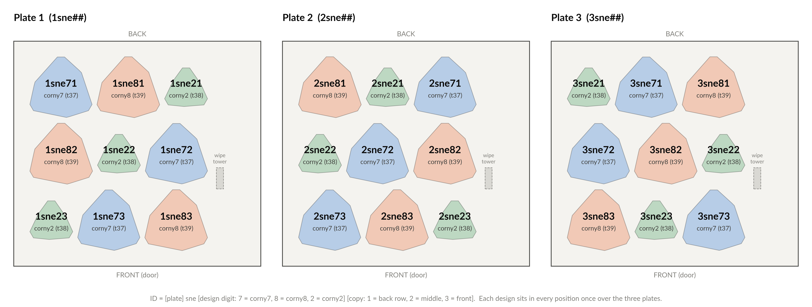
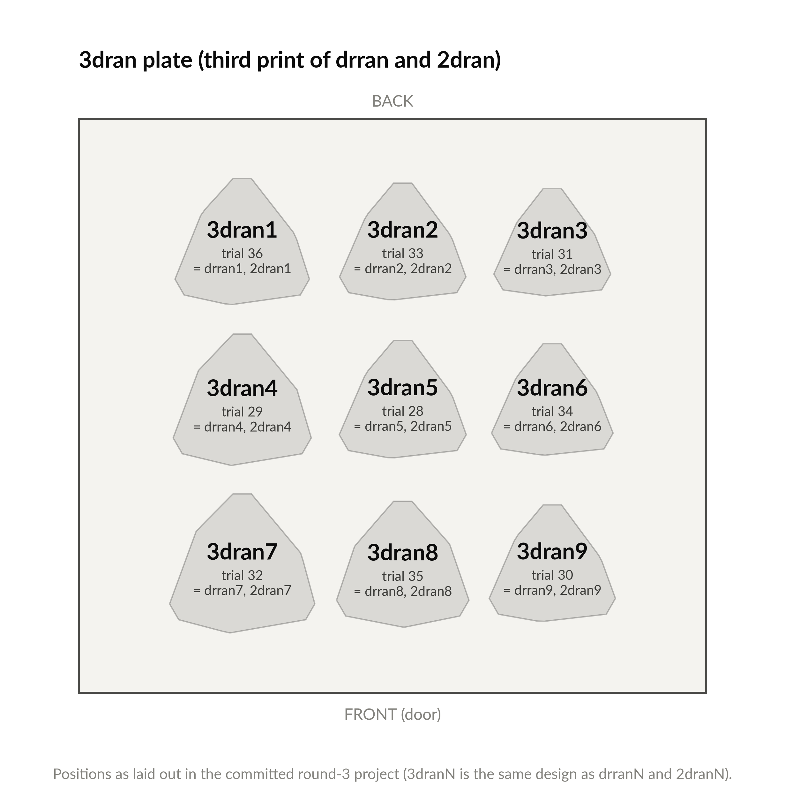
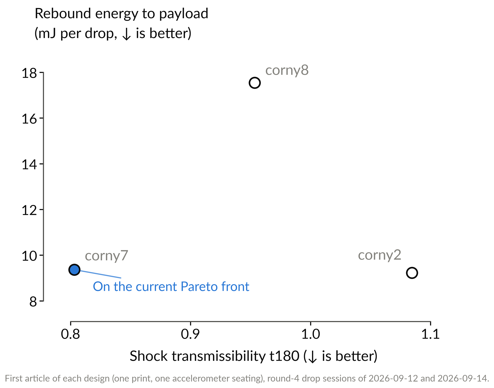

# Replicate study and 3dran reprint: print files

Prepared on 2026-09-28 for @achris0520, as requested by @me-madsen on
PR #102 (comment 5873581840). There are four print jobs:

| Print job | File to open in Bambu Studio | Articles | Filament settings |
|---|---|---|---|
| Replicate plate 1 | [`t3-prism-replicate-sne-plate1.H2D-MM-PLAstruts-TPUcables.3mf`](t3-prism-replicate-sne-plate1.H2D-MM-PLAstruts-TPUcables.3mf) | 1sne71 to 1sne83 | PLA 226 C at 29.5 mm3/s, TPU 236 C at 2.6 mm3/s |
| Replicate plate 2 | [`t3-prism-replicate-sne-plate2.H2D-MM-PLAstruts-TPUcables.3mf`](t3-prism-replicate-sne-plate2.H2D-MM-PLAstruts-TPUcables.3mf) | 2sne71 to 2sne83 | same as plate 1 |
| Replicate plate 3 | [`t3-prism-replicate-sne-plate3.H2D-MM-PLAstruts-TPUcables.3mf`](t3-prism-replicate-sne-plate3.H2D-MM-PLAstruts-TPUcables.3mf) | 3sne71 to 3sne83 | same as plate 1 |
| 3dran reprint | [`t3-prism-3dran.H2D-MM-PLAstruts-TPUcables.3mf`](t3-prism-3dran.H2D-MM-PLAstruts-TPUcables.3mf) | 3dran1 to 3dran9 | PLA 217 C at 20.5 mm3/s, TPU 244 C at 3.6 mm3/s |

Each replicate plate holds three copies of each of the three designs picked
in the [replicate study plan](../t3-prism-replicate-study-plan.md): corny7
(trial 37, on the Pareto front), corny8 (trial 39, further away) and corny2
(trial 38, furthest away). The 3dran plate is a third print of the round-3
plate that was printed as drran1-9 and again as 2dran1-9.

Every file here was built from the slicer project each design was first
printed from, so the geometry, the per-part infill and the filament settings
are the ones that produced corny7, corny8, corny2, drran and 2dran. Nothing
was re-rendered.

## Article IDs on the replicate plates

`[plate]sne[design digit][copy]`, where the design digit is 7 for corny7, 8
for corny8 and 2 for corny2, and the copy digit is the row: 1 = back row,
2 = middle row, 3 = front row. Example: `2sne73` is plate 2, corny7, front
row. The objects in each 3mf already carry these names.



Positions as seen from the front of the printer (left and right as you face
the door):

| Plate 1 | left | center | right |
|---|---|---|---|
| back | 1sne71 | 1sne81 | 1sne21 |
| middle | 1sne82 | 1sne22 | 1sne72 |
| front | 1sne23 | 1sne73 | 1sne83 |

| Plate 2 | left | center | right |
|---|---|---|---|
| back | 2sne81 | 2sne21 | 2sne71 |
| middle | 2sne22 | 2sne72 | 2sne82 |
| front | 2sne73 | 2sne83 | 2sne23 |

| Plate 3 | left | center | right |
|---|---|---|---|
| back | 3sne21 | 3sne71 | 3sne81 |
| middle | 3sne72 | 3sne82 | 3sne22 |
| front | 3sne83 | 3sne23 | 3sne73 |

Every row and every left/center/right column holds one article of each
design, and over the three plates each design sits in each of the nine
positions exactly once. That way a hot or cold spot on the bed cannot show
up in the data as a difference between designs.

**Required: label every article from the plate map before it comes off the
plate, and photograph the labeled plate.** corny7 and corny8 look almost the
same (same wide, high-twist family; the main difference is TPU infill, 21
vs 34 percent), and with three copies of each on a plate there is no way to
tell them apart after the fact.

## Print settings for the three replicate plates

These are the round-4 (corny) plate settings, already written into all three
files. All three designs come from that one plate, so a single set of
filament settings reproduces each design's original print. (Nozzle
temperature and max volumetric speed are per filament, so a plate can only
carry one value of each; that is why the picks were kept within round 4.)

| Setting | Value |
|---|---|
| Printer, nozzle | Bambu Lab H2D, 0.6 mm nozzles, Textured PEI plate |
| Process preset | `0.30mm Standard @BBL H2D 0.6 nozzle` (0.30 mm layers, 2 walls) |
| Struts (left nozzle) | `Bambu PLA Basic @BBL H2D 0.6 nozzle`, 226 C, max volumetric speed 29.5 mm3/s (about 159 mm/s) |
| Cables (right nozzle, TPU High Flow hotend) | `Bambu TPU 85A @BBL H2D`, 236 C, max volumetric speed 2.6 mm3/s (about 14 mm/s) |
| Sparse infill, set per part | corny7: struts 22 %, cables 21 %; corny8: struts 21 %, cables 34 %; corny2: struts 18 %, cables 34 % |
| Supports | off in the files; paint them on as for round 4 |
| Wipe tower | pre-placed at x = 287 mm, y = 110 mm, 10 mm wide (same as round 4) |

Before slicing each plate (required):

1. Check the object list shows nine objects named by article ID.
2. Select any part and confirm its settings list shows "Sparse infill
   density" with the value from the table above. A control slice showed the
   overrides are active in these files (deleting them saves 6.7 g of PLA per
   plate), but check anyway after the file opens.
3. Paint supports, slice, print. Print the three plates as three separate
   jobs, from the same spools if possible, and note the relative humidity for
   each print.

Headless slice check on 2026-09-28 (Bambu Studio v02.07.01.62 command line,
the lab's version; record in
[`t3-prism-replicate-slice-check.json`](t3-prism-replicate-slice-check.json)):
all three plates slice with exit code 0, all nine named objects sliced, no
conflict, out-of-area or nozzle errors, and one expected warning per plate (a
floating cantilever on a corny2 copy, because supports are not painted yet).
Each plate estimates about 14 h 55 min and 175 g PLA + 60 g TPU including the
wipe tower, flushing and brims, before supports.

## 3dran reprint



3dranN is the same design as drranN and 2dranN:

| ID | Trial | Earlier prints (mass with label, g) | Struts infill | Cables infill |
|---|--:|---|--:|--:|
| 3dran1 | 36 | drran1 19.31, 2dran1 19.48 | 34 % | 26 % |
| 3dran2 | 33 | drran2 19.33, 2dran2 19.65 | 29 % | 16 % |
| 3dran3 | 31 | drran3 19.92, 2dran3 20.15 | 18 % | 21 % |
| 3dran4 | 29 | drran4 19.92, 2dran4 20.19 | 13 % | 31 % |
| 3dran5 | 28 | drran5 19.88, 2dran5 20.22 | 21 % | 29 % |
| 3dran6 | 34 | drran6 19.24, 2dran6 19.54 | 16 % | 34 % |
| 3dran7 | 32 | drran7 20.06, 2dran7 20.32 | 24 % | 13 % |
| 3dran8 | 35 | drran8 19.32, 2dran8 19.51 | 26 % | 24 % |
| 3dran9 | 30 | drran9 19.34, 2dran9 19.65 | 31 % | 18 % |

The file is the committed round-3 project
([`../slices/t3-prism-bo-round3.H2D-MM-PLAstruts-TPUcables.3mf`](../slices/t3-prism-bo-round3.H2D-MM-PLAstruts-TPUcables.3mf))
with only the object names changed (`Trial 36` became `3dran1`, and so on)
and the plate label set. The build script checks that every other byte of the
project, including the meshes, the filament settings and the 18 infill
overrides, is unchanged.

Things to know before printing it:

- **The settings are not the replicate-plate settings.** PLA 217 C at 20.5
  mm3/s (about 110 mm/s), TPU 244 C at 3.6 mm3/s (about 19 mm/s). 244 C needs
  the `Bambu TPU 85A @BBL H2D` preset, not the `0.4 nozzle` variant; the file
  already carries the right one.
- **Print it the same way as 2dran.** If you still have the support-painted
  project you printed 2dran from, printing from that is the closest match to
  the earlier prints; use the table above to label. If you print from this
  file, paint the supports the way you did for drran and 2dran.
- **Please post whichever project you actually print from** on issue #98 or
  PR #102. The repo has no copy of the support-painted round-3 project, and
  this is the third print of that plate.
- For the record, not an action item: the command-line slicer stops on this
  file with "No valid nozzle found", and on the committed round-3 original
  too (checked 2026-09-28). The round-3 project was assembled before the
  generator started writing the H2D dual-nozzle machine state, which the GUI
  fills in from the printer; the GUI printed it twice. It is left unpatched
  so the third print uses the same file as the first two.

## Performance of the three picks



Measured first articles, one print and one accelerometer seating each
(round-4 drop sessions of 2026-09-12 for corny2 and 2026-09-14 for corny7
and corny8):

| Design | Trial | t180 | Rebound energy (mJ per drop) | Mass (g) |
|---|--:|--:|--:|--:|
| corny7 | 37 | 0.803 | 9.37 | 19.62 |
| corny8 | 39 | 0.954 | 17.54 | 19.64 |
| corny2 | 38 | 1.085 | 9.22 | 20.21 |

The replicate plates exist to find out how much of that spread is the
design and how much is the individual print and seating. The pre-registered
predictions and the scoring rules are in the
[plan](../t3-prism-replicate-study-plan.md).

## Experiment parameters (set by @sgbaird on PR #102, 2026-09-23)

- Three characteristic designs roughly along the diagonal: one on the Pareto
  front (corny7), one further away (corny8), one furthest away (corny2).
- Three repeats of each design per plate (nine articles per plate), three
  plates, 27 articles in total.
- The question: is there signal, do repeats help the campaign, and do the
  measured ranks follow the predictions (rank correlation).

Drop testing, from the plan (required unless marked optional):

- Record 22 valid captures per article, so that 20 count after the standard
  2-drop discard.
- Interleave designs within a session instead of testing all copies of one
  design back to back.
- Start and end each block with the same reference article (bpx68c, or one
  designated corny7 copy), and log the accelerometer re-seat (wax bed plus
  tape) for every article.
- Weigh and photograph every article, 3dran included.
- Optional: one 10 to 12 drop re-seat re-run of r2d2c3 in the same campaign.

## Other files

- [`t3-prism-replicate-print-key.csv`](t3-prism-replicate-print-key.csv):
  every article ID (27 replicate + 9 3dran) with design, trial, plate, row,
  slot, plate position, infill, filament settings, predicted printed mass and
  the earlier prints of the same design.
- [`stls/`](stls/): the struts and cables STLs for corny7, corny8 and corny2,
  and in [`stls/3dran/`](stls/3dran/) the nine round-3 designs named by 3dran
  ID. These are byte copies of the committed per-trial STLs in
  [`../per-specimen-stls/`](../per-specimen-stls/). Struts are PLA, cables are
  TPU; load a pair together as one object with two parts so they stay
  aligned. The 3mf files above are the easier route.

Everything in this folder is rebuilt, byte for byte, by
[`../t3_prism_replicate_plates.py`](../t3_prism_replicate_plates.py):

```bash
python3 bo/t3_prism_replicate_plates.py
```
