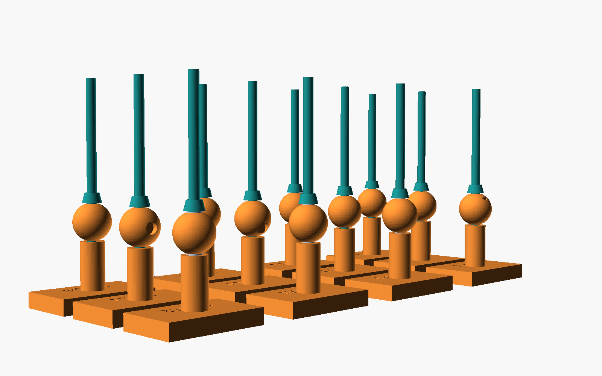
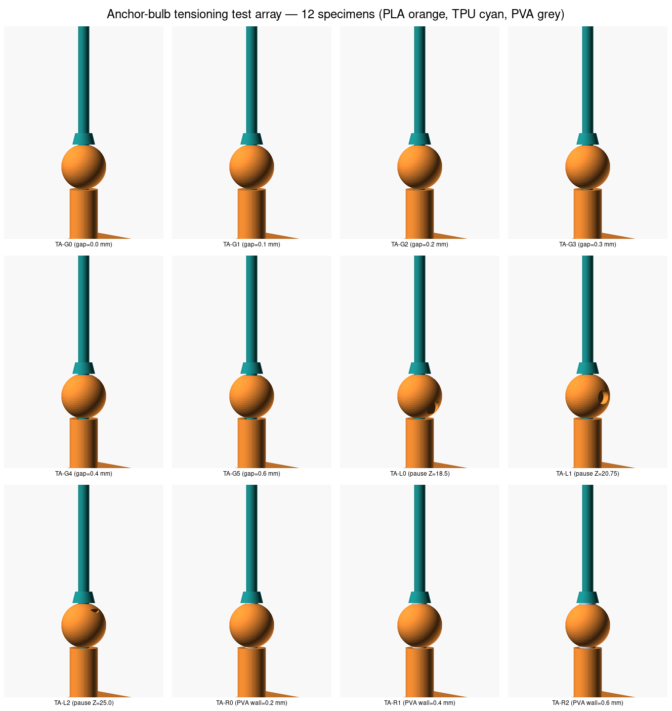
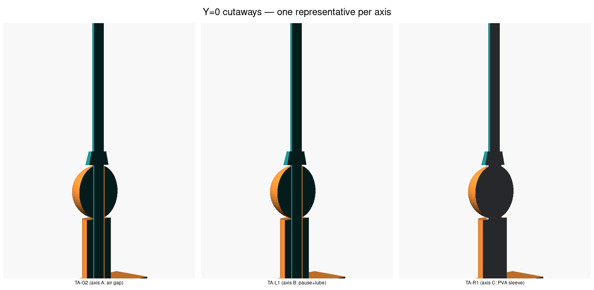

# Anchor-bulb tensioning test print array

A 12-specimen DOE-style print plate that sweeps the three candidate
**PLA-strut → TPU-cable interface treatments** for pre-tensioning the
**A1 frustum / "rivet head"** anchor-bulb joint from
[PR #39](https://github.com/vertical-cloud-lab/tensegrity-optimization/pull/39)
([`cad/joint-design/A_variants/A1_frustum.scad`](../joint-design/A_variants/A1_frustum.scad)).

Closes [#84](https://github.com/vertical-cloud-lab/tensegrity-optimization/issues/84).

## Why we need it

Pre-tensioning the A1 anchor-bulb works by gripping the TPU cable above the
frustum and pulling, so the cable strains until the printed-in-place upset
seats against the +Z face of the PLA node and locks. **This only works if
the bond between the PLA bore wall and the TPU cable inside the bore is
weak enough to fail at a tractable pull force.** Issue #84 names three
candidate ways to weaken that bond; this print plate tests all three at
once so we can pick the winner from a single H2D job.

| Axis | Concept | Treatment varied | Reference |
|---|---|---|---|
| **A** | Air film between PLA and TPU | Radial clearance `gap_r` (mm) | issue #84 bullet 1 |
| **B** | Pause-and-lubricate during print | Pause-Z plane (mm above bed) | issue #84 bullet 2 |
| **C** | Sacrificial 3rd-material sleeve | PVA / BVOH wall thickness (mm) | issue #84 bullet 3 + AMS Pro multi-material |

## Specimen DOE

All 12 specimens share the **A1-frustum joint geometry** from PR #39 Phase-3
(node Ø 9.5 mm, frustum base Ø 4.8 mm = 1.71× pull-through ratio, frustum
top Ø 3.6 mm, frustum height 2.4 mm), the **2.4 mm TPU 85A cable**, the
**6 mm PLA strut**, and a **26 × 16 × 4 mm anchor tab** (clamped in a vise
during the pull test). The only thing that varies between specimens is the
interface treatment.

| ID | Axis | `gap_r` (mm) | `pause_z` (mm) | `sleeve_t` (mm) | Bore Ø (mm) | What it tests |
|---|:---:|:---:|:---:|:---:|:---:|---|
| **TA-G0** | A | 0.0 | — | — | 2.4 | Interference fit baseline (likely tears the cable) |
| **TA-G1** | A | 0.1 | — | — | 2.6 | Minimum air-film hypothesis |
| **TA-G2** | A | 0.2 | — | — | 2.8 | Phase-3 default (PR #39) |
| **TA-G3** | A | 0.3 | — | — | 3.0 | Slight extra clearance |
| **TA-G4** | A | 0.4 | — | — | 3.2 | Loose fit |
| **TA-G5** | A | 0.6 | — | — | 3.6 | Very loose — does the upset still self-centre? |
| **TA-L0** | B | 0.2 | 18.5  | — | 2.8 | Pause + lube *before* the bore — full-length lube film |
| **TA-L1** | B | 0.2 | 20.75 | — | 2.8 | Pause + lube at the *node centre* — partial lube zone |
| **TA-L2** | B | 0.2 | 25.0  | — | 2.8 | Pause + lube *just before* the upset — only upset/node interface |
| **TA-R0** | C | 0.0 | — | 0.2 | 2.8 | Thinnest survivable PVA sleeve |
| **TA-R1** | C | 0.0 | — | 0.4 | 3.2 | Mid PVA sleeve |
| **TA-R2** | C | 0.0 | — | 0.6 | 3.6 | Thick PVA sleeve — easy water release, more cable rattle |

`pause_z` is the absolute Z height of an embossed 3 mm × 1.6 mm fingertip
well on the +Y side of the strut/node, at the layer where the operator
should pause the print and apply lubricant (recommended: PTFE dry spray;
fall-back: silicone oil; cheap fall-back: a dab of mineral oil on a
cotton-bud tip).

## Renders

Iso view of the full plate (12 specimens, 3 × 4 grid, 35 mm pitch X × 20 mm
pitch Y, ~115 × 75 mm footprint — fits any H2D plate with room to spare):



Iso contact-sheet with each specimen labeled:



Y=0 cross-section through one representative specimen of each axis (PLA
bore-and-cable interface, pause-well, and PVA sleeve are all visible —
note: OpenSCAD 2021.01 preview shades cut interiors dark; the orange/cyan
edges are the meaningful boundaries):



Per-specimen iso PNG, Y=0 section PNG (TA-G2 / TA-L1 / TA-R1), and
**STL** (one per specimen + `tensioning_array.stl` for the whole plate)
also live in `renders/`.

## Print recipe (Bambu H2D + AMS Pro)

| Slot | Material | Used in | Notes |
|---|---|---|---|
| 1 | **PLA** (any brand) | tab + strut + node + bore | per issue #45 |
| 2 (dedicated) | **TPU 85A** (NinjaFlex-class) | cable + frustum upset | dedicated nozzle, no purges |
| 3 | **PVA** (or BVOH) | sleeve in TA-R0 / R1 / R2 only | only loaded for the C-axis specimens |

- **Layer height** 0.2 mm (matches the 6-layer frustum height = 2.4 mm)
- **Wall count** 3 perimeters everywhere
- **Brim** 5 mm on the tab footprint to keep specimens bed-bonded during the
  pull test prep
- **Pause M-codes** for axis-B specimens: insert an M0/M601 at slicing
  time at Z = 18.5 mm (TA-L0), Z = 20.75 mm (TA-L1), Z = 25.0 mm (TA-L2).
  The embossed fingertip well is the visual cue for where to apply lubricant.

## Pull-test protocol

1. Snip the brim. **For the C-axis specimens (TA-R0/R1/R2)** soak the
   plate in tap water at room temperature for 30–60 min, agitating gently,
   until the PVA sleeve washes out of the bore. Pat dry.
2. Clamp the PLA tab in a vise (long axis horizontal, frustum pointing up).
3. Grip the TPU pull handle ~25 mm above the frustum with a hand-held
   force gauge (e.g. Mark-10 M5-2 or AOSITE 50 N).
4. Pull steadily upward at ~10 mm/s and record the **peak force** at the
   instant the upset seats against the +Z node face. This is the
   pre-tensioning load `F_pre`.
5. Inspect: did the cable tear (failure), did the upset deform plastically
   (suboptimal), did the upset seat cleanly with the cable still able to
   carry tendon load (success)?

**Success criterion:** smallest `F_pre` that still reliably seats the
upset without cable damage, ideally in the 5–25 N range so a human can
pre-tension by hand.

## Reproducing the renders

```sh
bash cad/anchor-bulb-tensioning-array/render.sh
```

Outputs land in `cad/anchor-bulb-tensioning-array/renders/`: 12 `*_iso.png`,
3 `*_section_Y_iso.png`, 12 `*.stl`, the full-plate `tensioning_array_iso.png`
+ `tensioning_array.stl`, and three contact-sheet montages
(`all_specimens_montage.png`, `section_montage.png`).

Requires `openscad` and `imagemagick` (`montage`); on a headless runner it
auto-wraps in `xvfb-run`.

## File layout

```
cad/anchor-bulb-tensioning-array/
├── _common.scad              shared geometry + parameterised specimen module
├── tensioning_array.scad     all 12 specimens on a single build plate
├── TA-G0.scad … TA-G5.scad   axis A (air gap, 6 specimens)
├── TA-L0.scad … TA-L2.scad   axis B (pause + lubricant, 3 specimens)
├── TA-R0.scad … TA-R2.scad   axis C (sacrificial PVA sleeve, 3 specimens)
├── TA-G2_section_Y.scad      Y=0 cutaway of one representative per axis
├── TA-L1_section_Y.scad
├── TA-R1_section_Y.scad
├── render.sh                 builds renders/ from the SCAD sources
├── renders/                  PNGs, STLs, and contact-sheet montages
└── README.md                 this file
```

## Open questions / next steps

- The DOE assumes the three axes are independent. If pull-through fails on
  every axis A specimen, the next plate should add **factorial combinations**
  (e.g. air gap × pause+lube) rather than another single-axis sweep.
- All specimens print with the cable axis vertical and the frustum on top.
  The horizontal-cable orientation (cable along +X with the strut along +Z,
  matching `cad/joint-design/A_variants/A1_frustum.scad`) is also worth
  testing once we have a winning interface treatment, because the H2D IDEX
  toolchanger behaves differently for horizontal vs vertical TPU cables.
- The anchor-bulb is the **lander / egg-drop primary** joint per PR #39's
  lander-context recommendation. The winning interface treatment from this
  array directly feeds the next-generation lander prototype and the
  unit-cell builds in [#43](https://github.com/vertical-cloud-lab/tensegrity-optimization/issues/43).
