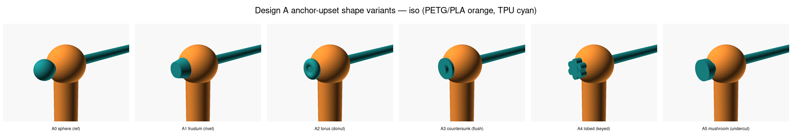
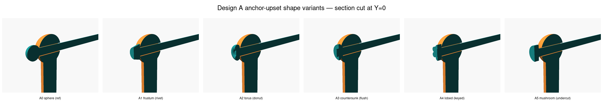
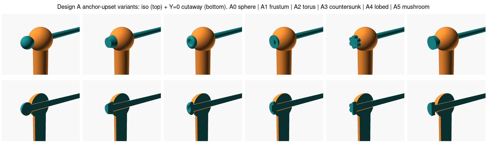

# Design A — anchor-upset shape variants

Background: the original [`A_anchor_bulb.scad`](../A_anchor_bulb.scad) uses a literal sphere as the printed-in-place TPU upset on the far side of the bore.  As discussed in PR #38 ([comment 4445476374](https://github.com/vertical-cloud-lab/tensegrity-optimization/pull/38#issuecomment-4445476374)), "bulb" is just shorthand for *any* printed-in-place upset that's wider than the bore, and a sphere is the laziest defensible shape rather than a principled optimum.  With FFF design freedom several alternatives are plausibly better.

This folder visualizes five alternative upset shapes head-to-head against the spherical reference.  Geometry shared by every variant (from the Phase-3 ANALYSIS `19e0c868` refinement):

| Parameter | Value |
|---|---|
| Node OD (PETG/PLA sphere) | 9.5 mm |
| Through-bore Ø | 2.8 mm (0.4 mm clearance over a 2.4 mm cable) |
| Cable Ø (TPU 85A) | 2.4 mm |
| Reference upset OD | 4.8 mm (1.71× bore — the pull-through ratio target) |

The only thing that changes between variants is the **shape** of the TPU upset on the +X side.

## Variants

| # | File | Concept | Functional advantage over A0 sphere |
|---|---|---|---|
| **A0** | [`A0_sphere.scad`](A0_sphere.scad) | Spherical bulb (the existing reference) | Baseline. ~3.4 mm² projected bearing area; zero free design parameters beyond OD. |
| **A1** | [`A1_frustum.scad`](A1_frustum.scad) | Truncated cone / "rivet head" | Flat bearing annulus = 6.0 mm² (~75 % more than A0 sphere at the same OD); flat top lays down cleanly on the H2D top-layer pass. |
| **A2** | [`A2_torus.scad`](A2_torus.scad) | Donut / torus | Bearing load distributed over the inner curve of the torus → lower peak contact stress than the spherical cap, especially under the n≥20 Bruceton drops of the lander demo. |
| **A3** | [`A3_countersunk.scad`](A3_countersunk.scad) | Conical head mating a 90° countersink in the bore | **Flush** — no protruding feature to snag on impact; conical flank self-centres the cable as the joint loads up. Conical wall area ≈ 8.8 mm² (~2.6× A0). |
| **A4** | [`A4_lobed.scad`](A4_lobed.scad) | 6-lobed star / "knurled" head | Rotational keying — the upset can't spin against the bore exit during repeated drops (relevant for `N_reuse` over Bruceton n≥20). |
| **A5** | [`A5_mushroom.scad`](A5_mushroom.scad) | Mushroom / tee-head with a 0.4 mm radiused undercut | Maximum mechanical interlock per gram of TPU.  Pull-through requires necking the TPU at the cap base (well clear of the bore-lip stress riser per Frascio 2024). |

## Renders

Iso-only contact sheet:



Y=0 cutaway:



Iso + Y=0 cutaway grid (most useful single image):



## Reproducing the renders

```sh
bash cad/joint-design/A_variants/render.sh
```

Outputs land in `cad/joint-design/A_variants/renders/` — six `*_iso.png`, six `*_section_Y_iso.png`, six `*.stl`, and three contact-sheet montages (`all_variants_{iso,section,grid}_montage.png`).  Requires `openscad` and `imagemagick` (`montage`); on a headless runner it auto-wraps in `xvfb-run`.

## Notes / open questions for the next Edison pass

The five variants above cover the *shape* design space, but the print-process / topology design space has two more axes worth exploring before a final choice:

1. **Mating the bore mouth, too** (e.g. lobed bore + lobed head for full rotational lock, or matching countersink at *both* ends so a single cable threads two nodes flush).  Currently only A3 and A4 modify the head; the bore stays round in every variant.
2. **Print orientation** — the upset shape that prints best with the cable axis vertical (well-defined top-layer cap, supports under any overhanging undercut) may not be the one that prints best with the cable axis horizontal (matters for IDEX with TPU on the second extruder).

Both are now in scope for the pending Phase-4 Edison ANALYSIS `e9a1f4cc` (per-design vision review) and `LITERATURE_HIGH f9804247` (project-context recommendation).
