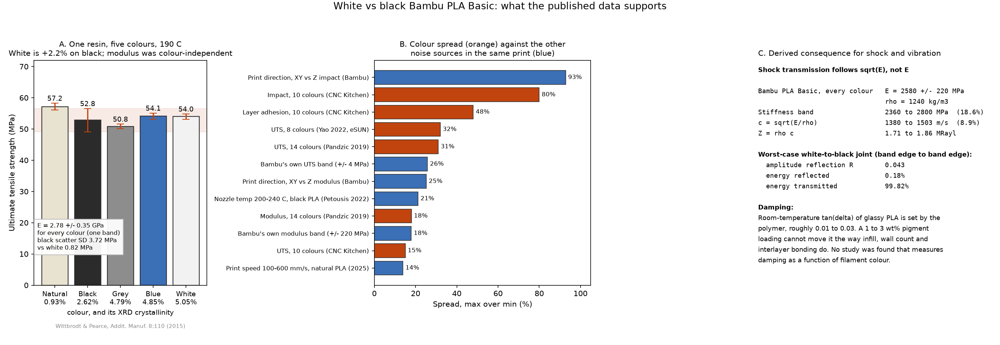

# White vs black Bambu PLA Basic: does colour change stiffness or shock transmission?

Short answer: **stiffness, no. Strength and printability, a little, and mostly through
the print process rather than through the polymer. Damping and shock transmission, no
direct evidence either way, and physics says the effect has to be small.**

The question came up in [PR #66](https://github.com/vertical-cloud-lab/tensegrity-optimization/pull/66):
Bambu PLA Basic is one product line sold in about 30 colours, so if white and black
behave differently that would matter both for the printed struts and for any
shock/vibration measurement on the finished tensegrity.

Reproduce the figure and the numbers with:

```bash
pip install matplotlib numpy
python cad/materials/pla_colour_property_review.py
```



## 1. What Bambu publishes

The [PLA Basic Technical Data Sheet](https://wiki.bambulab.com/filament-acc/abs-asa-pc/bambu_pla_basic_technical_data_sheet.pdf)
(V3.0) is a single sheet covering the whole colour range. There is no per-colour data,
and no statement that properties vary by colour. The quoted tolerances are Bambu's own
reproducibility band:

| Property | Value (all colours) | Band as % of nominal |
| --- | --- | --- |
| Young's modulus, X-Y | 2580 ± 220 MPa | ±8.5 % |
| Young's modulus, Z | 2060 ± 170 MPa | ±8.3 % |
| Tensile strength, X-Y | 35 ± 4 MPa | ±11.4 % |
| Tensile strength, Z | 31 ± 3 MPa | ±9.7 % |
| Impact strength, X-Y (unnotched) | 26.6 ± 2.8 kJ/m² | ±10.5 % |
| Density | 1.24 g/cm³ | not toleranced |

Worth knowing before treating any of these as ground truth: the **V2.0 sheet quotes
very different numbers for the same product line** (melt index 45.8 vs 23.2 g/10 min,
unnotched impact 61.2 vs 26.6 kJ/m²). Whether that is a reformulation or a change of
test method, it means revision-to-revision drift in this product line is far larger
than anything the colour literature attributes to pigment.

## 2. The one study that isolates colour from resin

Wittbrodt and Pearce, *Additive Manufacturing* **8**:110 to 116 (2015)
([preprint](http://wiki.re3d.org/images/5/5b/The_Effects_of_PLA_Color_on_Material_Pro.pdf))
took five filament colours all extruded from the same NatureWorks 4043D resin, printed
them at 190 °C, and measured tension (ASTM D638) plus crystallinity (XRD). This is the
only source found that holds the base resin fixed and reports white and black separately.

| Colour | UTS (MPa) | Yield (MPa) | Max strain (%) | Crystallinity (%) | Scatter, SD (MPa) |
| --- | --- | --- | --- | --- | --- |
| Natural | 57.16 ± 0.35 | 52.47 | 2.35 | 0.93 | 1.09 |
| Black | 52.81 ± 1.18 | 49.23 | 2.02 | 2.62 | 3.72 |
| Grey | 50.84 ± 0.23 | 46.08 | 1.98 | 4.79 | 0.71 |
| Blue | 54.11 ± 0.30 | 50.10 | 2.13 | 4.85 | 0.96 |
| White | 53.97 ± 0.26 | 50.51 | 2.22 | 5.05 | 0.82 |

Three things fall out of that table:

1. **Modulus did not track colour at all.** The authors report one band for every
   sample: 2.78 ± 0.35 GPa. Colour moved crystallinity by 5x and UTS by a few percent
   without moving stiffness out of a single scatter band.
2. **White beats black by 2.2 % on UTS and 2.6 % on yield**, which is inside Bambu's
   own ±11 % tensile tolerance and therefore not something to design around.
3. **Black was the least repeatable colour**, SD 3.72 MPa against 0.82 MPa for white.
   The authors single it out as the one colour whose scatter exceeds their measurement
   error. If anything argues for a preference, it is repeatability, not mean strength.

## 3. Colour effects against every other effect in the same print

The multi-colour surveys report larger spreads, but they compare a whole colour set
(where the extremes are usually red, pink, or silver, not white or black) and they do
not separate pigment from carrier resin, dispersant, or lot. Panel B of the figure puts
them next to the effects we already accept as ordinary:

| Source | Spread, max over min |
| --- | --- |
| Print direction, X-Y vs Z impact (Bambu TDS) | 93 % |
| Impact, 10 colours, one brand ([CNC Kitchen](https://www.cnckitchen.com/blog/how-the-color-of-pla-filament-influences-3d-printed-part-strength)) | 80 % |
| Layer adhesion, 10 colours (CNC Kitchen) | 48 % |
| UTS, 8 colours, eSUN ([Yao 2022](https://doi.org/10.3390/ma15197039)) | 32 % |
| UTS, 14 colours ([Pandzic 2019](https://www.daaam.info/Downloads/Pdfs/proceedings/proceedings_2019/075.pdf)) | 31 % |
| Bambu's own UTS tolerance band | 26 % |
| Print direction, X-Y vs Z modulus (Bambu TDS) | 25 % |
| Nozzle temperature 200 to 240 °C, black PLA ([Frunzaverde 2022](https://doi.org/10.3390/polym14101978)) | 21 % |
| Modulus, 14 colours (Pandzic 2019) | 18 % |
| Bambu's own modulus tolerance band | 18 % |
| UTS, 10 colours (CNC Kitchen) | 15 % |
| Print speed 100 to 600 mm/s, natural PLA ([2025](https://www.ncbi.nlm.nih.gov/pmc/articles/PMC12349424/)) | 14 % |

Colour is real but it sits in the middle of that list, and the two colours we actually
care about are not the extremes of any of those colour sets.

Two results deserve a caveat rather than a headline. Frunzaverde 2023 reports a two-way
ANOVA with colour η² = 97.3 %, which sounds decisive but only partitions variance
*inside that one factorial experiment* with all other factors deliberately frozen. It
is not a claim that colour drives 97 % of real-world variability. And the same group's
2022 study found a **colour by nozzle-temperature crossover**: black Verbatim PLA was
the stronger of the pair at 200 to 210 °C and the weaker at 230 to 240 °C. That is the
most useful practical finding in the colour literature, because it says the ranking is
not a property of the pigment, it is a property of the pigment plus your profile.

## 4. Shock transmission and damping

No study was found, by either the manual search or the
[Edison literature query](../../outputs/edison-pla-color-properties/answer.md), that
measures tan δ, storage modulus, damping ratio, coefficient of restitution, or shock
attenuation as a function of filament colour. Edison lists this explicitly as its
largest evidence gap. So the honest answer is that nobody has measured it.

What can be said is how much room there is for an effect. Stress-wave propagation in a
slender member is governed by the bar-wave speed `c = sqrt(E/rho)` and the acoustic
impedance `Z = rho*c`, and both depend on stiffness only through a square root:

| Quantity | Value across Bambu's full stiffness band |
| --- | --- |
| E | 2360 to 2800 MPa (18.6 % spread) |
| rho | 1240 kg/m³, colour independent |
| c = sqrt(E/rho) | 1380 to 1503 m/s (**8.9 % spread**) |
| Z = rho c | 1.71 to 1.86 MRayl |

Take the deliberately pessimistic case of a white member at one edge of that band
bonded to a black member at the other edge. The amplitude reflection coefficient at
the joint is `R = (Z2 - Z1)/(Z2 + Z1) = 0.043`, so **0.18 % of the incident energy
reflects and 99.82 % transmits**. That is a worst case built from a tolerance band that
is itself much wider than the measured white-to-black difference, and it is still
negligible.

For damping, room-temperature tan δ of glassy PLA is roughly 0.01 to 0.03 and is set by
the polymer's sub-Tg relaxations. A pigment loading on the order of 1 to 3 wt% is not a
plausible route to moving that, whereas infill fraction, wall count, and interlayer
bond quality demonstrably are: the printed-PLA damping literature finds process
parameters dominate, and specifically associates **high damping with poor
inter-filament bonding**, which is a slicer and drying question rather than a colour
question.

One caveat that cuts the other way. For a tensegrity the structure-level damping is
dominated by joint compliance, prestress, and member geometry, not by the bulk polymer.
If a colour change quietly shifts the effective extrusion width (Frunzaverde 2023 saw
black under-extrude and red over-extrude on an identical profile), the resulting member
dimension and prestress change would move the measured transmissibility far more than
tan δ ever would. That is a reason to keep colour fixed, but the mechanism is
dimensional, not viscoelastic.

## 5. What to do about it

- **Fix the colour and, where practical, the lot for a whole optimisation campaign.**
  Not because white and black differ much, but because the cheapest way to keep a
  variable out of a Bayesian-optimisation campaign is not to vary it. This matters for
  [PR #22](https://github.com/vertical-cloud-lab/tensegrity-optimization/issues/22),
  where many parameters are already in play.
- **If both colours must be used, record colour and spool lot as a categorical factor**
  rather than leaving it unlogged, and randomise run order so colour cannot be
  confounded with machine drift.
- **Do not re-tune the profile between white and black.** The one robust finding is a
  colour by nozzle-temperature interaction, so a single frozen profile plus a fixed
  colour removes the interaction entirely.
- **Neither colour is preferable for stiffness.** If a tiebreaker is wanted, white had
  the tighter specimen-to-specimen scatter in the one controlled study, and black had
  the better dimensional accuracy in the Verbatim studies. Those point in opposite
  directions, which is itself the answer: pick on visibility for photography and defect
  inspection, not on mechanics.
- **If the shock behaviour of the finished structure matters, measure the structure.**
  A modal hammer test or a drop test with an accelerometer on an assembled T3 prism
  answers the real question directly, and would be dominated by prestress and joint
  compliance rather than by anything on this page.

## Sources

- Bambu Lab, *PLA Basic Technical Data Sheet* V3.0 and V2.0.
- B. Wittbrodt and J. M. Pearce, "The effects of PLA color on material properties of
  3-D printed components", *Additive Manufacturing* **8**:110 to 116 (2015),
  [doi:10.1016/j.addma.2015.09.006](https://doi.org/10.1016/j.addma.2015.09.006).
- D. Frunzaverde et al., "The influence of the printing temperature and the filament
  color ...", *Polymers* **14**:1978 (2022),
  [doi:10.3390/polym14101978](https://doi.org/10.3390/polym14101978).
- D. Frunzaverde et al., "The influence of the layer height and the filament color ...",
  *Polymers* **15**:2377 (2023),
  [doi:10.3390/polym15102377](https://doi.org/10.3390/polym15102377).
- A. Pandzic, D. Hodzic, A. Milovanovic, "Influence of material colour on mechanical
  properties of PLA material in FDM technology", *30th DAAAM International Symposium*
  (2019), [doi:10.2507/30th.daaam.proceedings.075](https://doi.org/10.2507/30th.daaam.proceedings.075).
- Yao et al., "Study of material color influences on mechanical characteristics of fused
  deposition modeling parts", *Materials* **15**:7039 (2022),
  [doi:10.3390/ma15197039](https://doi.org/10.3390/ma15197039).
- S. Hartmann (CNC Kitchen), ["Does PLA color change print strength?"](https://www.cnckitchen.com/blog/how-the-color-of-pla-filament-influences-3d-printed-part-strength)
  (10 colours from one pellet stock, community test data).
- Edison Scientific literature query, task `59997d42`, results in
  [`outputs/edison-pla-color-properties/`](../../outputs/edison-pla-color-properties/).
