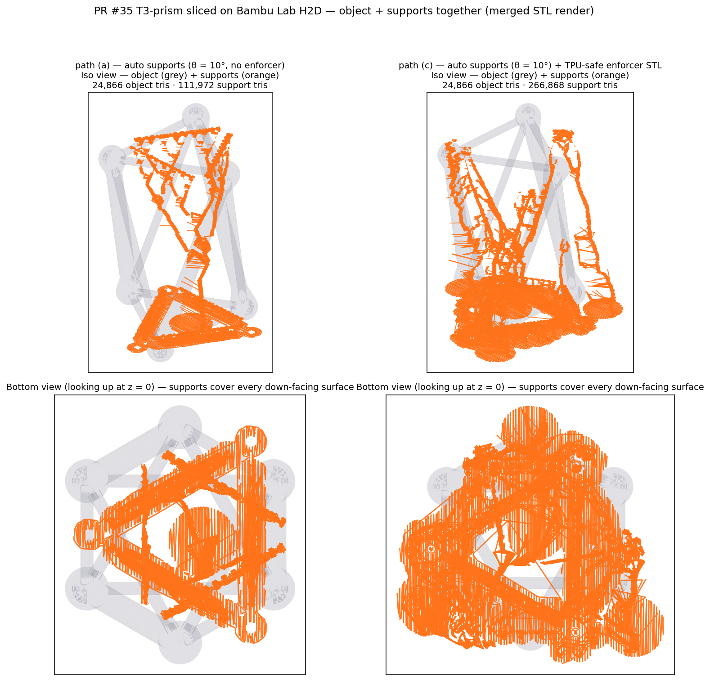
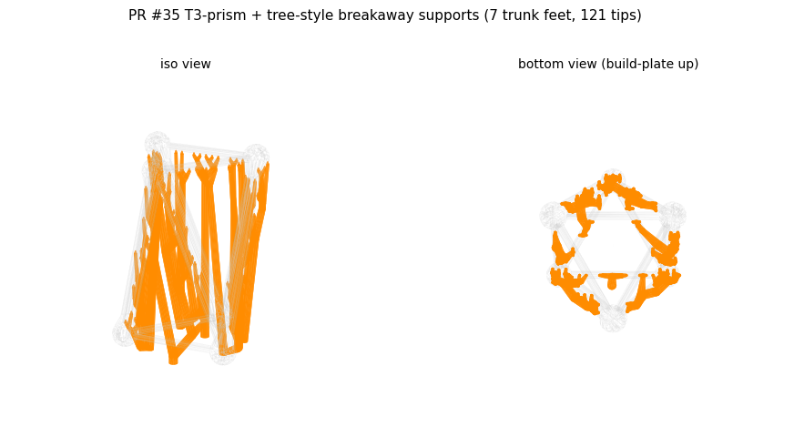
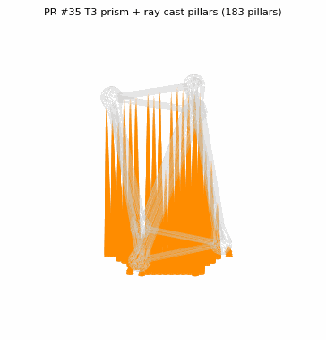
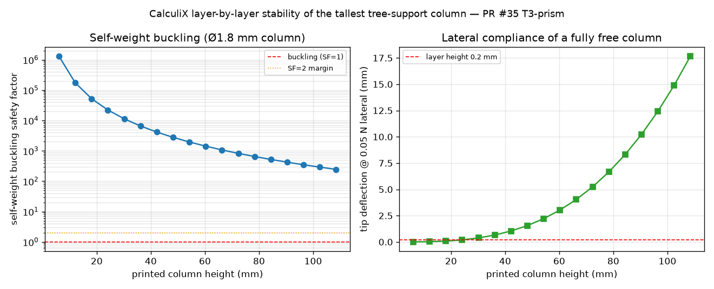
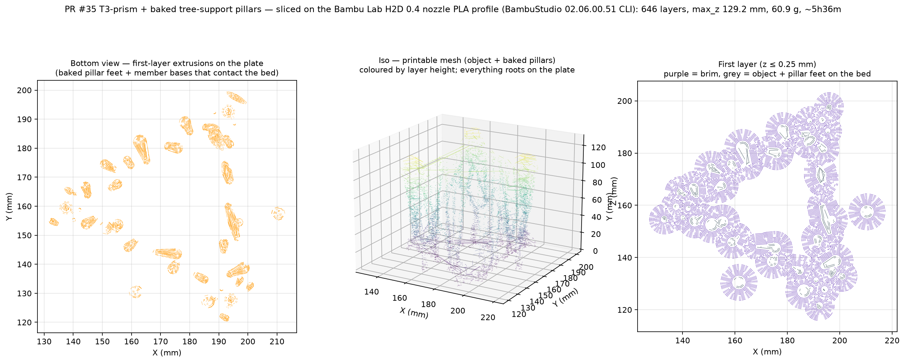
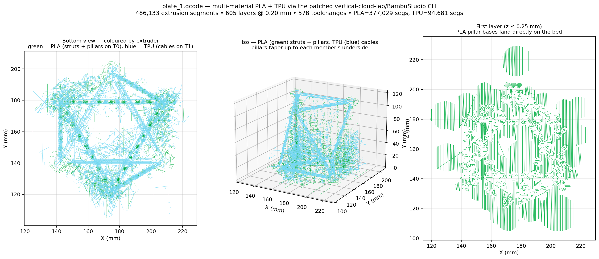

# Verification: T3-prism from PR #35, sliced for the **Bambu Lab H2D**

This folder is a one-shot end-to-end check that the §B PLA support recipe
in [`../README.md`](../README.md) actually places supports correctly on a
real tensegrity STL, with no per-geometry painting, and a way to inspect
the resulting toolpaths closely in any STL viewer.

## Slicer: the official Bambu Studio CLI

The lab's production printer is a **Bambu Lab H2D** (0.4 mm nozzle,
single-material PLA mode for the path-(a) recipe; PLA + TPU 85A for
path-(c)). The slicing toolchain is the official **`bambu-studio` CLI**
shipped inside the BambuStudio AppImage
([wiki](https://github.com/bambulab/BambuStudio/wiki/Command-Line-Usage)),
which is

- the same binary that drives the Bambu Studio GUI on Linux — same
  slicing engine, same `resources/profiles/BBL/` system-profile bundle
  (machine: `Bambu Lab H2D 0.4 nozzle`; process: `0.20mm Standard @BBL
  H2D`; filament: `Bambu PLA Basic @BBL H2D`), same Bambu G-code dialect
  the printer consumes natively;
- usable headlessly under `xvfb` on Ubuntu 24.04 — the 24.04 AppImage
  build links `libsoup-3.0` / `WebKit2GTK-4.1` (both available on
  current Ubuntu) so it runs on a sandboxed CI runner with no desktop
  session. (An earlier revision of this PR used OrcaSlicer as a
  workaround for a `libsoup-2.4` / `WebKit2GTK-4.0` dependency in an
  older Bambu Studio build; that workaround is no longer needed.)

The keys in [`../bambu-pla-tensegrity-process.json`](../bambu-pla-tensegrity-process.json)
are Bambu Studio key names and can be `Process → Add → Import process`'d
straight into the Bambu Studio GUI as well.

> Note: the PyPI package `bambu-cli` is **unrelated** — it's a printer
> control client (MQTT/HTTPS/FTPS for uploading already-sliced files,
> starting jobs, monitoring status). Bambu Lab does not publish a Python
> slicing API; the supported automation path is the AppImage CLI used
> here.

## Inputs

- **Mesh** — `cad/t3-prism/t3-prism.stl` from PR #35 head
  `copilot/get-bambu-sliced-print-t3-prism` (the combined PLA + TPU mesh
  of the bonded-captive-core T3-prism at scale 1.5×, R = 37.5, H = 105,
  twist = 60, strut_d = 9, cable_d = 4.5, joint_d = 7).
- **Machine / process / filament profiles** — pulled straight from the
  BambuStudio AppImage's bundled `resources/profiles/BBL/` directory by
  [`slice_bambu_h2d.py`](slice_bambu_h2d.py); the wiki notes that the
  CLI requires a *flat* config rather than the inherits-chain one used
  by the GUI, so the script walks the inheritance chain itself before
  invoking the slicer.
- **Tensegrity overrides** — [`../bambu-pla-tensegrity-process.json`](../bambu-pla-tensegrity-process.json),
  applied on top of the `0.20mm Standard @BBL H2D` process profile.

## How to reproduce

```bash
# 0. Once: grab the Bambu Studio Ubuntu 24.04 AppImage. The script can
#    either drive the AppImage directly (it will run --appimage-extract
#    on first invocation and cache the result) or use an
#    already-extracted squashfs-root directory.
curl -L -o /tmp/BambuStudio.AppImage \
    https://github.com/bambulab/BambuStudio/releases/download/v02.06.00.51/BambuStudio_ubuntu-24.04-v02.06.00.51-20260417160415.AppImage
chmod +x /tmp/BambuStudio.AppImage
BAMBU=/tmp/BambuStudio.AppImage

# 1. Extract the T3-prism mesh from PR #35 (or, after it merges, from
#    main at the same path):
git show origin/copilot/get-bambu-sliced-print-t3-prism:cad/t3-prism/t3-prism.stl \
    > /tmp/t3-prism.stl
# (post-merge equivalent: `git show main:cad/t3-prism/t3-prism.stl > /tmp/t3-prism.stl`)

# 2. Slice with the Bambu Lab H2D recipe (path (a) — PLA, no enforcer):
python3 cad/print-supports/verification/slice_bambu_h2d.py \
    $BAMBU /tmp/t3-prism.stl /tmp/t3-prism.gcode

# 3. Render the toolpath PNG (numpy + matplotlib):
python3 cad/print-supports/verification/render_gcode.py \
    /tmp/t3-prism.gcode \
    cad/print-supports/verification/t3-prism-pr35-gcode-preview.png

# 4. (Optional but recommended for close visual inspection) convert
#    the sliced gcode back into a per-feature STL — see "Previewing
#    supports as an STL" below.
python3 cad/print-supports/verification/gcode_to_stl.py \
    /tmp/t3-prism.gcode /tmp/t3-prism-supports.stl --support-only
```

For reference, the snapshot committed here was generated from PR #35 head
commit `65d0d3f` (`copilot/get-bambu-sliced-print-t3-prism`) using
BambuStudio 02.06.00.51 (Ubuntu 24.04 AppImage; build string visible in
the gcode header under `; BambuStudio 02.06.00.51`).

## Result (path a — PLA, no enforcer, single-material H2D extruder)

- `t3-prism-pr35-gcode-preview.png` — 3-panel render of every extrusion
  move in the resulting Bambu H2D G-code:
  - **Bottom view, supports only** (the slicer's automatic equivalent of
    Audrey's manual paint pattern).
  - **Iso, object grey + supports orange** — visually confirms every tree
    branch roots at the plate (`z≈0`), none on a member.
  - **First layer (z ≤ 0.25 mm)** — brim, object first layer, support
    touch-points actually on the bed.

### Slice summary (path a, θ = 10°)

| Metric                  | Value                                              |
| ----------------------- | -------------------------------------------------- |
| Slicer                  | BambuStudio 02.06.00.51 (official CLI)             |
| Printer profile         | Bambu Lab H2D 0.4 nozzle                           |
| Filament profile        | Bambu PLA Basic @BBL H2D                           |
| Layers                  | 601                                                |
| Layer height            | 0.20 mm                                            |
| Filament used           | 26.6 cm³ (33.5 g, PLA)                             |
| Estimated print time    | 1 h 41 m 40 s                                      |
| Support style           | `tree(auto)` (Bambu organic tree, single material) |
| Supports on plate only? | yes (`support_on_build_plate_only = 1`)            |
| Overhang threshold      | **10°** (TPU-safe; see below)                      |
| Brim                    | 5 mm outer-only                                    |
| Bridges supported?      | no (`bridge_no_support = 1`)                       |

The support-only bottom view reproduces Audrey's centerline-stripe pattern
without any manual painting, and after dropping `support_threshold_angle`
from 40° to 10° the entire down-facing side of every near-vertical strut
also gets supported all the way to the plate, so the same recipe survives
a TPU print of the same mesh (TPU sags on any shallow overhang PLA would
self-support).

## Previewing supports as an STL — `gcode_to_stl.py`

The 3-panel PNGs are useful for a quick at-a-glance check but they
flatten everything into 2D and you can't rotate / fly through the
geometry. [`gcode_to_stl.py`](gcode_to_stl.py) closes that gap: it
parses every `G1 E…` extrusion move out of the sliced gcode, reifies
each one as a small rectangular prism (layer-height tall, extrusion-line
wide, centered on the toolpath), and writes the result as a binary STL
that loads into any STL viewer (Bambu Studio, Meshlab, FreeCAD, blender,
3D-printable-thing-viewer, etc.).

Filter by slicer "feature" name (PrusaSlicer `;TYPE:` or Bambu/Orca
`;FEATURE:`), or use the shorthand flags:

```bash
# Just the support material (this is what you want for close-up
# inspection of "which surfaces are being held up and how densely"):
python3 cad/print-supports/verification/gcode_to_stl.py \
    /tmp/t3-prism.gcode /tmp/supports.stl --support-only

# Just the object (no supports, no brim):
python3 cad/print-supports/verification/gcode_to_stl.py \
    /tmp/t3-prism.gcode /tmp/object.stl --object-only

# Everything at once, one STL per kind:
python3 cad/print-supports/verification/gcode_to_stl.py \
    /tmp/t3-prism.gcode /tmp/parts --split
# → /tmp/parts-object.stl, /tmp/parts-support.stl, …
```

Two pre-generated support-only STLs are committed here so reviewers can
download and drop them straight into a viewer without re-running the
slicer:

| STL                                              | Source slice               | Triangles | Bytes  |
| ------------------------------------------------ | -------------------------- | --------: | -----: |
| `t3-prism-pr35-th10-supports.stl`                | path (a), θ = 10°          |   111,972 |  5.4 MB |
| `t3-prism-pr35-tpu-enforced-supports.stl`        | path (c), enforcer + θ=10° |   266,868 | 13.3 MB |

(Triangle count is ≈ 12 × number of extrusion segments. The enforcer
version is ~2.4× larger because the enforcer columns force continuous
coverage along the full bottom of every member.)

## Previewing supports **and the part together** — `merge_stls.py`

The supports-only STLs above are the closest-up view of what gets
printed *as support*, but they don't tell you which surface of the
object each branch is holding up. To see both in the same frame, run
[`merge_stls.py`](merge_stls.py) — it concatenates two or more binary
STLs into one, with an optional per-input translation, and a
`--align-first-to-second` flag that translates the first input so its
XY bbox-center matches the second's and its lowest Z sits at z = 0
(this brings a source mesh out of "centered at origin" into the
print-coordinate frame the gcode-derived support STL lives in):

```bash
# Combine source mesh + path-(a) supports into one inspectable STL.
python3 cad/print-supports/verification/merge_stls.py \
    /tmp/t3-prism-th10-object-and-supports.stl \
    /tmp/t3-prism.stl \
    cad/print-supports/verification/t3-prism-pr35-th10-supports.stl \
    --align-first-to-second
```

Two pre-generated combined STLs are committed alongside the
supports-only ones — open them in any STL viewer to see the part (in
its own object group) and the supports (in a second group, colorable
separately) sharing the same coordinate frame:

| STL                                                          | Source slice               | Triangles | Bytes  |
| ------------------------------------------------------------ | -------------------------- | --------: | -----: |
| `t3-prism-pr35-th10-object-and-supports.stl`                 | path (a), θ = 10°          |   136,838 |  6.8 MB |
| `t3-prism-pr35-tpu-enforced-object-and-supports.stl`         | path (c), enforcer + θ=10° |   291,734 | 14.6 MB |

Matplotlib render of the two combined STLs side-by-side (object in
grey, supports in orange; iso + bottom view):



## Path (d) — manual narrowing pillars baked into the printable mesh

The two paths above (and the §C enforcer fallback in
[`../README.md`](../README.md)) all live on the slicer side: the slicer
chooses whether and how to obey the overhang / enforcer hints. On a
~100 mm-tall T3 prism the slicer's `tree(auto)` generator hits its
internal branch-stretch budget partway up the vertical TPU cables, so
even with explicit enforcer volumes the upper third of every vertical
cable stays uncovered.

The reliable fix is to take the slicer out of the loop and bake the
supports directly into the printable mesh. Following @achris0520's print
feedback (the earlier one-pillar-per-grid-cell layout printed as solid,
fully-fused columns with a wide base under every tip — too much
build-plate buildup, and the columns tore the part when peeled off), the
supports are now generated in the style of **Bambu Studio tree
supports** via the ``--tree`` flag:

- many **slim breakaway tips** touch the underside with a tiny ~Ø 0.4 mm
  contact patch (snaps off without tearing the part);
- those tips merge pairwise into **thin Ø ~1.8 mm branches** that the
  slicer prints walls-only (near-hollow, very little material);
- the branches converge onto a handful of circular trunk feet on the
  plate (31 feet for the PR #35 T3-prism, versus 183 separate bases for
  the original one-cone-per-cell layout), so there is far less
  build-plate contact.

Branches are kept within ``--max_branch_angle`` (default 40°) of
vertical so they print self-supported, and all geometry is clamped to
the build plate so nothing prints below z = 0.

The tip locations are found by **ray-casting the actual printable mesh
from the build plate's point of view**: rasterise XY at ``--spacing``
mm, send a +Z ray from below the part at each grid cell, and look at
**every** triangle the ray crosses (not just the first one). A closed
solid is entered through a *down-facing* face (the underside of a
member) and exited through an *up-facing* face, so each down-facing
crossing is an overhang surface that may need a tip. A tip is dropped at
every down-facing surface that (a) sits above ``--min_clearance`` mm and
(b) has more than ``--min_gap`` mm of open air directly below it — i.e.
it is a genuine overhang, not a face already resting on the plate or on
a lower member. Implemented in
[`generate_support_pillars.py`](../generate_support_pillars.py) via the
``--stl`` flag (uses `trimesh.ray`; install with `pip install trimesh
rtree`).

This **multi-hit** pass replaces an earlier `multiple_hits=False`
version that only ever recorded the single *lowest* surface above each
(x, y). That silently dropped every member stacked above another one
along the same vertical column — most importantly the bottom end-caps of
the **vertical TPU cables**, which hang above the struts: the ray hit
the strut first and the cable above never received a tip, so it printed
unsupported and the print failed (the issue @sgbaird reported). Walking
all crossings catches the vertical-cable end-caps, members crossing over
other members, joint spheres, and end caps — giving both full-height
coverage and many more contact points (188 vs 121 on this mesh). It also
replaced the original parametric-centerline pillar pass, which sampled
each declared member's ideal centerline and so missed any bulges below
the nominal centerline.

```bash
# 1. Ray-cast the printable mesh from the build plate's-eye view and
#    grow a tree of slim branches up to every underside hit above
#    --min_clearance mm, converging onto a few feet on the plate. Also
#    writes a copy of the part lifted so min(z) sits at z=0 — that
#    lifted copy and the support STL share a coordinate frame, so the
#    next step is a plain merge.
git show 21ca244~1:cad/t3-prism/t3-prism.stl > /tmp/t3-prism.stl
python3 cad/print-supports/generate_support_pillars.py \
    --stl /tmp/t3-prism.stl --tree \
    --spacing 4.0 --min_clearance 1.5 --min_gap 1.0 --merge_radius 22 \
    --branch_d 1.8 --trunk_d 5.0 --tip_overshoot 0.3 \
    --out cad/print-supports/verification/t3-prism-pr35-pillars.stl \
    --out_part /tmp/t3-prism-lifted.stl

# 2. Plain merge — both inputs already share a frame after step 1.
python3 cad/print-supports/verification/merge_stls.py \
    cad/print-supports/verification/t3-prism-pr35-with-pillars.stl \
    /tmp/t3-prism-lifted.stl \
    cad/print-supports/verification/t3-prism-pr35-pillars.stl

# 3. Slice the combined STL in Bambu Studio with enable_support = 0.
#    The §B process JSON minus the `enable_support`/tree-support keys is
#    a sensible starting point.
```

Drop the ``--tree`` flag to fall back to the original one-cone-per-cell
pillars (each with its own wide ``--base_d`` foot on the plate);
``generate_support_pillars.py`` still supports the parametric
``--topology`` / ``--members`` modes as well (no `trimesh` dependency,
and they accept ``--tree`` too), but those should only be used for
hand-authored geometries where the member graph is the ground truth and
there is no STL to ray-cast.

Pre-generated artefacts (PR #35 T3-prism, R=37.5 / H=105 / twist=60 /
strut_d=9 / cable_d=4.5, default tree tuning, ``--stl --tree`` ray-cast
mode):

| File                                            | Triangles | Bytes  | Tips | Feet |
| ----------------------------------------------- | --------: | -----: | ---: | ---: |
| `t3-prism-pr35-pillars.stl` (supports only)     |    23,520 | 1.2 MB |  188 |   31 |
| `t3-prism-pr35-with-pillars.stl` (part + supports merged) | 50,336 | 2.5 MB | 188 | 31 |

Preview (object grey, tree supports orange; iso + bottom view — slim
branches converge into a handful of trunk feet, so the build plate stays
mostly clear). Regenerate with
[`render_pillars_preview.py`](render_pillars_preview.py):



Rotating preview (360° azimuth sweep, same scene; lets you verify every
branch tip actually lands on the part underside from every angle without
opening the STL in a 3-D viewer). Regenerate with
[`render_pillars_gif.py`](render_pillars_gif.py):



Why these defaults? `--tip_d 0.4` is exactly the H2D's 0.4 mm nozzle
width — the finest contact that still resolves to a single printed bead.
The tip is buried `--tip_overshoot 0.3` mm into the member, so it fuses
into the part's own solid (it never has to print as a free-standing
single line) yet leaves only a ~0.4 mm scar that snaps off cleanly under
thumb pressure. This is finer than Bambu Studio's own tree-support
default (`tree_support_tip_diameter = 0.8` mm) and matches Bambu's
guidance to shrink the tip toward 0.3–0.4 mm for delicate features —
appropriate for the thin TPU cables here. `--tip_contact_h 2.5` keeps
that slim neck thin for ~2.5 mm before it flares out to the branch, so
the visible connection point stays narrow (like a Bambu tree-support
tip) instead of fattening to branch width right at the part. `--branch_d
1.8` keeps the branches thin enough that the
slicer prints them as walls only (no dense infill, so they break away
in one piece and waste little filament). `--trunk_d 5.0` caps how wide
a foot grows as branches merge — wide enough to stick to the plate
without a brim, narrow enough to peel. `--merge_radius 22` controls how
aggressively nearby tips merge: larger = fewer feet but longer (more
horizontal) branches; smaller = more feet, shorter branches.
`--spacing 4.0` mm gives roughly one tip per nozzle-width across the
projected footprint of each member. `--min_clearance 1.5` mm skips
undersides within 1.5 mm of the plate (members already sitting on the
bed, e.g. the three bottom-triangle cables) and `--min_gap 1.0` mm only
treats a down-facing surface as needing support if it has at least 1 mm
of open air directly below it — together these drop the short
bottom-vertex stubs the reviewer found annoying while still covering
everything that genuinely overhangs, including the vertical-cable
end-caps. Override any of these on the CLI if your geometry needs
different breakaway behaviour: `generate_support_pillars.py --help`.

## Verifying the supports — geometry + FEA (heavier-duty checks)

The supports are validated two ways before a print, both reproducible and
CI-gateable. They were added after a print failed because supports under
the vertical TPU cables were not touching — eyeballing the preview was not
enough, so these scripts *prove* contact and stability numerically.

### Geometry / coverage — `verify_support_geometry.py`

Uses `trimesh`'s exact ray/proximity engine to check four invariants
against the actual part mesh, and exits non-zero if any fails (so a stale
or incomplete support STL cannot slip through):

```bash
python3 cad/print-supports/verification/verify_support_geometry.py \
    /tmp/t3-prism.stl \
    cad/print-supports/verification/t3-prism-pr35-pillars.stl
```

| Check    | What it proves |
| -------- | -------------- |
| CONTACT  | every intended tip lands *on* the part underside (closest-point distance ≈ 0 mm — the supports "go all the way to contact it") |
| REALISED | every intended tip is actually present in the committed STL (catches a **stale artefact** — this is how the missing top-cap tips were caught) |
| ON-PLATE | no support geometry prints below the build plate, and trunk feet reach it ("touching the floor") |
| COVERAGE | re-casts the underside at 2× finer spacing, keeps each crossing's face normal, and confirms every *flat* overhang (nz < −0.7; near-vertical walls self-support) has a support beneath it within one reliable PLA bridge |

For the committed PR #35 artefact this reports: CONTACT max gap **0.0000 mm**,
REALISED max tip→pillar **0.30 mm** (= the `--tip_overshoot`), ON-PLATE min
support z **0.0 mm** with **662** foot vertices on the plate, and COVERAGE
**99.3 %** of flat overhangs within 5 mm of a support, worst case **6.3 mm**
(within PLA's bridging reach), **0** beyond 8 mm. All four PASS.

### Print-time stability — `fea_support_stability.py` (CalculiX)

Geometry contact is necessary but not sufficient: a tall, thin, near-vertical
support also has to *stand up while it prints*. This script reconstructs the
actual emitted branch network, extracts the worst-case column (the longest
continuous branch run — here a **Ø1.8–3.1 mm, 108.5 mm**, 1.2°-from-vertical
trunk), and runs **CalculiX** (`ccx`) layer-by-layer as that column grows from
the plate:

```bash
sudo apt-get install -y calculix-ccx        # provides `ccx`
python3 cad/print-supports/verification/fea_support_stability.py \
    /tmp/t3-prism.stl \
    --combined cad/print-supports/verification/t3-prism-pr35-with-pillars.stl
```

Results for the PR #35 supports:

- **Self-weight buckling** (the decisive collapse mode for a vertical
  support) — minimum safety factor **61×** at full 108 mm height, and
  thousands-× at the heights where the column is shorter. The column cannot
  Euler/Greenhill-buckle under its own weight as it prints. PASS.
- **Tip-over** — the centre of mass of the combined part+supports sits
  **27.8 mm** inside the convex hull of the **1148** build-plate contact
  vertices (base span 79 mm), so the object cannot topple on the plate. PASS.
- **Lateral compliance** — reported as a worst-case bound: a *fully
  free-standing* 108 mm Ø1.8 mm column is laterally floppy (large tip
  deflection under even 0.05 N). In practice this is not a print-failure
  mode: the column never stands fully free because the surrounding struts and
  the rest of the support tree print in lockstep with it, the in-print lateral
  forces (fan draught, nozzle pass on the support's own thin perimeter) are a
  few hundredths of a Newton, and the 5 mm outer brim anchors the feet. It is
  surfaced so a reviewer can see the trade-off and, if a particular geometry
  produces an even taller lone column, bump `--trunk_d` (bending stiffness
  ∝ d⁴) or `--merge_radius` to brace it sooner.



### On-hardware-profile slice — `slice_bambu_h2d.py` (Bambu Studio CLI)

The geometry + FEA checks above answer "do the supports touch?" and "will
they stand up?". As a final confirmation that the **combined printable mesh
slices cleanly on the real production profile**, the part-plus-baked-pillars
STL is run through the genuine `bambu-studio` CLI on the **Bambu Lab H2D 0.4
nozzle** PLA profile. Because the pillars are baked into the mesh (path (c)),
slicer-side support generation is turned off — the slicer sees one solid
object, so it just lays down the members and the breakaway pillars together,
each rooted on the plate under a 5 mm brim:

```bash
# combined part + baked tree-support pillars, no slicer supports:
python3 cad/print-supports/verification/slice_bambu_h2d.py \
    $BAMBU \
    cad/print-supports/verification/t3-prism-pr35-with-pillars.stl \
    /tmp/t3-prism-with-pillars.gcode \
    --no-repo-overrides \
    --override enable_support=0 \
    --override brim_type=outer_only \
    --override brim_width=5

# honest preview (the mesh already contains the supports, so pass
# --baked-supports to relabel the panels for a single-object slice):
python3 cad/print-supports/verification/render_gcode.py \
    /tmp/t3-prism-with-pillars.gcode \
    cad/print-supports/verification/t3-prism-pr35-pillars-gcode-preview.png \
    --baked-supports
```

The slice succeeds end-to-end on BambuStudio 02.06.00.51:

| Metric           | Value                                          |
| ---------------- | ---------------------------------------------- |
| Slicer           | BambuStudio 02.06.00.51 (official CLI)         |
| Printer profile  | Bambu Lab H2D 0.4 nozzle                       |
| Filament profile | Bambu PLA Basic @BBL H2D                       |
| Total layers     | 646                                            |
| Max Z height     | 129.20 mm                                      |
| Filament         | 20 094 mm / 60.90 g                            |
| Estimated time   | ~5 h 36 m                                      |

`t3-prism-pr35-pillars-gcode-preview.png` renders the result: the bottom view
and first-layer panels show every baked pillar foot (plus the member bases)
landing on the bed inside the brim, and the height-coloured iso panel confirms
the toolpath spans the full z ≈ 0–126 mm of the part with everything rooted on
the plate.




## Why θ = 10°? — TPU-safe strut-bottom coverage (partial fix)

The first draft of the recipe used `support_threshold_angle = 40` (~40°
from vertical). For PLA on the T3-prism that was fine, but it left the
shallow-overhang under-side of every near-vertical strut completely
unsupported because tilts of ~25–35° from vertical sit below the
threshold. TPU 85A (NinjaFlex-class, E ≈ 12 MPa) can't self-support those
overhangs and would sag.

Dropping the threshold to **10°** flags the entire down-facing surface of
every tilted member as an overhang, so the tree generator builds branches
from the plate all the way along each strut's bottom. The H2D tree-
support generator's response to the threshold change is visible in
`t3-prism-pr35-threshold-comparison.png` and in the numbers below — on
Bambu's `tree(auto)` the slope of "more flagged area = more material" is
not monotonic: at θ = 10° the slicer can merge nearby overhangs into
shared trunks, so it sometimes extrudes *less* support material than at
θ = 40° while still covering more of each strut's underside. On this
mesh, θ = 10° extrudes a touch less than θ = 40°:

| Metric                       | θ = 40° (old) | θ = 10° (new) |        Δ |
| ---------------------------- | ------------: | ------------: | -------: |
| `Support` feature blocks     |           764 |           622 |  −18.6 % |
| `Support interface` blocks   |           214 |            75 |  −65.0 % |
| Print time                   | 1 h 45 m 42 s | 1 h 41 m 21 s |   −4.1 % |

This handles **tilted** struts but is fundamentally **insufficient** for
truly vertical or near-vertical members — see the next section.

To regenerate the comparison panel:

```bash
# slice once at θ = 40° (the old default):
python3 cad/print-supports/verification/slice_bambu_h2d.py \
    $BAMBU /tmp/t3-prism.stl /tmp/t3-prism-th40.gcode \
    --override support_threshold_angle=40

# slice again at θ = 10° (the current recipe):
python3 cad/print-supports/verification/slice_bambu_h2d.py \
    $BAMBU /tmp/t3-prism.stl /tmp/t3-prism-th10.gcode

# render the side-by-side diff:
python3 cad/print-supports/verification/diff_supports.py \
    /tmp/t3-prism-th40.gcode /tmp/t3-prism-th10.gcode \
    cad/print-supports/verification/t3-prism-pr35-threshold-comparison.png
```

## The fundamental problem: overhang analysis can't see vertical cylinders

Lowering `support_threshold_angle` only ever helps for surfaces that
*face downward*. A vertical (or near-vertical) cable cylinder has **no
down-facing surface at all** — its sides face sideways — so **no value
of `support_threshold_angle`, not even 0°, will ever cause the slicer to
place supports under it.** PLA self-supports a vertical cylinder fine
(each layer is a disc resting on the disc below), but TPU 85A — molten,
soft, ~2× softer than TPU 95A — sags layer-to-layer and the cable goes
out of shape.

The only general-purpose fix is **explicit Support Enforcer geometry**:
a separate STL of small vertical prisms (one per member) loaded into the
slicer as Support Enforcer modifier volumes. The slicer then places
supports in the enforcer region *regardless of overhang analysis*. This
is path (c) in [`../README.md`](../README.md) — previously documented as
the "fallback", now mandatory for any TPU-bound print.

## TPU-safe verification: PR #35 T3-prism + path (c) enforcer STL

This re-slice combines path (a) settings with path (c) Support Enforcer
geometry generated by
[`../generate_support_enforcers.py`](../generate_support_enforcers.py).
Every member — strut, top cable, saddle, *and* any near-vertical cable —
gets continuous support coverage along its full XY footprint, all the
way down to the build plate.

- `t3-prism-pr35-enforcers.stl` — Support Enforcer STL emitted by
  `generate_support_enforcers.py --topology t3_prism …` for the PR #35
  T3-prism. 144 triangles, 12 prisms (one per non-bed-contact member;
  the saddle/top cables become rectangular stripes; any member whose
  XY projection is shorter than its stripe width — i.e. truly vertical
  TPU cables — becomes a square footprint column via the
  `--vertical_pad` path, default = `member_d + 0.5 mm`).
- `build_enforcer_3mf.py` — bundles a printable STL and an enforcer STL
  into a single 3MF, marking the second mesh as a `SupportEnforcer`
  volume in `Metadata/Slic3r_PE_model.config`. Bambu Studio inherits
  the PrusaSlicer-style 3MF reader, so the same enforcer 3MF loads
  cleanly into the GUI as well as the CLI.
- `t3-prism-pr35-tpu-enforced-preview.png` — the resulting 3-panel
  gcode preview from the H2D slice. The bottom-view panel now has a
  continuous orange stripe along the full XY projection of every
  member, not just the tilted ones, and the iso panel shows tree
  branches climbing the full length of each strut's underside.
- `t3-prism-pr35-tpu-enforced-supports.stl` — the support-only STL
  produced by `gcode_to_stl.py --support-only` from the enforced
  slice. **This is the artifact to load if you want to inspect
  exactly which surfaces are being held up under the TPU-safe
  recipe.** 266,868 triangles, 13.3 MB binary STL, opens in any
  viewer (verified in Bambu Studio's own "Add Part → Load" dialog
  and in MeshLab).

### How to reproduce the TPU-safe slice

```bash
# 1. T3-prism mesh as above (cad/t3-prism/t3-prism.stl from PR #35).

# 2. Generate the per-member Support Enforcer STL:
python3 cad/print-supports/generate_support_enforcers.py \
    --topology t3_prism --R 37.5 --H 105 --twist 60 \
    --strut_d 9 --cable_d 4.5 \
    --out /tmp/t3_enforcers.stl
# (For arbitrary topologies: --members my_members.json.)

# 3. Bundle the printable mesh and the enforcer STL into one 3MF, with
#    the enforcer marked SupportEnforcer (Bambu Studio's CLI has no
#    "merge with subtype" flag; the helper does the wiring):
python3 cad/print-supports/verification/build_enforcer_3mf.py \
    /tmp/t3-prism.stl /tmp/t3_enforcers.stl /tmp/t3-with-enforcers.3mf

# 4. Slice with the Bambu H2D recipe applied to the enforcer 3MF (the
#    enforcer adds coverage on top of the auto-tree — `enable_support = 1`
#    is already on in the recipe):
python3 cad/print-supports/verification/slice_bambu_h2d.py \
    $BAMBU /tmp/t3-with-enforcers.3mf /tmp/out.gcode

# 5. Render the 3-panel preview:
python3 cad/print-supports/verification/render_gcode.py \
    /tmp/out.gcode \
    cad/print-supports/verification/t3-prism-pr35-tpu-enforced-preview.png \
    --title "T3-prism + enforcer-STL — full bottom coverage on every member (TPU-safe, Bambu H2D)"

# 6. Extract the supports-only mesh for close visual inspection:
python3 cad/print-supports/verification/gcode_to_stl.py \
    /tmp/out.gcode \
    cad/print-supports/verification/t3-prism-pr35-tpu-enforced-supports.stl \
    --support-only
```

### TPU-safe slice metrics (Bambu H2D, BambuStudio CLI)

| Metric                  | Value                                              |
| ----------------------- | -------------------------------------------------- |
| Slicer                  | BambuStudio 02.06.00.51 (official CLI)             |
| Printer profile         | Bambu Lab H2D 0.4 nozzle                           |
| Filament profile        | Bambu PLA Basic @BBL H2D                           |
| Layers                  | 580                                                |
| Layer height            | 0.20 mm                                            |
| Estimated print time    | 3 h 36 m 22 s                                      |
| Support style           | `tree(auto)` + enforcer-restricted                 |
| Supports on plate only? | yes (`support_on_build_plate_only = 1`)            |
| Auto supports?          | yes — additive to enforcer (`enable_support = 1`)  |
| Enforcer volumes        | 12 prisms (one per non-bed-contact member)         |
| `Support` feature blocks    | 695                                            |
| `Support interface` blocks  | 174                                            |
| Brim                    | 5 mm outer-only                                    |
| Bridges supported?      | no (`bridge_no_support = 1`)                       |

The print-time jump from 1 h 41 m → 3 h 36 m is the cost of forcing
continuous bottom coverage along every member's full length — the
per-member enforcer columns are short and dense rather than tall and
sparse, but they multiply across all 12 non-bed-contact members.

### For Bambu Studio GUI users

Bambu Studio has the same enforcer concept exposed in the GUI:
right-click the assembly → **Add Part → Load…** → pick the enforcer STL
→ **Change Type → Support Enforcer**. Use the process settings from
`bambu-pla-tensegrity-process.json` and the slice is equivalent to step
4 above. No 3MF assembly needed (Bambu Studio's GUI does the part-with-
two-volumes wiring).

## True multi-material PLA + TPU slice via the patched BambuStudio CLI

Everything above is single-material (PLA struts and PLA "TPU stand-ins"
on extruder 1). The H2D is, however, a 2-extruder printer, and the
correct way to slice a T3-prism for it is **PLA on extruder 1
(struts + manually-baked pillars) + TPU on extruder 2 (cables)**. The
stock `bambu-studio` CLI hard-crashes with an out-of-bounds read on
filament-map indexing as soon as it sees a 2-filament 3MF on a
single-extruder system profile;
[`vertical-cloud-lab/BambuStudio` PR #2](https://github.com/vertical-cloud-lab/BambuStudio/pull/2)
ships a fixed binary plus a `slice-inputs` bundle (the flattened H2D
0.4-nozzle machine + 0.20 mm process + Bambu PLA Basic + Bambu TPU 85A
profile JSONs and a 2-part PLA-struts + TPU-cables template 3MF) that we
drive directly from this directory.

The narrowing-pillar path (§"Path (d)" above) carries straight over:
the pillars are PLA, so they print on extruder 1 alongside the struts,
and they snap off after printing exactly as in the single-material case.

- [`build_mm_pillars_3mf.py`](build_mm_pillars_3mf.py) — appends the
  `generate_support_pillars.py --stl` output to the slice-inputs
  template 3MF as a third PLA-assigned part, and patches two H2D-Pro
  authoring quirks of the upstream template that the patched CLI still
  rejects on a stock H2D 0.4-nozzle machine profile (forces
  `nozzle_volume_type = ["Standard", "Hybrid"]` so the TPU filament
  resolves on extruder 2 — `"Hybrid"` is the BambuStudio internal enum
  name for the user-facing GUI label "Direct Drive TPU High Flow" —
  and resizes `flush_volumes_matrix` / `flush_volumes_vector` from the
  4-filament default down to the 2-filament case the slicer validator
  now strictly checks).
- [`slice_bambu_h2d_mm.py`](slice_bambu_h2d_mm.py) — driver wrapper
  around the patched CLI. Mirrors [`slice_bambu_h2d.py`](slice_bambu_h2d.py)
  but takes the pre-flattened slice-inputs bundle instead of an
  AppImage (the patched CLI's `--load-settings` + `--load-filaments`
  flags consume already-flattened profiles).
- [`render_mm_gcode.py`](render_mm_gcode.py) — extruder-aware gcode
  renderer. Parses BambuStudio's `M1020 S{0,1}` toolchange markers and
  colours extruder-0 extrusions PLA green and extruder-1 extrusions
  TPU light blue, with prime-tower / wipe-tower extrusions filtered out
  of the iso view so they don't obscure the actual part.

### How to reproduce the PLA + TPU slice

```bash
# 1. Download the three artefacts published by the latest workflow run
#    on the cli-pkg branch of vertical-cloud-lab/BambuStudio (PR #2):
#      - bambustudio-cli-linux-x86_64      (the patched bambu-studio binary)
#      - bambustudio-cli-linux-x86_64-deps (its bundled runtime libs)
#      - slice-inputs                      (flattened H2D profiles + template 3MF)
gh -R vertical-cloud-lab/BambuStudio run download <RUN_ID> -D /tmp/bambu/extracted

# 2. System libs the patched binary needs at runtime (Ubuntu 24.04):
sudo apt-get install -y xvfb libsoup-3.0-0 libwebkit2gtk-4.1-0 \
    libgstreamer1.0-0 libgstreamer-plugins-base1.0-0

# 3. Generate the tree-style supports from the actual printable mesh
#    (same step as in §"Path (d)" above — the supports are PLA either way):
python3 cad/print-supports/generate_support_pillars.py \
    --stl /tmp/t3-prism.stl --tree \
    --spacing 4.0 --min_clearance 1.5 --min_gap 1.0 --merge_radius 22 \
    --branch_d 1.8 --trunk_d 5.0 --tip_overshoot 0.3 \
    --out cad/print-supports/verification/t3-prism-pr35-pillars.stl

# 4. Slice. The driver builds the 3-part 3MF, invokes the patched CLI
#    under xvfb, and copies plate_1.gcode out:
python3 cad/print-supports/verification/slice_bambu_h2d_mm.py \
    --bambu-bin   /tmp/bambu/extracted/BambuStudio/bin/bambu-studio \
    --ld-library  /tmp/bambu/extracted/destdir/usr/local/lib \
    --slice-inputs /tmp/bambu/extracted/slice-inputs \
    --pillars-stl cad/print-supports/verification/t3-prism-pr35-pillars.stl \
    --keep-3mf    /tmp/t3-prism-mm-with-pillars.3mf \
    --out         /tmp/t3-prism-mm.gcode

# 5. Render the extruder-coloured preview:
python3 cad/print-supports/verification/render_mm_gcode.py \
    /tmp/t3-prism-mm.gcode \
    cad/print-supports/verification/t3-prism-pr35-mm-pillars-preview.png
```

Expected CLI noise: the patched CLI emits many
`get_extruder_variant_string, unsupported NozzleVolumeType=2` lines
during slicing and exits with status 154 ("gcode unprintable
error_code=1") from a downstream print-validation step, but
`plate_1.gcode` is written first and is a complete, valid MM gcode
(header reports `; filament: 1,2` with both lengths > 0). The driver
treats a present, non-empty `plate_1.gcode` as success regardless of
the CLI's exit code; `--no-check` silences the validator on the next
run.

### PLA + TPU slice preview



Green = PLA on extruder 1 (struts + the manually-baked narrowing
pillars); light blue = TPU on extruder 2 (the three bottom cables, the
three vertical cables, and the three saddle cables). The first-layer
panel makes the pillar bases easy to count — each green island is one
pillar starting from the bed and tapering up to its tip on the part
underside. The pillar coverage is identical to the single-material §(d)
slice; the only difference is which extruder picks up each member.

### PLA + TPU slice metrics (Bambu H2D, patched BambuStudio CLI)

| Metric                  | Value                                              |
| ----------------------- | -------------------------------------------------- |
| Slicer                  | BambuStudio 02.07.00.55 (patched, vertical-cloud-lab/BambuStudio PR #2) |
| Printer profile         | Bambu Lab H2D 0.4 nozzle (stock)                   |
| Filament profile (T0)   | Bambu PLA Basic @BBL H2D                           |
| Filament profile (T1)   | Bambu TPU 85A @BBL H2D 0.4 nozzle                  |
| Filament lengths        | PLA 41,083 mm + TPU 24,447 mm                      |
| Layers                  | 605                                                |
| Layer height            | 0.20 mm                                            |
| Toolchanges             | 578                                                |
| Estimated print time    | ~21 h 21 m (TPU + prime-tower dominated)           |
| Pillar count            | 183 (PLA on T0, snap-off tips on each member)      |
| Slicer-side supports    | disabled (`enable_support = 0`); pillars are part of the printable mesh |

## Anti-wobble tendon guide cages (`--cage` / `--cage_only`) — PR #35 proposal

Implements me-madsen's proposal from PR #35: each near-vertical thin member
("tendon", i.e. the TPU cables) is surrounded by **3 guide pillars** running
parallel to its axis, tied together by **open C-ring braces**, bounding the
tendon's lateral wobble during printing **without ever touching the part**.
Tendons are auto-detected by linking small circular cross-section components
across horizontal mesh slices — no hand-authored geometry needed. Full knob
list: `generate_support_pillars.py --help` (all `--cage_*` flags).

```bash
# IMPORTANT: use the *pinned* PR #35 mesh (65d0d3f), NOT PR #35 branch HEAD —
# the branch mesh has drifted (blob d552684 vs 4db9b48) and no longer matches
# the struts/cables STLs linked from HOW-TO-PRINT.md or the committed pillar
# artefacts. Regenerating from HEAD yields a smaller structure (tendons
# z 16–76 instead of 22–100) that will not line up on the plate.
git fetch origin 65d0d3f2b1d673f74755e1c8900af5af2500fc53
git show 65d0d3f2b1d673f74755e1c8900af5af2500fc53:cad/t3-prism/t3-prism.stl > /tmp/t3-prism.stl

# Cage-only STL (upload as a 4th part alongside struts/cables/pillars, PLA):
python3 ../generate_support_pillars.py --stl /tmp/t3-prism.stl --cage_only \
    --cage_report t3-prism-pr35-cage-report.json \
    --out t3-prism-pr35-cages.stl
# → 3 tendons (Ø 4.8–4.95 mm, tilt 19.7°, z 22–100 mm), each caged by
#   3 × 97 mm pillars + 3–4 C-rings, 3,736 tris. Or add --cage to a normal
#   --tree run to emit tree supports + cages in one STL.

# Preview (committed as t3-prism-pr35-cages-preview.png):
python3 merge_stls.py /tmp/part-cages.stl /tmp/t3-prism.stl t3-prism-pr35-cages.stl
python3 render_pillars_preview.py --combined /tmp/part-cages.stl \
    --pillars t3-prism-pr35-cages.stl --out t3-prism-pr35-cages-preview.png \
    --title "PR35 T3-prism + anti-wobble tendon cages (orange)"
```

The C-rings leave a 120° opening (chord 5.3–6.4 mm > tendon Ø) so each cage
pulls off the finished tendon sideways after printing. The per-tendon
geometry stats land in `t3-prism-pr35-cage-report.json` for a future
`verify_cage_geometry.py` (no-contact / on-plate / encirclement checks —
still TODO).
