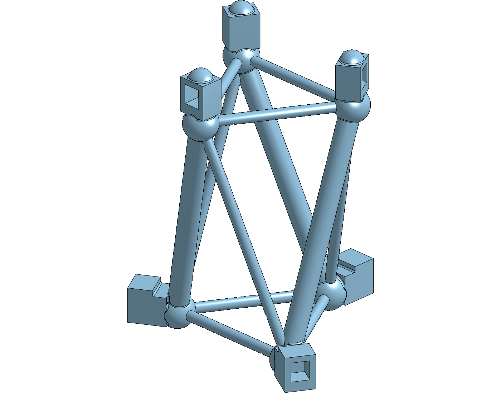

# Onshape document — T3-prism parametric feature tree

The live Onshape document produced by
[`onshape_featurescript_t3prism.py`](onshape_featurescript_t3prism.py) from
[`t3-prism.fs`](t3-prism.fs) (issue #95, route C).

**Open the feature tree here:**
<https://cad.onshape.com/documents/31e08e4df8d1d1a5073123e5/w/ac16a0ddb76685f7abad2605/e/1c2d672517c4435ac9d5b4c5>

| | |
|---|---|
| Document | `Tensegrity T3-prism (parametric)` |
| Owner | Vertical Cloud Lab (company-owned) |
| Visibility | public — link works without an Onshape login |
| Document id (`did`) | `31e08e4df8d1d1a5073123e5` |
| Default workspace (`wid`) | `ac16a0ddb76685f7abad2605` |
| Part Studio (`eid`) — **the feature tree** | `1c2d672517c4435ac9d5b4c5` — tab `T3-prism (parametric)` |
| Feature Studio (`eid`) — the FeatureScript source | `dcc22ff9844eb4ab6992422f` — tab `T3Prism` |

Direct links:

- Document root — <https://cad.onshape.com/documents/31e08e4df8d1d1a5073123e5>
- Feature Studio (`T3Prism`) —
  <https://cad.onshape.com/documents/31e08e4df8d1d1a5073123e5/w/ac16a0ddb76685f7abad2605/e/dcc22ff9844eb4ab6992422f>

## What's in the Part Studio

One editable custom feature, `T3 Prism (tensegrity)` (`featureType: t3Prism`),
which builds four parts:

| part | material |
|---|---|
| `t3-prism-struts (PLA)` ×3 | PLA |
| `t3-prism-cables (TPU)` | TPU |

Double-click the feature, change a parameter, Regenerate. Rollback and history
work as they do for any native feature.

Current state (2026-08-05): `featureStatus: OK`, bounding box
**81.19 × 78.66 × 105.83 mm**, built from the issue-#95 `accelRoof = 2 mm`
revision of [`t3-prism.fs`](t3-prism.fs) — the fix for the paper-thin ceiling
over the top accelerometer pockets. Version `issue-95 accel_roof 2.0 mm`.



The `Part Studio 1`, `Assembly 1` and `BOM : Assembly 1` tabs are the empty
defaults Onshape creates with a new document — ignore them.

## Regenerating

The driver looks both studios up **by name** and reuses them when they already
exist (`[fs] reusing Feature Studio 'T3Prism'` / `[ps] reusing Part Studio
'T3-prism (parametric)'`), dropping only the stale `t3Prism` feature inside the
Part Studio before re-adding it. So the element ids above survive a re-run —
verified on the 2026-08-05 issue-#95 run, where all four ids came back
unchanged. They only change if a studio is deleted by hand, or if the whole
document is recreated. The document id and workspace id are stable either way —
the script looks the document up by name and only creates it if absent.

```bash
export ONSHAPE_ACCESS_KEY=... ONSHAPE_SECRET_KEY=...
python cad/t3-prism/onshape_featurescript_t3prism.py
```

Custom features can only be referenced from a *version*, never a workspace, so
each run also cuts a version named `t3-prism fs <epoch>`. Those accumulate;
they are harmless.

## Source of truth

The FeatureScript in `t3-prism.fs` is the source of truth for this document.
Hand-edits made in Onshape are overwritten by the next run of the driver — see
[`README-parametric.md`](README-parametric.md).
