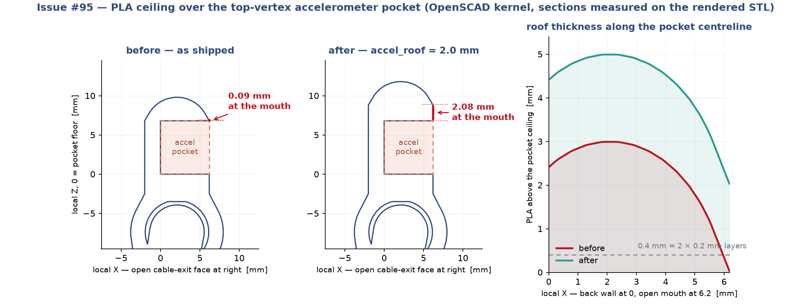

# Parametric B-rep routes for the T3-prism (issue #95)

`t3-prism.scad` is a **mesh** model. OpenSCAD's kernel has no notion of "a
sphere" — `$fn = 48` means every sphere is a 48-sided polyhedron — so it has no
STEP exporter and structurally cannot have one. Issue #95 asked for the two
routes that do produce real B-rep, "especially the driving of Onshape via
FeatureScript".

Both are implemented here and both have been run end-to-end.

| | route B — build123d | route C — Onshape FeatureScript |
|---|---|---|
| source | [`t3_prism_b123d.py`](t3_prism_b123d.py) | [`t3-prism.fs`](t3-prism.fs) + [`onshape_featurescript_t3prism.py`](onshape_featurescript_t3prism.py) |
| kernel | OCCT (via `build123d` / `cadquery-ocp`) | Parasolid (Onshape server-side) |
| needs an account | no — runs in CI | yes (`ONSHAPE_ACCESS_KEY` / `ONSHAPE_SECRET_KEY`) |
| output | `.step` files on disk | a live **feature tree**, plus `.step` on request |
| editable by the team | edit the Python, re-run | edit the feature's named parameters in the Onshape UI, Regenerate |

## Route C — the live feature tree

```bash
python3 cad/t3-prism/onshape_featurescript_t3prism.py
python3 cad/t3-prism/onshape_featurescript_t3prism.py --export-step out.step
python3 cad/t3-prism/onshape_featurescript_t3prism.py \
    --param scaleFactor=1.5 --param 'pocketZ=7.1 mm' --param addAccelBottom=false
```

The script creates (or reuses) a document, pushes `t3-prism.fs` into a Feature
Studio, compiles it server-side, cuts a version — custom features can only be
referenced from a version, never a workspace — creates a Part Studio, and adds
the custom feature to its tree. Re-runs are idempotent: the previous T3-prism
feature is deleted first, so the tree does not accumulate copies.

What the team gets is a Part Studio containing one editable
`T3 Prism (tensegrity)` feature. Double-click it, type a new number into
"Pocket Z (depth)", Regenerate. Rollback works. Version history works. That is
the thing a STEP import can never give you, no matter how clean the STEP is.

`--dry-run` validates the FeatureScript source and the parameter payloads
locally, without touching Onshape or needing credentials.

Parameter driving is verified live, not assumed. Each kind was pushed through
the API and the regenerated bounding box read back:

| `--param` | effect on the model |
|---|---|
| `'pocketZ=7.6 mm'` (quantity) | height 103.83 → **104.63 mm**, i.e. exactly the +0.80 mm asked for |
| `addAccelBottom=false` (boolean) | footprint 81.19 × 78.66 → **62.16 × 69.46 mm**, the bottom key-seats gone |
| `part=STRUTS` (enum) | TPU part dropped, PLA unchanged at 81.19 × 78.66 × 103.83 mm |

### Five things that cost real time, recorded so they cost nobody else any

1. **`BLEND_BOUNDS` is already exported by `onshape/std/fillet.fs`.**
   Redeclaring it kills the entire Feature Studio's compile, and the API
   reports this as `featureSpecs: []` with **no error message of any kind** —
   no notices, no diagnostics, nothing. All bound constants in `t3-prism.fs`
   are `T3_`-prefixed for this reason. If a studio mysteriously stops
   compiling, suspect a name collision with the std library first.
2. **`fSphere` takes its centre as a `Query`, not a `Vector`.** The `f*`
   wrappers are built for interactive features that reference existing
   geometry (a vertex, a mate connector). Generated models want `opSphere`,
   which takes a plain `Vector`. `fCylinder` and `fCuboid` do take vectors, so
   the inconsistency is easy to trip over.
3. **Operation ids must be contiguous per parent.** FeatureScript rejects a
   parent id used at two non-contiguous points in the operation history
   (`Cannot have t3.cut between t3.pla.mtT0 and t3.pla.mtT1`), which rules out
   the obvious structure of grouping solids under a `pla` prefix and cut tools
   under a `cut` prefix while interleaving their creation. Bodies are collected
   into query arrays and unioned with `qUnion` instead.
4. **`POST .../features` needs the flattened `btType` serialization.** The
   older `{"type": 134, "typeName": "BTMFeature", "message": {...}}` envelope
   is rejected with a bare `"Feature has invalid type"`. Use
   `{"btType": "BTMFeature-134", "featureType": ..., "parameters": [...]}`.
5. **`BTMParameterEnum` needs the custom feature's namespace.** `T3Part` is
   declared in our own Feature Studio, so the `namespace` field has to repeat
   the `d…::v…::e…::m…` string. Leaving it empty is accepted by the API — the
   `POST` returns 200 — and then fails at regeneration with a bare
   `featureStatus: ERROR` and no message. Quantity and boolean parameters do
   not need it, which makes this one easy to miss.

Debugging tip: Feature Studio compile failures are silent, but the Part
Studio's `POST .../featurescript` eval endpoint gives real, line-numbered
errors. It only accepts a single anonymous `function(context is Context,
queries is map) {...}` — no `FeatureScript NNNN;` header and no `import` — so
to lint this file you rewrite each top-level `function foo(...)` as
`const foo = function(...)`, inline them into the eval body along with the
feature body, and submit that. That is how every error above was found.

## Route B — build123d

```bash
pip install build123d
python3 cad/t3-prism/t3_prism_b123d.py --out-dir cad/t3-prism/step
```

Everything except the `hull()` calls is a 1:1 translation — OpenSCAD's
`sphere`, `cylinder`, `cube`, `union` and `difference` all map onto OCCT
directly and come out better, because there is no tessellation.

## The `hull()` problem, and what each route does about it

The SCAD has ten `hull()` calls and neither OCCT nor Parasolid has a convex
hull operation. They fall into two kinds:

**`hull(sphere_a, sphere_b)` — the teardrop joint blend.** This one has an
exact closed form: the convex hull of two spheres is the two spheres plus the
truncated cone tangent to both, and the tangent circles are analytic. Route B
implements exactly that (`hull_of_two_spheres`), so the teardrop is not an
approximation — it is the same solid the SCAD describes, minus the faceting.

**`hull(slab, sphere)` — the igloo skirt and the bottom key-seat skirt.** No
closed form. Both routes replace these with a union plus a fillet, which is
smoother and lower-stress than a convex hull and is what a CAD engineer would
have drawn, but is **not the same solid**.

Route C's fillet runs on Parasolid and works. Route B's does not run by
default, and that is deliberate: the exact teardrop meets the shell sphere
along a *tangent* (G1-continuous) circle, and asking OCCT to fillet a tangent
edge aborts the process with SIGABRT — not an exception Python can catch, so
wrapping it in `try` does not help. `--blend` is available if you want to try
it on other parameter sets.

## Verification

Measured, not asserted. All three models built at the S0 sizing
(`scale_factor = 1.5 x 0.7692`), A3 accelerometer pocket.

| | SCAD → STL | route B (OCCT) | route C (Parasolid) |
|---|---|---|---|
| PLA bounding box | 81.19 x 78.65 x 105.81 mm | 81.19 x 78.66 x 105.83 mm | 81.19 x 78.66 x 105.83 mm |
| PLA volume | 19388.1 mm³ | 17648.7 mm³ (−9.0%) | 17177.0 mm³ (−11.4%) |
| TPU volume | 6222.3 mm³ | 6245.5 mm³ (+0.37%) | 6245.3 mm³ (+0.37%) |
| PLA representation | 48,728 triangles | 132 faces | 207 faces |
| TPU representation | 15,324 triangles | 15 faces | 15 faces |
| face types (PLA) | — | 21 spherical, 21 cylindrical, 6 conical, 84 planar | + torus (the fillets) |

Numbers refreshed after the issue-#95 `accel_roof` fix (below). Before it the
heights were 103.81 / 103.83 mm and the PLA volumes 18886.2 / 17146.9 /
16675.1 mm³.

Reading the numbers:

* **The bounding boxes agree to 0.02 mm**, which is the check that the vertex
  maths, the twist, the scale factor and the housing placement all ported
  correctly.
* **The TPU volumes agree to 0.003% between the two independent kernels**
  (6245.5 vs 6245.3 mm³) and sit **+0.37% above the mesh**. That sign is the
  point: a `$fn = 48` polyhedron is *inscribed* in the sphere it approximates,
  so the mesh must under-report, and it does, by about the right amount. Two
  independent kernels landing on the same number is what says the port is
  right.
* **The PLA volumes are lower, and that is the `hull()` substitution, not a
  bug.** Route B keeps the exact teardrop and only substitutes the two skirts
  (−9.2%); route C substitutes the teardrop as well (−11.7%). The difference
  between the two routes, 2.8%, is the teardrop bumps.
* The TPU bounding box is 88.84 mm tall in the B-rep versions against 103.83 mm
  in the STL. That is `cables_z_anchor()`, deliberately dropped — it is a pair
  of 5-micron spikes that exist only to pin a separately exported STL's
  bounding box so Bambu Studio's per-part auto-bed-placement shifts both halves
  identically. Inside one Part Studio (or one STEP assembly) both parts already
  share a coordinate system, so it has nothing to do.

## Issue #95 — the thin ceiling over the top accelerometer pocket

@sgbaird, 2026-08-05, looking at the live Onshape tree: *"ceiling of top
vertices are very thin ... following on bottom vertices seems fine though."*

**Cause.** `accel_mount_local()` hulled (SCAD) / unioned (routes B and C) the
igloo crown straight off the body's **top rim**, at `bz1 = pocket_z`. The pocket
mouth is flush with the body's front face (`bx1 == accel_pocket_x()`), so the
pocket's top-front edge *is* the body's top-front edge — and any convex cap
springing from that rim has zero thickness there by construction. It is not a
tolerance or a faceting artefact; it is exact.

**Measured** on the as-shipped struts STL, ray-casting straight down through the
pocket footprint at a top vertex:

| | before | after |
|---|---|---|
| roof at the open (cable-exit) mouth | **0.085 mm** | 2.085 mm |
| roof at the crown | 2.99 mm | 4.99 mm |
| roof area under 1.0 mm | 12% | 0% |
| roof area under 0.4 mm (2 × 0.2 mm layers) | 4% | 0% |

The bottom key-seats were fine because they skip the dome entirely: they cap
with a uniform `accel_flat = 2.0 mm` slab.

**Fix.** A new `accel_roof` (default 2.0 mm, = `accel_flat`) carries the
straight-walled body that far past the pocket ceiling *before* the crown starts,
on the **domed top mounts only**. The flat bottom key-seats keep `bz1 ==
pocket_z` and are geometrically byte-identical.

Because both the body top and the crown-sphere centre move up by the same
`accel_roof`, the crown/box intersection circle is unchanged (r = 3.95 mm,
comfortably inside the 8.2 × 10.2 mm top face) — so neither Parasolid's fillet
nor OCCT's union sees any new tangency, which is why this landed on all three
kernels with no blend trouble.

**Cost.** +2.0 mm of overall specimen height (103.81 → 105.81 mm) and +501.9 mm³
of PLA. The three kernels agree on that added volume to better than 0.1 mm³
(3 × 8.2 × 10.2 × 2.0 = 501.84 mm³ exactly), which is a decent independent check
that the same edit landed identically in all three ports. Footprint, pocket
interior, sensor seat height and every TPU dimension are unchanged.

Set `accel_roof = 0` to recover the previous geometry.



## Scope: what is deliberately *not* ported

`t3_prism_scaffold()` — the 7-per-cable PLA breakaway pillars — is in neither
route. Those pillars are print-support geometry that exists because Bambu's
overhang detector measures angle from vertical and skips the near-vertical
members; they are not part of the specimen. They stay in the SCAD, which is
what feeds the slicer. If a STEP of the as-printed (scaffolded) body is ever
wanted, the pillars are truncated cones and map onto `Solid.make_cone` /
`fCone` with no hull problem at all.

## What this does *not* replace

The `.3mf` files. They are not geometry containers — they carry the plate
layout, per-part extruder routing (PLA → extruder 1, TPU → extruder 2),
filament profiles and support settings. STEP is geometry only. Anything here is
an *additional* artifact next to the STL/3MF, never a substitute.

## Source of truth

`t3-prism.scad` remains the source of truth for what gets printed;
`t3-prism.fs` and `t3_prism_b123d.py` are ports of it. **If anyone hand-edits
geometry in Onshape, the next regeneration silently overwrites it.** Route C is
specifically built so that this does not have to happen: change the feature's
named parameters instead of pushing faces around, and the change is reproducible
by editing the matching parameter in the SCAD and the FS.
