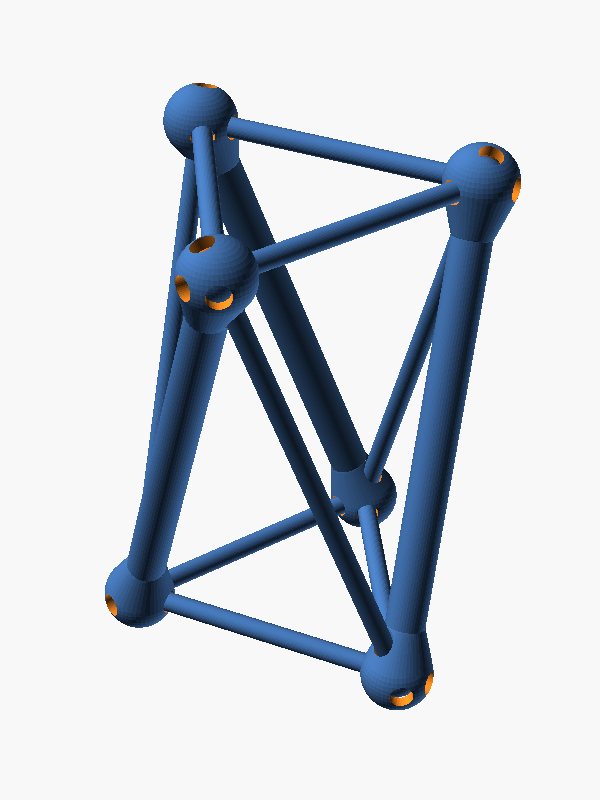
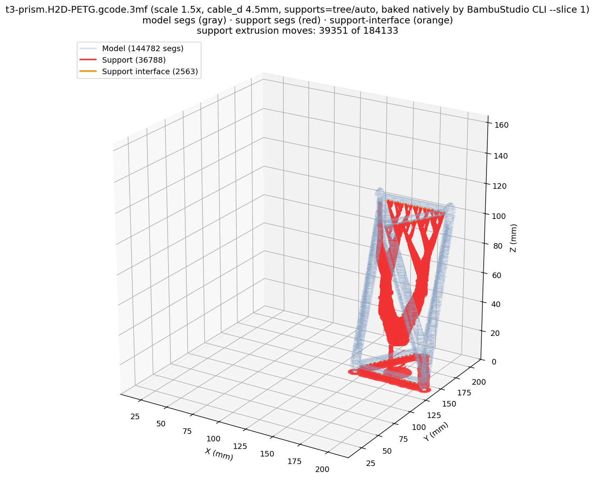
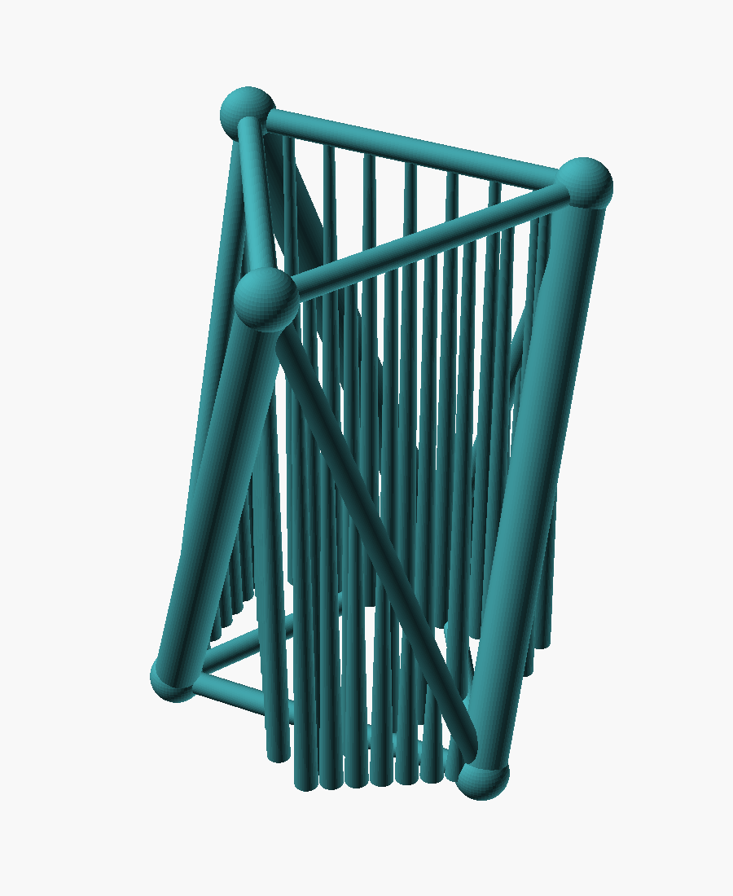

# T3-prism (3-strut tensegrity) — Bambu PETG print

Resolves the issue [_"Get a bambu sliced print for a T3-prism"_](../../README.md):
parametric CAD + a single-piece, pure-PETG, Bambu-bound g-code for the
canonical 3-bar tensegrity prism shown on
[Wikipedia: Tensegrity](https://en.wikipedia.org/wiki/Tensegrity).



## Geometry

A T3-prism has **3 compression members** ("struts") and **9 tension members**
("cables"): 3 around the bottom triangle, 3 around the top triangle, and 3
saddle/vertical cables connecting them. The two end triangles are
equilateral and inscribed in a circle of radius `R`; the top triangle is
rotated by `twist = 60°` relative to the bottom (the angle the issue calls
out and the relative twist visible in the Wikipedia reference image).

Connectivity (`i ∈ {0,1,2}`, mod 3):

| Member               | Endpoints       | Diameter (scale 1.5) |
| -------------------- | --------------- | -------- |
| Strut `i`            | `B_i  → T_i`    | 9.0 mm   |
| Bottom cable `i`     | `B_i  → B_{i+1}` | 4.5 mm   |
| Top cable `i`        | `T_i  → T_{i+1}` | 4.5 mm   |
| Saddle/vertical `i`  | `B_{i+1} → T_i` | 4.5 mm   |

Strut `i` and saddle `i` meet at top vertex `T_i` but originate from
*different* bottom vertices — the defining "no two compression members
touch" property of a tensegrity (the struts are kept apart by the cables).

Default parameters (editable at the top of [`t3-prism.scad`](t3-prism.scad)).
All linear dimensions are `*_base * scale_factor`:

| Parameter      | Base   | × `scale_factor` (1.5) | Notes |
| -------------- | -----: | ---------------------: | --- |
| `R_base`       | 25 mm  | **37.5 mm** | end-triangle circumradius |
| `H_base`       | 70 mm  | **105 mm**  | inter-triangle height |
| `twist`        | 60°    | 60°         | top-triangle rotation (not scaled) |
| `strut_d_base` | 6 mm   | **9.0 mm**  | compression member diameter |
| `cable_d_base` | 3.0 mm | **4.5 mm**  | tension member diameter (see [Print failure mode](#print-failure-mode-top-cable-bridge-and-how-to-avoid-it) and [Scale-up](#scale-up-to-15-cable_d-30--45-mm) below) |
| `joint_d_base` | 7 mm   | **10.5 mm** | minimum vertex sphere/shell diameter (captive-core shell is upsized as needed; see [Captive TPU core](#captive-tpu-core-inside-pla-outer-shell) below) |
| `scale_factor` | —      | **1.5**     | uniform scale on every linear dim |
| `use_captive_core` | `true` | `true`  | captive TPU core inside PLA outer shell at every vertex (PR #35 comment 4511036510); set `false` for legacy solid-joint mode |
| `captive_bore_clear` | 0.4 mm | 0.4 mm | single-sided clearance around the TPU cable through the shell bore |
| `captive_bore_trap`  | 1.5 mm | 1.5 mm | min `(core_od - bore_d) / 2`; how much wider the core is than the bore so it can't back out |
| `captive_core_clear` | 0.5 mm | 0.5 mm | radial print-in-place gap (shell-ID − core-OD) / 2 |
| `captive_wall_base`  | 1.6 mm | **2.4 mm** | PLA shell wall thickness (scaled with `scale_factor`) |

Bounding box at scale 1.5 ≈ **75 × 75 × 115 mm**, volume ≈ **33 cm³** of
solid material. Comfortably fits the Bambu Lab H2D's 350 × 320 mm plate
— and 4 copies fit in a 2 × 2 grid for batch printing
([Batch printing](#batch-printing-for-the-optimization-campaign) below).

## Captive TPU core inside PLA outer shell

Per [PR #35 comment 4511036510](https://github.com/vertical-cloud-lab/tensegrity-optimization/pull/35#issuecomment-4511036510)
and the joint-design recommendation in
[PR #39 comment 4461700096](https://github.com/vertical-cloud-lab/tensegrity-optimization/pull/39#issuecomment-4461700096),
every joint vertex is now a **captive TPU core sphere trapped inside a
hollow PLA outer shell** — not a solid joint sphere with a half-buried
TPU cable end. @ctrhjk's PETG+TPU photo in
[PR #35](https://github.com/vertical-cloud-lab/tensegrity-optimization/pull/35)
showed the previous design failing in exactly the predicted way: the
cable was "encased within the PLA support, making it difficult to remove
… [and] inserts into kinda half of the joint ball, [giving] unstable
fixation". The captive-core design fixes both problems mechanically
(no chemistry assumption needed — PLA↔TPU butt-bond is only ~6.5 MPa in
shear; see `edison-trajectories/strut-material-selection-5bb5e5d3*`).

Geometry per joint (computed in `t3-prism.scad` `joint_shell()` +
`joint_core()`):

| Feature  | Value (scale 1.5×, `cable_d`=4.5) | Role |
| -------- | ---------------------------------: | --- |
| Bore Ø   | 5.3 mm = `cable_d` + 0.8 mm        | cable exit through the shell wall, with print clearance |
| Core OD  | 10.5 mm (clamped ≥ `joint_d`)      | TPU captive mass; >> bore Ø so it can't back out |
| Shell ID | 11.5 mm = core OD + 1.0 mm         | hollow cavity with print-in-place radial gap |
| Shell OD | 16.3 mm = shell ID + 4.8 mm wall   | PLA outer wall |

The strut-half of each joint is unioned with a teardrop `hull()` blend
along the strut axis (`captive_teardrop_z`/`captive_teardrop_d`), so the
shell-to-strut transition is filleted and not a sharp re-entrant corner.
Three cylindrical bores are differenced through the shell wall — one per
outgoing TPU cable — along the directions returned by
`vertex_cable_dirs_b(i)` / `vertex_cable_dirs_t(i)`.

In the multi-material slice, the PLA shell + struts go to extruder 1
and the TPU captive core + cables go to extruder 2. Because the core is
geometrically larger than any single bore (`captive_bore_trap ≥ 1.5 mm`
guarantees core_OD ≥ bore_d + 3 mm), the TPU mass at every vertex stays
trapped under cable tension regardless of inter-material adhesion. Set
`use_captive_core=false` on the OpenSCAD CLI to fall back to the legacy
solid-joint geometry for comparison prints.

## TPU z-alignment (`cables_z_anchor()`)

When the cables half is emitted as its own STL (`t3-prism-cables.stl`)
and imported into Bambu Studio alongside the struts STL, the slicer's
per-part "place on bed" routine lifts each STL independently so its own
lowest world-Z point sits at z=0. With the legacy solid-joint design,
the struts STL's lowest point was the joint sphere underside while the
cables STL's lowest point was the bottom-cable cylinder underside — the
two parts were offset by `(joint_d - cable_d)/2 ≈ 3 mm` in z and the
TPU cables visibly dropped relative to the joint spheres (reported above
[PR #35 comment 4511036510](https://github.com/vertical-cloud-lab/tensegrity-optimization/pull/35#issuecomment-4511036510)
as "horizontal cables too low at top and bottom"). The captive-core
design naturally closes most of this gap (the TPU core spheres extend
the cables STL bbox to ±`core_od/2`), and `cables_z_anchor()` adds a
5 µm × 5 µm axial spike at the assembly centroid spanning the exact
`[-shell_od/2, H+shell_od/2]` range of the struts STL so the two parts'
world-Z bounding boxes are byte-for-byte identical. Bambu Studio then
applies the same offset to both halves and the cables stay aligned with
the joints.

## Single-piece, pure-PETG

Per the issue, this revision is a **single-material print in PETG** — both
struts and cables are unioned into one solid body, manifold-checked with
`admesh`. No multi-material assembly, no removable supports between
materials. PETG is an appropriate first pass: tougher than PLA (so the thin
"cable" features are less brittle when handled), prints cleanly on Bambu's
default Engineering Plate / Textured PEI, and matches the project's planned
move to TPU/PETG multi-material in later issues.

## Build & slice

```bash
# One-shot for the H2D: STL + iso PNG + project .3mf + sliced .gcode.3mf
bash cad/t3-prism/render_print.sh
```

> The lab's only printer is the **Bambu Lab H2D**, so this pipeline now
> targets the H2D exclusively. See
> [`.github/copilot-instructions.md`](../../.github/copilot-instructions.md#hardware--target-printer).

Pre-reqs (Ubuntu 24.04):

```bash
sudo apt-get install -y openscad admesh xvfb \
    gstreamer1.0-plugins-base libsoup-3.0-0 libwebkit2gtk-4.1-0
```

The script auto-fetches the official BambuStudio Linux AppImage
(`v02.06.00.51`, pinned) into `/tmp/t3-prism/` on first run.

Outputs (committed):

| File | What |
| ---- | ---- |
| [`t3-prism.scad`](t3-prism.scad) | parametric source |
| [`t3-prism.stl`](t3-prism.stl) | watertight binary STL (manifold, single part), single-material |
| [`t3-prism-struts.stl`](t3-prism-struts.stl) | struts + joint spheres only (PLA half of the multi-material variant) |
| [`t3-prism-cables.stl`](t3-prism-cables.stl) | cables only (PETG half of the multi-material variant) |
| [`t3-prism-iso.png`](t3-prism-iso.png) | iso preview (above) |
| [`flatten_bambu_profile.py`](flatten_bambu_profile.py) | walks a Bambu `inherits:` chain and emits a single full-config JSON the CLI accepts |
| [`patch_mm_extruder.py`](patch_mm_extruder.py) | post-processes a `--assemble`d project `.3mf` to set per-part extruder assignments (CLI doesn't honour `--load-filament-ids` on merged objects) |
| [`t3-prism.3mf`](t3-prism.3mf) | **Bambu Studio project file** uploaded by @me-madsen — the H2D job that was actually started (PETG Basic, no supports). *Not* regenerated by `render_print.sh`. |
| [`slices/t3-prism.H2D.3mf`](slices/t3-prism.H2D.3mf) | **Single-material** (PETG) Bambu Studio project file generated by the CLI (no `--slice`). Open in Bambu Studio with *File → Open Project* (or drag-and-drop) to edit / re-slice. |
| [`slices/t3-prism.H2D-PETG.gcode.3mf`](slices/t3-prism.H2D-PETG.gcode.3mf) | **Sliced print job** for the H2D — the file you upload to the printer over LAN/cloud. Contains `Metadata/plate_1.gcode`. *Not* re-importable as a Bambu Studio project (see below). |
| [`slices/t3-prism.H2D-MM.3mf`](slices/t3-prism.H2D-MM.3mf) | **Multi-material** (PLA struts + PETG cables, IDEX) Bambu Studio project file. One assembled object with two parts: struts on extruder 1 (PLA), cables on extruder 2 (PETG). Open in Bambu Studio, hit *Slice plate* + *Send to printer* — no GUI fiddling required. See "Multi-material variant" below. |
| [`slices/t3-prism.H2D-MM-PLAcables.3mf`](slices/t3-prism.H2D-MM-PLAcables.3mf) | **Multi-material swap** (PETG struts + **PLA cables**, IDEX) Bambu Studio project file — same `--assemble`d two-part object as `H2D-MM.3mf` but with the per-part filament assignment swapped: struts on extruder 1 (PETG), cables on extruder 2 (PLA). Requested in PR #35 comment 4445480059 ("create a version of the T3-prism with the cables made of PLA"). See "Multi-material variant" below. |
| [`slices/t3-prism.H2D-MM-PLAstruts-TPUcables.3mf`](slices/t3-prism.H2D-MM-PLAstruts-TPUcables.3mf) | **Multi-material — production target** (PLA struts + **TPU 85A cables**, IDEX) Bambu Studio project file. Same two-part assembled object: struts on extruder 1 (PLA), cables on extruder 2 (TPU 85A). Requested in PR #35 comment 4455977731 ("a design that uses PLA for the struts and TPU for the cables so [the team] can slice and print this file directly"). PLA↔TPU has the best peer-reviewed inter-material bond data (see `edison-trajectories/strut-material-selection-*`). Drag in, hit *Slice plate* + *Send to printer*. See "Multi-material variant — production target" below. |

Verified slice statistics for `t3-prism.H2D-PETG.gcode.3mf` (read from
`Metadata/plate_1.gcode` inside the archive; BambuStudio CLI returns
`return_code: 0, error_string: "Success."`):

| Layers | Filament | Print time | Supports | Scale |
| -----: | -------: | ---------: | -------- | ----- |
| 385 @ 0.20 mm | 6.74 g PETG | 1 h 30 m 46 s | off (matches Marcus's project) | 1.0 (legacy) |
| ~575 @ 0.20 mm | 31.6 g PETG | ≈ 2 h 41 min | tree(auto) on, threshold 30° | **1.5 (default)** — see [Scale-up](#scale-up-to-15-cable_d-30--45-mm) |

### About the two `.3mf` flavors (and the import error)

There are **two distinct kinds** of `.3mf` in the Bambu ecosystem and
Bambu Studio treats them very differently:

- **Project `.3mf`** — `t3-prism.3mf` (Marcus's) and
  `slices/t3-prism.H2D.3mf` (CLI-generated). Microsoft OOXML zips
  containing `3D/3dmodel.model`, `3D/Objects/object_1.model`,
  `Metadata/project_settings.config` and `Metadata/model_settings.config`
  but **no `Metadata/plate_1.gcode`**. These open as editable projects
  in Bambu Studio (drag-and-drop, *File → Open Project*) and you can
  re-slice / change parameters / *Send to printer* from the GUI.

- **Sliced `.gcode.3mf`** — `slices/t3-prism.H2D-PETG.gcode.3mf`. Same
  zip layout *plus* `Metadata/plate_1.gcode` (and its `.md5`), exactly
  the layout the printer firmware expects. This is the file the LAN
  MQTT `print/project_file` command references via
  `param: "Metadata/plate_1.gcode"` (see
  [`vertical-cloud-lab/powder-doser` PR #23](https://github.com/vertical-cloud-lab/powder-doser/pull/23)
  for the full upload + start-print recipe). Bambu Studio
  intentionally **refuses to re-import** a `.gcode.3mf` with the error
  *"The file does not contain any geometry data / Loading of a model
  file failed"* — it is a printer-side artifact, not a model. (This
  refusal is a known Bambu Studio behavior; discussion threads on the
  Bambu Lab community forum and the BambuStudio GitHub issues confirm
  the project / sliced split.) If you want to edit settings and re-slice
  in the GUI, open `slices/t3-prism.H2D.3mf` instead.

### Print failure mode: top-cable bridge (history + current mitigation)

The first H2D PETG print of `t3-prism.3mf` (385 layers @ 0.20 mm,
flat-on-bed orientation, **2.4 mm cables**, no supports) **failed with
classic spaghetti detangling at the top cable layer**, exactly where
the [Edison ANALYSIS](../../edison-trajectories/2026-05-08-t3-prism-bambu-import-25c1c897.md)
of the geometry predicted. A follow-up print enabled Bambu Studio's
auto-supports — supports got attached to the struts but the slicer's
auto-detector **skipped the top cables** (a 2.4 mm Ø horizontal
cylinder didn't trip the threshold), the cables waved/sagged, and only
scaling the print to 1.3× (≈ 3.12 mm cables) finally got auto-supports
attached to the top cables. The failure mode is intrinsic to printing
this geometry single-piece, flat, with thin cables:

- Each top cable (`T_i → T_{i+1}`) is a **horizontal cylinder spanning
  ~43.3 mm** between two top-vertex joint spheres.
- At `cable_d = 2.4 mm`, the first layer of that bridge is a chord of
  the cylinder bottom only **~0.96 mm wide** (≈ 2 × 0.4 mm perimeters)
  — a sub-mm PETG strand suspended over a 43 mm gap.
- The struts and saddles arrive at the top vertices `T_i` *before* the
  top cable starts (around layer 362), so the joint spheres are solid
  anchors — but the bridge sliver still has to span the gap on its own.

**Applied in this revision** (all three mitigations active by default):

1. **`cable_d` bumped 2.4 → 3.0 mm** in `t3-prism.scad`. This sits
   inside the Edison-recommended 3.0–4.0 mm window and matches the
   ≈ 3.12 mm point at which Marcus's follow-up scale-1.3 print
   empirically triggered auto-supports on the top cables. The first-
   layer bridge chord roughly doubles in width and ~3 perimeters now
   span the gap.
2. **Supports forced ON** in `render_print.sh::enable_supports` for the
   H2D PETG slice (`enable_support=1`, `support_type=tree(auto)`,
   `support_threshold_angle=30`, `support_on_build_plate_only=0`,
   `tree_support_branch_angle=40`). The lower threshold + non-
   build-plate-only flag means the top cables get scaffolded even when
   the auto-detector is on the fence. **The same `enable_supports()`
   patch is now also applied to all three multi-material project
   `.3mf`s** (`H2D-MM`, `H2D-MM-PLAcables`, `H2D-MM-PLAstruts-TPUcables`),
   so dragging any of them into Bambu Studio and hitting *Slice plate*
   produces supports without needing to flip the toggle.
3. **Scale up 1.0 → 1.5×** (see [Scale-up](#scale-up-to-15-cable_d-30--45-mm)
   below). At scale 1.5 the cables become 4.5 mm Ø — comfortably above
   Bambu's auto-support threshold (verified at scale 1.3 ↔ ≈ 3.9 mm)
   and large enough that TPU 85A can self-bridge the top-triangle
   spans without supports.

### Scale-up to 1.5× (`cable_d` 3.0 → 4.5 mm)

After the team imported `slices/t3-prism.H2D-MM-PLAstruts-TPUcables.3mf`
into Bambu Studio and tried to slice
([PR #35 comment 4461996817](https://github.com/vertical-cloud-lab/tensegrity-optimization/pull/35#issuecomment-4461996817):
"not seeing any supports… the design itself is just too small, if it
were bigger then we don't necessarily need supports on the TPU"), it
became clear that even with `enable_support=1` baked into the project
config, Bambu Studio's auto-detector still skipped the 3.0 mm top cables
on the production-target slice — exactly the auto-detector boundary
@achris0520 originally observed at scale 1.0 ↔ 1.3.

So we added a **`scale_factor`** parameter (default **1.5**) at the top
of [`t3-prism.scad`](t3-prism.scad) that multiplies every linear
dimension. At scale 1.5:

| Dim         | Scale 1.0 | Scale 1.5 (default) | Why bigger helps |
| ----------- | --------: | --------: | --- |
| `cable_d`   |    3.0 mm | **4.5 mm** | 50% wider first-layer bridge chord; well above the auto-detector threshold and within the 1.2–6.0 mm printable-tendon window. TPU 85A self-bridges 4.5 mm cylinders without supports. |
| `strut_d`   |    6.0 mm | **9.0 mm** | proportional — keeps the strut-to-cable ratio constant. |
| `R`, `H`    | 25, 70 mm | **37.5, 105 mm** | bounding box ~75 × 75 × 115 mm — still fits 4-up on the 350 × 320 mm H2D plate (see [Batch printing](#batch-printing-for-the-optimization-campaign)). |
| Print time  | ≈ 1 h 41 m | ≈ 2 h 41 m | single-material PETG with supports, ≈ 31.6 g vs ≈ 11.6 g. |

To revert to the old size for a quick test print, run
`openscad -D 'scale_factor=1.0' …` or change the constant in
`t3-prism.scad`.

Optional further mitigations not applied here but documented for
re-runs:

4. **Re-orient so one strut lies flat on the build plate** — kills the
   horizontal top-triangle bridges entirely; cables print at
   self-supporting 30°–60° diagonals.
5. **Tune PETG bridge settings** — 100% fan + slicer bridge speed/flow
   overrides.

### Batch printing (for the optimization campaign)

Per [PR #35 comment 4461855403](https://github.com/vertical-cloud-lab/tensegrity-optimization/pull/35#issuecomment-4461855403)
("we can definitely start doing batch prints for these since it won't
take an exorbitant amount of time longer per print than doing a single
print … in general we can do batch prints during the optimization
campaign #29 #30 #23 #24"), the H2D's 350 × 320 mm plate fits a 2 × 2
grid of scale-1.5 prisms (each ~75 × 75 mm) with comfortable spacing —
or a 3 × 2 grid if oriented strut-flat. Recommended workflow:

1. Open `slices/t3-prism.H2D-MM-PLAstruts-TPUcables.3mf` in Bambu Studio.
2. Right-click the assembled object → *Clone* → enter the desired count
   (4 for 2 × 2, 6 for 3 × 2). Bambu Studio will auto-arrange.
3. *Slice plate* (supports already on from this PR) → *Send to printer*.

A single 4-up batch on the H2D takes ≈ 4 × the per-part filament but
only ≈ 1.3–1.5× the per-part time (motion + heat-up + bridge purge are
amortised across the batch), so for the optimization campaign DoE
([#23](https://github.com/vertical-cloud-lab/tensegrity-optimization/issues/23),
[#24](https://github.com/vertical-cloud-lab/tensegrity-optimization/issues/24),
[#29](https://github.com/vertical-cloud-lab/tensegrity-optimization/issues/29),
[#30](https://github.com/vertical-cloud-lab/tensegrity-optimization/issues/30))
this is the obvious path to higher throughput. We deliberately keep the
committed `slices/*.3mf` as **single-instance** projects so the team can
choose 1, 4, or 6 copies per print interactively in Bambu Studio
depending on filament budget and which DoE corner they're sampling.

### Can the BambuStudio CLI add supports?

Yes. Supports are a process-profile setting (`enable_support`,
`support_type`, `support_threshold_angle`, `support_on_build_plate_only`,
`tree_support_branch_angle`, …) in `Metadata/project_settings.config`
inside the `.3mf`. The `enable_supports()` helper in
[`render_print.sh`](render_print.sh) patches these fields into the
flattened process JSON before the CLI's slice pass, so the resulting
`.gcode.3mf` includes generated support g-code (we verified
`enable_support='1'` and `support_type='tree(auto)'` in the committed
`slices/t3-prism.H2D-PETG.gcode.3mf`'s
`Metadata/project_settings.config`). Both manual (`grid`/`normal(auto)`)
and tree (`tree(auto)`/`tree(hybrid)`) supports are reachable through
the same JSON knobs, and `support_filament` can route them to a
specific extruder on the IDEX H2D if you want PLA scaffolding under
PETG cables.

#### Verifying supports are *natively* in the sliced g-code

Per [PR #35 comment 4462414588][c-supports-render]'s ask ("we'll
likely start sending these prints programmatically [#31][i31] /
[powder-doser PR #23][pd23] rather than using Bambu Studio… show me
a render of your sliced file so I can verify supports actually
exist"), the pipeline also emits a colour-coded 3D render of
`plate_1.gcode` after each slice:



The render is produced by [`render_supports.py`](render_supports.py),
which parses every `G0`/`G1`/`G2`/`G3` extrusion move in
`Metadata/plate_1.gcode` and bins it by the BambuStudio `; FEATURE:`
marker. For `slices/t3-prism.H2D-PETG.gcode.3mf` (scale 1.5×,
`cable_d = 4.5 mm`, supports forced on by `enable_supports()`) the
parser counts **36 788 support extrusion moves + 2 563 support-
interface moves out of 184 133 total extrusion moves** — confirming
that the BambuStudio CLI (`--slice 1`) actually wrote the tree(auto)
scaffolding into the g-code, not just toggled a flag in
`project_settings.config`. The tree branches under the lower triangle
and the dense fan under the top triangle (which carries the three
horizontal top cables) are both clearly visible in red, with
support-interface caps in orange right under the model overhang.

This step runs at the end of [`render_print.sh`](render_print.sh)
without any GUI dependency, so the same verification can be performed
unattended in CI / on a headless render host.

[c-supports-render]: https://github.com/vertical-cloud-lab/tensegrity-optimization/pull/35#issuecomment-4462414588
[i31]: https://github.com/vertical-cloud-lab/tensegrity-optimization/issues/31
[pd23]: https://github.com/vertical-cloud-lab/powder-doser/pull/23


### Multi-material variant (PLA struts + PETG cables, IDEX)

`slices/t3-prism.H2D-MM.3mf` is a Bambu Studio project that splits the
T3-prism into two parts of a single assembled object:

| Part | Filament | H2D extruder | Tensegrity role |
| ---- | -------- | -----------: | --------------- |
| `t3-prism-struts.stl` (3 struts + 6 joint vertex spheres) | **PLA** | 1 (left) | rigid compression members + load-bearing nodes |
| `t3-prism-cables.stl` (3 bottom + 3 top + 3 saddle cables) | **PETG** | 2 (right) | tougher tension members; the PETG slot is the placeholder we'll swap to **TPU** later for true compliant strings |

PLA owns the joints because the tensegrity invariant is "stiff bars in
compression don't touch each other but do meet the strings at the
nodes" — putting the joint spheres in the rigid filament gives every
vertex a hard anchor that the cable end-caps (each cable is rendered
with a half-sphere at each end, by the same `member()` helper as the
single-material model) bond into during the multi-material print.

How it's built (`slice_bambu_mm` in `render_print.sh`):

1. OpenSCAD renders `t3-prism-struts.stl` and `t3-prism-cables.stl`
   pre-translated to the H2D bed centre (`offset_x=175`, `offset_y=160`,
   `offset_z=3.5`) so both halves share the same world coordinates and
   form a true assembled tensegrity, not two separate objects on the
   plate.
2. `BambuStudio --assemble --export-3mf` (no `--slice`) merges both
   STLs into a single object with two `<part>`s under
   `3D/Objects/object_1.model`.
3. `patch_mm_extruder.py` rewrites `Metadata/model_settings.config` so
   the cables `<part>` carries `extruder=2` (PETG); the struts `<part>`
   keeps the default `extruder=1` (PLA).

Open `slices/t3-prism.H2D-MM.3mf` in Bambu Studio (drag-and-drop or
*File → Open Project*); both parts are already merged with the correct
PLA / PETG extruder assignment. Hit *Slice plate* and *Send to printer*
— no manual GUI fiddling required.

The script does **not** emit a sliced `.gcode.3mf` for the
multi-material variant. BambuStudio v02.06.00.51's headless slice path
crashes (`free(): invalid pointer`) when `--load-filament-ids "1,2"` is
combined with `--assemble + --slice`, and re-loading a project `.3mf`
as input + `--slice` fails with *"No valid nozzle found. Please check
nozzle count."* — so the GUI is currently the only reliable way to
slice the assembly. Track this against future BambuStudio releases.

### Multi-material variant — swap (PETG struts + PLA cables, IDEX)

`slices/t3-prism.H2D-MM-PLAcables.3mf` is the same `--assemble`d two-part
project as `H2D-MM.3mf`, but with the per-part filament assignment
swapped — requested in
[PR #35 comment 4445480059](https://github.com/vertical-cloud-lab/tensegrity-optimization/pull/35#issuecomment-4445480059)
("create a version of the T3-prism with the cables made of PLA"):

| Part | Filament | H2D extruder | Tensegrity role |
| ---- | -------- | -----------: | --------------- |
| `t3-prism-struts.stl` (3 struts + 6 joint vertex spheres) | **PETG** | 1 (left) | tougher compression members + load-bearing nodes |
| `t3-prism-cables.stl` (3 bottom + 3 top + 3 saddle cables) | **PLA**  | 2 (right) | stiffer tension members (PLA E ≈ 3.3 GPa vs PETG ≈ 2 GPa) |

PLA cables give a much stiffer "string" than PETG cables. This is an
A/B comparison print against `H2D-MM.3mf` (PLA struts + PETG cables) to
help decide which polymer pair best previews the eventual TPU 85A
swap on the cables. Same parametric SCAD geometry (`cable_d = 3.0 mm`,
supports forced on per the H2D recipe) — only the filament-vs-part
assignment changes, achieved by swapping the order of the two
`--load-filaments` arguments in the second `slice_bambu_mm` call in
`render_print.sh` (the `patch_mm_extruder.py` step still maps
`t3-prism-cables.stl → extruder 2`, but extruder 2 is now PLA).

**Mechanical interlock at the joint** (PLA-cable–to–PETG-strut bonding) is
out of scope for this slice — the parts share a small overlap volume at
each vertex sphere, but PLA does not chemically bond to PETG. The
"TPU glove around the strut ends" mechanical-interlock concept being
discussed in
[PR #39 comment 4427586306](https://github.com/vertical-cloud-lab/tensegrity-optimization/pull/39#issuecomment-4427586306)
will need a small SCAD addition (a thin TPU sleeve around the upper
end of each strut) to be tracked there, not here.

### Multi-material variant — production target (PLA struts + TPU 85A cables, IDEX)

`slices/t3-prism.H2D-MM-PLAstruts-TPUcables.3mf` is the **production
target** pairing — what the team will actually print when they want a
real-feeling tensegrity demonstrator. Requested in
[PR #35 comment 4455977731](https://github.com/vertical-cloud-lab/tensegrity-optimization/pull/35#issuecomment-4455977731)
("a design that uses PLA for the struts and TPU for the cables so
[@me-madsen / @achris0520 / @ctrhjk] can slice and print this file
directly"):

| Part | Filament | H2D extruder | Tensegrity role |
| ---- | -------- | -----------: | --------------- |
| `t3-prism-struts-scaffold.stl` (3 struts + 6 joint spheres + 42 PLA scaffold pillars) | **PLA** (`Bambu PLA Basic @BBL H2D`) | 1 (left) | rigid compression skeleton + sacrificial supports under the TPU cables |
| `t3-prism-cables.stl` (3 bottom + 3 top + 3 saddle cables) | **TPU 85A** (`Bambu TPU 85A @BBL H2D 0.4 nozzle`) | 2 (right) | compliant tension members (E ≈ 12 MPa secant, σ_break ≈ 26 MPa) |

This is the closest single-print analog to a real tensegrity: stiff PLA
bars carry compression, soft TPU 85A "strings" carry tension, and the
two are mechanically locked at each joint sphere.

**Modeled-in PLA scaffold under the TPU cables.** Per
[PR #35 comment 4464251671](https://github.com/vertical-cloud-lab/tensegrity-optimization/pull/35#issuecomment-4464251671)
("we want to put PLA support points at 7 points along the length of the
TPU to keep it upright"), the PLA half of the production variant now
includes **7 thin PLA pillars rising from the build plate up to
evenly-spaced touch-points on each of the 6 non-bottom-triangle cables**
(3 saddle + 3 top = 42 pillars total). The bottom-triangle cables sit
on the bed and don't need scaffolding, so their would-be pillars are
filtered out by the `scaffold_min_h` cutoff. Pillar geometry: truncated
cone, 3.0 mm Ø at the bed (stable base), 1.4 mm Ø at the cable contact
(snaps off cleanly post-print). Because the pillars are *modeled into
the geometry* and routed to the PLA extruder, the slicer cannot omit
them the way the tree(auto) auto-detector does for near-vertical
features; and because the PLA-TPU interface bond is weak in shear
(~6.5 MPa butt) the user can break the pillars off after the print
without scarring the TPU surface.



**Open in Bambu Studio**, hit *Slice plate*, then *Send to printer* —
the per-part extruder assignment, filament types, and bed type are all
baked in. Same parametric SCAD geometry as the rest of this directory
(`cable_d = 3.0 mm`, supports forced on by the H2D process recipe so the
top-cable bridges get scaffolded — TPU especially needs the support).

**PLA↔TPU bond strength** is the best-characterized FFF inter-material
bond in the literature: PLA–TPU butt-fusion 6.5 MPa, alternating-deposition
7.4 MPa, mechanical-interlock shear ~24 MPa (Lopes 2018, Zhang 2026,
Ruwais 2025; see
[`edison-trajectories/strut-material-selection-5bb5e5d3-*.md`](../../edison-trajectories/strut-material-selection-5bb5e5d3-b386-4ece-a894-9c87f0d67036.md)).
This is why this MM pairing is the one to print first — the alternative
PETG–TPU pairing has *no* peer-reviewed bond data.

**Joint design** — the vertex spheres in this slice are simple unioned
overlaps. The TPU "glove" / barbed-rebar mechanical interlocks under
discussion in [PR #39](https://github.com/vertical-cloud-lab/tensegrity-optimization/pull/39)
and the joint-design Phase-3/4 Edison work (issue #38) will land in a
follow-up SCAD revision; for the first PLA+TPU print the union joint
plus PLA↔TPU adhesion should hold for handling and demonstration loads.

### CLI gotchas (from powder-doser PR #23)

The script handles four non-obvious gotchas:

1. **Inheritance is not resolved by the CLI.** Bundled
   `resources/profiles/BBL/{machine,process,filament}/*.json` files only
   carry overrides on top of `@base` parents. `flatten_bambu_profile.py`
   walks the `inherits:` chain and shallow-merges parent → child into a
   single full-config JSON.
2. **Identity-field patches.** The CLI's compatibility check needs
   `from = "system"`, `inherits = ""`, and (on the machine config)
   `printer_settings_id = <name>`. The flattener applies these.
3. **Bed compatibility.** PETG is rejected on the default Cool Plate
   (`return -61`); the script overrides `curr_bed_type = "Textured PEI
   Plate"` on the machine profile.
4. **IDEX manual filament map (H2D).** The H2D is dual-extruder, so
   even a single-filament print needs `--filament-map-mode Manual
   --filament-map 1`, and the manual-map setup is gated by
   `plate_to_slice != 0` so the script passes `--slice 1`.

### Sending to the H2D

Copy the sliced `.gcode.3mf` to the printer over LAN (FTPS on `:990`)
and start it via MQTT-over-TLS on `:8883`. The minimum payload is
documented in
[`vertical-cloud-lab/powder-doser` PR #23](https://github.com/vertical-cloud-lab/powder-doser/pull/23):

```bash
# Upload
lftp -u "bblp,<ACCESS_CODE>" -e \
  "set ftp:ssl-allow yes; set ssl:verify-certificate no; \
   cd /cache; put t3-prism.H2D-PETG.gcode.3mf; bye" \
  ftps://<PRINTER_IP>:990

# Start
mosquitto_pub --insecure -h <PRINTER_IP> -p 8883 \
  -u bblp -P "<ACCESS_CODE>" \
  -t "device/<SERIAL>/request" \
  -m '{"print":{"sequence_id":"0","command":"project_file",
       "param":"Metadata/plate_1.gcode",
       "url":"ftp:///cache/t3-prism.H2D-PETG.gcode.3mf",
       "project_id":"0","profile_id":"0","task_id":"0","subtask_id":"0",
       "subtask_name":"","md5":"","timelapse":false,"bed_type":"auto",
       "bed_levelling":true,"flow_cali":true,"vibration_cali":true,
       "layer_inspect":true,"ams_mapping":"","use_ams":false}}'
```

For the cloud / GUI workflow, open `slices/t3-prism.H2D.3mf` (the
project) in Bambu Studio and use *Send to printer*.

## References & related work

- Issue: ["Get a bambu sliced print for a T3-prism"](../../README.md)
- Programmatic-CAD pattern reused from
  [`vertical-cloud-lab/powder-doser` PR #16](https://github.com/vertical-cloud-lab/powder-doser/pull/16)
  (parametric `.scad` + headless OpenSCAD + slicer CLI).
- BambuStudio CLI recipe (flattening profiles, `xvfb-run`, software GL,
  inspecting `result.json` and the `Metadata/plate_1.gcode` inside the
  `.gcode.3mf`) reused from
  [`vertical-cloud-lab/powder-doser` PR #23](https://github.com/vertical-cloud-lab/powder-doser/pull/23).
- Programmatic-Bambu / meta-CAD survey:
  [`vertical-cloud-lab/powder-doser` PR #7](https://github.com/vertical-cloud-lab/powder-doser/pull/7).
- Reference image: [Wikipedia — T3-prism tensegrity](https://en.wikipedia.org/wiki/Tensegrity).
