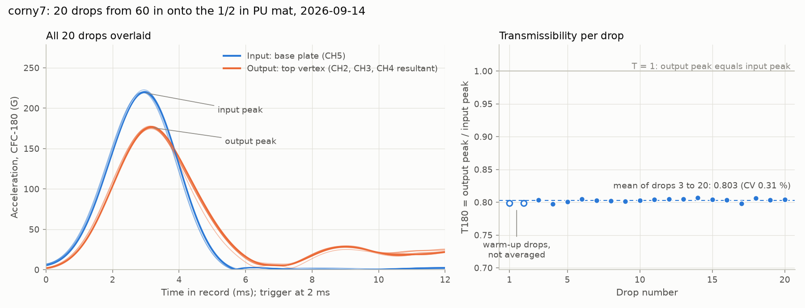

# corny7 drop data as CSV

Exported on 2026-09-28 for issue #110 (Justin's request). corny7 has one
recorded session: 20 drops on 2026-09-14, 11:03 to 11:17 Mountain Daylight
Time, from 60 in onto the 1/2 in polyurethane (PU) mat. No re-seat or
repeat session of corny7 exists yet.

| File | What it holds | Size |
|---|---|---|
| [`corny7_drops.csv`](corny7_drops.csv) | One row per drop (20 rows): peaks, transmissibility, pulse widths, velocity change, plus the data-acquisition software's own per-channel summary. **Start here.** | 5 kB |
| [`corny7_waveforms_50kHz.csv`](corny7_waveforms_50kHz.csv) | The acceleration time series of all 20 drops, 5,000 samples per drop (100,000 rows). Use it to plot the drops or compute your own metrics. | 3.5 MB |
| [`corny7_overview.png`](corny7_overview.png) | Quick-look figure drawn from the two CSVs. | 170 kB |
| [`box-ids.json`](box-ids.json) | Box file ids of the original full-resolution captures. | 2 kB |

Both CSVs open directly in Excel. In Python:

```python
import pandas as pd

drops = pd.read_csv("corny7_drops.csv")
waves = pd.read_csv("corny7_waveforms_50kHz.csv")
drop5 = waves[waves["drop_number"] == 5]    # one drop's time series
```



## How a drop is measured

The specimen sits on a base plate that is dropped from 60 in onto the PU
mat. Four accelerometer channels are recorded for every drop:

- **CH5**: a single-axis accelerometer on the base plate. This is the
  **input**, the shock delivered to the bottom of the specimen. CH5 also
  triggers the recording when it crosses 150 G.
- **CH2, CH3, CH4**: a three-axis accelerometer seated at the specimen's
  top vertex. Together they are the **output**, the shock that reaches the
  top of the specimen, where a payload would sit.

The recorder (Lansmont Test Partner 4, "TP4" below) samples all four
channels at 1.25 MHz for 100 ms per drop, starting 2 ms before the trigger.

**Transmissibility T** is the output peak divided by the input peak. T below
1 means the specimen reduced the shock; T above 1 means it amplified it.
The lab ranks designs by **T180**, T computed after both signals pass
through a CFC-180 low-pass filter (CFC is the Channel Frequency Class of
the SAE J211 standard for impact-test instrumentation; the lab implements
CFC-180 as a 2nd-order Butterworth low-pass at 300 Hz run forward and
backward). T1000 is the same ratio with a 1,650 Hz filter, so it keeps
more high-frequency content.

corny7 averaged **T180 = 0.803** over drops 3 to 20 (coefficient of
variation 0.31 %), the lowest T180 on record in the project. corny7 is
design **t37** from Bayesian optimization round 4: rigid polylactic acid
(PLA) struts and flexible thermoplastic polyurethane (TPU) cables, mass
19.62 g, radius 34.34 mm, height 67.12 mm, twist 78.98 degrees, strut
diameter 8.98 mm, cable diameter 2.58 mm, strut infill 22 %, cable infill
21 %, no logged print defects.

## `corny7_drops.csv` columns

Except for the `tp4_` columns, every channel is zeroed first by
subtracting its median over the last 30 ms of the record (70 to 100 ms).
The lab zeroes on the tail rather than on the 2 ms before the trigger
because the base plate is already pressing into the mat by then. Peaks are
CFC-filtered unless the column name says `raw`.

| Column | Meaning |
|---|---|
| `drop_number` | Drop number, 1 to 20 (also the capture number `Signal<k>` on Box) |
| `time_local` | When the drop happened, Mountain Daylight Time (UTC minus 6 h) |
| `warmup` | `True` for drops 1 and 2. The lab procedure treats the first two drops of a session as rig settling and leaves them out of averages. |
| `input_peak_cfc180_g` | Peak CH5 acceleration, CFC-180 (G) |
| `output_peak_cfc180_g` | Peak of the top-vertex resultant, the square root of CH2² + CH3² + CH4², CFC-180 (G) |
| `T180` | `output_peak_cfc180_g / input_peak_cfc180_g` |
| `input_peak_cfc1000_g`, `output_peak_cfc1000_g`, `T1000` | Same as above with CFC-1000 |
| `input_peak_raw_g`, `output_peak_raw_g` | Same peaks with no filter (G) |
| `input_pulse_width_ms`, `output_pulse_width_ms` | Width of the CFC-180 pulse at half its peak (ms) |
| `output_lag_ms` | Time from the input peak to the output peak (ms) |
| `input_delta_v_m_s` | Base-plate velocity change during the impact: CH5 (CFC-180) integrated from 2 ms before to 15 ms after the input peak (m/s). Free fall from 60 in is 5.47 m/s. |
| `ring_freq_hz`, `ring_damping_pct` | Frequency and damping ratio of the top-vertex vibration after impact, from a decay fit |
| `ring_fit_r2` | Quality of that decay fit. **Use the two ring columns only where this is 0.85 or higher** (the lab's cutoff), which holds for 8 of the 20 drops (3, 5, 6, 7, 8, 9, 11, 14). Below it the vibration is not a single decaying mode and the damping value is meaningless (drop 2 even comes out negative). |
| `rebound_time_ms` | Time from impact to the largest later burst on the top-vertex channels, searched 15 to 70 ms after impact and taken as the specimen landing again after it bounces (ms) |
| `e_rebound` | Rebound coefficient g·t / (2·Δv), with g = 9.807 m/s², t = `rebound_time_ms` in seconds, and Δv = `input_delta_v_m_s` |
| `tp4_ch<n>_peak_g`, `tp4_ch<n>_duration_ms`, `tp4_ch<n>_delta_v_m_s` | The recorder software's own per-channel summary, copied from its series table: signed peak (G), pulse duration (ms), and velocity change (converted from in/s to m/s). Use these to cross-check, not in place of the columns above: they are per axis rather than a resultant, and the software picks its own integration window. On CH5 they agree with `input_peak_raw_g` to within 0.8 % and with `input_delta_v_m_s` to within 3 %. |

## `corny7_waveforms_50kHz.csv` columns

| Column | Meaning |
|---|---|
| `drop_number` | Drop number, 1 to 20 |
| `time_ms` | Time within the 100 ms record, 0.00 to 99.98 ms in 0.02 ms steps. The trigger is at 2.00 ms; the input peak lands near 3 ms. |
| `ch2_g`, `ch3_g`, `ch4_g` | Top-vertex accelerations (G), the output |
| `ch5_g` | Base-plate acceleration (G), the input |

These are the recorded values with **no zeroing and no filtering**. The
original captures are 1.25 MHz (125,000 samples per drop, about 9.6 MB per
drop, 183 MB for the session), so they were downsampled 25 times to
50 kHz with an anti-aliasing filter. That keeps everything below about
20 kHz, far above the 1,650 Hz the lab's widest filter keeps.

To reproduce the `T180` column from this file, for each drop: subtract
each channel's median over 70 to 100 ms; low-pass every channel with a
2nd-order Butterworth at 300 Hz using a zero-phase (forward and backward)
filter, for example `scipy.signal.butter` plus `scipy.signal.filtfilt`;
find the CH5 peak within the first 15 ms; take the largest top-vertex
resultant within 5 ms of it; and divide. Done this way, every drop lands
within 0.06 % of the `T180` column. The `raw` peak columns do not
reproduce exactly from this file: downsampling removes the content above
20 kHz, so unfiltered peaks come out up to 1 % low on the input and up to
3 % low on the output.

## Things to know before analyzing

- **One seating only.** The lab rule is that a result counts as a property
  of the design only after the specimen is removed, re-seated, and
  re-dropped. corny7 has not been re-seated yet, so 0.803 is still a
  single-seating value. Print files for a replicate study were prepared
  on 2026-09-28 on the Bayesian optimization pull request (#102): nine new
  prints of the corny7 design (three on each of three plates, labeled
  `[plate]sne7[copy]`, for example `2sne73`), alongside copies of corny8
  and corny2.
- **`rebound_time_ms` switches between two values.** corny7 bounces twice:
  a small landing near 15 ms and the main landing 41.5 to 45.5 ms after
  impact. The detector picks whichever burst is larger on that drop, so 7
  of the 20 drops (2, 6, 9, 14, 15, 19, 20) report about 15 ms and the
  rest report the main landing. Split the two groups before averaging
  `rebound_time_ms` or `e_rebound`.
- The input varied little: `input_peak_cfc180_g` stayed between 218.9 and
  222.8 G across the session, and the lab's automatic drift check found no
  trend in T180 over drops 3 to 20.
- Slow-motion video (about 960 frames per second) exists for drops 1, 10,
  and 20 on the same Box share, listed in the corny check-in's video
  manifest on PR #86. For corny7, the clip labeled 10th most likely shows
  drop 11, and the clip labeled 20th started after the last drop.

## Where this came from

- Raw captures: the lab's public Box share, session folder
  "9-14-2026 - corny7 - 60 in - 0.5 mat - 20 drops" (ids in
  [`box-ids.json`](box-ids.json)), uploaded by @ctrhjk and first analyzed
  in the corny1 to corny9 check-in on PR #86 (branch
  `copilot/add-drop-test-protocol-again`, folder
  `data/drop-tests/corny-checkin/`), which also covers the other eight
  corny specimens.
- The per-drop metrics come from the lab's drop-test pipeline on that
  branch at commit `314fc4c` (`analyze_capture` in
  `scripts/analysis/drop_test_abc123_blind_analysis.py`, run with the tail
  baseline). For drops 3 to 20 they match the check-in's committed
  `campaign_metrics.json` exactly; drops 1 and 2 are new here because the
  check-in leaves warm-up drops out.
- Regenerate everything, or export another session by pointing
  `--manifest` at that session's `box-ids.json`, with
  [`scripts/analysis/drop_test_session_csv_export.py`](../../../scripts/analysis/drop_test_session_csv_export.py).
  It needs the PR #86 pipeline (`--pipeline-dir`) until that pull request
  merges.
