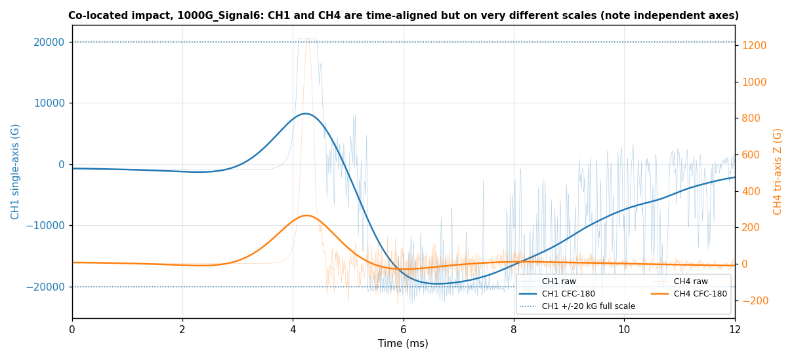
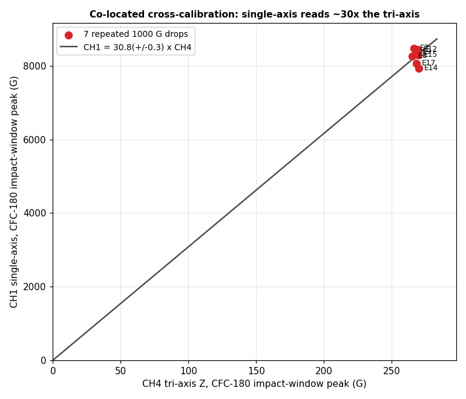
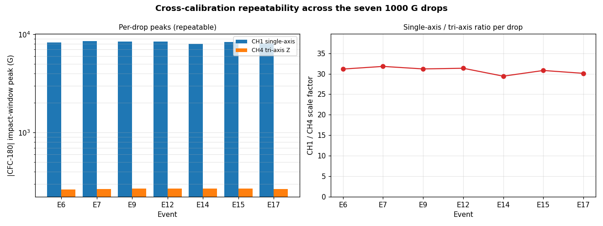
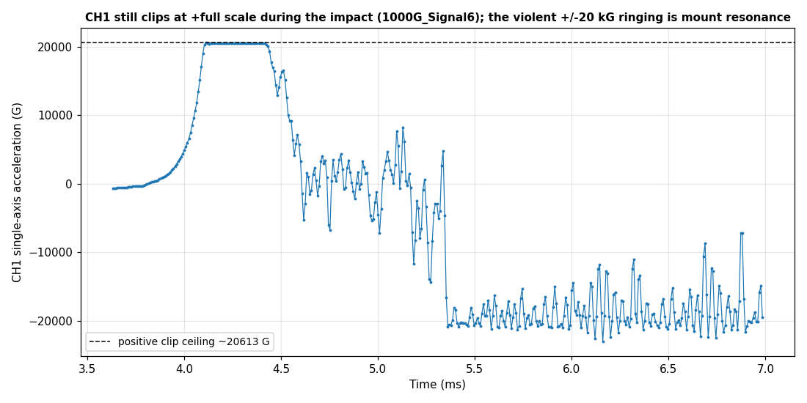

# Co-located accelerometer cross-calibration analysis (issue #71 follow-up)

Analysis of the 06/08/2026 drop-tower series @ctrhjk posted in
[PR #74 comment 4663450421](https://github.com/vertical-cloud-lab/tensegrity-optimization/pull/74#issuecomment-4663450421).
This is the **co-located, back-to-back** run recommended in the
[tuning analysis](accelerometer-tuning-analysis.md): per
[issue #71](https://github.com/vertical-cloud-lab/tensegrity-optimization/issues/71#issuecomment-4634258100)
(assumed, pending @ctrhjk's confirmation) **both accelerometers are mounted
directly on the bottom acrylic plate**, so they see the same rigid-body input and
can finally be cross-calibrated.

- **Raw data:** [`data/drop-tests/accelerometer-calibration/raw/`](../data/drop-tests/accelerometer-calibration/raw)
  (8 TP4 time-domain CSVs).
- **Script:** [`scripts/analysis/accelerometer_calibration_analysis.py`](../scripts/analysis/accelerometer_calibration_analysis.py)
  (`python3 scripts/analysis/accelerometer_calibration_analysis.py`).
- **Derived table:** [`data/drop-tests/accelerometer-calibration/calibration_summary.csv`](../data/drop-tests/accelerometer-calibration/calibration_summary.csv).
- **Figures:** [`docs/figures/accelerometer-calibration/`](figures/accelerometer-calibration).

## Setup

| Channel | Sensor                    | Full scale | Sensitivity |
| ------- | ------------------------- | ---------- | ----------- |
| CH1     | single-axis accelerometer | 20,000 G   | 0.25 mV/G   |
| CH2–CH4 | tri-axis (X, Y, Z)        | 10,000 G   | 1.0 mV/G    |

CH1 was stepped up to a 20,000 G full scale (the tuning recommendation, after the
earlier 10,000 G part railed at ~8.8 kG). `500G_Signal5` (trigger 500 G) is a
low-amplitude / aborted capture and is excluded from the regression; the seven
`1000G_Signal*` events (trigger 1000 G) are the clean repeated drops.

Method is identical to the tuning analysis: SAE J211 **CFC-180** (rigid-body
pulse / Δv) and **CFC-1000** (`g_max`) phaseless filters, applied identically to
every channel, with each channel's peak taken in a **±1 ms window around the CH4
impact** (located in the first ~10 ms).

## Key findings

### 1. The run *is* co-located and time-aligned — so it is cross-calibratable

Across all seven 1000 G drops, CH1 (single-axis) and CH4 (tri-axis impact axis)
rise and fall **together** on the impact, peaking within one sample (8 µs) of each
other at **~4.26 ms** (cross-correlation lag ≈ 0). The tri-axis off-axis channels
CH2/CH3 are tiny (~8 G) and the resultant ≈ CH4, so the tri-axis Z is well aligned
to the drop direction. This is the clean, same-input geometry the swapped-position
06/02 series lacked.

### 2. The single-axis reads ~**30×** the tri-axis — far too much to be real

Cross-calibrating the two co-located channels (zero-intercept regression of the
CFC-180 impact-window peaks over the seven clean drops):

> **CH1 = 30.8 (± 0.3) × CH4**, and the per-drop ratio is **30.8 ± 0.8 (SD)** —
> i.e. the single-axis channel reports about **30 times** the tri-axis impact axis,
> and does so to within ~3 % drop-to-drop.

(CH1 ≈ 8.3 kG vs CH4 ≈ 0.27 kG on CFC-180; ≈ 21 kG vs ≈ 1.0 kG on CFC-1000.)

For two sensors **rigidly co-located** on the same plate, the low-frequency
(CFC-180, ≲300 Hz) rigid-body acceleration must be *identical*. A repeatable ~30×
gap is therefore **not a real acceleration difference** — it is a
scale/coupling discrepancy. Two candidate causes, not mutually exclusive:

- **Scale / sensitivity bookkeeping.** A constant factor is the classic signature
  of a wrong mV/G. Note, however, that *both* entered sensitivities are internally
  consistent with their full-scale ratings (0.25 mV/G × 20 kG ≈ 5 V; 1.0 mV/G ×
  10 kG = 10 V), so a simple digit/units typo does not obviously produce 30×. The
  entries must be checked against each sensor's **calibration certificate** before
  anything else.
- **Mounting / local coupling.** The single-axis channel is *not* cleanly coupled
  (see finding 4): it clips, rings at ±20 kG, and carries a large post-impact
  low-frequency excursion the tri-axis never sees. Some of the 30× may be genuine
  local amplification at the single-axis mount on the compliant acrylic plate
  rather than a pure scale error.

**Because of this, the 30.8× slope is not yet a trustworthy sensitivity
correction** — it conflates a possible scale error with a real mounting/coupling
difference. It needs to be re-measured after the issues below are fixed.

### 3. The single-axis **still clips** at full scale

Even at the new 20,000 G full scale, CH1 hits a **hard, flat +full-scale ceiling
(~20,500 G)** during the impact in every 1000 G drop and then rings to about
−23,000 G. So the 20 kG upgrade reduced but did **not** eliminate saturation for
these harder (1000 G-triggered) drops — CH1's true impact peak is still unknown
and above full scale, which by itself makes its peak unusable as a reference.

### 4. The single-axis mount rings violently; the tri-axis does not

After the impact CH1's raw trace oscillates at ±20 kG (a high-Q mount resonance)
and its CFC-180 trace swings to ~−20 kG by ~6.5 ms — a large low-frequency
post-impact excursion **absent on CH4**. The tri-axis Z (CH4) shows a clean ~270 G
CFC-180 pulse with little ringing. So the single-axis is mounted on something far
more compliant/resonant than the tri-axis (or sits at a harsher local point on the
acrylic plate). This is exactly the mount-resonance problem flagged in the tuning
analysis, and it must be fixed before the channels can be trusted to agree.

## Recommendations / next steps

1. **Check the sensitivities against the calibration certificates first.** A
   constant ~30× points at a scale/bookkeeping error. Confirm the actual mV/G of
   *both* sensors (and that those exact values are entered in TP4). Until this is
   ruled out, do not treat the 30.8× slope as a real physical difference.
2. **Mount both sensors on a stiff metal block, not the acrylic plate.** Use stud
   / thin stiff-adhesive mounts, axes aligned to the drop direction, minimal
   adapter mass. Acrylic is compliant and is almost certainly responsible for the
   single-axis ringing and the post-impact excursion.
3. **Keep the impact below CH1's full scale.** CH1 still clips at +20.5 kG here;
   use lighter / lower drops so neither channel saturates, and **sweep the impact
   amplitude** (e.g. ~500 / 1000 / 2000 G) so the regression has a real lever arm
   — all seven drops here are essentially the same amplitude, so the slope rests on
   one operating point.
4. **Compare CFC-filtered, impact-windowed peaks only** (CFC-1000 for `g_max`,
   CFC-180 for Δv / structural), as done here; regress with the intercept forced
   to zero and report the slope ± SE.
5. **Label every run** (sensor, position, orientation, trigger level) so captures
   can be interpreted; this series was already a big improvement on that front.

> The channel→sensor mapping and the "both on the bottom acrylic plate"
> assumption follow @sgbaird's reading of the thread; @ctrhjk, please confirm.
