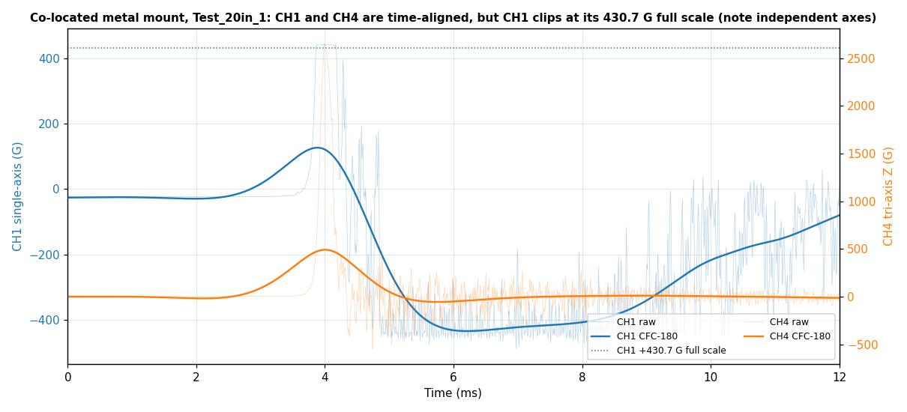
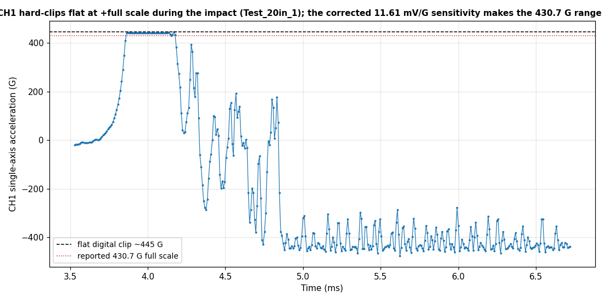
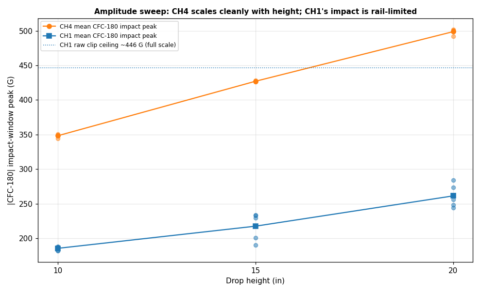
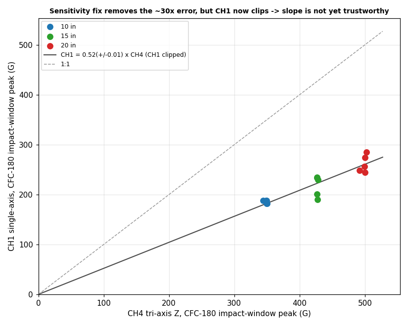

# Corrected-sensitivity accelerometer calibration analysis (issue #71, 06/09/2026)

Analysis of the third drop-tower series @ctrhjk posted in
[PR #74 comment 4664234492](https://github.com/vertical-cloud-lab/tensegrity-optimization/pull/74#issuecomment-4664234492)
(TP4 session *"Accelerometer Callibartion 2"*, 06/09/2026). This is the run that
acts on the two fixes recommended after the
[06/08 co-located series](accelerometer-calibration-analysis.md): the sensor
sensitivities were re-entered from the calibration certificates, and both sensors
were moved off the acrylic plates onto the bare metal load.

- **Raw data:** [`data/drop-tests/accelerometer-calibration-2/raw/`](../data/drop-tests/accelerometer-calibration-2/raw)
  (15 TP4 time-domain CSVs).
- **Script:** [`scripts/analysis/accelerometer_calibration2_analysis.py`](../scripts/analysis/accelerometer_calibration2_analysis.py)
  (`python3 scripts/analysis/accelerometer_calibration2_analysis.py`).
- **Derived table:** [`data/drop-tests/accelerometer-calibration-2/calibration_summary.csv`](../data/drop-tests/accelerometer-calibration-2/calibration_summary.csv).
- **Figures:** [`docs/figures/accelerometer-calibration-2/`](figures/accelerometer-calibration-2).

## Setup

| Channel | Sensor                   | Full scale | Sensitivity (cert.) | Trigger  |
| ------- | ------------------------ | ---------- | ------------------- | -------- |
| CH1     | single-axis (Z)          | 430.7 G    | 11.61 mV/G          | 430.66 G |
| CH2     | tri-axis X               | 7246.4 G   | 0.690 mV/G          | 1000 G   |
| CH3     | tri-axis Y               | 7496.3 G   | 0.667 mV/G          | 1000 G   |
| CH4     | tri-axis Z (impact axis) | 6812.0 G   | 0.734 mV/G          | 1000 G   |

Both accelerometers are bolted to the **bare metal load** (the acrylic plates were
removed), on the same level ~1/4 in apart, single-axis on the left. The amplitude
was swept by **drop height** — 10, 15, 20 in, five repeats each (5 in was too low
to trigger). Method is identical to the earlier series: SAE J211 **CFC-180**
(rigid-body pulse) and **CFC-1000** (`g_max`) phaseless filters, with each
channel's peak taken in a **±1 ms window around the CH4 impact** (located in the
first ~10 ms).

## Key findings

### 1. The ~30× discrepancy is gone — it was the single-axis sensitivity entry

The 06/08 series reported CH1 ≈ **30.8×** CH4. The only thing that changed here is
the entered sensitivities, and the gross factor collapses immediately: with the
certificate value (CH1 0.25 → **11.61 mV/G**, a **46×** correction) the
single-axis no longer reads tens of times the tri-axis. This confirms the earlier
discrepancy was a **wrong mV/G entry**, exactly the first thing the cross-calibration
recommendation said to check. (The measured 30.8× was itself a clip-limited
*lower bound* on the true 46× scale error, because CH1 was also railing at +20.5 kG
in the 06/08 run.)

### 2. The run is co-located and time-aligned

CH1 (single-axis) and CH4 (tri-axis impact axis) peak at the **same ~3.98 ms** in
every one of the 15 drops (well within one 8 µs sample), and the off-axis tri-axis
channels CH2/CH3 stay small, so CH4 is the drop-direction axis. The bare-metal,
1/4-in-apart mount is genuinely co-located.

### 3. But CH1's full scale is now far **too low**, so it hard-clips on every drop

Re-entering the high 11.61 mV/G sensitivity on a 5 V range leaves CH1 with a full
scale of only **430.7 G**. Every 10/15/20 in drop drives the impact above that, so
CH1 **hard-clips flat at a ~445 G digital rail** for ~300 µs at the impact and then
rings to ~−500 G. CH4, on its 6812 G range, is a clean pulse.

### 4. The amplitude sweep gives a clean lever arm — on CH4 only

CH4's CFC-180 impact-window peak scales cleanly and repeatably with drop height,
while CH1's impact stays pinned at the rail:

| Drop height | CH4 CFC-180 impact peak | CH1 raw clip ceiling |
| ----------- | ----------------------- | -------------------- |
| 10 in       | 348.3 ± 2.5 G           | ~444 G (railed)      |
| 15 in       | 427.1 ± 0.7 G           | ~447 G (railed)      |
| 20 in       | 498.8 ± 4.0 G           | ~448 G (railed)      |

A zero-intercept CH1-vs-CH4 fit over all 15 drops gives **CH1 ≈ 0.52 × CH4** on the
CFC-180 impact window, but this is **not a trustworthy calibration factor**: CH1 is
clipped on every point, so its filtered "peak" is a saturated/ringing artifact, not
the real impact. The slope is a clip-limited lower bound.

## Recommendation

The sensitivity fix solved the original problem (the two sensors no longer disagree
by ~30×). The remaining blocker is purely the **CH1 input range**: increase CH1's
voltage range (or otherwise raise its full scale comfortably above the expected
impact — e.g. ≥ ~1000 G for these 10–20 in drops) so it stops clipping, then redo
the **CFC-filtered, impact-windowed, zero-intercept** CH1-vs-CH4 regression over the
existing height sweep. With both sensors co-located on the metal load, unclipped,
and the certificate sensitivities in place, that regression should land near **1:1**
and give the final cross-calibration slope ± SE.

> Note: the channel→sensor mapping (CH1 = single-axis; CH2–CH4 = tri-axis X/Y/Z)
> and the bare-metal co-located mounting follow @ctrhjk's description in the thread.
