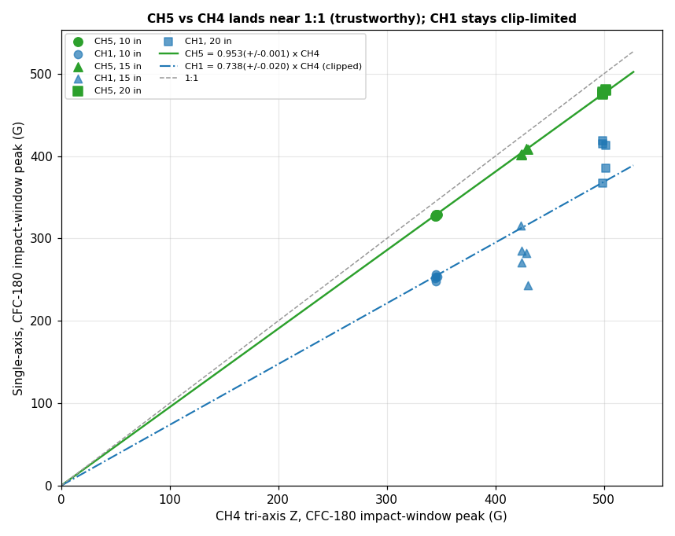
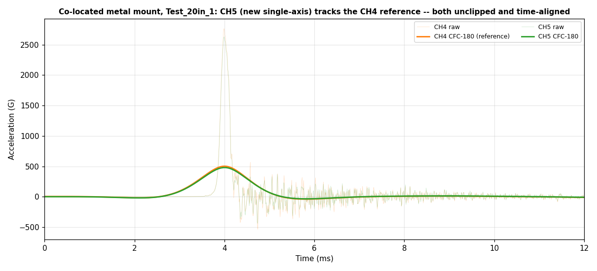
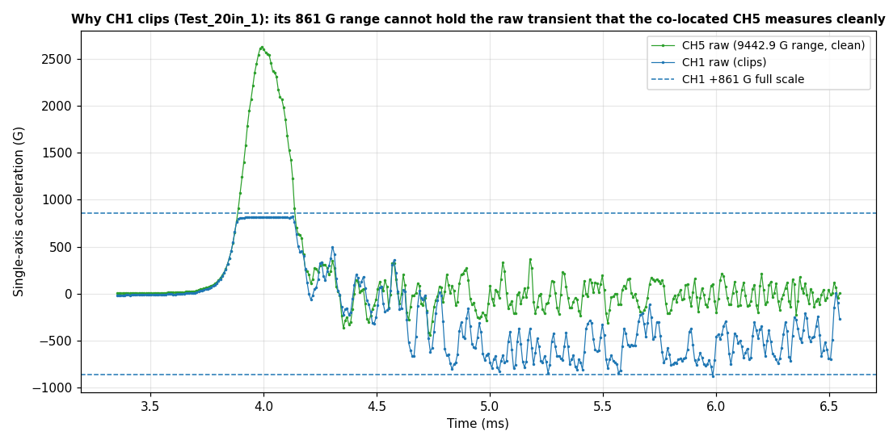
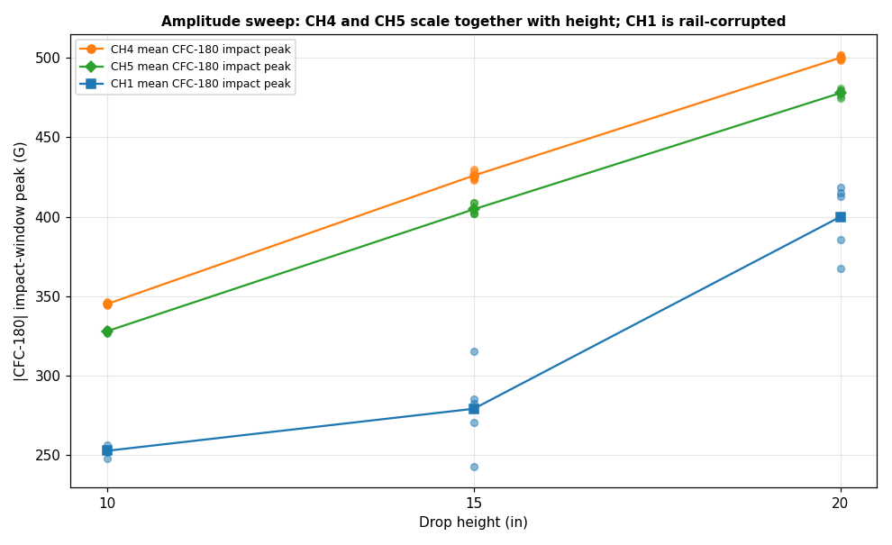

# Five-channel accelerometer calibration analysis (issue #71, 06/10/2026)

Analysis of the fourth drop-tower series @ctrhjk posted in
[PR #74 comment 4673864934](https://github.com/vertical-cloud-lab/tensegrity-optimization/pull/74#issuecomment-4673864934)
(TP4 session *"AC3"*, 06/10/2026). This is the run that acts on the single open
blocker from the
[06/09 corrected-sensitivity series](accelerometer-calibration2-analysis.md): CH1
clipped on every drop because, even on the 10 V range, its 11.61 mV/G sensitivity
leaves a full scale of only ~861 G — far below the multi-thousand-G raw transient.

The fix is to add a **second, much lower-sensitivity single-axis accelerometer on
CH5** (1.059 mV/G → 9442.9 G full scale on 10 V) next to the others, on the very
left. CH1 and the tri-axis (CH2–CH4) were not moved, so there are now two
single-axis units to compare against the tri-axis Z (CH4), the reference.

- **Raw data:** [`data/drop-tests/accelerometer-calibration-3/raw/`](../data/drop-tests/accelerometer-calibration-3/raw)
  (15 five-channel TP4 time-domain CSVs).
- **Script:** [`scripts/analysis/accelerometer_calibration3_analysis.py`](../scripts/analysis/accelerometer_calibration3_analysis.py)
  (`python3 scripts/analysis/accelerometer_calibration3_analysis.py`).
- **Derived table:** [`data/drop-tests/accelerometer-calibration-3/calibration_summary.csv`](../data/drop-tests/accelerometer-calibration-3/calibration_summary.csv).
- **Figures:** [`docs/figures/accelerometer-calibration-3/`](figures/accelerometer-calibration-3).

## Setup

| Channel | Sensor                   | Full scale | Sensitivity (cert.) | Trigger |
| ------- | ------------------------ | ---------- | ------------------- | ------- |
| CH1     | single-axis (Z)          | 861.3 G    | 11.61 mV/G          | none    |
| CH2     | tri-axis X               | 14492.8 G  | 0.690 mV/G          | none    |
| CH3     | tri-axis Y               | 14992.5 G  | 0.667 mV/G          | none    |
| CH4     | tri-axis Z (impact axis) | 13624.0 G  | 0.734 mV/G          | 1000 G  |
| CH5     | single-axis (Z)          | 9442.9 G   | 1.059 mV/G          | none    |

All channels are on the **10 V** range (up from 5 V on 06/09); CH4 is the only
trigger source because the goal is the CH4–CH5 calibration. The amplitude was swept
by **drop height** — 10, 15, 20 in, five repeats each (5 in was too low to
trigger). Method is identical to the earlier series: SAE J211 **CFC-180**
(rigid-body pulse) and **CFC-1000** (`g_max`) phaseless filters, with each
channel's peak taken in a **±1 ms window around the CH4 impact** (located in the
first ~10 ms).

## Key findings

### 1. CH5 vs CH4 finally cross-calibrates — and it is near 1:1

With a properly-ranged single-axis (CH5) the two co-located sensors agree closely.
A zero-intercept fit over all 15 drops gives

> **CH5 = 0.953 (± 0.001) × CH4** on the CFC-180 impact window,

with a per-drop ratio of **0.952 ± 0.004 (SD)** — repeatable to better than 0.5 %.
So the single-axis reads ~95 % of the tri-axis Z impact peak. Both channels are
unclipped, so unlike the clip-limited CH1 fit this slope is **trustworthy**. The
residual ~5 % is small and consistent with the ~1/4 in spacing / slightly different
mount point between the two sensors rather than a scale error.

### 2. CH5 and CH4 are co-located and time-aligned

CH4 and CH5 peak within **one 8 µs sample** (0–8 µs lag) in every drop, and their
CFC-180 pulses nearly overlay. Off-axis CH2/CH3 stay small (a few G CFC-180), so
CH4 is the drop-direction axis and the bare-metal mount is genuinely co-located.

### 3. Why CH1 still clips: its 861 G range, not its mount

CH1 and CH5 are both single-axis and co-located, so CH5 shows what CH1 *would*
read with enough range. The raw impact transient is **~1500 G (10 in) → ~2800 G
(20 in)** — captured cleanly on CH5 (9442.9 G range) but far above CH1's **861 G**
full scale. CH1 therefore **clips on 14 of 15 drops**: it rails flat at its ~+810 G
positive plateau through the impact, then rings down to its ~−900 G negative rail.
CH5 never clips (0 of 15).

Because CH1 is railed, its CFC-180 impact-window "peak" is a saturated/ringing
artifact whose magnitude (and even sign) is unreliable, and its CH1-vs-CH4 fit
(**CH1 ≈ 0.74 × CH4**, clip-limited) is **not** a usable calibration. The
amplitude sweep makes the contrast obvious — CH4 and CH5 scale together with
height while CH1 wanders along the rail:

| Drop height | CH4 CFC-180 impact peak | CH5 CFC-180 impact peak | CH5/CH4 |
| ----------- | ----------------------- | ----------------------- | ------- |
| 10 in       | 345.1 ± 0.7 G           | 328.0 ± 0.9 G           | 0.950   |
| 15 in       | 425.9 ± 3.1 G           | 404.7 ± 3.8 G           | 0.950   |
| 20 in       | 500.1 ± 1.7 G           | 477.9 ± 2.7 G           | 0.955   |

## Conclusion and recommendation

This run closes out the cross-calibration. Using the low-sensitivity CH5 single-axis
in place of CH1, the single-axis vs tri-axis Z factor is a **trustworthy
0.953 (± 0.001), i.e. within ~5 % of 1:1**, with both sensors unclipped and
co-located on the metal load. The earlier ~30× and ~46× discrepancies were the CH1
sensitivity entry, and the residual clipping was purely CH1's range — neither was a
real acceleration difference.

Going forward:

- **Use CH5 (the 1.059 mV/G single-axis) as the working single-axis sensor.** Its
  9442.9 G range covers the raw drop-tower transient; the 11.61 mV/G CH1 unit is
  intrinsically mis-ranged for these multi-thousand-G shocks (its 861 G full scale
  cannot be raised further — 10 V is already the top range), so it will keep
  clipping regardless of voltage range.
- If the high-sensitivity CH1 unit is needed for low-G work, reserve it for
  impacts well under ~800 G; it is not suitable for the 10–20 in drops here.
- Keep comparing **CFC-filtered, impact-windowed** peaks; CH5 vs CH4 is now the
  reference cross-calibration (0.953 ± 0.001, near 1:1).

> Note: the channel→sensor mapping (CH1, CH5 = single-axis; CH2–CH4 = tri-axis
> X/Y/Z), the bare-metal co-located mounting, and that CH1/CH2–CH4 were not moved
> since the 06/09 run follow @ctrhjk's description in the thread.
