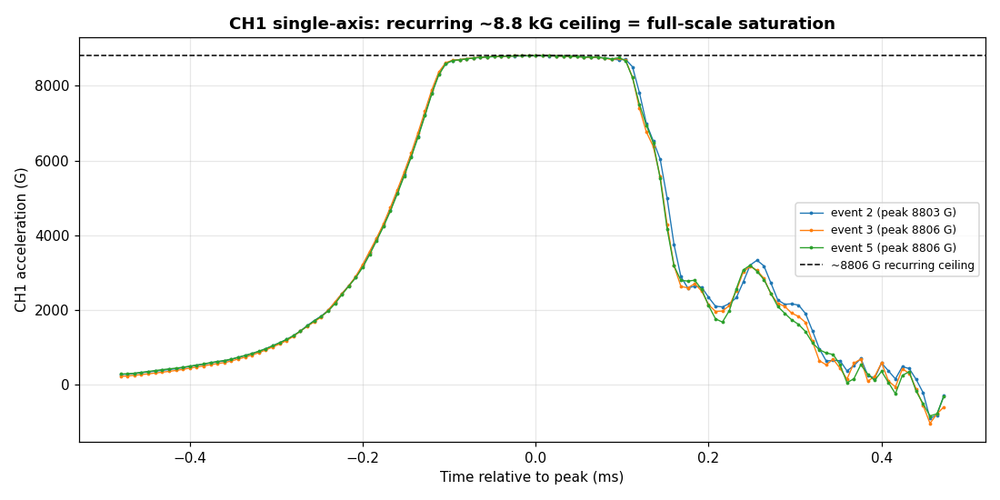
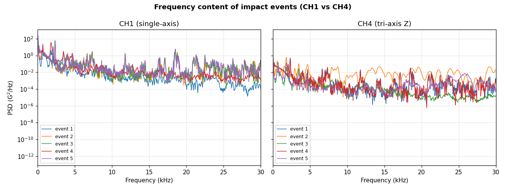
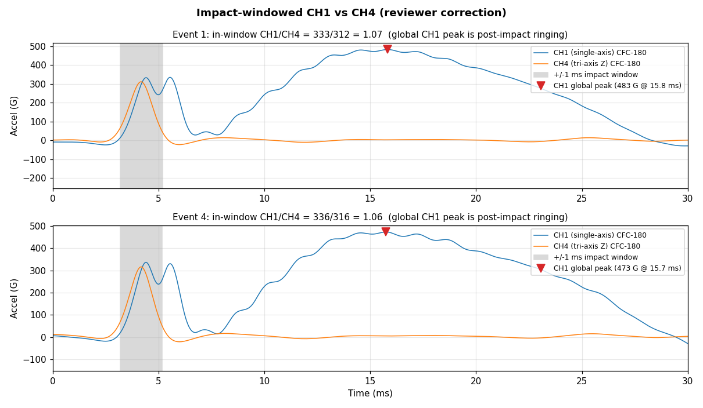
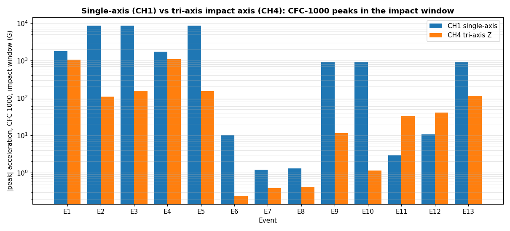

# Drop-tower accelerometer "tuning" analysis (issue #71)

Analysis of the 06/02/2026 drop-tower test series that @me-madsen and @ctrhjk ran
to standardize the setup and to understand why the **single-axis** and
**tri-axis** accelerometers do not report the same acceleration.

- **Raw data:** [`data/drop-tests/accelerometer-tuning/raw/`](../data/drop-tests/accelerometer-tuning/raw)
  (TP4 exports: one series table `06.02.2026.csv` + 13 time-domain
  `06.02.2026_SignalN.csv` files).
- **Script:** [`scripts/analysis/accelerometer_tuning_analysis.py`](../scripts/analysis/accelerometer_tuning_analysis.py)
  (`python3 scripts/analysis/accelerometer_tuning_analysis.py`).
- **Derived table:** [`data/drop-tests/accelerometer-tuning/peak_summary.csv`](../data/drop-tests/accelerometer-tuning/peak_summary.csv).
- **Figures:** [`docs/figures/accelerometer-tuning/`](figures/accelerometer-tuning).

## Data format

Each time-domain file is a 4-channel record sampled at **125 kHz** (8 µs/sample)
over a **0.2 s / 25 000-sample** window, in **G**. `SignalN` is event `N` from the
table export. Channel mapping **inferred from the data** (the per-test position
labels promised in the issue had not been posted at analysis time, so please
confirm):

| Channel | Sensor (inferred)                |
| ------- | -------------------------------- |
| CH1     | single-axis accelerometer        |
| CH2     | tri-axis X                       |
| CH3     | tri-axis Y                       |
| CH4     | tri-axis Z (impact axis)         |

CH2/CH3/CH4 move together as a group (clearest in events 11–12), which is the
signature of one tri-axis sensor, while CH1 behaves independently — hence the
single-axis = CH1 assignment.

## Method

Drop-tower shock records are dominated by **mount/sensor ringing**, so the *raw*
peak G is not a physically meaningful number. The script applies the
**SAE J211** Channel Frequency Class (CFC) phaseless 4-pole Butterworth filter
(forward + backward) at two classes:

- **CFC 1000** (-3 dB ≈ 1.65 kHz) — peak acceleration / `g_max`.
- **CFC 180** (-3 dB ≈ 300 Hz) — rigid-body pulse, Δv, structural response.

The same filter is applied identically to every channel so they can be compared.

**Peak search is restricted to the impact.** Following the Edison review
([`edison-trajectories/accelerometer-tuning/`](../edison-trajectories/accelerometer-tuning/accelerometer-tuning-015f36e1-0a1c-4aed-a9a3-1d1924983c4a.md)),
each channel's filtered peak is taken inside a **±1 ms window around the CH4
impact** (the tri-axis impact axis, located in the first ~10 ms), *not* over the
whole 0.2 s record. This matters because CH1 carries a large low-frequency
post-impact oscillation (~16 ms) whose CFC-180 amplitude exceeds the impact pulse;
a global maximum compares that ringing against CH4's impact (see finding 4).

> **Independent review.** This analysis was sent to Edison Scientific (data-analysis
> agent) for an independent check; its feedback corrected the peak-search window
> and the CH4 artifact interpretation below. The full review, notebook, and the
> reviewer's corrected peak table/figure are in
> [`edison-trajectories/accelerometer-tuning/`](../edison-trajectories/accelerometer-tuning/).

## Key findings

### 1. The single-axis channel (CH1) is **saturating** (clipping) on hard hits

In events **2, 3 and 5** CH1 rails at an essentially identical ceiling
(**8803 / 8806 / 8806 G**) and sits on a compressed top for ~0.18 ms — the
signature of a sensor/conditioner that has hit full scale. The rising slew rate
decays smoothly toward the ceiling and the falling edge resumes a steep slew, so
this is **analog full-scale saturation** (smooth compression), not a hard digital
ADC clip (a flat line at one code). Either way the recorded "peak" is a ceiling,
not the true acceleration (the real peak is higher and unknown).

**This alone makes the two sensors impossible to match in those events**: you are
comparing a saturated channel against an unsaturated one. Any sensitivity
adjustment that pushes CH1 higher just saturates harder — the fix is a sensor with
a higher full scale (see recommendations).

### 2. Raw peaks are ringing-dominated — compare filtered values, not raw

Across all impact events the raw traces carry large broadband ringing (PSD energy
out past 20 kHz, with mount-resonance peaks around ~18–20 kHz on CH1), riding on a
much smaller rigid-body pulse below ~2 kHz. Filtering changes the peaks
dramatically (e.g. event 1 CH1 at impact: 2576 G raw → 333 G CFC-180; CH4: 1280 G
raw → 312 G).

### 3. CH4's ~4.2 ms peak is the **real impact**, not a trigger artifact

An earlier draft (and the earlier issue-#36 campaign) read CH4's recurring ~4.2 ms
peak as a fixed trigger/magnet-release artifact. **For this series that is wrong.**
In the quiet / aborted drops (events **6, 7, 8**) the CH4 level around 3–5 ms is
**< 0.5 G** — if it were a fixed electrical artifact tied to the trigger it would
appear regardless of the drop. The pulse also has a ~280 µs full-width-half-max,
a mechanical impact duration, not a one-sample electrical spike. It simply recurs
near ~4.2 ms because the bungee-assisted carriage's release-to-impact time is
repeatable. **Do not gate this out** — it is the impact. (Window the analysis to
it, which is what the corrected peak search does.)

### 4. The sensors were in **different positions** per test, so this data cannot
cross-calibrate them

Because the accelerometers were swapped/relocated between runs (and the per-event
position labels were not posted), most events show one sensor seeing a large hit
while the other sees almost nothing — they were not experiencing the same input:

| Pattern                                   | Events        |
| ----------------------------------------- | ------------- |
| Both sensors see a comparable big impact  | 1, 4          |
| CH1 huge & saturated, tri-axis quiet      | 2, 3, 5       |
| CH1 moderate (~270 G), tri-axis quiet     | 9, 10, 13     |
| CH1 ~0, tri-axis sees the hit (~34–44 G)  | 11, 12        |
| No / aborted drop (noise only)            | 6, 7, 8       |

Only **events 1 and 4** have both sensors reading a comparable large impact.
**Measured in the ±1 ms impact window** (the corrected method), the single-axis
(CH1) reads only about **1.05–1.1×** the tri-axis impact axis (CH4) on the CFC-180
pulse (333/312 = 1.07 and 336/316 = 1.06) and ~1.1× the tri-axis resultant — i.e.
**the two sensors agree to within ~5–10 %** on the rigid-body pulse.

This corrects the earlier draft, which reported ~**1.5×**. That figure came from
taking each channel's **global** CFC-180 maximum over the full 0.2 s: CH1's global
max is a low-frequency post-impact mount/structural oscillation at **~15.8 ms**
(483 G), not the impact (~333 G at ~4.2 ms), so it was being compared against
CH4's impact peak. The figure below shows the misalignment — note CH1 and CH4 sit
almost on top of each other inside the impact window, while CH1's late hump is the
spurious global peak:

Even so this is *not* a clean co-located calibration: CH1's impact peak lags CH4
by ~250 µs and CH1 carries that large late oscillation that CH4 never sees, so the
two sensors are at **different mechanical locations** (different local shock
environment), not merely mis-scaled. Per-event CFC-1000 impact-window peaks,
CH1 vs CH4:

## Recommendations ("tuning" the sensors)

1. **Stop the saturation first.** The single-axis channel rails at ~8.8 kG, so its
   true peak is unknown on hard hits. Step up to a sensor whose full scale
   comfortably exceeds the expected peak (e.g. a **20,000 G** range if the present
   part is a 10,000 G sensor — 8.8 kG is dangerously close to its limit) rather
   than just lowering gain. Confirm the **sensitivity (mV/G) entered in TP4 matches
   each sensor's calibration sheet** — a wrong sensitivity is a common cause of two
   sensors disagreeing by a fixed factor.
2. **Do a real co-location cross-calibration.** Mount both sensors **rigidly,
   back-to-back on the same stiff block**, sensitive axes aligned to the drop
   direction, and run several **repeatable, sub-saturation** drops (e.g. ~500 /
   1000 / 2000 G). Apply the same CFC filter to both, gate to the ±1–2 ms impact
   window, and regress CH1 against CH4 with the intercept forced to 0 — the slope
   is the scale factor; report its standard error. Do this before trusting any
   swapped-position numbers.
3. **Always compare filtered, impact-windowed peaks, not raw global peaks.** Use
   CFC 1000 for `g_max` and CFC 180 for Δv / structural response, applied
   identically to both channels, and search the peak **only in the impact window**.
   Raw peaks are ringing-dominated and a global search latches onto post-impact
   oscillations (the source of the earlier 1.5× error).
4. **Fix the mounting resonance.** The broadband ringing out to ~20 kHz (and CH1's
   large ~16 ms post-impact oscillation) points to a compliant mount/adapter or a
   rebounding carriage. Use a stud or thin stiff-adhesive mount, minimize adapter
   mass between sensor and plate, and strain-relieve the cables.
5. **Window to the impact; the ~4.2 ms CH4 peak is the impact, not an artifact.**
   Gate analysis to the impact transient (done by the corrected peak search). The
   recurring ~4.2 ms timing is just the repeatable carriage free-fall time, not a
   trigger/magnet artifact, so it should be kept, not filtered out.
6. **Label every run.** Record which sensor, which position, and which orientation
   for each event so swapped-position tests can be interpreted.
7. Sample rate (125 kHz) is adequate; keep both channels on the same rate and
   anti-alias settings.
