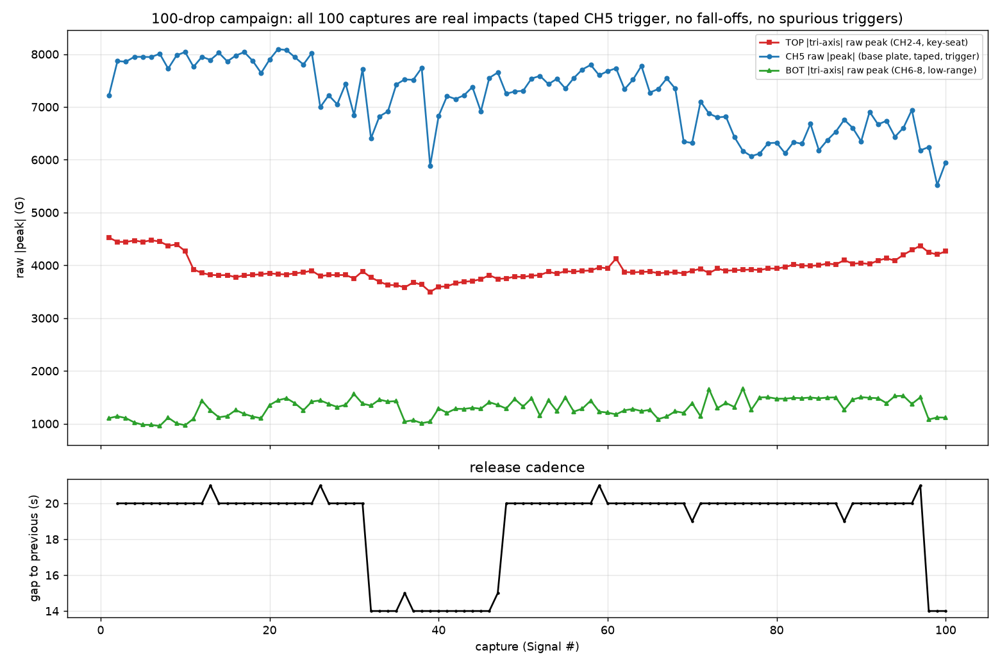
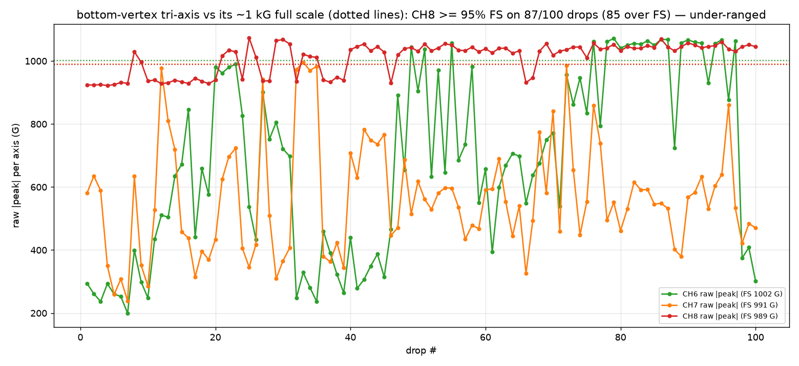
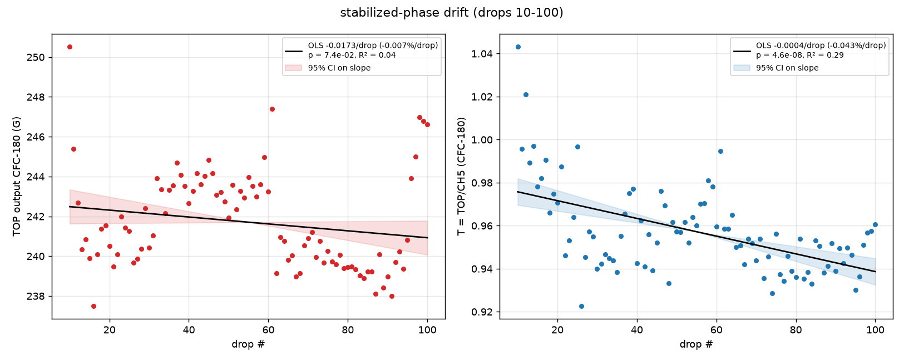
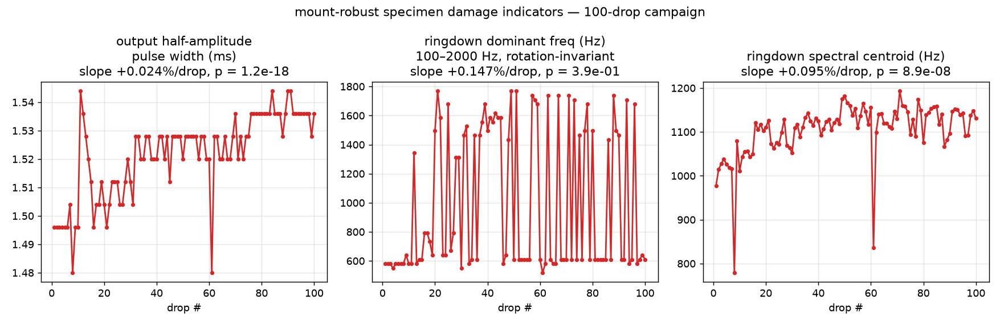

# 100-auto-drop campaign — analysis

Analysis of the **100-drop auto campaign** posted by @ctrhjk on
[PR #67](https://github.com/vertical-cloud-lab/tensegrity-optimization/pull/67)
(TP4 session "100 drops", 07/06/2026): the latest tensegrity structure
(top + bottom vertex key-seat housings; **specimen ID not yet assigned**),
100 drops at 13 in, ~20 s cadence, whole campaign ~31 min.

Data + setup: [`data/drop-tests/100drops/`](../data/drop-tests/100drops/) ·
script:
[`scripts/analysis/drop_test_100drops_analysis.py`](../scripts/analysis/drop_test_100drops_analysis.py)
(emits
[`100drops_metrics.json`](../data/drop-tests/100drops/figures/100drops_metrics.json)).

Instrumentation changes vs the 30-drop `RW5F61` run: base-plate single-axis
(CH5) **taped** to the plate, cable ties kept on both tri-axis units. The
bottom-vertex tri-axis is now a **low-range** unit (CH6/7/8 full scale
1002.0 / 991.1 / 989.1 G, ~10 mV/G).

> **Correction (2026-07-06):** the **trigger stayed on CH5** (1000 G). The
> channel table posted with the data listed CH4 as the trigger, but @ctrhjk
> corrected this in a follow-up comment — the 30-drop recommendation to move
> the trigger off the plate sensor was *not* adopted this run. All numeric
> results are unaffected (the analysis locates each impact from the TOP
> resultant, not the trigger channel); the attribution of the clean-trigger
> result changes: it is the **tape retention on CH5** that cured the
> spurious-trigger failure mode, not a trigger relocation.

## 1. Campaign health: 100/100 clean — the mount fixes worked

- **All 100 captures are real drops.** No spurious triggers, no lost drops,
  no sensor fall-offs. The impact lands at **4.01 ± 0.01 ms** into every
  record (2 % pre-trigger + the taped CH5 trigger firing consistently) — vs
  the 30-drop run's 5 spurious captures, 3 lost drops, and impacts wandering
  out to 35 ms on the same channel after its sensor detached.
- The taped CH5 stayed on the plate for all 100 drops (raw 5.5–8.1 kG,
  58–86 % of full scale, never saturating — a 5.5×+ margin over its 1000 G
  trigger level on every drop). The 30-drop run's spurious triggers were the
  *detached* CH5 firing on its own rattle; taping the sensor removed the
  cause, so the trigger didn't need to move to get a clean campaign. It does
  remain a single point of failure on the one sensor with a fall-off history
  (see recommendation 2).
- Cadence: median 20 s (range 14–21 s), 100 drops in ~31 min.

## 2. Problem 1 — the low-range bottom tri-axis is under-ranged (CH8 saturates)

Per-axis raw |peak| vs nominal full scale:

| channel | full scale | median peak (% FS) | max (% FS) | ≥95 % FS | > FS |
|---|--:|--:|--:|--:|--:|
| CH6 (BOT X) | 1002.0 G | 73.8 % | 106.9 % | 31/100 | 22/100 |
| CH7 (BOT Y) | 991.1 G | 85.4 % | 101.7 % | 39/100 | 9/100 |
| **CH8 (BOT Z, drop axis)** | **989.1 G** | **104.7 %** | **108.5 %** | **87/100** | **85/100** |
| CH5 (plate) | 9442.9 G | 77.5 % | 85.7 % | 0/100 | 0/100 |
| CH2/CH3/CH4 (TOP) | 13.6–15.0 kG | 3.6–27.4 % | ≤ 31.4 % | 0/100 | 0/100 |

The bottom-vertex drop-axis channel spends most of the campaign **at or above
its rated range**. It is not hard digital clipping (at most 3–4 samples
pinned near the peak), but amplitude linearity above full scale is
unspecified, so **every BOT-derived quantity (BOT CFC-180 peak, T\* =
TOP/BOT, BOT Δv) is saturation-biased** and should not be used
quantitatively from this run. This explains most of the BOT scatter
(CV 5.9 %) and the T\* scatter (CV 6.6 %).

The prior multi-kG bottom tri-axis saw 925–1,075 G raw per axis in the
30-drop run — i.e. the ~1 kG range was known to be marginal at 13 in before
this campaign. Shock practice (e.g. MIL-STD-810 / SAE J211 guidance) wants
roughly 2–3× headroom over the expected raw peak → the bottom-vertex station
needs a **≥ 3 kG-range** sensor at this drop height.

## 3. Problem 2 — CH5 (taped) creeps upward; the plate ratio T absorbs it only partly

Stabilized-phase OLS (drops 10–100, n = 91, CFC-180 throughout):

| series | mean | CV | slope (%/drop) | p |
|---|--:|--:|--:|--:|
| **TOP output (CH2–4 resultant)** | **241.7 G** | **1.01 %** | −0.007 | 0.073 (n.s.) |
| CH5 plate input | 252.6 G | 1.89 % | **+0.035** | 1.1e−06 |
| T = TOP/CH5 | 0.957 | 2.12 % | −0.043 | 4.6e−08 |
| BOT input (saturation-biased) | 179.3 G | 5.88 % | +0.068 | 3.2e−03 |
| T\* = TOP/BOT (saturation-biased) | 1.353 | 6.57 % | −0.079 | 2.1e−03 |

- **The TOP output is drift-free over ~90 drops** (CV ≈ 1 %, slope n.s.,
  split-half +0.020 → −0.000 %/drop). The wax + cable-tie key-seat SOP holds
  at 100-drop scale.
- **CH5 rises ≈ +0.035 %/drop (≈ +3 % accumulated)** with the plate Δv rising
  in step (+0.045 %/drop, p = 3.4e−06). In drift-calibration #2 a rig-level
  input increase was mirrored by the output and cancelled in T; here **TOP
  stayed flat while CH5 rose**, which points at the *sensor side* — the tape
  interface progressively stiffening/seating under repeated ~7 kG hits — not
  a genuinely harder strike. Consequence: T = TOP/CH5 inherits a slow
  −0.043 %/drop drift (≈ −4 % over the campaign).
- Tape held mechanically for 100 drops (a win vs bare wax), but as a
  *couplant* it is not yet drift-free. Expect ISO 5347's ordering: stud >
  cement > wax/tape.
- Since CH5 is also the **trigger channel**, note the drift has no bearing on
  trigger reliability: it is a ~3 % amplitude creep on raw peaks that clear
  the 1000 G level by 5.5–8×.

## 4. Burn-in inverted this run: the output *decays* into its plateau

The changepoint scan goes non-significant at **k = 9** and the
exponential-approach fit gives plateau 241.5 G with **negative** amplitude
(−13.0 G, τ = 7.7 drops): the output starts near 250 G and *settles
downward*, opposite in sign to the wax-seating rise of the `prc1kn` runs.
A downward transient looks like early *specimen* break-in (tendon/joint
settling on a fresh structure) rather than couplant seating. Operationally
nothing changes — **≥ 10 unrecorded burn-in drops** before a recorded
campaign covers both signs — but the sign is worth remembering when
interpreting first-drops data on fresh prints.

## 5. Specimen over 100 drops: no damage signature, one watch item

Mount-robust indicators over the full campaign:

| indicator | result | verdict |
|---|---|---|
| ringdown dominant freq (rotation-invariant) | ~610 Hz structural mode, no trend (p = 0.39) | no stiffness loss |
| **output pulse width** | 1.496 → 1.536 ms, **+0.024 %/drop, p = 1.2e−18** | **+2.7 % total — softening direction, watch** |
| ringdown spectral centroid | +0.095 %/drop (rising = HF coupling, opposite of damage) | mount, not structure |
| pre-impact noise RMS | 0.1–0.23 G, unchanged | sensors healthy |

The pulse-width creep is tiny (≈ 5 samples at 8 µs over 100 drops) but it is
the first campaign to show a *statistically robust accumulating trend in the
softening direction*, and it is exactly what early tendon relaxation would
look like. With the dominant mode pinned at ~610 Hz there is **no cut-tendon
/ cracked-strut signature** — but a fresh-specimen endpoint check (photos +
a few reference drops) after long campaigns is now justified rather than
paranoid. (Dominant-frequency scatter, CV 49 %, is bimodal mode-picking
between the ~610 Hz structural mode and a 1.4–1.8 kHz mode — not physical
wander.)

The familiar slow in-seat rotation continues on **both** tri-axis units at
near-constant resultant (CH6 raw peak 269 → 605 G, +0.83 %/drop, p = 7.6e−10;
CH2 +0.16 %/drop; CH3 −0.18 %/drop) — the deeper key-seat pocket remains the
right fix; resultant-based metrics stay robust to it.

## 6. Recommendations

1. **Re-range the bottom-vertex sensor.** The ~1 kG tri-axis is under-ranged
   at 13 in (CH8 over full scale on 85/100 drops). Reinstate the previous
   multi-kG tri-axis at the bottom vertex (its 925–1,075 G raw peaks fit
   comfortably in a 13.6 kG range), or drop from lower height if the
   low-range unit's resolution is needed. Do not use this run's BOT/T\*
   numbers quantitatively.
2. **Keep the tape retention and cable ties** — 100/100 clean captures
   validates them. The trigger is still on the taped CH5, and that worked
   here; but it keeps the trigger on the one sensor with a fall-off history,
   so the 30-drop recommendation stands as a cheap defensive move: put the
   trigger on CH4 (raw 3.4–4.3 kG on every drop here, > 3.3× a 1000 G
   level, and it lives in the proven key-seat), or keep CH5 and accept the
   tape as the safeguard.
3. **Use T = TOP/CH5 with its drift caveat.** It is tight (CV 2.1 %) but
   carries a −0.043 %/drop tape-seating drift; for BO objectives either
   detrend, or upgrade the CH5 mount to a stud/cement interface, or burn the
   tape in (the drift is strongest in the first ~30 drops).
4. **Burn in ≥ 10 drops** on fresh specimens/mounts before recording —
   this run's transient was 9 drops and downward.
5. **Assign the specimen its unique ID** (per the `prc1kn`/`RW5F61`
   convention) and log whether it is a fresh print or `RW5F61` re-tested —
   the ~610 Hz mode vs `RW5F61`'s 549 Hz suggests a different (or
   re-tensioned) structure, and the pulse-width watch item needs a traceable
   history to be meaningful.

## Caveats

n = 1 specimen, ID unassigned; 200 ms window; Δv partial-pulse; tri-axis
orientations unverified (and slowly rotating in both seats); BOT quantities
saturation-biased throughout; ringdown frequency resolution 30.5 Hz; the
tape-seating reading of the CH5 drift is inferred from the TOP/CH5 contrast,
not from an independent coupling measurement.
