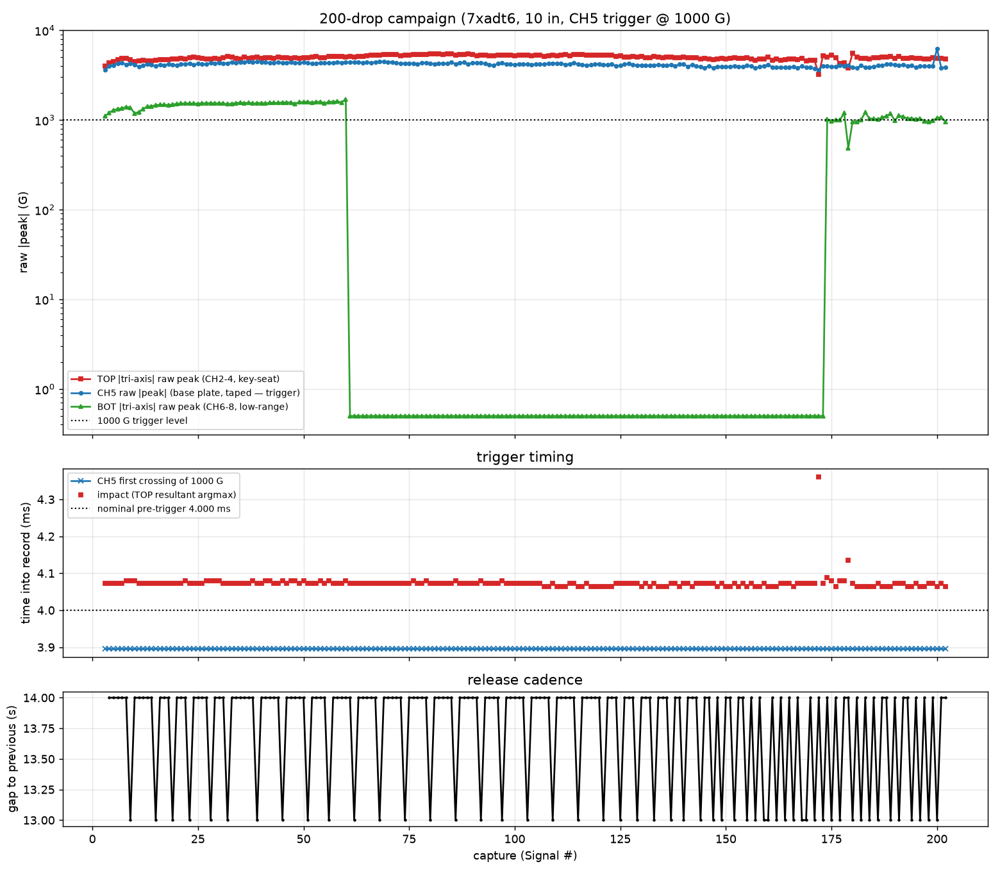
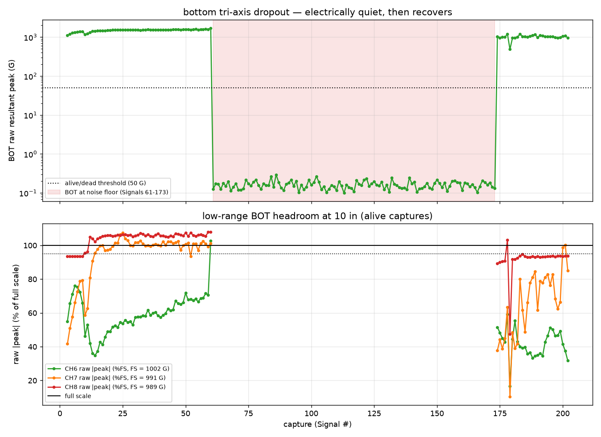
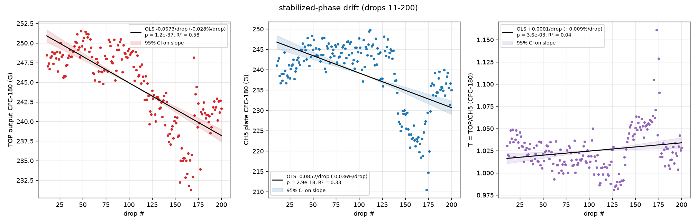
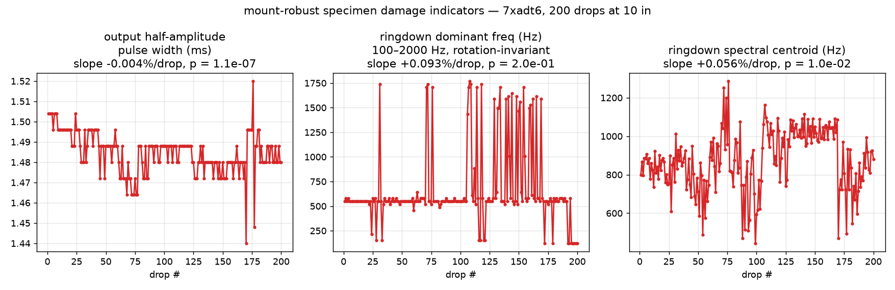

# 200-drop campaign on `7xadt6` (10 in, CH5 trigger) — analysis

Data posted by @ctrhjk in PR #67 (2026-07-13). Script:
`scripts/analysis/drop_test_200drops_analysis.py` · data + README:
`data/drop-tests/200drops/` · machine-readable metrics:
`data/drop-tests/200drops/figures/200drops_metrics.json`.

**Why this campaign matters:** it is the first long campaign on a **fresh
intact print** (`7xadt6`) — every previous ≥30-drop campaign ran on the failed
prints `prc1kn`/`RW5F61`, so the damage indicators here watch a real specimen
for the first time. It is also the first campaign at **10 in** (the 5-in
practice drops engaged neither a CH4 nor a CH5 trigger at 1000 G) and the
trigger is back on **CH5** (base plate, taped).

Analysis conventions match the prior campaigns: impacts located on the TOP
tri-axis resultant, ±1.5 ms windowed peak search, SAE J211 phaseless CFC-180
as the structural number, OLS with 95 % CI / Durbin–Watson / Shapiro–Wilk
reliability checks.

## 1. Campaign health — 200/200 real drops, trigger flawless

All 200 captures are real drops: zero spurious triggers, zero lost drops,
zero sensor fall-offs. CH5 crossed the 1000 G level at **3.896 ± 0.000 ms**
(the same fixed ~0.10 ms DAQ latency as every prior campaign; ±1 sample of
jitter). CH5 raw peaks run 3,609–6,245 G → **3.6–6.2× trigger margin**, with
pre-impact activity ≤ 9 G (1 % of the level). Cadence: 13–14 s, 200 drops in
~46 min — the largest single campaign so far, fully automatic.

## 2. Problem 1 — the bottom tri-axis dropped out electrically for 113 captures

BOT (CH6–8) collapses to the **electrical noise floor** (~0.01 G RMS — no
impact response at all) on **Signals 61–173**, then recovers by itself at
Signal 174. The failure signature is electrical, not mechanical:

- On **Signal 60** (the last capture before the dropout) CH6 rails at
  ~1,030 G for **1,775 consecutive samples (~14 ms)** — an amplifier/bias
  rail, not a physical acceleration.
- While dead, all three axes read ~0.01 G RMS. A mechanically detached sensor
  dangling on its cable still shows hundreds-of-G rattle (cf. the run-1
  fall-off and the 30-drop CH5 detachment); a silent channel means **no ICP
  bias / broken signal path**.
- It recovers mid-auto-campaign with nobody touching the rig (steady 13–14 s
  cadence throughout) — i.e. an **intermittent cable/connector**, plausibly
  the BNC or the sensor-side connection working loose under vibration and
  re-seating.

**Action:** check the CH6–8 cable path and connectors (wiggle-test under a
tap) before the next campaign. The cable tie-off prevents fall-offs but a
tie-off can also put a static side-load on the connector — worth inspecting
the strain relief at both ends (this echoes @sgbaird's note about handling
the sensor by the housing, not the cable).

## 3. Problem 2 — at 10 in the low-range BOT is again over full scale

On the 87 BOT-alive captures, **CH8 exceeds its 989.1 G full scale on 50/87
(median 105 % FS)** and now **CH7 does too (31/87 over FS, median 97 %)**;
CH6 stays inside except one railed capture. This is exactly the >10-in regime
the height-question answer predicted: BOT amplitudes (and T\* = TOP/BOT) from
this campaign are **qualitative only**. The earlier caveat also still stands:
even below FS the ~10 mV/G unit's guaranteed-linear swing is likely ~±500 G,
so BOT stays a reference channel at every height until the datasheet is
checked.

## 4. OLS regression — slow common-mode decline, T flat-ish and tight

No burn-in transient exists this run: the changepoint scan never goes n.s.
for k = 0–30 and the exponential fit diverges, because the trend is a slow
**campaign-long linear decline**, not seating. Stabilized-phase OLS uses the
SOP window (drops 11–200, n = 190):

| series | mean | CV | slope (%/drop) | p | R² | DW |
|---|--:|--:|--:|--:|--:|--:|
| TOP output (CH2–4) | 244.6 G | 1.98 % | **−0.028** | 1.2e-37 | 0.58 | 0.56 |
| CH5 plate (trigger) | 238.7 G | 3.40 % | **−0.036** | 2.9e-18 | 0.33 | 0.37 |
| **T = TOP/CH5** | **1.025** | **2.37 %** | +0.009 | 3.6e-03 | 0.04 | 0.70 |
| BOT input (alive drops, n = 77) | 175.8 G | 5.62 % | +0.055 | 1.9e-14 | — | — |
| T\* = TOP/BOT (qualitative) | 1.403 | 6.54 % | −0.073 | 1.6e-21 | — | — |

- **TOP and CH5 decline together** (−5.6 % and −7 % accumulated over 200
  drops) with the plate Δv falling in step (−0.043 %/drop) — the familiar
  **rig-level input drift** (the strike softening over ~46 min), the mirror
  image of the 5-in run's +9 % hardening. The split-half check shows the
  decline is back-loaded (first half +0.000 %/drop n.s., second half
  −0.023 %/drop) — most of it comes after drop ~100.
- **T = TOP/CH5 cancels it again** — mean 1.025, CV 2.37 %, residual slope
  +0.009 %/drop (statistically detectable at n = 190 but ≈ +1.7 % accumulated;
  R² = 0.04). This is now the **fourth campaign** where a rig-level drift
  (harder, softer, harder, softer) cancels in T.
- Reliability: DW 0.37–0.70 (positive autocorrelation — the smooth drift
  curvature; makes OLS *over*-eager, so the small T slope is if anything
  overstated), Shapiro p < 0.05 on the large-n series (heavy mid-campaign
  excursion, §5), start-drop sweep stable at −0.025…−0.038 %/drop for TOP.

## 5. Problem 3 — a CH5 excursion at drops ~140–175

CH5's CFC-180 peak sags from ~244 G to a **210–230 G shelf across drops
~140–175** (minimum 210 G at drop 173) and partially recovers to ~235 G
afterwards; T spikes to 1.09–1.16 at drops 170–176 and the only two
impact-timing outliers of the campaign land at drops 170/177 (impact at
4.36/4.14 ms vs 4.07 nominal). The window overlaps the BOT recovery
(Signal 174 = drop 172), so **something disturbed the rig around drops
165–175** — most plausibly the plate sensor's tape coupling momentarily
degrading (same class as the 13-in tape-seating drift, opposite sign). TOP
shows no matching feature, so the specimen is not the cause.

**Action:** since CH5 is both the trigger and the T denominator, refresh the
tape (or upgrade to the stud/cement mount already recommended) and keep the
per-drop T series as the live health check — the excursion is obvious in T
and invisible in TOP.

## 6. Specimen `7xadt6` over 200 drops — no damage, one watch item

Mount-robust indicators over the full campaign:

| indicator | result | verdict |
|---|---|---|
| output pulse width | 1.48 ms, CV 0.69 %, −0.8 % total (stiffer direction) | no softening |
| ringdown dominant mode | ~550 Hz baseline, no trend (p = 0.20) | no stiffness loss |
| spectral centroid | +0.056 %/drop (p = 0.01), non-monotonic | mount/config noise |
| TOP noise floor | 0.18–0.32 G RMS, healthy | sensor fine |

**Watch item:** the dominant ringdown mode flips to a **~122 Hz component for
the final 9 drops (192–200) consecutively** (it appeared sporadically at
drops 172/179, and a ~152 Hz cousin appeared briefly early on). Pulse width,
TOP level, and centroid are unchanged, so this is mode-trading between
comparable PSD peaks rather than a wholesale softening — but a low-frequency
mode winning 9 drops in a row at the end of a 200-drop campaign is exactly
what early tendon relaxation would look like at onset. **Recommend:**
photograph/inspect `7xadt6`'s tendons and vertices now, then run a short
5-drop re-check; if the ~122 Hz dominance persists from drop 1, treat it as a
real specimen change and fold it into the damage-indicator SOP.

## 7. The 5-in no-trigger question — the numbers say it wasn't √h

At 10 in this specimen puts **2,951–5,370 G raw on CH4** and
**3,609–6,245 G on CH5**. Naive √(5/10) scaling predicts ~2.1–3.8 kG (CH4)
and ~2.6–4.4 kG (CH5) at 5 in — both far above the 1000 G level. Yet the
practice drops at 5 in triggered on neither channel. Two readings:

1. **The specimen response is strongly nonlinear in drop energy.** A
   compliant fresh print can absorb a low-energy impact without the sharp
   bottoming-out that produces the kG-scale spike (RW5F61 at 5 in only
   reached 1.4–1.9 kG on CH4 — a stiffer, much-exercised structure — so a
   softer print plausibly stays below 1 kG). If so, this is *useful* signal:
   severity sweeps may discriminate geometry better than a fixed height.
2. A setup difference in the practice run can't be excluded (no waveform was
   captured, by construction).

**Recommendation:** don't chase severity with height alone — at 5 in simply
**lower the trigger level to ~300–500 G** (pre-impact activity here is ≤ 9 G,
so even 100 G would be safe) and 5-in campaigns become available again. For
this campaign, 10 in + 1000 G worked flawlessly.

## 8. SOP takeaways

1. **200-drop auto campaigns are viable** — 200/200 clean at 13–14 s cadence
   (~46 min), the largest run yet.
2. **T = TOP/CH5 remains the drift-immune objective** (fourth consecutive
   campaign where rig drift cancels); its per-drop series doubles as the live
   rig-health monitor (it caught the drops-140–175 excursion).
3. **Fix the BOT cable/connector** before trusting the bottom station again,
   and keep BOT qualitative at 10 in regardless (CH7 *and* CH8 over FS).
4. **Trigger level, not height, is the knob** for low-severity tests
   (~300–500 G at 5 in).
5. **Inspect `7xadt6`** (photos + 5-drop re-check) to resolve the ~122 Hz
   end-of-campaign mode shift before its next campaign.

## Caveats

n = 1 specimen; 200 ms window; Δv partial-pulse; tri-axis orientations
unverified; BOT saturation-biased throughout and absent for 113 captures;
T ≈ 1.03 at 10 in is not comparable across heights/configs (RW5F61 gave 0.96
at 13 in and 0.945 at 5 in — different specimen *and* different heights, so
this is not yet a geometry discrimination result); the "rig softening"
reading is inferred from the TOP+CH5+Δv concordance, not an independent
release-velocity measurement.
