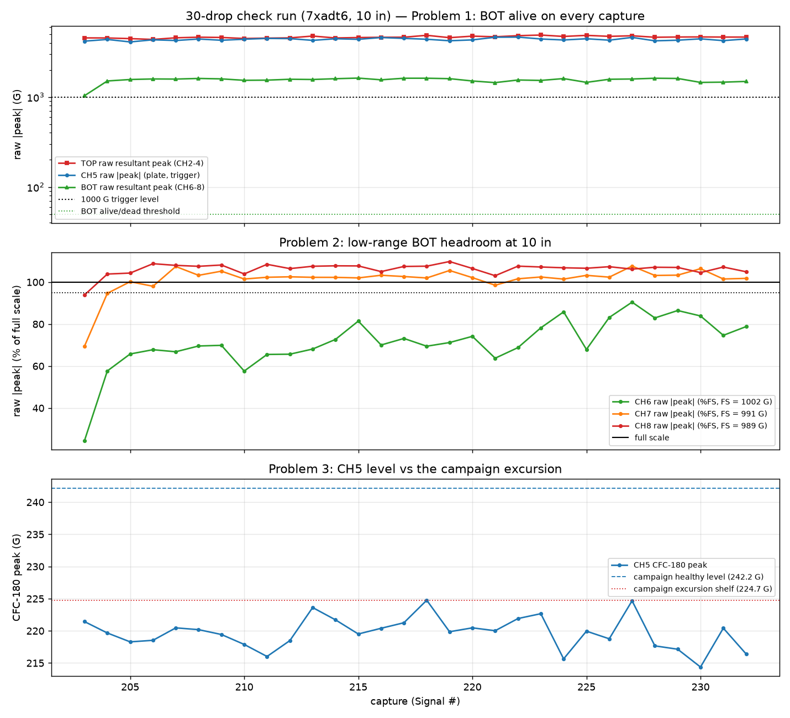
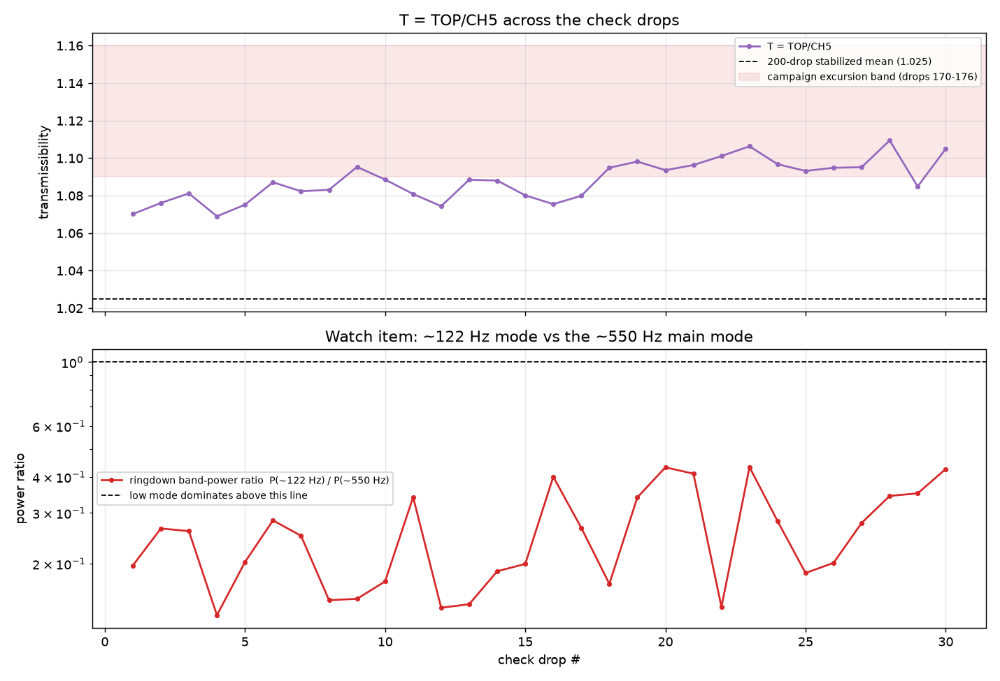

# 30-drop check run — diagnosing the three 200-drop-campaign problems

Analysis of the 30 auto-drops (`check_Signal203–232`, specimen `7xadt6`,
10 in, CH5 trigger @ 1000 G) that @ctrhjk ran immediately after the 200-drop
campaign to diagnose the three problems flagged in
`drop-test-200drops-analysis.md`, plus its ~122 Hz watch item.

- Data + setup: `data/drop-tests/200drops-check/`
- Script: `scripts/analysis/drop_test_200drops_check_analysis.py`
- Figures + machine-readable metrics:
  `data/drop-tests/200drops-check/figures/`

Run health: **30/30 real drops**, zero spurious triggers, zero fall-offs;
CH5 crossed 1000 G at 3.896 ± 0.000 ms in every record; cadence ~14 s
(30 drops in ~7 min).

## Problem 1 — BOT electrical dropout: recovered, but not proven fixed

The bottom tri-axis (CH6–8) is **alive on 30/30 captures** — no repeat of the
113-capture silent block. Every capture shows a full impact response
(raw resultant 1,034–1,622 G) and normal IEPE noise floors, nothing near the
dead-block's ~0.01 G electrical silence.

Two caveats keep this "recovered", not "fixed":

1. **The very first check capture (Signal 203) is anomalous on BOT only** —
   the lowest resultant of the run (1,034 G vs a 1,569 G median for the other
   29) and a pre-impact noise RMS 5–10× the run's typical (2.6/2.2/1.1 G on
   CH6/7/8 vs ~0.1–0.3 G elsewhere). That is what a marginal connection
   re-seating under vibration looks like — consistent with the intermittent
   cable/connector diagnosis, and a reminder that an intermittent fault
   absent for 30 drops is not an absent fault.
2. Nothing was (reportedly) repaired between the campaigns, so the failure
   cause is still in place. The wiggle-test of the CH6–8 cable path and both
   connectors before the next long campaign stands.

Also notable: the post-recovery BOT resultant (~1,570 G median) is well above
the campaign's alive-phase values (~500–1,100 G). Some of that is the
saturation-distorted measurement (Problem 2), but a partially-degraded
connection during the campaign's "alive" phase can't be excluded — one more
reason to treat all campaign BOT amplitudes as qualitative.

## Problem 2 — BOT over full scale at 10 in: confirmed, now on two axes

| channel | full scale | median peak | max | > FS |
|---|--:|--:|--:|--:|
| CH6 | 1,002.0 G | 70.0 % FS | 90.5 % | 0/30 |
| CH7 | 991.1 G | **102.3 % FS** | 107.6 % | **26/30** |
| CH8 | 989.1 G | **107.1 % FS** | 109.8 % | **29/30** |

CH8 exceeds its full scale on 29/30 drops and CH7 on 26/30 — slightly worse
than the campaign (50/87 and 31/87), plausibly because the electrical path is
now healthy and delivering the full signal. No hard flat-topping (≤ 2 pinned
samples), but linearity above FS is unspecified. The BOT-derived numbers
confirm the damage this does: BOT CFC-180 scatters 85–200 G (CV 23.8 %) and
T\* = TOP/BOT spans 1.19–2.80 — unusable.

**Verdict unchanged:** at 10 in the low-range BOT station is qualitative
only. Quantitative bottom-vertex data needs the drop height back at ~5 in or
a ≥ 3 kG-range sensor at that station. (Every other channel has ample
headroom: CH4 max 34.7 % FS, CH5 max 49.0 % FS.)

## Problem 3 — CH5 excursion: the sensitivity loss persisted; re-mount CH5

The campaign's CH5 sag was not a transient:

| quantity | campaign healthy | campaign excursion (drops ~140–175) | **check run** |
|---|--:|--:|--:|
| CH5 CFC-180 | 242.2 G | 224.7 G | **219.7 G (CV 1.14 %)** |
| TOP CFC-180 | 244.6 G | — | 239.1 G (CV 1.13 %) |
| T = TOP/CH5 | 1.025 | 1.09–1.16 | **1.088 (CV 0.99 %)** |

TOP is within ~2 % of its campaign level, but CH5 sits ~9 % below its healthy
level — *below* even the excursion shelf — so T is biased up to 1.088, inside
the excursion band. The differential (TOP ≈ unchanged, CH5 down) rules out a
softer strike, which would move both channels together as every prior
rig-level drift did; this is the **CH5 tape coupling durably degraded**, not
recovered.

The degraded state is at least *stable*: within the 30 drops CH5 is flat
(−0.019 %/drop, p = 0.44) and tight (CV 1.14 %), and T's CV (0.99 %) is the
best of any `7xadt6` series. So the coupling settled at a new, lower
sensitivity rather than continuing to slide — but the T level is not
comparable to the campaign's 1.025.

**Action: re-mount CH5 (fresh tape at minimum; stud/cement preferred) before
the next campaign, then re-baseline T.** Expect a level shift on re-mount —
the SOP rule "compare T within a mount only" applies.

## Watch item — ~122 Hz mode: cleared; no specimen damage

The end-of-campaign ~122 Hz dominance did **not** persist: the dominant
ringdown mode is back at **519–580 Hz on all 30/30 check drops** from drop 1.
The ~122 Hz component is present but subdominant throughout (band-power ratio
vs the ~550 Hz mode: median 0.26, max 0.43, never ≥ 1). The other damage
indicators concur: pulse width 1.482 ms (CV 0.29 %, flat, matching the
campaign's 1.48 ms) and healthy noise floors. So the final-9-drop low-mode
dominance was transient mode-trading, not tendon-relaxation onset —
`7xadt6` shows **no damage signature at ~230 cumulative drops**.

One thing to keep half an eye on: within the check run the 122/550 band-power
ratio creeps up (+1.9 %/drop, p = 0.013, still only 0.13 → 0.43). The same
per-drop ratio is now emitted in the metrics JSON, so future campaigns can
watch it directly rather than waiting for the dominant-mode flip.

## Summary

| item | verdict |
|---|---|
| 1. BOT dropout | **Recovered** (30/30 alive) but cause untouched — Signal 203's noisy, low first capture says the connection is still marginal; wiggle-test before the next campaign |
| 2. BOT saturation at 10 in | **Confirmed, slightly worse** (CH8 29/30 > FS, CH7 26/30) — BOT stays qualitative at 10 in; go to ~5 in or a ≥ 3 kG sensor for quantitative BOT |
| 3. CH5 excursion | **Persisted** — CH5 ~9 % below its healthy level while TOP is unchanged; tape coupling durably degraded; re-mount and re-baseline T |
| W. ~122 Hz mode | **Cleared** — main mode back at ~550 Hz on all 30 drops; transient mode-trading, no specimen damage |

Caveats: n = 1 specimen; 30 drops is short for detecting an intermittent
electrical fault; 200 ms window; tri-axis orientations unverified; BOT
amplitudes saturation-biased throughout; the CH5 verdict is inferred from the
TOP/CH5 differential, not an independent coupling measurement.
