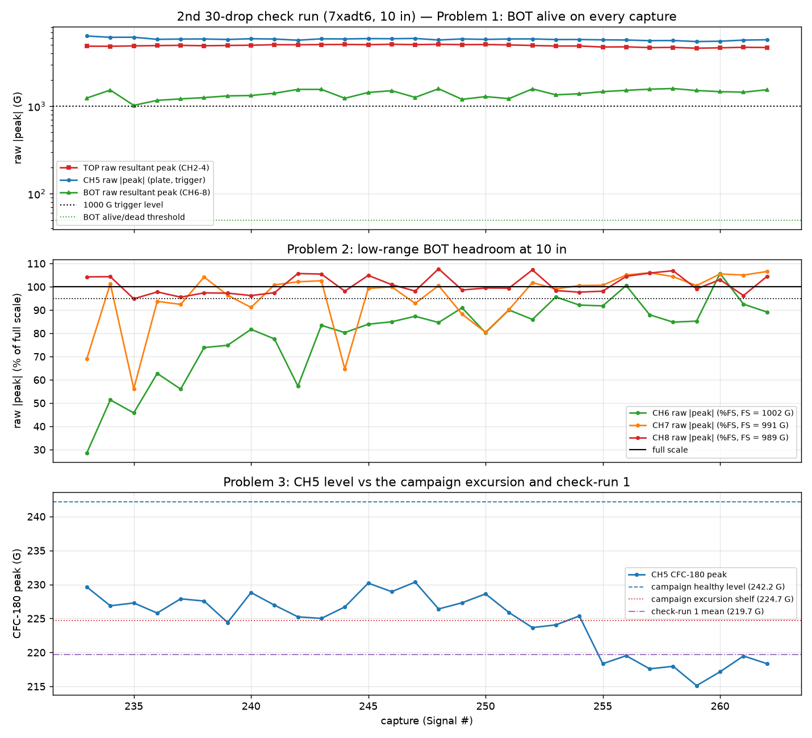

# 2nd 30-drop check run — do the same three problems still exist?

Analysis of the 30 auto-drops (`check2_Signal233–262`, specimen `7xadt6`,
10 in, CH5 trigger @ 1000 G) that @ctrhjk ran right after the first 30-drop
check run (`drop-test-200drops-check-analysis.md`), to diagnose whether the
three 200-drop-campaign problems — and the ~122 Hz watch item — are still
present.

- Data + setup: `data/drop-tests/200drops-check2/`
- Script: `scripts/analysis/drop_test_200drops_check2_analysis.py`
- Figures + machine-readable metrics:
  `data/drop-tests/200drops-check2/figures/`

Run health: **30/30 real drops**, zero spurious triggers, zero fall-offs;
CH5 crossed 1000 G at 3.896 ± 0.000 ms in every record (identical to
check-run 1); cadence ~14 s (30 drops in ~7 min).

## Bottom line

| # | problem | check-run 1 | **check-run 2 (this run)** | verdict |
|---|---|---|---|---|
| 1 | BOT electrical dropout | alive 30/30, noise 0.35 G | **alive 30/30, noise 0.10 G** | **stays fixed** — no dropout, quieter than before |
| 2 | BOT over full scale @ 10 in | CH7 26/30, CH8 29/30 > FS | **CH7 16/30, CH8 13/30 > FS; CH6 now 2/30** | **persists** — still clipping at/near FS |
| 3 | CH5 tape coupling / T bias | CH5 219.7 G, T 1.088 | **CH5 224.6 G, T 1.083** | **persists** — T durably stuck at ~1.08 |
| W | ~122 Hz ringdown mode | 0/30 below 200 Hz | **0/30 below 200 Hz (all ~549 Hz)** | **not back** — main mode ~550 Hz |

Net: the electrical dropout stays cured, the ~122 Hz mode does not return, but
the two **measurement-chain** problems are unchanged — the low-range BOT
station still tops out at 10 in, and CH5's tape mount is still ~8 % soft.

## Problem 1 — BOT electrical dropout: still fixed, and cleaner

The bottom tri-axis (CH6–8) is **alive on 30/30 captures**, with a full impact
response on every one (raw resultant 1,022–1,592 G, mean 1,391 G). The
pre-impact noise floor is **0.100 G** (range 0.032–0.360 G), lower than
check-run 1's 0.346 G and nowhere near the campaign dead-block's ~0.01 G
silence — and, notably, without check-run 1's anomalous first capture
(Signal 203 had a 5–10× elevated BOT noise floor). Two consecutive 30-drop
runs with a clean, quiet BOT is good evidence the intermittent connection has
settled. The caveat is unchanged: nothing was reportedly repaired, so the
wiggle-test of the CH6–8 cable path before a long campaign still stands.

## Problem 2 — BOT over full scale at 10 in: still present

| channel | full scale | median peak | max | ≥95 % FS | > FS | check-1 > FS |
|---|--:|--:|--:|--:|--:|--:|
| CH6 | 1,002.0 G | 84.7 % FS | 105.7 % | 3/30 | **2/30** | 0/30 |
| CH7 | 991.1 G | **100.5 % FS** | 106.6 % | 20/30 | **16/30** | 26/30 |
| CH8 | 989.1 G | **99.3 % FS** | 107.7 % | 29/30 | **13/30** | 29/30 |

CH7 and CH8 still sit right at full scale (medians ≈ 99–100 % FS) and go over
it on roughly half the drops, and CH6 has now crept over on 2 drops. Fewer
individual drops exceed FS than in check-run 1, but the medians are still
pinned at the ceiling and the worst flat-top is still 2 samples — so the BOT
amplitudes at 10 in remain **clipped/qualitative**, exactly as before. This is
a fundamental range mismatch (10 in of drop into ~990 G-FS accelerometers),
not a wiring issue: it is only cured by **dropping the height** (the 5 in run
kept CH8 under FS on 100/100 — see `drop-test-5in-100drops-analysis.md`) or
**re-ranging the bottom station** to a multi-kG sensor.

## Problem 3 — CH5 level / tape coupling: still degraded (durable, not recovering)

| metric | campaign (stabilized) | check-run 1 | **check-run 2** |
|---|--:|--:|--:|
| TOP CFC-180 | 244.6 G | 239.1 G | 243.1 G |
| CH5 CFC-180 | 238.7 G | 219.7 G | **224.6 G** |
| T = TOP/CH5 | 1.025 | 1.088 | **1.083** |

CH5 is still **~8 % soft**: T sits at 1.083 (range 1.067–1.101), essentially
unchanged from check-run 1's 1.088 and well above the campaign's healthy
1.025. CH5's own CFC-180 level (224.6 G) has recovered marginally toward the
campaign's *excursion shelf* (224.7 G) but not toward its healthy level
(242.2 G). The mild positive within-run T drift persists (+0.054 %/drop,
p = 0.001, vs +0.084 %/drop in check-run 1). This is the signature of a
**degraded, taped base-plate coupling** that stepped down during the campaign
and has stayed there across two check runs — it is not self-healing. The fix
is the same as flagged before: replace the CH5 tape mount with a stiff
wax/keyed coupling (as used, and shown repeatable, on the input-output series).

## Watch item — ~122 Hz ringdown mode: not back

The rotation-invariant TOP ringdown is dominated by the ~549 Hz mode on
**every** check2 drop (0/30 below 200 Hz; per-drop dominant frequency 549 Hz
with a handful at 580 Hz), and the P(~122 Hz)/P(~550 Hz) band-power ratio
stays well under 1 (median 0.223, range 0.148–0.358, trend −0.96 %/drop). The
pulse width is stable at 1.486 ms (CV 0.36 %). The end-of-campaign low-mode
excursion was transient; it has not recurred.

## Caveats

- Same rig/settings as check-run 1; n = 30 single specimen (`7xadt6`), 200 ms
  window only, so partial-pulse Δv.
- BOT amplitudes remain **qualitative** at 10 in (Problem 2 clipping).
- "Stays fixed" for BOT is empirical over 60 total check drops, not a repair —
  the intermittent-connection root cause is still physically present.
