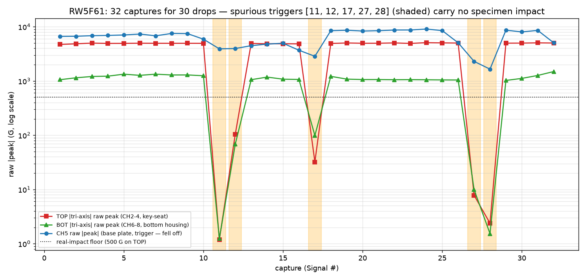
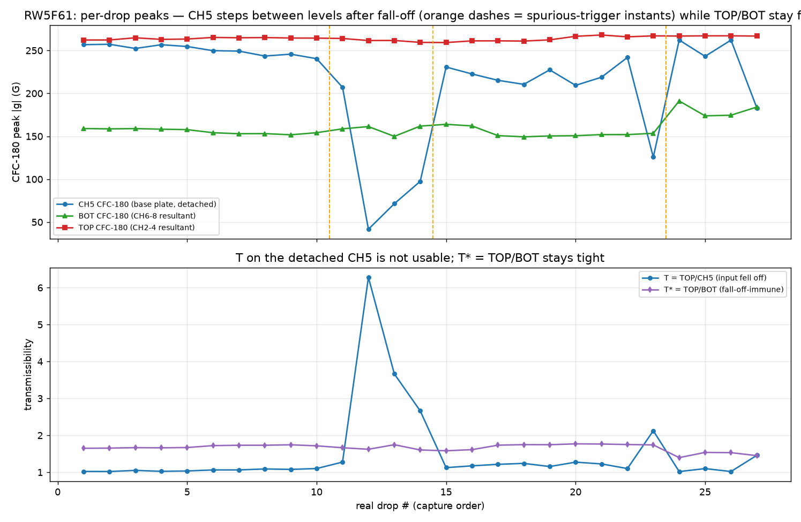
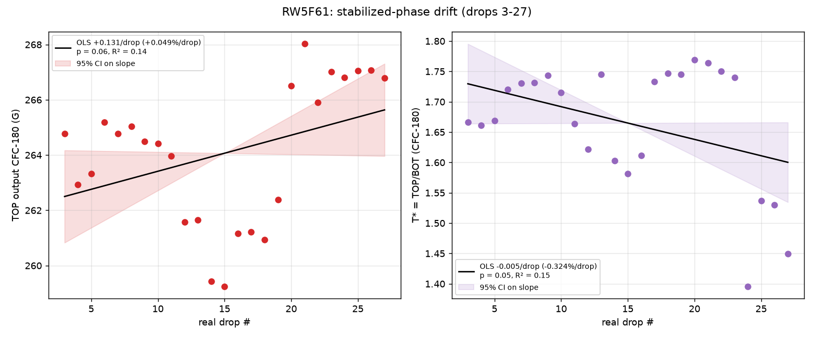
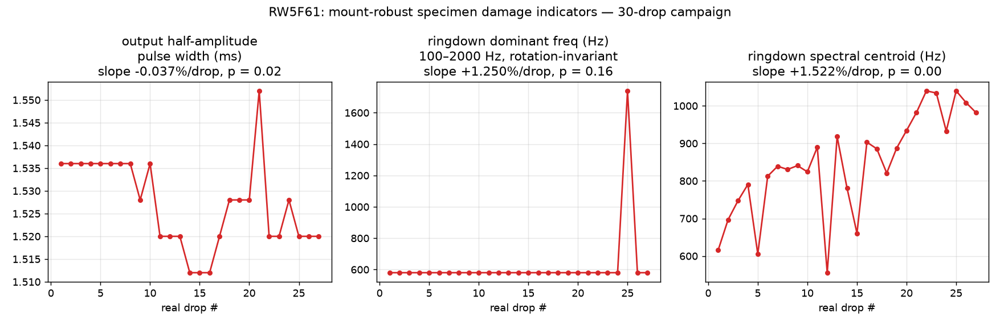
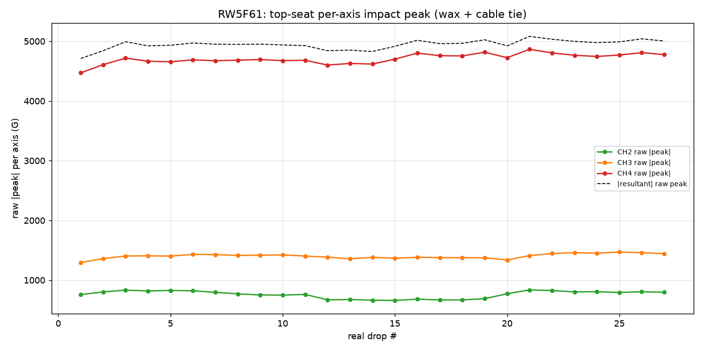

# 30-auto-drop run on `RW5F61` — CH5 fall-off forensics + OLS drift analysis

Analysis of the 32 TP4 captures posted by @ctrhjk on
[PR #67](https://github.com/vertical-cloud-lab/tensegrity-optimization/pull/67)
for the **30-auto-drop campaign on near-real specimen `RW5F61`** (top + bottom
vertex key-seat housings; small TPU bubbles on the top tendon so still classed
a failed print). Raw data:
[`data/drop-tests/30drops-real/raw/`](../data/drop-tests/30drops-real/raw);
script:
[`scripts/analysis/drop_test_30drops_real_analysis.py`](../scripts/analysis/drop_test_30drops_real_analysis.py);
figures + machine-readable metrics:
[`data/drop-tests/30drops-real/figures/`](../data/drop-tests/30drops-real/figures).

New this run: a low-sensitivity **tri-axis accelerometer in the bottom-vertex
housing (CH6/7/8, "BOT")** joins the top-vertex key-seat tri-axis (CH2/3/4,
"TOP") and the base-plate single-axis (CH5, the 1000 G trigger). **CH5 fell off
the plate mid-campaign**, so this analysis (a) identifies the fall-off and the
spurious captures, and (b) runs the drift-calibration OLS deliverables on the
channels that stayed valid.

All structural numbers are SAE J211 CFC-180 phaseless peaks; impacts are
located on the TOP resultant over the whole record (the detached trigger fired
early on several captures, pushing impacts to 5–35 ms).

## 1. Which captures indicate the fall-off — and when it happened

A real drop puts **~4,700–5,100 G raw** on the TOP resultant and
**~1,020–1,490 G** on BOT. Five captures have essentially nothing there
(TOP ≤ 105 G, three orders of magnitude below a real hit) while CH5 still shows
1,650–3,960 G — the trigger fired on the CH5 sensor's own motion, not a drop:

| capture | TOP raw (G) | CH5 raw (G) | verdict |
|---|--:|--:|---|
| Signal 11 | 1 | 3,909 | **fall-off event** — 6 s after Signal 10, no specimen impact |
| Signal 12 | 105 | 3,960 | spurious (sensor bouncing/settling) |
| Signal 17 | 32 | 2,849 | spurious |
| Signal 27 | 8 | 2,297 | spurious |
| Signal 28 | 2 | 1,651 | spurious |

So: **the sensor let go at Signal 11** (the trigger firing 6 s off-cadence with
zero structural response is the detachment itself), and **Signals 11, 12, 17,
27, 28 are the spurious-trigger datasets**. The other 27 captures are real
drops; 3 of the 30 conducted drops were never captured (their impacts fell in
the DAQ dead time consumed by the spurious triggers — the event-time gaps
around Signals 11–12, 17 and 27–28 each swallow one ~15 s cadence slot).

CH5 is **not trustworthy on any capture from Signal 11 onward**, even the real
ones:

- pre-fall-off (Signals 1–10): CFC-180 251 G, **CV 2.4 %** — normal;
- post-fall-off: CFC-180 42–262 G, **CV 34.7 %**, stepping between distinct raw
  levels (~3.7–5.0 kG on Signals 13–16, ~8.3–9.1 kG on 18–26 — up to **96 % of
  the 9,442.9 G full scale**, i.e. near clipping) as the loose sensor changed
  resting position;
- trigger latency became erratic: the impact lands at the nominal ~3.9 ms
  pre-trigger point when the trigger is healthy, but at **9.6, 9.0, 5.1 and
  35.3 ms** on Signals 13, 14, 15 and 26 — the loose sensor triggered early on
  its own rattle, and on Signal 26 the real impact only just stayed inside the
  window.

Meanwhile TOP (262–268 G) and BOT stayed flat through all of it — the
structural measurement itself was never disturbed.

## 2. Burn-in and stabilized-phase OLS (27 real drops)

Because CH5 is invalid, the drift deliverables run on **TOP** (output),
**BOT** (the new bottom-vertex input reference) and the fall-off-immune
**T\* = TOP/BOT**.

**Burn-in:** the changepoint scan goes non-significant at **k = 2**
(exponential-approach fit: plateau 264.1 G, amplitude 4.2 G, **τ = 1.4
drops**) — much faster seating than `prc1kn` run #2 (τ = 12), consistent with
this being an undisturbed wax application on a fresh housing. Stabilized phase
= drops 3–27 (n = 25).

| series | mean | CV | slope (%/drop) | 95 % CI (per drop) | p |
|---|--:|--:|--:|--:|--:|
| **TOP output** | **264.1 G** | **0.97 %** | +0.049 | [−0.009, +0.270] G | 0.065 |
| BOT input (CH6-8 resultant) | 159.2 G | 6.86 % | +0.428 | [+0.114, +1.250] G | 0.021 |
| **T\* = TOP/BOT** | **1.665** | **6.10 %** | −0.324 | [−0.011, +0.000] | 0.053 |
| CH5 (detached — for reference) | 210.5 G | 28.9 % | −0.399 | [−4.39, +2.71] G | 0.629 |

Readings:

1. **The TOP output is drift-free and tight** — CV 0.97 %, slope n.s.
   (+0.049 %/drop, p = 0.065; the split-half check shows a −0.15 %/drop first
   half and +0.24 %/drop second half, i.e. a wobble of total range ~2 %, not a
   monotonic seating trend). The wax + cable-tie key-seat protocol carries over
   to `RW5F61` unchanged.
2. **The bottom-vertex input is usable but noisier than the base plate was** —
   CV 6.9 % vs the 0.5–2.6 % the wax-on-plate CH5 delivered while attached.
   Cause: the last four captures (Signals 29–32, after the second spurious
   pair) show a **level step in the CFC-180 resultant (150–160 → 174–191 G)
   carried by the off-axis CH6/CH7 content, while the drop-axis CH8 raw peak
   stays flat (~925–1,025 G)** — the bottom sensor's orientation/coupling
   shifted, plausibly disturbed by whatever freed the CH5 sensor nearby. That
   step also drives the barely-significant BOT slope (+0.43 %/drop, p = 0.021)
   and the mirror-image T\* slope; drop it and both flatten.
3. **T\* ≈ 1.67 is a different quantity from the old T ≈ 1.0–1.2**: the
   reference now sits on the compliant bottom *vertex* (159 G), not the rigid
   plate (~220 G). Fine for BO — but only comparable within this
   instrumentation layout.
4. Reliability: Durbin-Watson 0.36–1.0 (positive autocorrelation from the
   smooth wobble — makes OLS *over*-eager, so the n.s. verdicts survive a
   fortiori); Shapiro-Wilk flags TOP residual non-normality (the split-half
   wobble), which the split-half check addresses directly; start-drop sweep
   keeps TOP between +0.05 and +0.12 %/drop, always ≤ ~0.1 %/drop in magnitude.

## 3. Specimen damage check (`RW5F61`, mount-robust indicators)

| indicator | result | verdict |
|---|---|---|
| output pulse width | 1.53 ms, CV 0.64 %, −0.037 %/drop (total −1 %, direction *stiffer*) | no softening |
| ringdown dominant freq (rotation-invariant) | no trend (p = 0.16); alternates between two modes (~530 and ~1,100 Hz) unlike single-mode `prc1kn` | no stiffness loss |
| ringdown spectral centroid | rises +1.5 %/drop (p < 0.001) | seat-coupling evolution, not damage (same signature as prior runs) |
| pre-impact noise RMS | TOP 0.5 → 0.2 G (improved), BOT flat 0.11–0.14 G | sensors healthy |

No damage signature over the 27 recorded impacts. The top-seat per-axis
migration (CH3/CH4 growing +0.17 %/drop at constant resultant) shows the same
slow in-seat rotation seen on `prc1kn` — the cable tie again removed the
consequence (nothing fell off the *top* seat), not the cause.

## 4. Recommendations — keeping the sensors in place

1. **Base-plate single-axis (the one that fell off): stop relying on bare wax
   for auto-drop campaigns.** Wax-on-plate was excellent for 5–50 manual/auto
   drops, but it is the classic temporary mount and it shear-fatigues under
   repeated ~7,000–9,000 G raw hits. In order of preference per the ISO 5347
   hierarchy: (a) **stud/screw mount** — bolt a small tapped aluminum block (or
   drill/tap the acrylic) and screw the sensor down; (b) **hard adhesive**
   (cyanoacrylate/epoxy on a dedicated sacrificial base) instead of wax;
   (c) if wax must stay: fresh thin film each session, cleaned surfaces, plus a
   **cable tie-off for this sensor too** — the top sensor's tie is what kept
   run #2 alive, and the base sensor had none.
2. **Move the trigger off the base-plate sensor.** A trigger on a sensor that
   can detach is a single point of failure that corrupts the whole campaign's
   bookkeeping (5 spurious captures + 3 lost drops here). **CH4 is the robust
   choice**: it carries ~4,500–4,800 G raw on every real drop (vs the 1000 G
   level, ~4.5× margin) and lives in the proven key-seat. CH8 is marginal as a
   trigger (raw ~925–1,025 G straddles the 1000 G level). Alternatively lower
   the trigger to ~300–500 G on whichever channel is chosen.
3. **Add a live plausibility check during auto campaigns**: any capture whose
   impact (max of the TOP resultant) is < 500 G or lands > 6 ms into the record
   is spurious/early-triggered — both checks are one line in the analysis
   script and would have flagged Signals 11/12/17/27/28 in real time.
4. **Deepen the key-seat pockets** (already agreed in-thread) so the walls, not
   the wax film, register the sensor — the in-seat rotation is still visible on
   both tri-axis units, and the bottom unit's late-run off-axis step is what is
   currently costing T\* its precision (CV 6 % vs the ~1 % it should reach).
   Re-check the bottom sensor's seating before the next campaign.
5. **Keep the cable tie-offs** on all sensors — zero fall-offs on the two tied
   sensors across ~80 drops, one fall-off on the untied one.

## Caveats

n = 1 specimen and `RW5F61` is still a failed print (top-tendon bubbles) —
this qualifies the three-sensor layout and the mount SOP, not geometry
(T\* ≈ 1.67 is not a geometry result). 200 ms window only; Δv partial-pulse
(BOT ~2.0 m/s); tri-axis orientations unverified (and the bottom one
demonstrably shifted late in the run); CH5 conclusions rest on level/timing
forensics, not on a video of the detachment.
