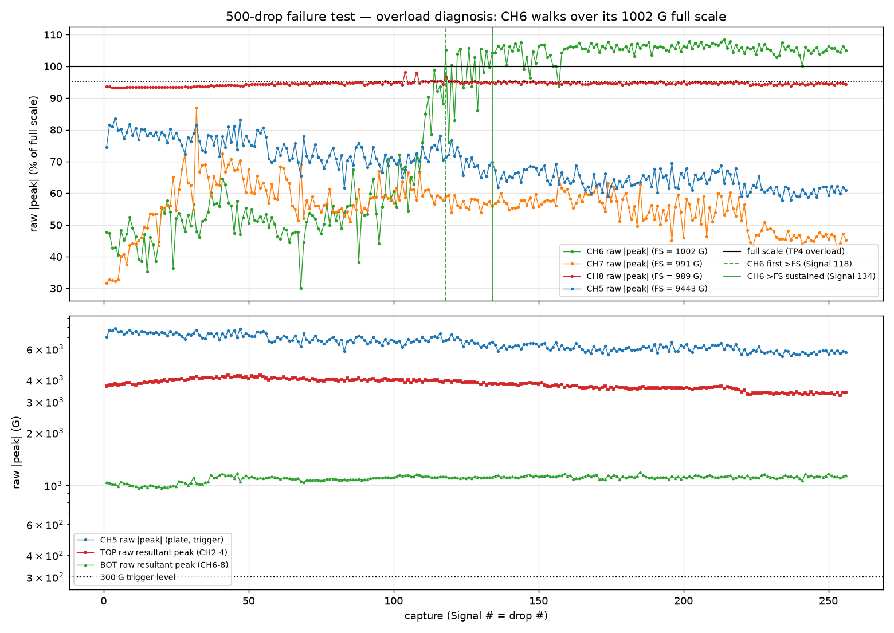
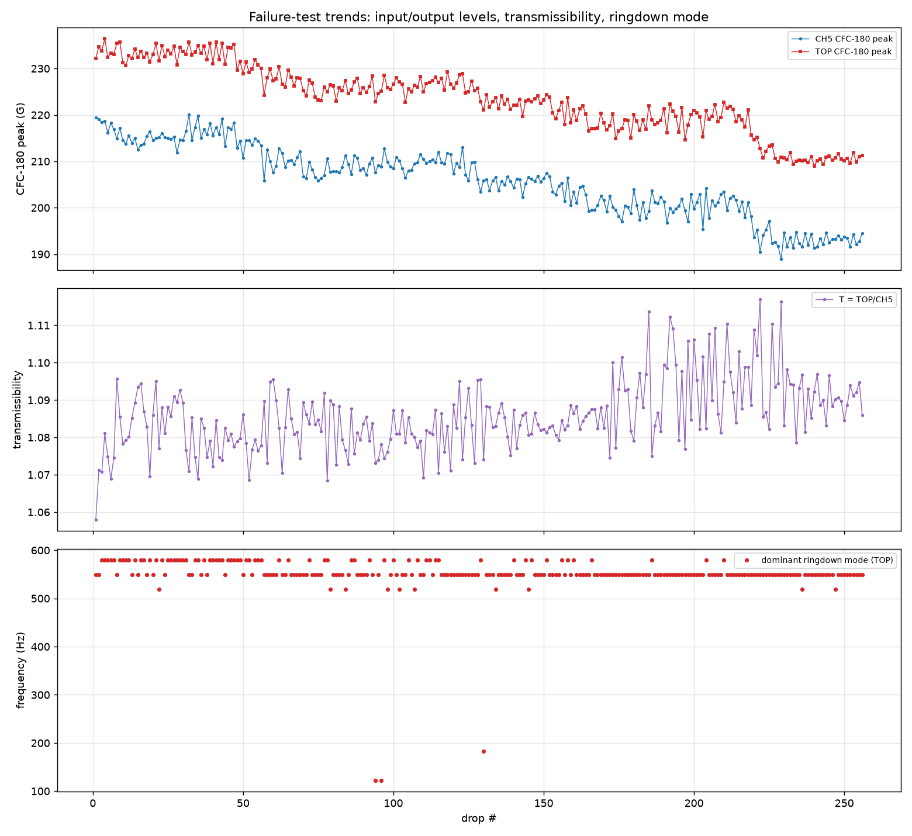

# 500-drop failure test — what tripped the TP4 overload at drop 256?

Analysis of the 256 recorded auto-drops (`500drops_Signal1–256`, the newest
bubbled-TPU-tendon print, 10 in, CH5 trigger @ **300 G**) from @ctrhjk's
failure test in PR #82. The run was set to 500 drops but stopped at drop 256
when the Test Partner 4 showed an **overload condition** and all signals
were disconnected.

- Data + setup: `data/drop-tests/500drops/`
- Script: `scripts/analysis/drop_test_500drops_analysis.py`
- Figures + machine-readable metrics: `data/drop-tests/500drops/figures/`

Run health up to the stop: **256/256 real drops**, zero spurious triggers,
all seven channels alive on every capture; CH5 crossed 300 G at
3.896 ± 0.000 ms in every record; cadence ~13 s (256 drops in ~59 min);
worst pre-impact CH5 activity 9.9 G (30× below the 300 G level).

## Bottom line

**The overload is CH6** — one axis of the low-range bottom-vertex tri-axis
(full scale 1,002 G). Its impact peak was a comfortable ~475 G (≈47 % FS)
for the first ~96 drops, **climbed rapidly between drops ~97–130, first
exceeded full scale at Signal 118, and stayed over full scale continuously
from Signal 134 to the end** (over FS on 128/256 drops, median across the
whole run 99.8 % FS, recorded max 108.4 % FS). A TP4 overload flag means a
channel's input exceeded its calibrated range — CH6 did exactly that on
essentially every drop for the last ~120 drops, and by drop 256 the
condition was showing on the front panel. No other channel went over full
scale this run.

Two important reassurances:

1. **Nothing actually disconnected in the data.** All seven channels are
   alive with normal noise floors and offsets through Signal 256 itself,
   which contains a perfectly normal impact. The "all signals disconnected"
   display is the TP4's reaction to the (long-latched) overload state, not a
   physical sensor or cable failure. The 256 captures are fully usable —
   except CH6's amplitudes after ~Signal 118, which are range-censored.
2. **This failure mode was predicted.** "BOT over full scale at 10 in" is
   Problem 2 of the 200-drop campaign and both check runs; what's new is
   that it escalated from "clipped/qualitative amplitudes" to "halts a long
   campaign," and that this time **CH6** (previously the safest BOT axis)
   is the axis that went over.

## Overload diagnosis — per-channel saturation audit

| channel | full scale | median | max | ≥95 % FS | > FS | first > FS | sustained from |
|---|--:|--:|--:|--:|--:|--:|--:|
| CH2 | 14,492.8 G | 4.6 % | 5.4 % | 0/256 | 0/256 | — | — |
| CH3 | 14,992.5 G | 6.3 % | 6.8 % | 0/256 | 0/256 | — | — |
| CH4 | 13,624.0 G | 26.9 % | 30.0 % | 0/256 | 0/256 | — | — |
| CH5 | 9,442.9 G | 68.4 % | 83.6 % | 0/256 | 0/256 | — | — |
| **CH6** | **1,002.0 G** | **99.8 %** | **108.4 %** | **134/256** | **128/256** | **Signal 118** | **Signal 134** |
| CH7 | 991.1 G | 56.3 % | 87.0 % | 0/256 | 0/256 | — | — |
| CH8 | 989.1 G | 94.6 % | 98.2 % | 51/256 | 0/256 | — | — |

CH8 lived at its usual ~94–95 % FS shelf but — unlike in the check runs —
never actually crossed FS; CH7 stayed comfortably under. The overload is
CH6's alone.

### The shape of CH6's walk into overload

| drops (32-block) | 1–32 | 33–64 | 65–96 | 97–128 | 129–160 | 161–192 | 193–224 | 225–256 |
|---|--:|--:|--:|--:|--:|--:|--:|--:|
| CH6 mean (G) | 474 | 526 | 485 | 813 | 1,031 | 1,062 | 1,065 | 1,052 |

This is **not a slow drift** — it is a transition event: flat at ~47 % FS
for ~96 drops, a fast climb over ~30 drops, then a flat shelf at
~105 % FS for the final ~120 drops. The shelf value (1,050–1,087 G) is the
digitizer's over-range ceiling, so CH6 amplitudes there are censored: we
cannot tell from this channel whether the underlying peak kept growing.
Two independent signals bracket the same window:

- the **~122 Hz low ringdown mode** (the 200-drop campaign's watch item,
  absent in both check runs) flickered on exactly 3 of 256 drops — Signals
  **94, 96** (122 Hz) and **130** (183 Hz) — i.e. precisely at the onset and
  end of the CH6 transition;
- CH7 partially mirrors CH6 over the run (rising to ~87 % FS around drop 33,
  then decaying to ~45 % while CH6 rose), while the BOT **resultant** grew
  only ~+11 % (1,019 → 1,127 G, and that late value is an underestimate
  because of CH6 censoring).

Mostly-rotation-plus-some-growth is the reading: the bottom-vertex key seat
rotating in its pocket (a documented behavior of these seats) re-projected a
roughly-constant resultant onto CH6, on top of a genuine ~10 % increase in
bottom-vertex transmission. Given this specimen's three bubbled diagonal TPU
tendons, a tendon settling/stretching event around drops ~95–130 changing the
bottom-vertex load path is a plausible driver for both. A photo/inspection of
the bottom seat and the bubbled tendons is worth taking before the next run.

## Failure-test trends — the specimen did not structurally fail

| metric | mean | CV | net change over 256 drops | p |
|---|--:|--:|--:|--:|
| CH5 raw \|peak\| | 6,509 G | 9.3 % | **−29 %** | 8e-89 |
| TOP raw resultant | 3,787 G | 6.7 % | **−20 %** | 6e-76 |
| CH5 CFC-180 | 205.8 G | 3.7 % | −12 % | 4e-122 |
| TOP CFC-180 | 223.4 G | 3.3 % | −11 % | 2e-119 |
| input Δv | 2.41 m/s | 3.5 % | −11 % | 5e-99 |
| **T = TOP/CH5** | **1.087** | **0.87 %** | **+1 %** | 3e-17 |
| pulse width | 1.49 ms | 0.38 % | −1 % | 4e-45 |

Despite the bubbled tendons and 256 impacts, there is **no structural
failure signature**: T is essentially flat (1.076 → 1.090), the pulse width
is constant, and the dominant ringdown mode is ~549 Hz on 253/256 drops.
What did change is the **severity actually delivered**: input and output
declined *together* (Δv −11 %, both CFC-180 levels −11/−12 %, both raw
spikes −20/−29 %) while their ratio stayed put — a rig/severity drift (both
stations agree, so it is not a single coupling), the same slow-decline
phenomenon flagged in earlier long campaigns, now over its longest run.

Two more program-relevant notes:

- **The 300 G trigger recommendation is validated at scale**: 256/256 clean
  triggers, µs-level crossing jitter, and 30× clearance above the worst
  pre-impact activity. Trigger reliability played no role in the stop.
- **CH5 headroom is thinner on fresh prints than `7xadt6` suggested**: this
  print's early-run CH5 raw peaks reached 7.9 kG = **83.6 % of full scale at
  10 in** (vs ~62 % for `7xadt6`). That further reinforces 10 in as the
  ceiling — a stiff BO design at 13 in would likely clip the trigger/input
  channel.

## What to change before re-running the failure test

1. **Take the low-range BOT station out of the overload path.** It is the
   only channel that can trip the TP4 at 10 in, and its amplitudes are
   censored there anyway (this run: CH6 over FS on half the drops, CH8 at
   94–98 %). Options, in increasing effort: disable/disconnect CH6–8 for
   long campaigns; check whether the TP4 overload latch can be configured to
   warn rather than stop; re-range the bottom station to a multi-kG tri-axis
   (the standing recommendation since the 200-drop campaign).
2. **Inspect the bottom-vertex seat + tendons** and re-seat/re-key CH6–8;
   log a photo. The drop-~100 transition is a real mechanical change.
3. Keep 10 in + 300 G — both performed exactly as designed for all 256
   drops.

## Caveats

- Single specimen, no stated ID; specimen parameters not yet tied to the
  print (the standing metadata ask).
- CH6 amplitudes after Signal ~118 are range-censored; BOT resultants late
  in the run are lower bounds.
- 200 ms window only, so partial-pulse Δv; TOP tri-axis orientation
  unverified (resultants are rotation-invariant, per-axis values are not).
- The exact TP4 overload/disconnect semantics (latched vs per-event, and
  why the front panel showed it at drop 256 rather than at drop ~118) are
  taken from the operator report; the data can only show which channel
  exceeded its range, not the DAQ's internal state machine.
