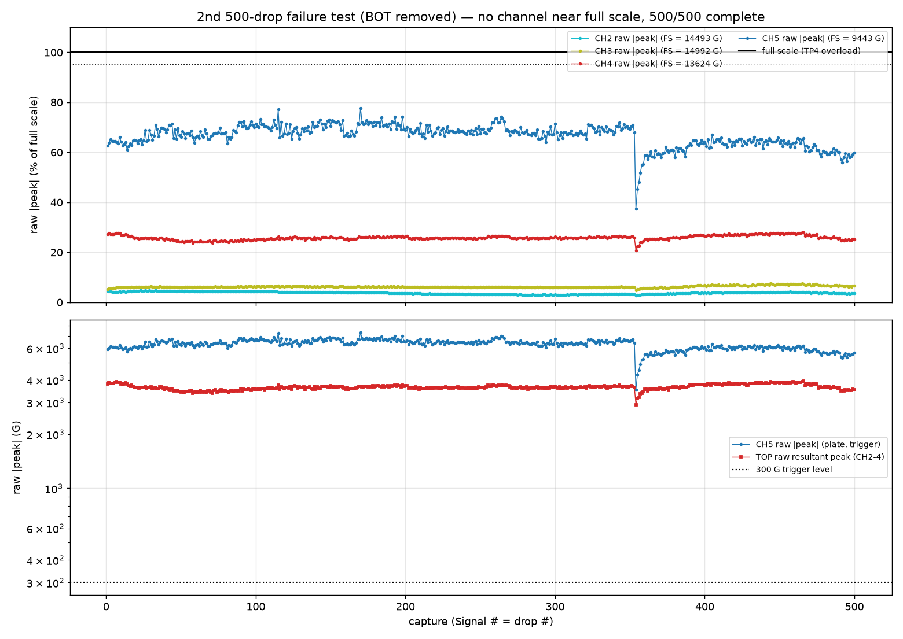
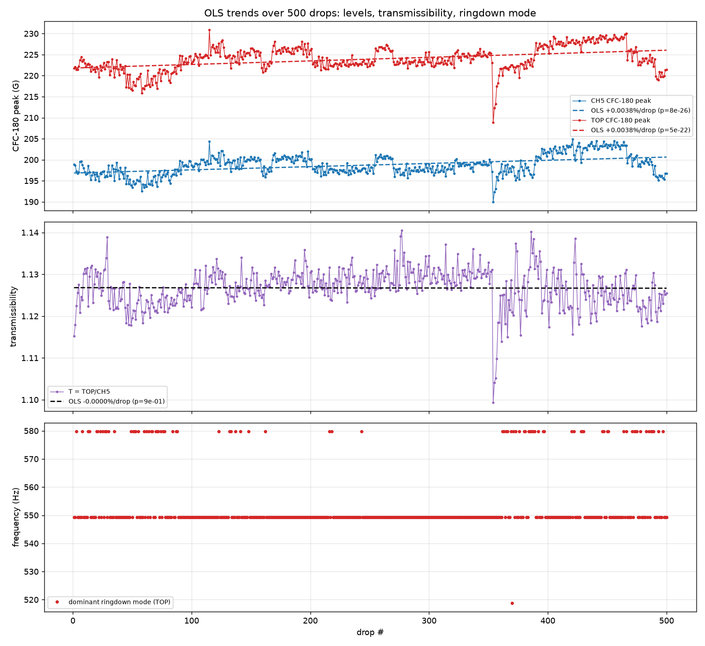
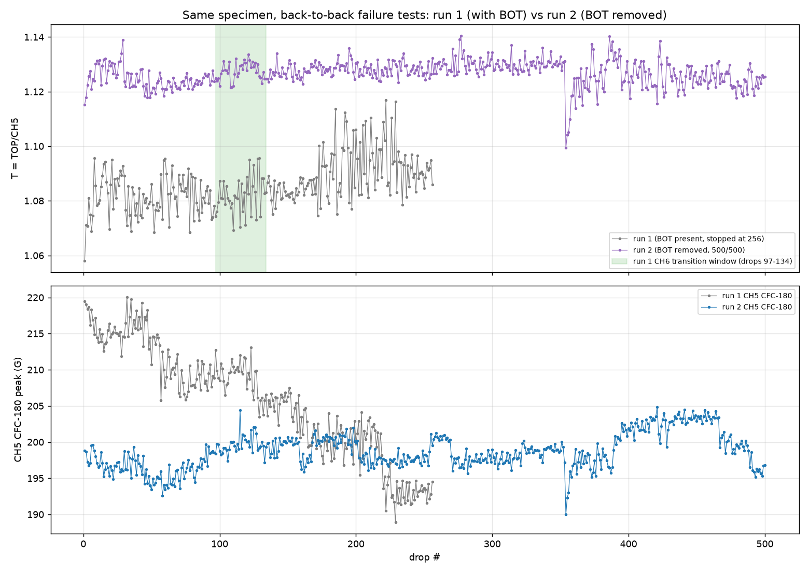

# 2nd 500-drop failure test (BOT removed) — OLS trends + do we need the bottom tri-axis?

Analysis of the 500 auto-drops (`500_Signal1–500`, same bubbled-TPU print as
the first 500-drop attempt, 10 in, CH5 trigger @ 300 G) from @ctrhjk's re-run
in PR #82. The change from the first attempt: **the bottom-vertex low-range
tri-axis (CH6–8) was physically removed** — the channel family whose CH6
walked over its 1,002 G full scale and tripped the TP4 overload at drop 256
last time.

- Data + setup: `data/drop-tests/500drops-nobot/`
- Script: `scripts/analysis/drop_test_500drops_nobot_analysis.py`
- Figures + machine-readable metrics: `data/drop-tests/500drops-nobot/figures/`
- First attempt (with BOT): [`drop-test-500drops-analysis.md`](drop-test-500drops-analysis.md)

## Bottom line

1. **Removing CH6–8 cured the stop.** The run completed **500/500** real
   drops (zero spurious triggers) in ~137 min at ~18 s cadence, with **no
   channel ever reaching 95 % of full scale** (worst: CH5 at 77.6 % on one
   drop; TOP axes ≤ 28 %). The overload was BOT's alone, exactly as
   diagnosed.
2. **The specimen still shows no structural-failure signature at ~756
   cumulative drops.** T = TOP/CH5 is dead flat over the run (OLS slope
   p = 0.86, net 0 %), pulse width is constant, and the dominant ringdown
   mode stays at ~549 Hz on all 500 drops (never below 200 Hz).
3. **The BO objective stack does not need the BOT station** — T, output
   peak, pulse width, Δv and the ringdown mode are all measured by CH2–5,
   and their CVs this run are the best of any long campaign (T CV 0.42 %).
   What BOT uniquely provided in run 1 (the bottom-vertex load-path
   transition at drops ~97–134) was **invisible to the surviving channels**
   (T shift +0.15 %, Welch p = 0.2) — but that information is a
   structural-health diagnostic, not an objective, and at 10 in it is
   range-censored anyway. Recommendation at the end.

## Run health + saturation audit

| | value |
|---|---|
| captures | 500/500 real impacts, 0 spurious |
| cadence | median 18 s, max gap 19 s (18:24–20:41, ~137 min) |
| CH5 crossing of 300 G | 3.896 ± 0.000 ms (µs-level jitter, every record) |
| worst pre-impact CH5 activity | 10.4 G (29× below the level) |

| channel | full scale | median | max | ≥95 % FS | > FS |
|---|--:|--:|--:|--:|--:|
| CH2 | 14,492.8 G | 3.8 % | 4.7 % | 0/500 | 0/500 |
| CH3 | 14,992.5 G | 6.2 % | 7.6 % | 0/500 | 0/500 |
| CH4 | 13,624.0 G | 25.8 % | 28.0 % | 0/500 | 0/500 |
| CH5 | 9,442.9 G | 67.5 % | 77.6 % | 0/500 | 0/500 |

With BOT gone, the nearest-to-limit channel is CH5 at ~2/3 of full scale —
comfortable, and one more data point for 10 in (not 13 in) as the standard
height.

## OLS regressions vs drop number (the ask)

| metric | mean | CV | slope (%/drop) | p | R² | net over 500 drops |
|---|--:|--:|--:|--:|--:|--:|
| CH5 raw \|peak\| | 6,289 G | 6.5 % | −0.022 | 5e-32 | 0.24 | **−11 %** |
| TOP raw resultant | 3,648 G | 3.3 % | +0.009 | 2e-19 | 0.15 | +4 % |
| CH5 CFC-180 | 198.7 G | 1.24 % | +0.0038 | 8e-26 | 0.20 | +2 % |
| TOP CFC-180 | 223.9 G | 1.32 % | +0.0038 | 5e-22 | 0.17 | +2 % |
| **T = TOP/CH5** | **1.127** | **0.42 %** | **−0.00002** | **0.86** | **0.00** | **0 %** |
| pulse width | 1.48 ms | 0.29 % | +0.0007 | 4e-15 | 0.12 | +0.3 % |
| input Δv | 2.33 m/s | 1.28 % | +0.0040 | 3e-26 | 0.20 | +2 % |
| dominant ringdown mode | 554 Hz | 2.1 % | +0.0001 | 0.92 | 0.00 | 0 % |

By-half OLS (drops 1–250 vs 251–500) shows the same picture — tiny,
sign-flipping slopes (T: +0.0017 %/drop then −0.0024 %/drop) rather than any
monotonic degradation.

Two things stand out against every earlier long campaign:

- **The chronic severity decline is gone.** Run 1 lost −11 to −12 % in
  CFC-180 levels and Δv over 256 drops; this run *gained* ~+2 % over 500.
  The slow decline is therefore a session condition, not an intrinsic
  property of long campaigns (candidates: rig warm-up, release-fixture
  state, evening vs afternoon session — cadence was also 18 s vs 13 s).
- **The one real disturbance is a step event at drop 354** (20:07:56, no
  pause in the cadence): the CH5 raw spike collapsed 6,424 → 3,526 G in a
  single drop, both stations' CFC-180 levels dipped ~4–7 %, and T dipped
  1.131 → 1.099, then everything recovered over the next ~30 drops (T back
  to ~1.126; the CH5 raw spike only to ~5.7 kG, vs ~6.5 kG before). Both
  stations moving together marks it as a severity/coupling event at the
  rig or plate (seat/tape settling under repeated impact is the standing
  suspect), not a specimen change — and, importantly, **the surviving
  channels detected and tracked it on their own** (see below).

## Same specimen, back-to-back runs: run 1 (with BOT) vs run 2 (BOT removed)

| metric | run 1 (n = 256) | run 2 (n = 500) | run 2, drops 1–256 | Welch p (1–256) |
|---|--:|--:|--:|--:|
| CH5 CFC-180 | 205.8 G (CV 3.7 %) | 198.7 G (CV 1.2 %) | 198.0 G | 8e-41 |
| TOP CFC-180 | 223.4 G (CV 3.3 %) | 223.9 G (CV 1.3 %) | 223.1 G | **0.58** |
| T = TOP/CH5 | 1.086 (CV 0.87 %) | 1.127 (CV 0.42 %) | 1.127 | 6e-190 |
| input Δv | 2.41 m/s (CV 3.5 %) | 2.33 m/s (CV 1.3 %) | 2.32 m/s | 1e-42 |

The between-run comparison is unusually clean because the **TOP station is
statistically identical across runs** (223.4 vs 223.1 G, p = 0.58): the
specimen and delivered severity carried over. The T step 1.086 → 1.127
(+3.7 %) is therefore **entirely CH5-side** — the base-plate channel reads
~4 % lower after the between-run handling — the same tape-coupling session
dependence documented since the 200-drop campaign (T has now sat at 1.025,
1.083, 1.087, 1.13 in different sessions on tape-era CH5 states). Within-run
T is superb (CV 0.42 %); between-run comparability remains the argument for
the rigid keyed CH5 seat.

## Assessment: is the bottom tri-axis needed?

**What was lost by removing it, measured on run 1's own data.** During run
1's CH6 transition (drops ~97–134 — the event that later tripped the
overload), the channels that survive into run 2 saw essentially nothing:

| metric (run 1 data) | drops 60–96 | drops 134–170 | shift | Welch p |
|---|--:|--:|--:|--:|
| T = TOP/CH5 | 1.082 | 1.084 | +0.15 % | 0.2 |
| dominant ringdown mode | 531 Hz | 554 Hz | +4.4 % | 0.17 |
| CH5 / TOP CFC-180 | 208.9 / 226.1 G | 204.2 / 221.3 G | −2.2 / −2.1 % | (the general severity decline, not the event) |

So the BOT station is **not redundant**: it observed a real bottom-vertex
load-path change that no surviving channel detected. But three facts cap its
value at 10 in:

1. **It contributes nothing to the BO objective stack.** T, output peak,
   pulse width, Δv, ringdown mode — all CH2–5 quantities — and this run
   measured them with the best CVs of any long campaign.
2. **Its amplitudes at 10 in are censored anyway** (run 1: CH6 median
   99.8 % FS, CH8 94.6 %) — it functions as a binary "load path changed"
   indicator, not a quantitative sensor, at this severity.
3. **It is the only thing that can halt a campaign** — demonstrated: with
   it, stop at 256; without it, 500/500. An unattended BO batch that dies
   mid-run costs a session; a specimen-side transition, if one occurs, is
   flagged well enough by T/severity steps the surviving channels *can* see
   (this run's drop-354 event was caught and tracked entirely by CH2–5).

**Recommendation:** run BO campaigns and long failure tests at 10 in
**without the BOT station** (as configured this run). Re-introduce
bottom-vertex sensing only as (a) an occasional short health-check session
at 5 in, where it stays in range, or (b) permanently, once re-ranged to a
multi-kG tri-axis (the standing hardware recommendation). If bottom-vertex
load-path observability is wanted during BO, schedule a 5-in check between
specimens rather than carrying an overload liability through every batch.

## Caveats

- Same unidentified specimen as run 1, now ~756 cumulative drops; parameters
  still not tied to a print ID (standing metadata ask).
- Run-1 vs run-2 differences confound "BOT removed" with the between-run
  handling (sensor removal itself disturbed the rig) and session conditions;
  the TOP-station identity (p = 0.58) limits but does not eliminate this.
- The drop-354 event's physical cause is inferred (both-stations-together →
  rig/coupling side); no video or inspection record exists for that moment.
- 200 ms window, partial-pulse Δv, TOP tri-axis orientation unverified
  (resultants are rotation-invariant).
