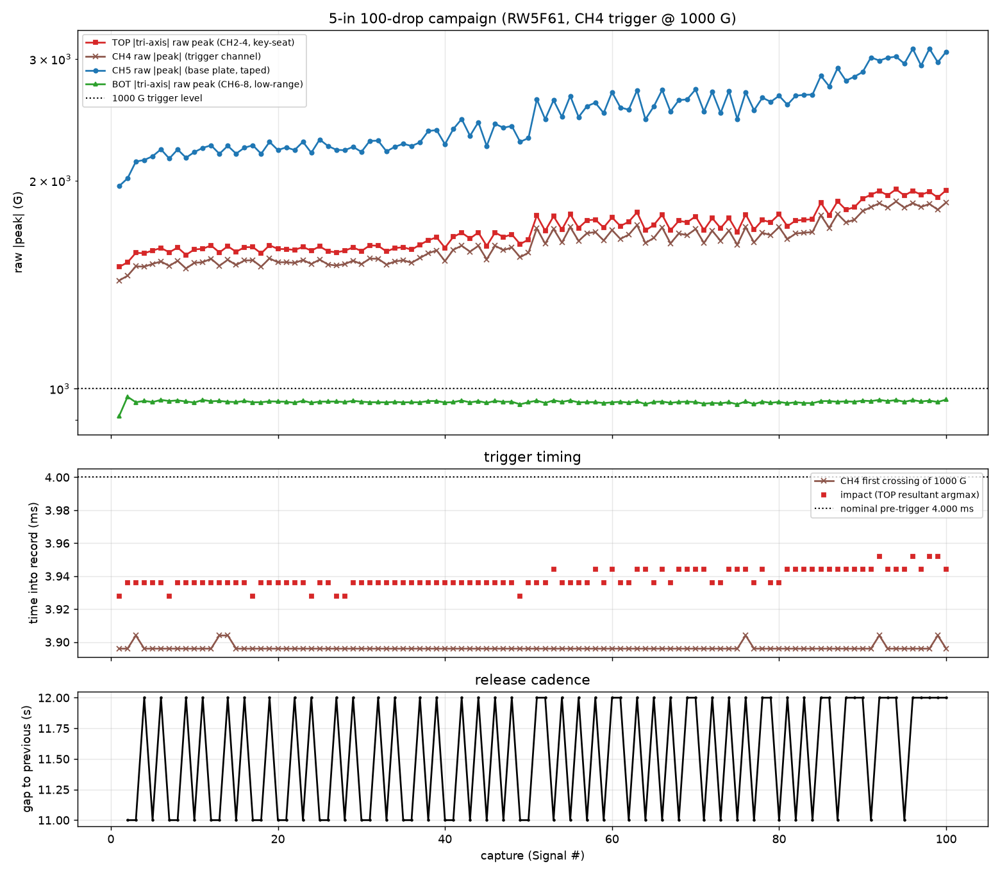
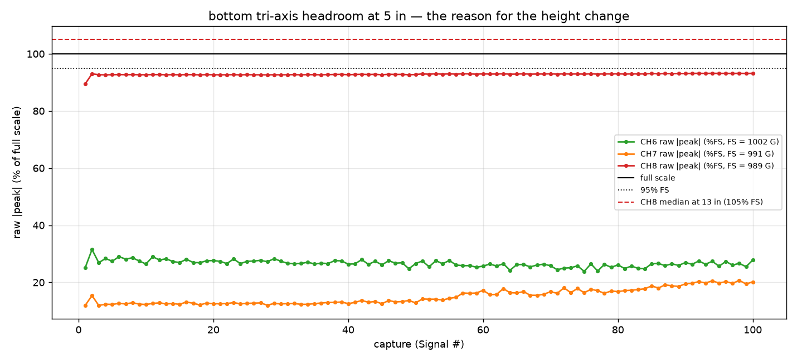
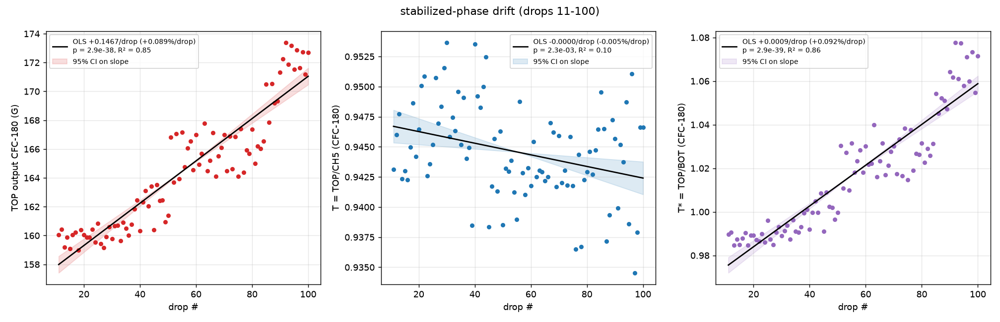
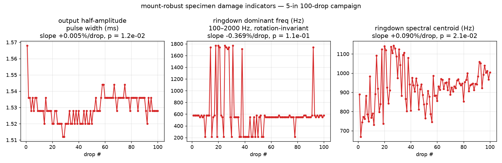

# 5-in 100-drop campaign on `RW5F61` — height-reduction validation + OLS drift

Analysis of the 100 auto-drop captures posted by @ctrhjk on
[PR #67](https://github.com/vertical-cloud-lab/tensegrity-optimization/pull/67)
(TP4 session `5 in height 100 drops`, 07/08/2026). Raw data and channel map:
[`data/drop-tests/5in-100drops/`](../data/drop-tests/5in-100drops/);
reproducible script:
[`scripts/analysis/drop_test_5in_100drops_analysis.py`](../scripts/analysis/drop_test_5in_100drops_analysis.py)
(emits `figures/5in_100drops_metrics.json`).

**The one change under test:** drop height lowered **13 in → 5 in** — the
"Option A" fix for the under-ranged low-range bottom tri-axis (CH6–8,
~1 kG FS), which exceeded full scale on 85/100 (13-in 100-drop run) and
40/50 (CH4-trigger run) drops. Same rig otherwise: specimen `RW5F61`
(cumulative history now ~280 drops), CH4 trigger at 1000 G, taped CH5 on the
base plate, and the key-seat **housing entrances taped** to retain the
tri-axis sensors (this run's retention refinement). Impact metrics use the
SAE J211 phaseless CFC-180 filter; peaks are windowed ±1.5 ms around the
TOP-resultant impact.

## 1. Campaign health — 100/100 clean, fastest cadence yet

- **100/100 captures are real drops** — zero spurious triggers, zero lost
  drops, zero fall-offs (the taped housing entrances held both tri-axis
  sensors for the full campaign).
- CH4 first crossing of the 1000 G level at **3.896 ± 0.002 ms** in every
  record (±1 sample of jitter), identical to the 13-in CH4-trigger run —
  the fixed ~0.10 ms DAQ latency vs the nominal 4.000 ms pre-trigger point.
- Cadence median **12 s** (range 11–12 s); 100 drops in ~19 min.
- **Trigger margin thinned as predicted but never threatened**: CH4 raw
  |peak| 1,624 ± 108 G (range 1,433–1,865) → **1.43–1.86×** over the 1000 G
  level (13 in gave 3.2–3.7×; the pre-campaign prediction was ~2.0×).
  Pre-impact quiet is ≤ 35 G before 3.5 ms in every record, so there is
  enormous room to lower the level (see §6).

## 2. Saturation audit — the height change did its job, with one big asterisk

| channel | full scale | median peak | max | ≥95 % FS | > FS |
|---|--:|--:|--:|--:|--:|
| CH2 (TOP X) | 14492.8 G | 1.3 % FS | 1.5 % | 0/100 | 0/100 |
| CH3 (TOP Y) | 14992.5 G | 3.2 % FS | 3.6 % | 0/100 | 0/100 |
| CH4 (TOP Z, trigger) | 13624.0 G | 11.8 % FS | 13.7 % | 0/100 | 0/100 |
| CH5 (plate, taped) | 9442.9 G | 26.0 % FS | 32.9 % | 0/100 | 0/100 |
| CH6 (BOT X) | 1002.0 G | 26.6 % FS | 31.5 % | 0/100 | 0/100 |
| CH7 (BOT Y) | 991.1 G | 14.0 % FS | 20.7 % | 0/100 | 0/100 |
| **CH8 (BOT Z, drop axis)** | **989.1 G** | **92.9 % FS** | **93.2 %** | **0/100** | **0/100** |

CH8 went from **85/100 drops above full scale (median 105 % FS)** at 13 in to
**0/100 (max 93.2 % FS)** at 5 in — the stated goal of the height change is
met, and no channel flat-tops anywhere in the campaign.

**The asterisk: CH8 looks amplitude-limited just below full scale, not
healthy.** Three independent signatures point the same way:

1. **Implausibly constant peak.** CH8's raw peak spans 885–922 G over 100
   drops (CV **0.4 %**) while every other channel varies 13–25 %
   drop-to-drop (CH4: 1,433–1,865 G; CH5: 1,964–3,104 G).
2. **Near-invariance to a 2.6× height change.** From 13 in to 5 in the TOP
   and CH5 raw peaks dropped ~47–53 % and the CFC-180 levels ~27 %, but CH8's
   raw peak barely moved (~1,039 G → ~920 G, −11 %). A physical peak should
   track severity; a limiting output stage stays pinned.
3. **Deaf to the input drift.** The plate strike demonstrably hardened ~9 %
   across this campaign (§4), yet the BOT resultant stayed flat to 0.25 % CV.

This is consistent with the earlier datasheet caution: an IEPE sensor's
guaranteed-linear output swing (typically ±5 V) at ~10 mV/G means **~±500 G
of specified linearity** — everything above that, even "under full scale," is
unspecified. **Recommendation stands: treat all BOT-derived amplitudes as
qualitative** until the datasheet linear range is confirmed and/or the bottom
station is cross-checked against the multi-kG tri-axis for a few drops.

Also note for future height planning: the √h severity scaling
under-predicted the reduction on some channels and over-predicted on others
(CH4 raw measured ratio 0.47 vs 0.62 predicted; CFC-180 levels ~0.73) —
empirical verification per station, as done here, is the right procedure.

## 3. Burn-in — none detectable; the trend is campaign-scale, not seating

The changepoint scan never reaches an n.s. TOP slope for any burn-in count
k = 0…20 (slope stays +0.082…+0.097 %/drop, p < 1e-10 throughout), and the
exponential-approach fit degenerates to a straight line (no plateau within
the campaign). This is **not** a seating transient like the wax burn-in on
`prc1kn` — it is a slow, roughly linear, campaign-long drift shared by both
input channels (§4). Per the established SOP the stabilized window is taken
as drops 11–100 (n = 90) anyway; the start-drop sensitivity sweep (start
1 → 51: +0.082…+0.100 %/drop, all significant) confirms the verdicts don't
hinge on the cut.

## 4. Stabilized-phase OLS (drops 11–100, n = 90, CFC-180)

| series | mean | CV | slope (%/drop) | p | R² | DW |
|---|--:|--:|--:|--:|--:|--:|
| TOP output (CH2–4) | 164.5 G | 2.52 % | **+0.089** | 2.9e-38 | 0.85 | 1.30 |
| CH5 plate (taped) | 174.2 G | 2.68 % | **+0.094** | 6.3e-37 | 0.84 | 1.40 |
| **T = TOP/CH5** | **0.945** | **0.42 %** | −0.005 | 2.3e-03 | 0.10 | 1.89 |
| BOT input (CH6–8) | 161.7 G | 0.25 % | −0.003 | 6.0e-03 | 0.08 | 2.57 |
| T\* = TOP/BOT | 1.017 | 2.59 % | +0.092 | 2.9e-39 | 0.86 | 1.36 |

**The strike hardened ~+9 % over the campaign — and T cancelled it.**
TOP (+0.089 %/drop) and CH5 (+0.094 %/drop) rise together at R² ≈ 0.85, with
the plate input Δv rising in lockstep (+0.082 %/drop, p ≈ 1e-37): the
auto-dropper's strike grew steadily harder, a **rig-level input drift**, not
the specimen and not a mount artifact (contrast the 13-in 100-drop run,
where CH5 rose *without* TOP — tape seating). The split-half check shows the
hardening even accelerates slightly (+0.075 → +0.111 %/drop), so whatever is
driving it (release mechanism at the 5-in setting? bungee/cable behavior at
the shorter travel?) was still evolving at drop 100 — worth a look at the
release fixture before the next campaign.

Because the drift is common-mode, **T = TOP/CH5 is flat at 0.945 with
CV 0.42 % — the tightest transmissibility series of the whole program**
(13-in CH4-trigger run: 1.20 %; hot-glue era: 2–5 %). The residual T slope
(−0.005 %/drop, ≈ −0.4 % total) is statistically significant only because
the scatter is so small. This is now the **third campaign** in which a
rig-level input drift (harder in drift-cal #2, softer in the CH4-trigger
run, harder here) cancels in T — the strongest evidence yet that the
per-drop ratio is the right BO objective.

T\* = TOP/BOT inherits TOP's rise wholesale because BOT is pinned (§2) —
**do not use T\* from this campaign.**

**Reliability.** Durbin-Watson 1.30–1.89 on the headline series (mild
positive autocorrelation on TOP/CH5, which if anything makes OLS over-eager —
the *flat-T* verdict survives a fortiori); Shapiro-Wilk p = 0.20–0.72 (no
normality violation); n = 90 gives the tightest slope CIs of any campaign
(TOP: [+0.134, +0.160] G/drop).

## 5. Specimen at ~280 cumulative drops — no damage signature

- **Output pulse width 1.53 ms, CV 0.53 %**, slope +0.005 %/drop (p = 0.012,
  ≈ +0.5 % total) — trivial magnitude; the 13-in 100-drop run's +2.7 %
  watch item did not recur.
- **Ringdown dominant mode** alternates between the familiar two clusters
  (~520–700 Hz and ~1.3–1.7 kHz; CV 67 % reflects the alternation, not
  drift) with no trend (p = 0.11) — no stiffness-loss signature.
- Pre-impact noise floors healthy on both tri-axis units (≤ 0.3 G RMS).
- **The bottom seat is still slowly rotating**: CH7 raw peak grows
  127 → 199 G (+0.56 %/drop, p ≈ 1e-40) at near-constant resultant — the
  same in-seat rotation signature as every prior campaign, now *with* the
  taped entrance (tape retains, but doesn't register orientation). The top
  seat shows a milder version (CH4 raw +24 % over the campaign while the
  CFC-180 resultant rose only ~9 %). Deeper key-seat pockets remain the fix;
  resultant-based metrics are robust to it.

## 6. Recommendations

1. **Adopt 5 in as the standard height for BOT-instrumented campaigns** —
   100/100 clean end-to-end, saturation eliminated, T reproduced (0.945 vs
   0.960 at 13 in) at less than half the per-drop severity.
2. **Lower the CH4 trigger level to ~500 G for 5-in campaigns.** The margin
   thinned to 1.43× worst-case; with pre-impact activity ≤ 35 G, a 500 G
   level restores ~3× margin with ≥ 14× clearance above the noise floor.
3. **Keep BOT qualitative** until the low-range unit's datasheet linear
   range is confirmed; the ~920 G pinning (§2) says the channel is still not
   trustworthy even though it no longer exceeds full scale. A 5-drop
   cross-check with the multi-kG tri-axis at the bottom station would settle
   it.
4. **Check the release fixture / drop-height stability** before the next
   campaign — the ~+9 % monotonic input hardening is harmless for T but
   would contaminate any absolute peak-g objective.
5. **T = TOP/CH5 (CV 0.42 %) is BO-campaign-ready** at 5 in. The
   instrumentation-qualification arc that started with the hot-glue mounts
   is complete; the next campaign should be geometry discrimination
   (n ≥ 5 distinct intact prints, randomized order).

## 7. Caveats

n = 1 specimen and `RW5F61` is a failed print (top-tendon bubbles) — this
qualifies the reduced-height configuration, not geometry (T ≈ 0.945 is not a
geometry result). 200 ms window; Δv partial-pulse; tri-axis orientations
unverified (and both seats demonstrably rotating slowly); BOT amplitudes
suspect throughout (§2); the "harder strike" reading of the common-mode
drift is inferred from the TOP+CH5+Δv concordance, not an independent
release-velocity measurement.
