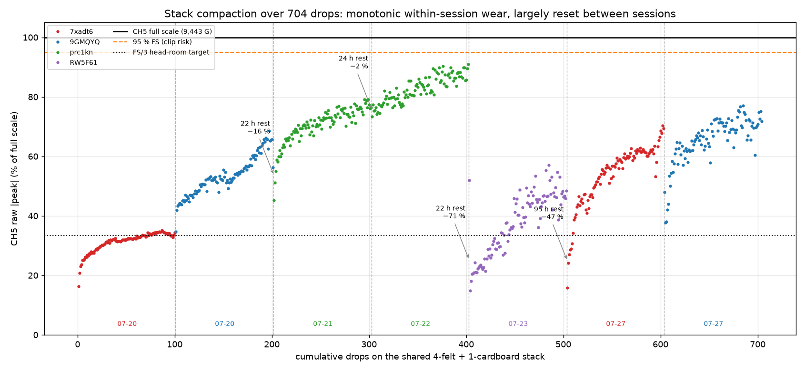
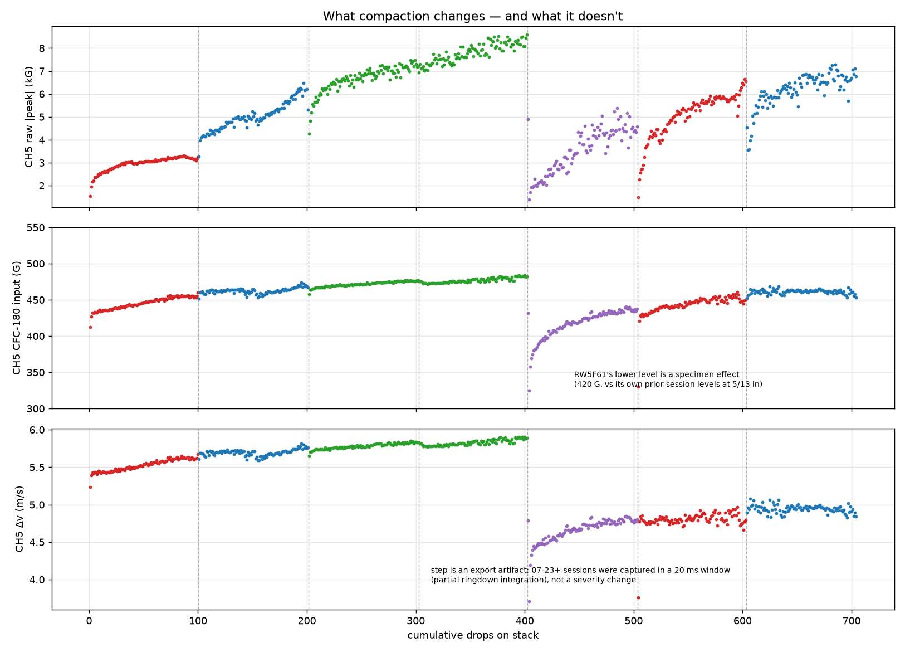
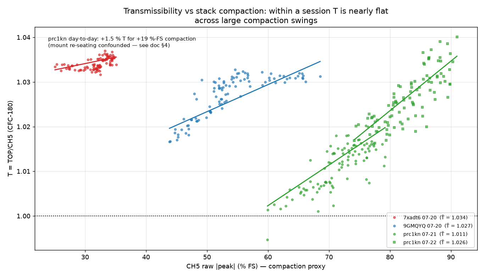

# Absorber-stack compaction: growth per drop, the "unusable" point, and T-robustness

Answers @me-madsen's question on PR #86 (2026-07-29): *how does the
compaction of the felt/cardboard stack increase with each drop, at what
point do the sheets become unusable (if at all), and can the data show
whether transmissibility stays consistent for a specimen at the same
height under different compaction levels?*
[Issue #88](https://github.com/vertical-cloud-lab/tensegrity-optimization/issues/88#issuecomment-5121703763)
documents the visible thickness loss of the stack as of 07-29.

Everything here is CH5-only (the base-plate single-axis input, full scale
9,442.9 G), re-aggregated from the per-drop records already committed by
the campaign analyses — **704 drops on the one physical 4-felt +
1-cardboard stack across seven 60 in sessions, 07-20 → 07-27**. The
compaction proxy is the CH5 **raw** |peak|: wear shows up as
high-frequency spike content that eats full-scale head-room, while the
SAE J211 CFC-180 filtered input barely moves.

- Script: `scripts/analysis/drop_test_compaction_analysis.py` (reads the
  committed `*_metrics.json` files; no raw data of its own)
- Figures + metrics: `data/drop-tests/compaction/figures/`

## 1. How compaction grows with each drop

| session | stack drops | CH5 raw, first 5 → last 5 (% FS) | wear rate (G/drop) | CFC-180 input (G) |
|---|--:|--:|--:|--:|
| `7xadt6` 07-20 | 1–100 | 21.8 → 33.5 | 9.2 | 446.2 |
| `9GMQYQ` 07-20 | 101–201 | 41.6 → 64.3 | 19.7 | 462.7 |
| `prc1kn` 07-21 | 202–302 | 53.7 → 77.1 | 16.4 | 472.2 |
| `prc1kn` 07-22 | 303–402 | 75.6 → 88.3 (**max 91.0**) | 12.7 | 477.2 |
| `RW5F61` 07-23 | 403–503 | 25.2 → 47.1 | 29.0 | 420.0 |
| `7xadt6` 07-27 | 504–603 | 24.9 → 68.5 | 29.9 | 445.2 |
| `9GMQYQ` 07-27 | 604–704 | 42.0 → 73.0 | 19.1 | 461.3 |

Three regimes, all visible in the timeline figure:

1. **Within a session, compaction is monotonic and roughly linear**: the
   raw spike grows 9–30 G per drop (OLS, p ≪ 1e-10 every session),
   multiplying 1.2–2.8× over ~100 drops. The rate is highest on a
   freshly-rested stack and flattens as the stack approaches its
   compacted state (`prc1kn` 07-22, starting at 76 % FS, wore slowest).
2. **Between sessions the growth largely resets — but the reset is not a
   clean function of rest time.** Session-*start* levels are strikingly
   specimen-reproducible a week apart (`7xadt6` 22 → 25 % FS, `9GMQYQ`
   42 → 42 %, with ~500 more stack drops in between), which means there
   is **no cumulative baseline creep** over the observed life. Yet the
   one same-specimen overnight pair (`prc1kn` 07-21 end 77 % → 07-22
   start 76 %, ~24 h rest) shows essentially *no* recovery, while the
   07-22 → 07-23 gap (22 h) reset the stack fully. Unrecorded handling
   (repositioning/re-stacking the sheets between sessions) very likely
   matters as much as viscoelastic recovery — worth logging per session.
3. **The raw level is strongly specimen-dependent** (`7xadt6` ~22–25 %,
   `9GMQYQ` ~42 %, `prc1kn` 54–76 % at session start): what sits on the
   plate changes how hard the plate's high-frequency content is excited.
   So %-FS thresholds are per-specimen numbers, and `prc1kn` — the
   soft/heavy dummy — runs the hottest.

The one true **aging** signal: at matched fresh-start level, `7xadt6`
wore **×3.2 faster** on 07-27 than on 07-20 (9.2 → 29.9 G/drop; fig 02).
Part of that ratio may be a measurement artifact — the 07-27 sessions
were captured at 1.25 MHz vs 125 kHz, which resolves narrow spikes
better — but `9GMQYQ`'s cross-format end-levels differ only ~14 %, so
most of the acceleration looks real: the stack still resets, but it
re-compacts faster than it did a week ago.

## 2. What compaction does *not* change

The filtered severity of the test is essentially untouched after 704
drops: `7xadt6`'s stabilized CFC-180 input is **446.2 G on 07-20 vs
445.2 G on 07-27** (statistically indistinguishable, p = 0.34) and
`9GMQYQ`'s moved −0.3 %. Δv is flat within each export format (the step
at drop 403 is the 20 ms capture window truncating the ringdown, not a
severity change). Compaction adds high-frequency spike content — a
raw-head-room problem — without changing the shock the specimen feels at
the frequencies that matter.

## 3. When does the stack become unusable?

**It has not become unusable in 704 drops, and on the filtered metrics
there is no trend toward it.** The binding constraint is raw full-scale
head-room on CH5, and it is a *management* problem, not (yet) a
replacement deadline:

- Worst case observed: **91 % FS** (`prc1kn` 07-22 — third near-daily
  session, started already at 76 %). A clipped drop would corrupt the
  peak and possibly the trigger; that session was ~1 more evening of
  accumulation away from clipping.
- From a specimen-typical fresh start at current wear rates, a single
  100-drop session tops out at ~70–80 % FS; extrapolating the 07-27
  rates, ~95 % FS would be reached only after **≈ 220–260 consecutive
  drops without a reset**.
- The risk scenarios are therefore: (a) sessions longer than ~150 drops,
  (b) starting a session above ~50 % FS (insufficient rest/handling —
  the 07-22 case), (c) hot specimens like `prc1kn`, and (d) continued
  wear-rate acceleration — if `7xadt6`'s ×3.2/week trend continues, a
  fresh-start 100-drop session hits ~95 % within roughly 1–2 more weekly
  cycles, at which point the sheets are effectively spent for full
  campaigns.

**Operational rule** (replaces the earlier blanket FS/3-refresh advice,
which the lab cannot follow with no spare felt): log the first-5-drop CH5
raw %FS at every session start; proceed if < ~50 %, rest/re-set the stack
first if above; treat any drop > 90 % FS as a stop-and-reset. And add two
30-second habits: **measure the stack's free thickness** (issue #88's
photo shows exactly how) and note any re-stacking/handling in the session
log — that turns the %-FS proxy into a physical compaction curve and
resolves the recovery-vs-handling ambiguity in §1. The durable
polyurethane/Sorbothane replacement
([`drop-test-absorber-alternatives.md`](drop-test-absorber-alternatives.md))
remains the permanent exit from this treadmill.

## 4. Is T consistent across compaction levels?

Yes — the data can distinguish this, in two ways, with one gap:

- **Within sessions** (the cleanest evidence, mount untouched): the
  compaction proxy swings enormously — `9GMQYQ` 07-20 ran 44 → 69 % FS,
  `prc1kn` 07-21 ran 60 → 79 % — while T moved ≤ ~1 % end-to-end (CV
  0.12–0.57 %). The within-session T-vs-%FS slopes are +0.003 to +0.011
  per 10 %-FS (statistically real, but partially the known drop-count
  mount drift wearing the same clothes). If T tracked compaction
  strongly, these sessions would show it; they don't.
- **Across sessions, same specimen**: the only computable pair is
  `prc1kn` 07-21 (~70 % FS mean) vs 07-22 (~83 % FS): T = 1.011 → 1.026
  (+1.5 %). That is the **upper bound** on cross-session compaction
  sensitivity, and it is confounded with overnight mount/coupling
  re-seating — the `500drops` pair moved 3.7 % on tape re-coupling with
  *no* stack change at all. So compaction's true effect on T is bounded
  at ≲1.5 % across nearly the full usable stack range, and is plausibly
  much smaller.
- **The gap**: the ideal check — `7xadt6`/`9GMQYQ` T at fresh (07-20) vs
  worn (07-27) stack — is not computable because the 07-27 sessions
  recorded CH5 only. The re-run planned this week (sensors re-enabled)
  closes exactly this; no protocol change needed.

**Practical reading**: T remains safe for ranking designs on ≥10 %
differences at any stack state seen so far; sub-2 % *cross-session* T
comparisons stay unreliable, with mount re-seating — not compaction — as
the lead suspect.

## 5. Caveats

- The raw |peak| is a proxy for compaction (spike content at the plate),
  not a direct measurement of stack stiffness or thickness; it is also
  specimen-dependent (§1.3) and mildly capture-rate-dependent (125 kHz
  undersamples the narrowest spikes; batch-2 raw peaks read slightly
  hot by comparison).
- Wear-rate acceleration rests on one matched pair (`7xadt6`); `9GMQYQ`'s
  matched pair shows none (×0.97), likely because both its sessions ran
  second-in-evening on an already-worked stack. n = 1 pair each.
- Rest-time vs handling cannot be separated from the committed data
  (§1.2); the per-session thickness + handling log in §3 is the fix.
- All sessions are 60 in; wear rates at other heights will differ
  (the felt-sheet sweep suggests roughly with impact energy).
