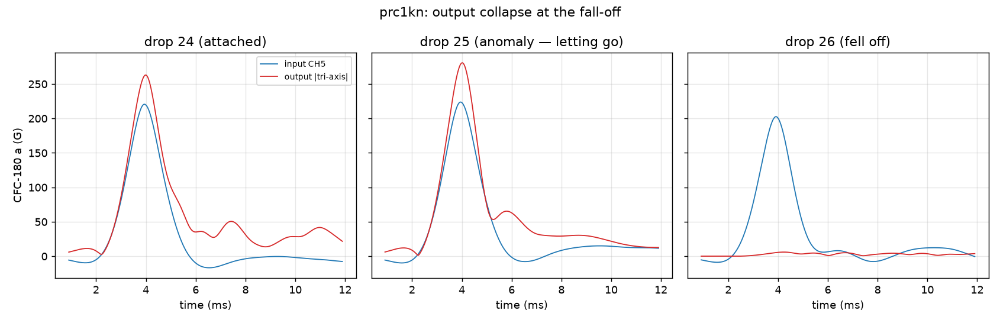
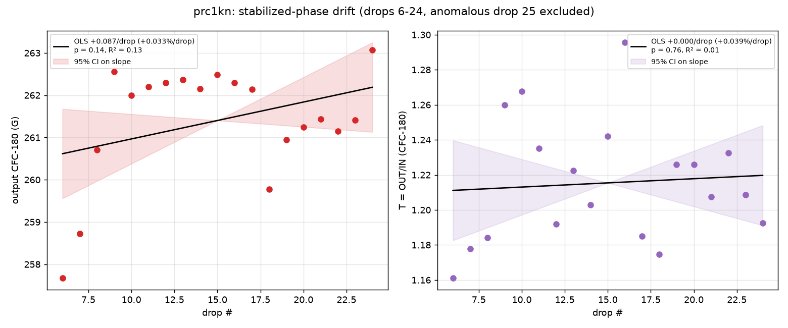
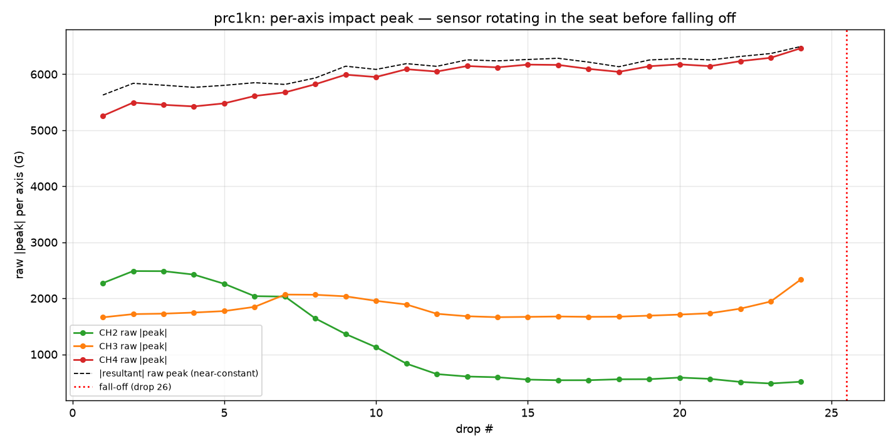

# Drift-calibration analysis — 30 auto-drops, `prc1kn`

Analysis of the **drift-calibration** run posted by @ctrhjk on
[PR #67](https://github.com/vertical-cloud-lab/tensegrity-optimization/pull/67):
**30 automatically-conducted drops** at 13 in (~15 s cadence), same input-output
pair as the whole series — single-axis **input** wax-mounted on the base plate
(CH5, triggered at 1000 G), tri-axis **output** in the top-vertex **key-seat +
wax** (CH2/CH3/CH4), bungees removed — on the dummy specimen `prc1kn` (failed
print; mount/DAQ validation, not geometry). Fresh from the
[burn-in wax run](drop-test-burn-in-wax-analysis.md), this experiment was
designed to (1) define the burn-in drop count, (2) measure the system's
inherent post-burn-in drift rate by OLS, and (3) qualify that regression's
reliability. During the run the output sensor **fell off the key-seat housing**
at an initially unknown drop.

- Data + setup: [`data/drop-tests/drift-calibration/`](../data/drop-tests/drift-calibration/README.md)
- Script: [`scripts/analysis/drop_test_drift_calibration_analysis.py`](../scripts/analysis/drop_test_drift_calibration_analysis.py)
- Figures + machine-readable metrics: [`data/drop-tests/drift-calibration/figures/`](../data/drop-tests/drift-calibration/figures)

Pipeline per drop is identical to the prior runs: impact located on the
triggered CH5 within the first 10 ms (windowed ±1.5 ms peak, not a global
0.2 s max), baseline-corrected, SAE J211 phaseless CFC-1000 / CFC-180
filtering; output is the tri-axis resultant; transmissibility `T = OUT/IN` on
CFC-180 peaks.

## 0. When did the sensor fall off? Drop 26 — and drop 25 shows it letting go

An attached output sensor never peaked below ~5,600 G raw in this series; a
detached one never above ~30 G — the two states are unambiguous (five orders of
magnitude in CFC-180 terms: ~260 G vs ~2–6 G):

| drops | output raw peak (G) | output CFC-180 (G) | state |
|---|--:|--:|---|
| 1–24 | 5,628–6,495 | 255–263 | attached |
| **25** | **7,276** | **281** | attached, **anomalous** (z = +9.5 vs drops ≤ 24) |
| **26–30** | **11–26** | **2–6** | **fell off** |

@ctrhjk's guess of the 26th drop is **confirmed**: drop 26 is the first capture
with no output impact at all. Better still, **drop 25 caught the sensor letting
go** — its resultant spikes to 281 G (+7 % over the 261 G plateau, z = +9.5),
with CH3 jumping 2,339 → 3,453 G and CH4 6,465 → 7,272 G in one drop. Drop 25
is excluded from all drift fits below.

There was also a **slow-motion warning visible from drop ~8 onward**: the
per-axis peaks migrate steadily at near-constant resultant — CH2 decays
2,272 → ~510 G (−8.6 %/drop, p ≈ 1e−9) while CH4 grows 5,257 → 6,465 G
(+0.7 %/drop, p ≈ 1e−10). A rigid, fixed sensor cannot do that; the sensor was
**rotating / working loose in the seat** for most of the run while the
rotation-invariant resultant (and `T`) stayed clean. See §4.

## 1. Burn-in drop count: 5 (fresh wax, this rig)

Changepoint scan: for each candidate burn-in count *k*, OLS the output
(CFC-180, tri-axis resultant) over drops *k*+1…24 and ask whether a seating
trend remains:

| burn-in k | n | output slope (G/drop) | %/drop | p |
|--:|--:|--:|--:|--:|
| 0 | 24 | +0.214 | +0.082 | <0.001 |
| 3 | 21 | +0.152 | +0.058 | 0.009 |
| 4 | 20 | +0.128 | +0.049 | 0.033 |
| **5** | **19** | **+0.087** | **+0.033** | **0.135 (n.s.)** |
| 6 | 18 | +0.030 | +0.011 | 0.560 |
| 7 | 17 | −0.028 | −0.011 | 0.507 |

The seating trend stops being significant once the first **5** drops are
discarded, and the residual slope collapses to ~0 by k = 6–7. An independent
exponential-approach fit `out(d) = a − b·exp(−d/τ)` agrees: plateau
262.1 G, seating amplitude 8.1 G, **τ = 4.9 drops** (63 % seated by drop ~5,
95 % by ~15). The output series itself reads the same way: 255 → 258 G over
drops 1–2, ~258 G through drop 7, settling at 261–263 G from drop ~9.

**Implication for the SOP:** the 3-drop burn-in that sufficed in the
[previous run](drop-test-burn-in-wax-analysis.md) is marginal — at k = 3 a
significant seating trend remains (p = 0.009) in this longer, fresh-wax
series. **Use ≥ 5 burn-in drops after every fresh wax application** (cheap
insurance: the auto-dropper makes extra drops nearly free), and re-run this
changepoint scan on the first few recorded drops to confirm per application.

## 2. Inherent drift rate: statistically zero — |drift| ≤ 0.08 %/drop at 95 %

OLS on the stabilized phase only (drops 6–24, n = 19; drop 25 excluded as the
pre-fall-off anomaly):

| series | mean | CV | slope /drop | %/drop | 95 % CI (/drop) | p | R² |
|---|--:|--:|--:|--:|--:|--:|--:|
| input CH5 (G) | 215.2 | 2.57 % | −0.022 | −0.010 % | [−0.52, +0.48] | 0.93 | 0.00 |
| **output (G)** | **261.4** | **0.53 %** | **+0.087** | **+0.033 %** | **[−0.030, +0.205]** | **0.135** | **0.13** |
| T = OUT/IN | 1.215 | 2.88 % | +0.0005 | +0.039 % | [−0.0027, +0.0037] | 0.76 | 0.01 |

No series shows a significant drift. The system's **inherent (post-burn-in)
drift rate is indistinguishable from zero**, with the 95 % CI bounding the
output drift to **−0.012…+0.078 %/drop** — i.e. even the worst-case bound is
under 0.1 %/drop, roughly **≤ 1.6 % accumulated over a 20-drop campaign**.
That is the noise floor a fatigue/damage signal has to beat: in a 20-drop
to-failure run, any *monotonic* change larger than ~2 % in output peak (or
~0.3 %/drop) is attributable to the specimen, not the mount.

## 3. Reliability of the regression

- **Start-drop sensitivity.** Sweeping the fit start from drop 7 to drop 11
  moves the output slope between −0.023 and +0.011 %/drop, all n.s. — the
  "zero drift" conclusion does not hinge on the exact burn-in cut. (Starting
  at drops 4–5 flips it significant, +0.049…+0.058 %/drop — that *is* the tail
  of the seating transient, which is precisely why burn-in ≥ 5.)
- **Autocorrelation.** Durbin-Watson on the output residuals is **0.61**
  (strong positive autocorrelation: the series rises to a gentle hump near
  drop ~15 and eases back — visible in Fig 2). Positive autocorrelation makes
  OLS p-values *anti-conservative* (too eager to call a trend), so the n.s.
  verdict survives it a fortiori; a slope this small would only get *less*
  significant under an autocorrelation-robust (e.g. Newey-West) error. Input
  (DW 1.62) and T (DW 1.44) are unremarkable.
- **Residual normality.** Shapiro-Wilk p = 0.12 (input), 0.05 (output), 0.40
  (T) — no material violation.
- **What limits precision now is the input, not the mount.** Under auto-drop
  the input CV is 2.57 % (202–234 G) vs ≤ 0.5 % in the recent manual runs, and
  T (CV 2.88 %) inherits essentially all of it (output CV is 0.53 %). The
  release mechanism, not the sensor chain, sets the current noise floor;
  worth a look at the auto-dropper's release consistency.
- **Level shift vs prior runs.** T ≈ 1.22 here vs ≈ 0.98–1.00 in the two
  previous key-seat wax runs (input 215 vs ~228 G, output 261 vs ~228 G).
  Fresh wax, re-seated sensor and the auto-drop rig make this a *different
  configuration*, so compare T only within a setup, never across re-mounts —
  another reason output-peak-at-fixed-input / T must be paired with a
  same-session baseline in the BO loop.

## 4. The bonus finding: per-axis migration is a fall-off early-warning

From drop ~8 the impact energy steadily migrates between the tri-axis channels
(CH2 −8.6 %/drop; CH4 +0.7 %/drop; CH3 dips then climbs, accelerating over
drops 22–25) while the resultant stays within ±1 %. The sensor was slowly
rotating in the seat — the wax held *magnitude* coupling but not *orientation*
— culminating in the drop-25 spike and the drop-26 fall-off. Two consequences:

1. **The tri-axis resultant (and T) is rotation-invariant and stayed valid**
   right up to drop 24 — good news for the objective's robustness.
2. **Monitor the per-axis ratio (e.g. CH2/CH4 peak ratio) during long
   campaigns** as a cheap live health check: a monotonic slide flags a
   loosening mount many drops before data are lost. Had it been watched here,
   the run could have been paused for re-seating around drop ~12 instead of
   losing drops 26–30.

## 5. Recommendations

1. **Burn-in = 5 drops** after every fresh wax application (supersedes the
   3-drop figure from the shorter previous run); confirm per-application with
   the changepoint scan on the first few recorded drops.
2. **Budget the mount noise floor as ≤ 0.08 %/drop** (95 % bound) when judging
   fatigue/damage trends in cyclic campaigns.
3. **Add the per-axis-ratio health check** to the SOP; pause and re-seat when
   it slides monotonically.
4. **Retention beyond wax for long auto-drop campaigns:** wax survived 8
   manual drops but let the sensor rotate and finally drop off within ~25
   auto-drops. For 20+-drop runs, combine the key-seat with a positive
   retainer (clip / set-screw / the tighter #35 pocket) and use wax only as
   the couplant, per the ISO 5347 mounting hierarchy.
5. **Tighten the input:** the auto-dropper's 2.6 % input CV now dominates the
   T noise; check release repeatability (and keep reporting input alongside T).

**Caveats.** n = 1 specimen (failed print `prc1kn`) — this calibrates the
*mount/DAQ/rig*, not geometry (T ≈ 1.22 is not a geometry result). 200 ms
window; Δv is a partial-pulse integral (~2.4–2.9 m/s here); tri-axis
orientation unverified (and demonstrably changing, §4); raw input peaks
(~8,000–8,600 G) still run at 85–90 % of the CH5 full scale (9,442.9 G), so
the saturation-headroom caveat from the vertex-acrylic series stands.
