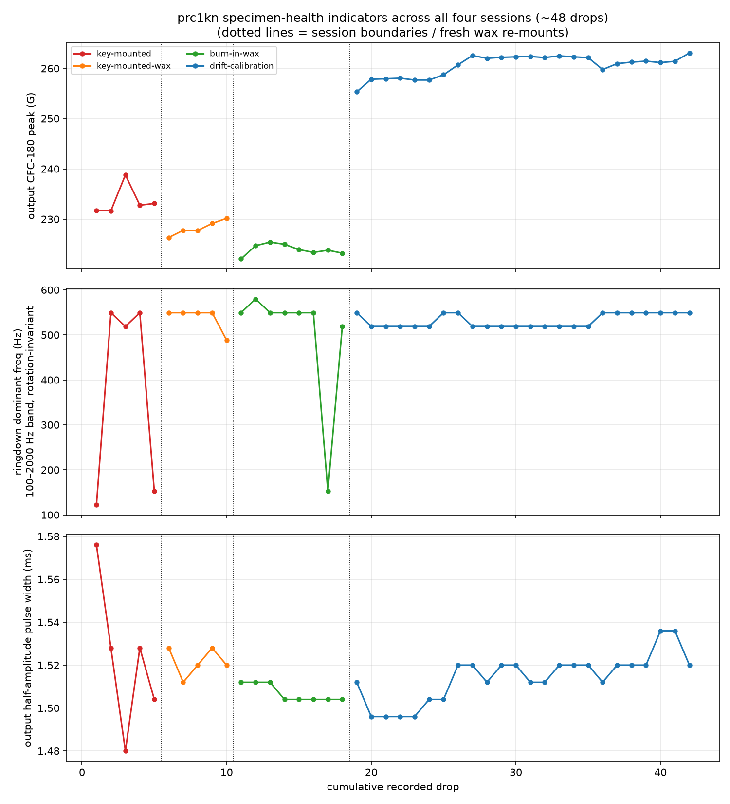

# Specimen / sensor health check — `prc1kn` across all four sessions

Answers @sgbaird's question on
[PR #67](https://github.com/vertical-cloud-lab/tensegrity-optimization/pull/67):
*any damage/differences from the drops that have occurred so far?* Two
readings, both covered: (a) has the dummy specimen `prc1kn` accumulated damage
over its ~48 recorded drops, and (b) has the tri-axis output accelerometer
been damaged by its **two fall-offs** (end of the bare key-mounted run, and
drift-calibration drop 26).

- Script: [`scripts/analysis/drop_test_prc1kn_health_check.py`](../scripts/analysis/drop_test_prc1kn_health_check.py)
- Figures + machine-readable metrics: [`data/drop-tests/prc1kn-health/figures/`](../data/drop-tests/prc1kn-health/figures)

Sessions, in chronological order (all: 13 in drop, bungees removed, CH5 input
wax-mounted on the base plate, CH2–CH4 tri-axis output at the top vertex):

| # | session | drops | output mount | cumulative drops |
|--:|---|--:|---|---|
| 1 | [key-mounted](drop-test-key-mounted-analysis.md) | 5 | key-seat, bare press-fit (sensor fell off at end) | 1–5 |
| 2 | [key-mounted-wax](drop-test-key-mounted-wax-analysis.md) | 5 | key-seat + wax | 6–10 |
| 3 | [burn-in-wax](drop-test-burn-in-wax-analysis.md) | 8 | key-seat + fresh wax | 11–18 |
| 4 | [drift-calibration](drop-test-drift-calibration-analysis.md) | 30 (24 valid output) | key-seat + fresh wax (fell off at drop 26) | 19–48 |

Because the mount was re-waxed between sessions, output *level* and `T` are
mount-confounded across sessions. The specimen-damage indicators used here are
therefore the mount-robust ones:

- **ringdown dominant frequency / spectral centroid** of the tri-axis output
  in the 100–2000 Hz structural band, computed on the *sum of per-axis PSDs* —
  the trace of the spectral matrix, invariant under sensor rotation in the
  seat (which demonstrably happened in the drift-cal run);
- **output half-amplitude pulse width** (a cracked/softening structure
  lengthens the pulse and lowers its resonant frequency, f ∝ √k);
- pre-impact **noise floor** per output axis (a damaged sensor gets noisy).

## Verdict: no detectable specimen damage, no detectable sensor damage

Per-session means (valid output drops only):

| session | n | input (G) | output (G) | T | pulse (ms) | dom. freq (Hz) | centroid (Hz) |
|---|--:|--:|--:|--:|--:|--:|--:|
| key-mounted | 5 | 219.2 | 233.6 | 1.066 | 1.523 | ~519–549* | 665 |
| key-mounted-wax | 5 | 228.5 | 228.2 | 0.999 | 1.522 | 537 | 688 |
| burn-in-wax | 8 | 226.8 | 223.9 | 0.987 | 1.507 | 500* | 732 |
| drift-calibration | 24 | 217.1 | 260.6 | 1.201 | 1.514 | 532 | 760 |

*A few drops bin-hop to a low-frequency lobe (~120–150 Hz) of comparable
power; the structural lobe itself sits at 519–549 Hz in every drop.

1. **Pulse width is flat across all 48 drops** — 1.51 ± 0.02 ms, OLS slope
   +0.003 %/drop (p = 0.79). No pulse lengthening → no softening.
2. **The structural ringdown frequency never moved.** The dominant lobe stays
   at 519–549 Hz (one 30.5 Hz Welch bin) from drop 1 to drop 42. A damaged
   tensegrity (cut tendon, cracked strut — cf. the `m6cyoq`/`T3_0103`
   failures) would shed stiffness and this frequency would fall; it did not.
3. **The spectral centroid drifts *up* across sessions** (665 → 760 Hz,
   +0.42 %/drop, p < 0.001) — the *opposite* direction of damage. Rising HF
   content at constant dominant frequency tracks the mount history (bare
   press-fit → wax → fresh wax → auto-rig), i.e. progressively better HF
   coupling, not the specimen. Notably the last valid drift-cal drop (24)
   has the highest centroid of the series (843 Hz) — extra HF rattle just
   before the drop-25 letting-go anomaly, consistent with the loosening
   sensor, another early-warning signal alongside the per-axis migration.
4. **Sensor survived both fall-offs.** After fall-off #1 the sensor's noise
   floor *improved* (CH2/CH3/CH4 RMS 0.34/0.24/0.22 → 0.18/0.18/0.15 G) and
   it read 228 G at a 228 G input — no sensitivity or zero shift. The
   drift-cal noise floor (0.46/0.31/0.25 G) is slightly higher but still
   < 0.5 G on a ~14,000 G full-scale channel (≈ 0.003 % FS) and plausibly
   auto-rig ambient vibration. Perspective: the sensor takes 5,600–6,500 G
   raw *every measured drop*; a tumble off the vertex onto the plate is small
   by comparison. Post-fall-off-#2 data don't exist yet — worth a 30 s
   tap/shake sanity check on all three axes before the next campaign.
5. **The T level shift (≈ 1.20 in drift-cal vs ≈ 0.99 in the two prior wax
   runs) is a re-mount/rig effect, not damage** — if the specimen had
   changed, the pulse width and ringdown frequency would have moved with it;
   both are unchanged. This reinforces the drift-cal caveat: compare T only
   within a mount session, never across re-waxings.

Physical check from the setup photos (2026-06-29, -30, -07-02): no new
visible strut or tendon damage; the lumpy sections on the orange TPU tendons
are the pre-existing print bubbles that made `prc1kn` a "failed print" in the
first place.

**Implication for the BO campaign:** a fixed dummy specimen is stable over at
least ~50 drops at 13 in — `prc1kn` can keep serving as the rig-calibration
standard, and specimen wear-out will not silently masquerade as rig drift on
these timescales. The mount noise floor (≤ 0.08 %/drop) from the drift-cal
run remains the reference for detecting *real* fatigue in future to-failure
runs.

**Caveats.** n = 1 specimen and it is a failed print — intact prints with
pre-tensioned tendons may accumulate damage differently (tendon creep,
strut-junction fatigue), so re-run this health check on the first intact
specimen that gets a long campaign. Frequency resolution is 30.5 Hz
(80 ms Welch window), so shifts smaller than ~6 % of the 530 Hz mode are not
resolvable. The centroid-vs-mount attribution is inferred from session
boundaries, not an independent measurement.
