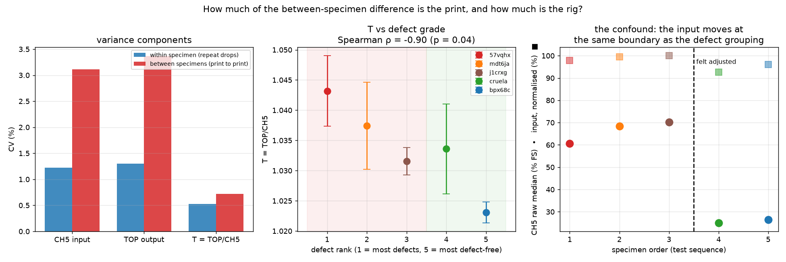
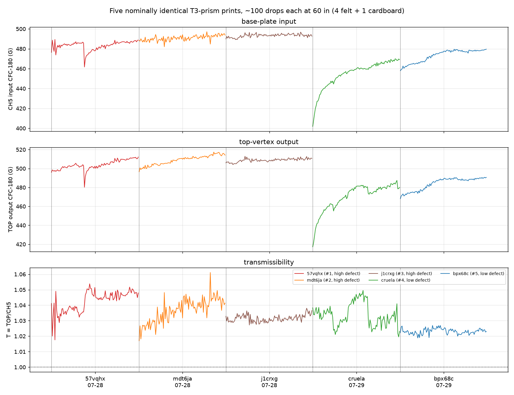
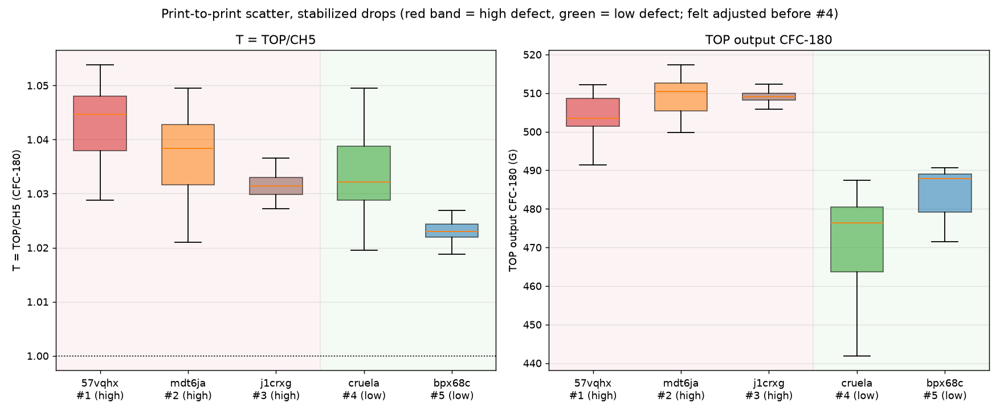

# Print-defect study — five nominally identical T3-prism prints

**Specimens** `57vqhx`, `mdt6ja`, `j1crxg`, `cruela`, `bpx68c` ·
**502 captures** (~100 per specimen) · **60 in** · 4 felt + 1 cardboard ·
2026-07-28 / 07-29 · 4-channel 1.25 MHz / 20 ms exports.

Data posted by @me-madsen on PR #86
([comment 5136111762](https://github.com/vertical-cloud-lab/tensegrity-optimization/pull/86#issuecomment-5136111762),
Box folder `oii429e3znjusbltzg56h5kwbi5cj29n`); defect photos/video on
[PR #35 comment 5110159623](https://github.com/vertical-cloud-lab/tensegrity-optimization/pull/35#issuecomment-5110159623)
and the one below it.
Raw: [`data/drop-tests/print-defects/`](../data/drop-tests/print-defects/) ·
Script: [`scripts/analysis/drop_test_print_defects_analysis.py`](../scripts/analysis/drop_test_print_defects_analysis.py) ·
Metrics: `data/drop-tests/print-defects/figures/print_defects_metrics.json`.

All five specimens come from the same T3-prism model/configuration; the question
is **how much printing defects move the drop-test result**. Specimen IDs are
lower-cased throughout per @me-madsen's request to treat them case-insensitively.

---

## 1. Headline

**Print-to-print scatter in transmissibility is ~0.7 % CV (1.95 % spread across
five copies) — small in absolute terms, but the same size as the between-*design*
differences the 60 in campaign has been reporting.** That is the number that
matters for the BO campaign, and it is the first direct measurement of it.

**On the specific question — do the defects show up? — the honest answer is that
this design cannot tell.** T does fall monotonically from the most-defective to
the least-defective specimen (ρ = −0.90, p = 0.04), but the defect grade is
*identical to the test order*, the felt was adjusted exactly at the defect-group
boundary, and a single specimen's T wanders more within one session (up to
2.34 %) than the five specimens differ from each other (1.95 %). Any of those
three explanations reproduces the observed ranking.

## 2. Campaign health — all five clean

| # | specimen | defects | date | captures | cadence | impact at | CH5 raw median %FS | worst TOP axis |
|--:|---|---|---|--:|--:|--:|--:|--:|
| 1 | `57vqhx` | high | 07-28 | 101 | 40 s | 0.59 ± 0.01 ms | 60.7 % | 27.4 % |
| 2 | `mdt6ja` | high | 07-28 | 100 | 39 s | 0.58 ± 0.01 ms | 68.3 % | 31.0 % |
| 3 | `j1crxg` | high | 07-28 | 100 | 40 s | 0.58 ± 0.00 ms | 70.3 % | 29.7 % |
| 4 | `cruela` | low | 07-29 | 101 | 47 s | 0.70 ± 0.03 ms | 25.0 % | 22.9 % |
| 5 | `bpx68c` | low | 07-29 | 100 | 41 s | 0.65 ± 0.01 ms | 26.4 % | 21.5 % |

502/502 captures are real drops, no spurious triggers, no channel over full
scale. The 07-28 sessions ran the base sensor at 61–70 % of full scale —
above the FS/3 head-room target and the third-highest loading recorded in the
program, consistent with
[`drop-test-compaction-analysis.md`](drop-test-compaction-analysis.md).

## 3. Per-specimen results (stabilized drops, burn-in 5)

| specimen | CH5 input | CV | TOP output | CV | **T = TOP/CH5** | CV |
|---|--:|--:|--:|--:|--:|--:|
| `57vqhx` (#1) | 483.3 G | 0.93 % | 504.1 G | 1.00 % | **1.0432** | 0.56 % |
| `mdt6ja` (#2) | 491.0 G | 0.54 % | 509.4 G | 0.89 % | **1.0374** | 0.69 % |
| `j1crxg` (#3) | 493.4 G | 0.32 % | 509.0 G | 0.34 % | **1.0315** | 0.22 % |
| `cruela` (#4) | 456.7 G | 2.28 % | 472.1 G | 2.34 % | **1.0336** | 0.72 % |
| `bpx68c` (#5) | 473.7 G | 1.19 % | 484.7 G | 1.24 % | **1.0231** | 0.17 % |

ANOVA on T: F = 176.8, p = 2.0e-92 — the specimens are statistically distinct.
All ten pairwise Welch comparisons are significant at the drop level. That
significance is not the interesting part; the *size* is:

| metric | within-specimen CV | between-specimen CV | ratio | ICC | spread |
|---|--:|--:|--:|--:|--:|
| CH5 input | 1.22 % | 3.11 % | 2.6× | 0.87 | 7.65 % |
| TOP output | 1.30 % | 3.37 % | 2.6× | 0.87 | 7.52 % |
| **T = TOP/CH5** | **0.53 %** | **0.72 %** | **1.4×** | 0.65 | **1.95 %** |

The input and output channels spread 7.5–7.7 % across specimens, but T spreads
only 1.95 % — the bulk of the raw-channel spread is the rig (§5), and T removes
it. **Use T, not the raw output peak, for anything cross-specimen.**

## 4. Does the defect grade explain the differences? Three rival explanations

T does rank with defect grade: 1.0432 → 1.0374 → 1.0315 → 1.0336 → 1.0231,
Spearman ρ = −0.90 (p = 0.04) — more defects, higher transmissibility, which is
the physically plausible direction. But:

**(a) Defect grade *is* the test order.** Specimens were graded 1–5 in exactly
the sequence they were tested, so any progressive rig or operator effect
produces ρ = −0.90 identically. The discriminating evidence is that T declines
monotonically **within each day** as well — 07-28: 1.0432 → 1.0374 → 1.0315;
07-29: 1.0336 → 1.0231 — i.e. across a stack reset *and* across the defect-group
boundary. A sequence effect fits the data at least as well as the defect grade.

**(b) The felt was adjusted at the group boundary.** @me-madsen notes the felt
was moved/adjusted for specimens 4 and 5 — which are also the low-defect
specimens, and also a different day. The input confirms a large change:

| | specimens 1–3 (high defect) | specimens 4–5 (low defect) | Δ |
|---|--:|--:|--:|
| CH5 CFC-180 input | 489.2 G | 465.2 G | −4.9 % (p = 3.7e-72) |
| CH5 raw \|peak\| | 6,193 G | 2,471 G | **−60.1 %** |

So the −5.7 % output-peak difference between the defect groups is essentially
the −4.9 % input difference. The T difference (−0.87 %) survives that, but the
input change is large enough that a frequency-dependent effect on T cannot be
excluded. `cruela`'s +0.077 %/drop input ramp (R² = 0.88) is the freshly
adjusted stack re-compacting, visible as the sharp restart at drop 1:

**(c) Mount re-seating between specimens.** Each specimen requires re-seating
the top-vertex accelerometer. The excursion analysis makes this the strongest
rival: within a *single* session, with the mount untouched, the 5-drop rolling
mean of T moves by

| specimen | T range within the session | as % of session mean |
|---|---|--:|
| `57vqhx` | 1.0322 → 1.0511 | 1.82 % |
| `mdt6ja` | 1.0263 → 1.0481 | 2.10 % |
| `j1crxg` | 1.0289 → 1.0362 | 0.71 % |
| `cruela` | 1.0232 → 1.0474 | **2.34 %** |
| `bpx68c` | 1.0206 → 1.0261 | 0.54 % |

**The worst within-session excursion (2.34 %) exceeds the entire
between-specimen spread (1.95 %).** These are step-like, not smooth — visible as
plateau shifts in the bottom panel of the full-series figure, e.g. `57vqhx`
around drop 25 — which is the signature of a mount/coupling re-seat rather than
of the specimen changing. Prior work put session-to-session coupling shifts at
up to 3.7 % ([`drop-test-500drops-nobot-analysis.md`](drop-test-500drops-nobot-analysis.md)).

At the honest unit of replication — the specimen, n = 3 vs 2 — the
high-vs-low-defect contrast is not significant for either T (p = 0.29) or the
output peak (p = 0.12). The drop-level p-values (1.7e-32, 1.9e-95) are
pseudo-replication and should not be quoted as evidence about prints.

## 5. What this means for the BO campaign

This is the number the sample-size analysis flagged as missing
([`drop-test-sample-size-analysis.md`](drop-test-sample-size-analysis.md):
"print-to-print reproducibility of the same geometry isn't characterized yet").
It now is:

- **Print-to-print CV in T ≈ 0.72 %** (five copies of one geometry, ~95 drops
  each), spread 1.95 % worst-to-best.
- Repeat drops on one article are only **1.4× tighter** than that, so adding
  drops past the existing 5-recorded SOP buys almost nothing for a
  *between-design* comparison — **replicate prints** are what buy precision.

Replicate prints per geometry for 80 % power at α = 0.05, from CV_between = 0.72 %:

| difference in T to resolve | replicate prints |
|--:|--:|
| 1 % | 9 |
| 2 % | 3 |
| 3 % | 1 |
| ≥5 % | 1 |

**Against the between-design differences measured so far:**

| comparison | T spread | verdict |
|---|--:|---|
| 60 in campaign — `prc1kn` / `9GMQYQ` / `7xadt6` | 2.3 % | ⚠️ barely above the 1.95 % print-to-print spread — **needs ~3 prints per geometry** |
| 13 in input-output — `yqpmx1` … `n0jdwk` | 24 % | ✅ far above; safe with n = 1 print |

That is the actionable consequence: the three-structure ranking in
[`drop-test-prc1kn-60in-5felts-analysis.md`](drop-test-prc1kn-60in-5felts-analysis.md)
spans 2.3 %, and five copies of a *single* geometry span 1.95 % here. Those
rankings should be treated as provisional until they are repeated on replicate
prints — the statistical significance in that writeup came from ~95 drops on one
article each, which measures the article, not the design.

## 6. Recommendations

1. **Print ≥3 replicates per geometry** before treating a <5 % T difference as a
   design result. For ≥10 % differences a single print is fine.
2. **Randomize specimen order** within a session block, and re-grade defects
   *blind to test order* — this study's ρ = −0.90 is uninterpretable precisely
   because grade and order coincide.
3. **Do not adjust the absorber stack mid-study.** If it must be adjusted, drop
   a reference specimen immediately before and after so the change is measurable.
4. **Re-drop a reference specimen at the start and end of every session** to
   bound the mount-seating excursion — §4(c) shows it is currently the single
   largest uncertainty in cross-specimen T, larger than the print-to-print
   scatter it is competing with.
5. **A cleaner defect experiment** is available cheaply: re-test 2–3 of these
   same five specimens in *reverse* order in one session on one stack state. If
   the ranking holds, it is the prints; if it re-orders with sequence, it is the
   rig. That is ~15 min of drops per specimen.
6. The 07-28 sessions ran CH5 at 61–70 % FS; the PU replacement
   ([`drop-test-pu-configs-analysis.md`](drop-test-pu-configs-analysis.md))
   removes that exposure entirely and should be in place before the next
   long campaign.

## 7. Slow-motion video

The upload includes 14 slow-motion clips (~548 MB each, ~7.4 GB total) with XML
sidecars, which are committed under
[`data/drop-tests/print-defects/video/`](../data/drop-tests/print-defects/video/).
Every sidecar states `captureFps="959.04p"`, so the time base is exact and needs
no pulldown detective work — the same as the `prc1kn` clips
([`drop-test-prc1kn-video-analysis.md`](drop-test-prc1kn-video-analysis.md)).

Two notes on the set: the file `57cqhx 3.MP4` is a typo for `57vqhx 3`, and
`57vqhx 1.XML` has no matching MP4, so specimen 1 has 2 clips rather than 3.
Frame-by-frame kinematics were **not run in this pass** — the video bulk is
~7.4 GB against a marginal expected return, since the previous two video passes
established the rig physics (1–2 ms contact, brake catch, elastic recovery) and
confirmed 960 fps cannot resolve peak compression inside the pulse. It is worth
doing for a specific question — e.g. whether the defective specimens visibly
deform differently — and that is a targeted re-run of the existing
`drop_test_prc1kn_video_analysis.py` on 2–3 named clips.

## 8. Caveats

- **Defect grade is fully confounded with test order, session day and stack
  state.** No amount of analysis fixes that; §6.5 is the fix.
- **n = 1 physical article per defect grade**, so the defect effect is estimated
  from 5 specimens total — the specimen-level contrast (3 vs 2) has almost no
  power.
- **Defect grading is qualitative** (@me-madsen's visual assessment from the
  PR #35 photos/video), not a measured defect metric; a quantitative proxy
  (mass, strut straightness, tendon tension) would make the regression meaningful.
- **Mount re-seating is not separable from the print** in this design; the
  between-specimen CV of 0.72 % is therefore an **upper bound** on true
  print-to-print scatter, and the real figure could be considerably smaller.
- 20 ms window only, so no ringdown beyond ~18 ms; the pulse onset is truncated
  by the trigger, making Δv a captured Δv (6.3–6.5 m/s vs 5.47 m/s free fall
  from 60 in, the excess being rebound).
- Tri-axis orientation at the top vertex is assumed, not verified.
