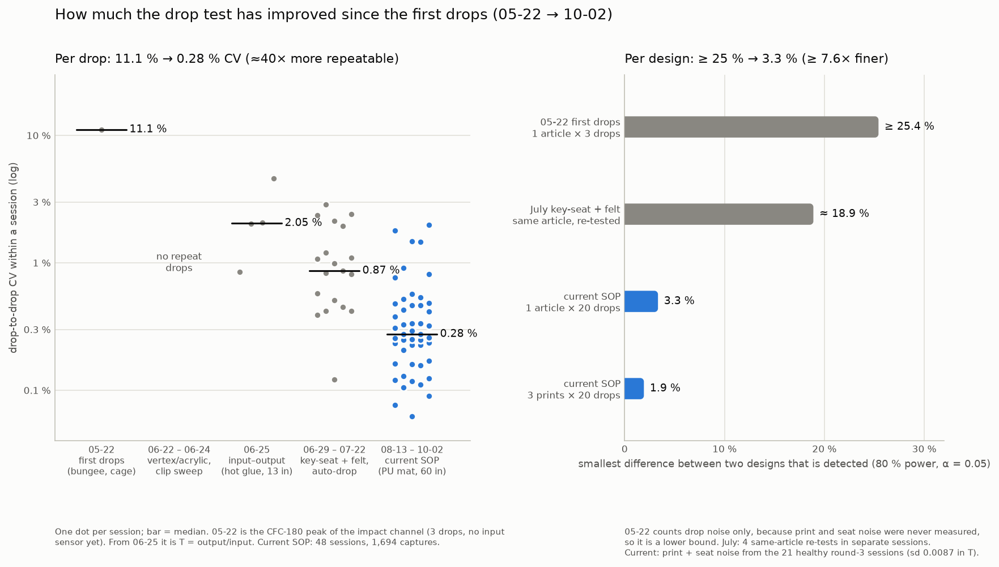

# How much the drop test has improved since the first drops

Answers @ctrhjk on PR #86 (10-10): *"Compared to the very first drop test
and process, how much has this test process enhanced? Can you give a number
for that?"*

This is a derived analysis with no raw data of its own. The first-drop
numbers are recomputed from the committed raw exports. Every later number is
read from metrics that the per-dataset analyses already committed.

- **Script:** [`scripts/analysis/drop_test_process_improvement_analysis.py`](../scripts/analysis/drop_test_process_improvement_analysis.py)
- **Outputs:** [`data/drop-tests/process-improvement/figures/`](../data/drop-tests/process-improvement/figures/)
  (`01_process_improvement.png`, `process_improvement_metrics.json`)

## 1. Short answer

**One number: at least 7.6×.** The test now detects a difference between two
designs about 7.6× smaller than the first drops could. That difference went
from at least 25 % to 3.3 % with one article per design, and to 1.9 % with
three prints per design (at least 13×). This is the number to quote, because
ranking designs is the test's job, and it counts every source of scatter
between two designs' measurements: drops, prints, mount seats and sessions.

Two supporting numbers:

- **About 40× more repeatable per drop.** The drop-to-drop CV of the objective
  fell from 11.1 % (05-22) to a median of 0.28 % (48 sessions, 08-13 → 10-02).
- **Every capture is now usable.** All 1,694 of 1,694 captures in the current
  campaign were valid. On 05-22, at most 3 of the 4 specimen drops were. The
  PETG drop lifted off and hit plate-on-plate, at 98.9 % of the no-specimen
  control's raw peak.

The two factors differ for a reason. Most of the per-drop gain can no longer
be spent, because drop scatter (0.28 %) is no longer the limiting noise. The
limit is now article-to-article and seat-to-seat scatter (0.84 %). The
instrument has stopped being the bottleneck. The printed articles, and how
they sit in the mount, are the bottleneck now.



## 2. Scorecard: first drops vs the current SOP

First drops: `Signal 10–14`, 05-22, bungee-assisted carriage, specimen
caged under a top plate. Current SOP: 48 BO-campaign sessions, 08-13 → 10-02
(SOBOL + S0, r2d2, round 3 printed three times, round 4).

| | First drops (05-22) | Current SOP | Change |
|---|---|---|---|
| Usable specimen drops | at most 3 of 4 (PETG lift-off) | 1,694 of 1,694 captures | 75 % → 100 % |
| Objective | peak g on one channel, judged against a separate no-specimen control (n = 1) | T = output / input, with both measured on every drop | input now measured on every drop |
| Drop-to-drop CV of the objective | 11.1 % (3 drops) | 0.28 % (median of 48 sessions) | **≈ 40×** |
| Same raw quantity (CFC-180 output peak) | 11.1 % | 0.92 % | ≈ 12× |
| Impact pulse width, CV | 78 % (2.2–10.8 ms) | 0.60 % | ≈ 130× |
| Where the impact lands in the record | anywhere from 25 to 50 ms (trigger tied to a release artifact on CH4) | 2.9–3.3 ms, within-session sd 0.02 ms (triggered on the impact) | locked to the impact |
| Drops per specimen | 3 (audrey), 1 (PETG) | 20 per session; 101 in the SOBOL batch | 7–34× |
| Same article, re-tested in a new session | never done | −0.14 % (`6lhxfy`), −0.57 % (`amdjwm`) | ≈ 16× vs July (see §4) |
| Print + seat noise, same design | never measured | sd 0.84 % (21 healthy round-3 sessions) | newly measured |
| Noise on one design's measured value (1σ) | at least 6.4 % | 0.84 % (1 article), 0.49 % (3 prints) | **≥ 7.6×**, ≥ 13× |
| Smallest detectable design difference | at least 25 % | 3.3 % (1 article), 1.9 % (3 prints) | **≥ 7.6×**, ≥ 13× |
| Bad-measurement detection | none; the PETG lift-off showed up only afterwards, against the control | automatic: T-drift watch, seat gauge, Δv rig-health verdict | see below |
| Sampling | 125 kHz, 200 ms | 1.25 MHz, 100 ms, 2 ms pre-trigger | 10× sample rate |
| Rig health | unknown (bungee-assisted) | Δv on every drop: 5.0–5.5 m/s (free fall from 60 in: 5.47 m/s) | measured |
| Validation | none | blind arrangement × specimen key 18/18 correct (08-04/05); screened round-3 design means track the frozen BO predictions at ρ = 0.75, RMS 0.020 | — |

On bad-measurement detection: gross artifacts still happen, in about 1
session in 14 (`drran7`, `dran35`). The screen catches them. In round 3 it
flagged all 5 sessions that sat 3.7 % or more from their design's
three-print median. The 21 sessions it passed sat a median 0.13 % from that
median, with a maximum of 2.2 %. That one is `drran5`, whose design median
is pulled up by the flagged `dran35`.

The first process would need about **170 drops per specimen** to match
today's single-article precision. That assumes perfect prints and no
lift-off. Today it takes 20.

## 3. How the headline number is computed

"Design resolution" is the minimum detectable difference (MDD) between two
designs, each measured on one article, at 80 % power and α = 0.05
(two-sided):

```
MDD = (z_0.975 + z_0.80) · √2 · σ_design ≈ 3.96 · σ_design
σ_design² = σ_article² + σ_drop² / n_drops
```

- **First drops:** σ_drop = 11.1 % (the three audrey CFC-180 peaks: 370,
  424 and 463 G), with n = 3. σ_article was never measured, so it is set to
  0. That gives σ_design ≥ 6.4 % and MDD ≥ 25.4 %. **This is a lower bound,**
  so the improvement factor is a lower bound too.
- **Current SOP:** σ_drop = 0.28 % (median within-session T CV), with
  n = 18 (a 20-drop session after the 2-drop warm-up discard).
  σ_article = 0.0087 in T, which is 0.84 % of the screened mean T (1.035).
  It is the residual sd of the design + print-offset fit over the 21 healthy
  round-3 sessions (three prints of nine designs; `dran3-checkin`,
  "Three-print comparison"). This gives σ_design = 0.84 % and MDD = 3.3 %.
  With three prints, σ_design = 0.49 % and MDD = 1.9 %.
- The current value assumes the health screen is applied, and that flagged
  sessions are re-seated and re-run as `CLAUDE.md` requires. Without the
  screen, the all-27-session residual sd is 0.054. That number is dominated
  by the two gross artifacts.

## 4. What the history shows

| Era | Dates | Setup | Sessions with repeats | Median drop-to-drop CV | Usable drops |
|---|---|---|--:|--:|---|
| 0 | 05-22 | bungee-assisted, specimen caged under a top plate | 1 | 11.1 % (output peak) | ≤ 3 / 4 |
| 1 | 06-22 – 06-24 | vertex vs acrylic plate; clip-height sweep | 0 | n/a (one drop per configuration) | 5 / 16 |
| 2 | 06-25 | bungees off; CH5 input + vertex tri-axis on hot glue, 13 in | 4 | 2.05 % (T) | 20 / 20 |
| 3 | 06-29 – 07-22 | key-seat (+ wax) mount, auto-drop, felt + cardboard stack, 5–60 in | 19 | 0.87 % (T) | (not tallied) |
| 4 | 08-13 – 10-02 | current SOP: 1/2 in PU mat, 60 in, 1.25 MHz / 100 ms / 2 ms pre-trigger, 150 G | 48 | 0.28 % (T) | 1,694 / 1,694 |

Era 1 is where @ctrhjk's own testing started. It was the low point for usable
captures: only 5 of 16 drops gave a clean impact, and the clip-height sweep
triggered 0 times in 8 drops. The input–output design that followed on 06-25
fixed that outright, at 20 of 20.

**July is the warning about quoting per-drop repeatability alone.** By July
the per-drop CV was already 0.87 %, but the same article re-tested in a new
session moved by +6.2 %, +3.8 %, −11.3 % and +1.5 % (CH5 tape re-coupling and
mount re-seats). That puts σ at about 4.8 % per session, and design resolution
at about 19 %, which is barely better than the first drops. The design-level
step came with the current SOP. The same re-test now moves by 0.14 % and
0.57 %, about 16× better than July. Even across different prints of the same
design, the sd is only 0.84 %.

## 5. What made the difference

| When | Change | Effect |
|---|---|---|
| 06-25 | Bungees off, input sensor on the base plate (@ctrhjk's input–output design) | Lift-off gone; T measurable; 20 of 20 drops trigger |
| 06-29 | Key-seat mount, then wax, replaces hot glue | Removes the hot-glue drift in T |
| 07-01 → | Automatic dropping | 30–500 drops per session at 12–42 s per drop |
| 08-04 | 100 ms / 1.25 MHz / 2 ms pre-trigger capture at a fixed 150 G trigger | Clean pre-impact window; hop and ringdown in the record; blind key 18/18 |
| 08-06 | 1/2 in PU mat replaces felt + cardboard | No compaction treadmill; CH5 headroom goes from a 91 % FS worst case to ≤ 4.2 % |
| 08-10 | Guide rods cleaned and greased after the 08-05 drop-pin break | Δv back in the healthy band by campaign week; Δv tracked as a rig-health gauge |
| 08-21 | Record-tail baseline | Removes a specimen-dependent bias of up to ~5 % in T from the pre-trigger contact foot |
| 08-24 → 10-02 | T-drift watch, seat gauge, replicate prints | Bad sessions flagged automatically; print + seat noise measured (0.84 %) |

## 6. Caveats

- **The baseline is three drops.** The 95 % confidence interval on the
  05-22 CV is 5.8–69.8 %. The per-drop factor is about 40×, with a range of
  21–253×. The design factor is at least 7.6×, with a range of 4–48× from the
  CV alone. Read both as order-of-magnitude.
- **Different metrics.** 05-22 had no input sensor, so its objective is a
  single output peak, while the current objective is T. On the same raw
  quantity (CFC-180 output peak) the per-drop gain is about 12×. The rest
  comes from T cancelling input and rig variation. That cancellation is a
  real part of the process change, but it isn't apples-to-apples.
- **Not a controlled experiment.** The specimens, drop heights and fixtures
  all differ between eras. This scorecard compares the processes as run.
- **Era 3 usable-drop rate is not tallied.** Nearly every drop triggered.
  The losses were runs where T couldn't be computed: the CH5 fall-off in
  `30drops-real`, and the 302 07-23/07-27 captures exported CH5-only. Some
  era-3 runs also had their own problems, for example the TP4 overload stop
  in `500drops`.
- **The current design resolution rests on one round.** It uses the round-3
  three-print fit (21 sessions, 10 dof). Comparisons across print batches
  carry an extra batch offset of up to about 0.8 % (print 2 vs print 1).

## 7. Reproduce

```bash
pip install numpy scipy matplotlib
python scripts/analysis/drop_test_process_improvement_analysis.py
```

The first-drop numbers are recomputed from `data/drop-tests/raw/` with the
`drop_test_analysis.py` helpers. The input–output numbers are recomputed from
`data/drop-tests/input-output/raw/` with the
`drop_test_input_output_analysis.py` helpers. Everything else comes from
committed `*_metrics.json` files. The source list is in the script docstring.
