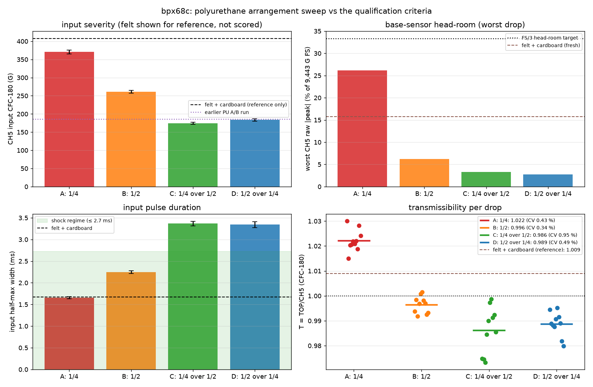
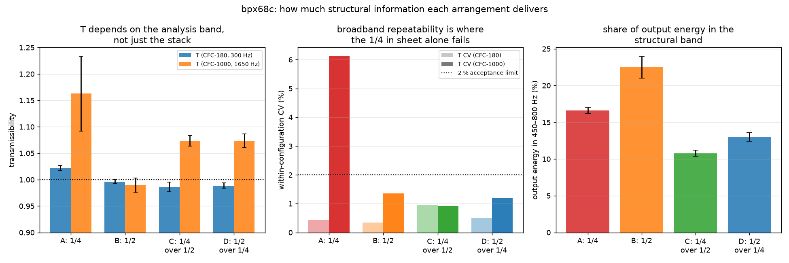
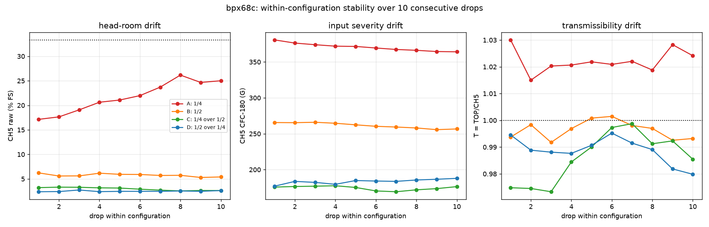

# Polyurethane sheet-configuration sweep — picking the transmissibility operating point

**Specimen** `bpx68c` · **Session** `bpx68c - Polyurethane Rubber - Further Tests`,
2026-07-30 13:08–15:10 · **40 drops** (4 arrangements × 10) · **60 in** ·
4-channel 1.25 MHz / 20 ms exports.

Data posted by @me-madsen on PR #86
([comment 5136470475](https://github.com/vertical-cloud-lab/tensegrity-optimization/pull/86#issuecomment-5136470475),
Box folder `4n678tlpnlk7q50dfi1rh1lkt7p6lx0y`).
Raw: [`data/drop-tests/pu-configs/`](../data/drop-tests/pu-configs/) ·
Script: [`scripts/analysis/drop_test_pu_configs_analysis.py`](../scripts/analysis/drop_test_pu_configs_analysis.py) ·
Metrics: `data/drop-tests/pu-configs/figures/pu_configs_metrics.json`.

This is the "stiffen the operating point" mini-sweep called for by
[`drop-test-pu-vs-felt-analysis.md`](drop-test-pu-vs-felt-analysis.md) §next-steps
and the qualification protocol in
[`drop-test-absorber-alternatives.md`](drop-test-absorber-alternatives.md) §4.1.

---

## 1. Headline

**Run transmissibility on the 1/2 in sheet alone (arrangement B), with the
trigger lowered to ~150 G.** It is the arrangement that measures the specimen
best: T is the most repeatable of the four under *both* analysis bands
(CV 0.34 % at CFC-180, 1.36 % at CFC-1000), it puts the largest share of the
output energy into the specimens' 450–800 Hz structural band (22.5 %), it stays
in the shock regime for that mode, and it needs no compaction management.

> **Revision note.** An earlier version of this document recommended
> arrangement A (1/4 in alone), and the single biggest reason given was that A
> reproduces the felt+cardboard shock (371 G / 1.66 ms vs 408 G / 1.67 ms), so
> the PU-era numbers would be continuous with the felt-era catalogue. Per
> @sgbaird ([PR #86](https://github.com/vertical-cloud-lab/tensegrity-optimization/pull/86#issuecomment-5137508024)),
> **no felt-era measurement feeds any downstream optimization task and
> everything relevant is being re-measured**, so continuity is worth nothing and
> has been removed from the criteria. §3 re-derives the choice on measurement
> quality alone and it comes out differently — see §3.1 for what specifically
> changed. The measurements themselves are unchanged.

The second headline is unaffected: the **bimodal-input problem from the paired
A/B test is gone**: input CV is 1.4–1.8 % in all four arrangements here, against
25.7 % in the 5-drop A/B run. §5 shows why.

## 2. The four arrangements

| | arrangement | signals | trigger | CH5 raw | worst %FS | input CFC-180 | CV | width | TOP output | CV | **T (CFC-180)** | CV | **T (CFC-1000)** | CV | struct. band | criteria |
|---|---|---|--:|--:|--:|--:|--:|--:|--:|--:|--:|--:|--:|--:|--:|--:|
| A | 1/4 in alone | 1–10 | 300 G | 2,050 G | 26.2 % | 370.6 G | 1.45 % | **1.66 ms** | 378.8 G | 1.51 % | 1.022 | 0.43 % | 1.163 | **6.12 %** | 16.6 % | 7/8 |
| **B** | **1/2 in alone** | 11–20 | 300 G | 543 G | 6.2 % | 261.4 G | 1.45 % | 2.25 ms | 260.5 G | 1.59 % | **0.996** | **0.34 %** | **0.990** | **1.36 %** | **22.5 %** | **7/8** |
| C | 1/4 over 1/2 | 22–31 | 150 G | 279 G | 3.3 % | 174.3 G | 1.68 % | 3.37 ms | 171.9 G | 1.06 % | 0.986 | 0.95 % | 1.074 | 0.93 % | 10.8 % | 6/8 |
| D | 1/2 over 1/4 | 32–41 | 150 G | 236 G | 2.7 % | 183.5 G | 1.76 % | 3.35 ms | 181.4 G | 1.52 % | 0.989 | 0.49 % | 1.074 | 1.19 % | 13.0 % | 6/8 |
| — | *4 felt + 1 cardboard (07-30 a.m.)* | | | *1,491 G* | *15.8 %* | *407.6 G* | *2.8 %* | *1.67 ms* | *411.3 G* | *3.2 %* | *1.009* | *0.44 %* | — | — | — | |

The felt row is **descriptive only** — it is not an acceptance target (§1
revision note). "struct. band" is the share of raw top-vertex output energy
landing in 450–800 Hz, where the specimens' first mode sits. Trigger margins
are in §3.2, where they matter.

Signal 21 (13:26, between B and C) is a stray capture and is excluded per
@me-madsen's instruction; every other event maps cleanly onto the four
10-drop blocks by timestamp (A 13:08–13:15, B 13:18–13:24, C 14:42–15:01,
D 15:03–15:10).

## 3. Why B wins

Scored against the acceptance criteria in
[`drop-test-absorber-alternatives.md`](drop-test-absorber-alternatives.md) §4.1,
with the felt-referenced criterion dropped and two measurement-quality criteria
added in its place (§3.1):

| criterion | A (1/4) | B (1/2) | C (1/4 over 1/2) | D (1/2 over 1/4) |
|---|:--:|:--:|:--:|:--:|
| CH5 raw ≤ FS/3 = 3,148 G | ✅ 2,470 | ✅ 588 | ✅ 313 | ✅ 259 |
| TOP CFC-180 ≥ 136 G (1 % of tri-axis FS) | ✅ 379 | ✅ 260 | ✅ 172 | ✅ 181 |
| shock regime: width ≤ 2.7 ms (f·τ ≤ 1.5 at 550 Hz) | ✅ 1.66 | ✅ 2.25 | ❌ 3.37 | ❌ 3.35 |
| TOP CFC-180 CV ≤ 2 % | ✅ 1.5 | ✅ 1.6 | ✅ 1.1 | ✅ 1.5 |
| T (CFC-180) CV ≤ 2 % | ✅ 0.43 | ✅ 0.34 | ✅ 0.95 | ✅ 0.49 |
| **T (CFC-1000) CV ≤ 2 %** | ❌ **6.12** | ✅ **1.36** | ✅ 0.93 | ✅ 1.19 |
| raw peak ≥ 2× trigger level *(as run)* | ✅ 5.4× | ❌ 1.7× | ❌ 1.6× | ❌ 1.5× |
| \|input drift\| ≤ 0.5 %/drop | ✅ −0.47 | ✅ −0.48 | ✅ −0.24 | ✅ +0.48 |

A and B both score 7/8, but **their single failures are not equally fixable**:

- **B's failure is a menu setting.** Its margin is 1.7× only because the trigger
  was left at 300 G for that block. B's *minimum* raw peak was 500 G, so at the
  150 G trigger already used for C and D it has **3.3× margin** and passes. All
  10 B drops fired as run.
- **A's failure is physical.** Its broadband transmissibility scatters at
  CV 6.12 % — 4.5× worse than B and 4.5× over the limit — and no setting
  changes that. §3.2 explains why.

### 3.1 What changed when the felt criterion was removed

Two of the seven original criteria were anchored to the felt stack, and both
favoured A by construction:

- *"input CFC-180 within ±20 % of the felt era (326–489 G)"* — **deleted.** It
  scored arrangements on resemblance to a stack being retired, and it was the
  only criterion B, C and D failed on severity grounds. Replaced by a criterion
  that is about measurability rather than resemblance: the output peak must sit
  well clear of the tri-axis noise floor (≥ 1 % of its full scale, 136 G). All
  four arrangements pass it — the PU stacks are not remotely signal-starved,
  which is the fact the felt-referenced criterion was obscuring.
- *"input pulse width 1–2.5 ms"* — **kept but re-derived.** The 1–2.5 ms band
  was chosen to bracket felt's 1.67 ms. The replacement is anchored on the
  specimens instead: their first mode sits at **519–549 Hz** across this repo's
  ringdown analyses ([`prc1kn-health-check`](drop-test-prc1kn-health-check.md),
  [`100drops`](drop-test-100drops-analysis.md)), and an SDOF at 550 Hz driven by
  a half-sine of duration τ stays near its maximax plateau while f·τ ≲ 1.5,
  decaying toward unit (quasi-static) gain beyond it. That gives τ ≤ 2.7 ms.
  The pass/fail pattern is unchanged (A, B pass; C, D fail) but it now rests on
  the specimens rather than on the old absorber.

And one criterion was **added**: T computed under CFC-1000 must be as repeatable
as T under CFC-180. This is the criterion that separates A from B, and it did
not exist before because the felt criterion had already picked a winner.

### 3.2 The filter band matters as much as the stack

The go-forward objective `T` is a ratio of **CFC-180** peaks. SAE J211's CFC-180
is 3 dB down at 300 Hz, so at the specimens' 550 Hz mode it attenuates by
roughly **12×**. In other words *the metric currently in use removes most of the
structural response it is meant to be sensitive to* — which is a large part of
why every specimen ever measured sits within a few percent of T = 1.

Recomputing the same 40 drops under CFC-1000 (3 dB at 1,650 Hz, which keeps the
structural band) is therefore a direct test of whether an arrangement can carry
the FRF / SRS-band metrics the Edison synthesis recommends as the maturation
path:

| | T (CFC-180) | CV | T (CFC-1000) | CV | output energy in 450–800 Hz |
|---|--:|--:|--:|--:|--:|
| A (1/4) | 1.022 | 0.43 % | 1.163 | **6.12 %** | 16.6 % |
| **B (1/2)** | 0.996 | 0.34 % | **0.990** | **1.36 %** | **22.5 %** |
| C (1/4 over 1/2) | 0.986 | 0.95 % | 1.074 | 0.93 % | 10.8 % |
| D (1/2 over 1/4) | 0.989 | 0.49 % | 1.074 | 1.19 % | 13.0 % |

A's problem is its own hardness. The harder hit generates a large, **variable**
high-frequency contact spike — its raw CH5 peak has CV 14.5 % and climbs
4.6 %/drop (§6) while its filtered input holds at CV 1.45 %. CFC-180 discards
that spike, so A looks pristine; CFC-1000 admits part of it into *both* channels
and A's T falls apart. B, hitting through twice the rubber, has a raw CV of
4.4 % and stays repeatable in both bands.

This also **corrects a claim in the earlier version of this document**, which
argued that A "is the only arrangement still exciting the structure in a band
where its geometry matters", citing A's 2,370 Hz output spectral centroid
against 626–815 Hz for C/D. That inference does not hold: the centroid cannot
distinguish structural ringing from broadband contact-spike content, and
measuring the structural band directly reverses the ordering — **B puts the
largest share of output energy (22.5 %) into 450–800 Hz**, A only 16.6 %. A's
high centroid was the contact spike, not the specimen.

### 3.3 What A is still better at

- **Trigger margin at a high trigger level** (5.4× at 300 G, 10.8× at 150 G).
  Real, but B's 3.3× at 150 G already clears the 2× bar, and the clip-height
  era's 0/8 no-trigger failures were a load-path problem, not a marginal-level
  one ([`clip-height`](drop-test-clip-height-analysis.md)).
- **Larger absolute signal** (379 G output vs 260 G). Both are far above the
  136 G noise-floor criterion, so this buys nothing measurable.
- **Less bedding-in risk?** No — the reverse. A is the only arrangement with a
  significant raw-peak trend (§6).

The cost of A is also head-room: it is the only arrangement whose raw peak is
non-trivial (17 → 26 % FS), versus 2.7–6.2 % for the others. Still inside the
FS/3 target, and far from the worn felt stack's **91 % FS** on 07-22 — but it is
the one PU arrangement that keeps any exposure to that failure mode at all.

## 4. T is stack-dependent — as expected

Pairwise Welch on transmissibility (10 drops each):

| comparison | T | Δ | p | d |
|---|---|--:|--:|--:|
| A → B | 1.022 → 0.996 | −2.5 % | 4.5e-11 | −6.6 |
| A → C | 1.022 → 0.986 | −3.5 % | 7.3e-08 | −4.9 |
| A → D | 1.022 → 0.989 | −3.3 % | 4.8e-12 | −7.2 |
| B → C | 0.996 → 0.986 | −1.0 % | 7.9e-03 | −1.4 |
| B → D | 0.996 → 0.989 | −0.8 % | 9.1e-04 | −1.8 |
| **C → D** | **0.986 → 0.989** | **+0.3 %** | **0.47** | **+0.33** |

The CFC-180 T falls monotonically as the pulse lengthens. This is the same
effect flagged in
[`drop-test-pu-vs-felt-analysis.md`](drop-test-pu-vs-felt-analysis.md) §2, now
resolved across four stiffnesses on one specimen. **The practical consequence is
unchanged: T values are not comparable across absorber configurations** — which
matters much less now that the felt-era catalogue is not being carried forward,
but still means the PU-era numbers must all come from one arrangement.

Note that the ordering is **not** stable across analysis bands: under CFC-1000
the same 40 drops give A 1.163, B 0.990, C 1.074, D 1.074 (§3.2) — B and the
two-sheet stacks swap places. So "which arrangement gives the lowest T" is not a
well-posed question; what is well-posed is which arrangement measures *any*
chosen T definition most repeatably, and that is B.

The earlier reading of this table — that the longer pulses are quasi-static and
drive T → 1 trivially — does not survive the data either: C and D sit at 0.986
and 0.989, i.e. *further* from unity than B's 0.996. The monotone trend is real;
the quasi-static explanation for it was over-fitted to three points.

**C vs D is a null result** (p = 0.47): stacking order does not matter, only the
total stack. Useful — no need to control which sheet goes on top.

## 5. The earlier bimodal PU run was the two sheets stacked

The paired A/B test reported an unexplained "stiff/soft" split across its five
PU drops (input CV 25.7 %). Matching each of those drops to the nearest
arrangement here, in (input peak, pulse width) space:

| A/B drop | input | width | T | nearest arrangement |
|---|--:|--:|--:|---|
| S1 | 134.1 G | 4.47 ms | 0.968 | C/D (both sheets), softer still |
| S2 | 172.7 G | 3.29 ms | 0.980 | **C (both sheets)** |
| S3 | 234.7 G | 2.53 ms | 0.986 | **B (1/2 in alone)** |
| S4 | 151.5 G | 3.75 ms | 0.959 | C/D (both sheets), softer |
| S5 | 238.1 G | 2.52 ms | 0.987 | **B (1/2 in alone)** |

The A/B run's drops scatter *along the same severity–duration curve* traced by
this sweep, straddling "both sheets in contact" and "effectively the 1/2 in
sheet alone" — i.e. the two sheets were stacked but seating inconsistently, so
each drop landed somewhere between full and partial coupling. Seated properly,
that same both-sheet stack gives CV 1.7 % (arrangement C) instead of 25.7 %.

@me-madsen's point that the sheets are adhesive and unlikely to slide is
consistent with this: the failure was not lateral sliding but **interface
seating** between the two sheets. It is self-curing once the sheets are pressed
together and bedded in — which is what the 10-drop blocks here did — and it does
not arise at all with **a single sheet**, which is a point in favour of both
single-sheet arrangements (A and B) over C/D. No fastening hardware is needed.

## 6. Watch item: the 1/4 in sheet beds in over the first ~8 drops

Arrangement A's raw CH5 peak climbs 1,619 → 2,470 G over its 10 drops
(+4.6 %/drop, R² = 0.93) while the *filtered* input falls slightly
(−0.47 %/drop) and the pulse lengthens (+0.49 %/drop):

That is the familiar signature of high-frequency spike content growing while
the shock severity does not — and it appears to plateau (drops 8/9/10 read
2,470 / 2,330 / 2,361 G). Read as a **bedding-in transient**, not runaway
compaction, but it is only 10 drops of evidence. The `stability` criterion
passes on the metric that matters (filtered input, −0.47 %/drop), and the
CFC-180 T is flat (+0.02 %/drop, p = 0.68).

Within A the CFC-180 T is insensitive to it — raw peak moves 53 % while T moves
0.4 %, the third demonstration in this repo that T cancels stack-state drift.
But this is exactly the variability that §3.2 shows leaking into A's broadband
T (CV 6.12 %): CFC-180 is hiding it, not removing it. B shows no comparable
trend (raw −1.1 %/drop, p = 0.05).

B's own stability is clean on every metric: filtered input −0.48 %/drop, T flat
(−0.01 %/drop, p = 0.82), and no significant raw-peak trend.

## 7. Recommendations

1. **Adopt arrangement B — the 1/2 in sheet alone — as the transmissibility
   operating point at 60 in, with the trigger set to 150 G** (margin 3.3×; the
   300 G level used during its block leaves only 1.7×). B is the most repeatable
   arrangement under both analysis bands, delivers the most structural-band
   excitation, stays in the shock regime, and shows no bedding-in trend.
2. **Run a ~25-drop stability check on B** before committing a campaign. The
   existing stabilized-OLS scripts do this out of the box; the acceptance test
   is slope ≈ 0 on the CH5 CFC-180 input, and it is worth checking the CFC-1000
   T slope at the same time.
3. **No bridging run is needed.** The earlier version of this document
   recommended n ≥ 25 on a characterized specimen to anchor PU-era T against the
   felt-era catalogue. Per @sgbaird, the felt-era numbers are not used
   downstream and everything relevant is being re-measured, so that step is
   **dropped** — it was ~25 drops of work whose only product was comparability
   with a retired configuration.
4. **Re-baseline the specimens of interest on B directly.** With the
   ~1,400-drop felt-era catalogue explicitly out of scope, the useful next
   session is the geometries that will actually enter the optimization loop,
   dropped on B under one SOP. That also supplies the one thing this sweep
   cannot: whether T *discriminates geometry* on this arrangement (§8).
5. **Keep arrangement A as the fallback** if a campaign ever needs the larger
   raw signal or a high trigger level — but not for any metric wider than
   CFC-180, and expect to manage its bedding-in transient.
6. **Do not use C or D.** They fail the shock-regime criterion, are the only
   arrangements with a sheet-to-sheet interface to seat (§5), and buy nothing
   over B except head-room the rig does not need.
7. **Log the arrangement and trigger level in the TP4 session ID** (e.g.
   `PU 1/2 only, trig 150`) exactly as the felt sessions log composition — §5
   shows how much interpretive work that metadata does.
8. **Consider whether CFC-180 is the right filter for the objective at all.**
   It is 3 dB down at 300 Hz and attenuates the 550 Hz structural mode ~12×, so
   the current `T` is largely a rigid-body pulse-transmission ratio. Since the
   measurements are being retaken anyway, this is the cheap moment to record
   both `T`(CFC-180) and `T`(CFC-1000) — the scripts now emit both — and let the
   discrimination test in item 4 decide which one to optimize against.

## 8. Caveats

- **n = 1 specimen — this sweep cannot rank arrangements by the thing that
  ultimately matters.** Everything here characterizes the *stack*; `bpx68c` is a
  constant, so "which arrangement best discriminates geometry" is untested for
  all four. B is chosen on repeatability and structural-band content, which are
  necessary but not sufficient for discrimination. The decisive experiment is
  §7 item 4: two or more distinct geometries on B, n ≥ 5 each — and note from
  [`drop-test-print-defects-analysis.md`](drop-test-print-defects-analysis.md)
  that print-to-print scatter alone is CV 0.72 %, which bounds how small a
  geometry difference any arrangement can resolve.
- **10 drops per arrangement**, so the drift slopes are indicative; A's
  bedding-in question would need a longer run if A is ever revisited.
- **The CFC-1000 comparison uses peak ratios, not a true FRF.** It is a
  sensitivity check on whether an arrangement's T survives a wider analysis
  band, not the FRF/SRS metric itself. A proper frequency-domain treatment needs
  the full ringdown, which the 20 ms window truncates.
- **The pulse onset is truncated.** The 20 ms record starts on the trigger, and
  CFC-180 CH5 already reads 22–53 % of its peak at t = 0. Peaks and widths are
  unaffected (the peak is inside the record) but the reported Δv is a captured
  Δv and a lower bound — 5.6–5.9 m/s against 5.47 m/s free fall from 60 in, the
  excess being rebound.
- **Sheet thickness/durometer beyond the 1/4 in / 1/2 in labels is not
  recorded** anywhere; the durometer in particular would make future stack
  sizing calculable rather than empirical.
- **C ran in two blocks** (three drops at 14:42, seven at 14:57 after a 14 min
  pause). Its slightly higher T CV (0.95 %) may reflect that pause.
- The felt reference row is the *rested-stack* 07-30 morning state, not the
  worn 91 %-FS state that motivated the replacement. It is retained for
  description only and is not an acceptance target (§1).
