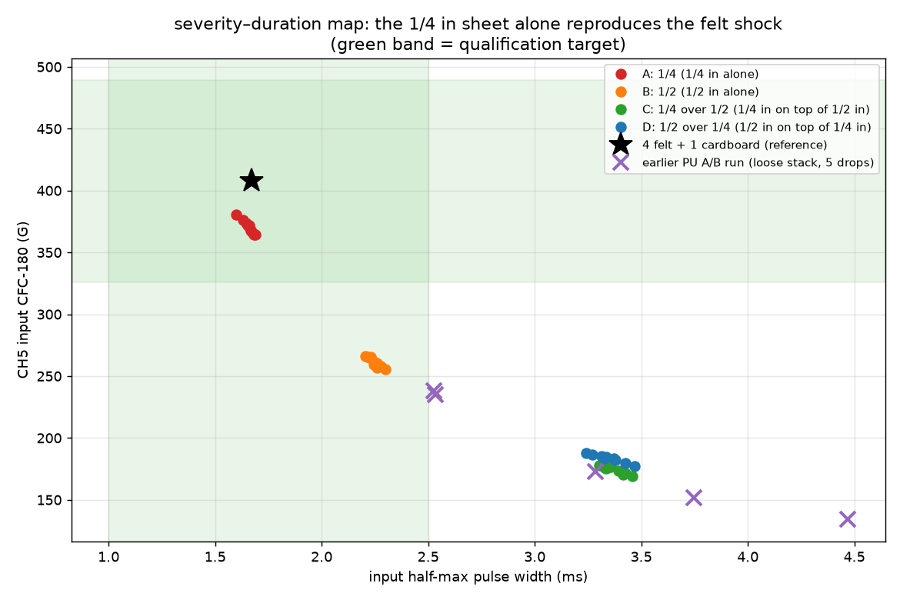

# Polyurethane sheet-configuration sweep — picking the transmissibility operating point

**Specimen** `bpx68c` · **Session** `bpx68c - Polyurethane Rubber - Further Tests`,
2026-07-30 13:08–15:10 · **40 drops** (4 arrangements × 10) · **60 in** ·
4-channel 1.25 MHz / 20 ms exports.

Data posted by @me-madsen on PR #86
([comment 5136470475](https://github.com/vertical-cloud-lab/tensegrity-optimization/pull/86#issuecomment-5136470475),
Box folder `4n678tlpnlk7q50dfi1rh1lkt7p6lx0y`).
Raw: [`data/drop-tests/pu-configs/`](../data/drop-tests/pu-configs/) ·
Script: [`scripts/analysis/drop_test_pu_configs_analysis.py`](../scripts/analysis/drop_test_pu_configs_analysis.py) ·
Metrics: `data/drop-tests/pu-configs/figures/pu_configs_metrics.json`.

This is the "stiffen the operating point" mini-sweep called for by
[`drop-test-pu-vs-felt-analysis.md`](drop-test-pu-vs-felt-analysis.md) §next-steps
and the qualification protocol in
[`drop-test-absorber-alternatives.md`](drop-test-absorber-alternatives.md) §4.1.

---

## 1. Headline

**Run transmissibility on the 1/4 in sheet alone (arrangement A).** It is the
only one of the four that passes all seven qualification criteria, and it
reproduces the felt+cardboard shock almost exactly — 371 G / 1.66 ms input
against felt's 408 G / 1.67 ms — while cutting the raw base-sensor peak by
**39 %** and removing the compaction problem entirely.

The second headline is that the **bimodal-input problem from the paired A/B
test is gone**: input CV is 1.4–1.8 % in all four arrangements here, against
25.7 % in the 5-drop A/B run. §5 shows why.

## 2. The four arrangements

| | arrangement | signals | trigger | CH5 raw | worst %FS | input CFC-180 | CV | width | TOP output | CV | **T = TOP/CH5** | CV | trigger margin | criteria |
|---|---|---|--:|--:|--:|--:|--:|--:|--:|--:|--:|--:|--:|--:|
| **A** | **1/4 in alone** | 1–10 | 300 G | 2,050 G | 26.2 % | **370.6 G** | 1.45 % | **1.66 ms** | 378.8 G | 1.51 % | **1.022** | 0.43 % | **5.4×** | **7/7** |
| B | 1/2 in alone | 11–20 | 300 G | 543 G | 6.2 % | 261.4 G | 1.45 % | 2.25 ms | 260.5 G | 1.59 % | 0.996 | 0.34 % | 1.7× | 5/7 |
| C | 1/4 over 1/2 | 22–31 | 150 G | 279 G | 3.3 % | 174.3 G | 1.68 % | 3.37 ms | 171.9 G | 1.06 % | 0.986 | 0.95 % | 1.6× | 4/7 |
| D | 1/2 over 1/4 | 32–41 | 150 G | 236 G | 2.7 % | 183.5 G | 1.76 % | 3.35 ms | 181.4 G | 1.52 % | 0.989 | 0.49 % | 1.5× | 4/7 |
| — | *4 felt + 1 cardboard (07-30 a.m. reference)* | | | *1,491 G* | *15.8 %* | *407.6 G* | *2.8 %* | *1.67 ms* | *411.3 G* | *3.2 %* | *1.009* | *0.44 %* | | |

Signal 21 (13:26, between B and C) is a stray capture and is excluded per
@me-madsen's instruction; every other event maps cleanly onto the four
10-drop blocks by timestamp (A 13:08–13:15, B 13:18–13:24, C 14:42–15:01,
D 15:03–15:10).

## 3. Why A wins

Scored against the acceptance criteria in
[`drop-test-absorber-alternatives.md`](drop-test-absorber-alternatives.md) §4.1:

| criterion | A (1/4) | B (1/2) | C (1/4 over 1/2) | D (1/2 over 1/4) |
|---|:--:|:--:|:--:|:--:|
| CH5 raw ≤ FS/3 = 3,148 G | ✅ 2,470 | ✅ 588 | ✅ 313 | ✅ 259 |
| input within ±20 % of felt (326–489 G) | ✅ 371 | ❌ 261 | ❌ 174 | ❌ 184 |
| input pulse width 1–2.5 ms | ✅ 1.66 | ✅ 2.25 | ❌ 3.37 | ❌ 3.35 |
| TOP CFC-180 CV ≤ 2 % | ✅ 1.5 | ✅ 1.6 | ✅ 1.1 | ✅ 1.5 |
| T CV ≤ 2 % | ✅ 0.43 | ✅ 0.34 | ✅ 0.95 | ✅ 0.49 |
| raw peak ≥ 2× trigger level | ✅ 5.4× | ❌ 1.7× | ❌ 1.6× | ❌ 1.5× |
| \|input drift\| ≤ 0.5 %/drop | ✅ −0.47 | ✅ −0.48 | ✅ −0.24 | ✅ +0.48 |

Three things separate A from the rest:

1. **It reproduces the felt shock.** 371 G / 1.66 ms vs felt's 408 G / 1.67 ms
   — a 9 % milder peak at an essentially identical duration. The softer
   arrangements deliver a *different test*: B is 36 % milder, C/D are 55–57 %
   milder with pulses twice as long. See the severity–duration map:

   

2. **Trigger margin.** A's raw peak is 5.4× the 300 G trigger. B only reaches
   1.7×, which is why the trigger had to be dropped to 150 G for C and D — and
   even at 150 G those two sit at 1.5–1.6×. All 40 drops did fire, but 1.5× is
   thin against the clip-height era's 0/8 no-trigger failures.

3. **T stays in the felt-era band.** A's T = 1.022 is the closest of the four to
   the felt reference (1.009), so the PU-era catalogue will be least discontinuous
   with the ~1,400 drops of felt-era numbers.

The cost of A is head-room: it is the only arrangement whose raw peak is
non-trivial (17 → 26 % FS). That is still comfortably inside the FS/3 target
and *below* the fresh-felt reference (15.8 %) in the same league — versus the
worn felt stack that reached **91 % FS** on 07-22. See §6 for the one watch item.

## 4. T is stack-dependent — as expected

Pairwise Welch on transmissibility (10 drops each):

| comparison | T | Δ | p | d |
|---|---|--:|--:|--:|
| A → B | 1.022 → 0.996 | −2.5 % | 4.5e-11 | −6.6 |
| A → C | 1.022 → 0.986 | −3.5 % | 7.3e-08 | −4.9 |
| A → D | 1.022 → 0.989 | −3.3 % | 4.8e-12 | −7.2 |
| B → C | 0.996 → 0.986 | −1.0 % | 7.9e-03 | −1.4 |
| B → D | 0.996 → 0.989 | −0.8 % | 9.1e-04 | −1.8 |
| **C → D** | **0.986 → 0.989** | **+0.3 %** | **0.47** | **+0.33** |

T falls monotonically as the pulse lengthens — a longer, gentler input is
increasingly quasi-static relative to the structure's modes, so the top vertex
just follows the base and T → 1 trivially. This is the same effect flagged in
[`drop-test-pu-vs-felt-analysis.md`](drop-test-pu-vs-felt-analysis.md) §2, now
resolved across four stiffnesses on one specimen. **The practical consequence is
unchanged: T values are not comparable across absorber configurations.**

It also argues on physics grounds for the stiffest arrangement: an excitation
that barely rings the structure carries little geometry information. A's output
spectral centroid is 2,370 Hz against 626–815 Hz for C/D — A is the only
arrangement still exciting the structure in a band where its geometry matters.

**C vs D is a null result** (p = 0.47): stacking order does not matter, only the
total stack. Useful — no need to control which sheet goes on top.

## 5. The earlier bimodal PU run was the two sheets stacked

The paired A/B test reported an unexplained "stiff/soft" split across its five
PU drops (input CV 25.7 %). Matching each of those drops to the nearest
arrangement here, in (input peak, pulse width) space:

| A/B drop | input | width | T | nearest arrangement |
|---|--:|--:|--:|---|
| S1 | 134.1 G | 4.47 ms | 0.968 | C/D (both sheets), softer still |
| S2 | 172.7 G | 3.29 ms | 0.980 | **C (both sheets)** |
| S3 | 234.7 G | 2.53 ms | 0.986 | **B (1/2 in alone)** |
| S4 | 151.5 G | 3.75 ms | 0.959 | C/D (both sheets), softer |
| S5 | 238.1 G | 2.52 ms | 0.987 | **B (1/2 in alone)** |

The A/B run's drops scatter *along the same severity–duration curve* traced by
this sweep, straddling "both sheets in contact" and "effectively the 1/2 in
sheet alone" — i.e. the two sheets were stacked but seating inconsistently, so
each drop landed somewhere between full and partial coupling. Seated properly,
that same both-sheet stack gives CV 1.7 % (arrangement C) instead of 25.7 %.

@me-madsen's point that the sheets are adhesive and unlikely to slide is
consistent with this: the failure was not lateral sliding but **interface
seating** between the two sheets. It is self-curing once the sheets are pressed
together and bedded in — which is what the 10-drop blocks here did — and it does
not arise at all with **a single sheet**, another point in A's favour. No
fastening hardware is needed.

## 6. Watch item: the 1/4 in sheet beds in over the first ~8 drops

Arrangement A's raw CH5 peak climbs 1,619 → 2,470 G over its 10 drops
(+4.6 %/drop, R² = 0.93) while the *filtered* input falls slightly
(−0.47 %/drop) and the pulse lengthens (+0.49 %/drop):

That is the familiar signature of high-frequency spike content growing while
the shock severity does not — and it appears to plateau (drops 8/9/10 read
2,470 / 2,330 / 2,361 G). Read as a **bedding-in transient**, not runaway
compaction, but it is only 10 drops of evidence and it is the one open question
about A. The `stability` criterion passes on the metric that matters (filtered
input, −0.47 %/drop), and T is flat (+0.02 %/drop, p = 0.68).

Note also that within A, T is completely insensitive to it: raw peak moves 53 %
while T moves 0.4 %. That is the third demonstration in this repo that T
cancels stack-state drift.

## 7. Recommendations

1. **Adopt arrangement A — the 1/4 in sheet alone — as the transmissibility
   operating point at 60 in.** Keep the trigger at 300 G (margin 5.4×).
2. **Run a ~25-drop stability check on A** before committing a campaign to it,
   to confirm the bedding-in transient plateaus. The existing stabilized-OLS
   scripts do this out of the box; the acceptance test is slope ≈ 0 on the CH5
   CFC-180 input after ~10 drops.
3. **Then run the bridging step**: a characterized specimen (`prc1kn`,
   `7xadt6`, `9GMQYQ` or `bpx68c`), n ≥ 25 on arrangement A, so PU-era T can be
   anchored against the felt-era catalogue. §4 says the offset will be small
   (A's T = 1.022 vs the felt reference 1.009) but it must be measured, not
   assumed.
4. **If more head-room is ever wanted**, arrangement B is the fallback — but it
   needs the trigger lowered to ~150 G, and it delivers a 36 % milder, 35 %
   longer shock, so it re-anchors T further from the felt era.
5. **Do not use C or D.** They fail three criteria each, deliver a nearly
   quasi-static input, and buy nothing over B except more head-room the rig
   does not need.
6. **Log the arrangement in the TP4 session ID** (e.g. `PU 1/4 only`) exactly
   as the felt sessions now log composition — §5 shows how much interpretive
   work that metadata does.

## 8. Caveats

- **n = 1 specimen.** Everything here characterizes the *stack*, not the
  specimen; `bpx68c` is a constant. Discrimination between geometries on
  arrangement A is untested (see
  [`drop-test-print-defects-analysis.md`](drop-test-print-defects-analysis.md)
  for what print-to-print scatter does to that question).
- **10 drops per arrangement**, so the drift slopes are indicative; the A
  bedding-in question specifically needs a longer run.
- **The pulse onset is truncated.** The 20 ms record starts on the trigger, and
  CFC-180 CH5 already reads 22–53 % of its peak at t = 0. Peaks and widths are
  unaffected (the peak is inside the record) but the reported Δv is a captured
  Δv and a lower bound — 5.6–5.9 m/s against 5.47 m/s free fall from 60 in, the
  excess being rebound.
- **Sheet thickness/durometer beyond the 1/4 in / 1/2 in labels is not
  recorded** anywhere; the durometer in particular would make future stack
  sizing calculable rather than empirical.
- **C ran in two blocks** (three drops at 14:42, seven at 14:57 after a 14 min
  pause). Its slightly higher T CV (0.95 %) may reflect that pause.
- The felt reference row is the *rested-stack* 07-30 morning state, not the
  worn 91 %-FS state that motivated the replacement.
