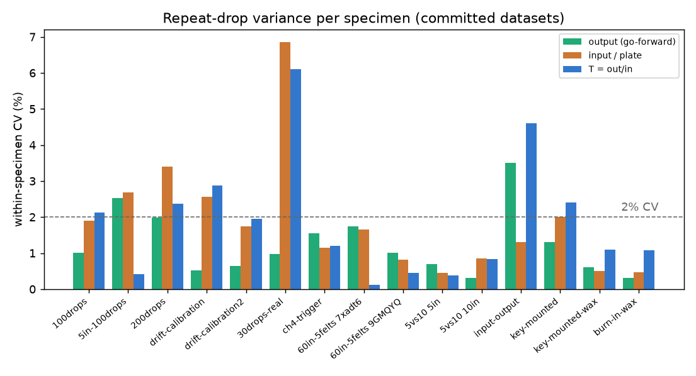
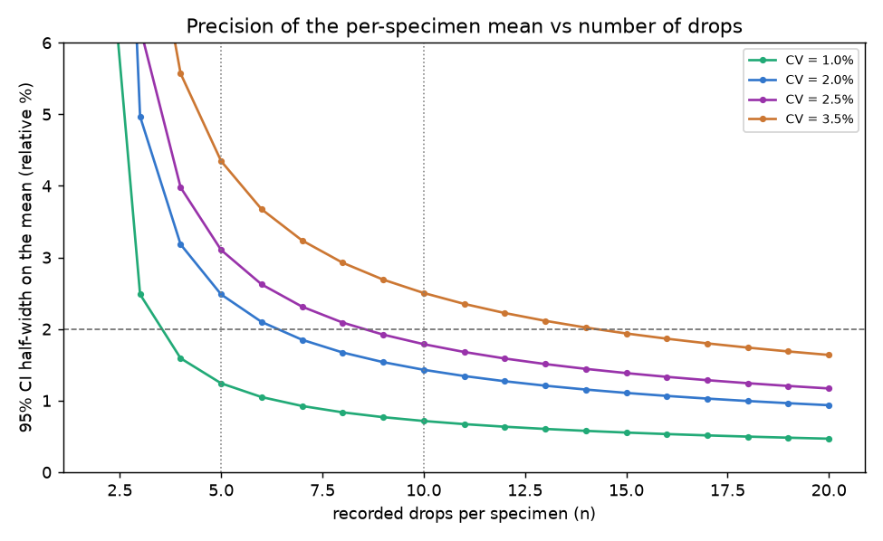

# How many drops per specimen? Variance + sample-size + timing

Answers @me-madsen's question on
[PR #82](https://github.com/vertical-cloud-lab/tensegrity-optimization/pull/82#issuecomment-5026945744),
re-asked on PR #86 (2026-07-21) with the
[60 in / 5 felts validation](drop-test-60in-5felts-analysis.md), the
[5-vs-10-in comparison](drop-test-5vs10-analysis.md)
([PR #82 comment 4973983998](https://github.com/vertical-cloud-lab/tensegrity-optimization/pull/82#issuecomment-4973983998)),
and the [PR #67](https://github.com/vertical-cloud-lab/tensegrity-optimization/pull/67)
datasets as explicit references — all now folded into the aggregation below:

> Recommend a minimum number of drop tests per specimen to get accurate data.
> How much variance have we had in our data per specimen being tested so far?
> Also provide how long each set of tests would take given that it currently
> takes ~42 seconds/drop at 60 inches with automatic dropping.

- Script: [`scripts/analysis/drop_test_sample_size_analysis.py`](../scripts/analysis/drop_test_sample_size_analysis.py)
- Figures + machine-readable metrics: [`data/drop-tests/sample-size/figures/`](../data/drop-tests/sample-size/figures)

This is a **meta-analysis of the variance already in the repo** — it reuses the
within-specimen coefficients of variation (CV) that the per-dataset analyses
emitted, rather than re-processing the ~1,485 committed CSVs, and turns that
observed scatter into concrete sample-size and timing numbers. All inputs are
traceable to committed artifacts (the campaign `figures/*_metrics.json` and the
mount-validation writeups).

The **go-forward objective** is the top-vertex tri-axis **output** CFC-180 peak
(and the derived transmissibility `T = output / input`); the base-plate
single-axis / input channel is reported separately because it is the noisier,
saturation-prone channel (see [`drop-test-felt-sheet-analysis.md`](drop-test-felt-sheet-analysis.md)).

---

## 2. How much variance have we had per specimen so far?

Every dataset in which a **single specimen (or fixed condition) was dropped
repeatedly** gives a direct read on within-specimen scatter. Pulling those
together:

| dataset | drops used | mount | output CV | input/plate CV | T CV |
|---|--:|---|--:|--:|--:|
| `60in-5felts` 7xadt6 | 95 | key-seat | 1.7 %* | 1.7 %* | **0.12 %** |
| `60in-5felts` 9GMQYQ | 96 | key-seat | 1.0 %* | 0.8 %* | **0.45 %** |
| `5vs10` 5 in | 30 | key-seat | **0.7 %** | 0.4 % | 0.4 % |
| `5vs10` 10 in | 30 | key-seat | **0.3 %** | 0.9 % | 0.8 % |
| `drift-calibration2` | 45 | key-seat + wax | **0.6 %** | 1.7 % | 2.0 % |
| `drift-calibration`  | 19 | key-seat + wax | **0.5 %** | 2.6 % | 2.9 % |
| `100drops`           | 91 | key-seat | **1.0 %** | 1.9 % | 2.1 % |
| `ch4-trigger`        | 40 | key-seat | **1.6 %** | 1.1 % | 1.2 % |
| `200drops`           | 190 | key-seat | **2.0 %** | 3.4 % | 2.4 % |
| `5in-100drops`       | 90 | key-seat | **2.5 %** | 2.7 % | 0.4 % |
| `30drops-real`       | 25 | key-seat | **1.0 %** | 6.9 %* | 6.1 %* |
| `felt-sheet` (9×5)   | 45 | key-seat | **0.2–2.1 %** (med 0.7 %) | 0.4–16.9 %* | — |
| `input-output` (4×5) | 20 | hot-glue vertex | 1.3–3.5 % | 0.7–1.6 % | 0.8–4.6 % |
| `key-mounted` (5)    | 5 | key-seat | 1.3 % | 2.0 % | 2.4 % |
| `key-mounted-wax` (5)| 5 | key-seat + wax | **0.6 %** | 0.5 % | 1.1 % |
| `burn-in-wax` (5)    | 5 | key-seat + wax | **0.31 %** | 0.47 % | 1.07 % |

\* the `60in-5felts` TOP/CH5 CVs are inflated by the campaign-scale **felt-wear
drift** (both channels climb in lockstep, per-drop corr = 0.999); the drift
cancels in `T`, whose 0.12–0.45 % CV over ~95 drops is the tightest of any
dataset. The `30drops-real` / `felt-sheet` input CVs marked in the earlier rows
are a tape/wax-coupling and saturation artifact, not specimen scatter.

**Bottom line on variance:** the go-forward **output** metric is tight and
stable — pooled across all repeat-drop datasets the within-specimen CV is
**0.31 – 3.5 %, median ≈ 1.0 %** (90th percentile ≈ 2.3 %). The best mount
(key-seat + wax) sits at **CV ≈ 0.3 – 0.6 %**. Transmissibility `T` pools to a
median CV ≈ 1.2 %, and at the 60 in / 5 felts operating point it is the
*tightest* metric of all (0.12 – 0.45 % over ~95 drops) because it cancels the
felt-wear drift. For scale, the *between-design* spread we have
already measured is far larger than this within-specimen scatter — the four
input-output geometries span `T` ≈ 0.96 → 1.19 (~24 %) and output ≈ 230 → 290 G
(~26 %) — so the signal-to-noise for ranking designs is comfortably high.

---

## 1. Minimum number of drops per specimen

Two independent requirements set the number:

### (a) Precision of the per-specimen mean

Smallest `n` whose 95 % t-CI half-width on the mean is within a target
**relative** margin of error, `n = (t_{n-1}·CV / MoE)²`:

| within-specimen CV | ±1 % CI | ±2 % CI | ±3 % CI |
|--:|--:|--:|--:|
| 0.5 % (wax mount) | 4 | 3 | 3 |
| 1.0 % (median output) | 7 | 4 | 3 |
| 1.5 % | 12 | 5 | 4 |
| 2.5 % (conservative `T`) | 27 | 9 | 6 |
| 3.5 % (hot-glue worst) | 50 | 15 | 8 |

At the **median output CV (~1.0 %), 5 recorded drops give a ±1.2 % 95 % CI** on
the per-specimen mean; even the noisier 2.5 % `T` metric reaches ±3 % by n = 6.

### (b) Discriminating two designs

`n` per specimen to resolve a given **relative difference** between two designs
at 80 % power (two-sample, α = 0.05):

| within-specimen CV | resolve 5 % | resolve 10 % | resolve 20 % |
|--:|--:|--:|--:|
| 1.5 % | 2 | 1 | 1 |
| 2.5 % | 4 | 1 | 1 |
| 3.5 % | 8 | 2 | 1 |
| 6.5 % | 27 | 7 | 2 |

Because the observed between-design spread (~24 %) dwarfs the within-specimen
CV, **discrimination is never the binding constraint** — a handful of drops
already separates designs. Precision of the mean is what drives the count.

### (c) Burn-in / warm-up

The large campaigns show the first few drops of a fresh mount drift before the
signal settles: the post-burn-in window opens at drop **5–10** for the
hot-glue/tape mounts (`burn_in_drops` = 9, 10, 10, 5 across 100/5in-100/200drops
and drift-cal2). The **key-seat + wax mount essentially removes this** — the
`key-mounted-wax` and `burn-in-wax` series are flat from drop 1 (recorded-phase
CV ≈ 0.3–0.6 %). So discard **~2 warm-up drops with the wax key-seat mount**, or
**~5 with a bare hot-glue mount**, before the recorded set.

### Recommendation

| plan | warm-up (discarded) | recorded | total | when to use |
|---|--:|--:|--:|---|
| minimal | 0 | 5 | **5** | wax key-seat mount, output/`T` objective |
| **baseline** | 2 | 5 | **7** | default per-specimen SOP |
| conservative | 2 | 10 | **12** | noisy input/plate metric, hot-glue mount, or a design sitting on a decision boundary |

**Minimum ≈ 5 recorded drops per specimen** (after ~2 warm-up drops → **7
total**) is the recommended default: it delivers a ±1–2 % 95 % CI on the
go-forward output objective at the CVs we actually observe, and resolves the
≥10 % differences between designs with power to spare. Step up to **10 recorded
drops** only when using the noisier raw-input / transmissibility channel or a
bare hot-glue mount (CV up to ~6.5 %).

---

## 3. How long does a set take?

At @me-madsen's measured **~42 s/drop at 60 in with automatic dropping** (the
60 in / 5 felts validation logged a median inter-capture cadence of **41 s**
across 201 drops, so this number is confirmed at campaign scale; the `5vs10`
runs logged 11–14 s/drop at 5–10 in):

| per-specimen plan | drops | time @ 60 in (42 s) | time @ low height (≈16 s)* |
|---|--:|--:|--:|
| minimal (5 recorded) | 5 | **3.5 min** | 1.3 min |
| baseline (2 + 5) | 7 | **4.9 min** | 1.9 min |
| conservative (2 + 10) | 12 | **8.4 min** | 3.2 min |

\* the committed campaigns logged a median auto-drop cadence of **12–20 s/drop**
at the lower drop heights (10–13 in), so a set is ~2.5× faster there than at
60 in.

Scaled to a BO batch at 60 in (baseline 7-drop set unless noted):

| batch | 7 drops/specimen | 12 drops/specimen |
|--:|--:|--:|
| 10 designs | 0.82 h | 1.4 h |
| 20 designs | **1.6 h** | 2.8 h |
| 48 designs | 3.9 h | 6.7 h |
| 96 designs | 7.8 h | 13.4 h |

---

## Caveats

- CVs are *within a single physical specimen* (repeat drops). True
  print-to-print reproducibility (a fresh print of the same geometry) is **not**
  characterised by *this* analysis — the recommendation assumes one physical
  article per specimen.
  **Update (07-30): it has since been measured directly.** Five nominally
  identical T3-prism prints, ~100 drops each, give a between-print CV of
  **0.72 %** in `T` (1.95 % worst-to-best spread) — see
  [`drop-test-print-defects-analysis.md`](drop-test-print-defects-analysis.md).
  Because repeat drops on one article are only 1.4× tighter than that,
  **replicate prints, not extra drops, are what buy precision for a
  between-design comparison**: ~3 prints per geometry to resolve a 2 %
  difference at 80 % power, 1 print for ≥3 %. The n ≥ 3 replicate-print advice
  below stands and now has a number behind it.
- The 200 ms / 125 kHz capture window truncates the full ring-down, so Δv/SEA
  are partial-pulse; these `n` targets are for the **peak/transmissibility**
  objective, not energy metrics (extend the window for SEA — see
  [`drop-test-input-output-analysis.md`](drop-test-input-output-analysis.md)).
- Keep the base-plate single-axis / input channel out of saturation across the
  whole #35 search space (it is the rig bottleneck at FS 9,442.9 G); a clipped
  channel inflates its CV and invalidates the count.
