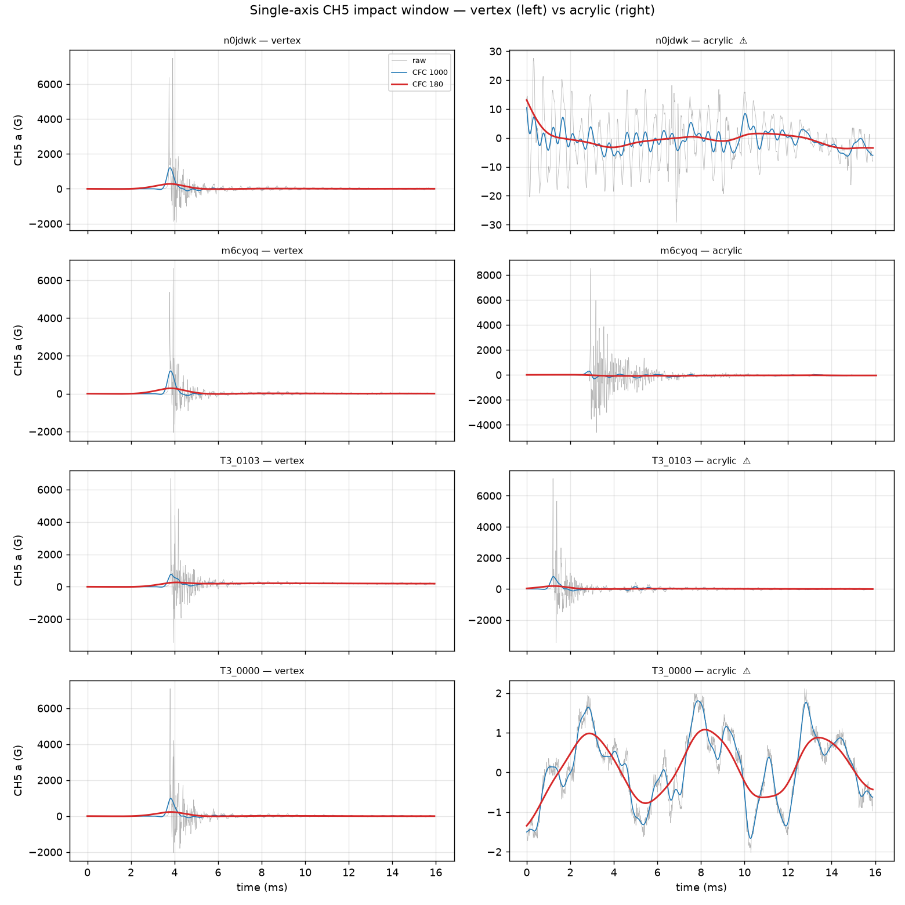
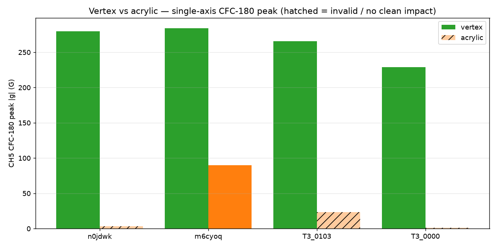
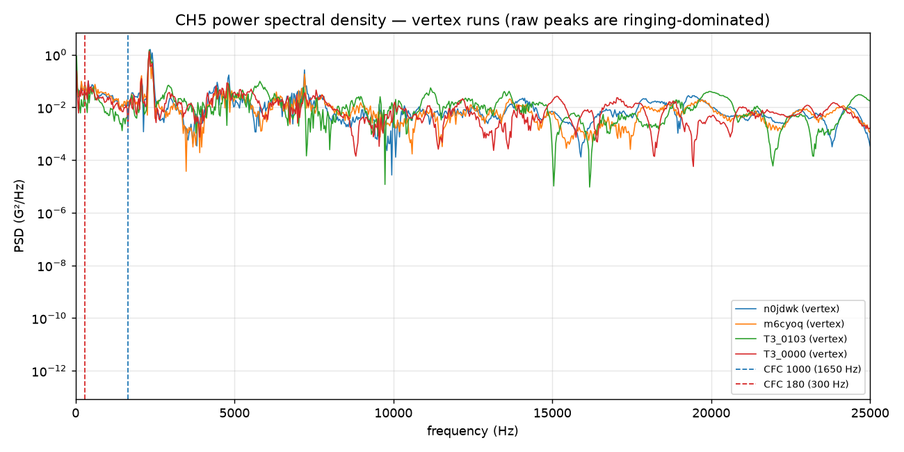

# Vertex vs. acrylic-plate drop-test analysis (T3 prisms)

Analysis of @ctrhjk's first vertex- vs. acrylic-plate comparison
([PR #67](https://github.com/vertical-cloud-lab/tensegrity-optimization/pull/67#issuecomment-4783408053),
tests run 06/22/2026, drop height 13 ft). Four distinct T3-prism geometries
(`n0jdwk`, `m6cyoq`, `T3_0103`, `T3_0000`/audrey2) were each dropped twice —
once with the single-axis accelerometer **hot-glued to a vertex** (`Signal1`)
and once with it **above the acrylic plate** (`Signal2`).

Raw data + channel map: [`data/drop-tests/vertex-acrylic/`](../data/drop-tests/vertex-acrylic/).
Reproduce with:

```bash
pip install numpy scipy matplotlib
python scripts/analysis/drop_test_vertex_acrylic_analysis.py
```

## Method

- **Channels.** CH1 was removed for this series. CH2/CH3/CH4 are the
  three-axis sensor (CH4 is the triggered axis, 1000 G trigger); **CH5 is the
  single-axis accelerometer** (full scale 9442.9 G) — the sensor the project
  is standardizing on per #71/#74, so CH5 is the primary number here.
- **Windowed peak search.** The impact is located on the triggered CH4 channel
  within the first 10 ms (lands at t ≈ 3.9–4.1 ms, consistent with the 2 %/4 ms
  pre-trigger), and peaks are taken in a ±1.5 ms window around it — not a global
  0.2 s max, which on these traces is frequently a later mount/ringdown
  oscillation. (Same correction Edison flagged for the #71 series.)
- **SAE J211 filtering.** Raw peaks on a lightly damped lattice are dominated by
  sensor ringing (PSD energy out past 10 kHz), so the CFC-180 (≈300 Hz) column
  is the physically meaningful structural number; CFC-1000 (≈1650 Hz) is shown
  for reference.

## Results

| specimen | mount | t_imp (ms) | CH5 raw \|g\| | CH5 CFC-1000 | **CH5 CFC-180** | CH4 CFC-180 | width (ms) | Δv (m/s) | status |
|---|---|--:|--:|--:|--:|--:|--:|--:|---|
| `n0jdwk` | vertex | 3.94 | 7,480 | 1,207 | **280** | 317 | 1.47 | 3.25 | ok |
| `m6cyoq` | vertex | 3.94 | 6,632 | 1,204 | **284** | 300 | 1.50 | 3.35 | ok |
| `T3_0103` | vertex | 3.95 | 6,685 | 772 | **266** | 293 | 2.18 | 4.71 | ok |
| `T3_0000` | vertex | 3.94 | 7,093 | 983 | **229** | 298 | 1.47 | 2.66 | ok |
| `n0jdwk` | acrylic | 3.90 | 19 | 7 | **3** | 20 | — | — | ✗ no clean impact |
| `m6cyoq` | acrylic | 4.06 | 8,527 | 317 | **90** | 439 | 2.42 | 1.91 | ⚠ near CH5 saturation |
| `T3_0103` | acrylic | 3.90 | 421 | 143 | **24** | 28 | — | — | ✗ no clean impact |
| `T3_0000` | acrylic | 3.90 | 2 | 2 | **1** | 23 | — | — | ✗ invalid (sensor fell off) |







## Findings

1. **Vertex mounting is repeatable; acrylic mounting (as configured) is not.**
   All four vertex runs produced clean, well-defined pulses with CH5 CFC-180
   peaks in a tight **229–284 G** band (mean ≈ 265 G, CV ≈ 9 %). Of the four
   acrylic runs, **three failed to register a clean impact** — `n0jdwk` (3 G) and
   `T3_0103` (24 G) are the "no acceleration above trigger" cases @ctrhjk
   described (clips fixed too low → the acrylic plate seats on the structure and
   short-circuits the load path), and `T3_0000` is the known-invalid run where
   the sensor fell off. Only `m6cyoq`-acrylic registered.

2. **The vertex CFC-180 peaks do not yet discriminate geometry.** The 229–284 G
   spread across four *distinct* parameter sets is barely above run-to-run
   scatter, so at this drop height / mounting the vertex peak-g is not a
   sensitive objective for telling geometries apart. This is consistent with
   @sgbaird's read that two of these specimens (`m6cyoq`, `T3_0103`) were already
   damaged going into / coming out of the acrylic test, and that fresh, intact
   distinct-geometry samples with a **vertex-only** protocol are needed before
   peak-g can be trusted as a BO objective. Δv (2.7–4.7 m/s, partial-pulse
   integral) shows more spread but is sensitive to the integration window and
   should not be over-read at n = 1.

3. **The single-axis sensor is near its ceiling on raw peaks.** CH5 raw peaks
   are 6,600–8,500 G against a 9,442.9 G full scale — i.e. 70–90 % of range, and
   `m6cyoq`-acrylic (8,527 G) is close enough to saturate that its raw peak
   should be treated as a lower bound. The structural (CFC-180) numbers are well
   within range, but a harder/direct hit could clip the raw channel (same issue
   as the #74 calibration-2 CH1 hard-clip). Confirm headroom or move to a
   higher-range sensor for any test where a near-direct plate-on-plate hit is
   possible.

4. **The acrylic mass pre-loads the structure.** Per @sgbaird's observation, the
   acrylic plate's weight visibly deforms the lattice before release, and the
   X-bands keep the specimen from flying off but do not hold it flush to the base
   — both bias the acrylic measurement and compound the clip-height problem.

## Implications for the SOP / test method

- **Default to vertex mounting** for repeatable peak-g capture, but **replace the
  hot-glue mount** with a fixture that aligns the sensor z-axis to the drop axis
  (a printed/machined flat seat or threaded stud boss at the vertex) — hot glue
  neither aligns the axis nor couples reliably (@ctrhjk note 2).
- **If acrylic-plate tests are kept, raise the retaining clips** so the plate
  cannot seat on the specimen, and re-check that the load actually reaches the
  sensor (3/4 acrylic runs here did not). Account for the plate pre-load.
- **Use fresh, intact specimens per geometry** and replicate (n ≥ 5, report CV)
  before treating peak-g or Δv as a discriminating objective — the two damaged
  specimens here confound the vertex/acrylic comparison.
- **Verify the single-axis full-scale headroom** (≈9.4 kG) against expected raw
  peaks, or step up the sensor range for direct-impact configurations.
- **Standardize the windowed CH4-triggered peak extraction** (this script) so the
  reported peak is the impact pulse, not a later ringdown lobe.

## Caveats

- n = 1 per (specimen, mount); two specimens were damaged across the session.
- 200 ms window only (no full ringdown); Δv is a partial half-amplitude-pulse
  integral, not a calibrated impact Δv (needs a clean baseline + full-event
  integration + the input/transmitted channel pair).
- CH4-vs-CH5 axis/orientation between the two stacked sensors is not independently
  confirmed; CFC-180 CH4 is reported only as a cross-check.
