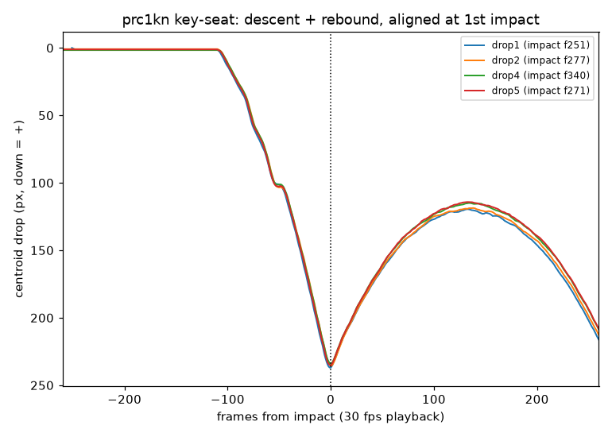

# Drop-test video analysis — key-seat `prc1kn`

Companion to [`drop-test-key-mounted-analysis.md`](drop-test-key-mounted-analysis.md)
(accelerometer CSVs). This pass analyzes the **slow-motion videos** @ctrhjk
posted with the same key-seat run on
[PR #67 (comment 4837240958)](https://github.com/vertical-cloud-lab/tensegrity-optimization/pull/67#issuecomment-4837240958),
to recover what the 200 ms accelerometer window can't see: the **full descent**,
the **elastic rebound**, and the **output-sensor fall-off**.

- Script: [`scripts/analysis/drop_test_video_analysis.py`](../scripts/analysis/drop_test_video_analysis.py)
- Figures: [`data/drop-tests/key-mounted/video-figures/`](../data/drop-tests/key-mounted/video-figures/)

## What's in the videos

Five clips: drops 1, 2, 4, 5 (drop 3's video was deleted by the uploader) plus a
separate "problem observed" clip showing the **output (tri-axis) sensor falling
off**. The scene is the tensegrity (orange + black struts) descending onto the
bottom acrylic plate; the silver cylinder on the plate is the **input**
single-axis sensor (wax-mounted next to a bottom vertex).

## Method (and its limits)

These are Sony RX100 IV high-frame-rate captures conformed to a **30 fps**
container, so the playback is slow-motion at a fixed but **unknown** slow-mo
factor. I segment the orange struts in HSV each frame and take the vertical
**centroid** of that mask as a clean 1-D proxy for the structure's height. From
that single signal I get the first-impact frame, descent duration, a quadratic
fit (curvature sign = free-fall check), and the rebound.

Because the slow-mo factor and pixel scale are uncalibrated, **all timings are
in playback frames/seconds and motion is in pixels** — valid for drop-to-drop
*relative* comparison, **not** absolute velocity. (The accelerometer Δv ≈ 2.6 m/s
is the absolute number; the video is the kinematic shape and its repeatability.)

## Results — the four valid drops are extremely repeatable

| drop | impact frame | descent (frames / s) | descent slope (px/frame) | rebound fraction |
|---:|--:|--:|--:|--:|
| 1 | 251 | 93 / 3.10 | 2.312 | 0.50 |
| 2 | 277 | 92 / 3.07 | 2.302 | 0.50 |
| 4 | 340 | 92 / 3.07 | 2.300 | 0.51 |
| 5 | 271 | 93 / 3.10 | 2.299 | 0.51 |
| **mean ± 1σ** | — | **3.09 ± 0.02 s** | **2.303 ± 0.006** (CV **0.26 %**) | **0.505 ± 0.006** (CV **1.1 %**) |

When the four descents are aligned at their first-impact frame they fall almost
exactly on top of each other — same descent slope, same impact depth, same
rebound parabola.

### Headlines

1. **The video corroborates the accelerometer repeatability — from an
   independent channel.** The descent slope matches drop-to-drop to **CV ≈ 0.3 %**
   and the rebound to **≈ 1 %**, in the same ballpark as the accelerometer's
   input 219 ± 4 G (CV 2.0 %) / output 234 ± 3 G (CV 1.3 %). Two unrelated
   measurements (a contact accelerometer and an optical centroid) agreeing that
   the strike is this reproducible is a strong "the rig is now controlled" signal.

2. **The descent shows real downward acceleration → free-fall, bungees removed.**
   The quadratic fit has a consistent positive (downward) curvature in every
   drop (≈ 0.022 px/frame², CV ~3 %), i.e. the structure is *accelerating* under
   gravity rather than being pulled at constant/assisted velocity. That visually
   confirms @ctrhjk's "bungees removed" note — the opposite of the
   [bungee-assisted lift-off](drop-test-protocol.md) seen in the very first drops.

3. **There's a large, repeatable elastic rebound (~50 % of the drop depth).**
   After impact the centroid springs back up to about half the height it fell,
   then settles — the tensegrity behaving as a spring. It is **identical across
   the four drops**, so the spring-back is not adding scatter. Per Sterling's
   note that we care about the *initial descent*, not the spring-back, the video
   confirms
   the spring-back is consistent and isolated to *after* the impact event the
   accelerometer captures.

4. **The fall-off clip: the input (wax) mount holds; the output (press-fit)
   mount is what failed.** Throughout the fall-off video the silver input sensor
   on the plate stays perfectly stationary frame-to-frame (consistent with its
   low CV and the ISO-5347 "wax on a flat rigid plate" expectation), while the
   tri-axis output sensor detaches from the vertex key-seat — exactly the
   press-fit-not-enough failure @ctrhjk reported. This points the fix squarely at
   the **output seat retention** (add wax inside the key-seat housing, as Sterling
   suggested), not at the input side.

## Caveats

- Slow-mo factor and pixel scale are uncalibrated — frames/pixels only, no
  absolute velocity from video (use the accelerometer Δv for that).
- `prc1kn` is a single deliberately-failed print; this is a **mount/DAQ + rig**
  validation, not a geometry result.
- The orange-centroid proxy mixes translation and tilt/rotation of the cage;
  it tracks overall height well but is not a rigid-body fiducial. A future pass
  with a fixed marker (or DIC, ≥5000 fps per the Edison synthesis) would give
  calibrated displacement/velocity and strut-level strain.
- Drop 3's video is unavailable; fall-off clip is not one of the five analyzed
  CSV drops.
