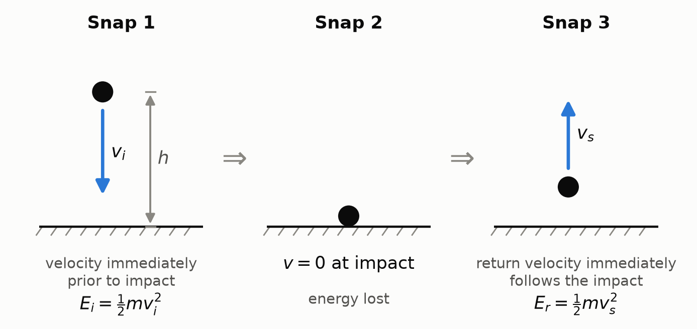
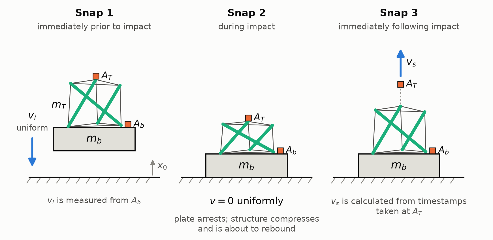
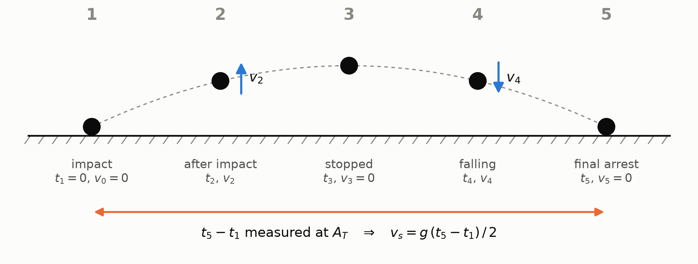

# Rebound energy

Digital version of the handwritten notes shared in
[issue #94](https://github.com/vertical-cloud-lab/tensegrity-optimization/issues/94)
([original PDF](https://github.com/user-attachments/files/32534339/Rebound.energy.pdf),
dated Monday, September 21, 2026). The wording follows the handwritten page with
light copyediting; the diagrams are redrawn by
[`scripts/figures/rebound_energy_notes_figures.py`](../scripts/figures/rebound_energy_notes_figures.py).
The colored ink annotations in the original are rendered here as labeled
callouts. See the [transcription notes](#transcription-notes) at the end.

## Context: the classical bounce

The initial energy, the energy before impact (not accounting for friction), is

$$E_{\text{initial}} = m\,g\,h$$

- **Snap 1:** the body falls from height $h$ and reaches velocity $v_i$
  immediately prior to impact. Its kinetic energy there is
  $E_i = \tfrac{1}{2} m v_i^2$.
- **Snap 2:** $v = 0$ at impact. Energy is lost.
- **Snap 3:** the return velocity $v_s$ immediately follows the impact. The
  rebound energy is $E_r = \tfrac{1}{2} m v_s^2$.

> **Note.** The velocity is assumed to be measured from the center of mass, and
> the body is assumed to move uniformly.

The rebound energy is what remains of the initial energy after the loss at
impact:

$$E_r = E_{\text{initial}} - E_{\text{lost}} = E_{\text{initial}} \cdot (\%\,\text{retained})$$

The fraction retained reduces to a velocity ratio because the $\tfrac{1}{2} m$
cancels:

$$\%\,\text{retained} = \frac{E_r}{E_{\text{initial}}} = \frac{\tfrac{1}{2} m v_s^2}{\tfrac{1}{2} m v_i^2} = \left( \frac{v_s}{v_i} \right)^{2} = e^2$$

where $e$, the coefficient of restitution, is

$$e = \frac{v_s}{v_i}$$

So normally the rebound energy is

$$E_r = m\,g\,h\,e^2$$

**The equation assumes:**

1. velocities are measured at the center of mass;
2. the impacting body acts as one lumped mass that moves uniformly;
3. $m_i = m_s$, that is, the mass at impact equals the mass at separation;
4. the ground/impact point is stationary.

The sections below check which of these assumptions are broken in our test.

## What is different in our set up?

**Snap 1, immediately prior to impact.** The structure (mass $m_T$) rides on the
drop block $m_b$, and the bottom of the structure is constrained to move with
$m_b$. Accelerometer $A_T$ sits at the top vertex of the structure, and
accelerometer $A_b$ sits at the base. The whole assembly falls with uniform
initial velocity $v_i$, and $x_0$ marks the ground. During snap 1, $v_i$ is
measured from $A_b$.

> **Open question.** Should we model this as a spring with an attached mass?

**Snap 2, during impact.** $v = 0$ uniformly: the plate arrests, and the
structure compresses and is about to rebound.

> **Open question.** Sometimes $m_b$ will hit the floor, rebound up briefly,
> then is stopped. Does this affect our calculations significantly? (The inset
> sketch in the notes: the plate falls with $v_i$, arrests at $x_0 = 0$, briefly
> rises, and settles at $v = 0$.) We assume the plate $m_b$ simply stops and
> arrests immediately at $x_0 = 0$.

**Snap 3, immediately following impact.** The top vertex leaves with separation
velocity $v_s$. In a way, $v_s$ is calculated from the point $A_T$ using
kinematics. Take the leg of the hop with one end at rest, so in

$$v_f = v_i + a\,t$$

the initial term drops out and, with $a = g$,

$$v_s = g\,t$$

We assume gravity is the only acceleration acting on the sensor (untrue, but
perhaps justifiable here). Here $t$ is the time it takes for the object to stop
as it rises up, i.e. the time from $t_1$ to $t_3$ in the time key below.

> **Aside.** In reality there is a kind of spring force, a restoring force,
> pulling the point $A_T$ to equilibrium.

> **Note.** $v_s$, used to calculate $e$, is calculated from measurements taken
> at $A_T$. The mass does not move uniformly, nor is velocity measured at the
> center of mass.

## Time key

| Phase | Time | Velocity | What is happening |
| --- | --- | --- | --- |
| 1 | $t_1 = 0$ | $v_0 = 0$ | impact; the assembly arrests |
| 2 | $t_2$ | $v_2$ | after impact; the vertex rises |
| 3 | $t_3$ | $v_3 = 0$ | stopped at the apex |
| 4 | $t_4$ | $v_4$ | falling |
| 5 | $t_5$ | $v_5 = 0$ | final arrest |

All $A_T$ tells us is the time from $t_1$ to $t_5$, so

$$t = \frac{t_5 - t_1}{2}$$

and we obtain:

$$\boxed{\; v_s = \frac{g\,(t_5 - t_1)}{2} \;}$$

## The proxy variable

Now, we calculate our proxy variable, $\lambda$, as follows:

$$\lambda = m\,g\,h\,e$$

where

- $m$ is the mass of the structure,
- $g$ is gravity,
- $h$ is the initial drop height,
- $e$ is the coefficient of restitution.

> **Note.** $e$ is not squared here; $e = v_s / v_i$ still. And $e$ is not
> measured at the center of mass of the structure: $v_i$ is taken from $A_b$,
> and $v_s$ is calculated from timestamps at $A_T$. Assumptions 1, 2, and 4
> are broken.

## But:

> This is not rebound energy. It is supposedly a "velocity-weighted
> impact-energy index." In more accurate terms, it is an index we have formed to
> compare the structures' performance, where lower is assumed to imply better
> performance as an energy absorber.
>
> This metric, $\lambda$, has been able to consistently identify which structure
> is which based on its performance during tests at $h = 60$ in.

## Why use m, g, h, and e, and not just e?

- $e$ is the main ranking item in $\lambda$, but including the mass penalizes
  the structure, in that if $m_1 > m_2$ but $e_1 = e_2$, then

$$\lambda_1 = m_1\,g\,h\,e_1 > \lambda_2 = m_2\,g\,h\,e_2$$

- Gravity could perhaps be removed, as it is constant.
- Including height helps $\lambda$ rank according to the test run, i.e. at
  60 in vs. 30 in.

## Transcription notes

- Symbols are unified: the original writes $e = v_f / v_i$ in the classical
  section and uses $E_r$ and $E_{\text{reb}}$ for the same quantity; this
  version uses $v_s$ and $E_r$ throughout.
- The small inset sketch inside the plate-bounce question (plate at $x_1$,
  $x_0 = 0$, $x_2$) is folded into the question text.
- The five-phase numbering, the $t_1$ to $t_5$ interval, and the assumption
  numbering match the original exactly.
