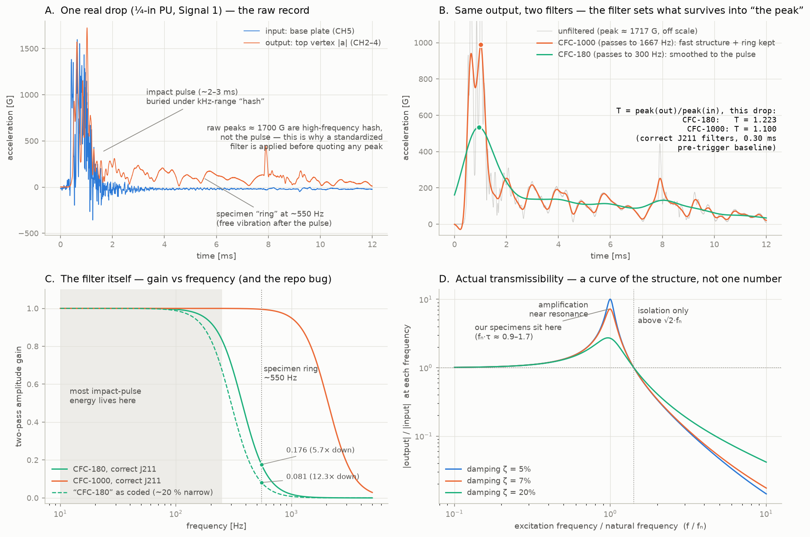

# "Transmissibility" and the CFC filter, untangled

**Requested by:** @sgbaird on
[issue #94](https://github.com/vertical-cloud-lab/tensegrity-optimization/issues/94)
(2026-08-17): *"I don't fully understand the transmissibility of the filter.
Like if someone could explain to me that, that'd be awesome."*

The confusion is legitimate, because the phrase mixes **three different
things** that all involve an output/input ratio over frequency:

1. **The CFC filter** — a data-cleaning step applied to each channel. It has
   a "transmission" curve (gain vs frequency), but it is a *processing*
   choice, not physics.
2. **Our metric `T`** — a single number per drop, historically labeled
   "transmissibility." It is actually a *filtered peak-acceleration ratio*,
   and its value depends on which filter was applied first.
3. **True mechanical transmissibility** — a property of the *structure*: a
   full curve `|H(f)|` of output/input at every excitation frequency. We
   have never measured this, and one drop cannot.

Companion figure (generated by
[`scripts/figures/transmissibility_explainer_figure.py`](../scripts/figures/transmissibility_explainer_figure.py)
from raw pu-configs drop data, pinned commit `b6a296e`):



## 1. Why a filter at all (panels A and C)

The raw record of one drop (panel A) shows the top-vertex accelerometer
peaking around **1700 G**. That peak is not the impact: it is kHz-range
"hash" — accelerometer-mount resonance, wax-joint rattle, digitizer noise —
riding on top of a ~2–3 ms impact pulse whose real amplitude is a few
hundred G. So "peak G" is a meaningless number until you state **which
frequency band you kept**. Every lab that quotes crash/shock peaks
standardizes this with SAE J211 **channel frequency classes (CFC)**: a
2-pole Butterworth low-pass run forward and then backward (zero phase
shift), with a specified corner:

| class | passes content up to (−3 dB, two-pass) | reads as |
|---|---|---|
| CFC-180 | 300 Hz | the rigid-body impact pulse only |
| CFC-1000 | 1667 Hz | pulse **plus** the specimen's ~550 Hz structural vibration |

Panel C is the filter's own gain-vs-frequency curve. The key geometric
fact: the impact-pulse energy lives below ~250 Hz, our specimens ring at
~550 Hz, and the two channel classes sit on opposite sides of that ring —
CFC-180 attenuates it 5.7×, CFC-1000 passes it essentially untouched.
**Choosing a CFC is choosing which physics counts.** Neither is "the true
signal"; they answer different questions.

Panel C also shows the known repo bug ([issue #94
audit](https://github.com/vertical-cloud-lab/tensegrity-optimization/blob/6445221/edison-trajectories/j211-audit/README.md)):
`cfc_filter()` passes the two-pass corner to scipy's single-pass argument,
so every class as coded is ~20 % narrower than its label (dashed curve),
and the "12× at 550 Hz" once quoted for CFC-180 is the bug's number — the
correct figure is 5.7×. Fix still pending, deliberately left for its own
PR.

## 2. What our `T` actually is (panel B)

```
T = max|a_out, filtered| / max|a_in, filtered|
```

Filter both channels with the same CFC, take each one's peak (they occur
at *different times*), divide. Panel B shows the same output signal under
both classes: CFC-1000 keeps the fast intra-pulse structure and the ring
(peak ≈ 990 G); CFC-180 smooths everything to the underlying pulse
(peak ≈ 535 G). The input channel shrinks by a different factor, so **T
changes with the filter** — on this drop, 1.223 vs 1.100. That is the
entire mechanism behind "the transmissibility of the filter": the filter
doesn't *have* a transmissibility; it *decides what the metric T means*.

Per the Edison standards audit (task `6af9d904`), this quantity is not
"transmissibility" in SAE J211, ISO 6487, ISO 18431, ASTM D3332/D7136, or
MIL-STD-810: the peaks are non-simultaneous, the output is a nonlinear
tri-axis magnitude, and no frequency decomposition is involved. Correct
name: **CFC-filtered peak-acceleration ratio**. It is also empirically the
weakest and most processing-sensitive discriminator in the program.

## 3. What transmissibility really means (panel D)

For a base-excited single-degree-of-freedom structure (natural frequency
`f_n`, damping ratio ζ):

```
|H(r)| = sqrt( (1 + (2ζr)²) / ((1 − r²)² + (2ζr)²) ),   r = f / f_n
```

- Excite well below `f_n` → output ≈ input (T ≈ 1, "rides along").
- Excite near `f_n` → **amplification** (up to ~7× at our ζ ≈ 7 %).
- Excite above `√2·f_n` → **isolation** (output < input).

It is a **curve**, and measuring it requires putting energy in across
frequencies with known input — a shaker sweep or averaged tap tests with a
coherence check (Ewins, *Modal Testing*). A drop gives one transient with
whatever spectrum the mat produced that day; you can compute a number from
it, but not the curve. Our specimens sit near the top of the hump
(`f_n·τ ≈ 0.9–1.7`), which is why they neither isolate nor cleanly
amplify — they ride the pulse and ring afterwards.

## 4. Is the current data collection the right data?

**Yes to continue for screening — the record already contains the metrics
that have proven trustworthy, and none of them require new hardware:**

| metric | what it measures | robustness |
|---|---|---|
| ζ (ringdown decay) | fraction of vibrational energy dissipated per cycle (≈ 4πζ) | good where fit r² ≥ 0.85 |
| `e_rebound` | restitution-like partition of the vertex hop | survived session + tower-damage changes |
| `f_n` (ringdown) | modal stiffness/mass; **prestress gauge** for a tensegrity | needs the fixed-arrangement protocol |
| `T` (peak ratio) | shock level reaching the vertex | weakest; filter- and baseline-sensitive |

Full definitions and validity conditions:
[`docs/drop-tower-energy-absorption-review.md`](https://github.com/vertical-cloud-lab/tensegrity-optimization/blob/3ea494c/docs/drop-tower-energy-absorption-review.md).

## 5. The three things to resolve before official data collection

1. **The objective stack.** Decide the performance property being
   optimized. If it is literally *energy absorption* (joules, SEA), a
   quasi-static force–displacement test must enter the loop (the
   [Pajunen et al. 2019](https://www.sciencedirect.com/science/article/pii/S0264127519304046)
   precedent); the tower stays as the dynamic screen with ζ, `e_rebound`,
   `f_n` prespecified as its outcomes.
2. **The filter fix.** Correct `cfc_filter()` repo-wide, regenerate
   figures, and fix the three doc errors (12× → 5.7×, "transmissibility" →
   "peak ratio", ISO 5347 → ISO 5348).
3. **Capture settings + protocol hygiene.** ≥ 10 ms verified-quiet
   pre-trigger (per the J211 audit; the filter itself needs ~3–5 ms to
   settle), 50–100 ms post-impact, one common trigger level, randomized
   interleaved blocks, and logging of falling mass / specimen mass / drop
   height. Falling mass is the single cheapest fix: without it nothing is
   expressible in joules.

## Reading list (verified links)

- [Tom Irvine, *Shock Response Spectrum* tutorial (free)](https://www.vibrationdata.com/tutorials2/srs_intr.pdf) —
  the standard entry point to shock analysis; the rest of
  [vibrationdata.com](https://www.vibrationdata.com) covers transmissibility
  and SDOF response with worked examples.
- The in-repo J211/CFC audit trail:
  [`edison-trajectories/j211-audit/`](https://github.com/vertical-cloud-lab/tensegrity-optimization/tree/claude/issue-94-20260806-0326/edison-trajectories/j211-audit)
  (report, auditor notebook, and one-second verification script).
- Inman, *Engineering Vibration* — transmissibility and log-decrement
  chapters; Ewins, *Modal Testing* — why an FRF needs coherence.
- [The spot-check Colab notebook](https://colab.research.google.com/github/vertical-cloud-lab/tensegrity-optimization/blob/claude/issue-94-20260806-0326/notebooks/drop_tower_spot_check.ipynb) —
  rebuilds the published table from raw CSVs, no repo code trusted.
