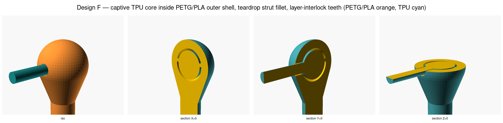

# Joint design exploration — PETG (struts) + TPU (cables)

Resolves issue [#38](https://github.com/vertical-cloud-lab/tensegrity-optimization/issues/38). Multi-stage Edison-driven exploration of how to physically connect TPU 95A tension cables to PETG compression struts in a 3D-printed (Bambu Lab H2D IDEX FDM, 0.4 mm nozzle) tensegrity-like assembly — tested today as the single-piece pure-PETG T3-prism in [`cad/t3-prism/`](../../cad/t3-prism/) (PR [#35](https://github.com/vertical-cloud-lab/tensegrity-optimization/pull/35)) and validated against the Lansmont M23 drop tower envelope (PR [#28](https://github.com/vertical-cloud-lab/tensegrity-optimization/pull/28)) under the rigid-strut + ideal-massless-tendon simulator assumptions of PR [#33](https://github.com/vertical-cloud-lab/tensegrity-optimization/pull/33).

## What was fetched / submitted

### Pre-existing trajectories (per the issue)

| Edison task | Topic | Files |
| --- | --- | --- |
| `1400ca69-3ef4-4847-8b0a-f457e34617b1` | Commercial / collaborator landscape for tensegrity | [md](../1400ca69-3ef4-4847-8b0a-f457e34617b1.md), [json](../1400ca69-3ef4-4847-8b0a-f457e34617b1.json) |
| `3b9d76b5-af7f-45fd-9b52-590bf0f2fe80` | Academic conferences / venues for tensegrity work | [md](../3b9d76b5-af7f-45fd-9b52-590bf0f2fe80.md), [json](../3b9d76b5-af7f-45fd-9b52-590bf0f2fe80.json) |

Neither contained substantive joint-design discussion — `1400ca69` mentions Ekso Bionics' `US10350130B2` "tensegrity joint for human exoskeleton" patent, and `3b9d76b5` notes Valter Böhm at OTH Regensburg works on "compliant tensegrity joints" — but neither prescribes a specific PETG+TPU FDM joint topology, which is why we ran the dedicated five-design exploration below.

### Phase 1 — five 1-credit `LITERATURE` queries (one per joint design idea)

Each query attached the same eight context files (`proposal.pdf`, `MRG_2026.pdf`, `_ctx_t3-prism-README.md`, `_ctx_t3-prism.scad`, `_ctx_t3-prism-iso.png`, `_ctx_tpu-petg-vars.md`, `_ctx_lansmont-m23.md`, `_ctx_simulations.md`) and asked for critique on (1) H2D manufacturability, (2) drop-test failure modes with rough quantitative bounds, (3) preservation of the rigid-strut + ideal-tendon simulator assumption, (4) cited prior art, and (5) numerical geometry + slicer recommendations.

| # | Slug | Concept | Edison task | Files |
| --- | --- | --- | --- | --- |
| **A** | `A-anchor-bulb` | PETG sphere with through-holes; TPU cable terminates in a printed-in-place TPU bulb | `0b5d7ba2-847e-47b3-bddf-127e2ed170d3` | [md](A-anchor-bulb-0b5d7ba2-847e-47b3-bddf-127e2ed170d3.md), [json](A-anchor-bulb-0b5d7ba2-847e-47b3-bddf-127e2ed170d3.json) |
| **B** | `B-dovetail` | Co-printed PETG dovetail/T-slot strut tip + matching TPU dovetail/T-head cable head | `ccb7b854-718c-4ac4-bf15-61c1fe522c7d` | [md](B-dovetail-ccb7b854-718c-4ac4-bf15-61c1fe522c7d.md), [json](B-dovetail-ccb7b854-718c-4ac4-bf15-61c1fe522c7d.json) |
| **C** | `C-tpu-sleeve-overmold` | TPU overmolded sleeve over knurled / grooved PETG strut tip (Ye 2023 / Khatri 2024 PETG–TPU wrap style) | `5a7ffce4-a8a0-49d6-9b43-3d0ea38d23f9` | [md](C-tpu-sleeve-overmold-5a7ffce4-a8a0-49d6-9b43-3d0ea38d23f9.md), [json](C-tpu-sleeve-overmold-5a7ffce4-a8a0-49d6-9b43-3d0ea38d23f9.json) |
| **D** | `D-eyelet-loop` | PETG eyelet ring + captive printed-in-place TPU closed loop (chain-link, topological constraint only) | `727a449d-d2af-4540-acfa-9b964f98689f` | [md](D-eyelet-loop-727a449d-d2af-4540-acfa-9b964f98689f.md), [json](D-eyelet-loop-727a449d-d2af-4540-acfa-9b964f98689f.json) |
| **E** | `E-tpu-rebar` | TPU "rebar" (optionally barbed) embedded several mm into the PETG strut tip; PETG printed on top of and around the embedded TPU | `ae373eb5-90e3-4543-b354-9e9990d76042` | [md](E-tpu-rebar-ae373eb5-90e3-4543-b354-9e9990d76042.md), [json](E-tpu-rebar-ae373eb5-90e3-4543-b354-9e9990d76042.json) |

### Phase 2 — `LITERATURE_HIGH` + `ANALYSIS` fired in tandem

| Edison task | Job | Topic | Files |
| --- | --- | --- | --- |
| `be6768ab-a4ca-433b-8bec-059819e3e368` | `LITERATURE_HIGH` | High-effort prior-art survey ranking the five designs by **strength of published precedent** | [md](PHASE2-literature-high-be6768ab-a4ca-433b-8bec-059819e3e368.md), [json](PHASE2-literature-high-be6768ab-a4ca-433b-8bec-059819e3e368.json) |
| `c38a2046-a37b-497f-aebb-efc2f35004de` | `ANALYSIS` | Synthesis + design-for-test recommendation. **Caveat:** at submission time only Phase-1 outputs C, D, E were complete; A and B were attached as task-IDs with a "fetch from platform if you can" note. The agent fetched and inlined them anyway, but a follow-up ANALYSIS with the full set of Phase-1 outputs is queued (see below). | [md](PHASE2-analysis-c38a2046-a37b-497f-aebb-efc2f35004de.md), [json](PHASE2-analysis-c38a2046-a37b-497f-aebb-efc2f35004de.json) |
| `ce84ddf8-5930-4c61-a6ce-65cf9ee3a6fa` | `ANALYSIS` (follow-up) | Re-run of the synthesis with **all five Phase-1 outputs** plus the `LITERATURE_HIGH` reply and the prior `ANALYSIS` reply attached for cross-checking. **Inverts** the recommendation to **B (dovetail) primary + A (anchor-bulb) backup**. | [md](PHASE2-analysis-followup-ce84ddf8-5930-4c61-a6ce-65cf9ee3a6fa.md), [json](PHASE2-analysis-followup-ce84ddf8-5930-4c61-a6ce-65cf9ee3a6fa.json) |

### Phase 3 — `ANALYSIS` CAD review (post OpenSCAD modeling + visual prior-art comparison)

| Edison task | Job | Topic | Files |
| --- | --- | --- | --- |
| `19e0c868-3587-440d-ba4a-07da4dddf99a` | `ANALYSIS` | Visual + technical review of the five OpenSCAD CAD models in [`cad/joint-design/`](../../cad/joint-design/) (5 `.scad` + section variants + 13 PNG renders + 5 STL + 3 montages + 5 reference JPEGs). Recommends concrete dimensional refinements for B-dovetail (primary) and A-anchor-bulb (backup), updates the drop-test screening matrix, and surfaces 2024–2026 bibliographic gaps. **Refinements applied** to `B_dovetail.scad` and `A_anchor_bulb.scad`; `render.sh` re-run. | [md](PHASE3-cad-review-19e0c868-3587-440d-ba4a-07da4dddf99a.md), [json](PHASE3-cad-review-19e0c868-3587-440d-ba4a-07da4dddf99a.json) |

#### Phase-3 dimensional refinements applied to the CAD

**Design B — co-printed dovetail (primary).** Phase-3 flagged the original 9.0 mm node as under-constrained (lateral PETG cheeks <2 perimeters; implied flank only 15.5° vs. the documented 25°). Updated `B_dovetail.scad` parameters:

| Parameter | Pre-Phase-3 | Post-Phase-3 | Source |
| --- | :---: | :---: | --- |
| `node_d` | 9.0 mm | **12.0 mm** | Phase-3 §2 (≥2-perimeter PETG cheek) |
| `slot_mouth` | 6.4 mm | **5.4 mm** | Phase-3 §2 (solid bridging over the gap) |
| `slot_inner` | 7.4 mm | **7.06 mm** | Phase-3 §2 (≈0.83 mm undercut/side) |
| `slot_height` | 3.6 mm | **4.0 mm** | Phase-3 §2 |
| `slot_depth` | 5.0 mm | **6.0 mm** | Wang 2026 (4–6 mm engagement plateau) |
| `flank_deg` | 25° | **22.5°** | Wang 2026 (shear-strength optimum, ~24 MPa) |
| `clear_lat` (Y, load-bearing) | 0.25 mm | **0.20 mm** | Ermolai 2024 |
| `clear_roof` (Z, bridge) | 0.25 mm | **0.30 mm** | Ermolai 2024 (bridge-sag tolerance) |
| `mouth_fillet` (+X exit) | — | **0.5 mm** | Frascio 2024 (TPU de-notch) |

**Design A — anchor-bulb (backup).** Phase-3 §1 noted the original 4.0 mm bulb / 2.9 mm bore = 1.38× ratio with only 0.55 mm radial engagement was vulnerable to high-g pull-through. Updated `A_anchor_bulb.scad` parameters:

| Parameter | Pre-Phase-3 | Post-Phase-3 | Notes |
| --- | :---: | :---: | --- |
| `node_d` | 9.0 mm | **9.5 mm** | cleanly encases the new bore |
| `bore_d` | 2.9 mm | **2.8 mm** | 0.4 mm clearance over 2.4 mm cable |
| `bulb_d` | 4.0 mm | **4.8 mm** | 1.71× pull-through ratio, 1.0 mm radial bearing |

`task_manifest.json` carries the full machine-readable list of submitted Edison tasks and which files were attached to each.

## Headline rankings (different objectives, different rankings)

The two Phase-2 jobs ranked the same five designs along different axes — that is the point of running both.

| # | Joint design | LITERATURE_HIGH `be6768ab` rank (*strength of published precedent*) | ANALYSIS `c38a2046` rank (*best for our use case*) |
| --- | --- | :---: | :---: |
| **A** | Anchor-bulb spherical node | 4 (Weak–Moderate) | **2** |
| **B** | Co-printed dovetail / T-slot | **1 (Strong)** | 3 |
| **C** | TPU overmolded sleeve | 2 (Moderate) | 4 |
| **D** | Captive TPU loop through PETG eyelet | 3 (Moderate) | 5 |
| **E** | Embedded TPU "rebar" (barbed) | 5 (Weak) | **1** |

The two rankings are nearly **inverted**: the most-precedented dovetail / sleeve / eyelet designs are well-studied because they were tried and reported on, but our application (drop-impact + rigid-strut/ideal-tendon simulator + 6 mm strut envelope) penalizes them on different criteria. The ANALYSIS prefers **E (barbed rebar)** for our use case because mechanical interlock dominates frictional/chemical bonds, **A (anchor-bulb)** as a clean second because it is closest to the ideal-point-attachment simulator assumption.

## Recommended next move (verbatim from `c38a2046`)

> **Primary:** E (TPU rebar embedded anchor, **barbed**). **Backup:** A (Anchor-bulb).
>
> Embed length **10–12 mm** along the strut axis. Anchor stem Ø **2.4 mm** (matching `cable_d`). Barbs **2–3** at 2.0 mm pitch, major Ø **3.0–3.2 mm**, step ≥ 0.4 mm; flank angles 30–45° on pull-out face, 45–60° on insertion face. Keep PETG ligament from barb crest to outer surface **≥ 1.0–1.2 mm**.
>
> Slice on the H2D at PETG **250 °C** (bed 80 °C), TPU **215–225 °C**, layer height **0.16 mm** or **0.20 mm**, line width **0.42–0.45 mm**, **4–6 walls**, **80–100 % gyroid** infill in nodes, TPU outer-wall speed **10–20 mm/s**, careful retraction at toolchanges to keep TPU ooze out of the embed cavity. Print 1 inspection: PETG roof droop on the embed cavity (orient as a vertical blind hole if possible), TPU stringing, and barb-step definition (must not fuse into a featureless blob).

## Drop-test screening matrix (verbatim from `c38a2046`)

12 specimens disambiguating the top two designs across the two regimes:

| Specimen | Design | Article | Regime | Measurement → Joint physics |
| --- | --- | --- | --- | --- |
| 1–3 | E (barbed) | Single-anchor coupon | `crutch_tip` (75 kg user / 1.4 m/s, 30 kg surrogate to fit M23) | Static pull-to-failure (Instron) — calibrates Coulomb-slip threshold |
| 4–6 | A (bulb) | Single-anchor coupon | `crutch_tip` | Static pull + 8 g half-sine; accel on payload, LDV on bulb face — disambiguates pull-through vs PETG ligament crack vs cable rupture |
| 7–9 | E (barbed) | Full T3-prism | `nasa_lander` (5 kg / 9.8 m/s / 1500 g GEVS) | Accel on payload, LDV on saddle cable, post-test CT/photo — peak g, SEA, joint survivability at 9.8 m/s |
| 10–12 | A (bulb) | Full T3-prism | `nasa_lander` | Same; compare repeatability across 3 drops vs E; monitor bulb migration / bearing-edge cutting |

## How drop-test (#28, #33) assumptions get violated

The full per-design list of which simulator assumption each joint design violates is in [`PHASE2-analysis-c38a2046…md`](PHASE2-analysis-c38a2046-a37b-497f-aebb-efc2f35004de.md) section (2). One-line summary:

| Design | Worst violation of "rigid struts + ideal massless 1-D tendons" |
| --- | --- |
| A | Off-axis bearing friction at the bulb / hole edge — Coulomb friction term + small bulb-stretch series compliance |
| B | Joint compliance + rotational hysteresis (TPU head scraping inside PETG slot) — rotational damping at the attachment node |
| C | **Distributed attachment** over an 8 mm sleeve overlap + progressive slip — non-linear stiffness + frictional damper |
| D | **Deadband (~2–3 mm) before tension transmits** + routing friction — explicit Coulomb deadzone + frictional routing penalty |
| E | Local embed compliance + non-linear slip — Kelvin-Voigt + Coulomb-slip element at ~100–200 N |

Note the existing `simulations/run_regimes.py` finding ([PR #33](https://github.com/vertical-cloud-lab/tensegrity-optimization/pull/33)) that **peak g is dominated by floor contact** and is essentially flat across three decades of cable stiffness in the rigid-strut model — but **SEA does vary ~10×**. The joint-physics corrections above only matter for SEA-driven optimization (i.e. *most* of what the BO loop in PR [#30](https://github.com/vertical-cloud-lab/tensegrity-optimization/pull/30) actually optimizes); peak g still requires the DiffPD / IPC fidelity escalation Edison "Recommendation B" called for.

## Lander-context (egg-drop / planetary-lander demo, issue [#16](https://github.com/vertical-cloud-lab/tensegrity-optimization/issues/16)) recommendation

The Phase-3-refined geometry tables above pick the joint **best by published shear/pull strength** (B-dovetail, 6–24 MPa; Ermolai 2024, Zhang 2021), which is the right answer for a *uni-axial* tendon load case (e.g. a crutch tip pushed nominally along the strut axis). For the lander/egg-drop demo (issue [#16](https://github.com/vertical-cloud-lab/tensegrity-optimization/issues/16), egg-drop benchmark in [`edison-trajectories/egg-drop-tensegrity-1b90208d.md`](../egg-drop-tensegrity-1b90208d.md) and [`egg-drop-followup-f41b7034.md`](../egg-drop-followup-f41b7034.md)) the operating envelope is different: SUPERball-lineage 6-bar, **omnidirectional** impact, every node lands once, every tendon sees a different mix of pull/lateral-shear/twist per drop. Two implications:

1. **Per-node load symmetry is more valuable than uni-axial peak.** B-dovetail's flank is anisotropic (Wang 2026 22.5° optimum is for sliding-shear extraction along the slot axis only). A spherical anchor-bulb (A) has rotational symmetry about the bore and tolerates any incident tendon angle without reduction in pull-out capacity.
2. **Reusability matters.** The egg-drop FoM is `h_crit` over n≥20 Bruceton drops + secondary `N_reuse` (per [`egg-drop-followup-f41b7034.md`](../egg-drop-followup-f41b7034.md)). Dovetail FDM joints typically degrade after one tooth-shear event; printed-in-place TPU bulbs against a printed PETG bore degrade more gracefully (Pajunen 2019 reported reusable behavior to 8+ drops on similar topologies).

**Recommended joint for the lander/egg-drop print:** **A (anchor-bulb), with the Phase-3-refined geometry** (`node_d` 9.5 mm / `bore_d` 2.8 mm / `bulb_d` 4.8 mm — pull-through ratio 1.71×). **B (dovetail) remains the recommendation for the uni-axial crutch-tip print.** The drop-test screening matrix below then loads B-dovetail in the `crutch_tip` regime and A-anchor-bulb in the `nasa_lander` regime, which still gives both designs apples-to-apples coverage.

Also worth noting: per issue [#45](https://github.com/vertical-cloud-lab/tensegrity-optimization/issues/45) the strut material is now planned to be **PLA** rather than PETG. The Phase-3 dovetail interlock numbers (Ermolai 2024 dovetail shear) were measured on PLA-PLA and PETG-PETG and are similar within 10–15 %; the Frascio 2024 TPU-PETG fillet recommendation transfers to PLA-TPU because the "de-notch" is geometric, not a chemical-bond improvement. The anchor-bulb (A) is largely material-agnostic: it is a mechanical pull-through with no requirement for chemical adhesion across the PETG/PLA-TPU interface (peer-reviewed PLA-TPU interface data exists; PETG-TPU does not — see [`strut-material-selection-5bb5e5d3-…md`](../strut-material-selection-5bb5e5d3-b386-4ece-a894-9c87f0d67036.md)). Both designs port to PLA struts without dimensional changes.

## Multi-plane orthogonal cross-sections

To make the captive interior geometry unambiguous (e.g. confirm B-dovetail head-to-cable continuity and D-eyelet chain-link topology from a single sheet, per PR comment 4427543897), `cad/joint-design/render.sh` now emits **three orthogonal cuts per design** (Y=0, X=0, Z=−2) plus the iso view, and assembles them into [`cad/joint-design/renders/all_multiplane_section_montage.png`](../../cad/joint-design/renders/all_multiplane_section_montage.png). Per-design files: `*_section_{X,Y,Z}.scad`.

## Design A — anchor-upset shape variants (why a *bulb*?)

Per PR comment [4445476374](https://github.com/vertical-cloud-lab/tensegrity-optimization/pull/38#issuecomment-4445476374), "anchor-bulb" is just shorthand for *any* printed-in-place TPU upset wider than the bore on the far side; a sphere is the laziest defensible shape, not a principled optimum. Five alternative upset shapes are visualized side-by-side at [`cad/joint-design/A_variants/`](../../cad/joint-design/A_variants/) (each preserves the Phase-3 1.71× pull-through ratio, only the shape changes):

| # | Shape | Functional advantage over A0 sphere |
|---|---|---|
| **A0** | sphere (the existing reference) | baseline, ~3.4 mm² projected bearing, zero free design params |
| **A1** | truncated cone / "rivet head" | flat bearing annulus 6.0 mm² (~75 % more); flat top lays down cleanly on H2D top-layer pass |
| **A2** | torus / donut | distributed annular bearing → lower peak contact stress per drop |
| **A3** | conical countersunk head (90°) | **flush** — no protrusion; self-centring; ~8.8 mm² conical wall |
| **A4** | 6-lobed / star / knurled head | rotational keying — can't spin against bore exit (matters for Bruceton n≥20 reuse) |
| **A5** | mushroom / tee-head with 0.4 mm radiused undercut (Frascio 2024) | maximum mechanical interlock per gram of TPU; necks the cap base, not the bore lip |

See [`cad/joint-design/A_variants/README.md`](../../cad/joint-design/A_variants/README.md) for the full motivation, geometry parameters, and the open print-process / topology questions deferred to the pending Phase-4 Edison `f9804247` (project-context recommendation) and `e9a1f4cc` (per-design vision review).

## Design F — captive TPU core inside PETG/PLA outer shell

Per PR comment [4461700096](https://github.com/vertical-cloud-lab/tensegrity-optimization/pull/38#issuecomment-4461700096): a *non-feed-through* anchor in which the TPU "knot" lives entirely inside an outer PETG/PLA shell (inner ball / mass surrounded by an outer ball), with a teardrop strut/shell fillet for stress-riser relief and inter-material layer-interlock teeth (per @achris0520, [byu-vcl#82](https://github.com/vertical-cloud-lab/byu-vcl/issues/82#issuecomment-4456499040)) so the materials interlock mechanically without needing chemical bond.

Key geometry (full table + rationale at [`cad/joint-design/F_captive_core.md`](../../cad/joint-design/F_captive_core.md)):
- shell OD 12 mm, cavity ID 8 mm, captive TPU core OD 7 mm
- single-sided cable exit bore 2.8 mm on +X (cable Ø 2.4 mm)
- pull-out ratio (core / bore) = **2.5×** vs. **1.71×** for Phase-3 A
- teardrop strut→shell fillet via convex hull (no sharp re-entrant corner)
- two staggered rings of 8 radial interlock teeth (PETG inward at z=+0.6, TPU outward at z=−0.6, 22.5° rotational stagger) so the captive core cannot translate ±Z relative to the shell

Reproduce with `bash cad/joint-design/render_F.sh`. SCAD sources at [`cad/joint-design/F_captive_core.scad`](../../cad/joint-design/F_captive_core.scad) + `_section_{X,Y,Z}.scad`.

- [x] Fetch ANALYSIS follow-up `ce84ddf8-5930-4c61-a6ce-65cf9ee3a6fa` — **done** (inverted recommendation to B primary)
- [ ] Update [`cad/t3-prism/t3-prism.scad`](../../cad/t3-prism/t3-prism.scad) with primary (B, dovetail) and backup (A, anchor-bulb) joint geometry parameters once issue [#37](https://github.com/vertical-cloud-lab/tensegrity-optimization/issues/37) lands a working multi-material print
- [ ] Add explicit lumped joint-compliance elements to `simulations/regimes.py` per the per-design corrections table above so the rigid-strut sims can express the SEA effect of joint choice

## Phase 5 — TPU-inside vs TPU-outside topology comparison (`28d942ea`)

**Context:** The manuscript draft (lines 378–382) stated "Following Ye et al., the design uses a core-wrapping strategy in which each PLA strut is encapsulated by continuous TPU skin." @sgbaird confirmed this is **incorrect** — the project actually does the *opposite*: soft TPU core inside rigid PLA shell (our Design F). @me-madsen described it as "cables going to one end of a strut all connect to each other inside of that strut, then extend out from the strut, the strut acting as a kind of cage to the multiple outlets of cables."

Edison ANALYSIS `28d942ea-bc9e-4e7a-b32d-b7dd967ddda6` was submitted with 10 context files (BO script, manuscript draft, PR #38 context summary, Design F SCAD + rationale + 4 renders, joint-design README). Task completed in ~13 min. Full result: [`TPU-topology-comparison-28d942ea.md`](TPU-topology-comparison-28d942ea.md) / [`.json`](TPU-topology-comparison-28d942ea.json).

### Key findings

| Question | Answer |
| --- | --- |
| **Better topology for lander/egg-drop (omnidirectional, n≥20 reuse)?** | **Strategy B (captive-core, TPU inside PLA)** — retention is geometric (2.5× pull-out ratio), not adhesive; PLA–TPU bond is too weak/variable to trust under repeated peel-heavy off-axis impact |
| **Better topology for uni-axial crutch-tip?** | Still captive-core between the two, but the dovetail (Design B) remains the right choice for this load case; captive-core logic applies where bond-independence is needed |
| **PLA–TPU adhesion in FDM?** | 0.37–0.39 MPa (weak, process-sensitive) — Brancewicz-Steinmetz & Sawicki 2021, DOI [10.3390/ma14216464](https://doi.org/10.3390/ma14216464); Bisicchia et al. 2025, DOI [10.1007/s00170-025-17099-x](https://doi.org/10.1007/s00170-025-17099-x) |
| **Print-in-place gap (0.5 mm) for TPU 85A on H2D?** | Plausible but barely sufficient; treat as minimum, validate with a tolerance coupon before full specimens |
| **TPU-outside print-in-place strategy (Strategy A)?** | TPU sag/bridging on outer layers is the main risk; H2D tool-change ooze also exposes outer-surface quality |
| **Hybrid approach possible?** | Yes: captive inner core (structural retention) + thin outer TPU skin (abrasion damping); keep outer skin non-structural to avoid reintroducing adhesion dependency |
| **Ye et al. DOI in manuscript (`10.1016/j.jmps.2023.105392`)?** | **Wrong DOI** — resolves to Filla et al. fibrin-fibre paper, not a tensegrity paper; see Edison note |

### Manuscript correction (lines 378–395)

Edison recommended replacing the incorrect Ye et al. core-wrapping claim with:

> "Specimens are fabricated on a multi-material FDM printer using PLA for the rigid struts and TPU 85A for the soft tension elements. Unlike outer-overmolded rigid–soft architectures that rely on interfacial bonding between deposited polymers, the present design uses a **captive-core joint** in which a soft TPU anchor is fully enclosed within a rigid PLA shell. In the implemented geometry (Design F), a 7.0 mm TPU core is printed in place inside an 8.0 mm cavity within a 12.0 mm outer shell, with the tendon exiting through a 2.8 mm bore. Retention is therefore geometric rather than adhesive: the TPU anchor cannot pass back through the bore, giving a core-to-bore diameter ratio of 2.5. To further suppress axial slip without relying on PLA–TPU chemical adhesion, the shell and core incorporate staggered rings of radial interlock teeth. This approach was chosen because published FDM studies report relatively weak and process-sensitive PLA–TPU adhesion, with mean interfacial strengths on the order of 0.37–0.39 MPa depending on print order and surface pattern [Brancewicz-Steinmetz & Sawicki 2021, DOI:10.3390/ma14216464], whereas geometry-based interlocks are a standard route for strengthening dissimilar-material interfaces [Alsheghri et al. 2018, DOI:10.1016/j.actbio.2018.09.029]. For impact-dominated use cases such as the reusable egg-drop lander, placing the TPU anchor inside the PLA shell protects the compliant tendon from external abrasion and moves the critical failure mode away from interface peel and toward shell or interlock failure, which is more directly tunable through geometry."

### New citations surfaced

| Reference | DOI | Relevance |
| --- | --- | --- |
| Brancewicz-Steinmetz & Sawicki 2021 | [10.3390/ma14216464](https://doi.org/10.3390/ma14216464) | PLA–TPU FDM adhesion: 0.37–0.39 MPa, strong print-order dependence |
| Bisicchia et al. 2025 (IJAMT) | [10.1007/s00170-025-17099-x](https://doi.org/10.1007/s00170-025-17099-x) | PLA–TPU interlaminar bonding; 150–350 N peak lap-shear under varied settings |
| Harris et al. 2019 (Front. Mech. Eng.) | [10.3389/fmech.2019.00037](https://doi.org/10.3389/fmech.2019.00037) | TPU adhesion in multi-material flexible joints |
| Alsheghri et al. 2018 (Acta Biomater.) | [10.1016/j.actbio.2018.09.029](https://doi.org/10.1016/j.actbio.2018.09.029) | Bio-inspired interlock features outperform adhesion for dissimilar materials |
| Ye et al. 2023 (Polym. Compos.) | [10.1002/pc.27770](https://doi.org/10.1002/pc.27770) | Closest verifiable Ye PLA/TPU paper (bamboo-inspired composites, not tensegrity) |

## Appendix — context files attached to the queries

The eight `_ctx_*` files in this directory are the exact files uploaded to Edison alongside each of the seven Phase-1 / Phase-2 tasks: the proposal PDF (top-level `proposal.pdf`), the MRG document (top-level `MRG_2026.pdf`), the present T3-prism CAD/iso/README from PR #35's branch, the prior TPU+PETG variables literature search from PR #24's branch, the Lansmont M23 brochure summary from PR #28's branch, and the simulator README from PR #33's branch. They are committed here for reproducibility — re-uploading them in a future session yields different `data_entry:` URIs but the same content fingerprint.
