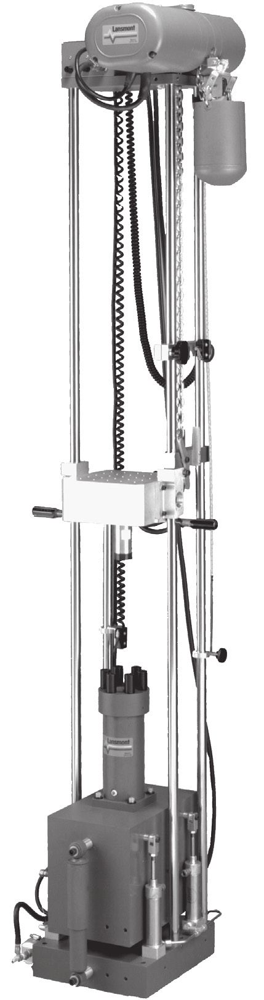

# Lansmont Model 23 Shock Test System

Programmable free-fall shock tester ("drop tower") that Jeff (@Jeffrayhill1) has
identified as the impact instrument we will use for this project (issue [#27][i27]).

## Stock photo

(Vendor product photo of the M23 with TouchTest Shock II controller, extracted
from the official Oct-2025 data sheet PDF. Full provenance and licensing in
[`images/SOURCES.md`](images/SOURCES.md).)

## Datasheets in this folder

- [`Lansmont_M23_Shock.pdf`](Lansmont_M23_Shock.pdf) — the M23 brochure
  Jeff attached to issue [#27][i27c] (`4.6.20` revision).
- [`M23_Data_Sheet_official.pdf`](M23_Data_Sheet_official.pdf) — current M23
  data sheet pulled from Lansmont's website
  ([`M23 Data Sheet.pdf`](https://www.lansmont.com/sites/default/files/2025-10/M23%20Data%20Sheet.pdf),
  Oct 2025 revision).

## Specifications (from the data sheet)

| | |
| --- | --- |
| Max. acceleration | 5,000 g |
| Min. pulse duration | 0.25 ms (half-sine) |
| Max. velocity change | 24 – 32 ft/s (7.3 – 9.7 m/s) |
| Max. payload | 80 lb (36 kg) |
| Standard pulse waveform | Half-sine |
| Optional pulse waveforms | Trapezoidal, Terminal Peak Sawtooth (require optional programmer) |
| Table size | 9.06 × 9.06 in (23 × 23 cm) |
| Machine envelope (H × S × F) | 96 – 120 × 21 × 24 in (244 – 305 × 53 × 61 cm) |
| Controller | TouchTest™ Shock II Table Top Control Console |
| Compatible DAQ | Lansmont Test Partner |
| Pneumatic | Plant air 90 psi (6.2 bar); nitrogen 1000 – 2000 psi (69 – 138 bar) for optional DB Programmer |
| Mains power (machine) | 200 – 240 VAC 3Φ @ ≥ 4 A, or 380 – 480 VAC 3Φ @ ≥ 2 A |
| Mains power (controller) | 100 – 120 VAC 1Φ @ ≥ 1 A, or 200 – 240 VAC 1Φ @ ≥ 1 A |

(See the PDFs above for the authoritative figures; values transcribed
2026-05-08 from `Lansmont_M23_Shock.pdf`.)

## Vendor links

- Product page: <https://www.lansmont.com/products/shock-testers/model-23>
- Vendor training & support: <https://www.lansmont.com/services/training>
- DirectIndustry catalogue listing:
  <https://www.directindustry.com/prod/lansmont/product-4594477-2634981.html>

## Tutorials and operating videos

The vendor maintains the bulk of operator training behind their
support / training program (see vendor training link above). Public videos
covering the M23 and its TouchTest Shock controller can be found by searching
the vendor's YouTube channel and the controller name:

- Lansmont on YouTube: <https://www.youtube.com/@LansmontCorporation>
- Search query: <https://www.youtube.com/results?search_query=Lansmont+Model+23+TouchTest+Shock>

(Specific video URLs intentionally not enumerated here — they will be added once
each one has been individually verified, to avoid linking moved/replaced uploads.)

## Standards typically run on this class of equipment

The M23 is the workhorse for ASTM packaging cushion-curve and shock-pulse
generation tests. The relevant ASTM standards we may want to align our protocol
with include D1596 (cushioning materials, dynamic shock), D4168 (transmitted
shock characteristics of foam-in-place), D5276 (drop test of loaded containers
by free fall), and D6537 (instrumented package shock testing). These are the
canonical Lansmont use cases and will be cross-checked against the literature
survey (see `literature.md`).

## Literature

See [`literature.md`](literature.md) for the highlights of the Edison
`LITERATURE_HIGH` survey (task `1a0f4a70-3297-44d1-860a-dfcdd551e561`,
2026-05-08), and
[`../../edison-trajectories/2026-05-08-equipment-m23-qtec-1a0f4a70.md`](../../edison-trajectories/2026-05-08-equipment-m23-qtec-1a0f4a70.md)
for the full verbatim answer.

[i27]: https://github.com/vertical-cloud-lab/tensegrity-optimization/issues/27
[i27c]: https://github.com/vertical-cloud-lab/tensegrity-optimization/issues/27#issuecomment-4408498939
