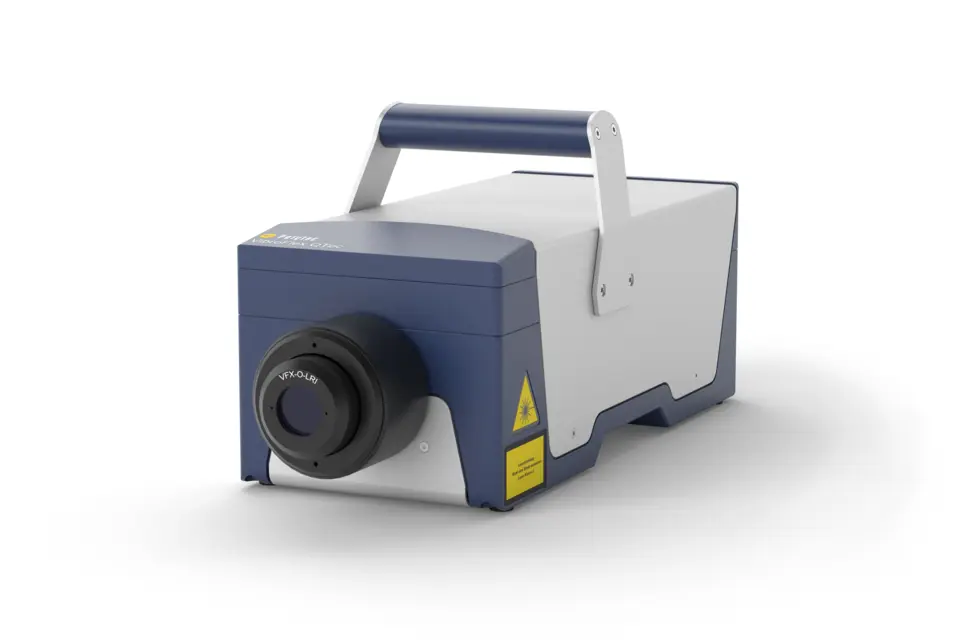
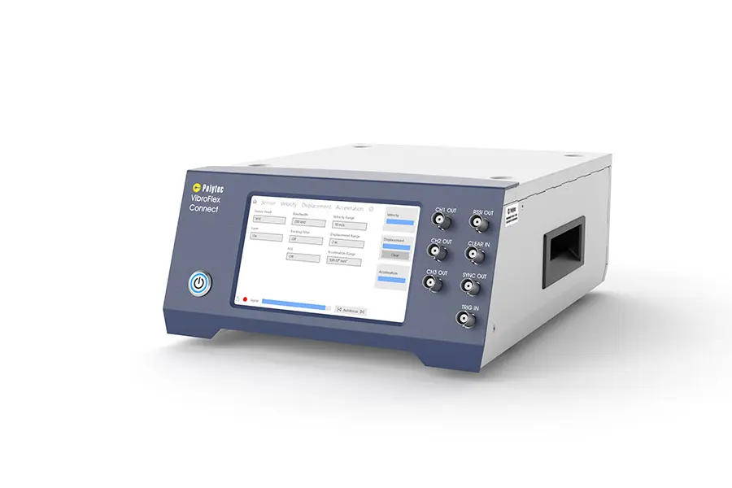
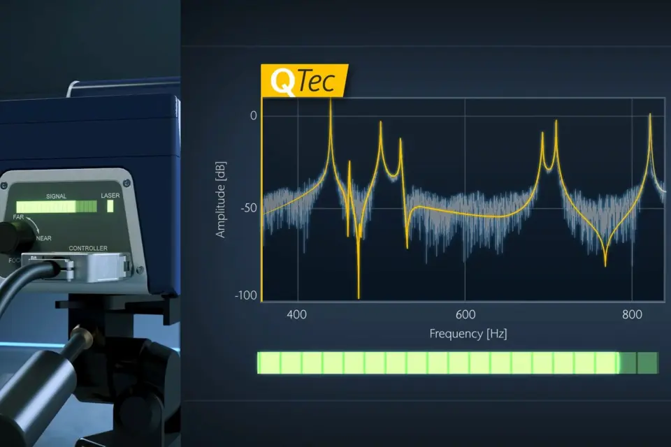
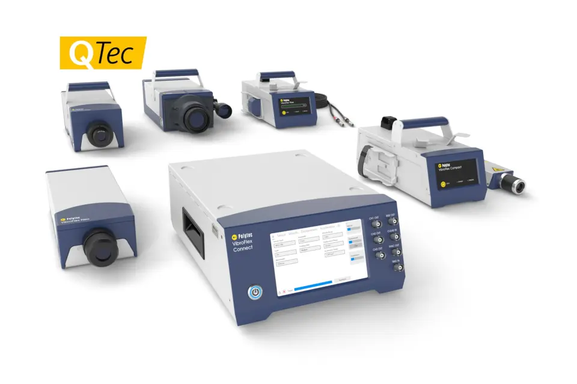

# Polytec QTec single-point Laser Doppler Vibrometer

Non-contact, single-point laser Doppler vibrometer (LDV) that Jeff
(@Jeffrayhill1) has identified as the transient-velocity / modal sensor for this
project (issue [#27][i27], [Jeff's confirmation][i27c]). Sterling noted in the
issue thread that the unit is a 100 kHz laser vibrometer.

The "QTec" branding refers to Polytec's patented multi-path (multi-detector)
heterodyne interferometer, which gives a much better SNR than conventional
single-detector LDVs on dark, rough, curved, biological, or otherwise
"difficult" surfaces. Single-point QTec heads are sold under the
**VibroFlex QTec** product line.

## Stock photos

| | |
| --- | --- |
|  |  |
| VFX-I-160 single-point QTec sensor head | VibroFlex Connect VFX-F-110 front end |
|  |  |
| QTec multipath interferometry — SNR advantage | VibroFlex modular family overview (2024) |

(Vendor stock images from Polytec's public product website. Full provenance and
licensing in [`images/SOURCES.md`](images/SOURCES.md).)

## Datasheet in this folder

- [`Polytec_Datasheet_VibroFlex_QTec.pdf`](Polytec_Datasheet_VibroFlex_QTec.pdf)
  — official VibroFlex QTec datasheet
  (mirror at <https://www.acoutronic.se/pdf/vibration/Polytec_Datasheet_VibroFlex%20QTec.pdf>).

## Key specifications (typical for our 100 kHz configuration)

The VibroFlex QTec is a modular system; the figures below are the catalog
ranges from the data sheet above. The unit on site is the **100 kHz**
bandwidth configuration; verify the exact velocity range / decoder card with
Jeff before designing experiments.

| | |
| --- | --- |
| Sensor family | Polytec VibroFlex QTec single-point LDV |
| Bandwidth (our unit) | 100 kHz (other configurations available up to 24 MHz) |
| Velocity range | up to ±30 m/s (decoder dependent) |
| Displacement resolution | sub-picometer (≈0.05 pm in best configuration) |
| Measurement laser | invisible IR, 1550 nm, < 10 mW |
| Targeting laser | green, 520 ± 10 nm, < 1 mW |
| Laser safety class | Class 2 |
| Stand-off distance | ≈3 mm to ≈100 m, lens & surface dependent |
| Operating temperature | +5 °C to +40 °C |
| Front-end / controller | VibroFlex Connect |

(Values transcribed 2026-05-08 from the data sheet PDF and the Polytec
VibroFlex product page; treat the PDF as the source of truth.)

## Vendor links

- Product family: <https://www.polytec.com/en/vibrometry/products/single-point-vibrometers/vibroflex>
- QTec technology overview: <https://www.polytec.com/en/vibrometry/know-how/qtec>
- QTec FAQ: <https://www.polytec.com/en/vibrometry/know-how/qtec/faq>
- Polytec applications portal: <https://www.polytec.com/us/solutions/applications>

## Tutorials and demo videos

- Polytec official YouTube channel: <https://www.youtube.com/@PolytecGmbH>
- Search query (VibroFlex QTec): <https://www.youtube.com/results?search_query=Polytec+VibroFlex+QTec>

(Specific video URLs intentionally not enumerated here — they will be added once
each one has been individually verified, to avoid linking moved/replaced
uploads.)

## How we plan to use it

Pairing the QTec with the [Lansmont M23](../lansmont-m23/) drop tower lets us
record the *transient surface velocity* of the impacted face of a printed
tensegrity / lattice specimen at full bandwidth, without contacting the
specimen — useful both for energy-dissipation estimates and for picking up the
high-frequency content that would be smeared out by a contact accelerometer on
soft TPU.

## Literature

See [`literature.md`](literature.md) for the highlights of the Edison
`LITERATURE_HIGH` survey (task `1a0f4a70-3297-44d1-860a-dfcdd551e561`,
2026-05-08), and
[`../../edison-trajectories/2026-05-08-equipment-m23-qtec-1a0f4a70.md`](../../edison-trajectories/2026-05-08-equipment-m23-qtec-1a0f4a70.md)
for the full verbatim answer.

[i27]: https://github.com/vertical-cloud-lab/tensegrity-optimization/issues/27
[i27c]: https://github.com/vertical-cloud-lab/tensegrity-optimization/issues/27#issuecomment-4408498939
