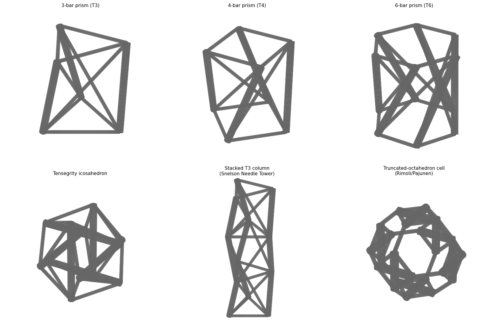
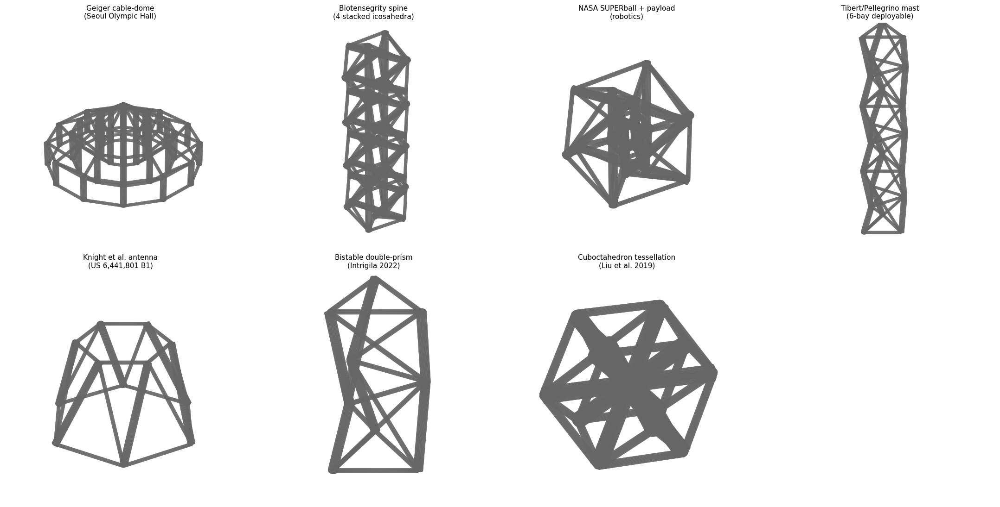

# Tensegrity reference designs / models

This directory collects **3D models for canonical tensegrity structures**
that the MRG project will use as starting points for CAD review,
slicing, FEM import, Bayesian-optimization parameterization, and
fabrication validation.

Closes [#21](https://github.com/vertical-cloud-lab/byu-mentored-research-tensegrity/issues/21).



The 7 additional design families from the Edison literature survey
(cable-domes, biotensegrity, robots, deployable masts, patents, bistable,
cuboctahedron metamaterials) are rendered in
[`figures/tensegrity_models_extended_preview.png`](../figures/tensegrity_models_extended_preview.png):



## Contents

| File | Structure | Nodes | Struts | Cables | Notes |
| --- | --- | ---: | ---: | ---: | --- |
| [`stl/3bar_prism.stl`](stl/3bar_prism.stl)   | 3-bar tensegrity prism (T3, "Snelson simplex") | 6 | 3 | 9 | Smallest non-trivial 3D tensegrity. Twist `θ = π/2 − π/3 = 30°`. |
| [`stl/4bar_prism.stl`](stl/4bar_prism.stl)   | 4-bar tensegrity prism (T4)                    | 8 | 4 | 12 | Twist `θ = π/2 − π/4 = 45°`. |
| [`stl/6bar_prism.stl`](stl/6bar_prism.stl)   | 6-bar tensegrity prism (T6)                    | 12 | 6 | 18 | Twist `θ = π/2 − π/6 = 60°`. Building block for stacked masts. |
| [`stl/icosahedron.stl`](stl/icosahedron.stl) | 6-strut tensegrity icosahedron (Jessen's orthogonal icosahedron / "expanded octahedron") | 12 | 6 | 24 | Strut/cable length ratio `√(8/3) ≈ 1.633`. Used in NASA SUPERball lineage and most "tensegrity-ball" designs. |
| [`stl/stacked_t3_column.stl`](stl/stacked_t3_column.stl) | Stacked 3-bay T3 column (Snelson "Needle Tower" / mast topology) | 12 | 9 | 21 | 3 stacked T3 bays with alternating chirality (Snelson 1968–69; Tibert & Pellegrino deployable masts). |
| [`stl/truncated_octahedron.stl`](stl/truncated_octahedron.stl) | Truncated-octahedron tensegrity (Rimoli/Pajunen unit cell) | 24 | 12 | 36 | Space-tileable energy-absorbing metamaterial cell. Rank-#1 BYU recommendation for impact absorption (Pajunen et al. 2019; Bauer et al. 2021). |
| [`stl/geiger_cable_dome.stl`](stl/geiger_cable_dome.stl) | Geiger radial cable-dome (Seoul Olympic Hall topology) | 73 | 36 | 132 | 3 concentric rings × 12 radial ribs + apex hub. Cable-dome (not pure class-1); per Fu (2005), Geiger US Pat. 4,736,553. |
| [`stl/biotensegrity_spine.stl`](stl/biotensegrity_spine.stl) | Biotensegrity spine (4 stacked Jessen-icosahedron vertebrae) | 48 | 24 | 108 | Levin/Flemons stacked-icosahedron spinal-column model; basis for Berkeley ULTRA-Spine. |
| [`stl/superball_with_payload.stl`](stl/superball_with_payload.stl) | NASA SUPERball with inner payload icosahedron | 24 | 12 | 60 | 6-strut outer + inner mini-icosahedron + 12 payload-suspension cables (SunSpiral et al. 2015). |
| [`stl/tibert_pellegrino_mast.stl`](stl/tibert_pellegrino_mast.stl) | Tibert/Pellegrino deployable mast (6-bay) | 21 | 18 | 39 | Slender alternating-chirality stacked-prism mast (Tibert & Pellegrino, *Int. J. Space Struct.* 2003). |
| [`stl/patent_us6441801_antenna.stl`](stl/patent_us6441801_antenna.stl) | Knight et al. tensegrity antenna (US 6,441,801 B1) | 12 | 6 | 18 | Hexagonal upper platform / hexagonal lower base + 6 strut-tie pairs. Knight, Duffy, Crane US Pat. 6,441,801 B1 (2002). |
| [`stl/bistable_double_prism.stl`](stl/bistable_double_prism.stl) | Bistable double-prism unit cell | 9 | 6 | 15 | Two T3 prisms joined at a shared compliant hinge ring (Intrigila et al., *Add. Manuf.* 2022). |
| [`stl/cuboctahedron_tessellation.stl`](stl/cuboctahedron_tessellation.stl) | Cuboctahedron tessellation cell (simplified) | 13 | 6 | 36 | Single-block representation of Liu et al.'s 13-strut/96-cable bandgap-tunable tessellation (J. Mech. Phys. Solids 2019). |

All STL files are **binary STL**, units in millimetres, with struts
rendered as 5 mm-diameter cylinders (PLA / PETG) and cables rendered
as **2.4 mm-diameter** cylinders (TPU — these are not literal strings;
the eventual fabricated cables are printed in TPU and need a
realistic finite cross-section, matching the cable diameter used in
[`cad/t3-prism/`](../cad/t3-prism/)). Default sizes are chosen to fit
within a typical 200 mm-cube print bed.

## Regenerating the STL files

The geometry is authored from first principles in
[`generate_stl.py`](generate_stl.py) (Python ≥ 3.7, standard library
only — no `numpy`, no `numpy-stl`, no licence encumbrance):

```bash
python models/generate_stl.py
# optional flags:
#   --out-dir models/stl          # output directory
#   --strut-radius 2.5            # strut cylinder radius (mm)
#   --cable-radius 1.2            # cable cylinder radius (mm; ~TPU)
#   --segments 24                 # cylinder facet count
```

The script also exposes `n_bar_prism(n, radius, height)`,
`six_strut_icosahedron(scale)`, `stacked_prism(n, bays, radius,
bay_height)`, `truncated_octahedron_tensegrity(scale)`,
`geiger_cable_dome(n_radial, rings, strut_lengths, apex_height)`,
`biotensegrity_spine(vertebrae, scale, spacing)`,
`superball_with_payload(scale, payload_scale)`,
`tibert_pellegrino_mast(n, bays, radius, bay_height)`,
`patent_us6441801_antenna(n_sides, bottom_radius, top_radius, height)`,
`bistable_double_prism(radius, bay_height)`, and
`cuboctahedron_tessellation(scale)` for direct use as design seeds in
the Bayesian optimization loop (`(nodes, struts, cables)` tuples that
map directly onto the BO parameterization in the proposal).

## Caveats and clarifications needed

The 7 extended-preview families are emitted as **first-principles
parametric STLs reconstructed from the geometric specifications stated
in the cited papers/patents**.  They are intended as topology-correct
visual / FEM-import seeds; for fully validated geometry — especially
prestress states and equilibrium-shape coordinates — the following
source PDFs would be needed (and a domain expert may need to confirm):

- **Geiger cable-dome**: full prestress-state coordinates require
  Geiger's US Pat. 4,736,553 (1988) or Fu (2005).  Best contact:
  Feng Fu (City, Univ. of London) for cable-dome design.
- **Biotensegrity spine / ULTRA-Spine**: detailed inter-vertebral
  cable connectivity and prestress states require Sabelhaus et al.
  IEEE RA-L 5(3):3982-3989 (2020) or the Berkeley ULTRA-Spine repo
  (<https://github.com/BerkeleyExpertSystemTechnologiesLab/ultra-spine-simulations>).
  Best contact: Andrew Sabelhaus (Boston Univ.).
- **NASA SUPERball v2 with payload**: the inner spring-cable count and
  payload-cable routing was reported as "12 inner spring-cable
  assemblies" but the per-node connectivity needs the SunSpiral 2015
  NASA tech report or the NTRT JSON
  (<https://github.com/NASA-Tensegrity-Robotics-Toolkit/NTRTsim>).
- **Tibert/Pellegrino mast**: only topology is reproduced here; the
  full equilibrium-manifold deployment trajectory needs Sultan &
  Skelton (2003) or Bel Hadj Ali et al. (2010).
- **US 6,441,801 B1 (Knight et al. antenna)**: Figs. 2–4 of the
  patent give exact strut/tie ratios and the screw-motion deployment
  schedule; not all variables are determined by topology alone.
- **Bistable double-prism**: the snapping-mechanism hinge
  cross-sections and triggering-force calibration are reported in
  Intrigila et al. *Add. Manuf.* 57:102946 (2022), Figs. 6–9.
- **Cuboctahedron tessellation (Liu et al.)**: the full 13-strut /
  96-cable / 12-prestress-state form-finding requires the Liu et al.
  *J. Mech. Phys. Solids* 131:147–166 (2019) paper and (ideally) the
  tessellation force-density matrix; the STL committed here is a
  **simplified single-block representation** of just the cuboctahedron
  + central tension hub.

If full validated geometries (with form-found coordinates and prestress
states) are needed for any of the above, please flag and either
(a) point at the relevant supplementary material, or
(b) name a contact whose published code we can integrate.

## Literature survey

A high-effort Edison Scientific literature survey of canonical and
non-canonical tensegrity designs (T-bar/D-bar class-k cells, polyhedral
tensegrities, Geiger/Levy cable-domes, Snelson Needle Tower, NASA
SUPERball/ULTRA-Spine, Rimoli/Pajunen truncated-octahedron metamaterial,
Liu et al. cuboctahedron tessellation, bistable double-prism, Levin/
Ingber biotensegrity, deployable masts, and topology-generation methods)
is committed at
[`edison-trajectories/2026-05-09-tensegrity-designs-fad054b3.md`](../edison-trajectories/2026-05-09-tensegrity-designs-fad054b3.md)
along with the structured references file
[`...-references.md`](../edison-trajectories/2026-05-09-tensegrity-designs-fad054b3-references.md)
and the full task JSON. The 3 new designs added in this update
(T6 prism, stacked T3 column, truncated-octahedron cell) are the most
promising buildable additions identified in that survey for the
PETG-strut + TPU-tendon BO workflow.

## Geometric definitions

### n-bar prism (Tn)

For a regular `n`-prism with bottom-polygon radius `r` and height `h`,
the relative twist between top and bottom polygons that yields a
**self-equilibrated (stable)** tensegrity is

```
θ = π/2 − π/n
```

(Connelly & Whiteley, 1996; Skelton & de Oliveira, 2009, ch. 2). The
cable network consists of the bottom polygon (n cables), the top
polygon (n cables), and `n` saddle cables joining bottom node `i` to
top node `(i+1) mod n`. Struts join bottom node `i` to top node `i`.

### 6-strut tensegrity icosahedron

The equilibrium shape of the canonical "tensegrity ball" is **Jessen's
orthogonal icosahedron** (Jessen, 1967). Its 12 vertices are the
cyclic permutations of `(0, ±1, ±2)`. The 6 struts (length 4) are
the long edges of the three mutually orthogonal 2 × 4 rectangles. The
24 cables (length √6) are the inter-rectangle vertex pairs. This is
the topology used by the NASA SUPERball ([NTRTsim](https://github.com/NASA-Tensegrity-Robotics-Toolkit/NTRTsim))
and most spherical tensegrity rovers and impact-absorbing payloads.

## Additional external sources

The following permissively-licensed external resources are recommended
for deeper / more elaborate reference designs:

- **NASA Tensegrity Robotics Toolkit (NTRTsim)** — Apache 2.0.
  Includes parameterized simulation models (no STL, but
  Bullet-physics + JSON / C++ that re-emit geometry) for the 3-bar
  prism, the 6-strut SUPERball, ULTRA-Spine, T6, T12, and biological
  tensegrity vertebra / spine models.
  <https://github.com/NASA-Tensegrity-Robotics-Toolkit/NTRTsim>
- **NASA SUPERball CAD / EE files** — public domain (US Govt).
  <https://github.com/kcaluwae/tensegrity-powerboard>
- **Berkeley ULTRA-Spine** — MIT.
  <https://github.com/BerkeleyExpertSystemTechnologiesLab/ultra-spine-simulations>
- **Tensegrity_gen** (Jiang Wong et al., classroom project) — generates
  parametric STL files for n-prism and class-1/2 tensegrities.
  <https://github.com/leenegnojw/Tensegrity_gen>
- **MOTES** (Modeling of Tensegrity Structures, MATLAB) — BSD-style
  research code with parameterized geometry generators.
  <https://github.com/ramaniitrgoyal92/Modeling_of_Tensegrity_Structures_MOTES>
- **Kenneth Snelson archive** — visual reference for the original
  hand-built sculptures (T-bar, X-piece, Needle Tower, etc.).
  <https://kennethsnelson.net/>
- **GrabCAD / Thingiverse / Printables** — community-uploaded STL
  files for hobbyist tensegrity tables and demonstration models;
  licences vary (Creative Commons), inspect each model.

## References

- Snelson, K. *Continuous tension, discontinuous compression
  structures.* US Patent 3,169,611 (1965).
- Pugh, A. *An Introduction to Tensegrity.* University of California
  Press (1976), ch. 3 (icosahedral tensegrity).
- Jessen, B. "Orthogonal Icosahedra." *Nordisk Matematisk Tidsskrift*
  15 (1967), 90–96.
- Connelly, R., and Whiteley, W. "Second-order rigidity and prestress
  stability for tensegrity frameworks." *SIAM J. Discrete Math.* 9
  (1996), 453–491.
- Skelton, R. E., and de Oliveira, M. C. *Tensegrity Systems.*
  Springer (2009), §2.3 (n-prisms), §2.4 (icosahedron).
- Sabelhaus, A. P., et al. "System design and locomotion of SUPERball,
  an untethered tensegrity robot." *IEEE ICRA* (2015).
