# Feedback video walkthrough: idetc-2026.pptx (2026-08-18)

Source: ["Feedback on idetc-2026.pptx"](https://youtu.be/gtaxKa_zZIo), 59 min 31 s,
unlisted, uploaded 2026-08-18 by Sterling Baird. Sterling and Marcus review the
IDETC deck slide by slide, making many edits live in desktop PowerPoint while
narrating. They state up front that the recording will "be parsed later into
kind of a spec sheet with Claude": this document is that spec sheet.

How it was made: the video and its auto-generated transcript were downloaded
through the Raspberry Pi (YouTube blocks GitHub runners; the transcript needed a
~35 minute wait to finish processing). Screenshots were extracted at every
actionable moment and cross-read against the transcript, because the spoken
comments often refer to whatever the mouse is pointing at. Quotes below are
corrected for voice-to-text errors; the raw wording is preserved in the
[appendix](#appendix-voice-to-text-corrections) where the correction is not
obvious. Screenshots live in
[`presentation/feedback-video-2026-08-18/`](feedback-video-2026-08-18/), named
`NN-SSSS-*.jpg` where `SSSS` is the video timestamp in seconds.

Two caveats:

- **Slide numbers shifted during the session** (a new slide 2 was inserted at
  [06:44](https://youtu.be/gtaxKa_zZIo?t=404), another after the assembly slide,
  and five pulled-in slides landed mid-deck around
  [40:00](https://youtu.be/gtaxKa_zZIo?t=2400)). Slides are therefore referenced
  by title, not number.
- The auto-captions miss stretches of quiet editing, so timestamps for a few
  items are the surrounding spoken context rather than the exact edit moment.

## Open action items (quick list)

| # | Item | Owner | Detail |
|---|---|---|---|
| [2](#2-note-to-claude-check-the-title-against-the-symposium) | Check the final title against the symposium/session the abstract was submitted to, for audience fit | Claude | 05:23, 09:04 |
| [5](#5-the-concept-video-is-titan-not-mars) | Speaker note clarifying the concept video is a Titan mission, not Mars | Marcus/Claude | 10:35 |
| [6](#6-credit-everything-in-the-speaker-notes) | Source link in speaker notes for every borrowed asset; missing for the planetary-lander video | Marcus/Claude | 11:49 |
| [7](#7-titan-video-trim-and-title) | Trim the Titan video to just the fall; decide on removing the on-slide title | Marcus | pre-existing note, discussed 05:56 |
| [9](#9-anatomy-slide-get-our-own-model) | Replace the Wikipedia tensegrity model with a photo/render of our own | Marcus | 13:58 |
| [11](#11-unique-properties-slide-what-to-show) | Decide the visual for the hidden "unique properties" slide (throw video vs. no-grinding-flexure vs. impact) | Marcus + Sterling | 19:08 |
| [12](#12-assembly-slide-keep-one-video) | Keep one assembly video, not two in sequence; play-once, silent, timelapsed | Marcus | 21:29 |
| [16](#16-prior-work-slide-say-the-gap-out-loud) | Marcus to read the Pajunen paper and the Filipe material closely enough to present them correctly | Marcus | 32:14 |
| [22](#22-24-the-two-data-slides-for-claude) | Rewrite the two data-slide titles (current ones "read like AI slop") | Claude | 58:26 |
| [23](#22-24-the-two-data-slides-for-claude) | Cut the information density of those two slides | Claude | 58:46 |
| [24](#22-24-the-two-data-slides-for-claude) | Attenuation slide: plot filtered data, not the raw comparison | Claude | 59:00 |
| [25](#25-speaker-notes-need-curation) | Curate speaker notes; Marcus to find his own voice | Marcus | 56:56 |

Everything else below was **resolved live during the recording** and is
documented so the next editor knows what changed and why.

---

## Title

### 1. Title reframed to match the submitted abstract

[[00:16](https://youtu.be/gtaxKa_zZIo?t=16) to
[05:07](https://youtu.be/gtaxKa_zZIo?t=302)]
The deck opened with the Doumont-style title "Let's build better tensegrity
structures faster / by 3D printing multi-material, tensegrity-inspired
structures". Marcus: "I don't know if it's entirely accurate... we could frame
the presentation as hopes to eventually 3D print [true tensegrity] structures,
or as taking inspiration from tensegrity structures to build energy absorption
devices for other uses." They pulled up the submitted abstract title
("Closed-loop optimization of multi-material 3D-printed tensegrity-inspired
energy absorbers") and noted people will have read the published abstract.

Sterling tried several rewrites directly on the **slide master** (in this
template the talk title lives on the master, not the slide): "Closed-loop...",
then "Leveraging AI & Automation to build...", before landing on
**"Discovering multi-material, tensegrity-inspired energy absorbers via
closed-loop Bayesian optimization"** ("better" was tried and dropped). Marcus at
[05:02](https://youtu.be/gtaxKa_zZIo?t=302): "Seems very accurate."

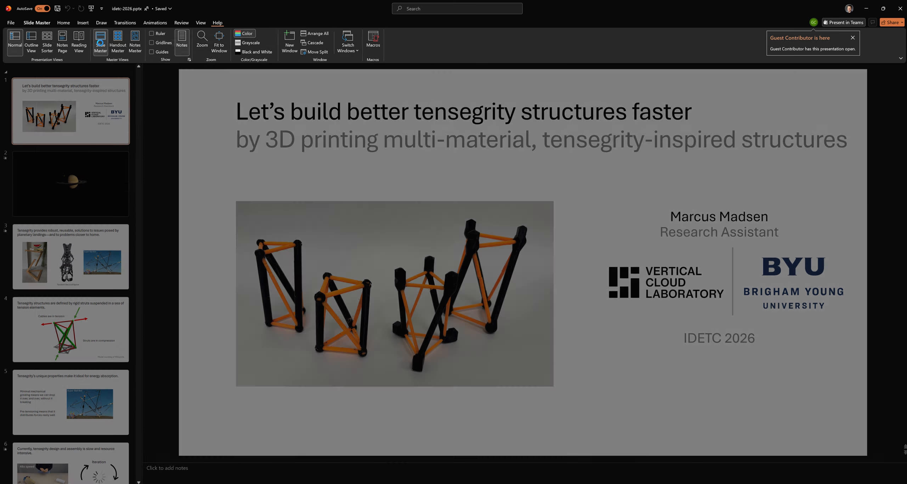
*[00:20] The deck as the session opened, with the old title.*

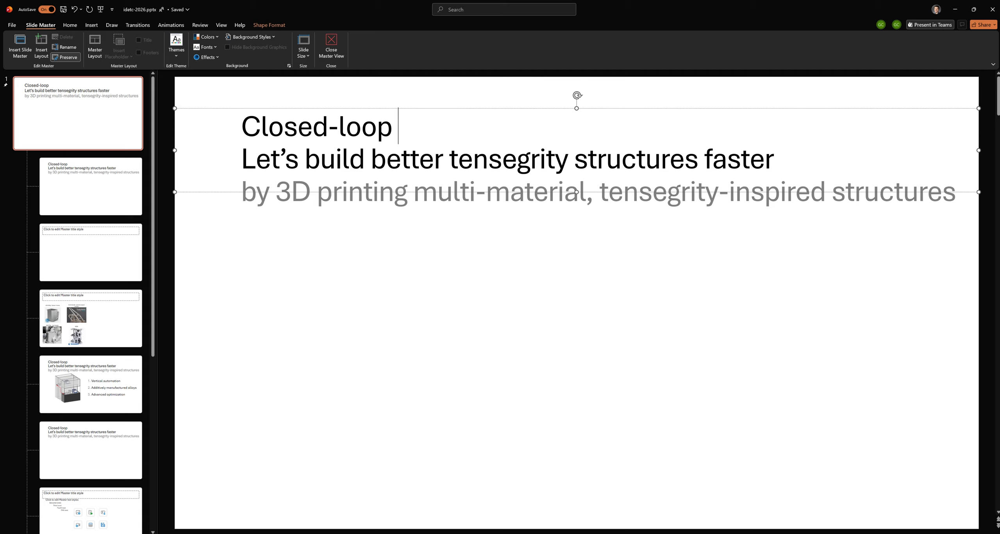
*[02:20] Editing the title on the slide master: "Closed-loop" attempt.*

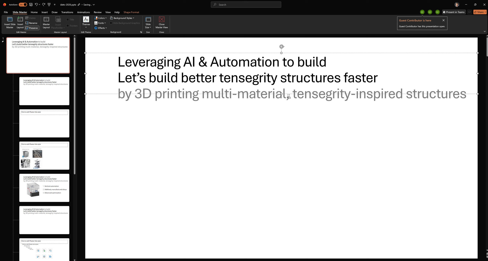
*[04:00] "Leveraging AI & Automation" attempt, later discarded.*

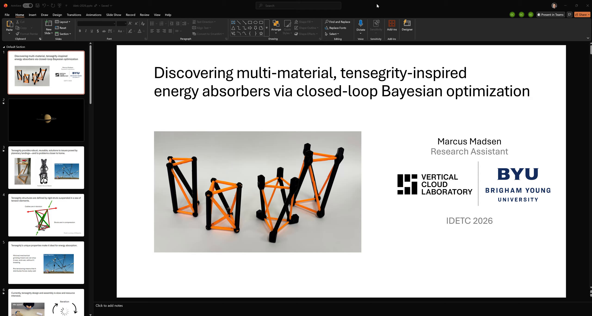
*[05:42] The title that stuck.*

### 2. Note to Claude: check the title against the symposium

[[05:23](https://youtu.be/gtaxKa_zZIo?t=323), restated at
[09:04](https://youtu.be/gtaxKa_zZIo?t=544)]
"Make a note to Claude to look back at the symposium that it was sent to...
check the title against the symposium and the potential audience for that, for
fit." **Open item for Claude**: verify the new title reads well for the specific
IDETC-CIE session (DAC) the abstract was submitted to, and flag any mismatch.

---

## Opening videos

### 3. NASA 360 "baby toy" clip added on a new slide before the Titan video

[[08:17](https://youtu.be/gtaxKa_zZIo?t=497) to
[10:30](https://youtu.be/gtaxKa_zZIo?t=630)]
Scrolling the Super Ball Bot video table in PR #84, Sterling: "This one, I
think... I love that." He inserted a new slide just before the planetary-lander
concept video for a clip of [NASA 360 Talks - Super Ball
Bot](https://www.youtube.com/watch?v=0eC4A2PXM-U): "just this clip of one of the
scientists there talking about the inspiration for the Super Ball Bot", from
about **0:10 to 0:29**, the researcher who explains they make tensegrities as
baby toys, throws one on the ground, and says "hey, that's a landing robot."
Requirements stated: **video full screen, no title, take up the entire slide.**

Status: done live. Sterling downloaded the video, inserted it on the new slide,
put the YouTube link in the speaker notes, and trimmed it with PowerPoint's Trim
Video dialog ([16:51](https://youtu.be/gtaxKa_zZIo?t=1011) to
[18:44](https://youtu.be/gtaxKa_zZIo?t=1124): "Got that added in. Claude, you
don't need to add that in now."). Worth one later check that the video frame is
truly full-bleed.

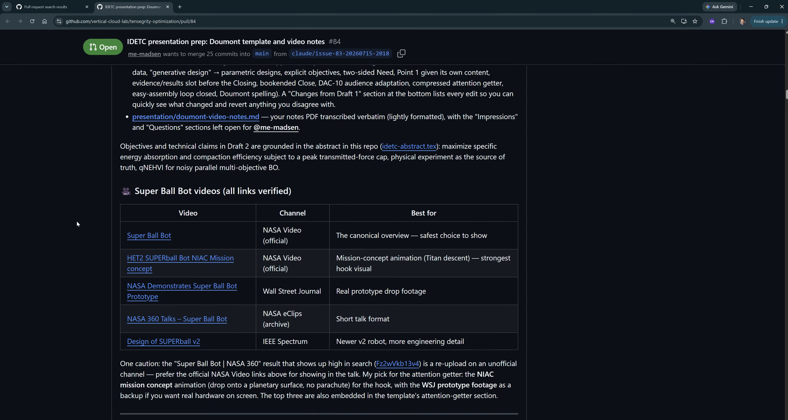
*[08:20] Picking the clip from the verified video table in PR #84.*

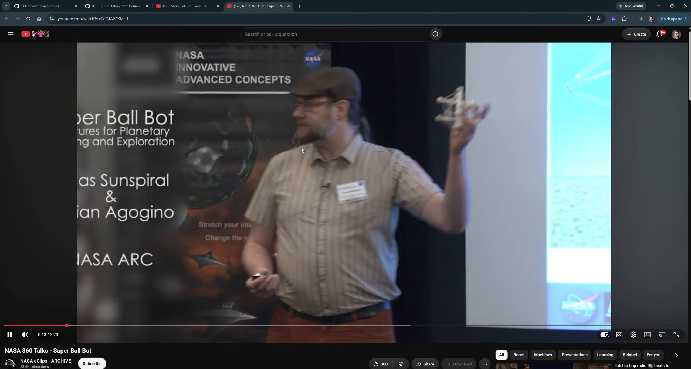
*[09:45] The moment being clipped: researcher holding the baby-toy tensegrity.*

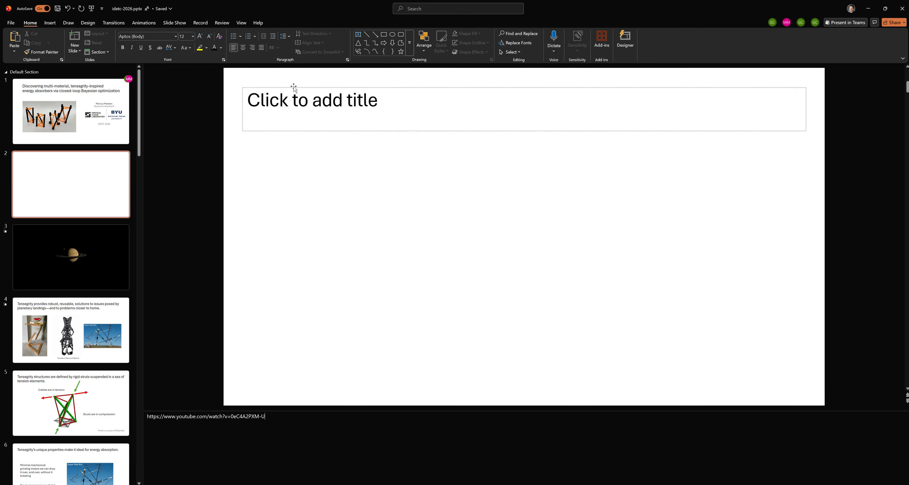
*[10:22] New slide with the YouTube link recorded in the speaker notes.*

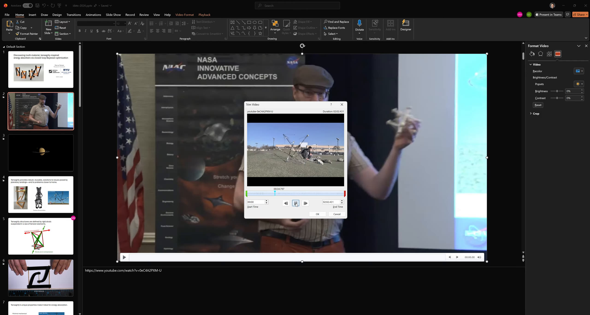
*[17:55] Trimming the inserted clip in PowerPoint.*

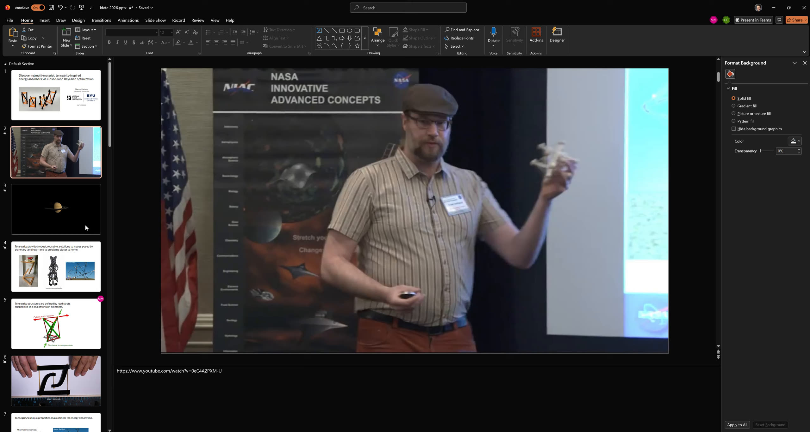
*[18:42] The clip in place on the new slide.*

### 4. Cap on passive video time

[[18:04](https://youtu.be/gtaxKa_zZIo?t=1084)] Marcus, on showing the clip:
"I wouldn't do more than maybe a minute or so of them just watching a video."
Keep total played-video time in the talk to roughly a minute.

### 5. The concept video is Titan, not Mars

[[05:45](https://youtu.be/gtaxKa_zZIo?t=345) and
[10:35](https://youtu.be/gtaxKa_zZIo?t=635)]
The Aug 7 exchange feedback asked "Why are you passing Saturn on the way to
Mars?" Both presenters had assumed Mars. Resolution: the NIAC animation is for a
mission concept to **Titan, a moon of Saturn**. "For [this] slide, we just need
to make sure in the speaker notes it's clear that this is not a Mars [mission];
the concept video is for a moon of Saturn as part of some mission, I think the
Titan mission. And don't put that anywhere on the slide." **Open**: that speaker
note still needs to be written.

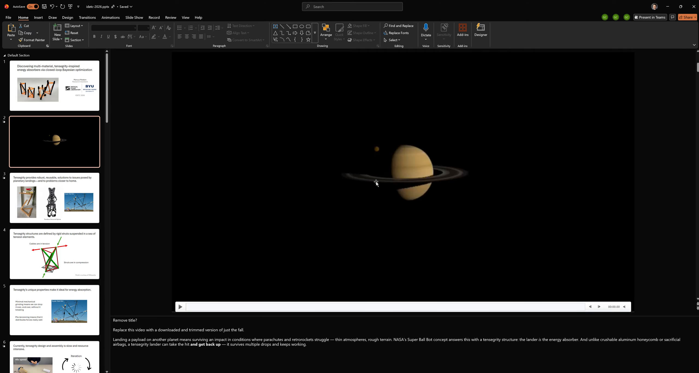
*[05:56] The concept-video slide; existing notes already say "Remove title?" and "Replace this video with a downloaded and trimmed version of just the fall."*

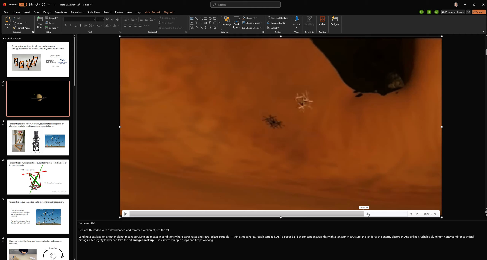
*[06:18] Scrubbing to the landing: the tensegrity lander bouncing on the surface.*

### 6. Credit everything in the speaker notes

[[11:03](https://youtu.be/gtaxKa_zZIo?t=663) to
[12:06](https://youtu.be/gtaxKa_zZIo?t=726)]
Debate on how to credit borrowed video without distracting from the hook.
Decision: "let's just make sure that the credit is in the speaker notes,
specifically the YouTube link. And I'm noticing it's not there for this
planetary lander one, for example. **Everything that was sourced from somewhere
at least needs the link in the speaker notes.**" A short on-slide credit (like
"Titan mission animation, NASA") was discussed and left optional. **Open**: the
planetary-lander video slide still lacks its link.

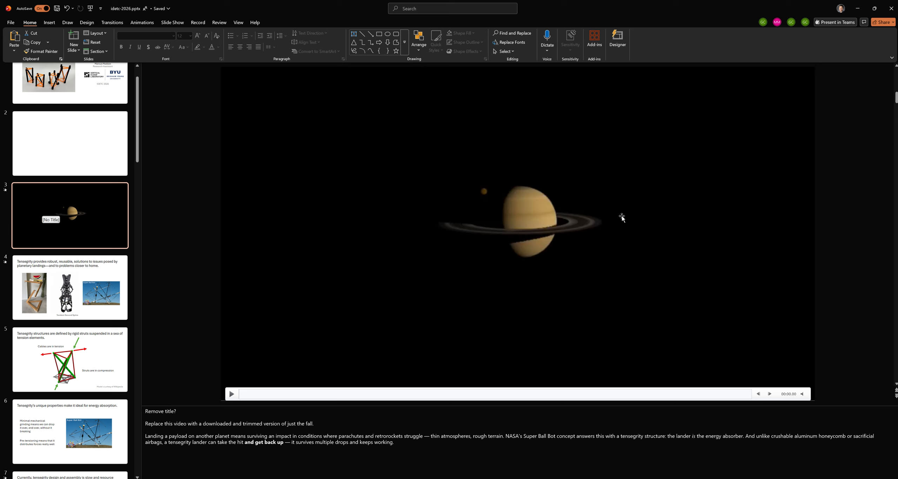
*[11:02] The lander-video slide during the credit discussion.*

### 7. Titan video: trim and title

Pre-existing presenter notes on the lander slide (visible at
[05:56](https://youtu.be/gtaxKa_zZIo?t=356)): "Remove title?" and "Replace this
video with a downloaded and trimmed version of just the fall." Still open;
discussed but not executed during the session.

---

## Hook slide ("Tensegrity provides robust, reusable, solutions...")

### 8. Second-spine and crutch examples stay

[[12:13](https://youtu.be/gtaxKa_zZIo?t=733) to
[13:36](https://youtu.be/gtaxKa_zZIo?t=816)]
Sterling asked about the middle image (the Tandem Second Spine, a
tensegrity-based exoskeleton someone raised after meeting with one of the
professors; not on the market yet). Marcus: "We don't have to use that, but I
thought it would be good to talk about ways tensegrity is used besides
[landers]." Sterling: "No, this seems pretty good," with a side thought about
whether to show the research crutch tips earlier. No change made; keep the
three-example layout (tensegrity table, Tandem Second Spine, Super Ball Bot).

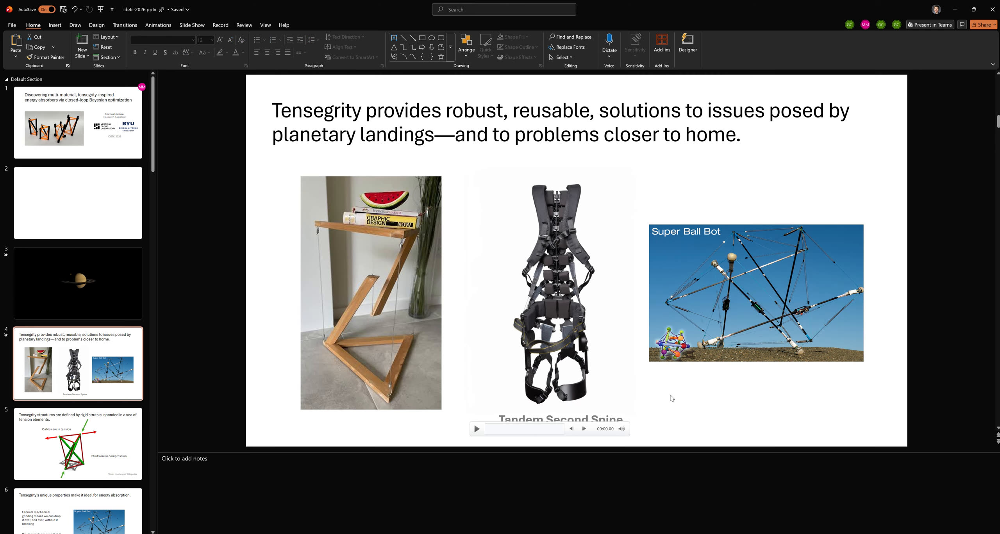
*[12:02] The hook slide under discussion.*

---

## Anatomy slide ("Tensegrity structures are defined by rigid struts...")

### 9. Anatomy slide: get our own model

[[13:43](https://youtu.be/gtaxKa_zZIo?t=823) to
[14:29](https://youtu.be/gtaxKa_zZIo?t=869)]
Prompted by exchange feedback about making the structure easier to understand:
"We could either find a better model..." and, on the credit, "having Wikipedia
listed on a presentation [is not great]." The slide's own note already says
"Getting a model of our own, or not from Wikipedia, could be good lol."
Two fixes were made live: the "Cables are in tension" / "Struts are in
compression" labels were **recolored red and green to match the model** (the
colored-legend request from the exchange feedback), and the "Model courtesy of
Wikipedia" credit moved off the slide into the speaker notes. **Open**: replace
the Wikipedia render with a photo or render of one of our own structures.

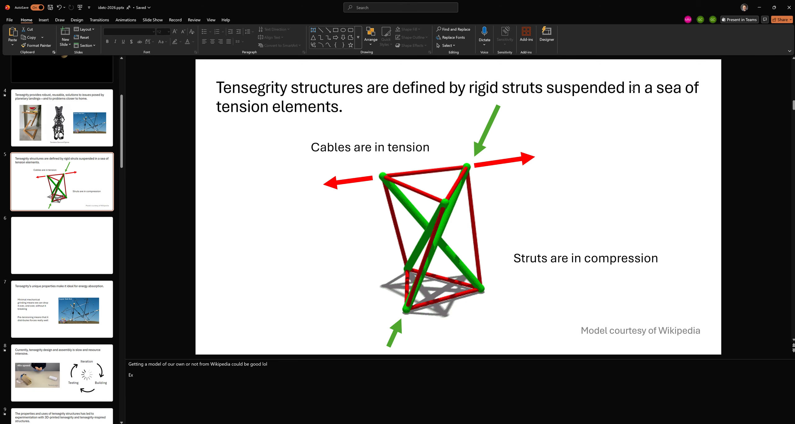
*[13:40] Anatomy slide before the edits, Wikipedia credit on-slide.*

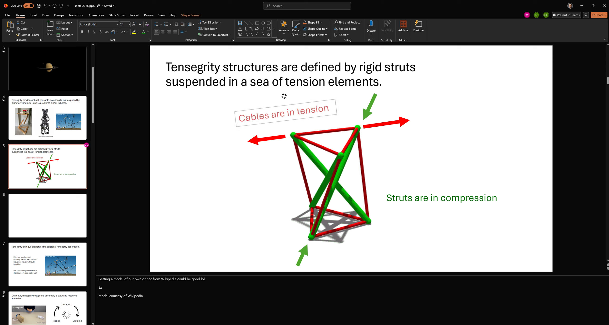
*[14:32] Labels color-matched to the model; credit moved to the notes.*

### 10. The 2D teaching clip is now in the deck

[[14:43](https://youtu.be/gtaxKa_zZIo?t=883) to
[16:58](https://youtu.be/gtaxKa_zZIo?t=1018)]
"There is a video here that I thought would be good to add... a snippet from one
of the videos about learning about tensegrity, and it had a 2D [model]." Then,
finding the prepared snips unused: "This blew my mind a little. Come on, I even
gave you snippets and you didn't use them, like, the Claude, for some of these.
These videos really need to be added, and these can be just direct-downloaded
from the Box link or pulled from YouTube. I'll go ahead and just download this
one and bring it in myself." He pulled `youtube-0onncd0_0-o.mp4` (the 34 s Steve
Mould 2D-tensegrity snip) from the Box `tensegrity` folder and placed it on its
own slide right after the anatomy slide.

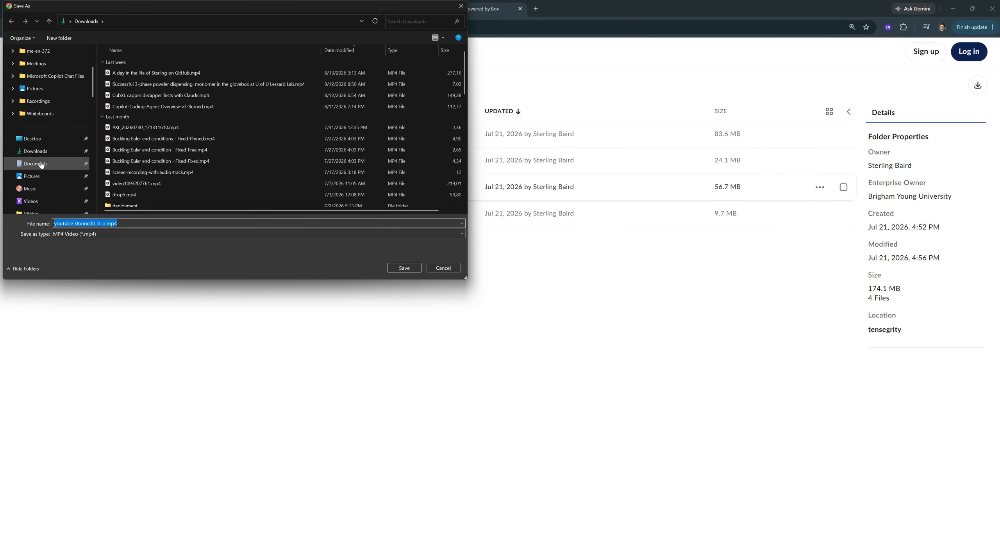
*[15:58] Saving the 2D snip from the Box folder.*

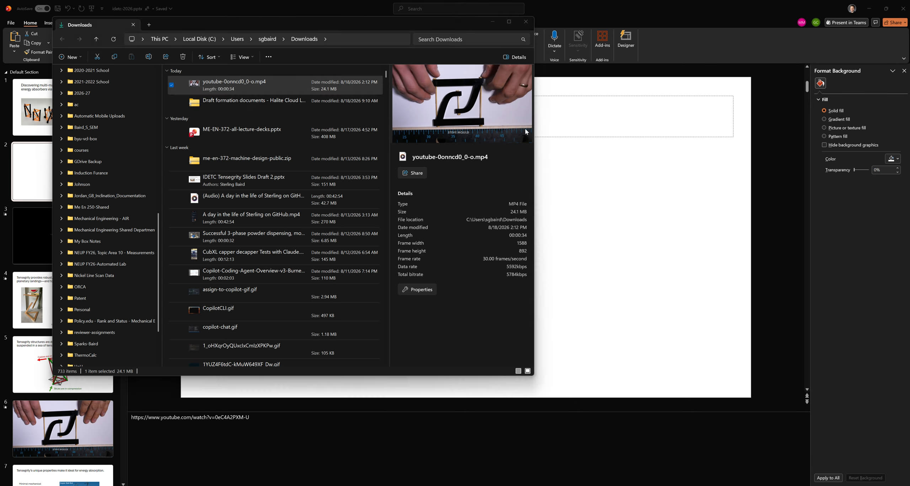
*[16:52] The Steve Mould 2D model clip landed on its own slide (thumbnail panel).*

---

## Unique-properties slide ("Tensegrity's unique properties make it ideal...")

### 11. Unique-properties slide: what to show

[[19:08](https://youtu.be/gtaxKa_zZIo?t=1148) to
[21:04](https://youtu.be/gtaxKa_zZIo?t=1264)]
Sterling: "Do we have a video of us throwing it?" Marcus: there is a hallway
throw video "but it's not a very pretty video"; he could instead film a close-up
throw against a wall. Sterling's counter: "It might be helpful instead to show
how, when it flexes, there are no mechanical parts grinding against each other.
I guess it depends on what we want to show. We can show the impact..." The
slide's existing note also suggests a video of throwing the basement specimen.
No resolution; Sterling **hid the slide for now** via right-click > Hide Slide.
**Open**: pick the visual (throw video, flexing close-up, or impact) and unhide.

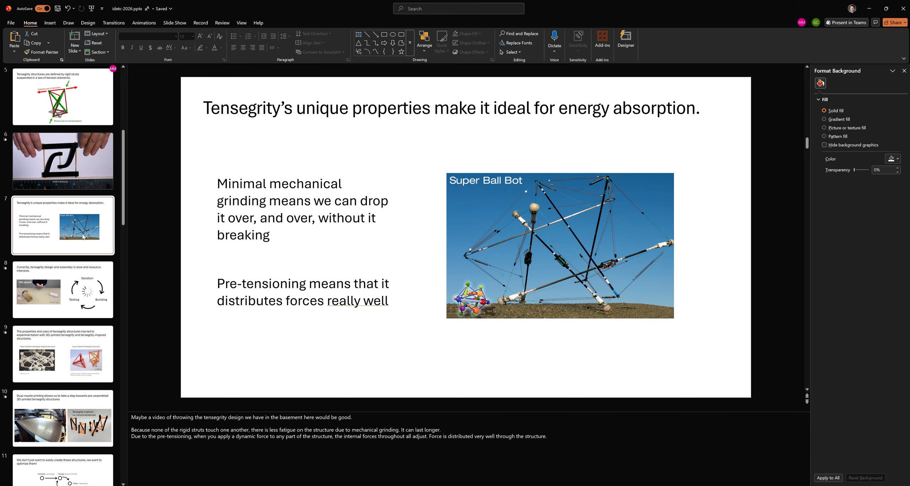
*[19:40] The slide and its presenter note proposing a throwing video.*

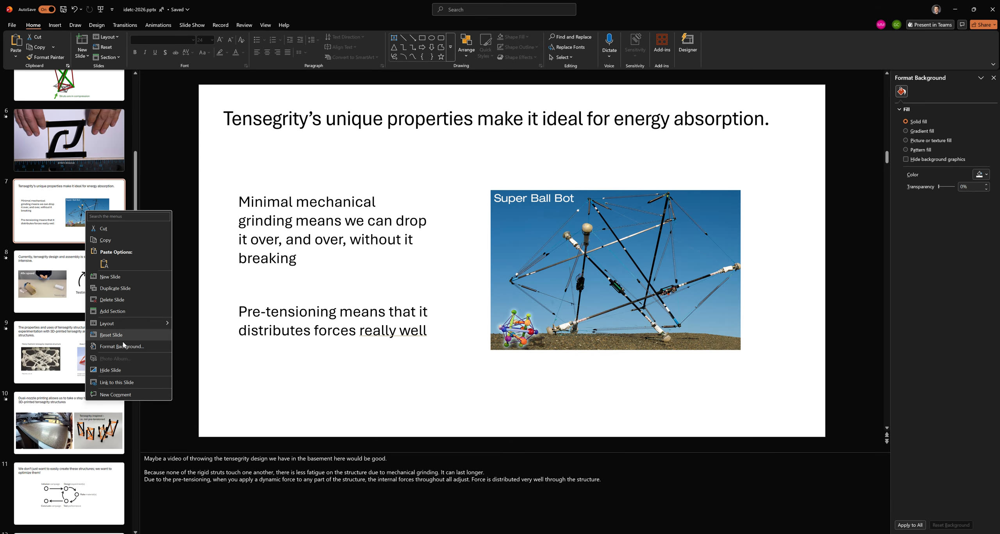
*[20:59] Hiding the slide until the visual question is settled.*

---

## Assembly slide ("Currently, tensegrity design and assembly is slow...")

### 12. Assembly slide: keep one video

[[21:29](https://youtu.be/gtaxKa_zZIo?t=1289) to
[22:42](https://youtu.be/gtaxKa_zZIo?t=1362)]
Marcus: "I found these videos because I wanted a way to show how complex it gets
to assemble a structure... there's two videos on that slide, one shows right
after the other. I'm fine deleting [one]." Sterling: "I think we can probably
get rid of this [one] for now and rely a little more on this one." The slide's
own note already asks for a **downloaded, timelapsed version set to play once,
silent**, and to consider a static image of the iteration spinner "so that it
doesn't become distracting, because it's fun to watch it spin."

Related, at [47:49](https://youtu.be/gtaxKa_zZIo?t=2869): "I can put a version
of the video that doesn't [have the] speed[-up] on it." A **12x-speed** version
of the TensoLogic assembly video now sits on its own slide next to the 48x one,
captioned "Tensegrity design and assembly is slow and tedious." One of the two
slides should ultimately go.

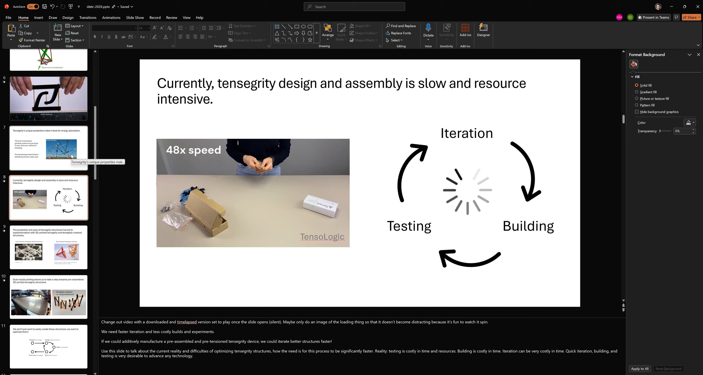
*[20:44] The assembly slide with its play-once/silent/timelapse note.*

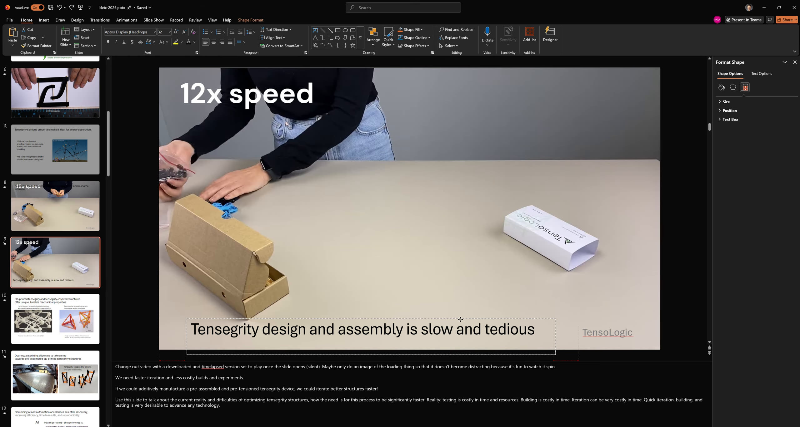
*[47:52] The added 12x-speed variant.*

---

## Campaign structure

### 13. Walk the loop stage by stage (implemented by pulling SDL slides)

[[24:20](https://youtu.be/gtaxKa_zZIo?t=1460) to
[26:12](https://youtu.be/gtaxKa_zZIo?t=1572)]
Marcus's structural idea for the methods block: "We wanted to talk about how we
initialize the campaign... we could isolate each aspect: here's how we
initialized it, here's how we're suggesting the next experiments, here's how
we're actually making them and testing it." Sterling: "I think that'd be a great
way to break it up," noting the difficulty that the pieces interrelate. Plan: if
done, "introduce that earlier on" with a roadmap, then walk each stage;
"introduce it between slides 10 and 11" (numbering at that moment).

Implemented at [38:16](https://youtu.be/gtaxKa_zZIo?t=2296) onward ("I think I'm
going to pull a slide from somewhere else"): Sterling opened his other decks and
pulled in the SDL block: "Combining AI and automation accelerates scientific
discovery...", the design-make-test loop slide (retitled "The loop of
scientific discovery is closed through design-make-test cycles"), and the
per-stage slides ("To initialize means to define your materials discovery
task...", "During the design phase, one 'acquires' new designs to run...", "To
make means to perform all synthesis and processing steps..."). The existing
loop-diagram slide was retitled **"We built a closed-loop system to optimize
energy and shock response as a function of geometry and 3D print processing
parameters."**

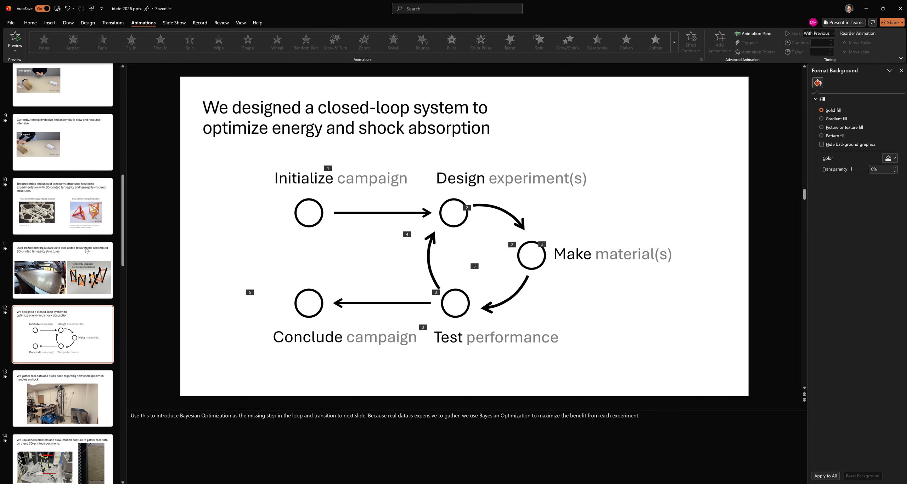
*[24:22] The closed-loop diagram slide the discussion started from; its note says to use it to introduce Bayesian optimization as the missing step in the loop.*

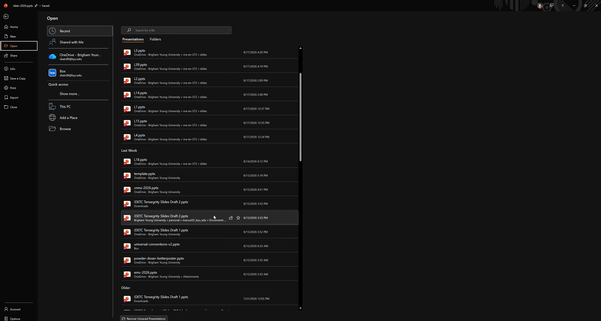
*[38:20] Hunting for source slides in other decks.*

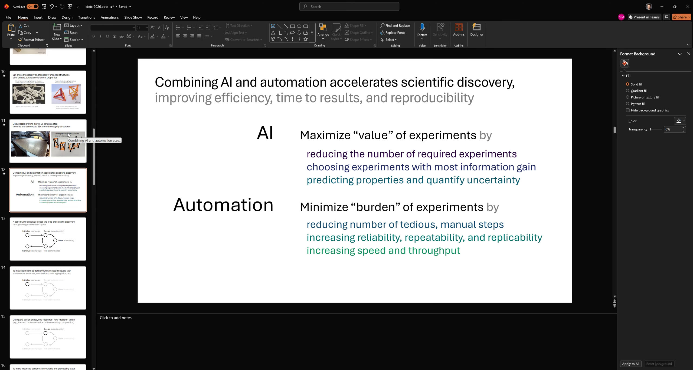
*[41:40] Pulled slide: AI maximizes value of experiments; automation minimizes burden.*

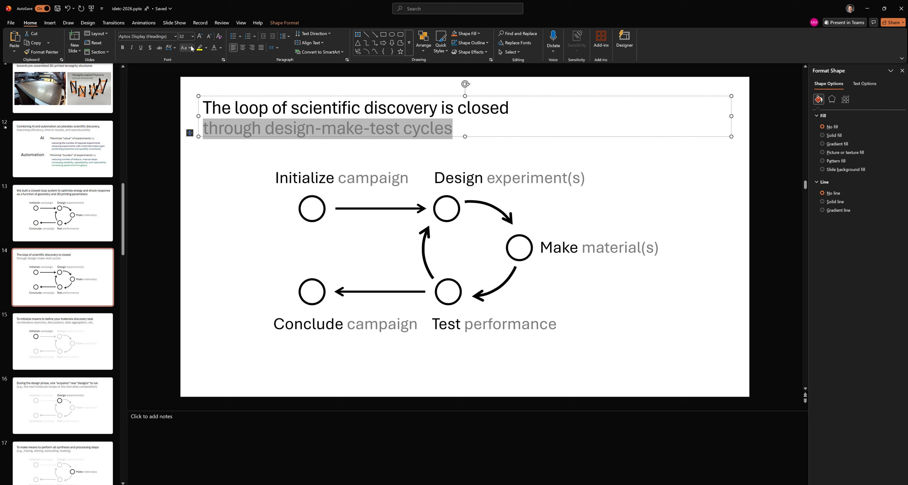
*[44:00] The loop slide being retitled, with the per-stage slides visible below.*

---

## Prior-work slide

### 14. Permissions for the prior-art photos

[[27:08](https://youtu.be/gtaxKa_zZIo?t=1628) to
[27:47](https://youtu.be/gtaxKa_zZIo?t=1667)]
The dual-filament red/orange tensegrity photos are from work that was never
published as a paper; the author was contacted and "was okay with this," asking
to be credited a specific way, now on the slide: "Image courtesy of Filipe
Amarante dos Santos, NOVA University Lisbon, Portugal." Keep that credit intact.

### 15. Citation format fixed, and the citation-style rule

[[27:47](https://youtu.be/gtaxKa_zZIo?t=1667) to
[29:25](https://youtu.be/gtaxKa_zZIo?t=1765)]
The mono-filament image's citation read "Pajunen, et. al." with no venue or
year. (The transcript mangles this badly; see the appendix.) Sterling: "'et.
al.' is really weird, it's not actually an abbreviation." They looked up the
journal (Extreme Mechanics Letters, ISO 4 abbreviation "Extreme Mech. Lett.")
and set the citation to **"Pajunen et al. *Extreme Mech. Lett.* (2021)"**.
Style rule stated at [29:10](https://youtu.be/gtaxKa_zZIo?t=1750): "This is my
preference for how we do citations: good that it's in gray, kind of
deemphasized," on the slide next to the item it credits. Also noted at
[27:53](https://youtu.be/gtaxKa_zZIo?t=1673), scoping: "Actually, most of these
I think we're just going to make in real time. I probably won't have Claude do
too much with it."

*[28:12] Chasing down the Pajunen citation.*

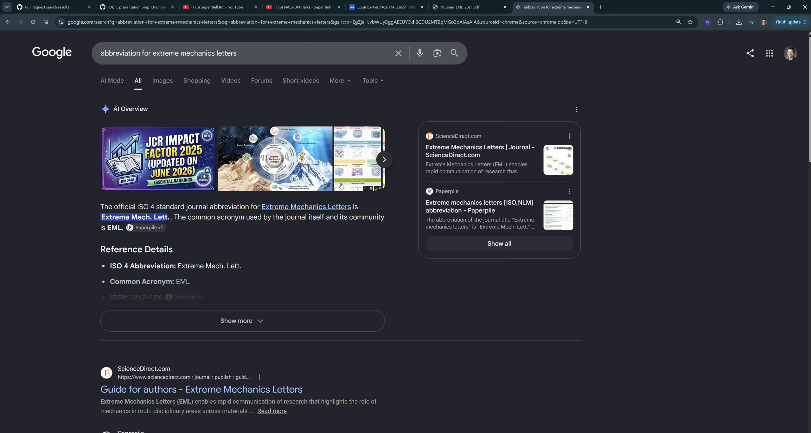
*[28:54] Confirming the ISO 4 journal abbreviation.*

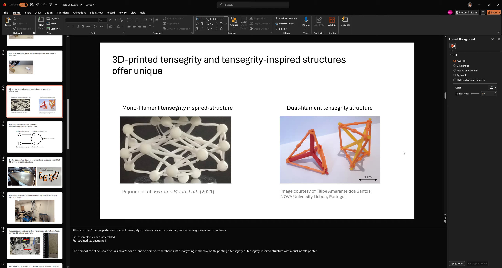
*[29:52] The corrected, deemphasized citation in place.*

### 16. Prior-work slide: say the gap out loud

[[29:31](https://youtu.be/gtaxKa_zZIo?t=1771) to
[38:16](https://youtu.be/gtaxKa_zZIo?t=2296)]
The longest discussion of the session. Key points, in order:

- The dual-filament example is "pre-tensioned multi-material," but its parts are
  **printed separately and then assembled**; the intent behind it was building
  toward lattice structures. The mono-filament example is printed as one piece.
  "One of the differences with ours is we're printing it together as one
  object... so it's kind of like a combination of those two"
  ([35:57](https://youtu.be/gtaxKa_zZIo?t=2157)).
- Marcus's framing for the slide: tensegrity's unique characteristics are ideal
  but hard to use in all cases, which led to tensegrity-inspired devices that
  keep some characteristics and drop others, yet still offer real uses
  (deliver a UPS parcel intact, crutch tips).
- Sterling pushed for the explicit Doumont move: "We're going to say why this
  was necessary relative to prior work... what's the need, what have people done
  before, and how does our work address the gap?" The crisp gap statement:
  "**No prior work has printed a multi-material [tensegrity] structure as [one
  object]. That one very specific one we found is multi-material, but it's not
  printed together, it's assembled**" ([37:05](https://youtu.be/gtaxKa_zZIo?t=2225)).
- On novelty, reporting the advisor's view: "he seems pretty adamant that...
  no one cares about T3 prisms; [the] T3 prism [itself] is [not the] novel
  part... part of the novelty is the whole optimization process with it as
  well" ([37:50](https://youtu.be/gtaxKa_zZIo?t=2270)).
- They opened the actual [Pajunen et al. 2021
  paper](https://daraio.caltech.edu/publications/Pajunen_EML_2021.pdf) to
  describe it correctly (laser vibrometer, longitudinal wave excitation,
  transmissibility, precompression-induced tunability). Marcus at
  [32:14](https://youtu.be/gtaxKa_zZIo?t=1934): "I need to read through this and
  double-check that I understand what they're doing correctly." **Open item.**

The slide ended the session as: title "3D-printed tensegrity and
tensegrity-inspired structures offer unique, tunable mechanical properties";
captions "Mono-filament tensegrity inspired-structure with tunable wave
propagation characteristics" and "Two-material tensegrity structure for modular
lattice structures."

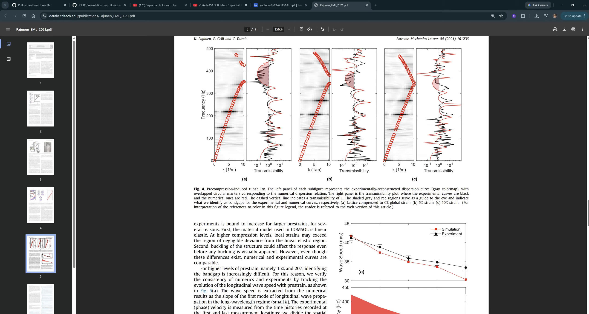
*[34:12] Reading the Pajunen paper's transmissibility figure before describing it on the slide.*

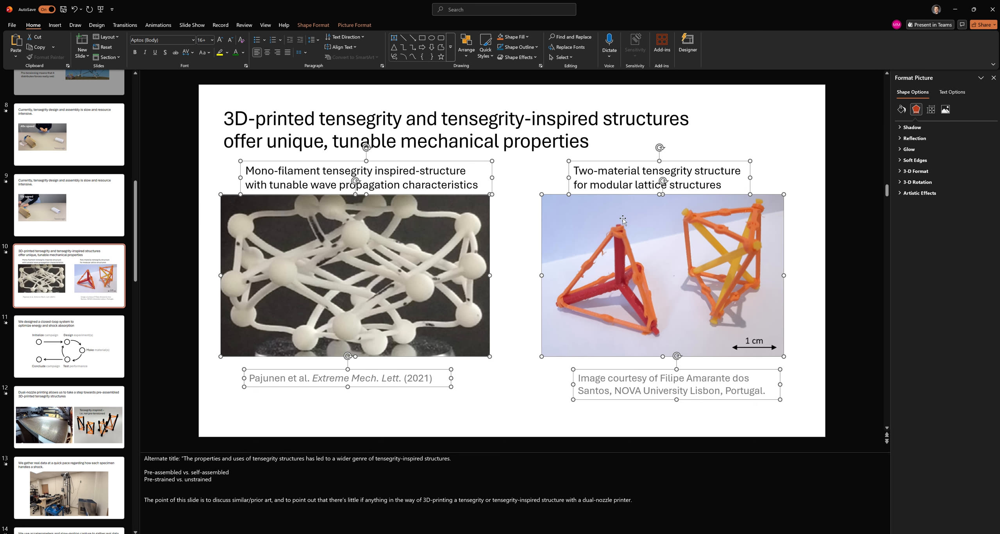
*[36:32] The prior-work slide after the rewrite.*

---

## Proposal figure and printing slides

### 17. MRG proposal figure pulled in

[[45:00](https://youtu.be/gtaxKa_zZIo?t=2700) to
[45:44](https://youtu.be/gtaxKa_zZIo?t=2744)]
"[This] might be a good spot for the proposal... one of the figures from the
proposal." One figure "did make it in here," and a raw version exists as well.
Sterling opened `mrg-jeff-sterling-2026.pptx` and took the workflow figure
(design-space thumbnails, BO surrogate panel, the loop, dual-nozzle
multi-material printing, validation and mechanical-testing panels).

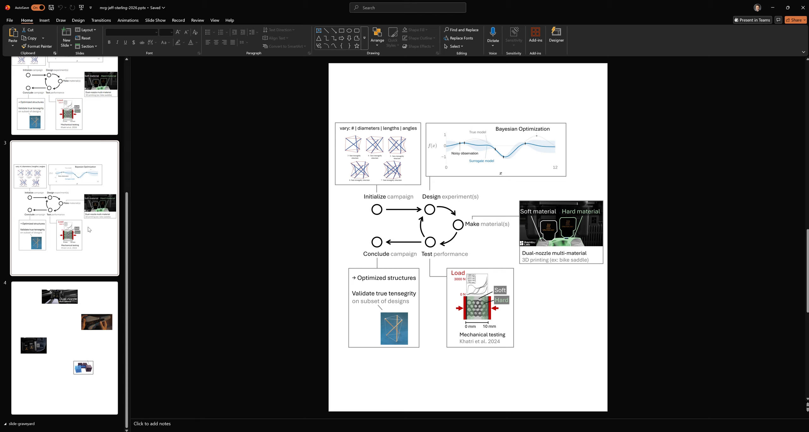
*[45:48] The proposal workflow figure being lifted from the MRG deck.*

### 18. Dual-nozzle slide (context)

The slide "Dual-nozzle printing allows us to take a step towards pre-assembled,
3D-printed tensegrity structures" carries the caption "Tensegrity-inspired T3
prisms (not pre-tensioned)" and a note about the lack of purely tensioned
members being future work. It was touched during the session (title line break,
caption) but its message was not challenged.

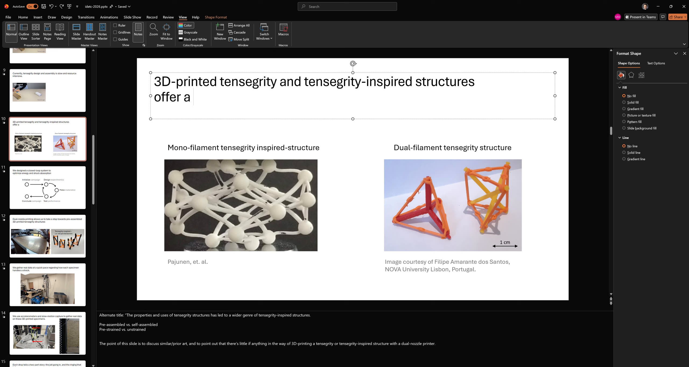
*[27:30] The dual-nozzle printing slide.*

---

## Testing slides

### 19. Drop-tower slide uses the wide-angle photo

[[55:00](https://youtu.be/gtaxKa_zZIo?t=3300) to
[55:15](https://youtu.be/gtaxKa_zZIo?t=3315)]
Marcus: "I also have wide angle..." Sterling: "...this one. I see. I think this
is [good]." The slide "We use a drop tower to measure the mechanical shock
response" now shows the wide room shot, title set over the photo. Its speaker
note explains the test in plain terms (60 inch drop onto felt, two sensors,
1.25 M readings/s) and ends with the bridge "→ Introducing Bayesian
Optimization."

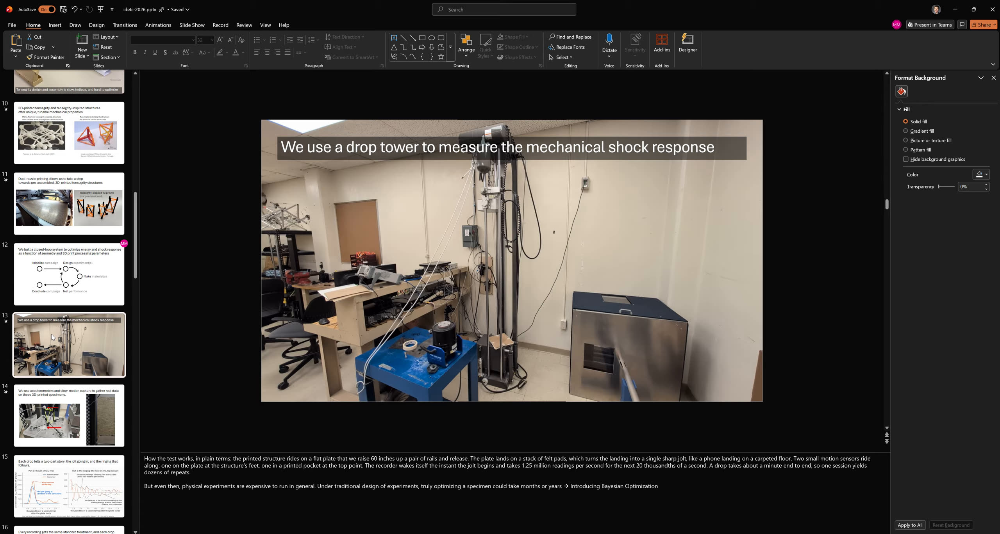
*[55:12] The wide-angle drop-tower slide.*

### 20. Keep the sound on the slow-motion drop video

[[54:44](https://youtu.be/gtaxKa_zZIo?t=3284)]
"You want to keep the sound?" "Yeah, I think so." The drop clip on "We use
accelerometers and slow-motion capture to gather real data on these 3D-printed
specimens" plays with audio. (Session-room AV check accordingly; the exchange
feedback separately asked to mute stray computer audio, so intentional sound
needs a deliberate volume check.)

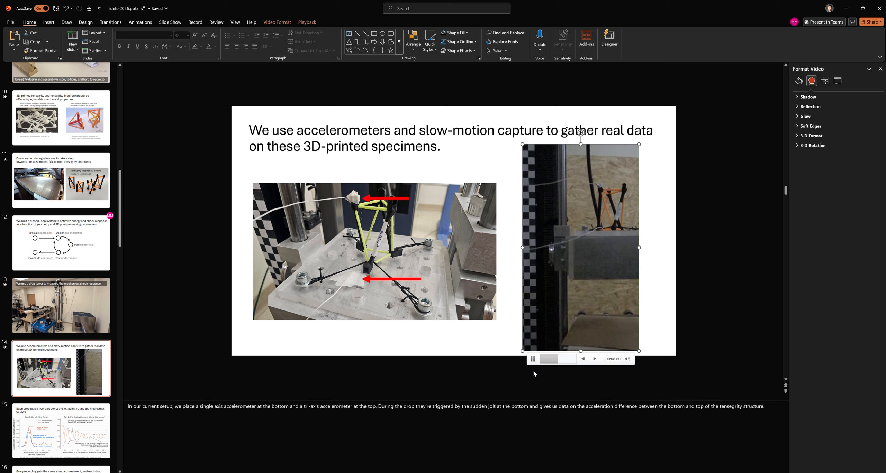
*[55:02] The accelerometers + slow-motion slide with the clip playing.*

### 21. "Accelerometers" label added to the specimen photo

[[~56:00](https://youtu.be/gtaxKa_zZIo?t=3360)]
A text label pointing out the accelerometers was added over the instrumented
specimen photo, answering the exchange-feedback request to label parts of the
test setup. The photo's red arrows mark the sensor positions.

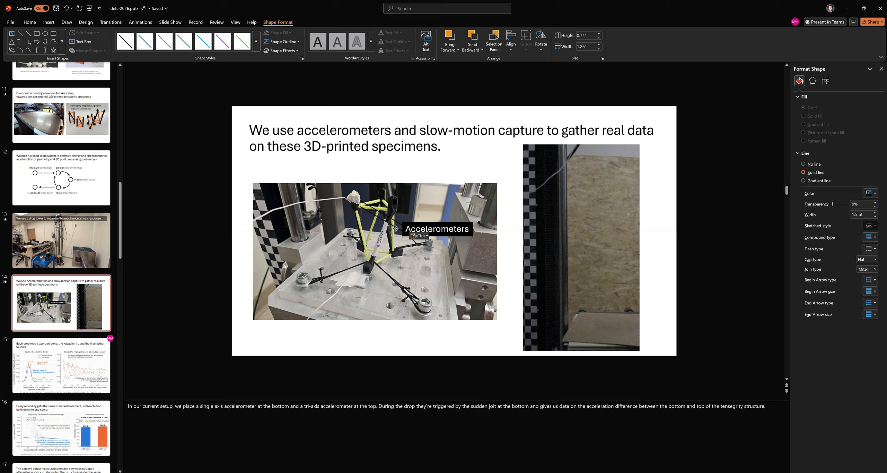
*[56:06] Adding the "Accelerometers" label to the photo.*

---

## The two data slides (explicitly "for Claude")

### 22-24. The two data slides: for Claude

[[58:26](https://youtu.be/gtaxKa_zZIo?t=3506) to
[59:28](https://youtu.be/gtaxKa_zZIo?t=3568)]
Sterling, wrapping up: "I might stop here and just end with these two slides,
like, for Claude." The slides are **"Each drop tells a two-part story: the jolt
going in, and the ringing that follows."** and **"Every recording gets the same
standard treatment, and each drop boils down to one score."** Three specific
criticisms:

1. **"First off, the titles read like AI slop."** Rewrite both as plain message
   titles a person would say out loud.
2. **"The two slides here are incredibly information-dense and not easily
   parsable. There's just too much on these."** Cut annotation layers and text;
   one message per slide.
3. The third slide, attenuation ("The data we obtain helps us understand how
   each structure attenuates a shock..."): "you have to look at it for a little
   while and it doesn't really say much, to me at least." Marcus: it was pulled
   in earlier just to have some data on there. Sterling: use "one that's already
   gone through a filter", i.e. plot CFC-filtered traces rather than the raw
   two-sensor comparison.

Context from a few minutes earlier
([55:39](https://youtu.be/gtaxKa_zZIo?t=3339)): "Isn't it terrible... AI just
has a really hard time. It wants to tell you everything it can... to present
[all] his work to everyone." That is the failure mode to design against on
these slides.

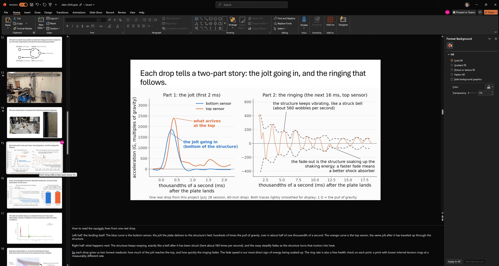
*[58:28] The "two-part story" slide named in the critique; the second offender is visible below it in the thumbnail rail.*

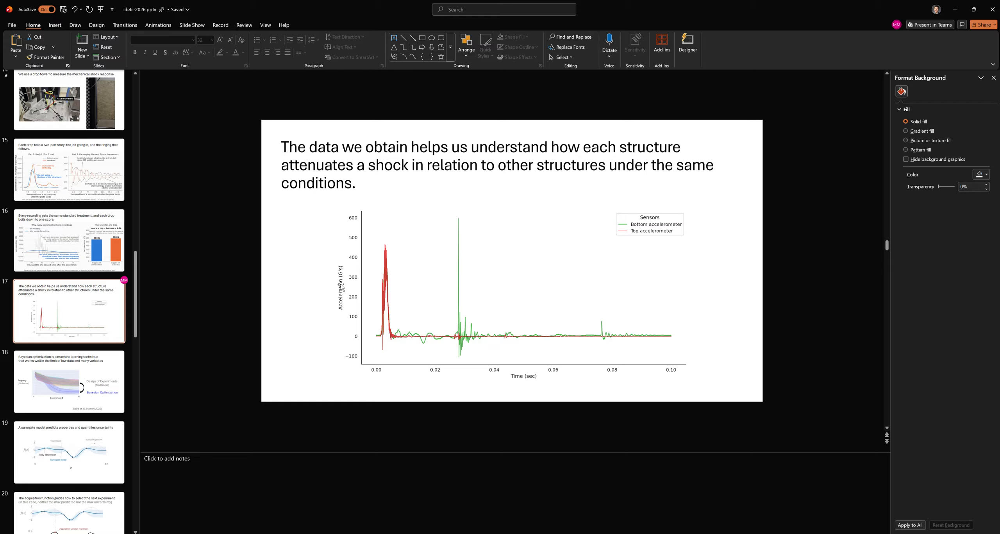
*[59:06] The attenuation slide: raw traces that "don't say much"; replace with filtered data.*

### 25. Speaker notes need curation

[[56:56](https://youtu.be/gtaxKa_zZIo?t=3416) to
[57:22](https://youtu.be/gtaxKa_zZIo?t=3442)]
Marcus asked about reading a long note aloud; Sterling: "I haven't done any
curation really on the speaker notes, so that's either from you, a slide note
for me, or Claude... you will want to find your own voice of what you want to
say." Open item for Marcus across the whole deck.

---

## Appendix: voice-to-text corrections

The YouTube auto-transcript garbles several technical terms. Corrections
applied throughout this document:

| Raw transcript | Intended |
|---|---|
| "tenseity", "tensgity", "tense integrity", "tensity", "tens inspired" | tensegrity, tensegrity-inspired |
| "loopation optimization of multimaterial 3D printed integrity inspired energy absorbers" | "Closed-loop optimization of multi-material 3D-printed tensegrity-inspired energy absorbers" (the submitted abstract title) |
| "Oh, hunan at all at is really weird. It's not actually an abbreviation." | "Pajunen 'et. al.' is really weird; 'et. al.' is not actually an abbreviation." |
| "We'll put in Pokemon extreme." | "We'll put in Pajunen... Extreme [Mechanics Letters]." |
| "claw", "cla", "cloud" | Claude |
| "that would have been a much rudder awakening later" | "a much ruder awakening later" |
| "either topology or something about free strand" | "either topology or something about pre-strain" |
| "having Wikipedia listed on a presation" | "on a presentation" |
| "second spine" | the Tandem Second Spine (tensegrity exoskeleton product) |
| "tight titan mission" | the Titan mission concept |
| "so we've got our like a hook expens" | "we've got our hook..." (trailing audio lost) |

Transcript gaps: the auto-captions skip long silent editing stretches
(22:42-24:20, 38:53-40:29, 41:02-45:00, 45:44-47:49, 47:51-51:11, 51:11-54:44).
The screenshots above cover what happened in those windows (slide pulls from
the SDL/MRG decks, title rewrites, video insertion).
