# Slide walkthrough, 2026-08-20: spoken script, change notes, and to-do list

Transcribed from Marcus's recorded walkthrough of `idetc-2026.pptx`
("Slide Review and Notes - 8-20-2026.mp4", 45 min 00 s):

- YouTube: <https://youtu.be/-0qPEmmgSBA>
- Box: <https://byu.box.com/s/x0echlgvxop65spz58tfdzgtaxpx8iug>

Each section below covers one slide (or slide group) in the order visited in
the video. The **spoken script** blocks keep Marcus's own words, lightly
cleaned: voice-to-text mishaps corrected for intent (see the
[appendix](#appendix-voice-to-text-corrections)), filler removed, sentences
joined. Suggestions from Claude sit in separate *Suggestion* notes so the
script itself stays in Marcus's voice. Timestamps link into the YouTube video.
Screenshots live in
[`slide-walkthrough-2026-08-20/`](slide-walkthrough-2026-08-20/).

One numbering caveat: during the recording PowerPoint showed "of 38" slides,
while the stored deck as of this transcription has 46 (hidden slides were
added at the end by other sessions). Slide references below use the current
stored deck's titles, which are unambiguous, plus the current stored slide
number where useful.

---

## Marcus's to-do checklist

Collected from every "let's make a note" moment in the video, grouped. Each
item links to the moment it came from.

### Slide and deck changes

- [ ] Decide the hook ordering: either keep NASA toy-throw clip then Titan
  clip, or move the Titan clip so it plays *during* the "you have a package"
  narration, timed so the fall (which starts about 8 s into the clip) lands
  on "what if you could just drop it onto the surface"
  ([4:12](https://youtu.be/-0qPEmmgSBA?t=252),
  [4:49](https://youtu.be/-0qPEmmgSBA?t=289))
- [ ] Reorder the prior-work slide: show the two-material structure (Filipe
  Amarante dos Santos image) first, then the mono-filament Pajunen structure
  ([17:44](https://youtu.be/-0qPEmmgSBA?t=1064))
- [ ] Set the Steve Mould clip (and check the other embedded clips) to play
  automatically when the slide opens
  ([12:41](https://youtu.be/-0qPEmmgSBA?t=761))
- [ ] Redo the jolt/ringing data slides: add marker lines from the top of
  each peak (top-sensor peak and bottom-sensor peak), show the ratio,
  possibly as an equation ([31:55](https://youtu.be/-0qPEmmgSBA?t=1915),
  [33:17](https://youtu.be/-0qPEmmgSBA?t=1997))
- [ ] Delete the duplicate jolt slide. The stored deck currently has the
  same "We measure the jolt..." slide twice (slides 20 and 21) plus an
  untitled leftover with the old figure (slide 19, axis still reading
  "thousandths of a second (ms)")
  ([33:34](https://youtu.be/-0qPEmmgSBA?t=2014))
- [ ] Omit the hidden "Tensegrity's unique properties" slide for good and
  cover its content verbally (agreed with Sterling, "it's just such an
  awkward slide") ([26:38](https://youtu.be/-0qPEmmgSBA?t=1598))
- [ ] Consider adding a 3D-printing / "make materials" slide between the
  drop-tower block and the data block; decided against a repeated
  mini-loop-diagram navigation graphic (do it vocally instead)
  ([34:37](https://youtu.be/-0qPEmmgSBA?t=2077),
  [34:57](https://youtu.be/-0qPEmmgSBA?t=2097))
- [ ] Decide placement of the closed-loop workflow slide (maybe move it
  toward the Bayesian optimization side) and of the search-space slide;
  wants feedback on this ([28:32](https://youtu.be/-0qPEmmgSBA?t=1712))
- [ ] Fix the "By connecting these ideas" slide graphics: the drop-tower
  photo is "a little janky" and the right-hand icon is a random
  neural-network symbol. Note already in the slide: replace the printing
  icon with a printed tensegrity image, testing with a drop-tower image,
  and the BO icon with a black box
  ([42:49](https://youtu.be/-0qPEmmgSBA?t=2569))
- [ ] Future-applications slide: find a better lattice-structure example or
  read the cited paper (on-slide credit: Al Sabouni-Zawadzka et al. 2025)
  ([43:29](https://youtu.be/-0qPEmmgSBA?t=2609))
- [ ] Add an acknowledgments element crediting Chenquan (spelling to
  confirm), Audrey, Sterling, and Dr. Hill, whether or not it is spoken
  aloud ([44:26](https://youtu.be/-0qPEmmgSBA?t=2666))
- [ ] Replace the closing VCL + BYU logo image, "too pixelated, replace
  with higher quality" (note already typed into the slide's notes)
  ([44:55](https://youtu.be/-0qPEmmgSBA?t=2695))

### Things to look up or review before presenting

- [ ] A good word for "another celestial body" in the hook (the Titan clip
  is a moon, not a planet) ([0:30](https://youtu.be/-0qPEmmgSBA?t=30));
  Titan is confirmed to be Saturn's largest moon
- [ ] What the Tandem exosuit ("exo spine") actually does, beyond being
  marketed to construction workers for back relief
  ([7:53](https://youtu.be/-0qPEmmgSBA?t=473))
- [ ] Write out an expanded definition of tensegrity to review beforehand,
  including the tensegrity-inspired distinction (see
  [terms](#terms-to-clarify-and-where-to-look) below)
  ([15:55](https://youtu.be/-0qPEmmgSBA?t=955))
- [ ] The Pajunen structure's material (a polyamide with a grade number);
  decide whether to name it on stage
  ([16:50](https://youtu.be/-0qPEmmgSBA?t=1010))
- [ ] Double-check the full name of TPU (it is thermoplastic polyurethane)
  and its damping properties ([18:52](https://youtu.be/-0qPEmmgSBA?t=1132))
- [ ] Work out how to explain why the dual-nozzle work matters: the
  novelty framing (print-in-place dual-filament tensegrity topology is
  itself uncommon, but the intentional closed-loop optimization on these
  structures is the real novelty). "This is the part I'm currently
  stumbling over most" ([19:33](https://youtu.be/-0qPEmmgSBA?t=1173))
- [ ] Look up the definition of metamaterial structures
  ([24:52](https://youtu.be/-0qPEmmgSBA?t=1492))
- [ ] Establish earlier in the talk that the T3 prism + 3D printing is a
  stepping stone (a proxy) toward future work: metamaterial lattices,
  parcel-delivery energy absorbers, crutch and walking-stick tips
  ([24:30](https://youtu.be/-0qPEmmgSBA?t=1470))
- [ ] Look into the acrylic mounting plate: how well does acrylic transmit
  a shock, given the recollection that magnesium (then aluminum) is
  preferred for shock transmission
  ([30:15](https://youtu.be/-0qPEmmgSBA?t=1815))
- [ ] Double-check whether the slow-motion video tells us anything
  quantitatively useful, so it can be characterized correctly on stage
  ([31:14](https://youtu.be/-0qPEmmgSBA?t=1874))
- [ ] Define attenuation and transmissibility precisely, and double-check
  that the peak-ratio description matches what our pipeline computes
  ([31:41](https://youtu.be/-0qPEmmgSBA?t=1901))
- [ ] Understand the SAE J211 filter well enough to decide whether and how
  to mention it ([32:21](https://youtu.be/-0qPEmmgSBA?t=1941),
  [34:24](https://youtu.be/-0qPEmmgSBA?t=2064))
- [ ] Review the definition of traditional design of experiments
  ([38:39](https://youtu.be/-0qPEmmgSBA?t=2319))
- [ ] Re-review Sterling's notes on f(x) and x for the surrogate-model
  slide ([39:45](https://youtu.be/-0qPEmmgSBA?t=2385),
  [42:08](https://youtu.be/-0qPEmmgSBA?t=2528))
- [ ] Check the pronunciation of "Bayesian"
  ([38:18](https://youtu.be/-0qPEmmgSBA?t=2298))

### Delivery, practice, and props

- [ ] Decide whether to bring the physical TensoLogic ball and do the
  compact-and-release live: 3D print a clasp to hold it compacted, remove
  the clasp while talking, brief toss and catch (or let it bounce).
  Weighed against the risk of fumbling it when nervous
  ([9:35](https://youtu.be/-0qPEmmgSBA?t=575))
- [ ] Decide on the jokes: the "give it to a child" durability joke (leaning
  toward excluding it), the "until funding runs out" campaign joke, and
  the "my hand under the table, we have a much safer way to do that now"
  aside (leaning toward keeping that one)
  ([5:18](https://youtu.be/-0qPEmmgSBA?t=318),
  [22:46](https://youtu.be/-0qPEmmgSBA?t=1366),
  [29:43](https://youtu.be/-0qPEmmgSBA?t=1783))
- [ ] Poll idea for audience engagement: "who here has heard of
  tensegrity?" and later "who here has heard of Bayesian optimization?"
  ([7:10](https://youtu.be/-0qPEmmgSBA?t=430),
  [38:14](https://youtu.be/-0qPEmmgSBA?t=2294))
- [ ] Watch arm movements while presenting
  ([11:08](https://youtu.be/-0qPEmmgSBA?t=668))
- [ ] Practice the Titan-clip timing against the hook narration
  ([4:52](https://youtu.be/-0qPEmmgSBA?t=292))
- [ ] Decide on the closing line ("the faster we are able to iterate and
  advance ourselves, the better life we can enjoy living now, because our
  time is limited"), or find one that feels less cheesy
  ([44:00](https://youtu.be/-0qPEmmgSBA?t=2640))

### To discuss with the team

- [ ] Slide placement feedback: closed-loop slide position, possible extra
  printing slide, search-space slide position
  ([28:49](https://youtu.be/-0qPEmmgSBA?t=1729))
- [ ] Crutch and walking-stick tips: "we actually need to talk about
  partnering with them on that"
  ([43:48](https://youtu.be/-0qPEmmgSBA?t=2628))
- [ ] Sterling may have notes on how the Bayesian optimization block is
  introduced ([39:31](https://youtu.be/-0qPEmmgSBA?t=2371))

---

## Terms to clarify, and where to look

The terms Marcus flagged during the walkthrough, with places to read. Repo
files are linked by name; external references are standard, findable copies.

**Transmissibility and attenuation.** The description given in the video is
the right shape: take the peak acceleration the top of the structure sees,
divide by the peak acceleration the bottom (input) sees. A ratio above 1
means the structure amplified the shock; below 1 means it attenuated it,
and closer to 0 is better. Notes: (1) vibration textbooks define
transmissibility for steady sinusoidal input as the ratio of response
amplitude to input amplitude, and the peak-ratio version used for a single
shock is often called shock transmissibility, so it is worth saying
"peak-to-peak-ratio" explicitly on stage; (2) our pipeline computes exactly
this peak ratio on SAE J211 CFC-filtered signals, with CH5 as the bottom
input sensor and CH4 as the top vertical channel, see
[`regen_data_slide_figures.py`](regen_data_slide_figures.py) and
[`issue-94-analysis-slides.md`](issue-94-analysis-slides.md). For a
textbook treatment: S. S. Rao, *Mechanical Vibrations* (transmissibility
chapter) and *Harris' Shock and Vibration Handbook* (shock isolation and
shock data analysis chapters).

**Classical definition of tensegrity (and "tensegrity-inspired").** The
conditions usually cited: compression members (struts) that do not touch
one another, a continuous network of tension members (cables/tendons),
self-equilibrated pre-stress (the structure is stressed with no external
load), and stability that comes from that pre-stress; cables are idealized
as inextensible. Anthony Pugh's phrasing, "a set of discontinuous
compressive components interacting with a set of continuous tensile
components," is close to the "islands of compression in a sea of tension"
line already paraphrased on the anatomy slide. Where to look: R. Buckminster
Fuller's patent US 3,063,521 (1962) for the coinage; Skelton & de Oliveira,
*Tensegrity Systems* (Springer, 2009), whose class-1/class-k definition is
the cleanest for Q&A (class 1: no two struts touch); Motro, *Tensegrity:
Structural Systems for the Future* (2003). "Tensegrity-inspired" as used in
our work and in the Pajunen paper: keeps the topology or geometry but drops
one or more classical conditions, in our case no as-built pre-stress and
extensible TPU members. The wording already on the hidden caveat slide and
in [`doumont-presentation-template.md`](doumont-presentation-template.md)
matches this.

**TPU.** Thermoplastic polyurethane: an elastomer that prints, with
viscoelastic (damping) behavior, graded by Shore hardness (ours is a 95A
class filament). It is hygroscopic, so it needs drying before printing,
and its softness is why it jams in extruders more easily. The manufacturer
technical data sheet for the specific filament used in the campaign is the
citable source for hardness and damping claims; print-side history is in
PR #35's print lineage.

**Pajunen et al. (mono-filament structure).** The on-slide credit is
Pajunen et al., *Extreme Mechanics Letters* (2021). Read the paper for the
exact polyamide grade before naming it on stage (a copy is archived on the
PR #58 branch; see [`data-catalogue.md`](data-catalogue.md)). The earlier
companion, Pajunen et al. 2019 in *Materials & Design* ("Design and impact
response of 3D-printable tensegrity-inspired structures"), is also worth a
skim since it coined much of the tensegrity-inspired framing.

**Metamaterial.** Working definition: a material whose effective properties
come from its engineered architecture (geometry of a repeating unit cell)
rather than from its chemical composition. Good entry points: Bertoldi,
Vitelli, Christensen & van Hecke, "Flexible mechanical metamaterials,"
*Nature Reviews Materials* (2017), and Kadic, Milton, van Hecke & Wegener,
"3D metamaterials," *Nature Reviews Physics* (2019).

**Traditional design of experiments.** The NIST/SEMATECH e-Handbook of
Statistical Methods (free online, section 5) is the fastest practical
overview of factorial and response-surface designs; Montgomery's *Design
and Analysis of Experiments* is the standard textbook. The one-sentence
contrast for the talk: classical DoE fixes the whole test plan up front,
while Bayesian optimization re-plans after every batch using what it has
learned.

**f(x) and x on the surrogate slide.** x is the design (for us, the vector
of five geometry parameters); f(x) is the measured objective at that design
(for us, e.g., transmissibility from a drop). The surrogate is a Gaussian
process fit to the (x, f(x)) pairs, giving both a prediction and an
uncertainty everywhere. Sterling's speaker notes on those slides are the
first thing to re-read; beyond that, Frazier's "A Tutorial on Bayesian
Optimization" (arXiv:1807.02811) sections 1 to 3 cover exactly the
surrogate + acquisition story the slides tell, and the Honegumi
documentation shows how our kind of campaign is set up in practice.
Pronunciation: "BAY-zhun," after Thomas Bayes.

**Acrylic plate and shock transmission.** The physics concept to search is
mechanical impedance and stress-wave speed (sound speed in a bar is
sqrt(E/rho)). Stiff, light plates (magnesium and aluminum are the classic
shock-fixture choices, matching the recollection in the video) transmit a
sharp pulse with little distortion; acrylic (PMMA) is roughly 20 to 30
times less stiff than aluminum and lossier, so it rounds the transmitted
pulse. *Harris' Shock and Vibration Handbook* has a chapter on shock-test
fixtures. Two useful framings for the talk if asked: both sensors measure
on the same fixture, so comparisons between specimens remain fair even if
the plate is not an ideal transmitter; and the input sensor sits below the
specimen, so the ratio brackets the specimen, not the plate.

**Titan.** Saturn's largest moon, the target of the NIAC Super Ball Bot
mission concept in the clip. Already in the slide 3 speaker notes; NASA's
Titan page is the reference if a number (surface gravity, atmosphere) is
wanted.

**Tandem exosuit.** The hook slide's speaker notes carry the source link
for the "Tandem Second Spine" image; check the vendor's page for what load
path it actually provides before characterizing it beyond "helps take load
off the back."

---

## Slide-by-slide: what you want to say, and your notes

### 1. Title slide ([0:00](https://youtu.be/-0qPEmmgSBA))

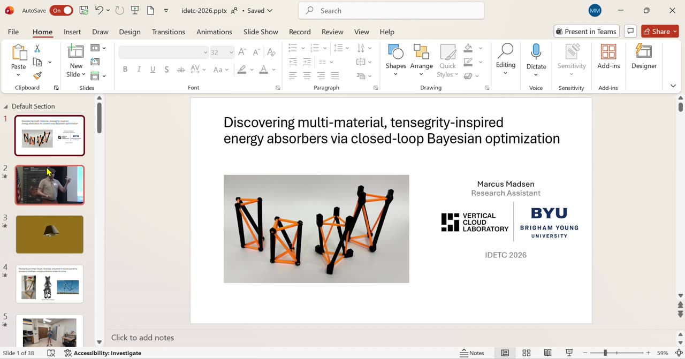

**Plan:** no time spent reading this slide; start right in on the hook.

**Spoken script:**

> You have a package, and you need to get that package to the surface of
> another celestial body. Doing this, you may face incredibly adverse
> conditions. A very thin atmosphere can make parachutes very difficult or
> impossible to work with. And the landing terrain is very rugged: even if
> you get your package to the surface, it might be hard for it to land
> upright, or even intact, on a jagged surface. You could add complex
> systems, retro rockets, parachutes. But what if you could just drop your
> package onto the surface and have it survive? That would be great,
> right?

**Your notes:**

- Find a natural word for planet-or-moon, since this clip is Titan, a moon
  of Saturn. "Another celestial body" works but felt stiff.
- Option: have the Titan clip playing behind this narration (see slide 3).

*Suggestion:* "another world" reads smoother aloud than "another celestial
body" and stays accurate for moons.

### 2. NASA toy-throw clip ([2:25](https://youtu.be/-0qPEmmgSBA?t=145))

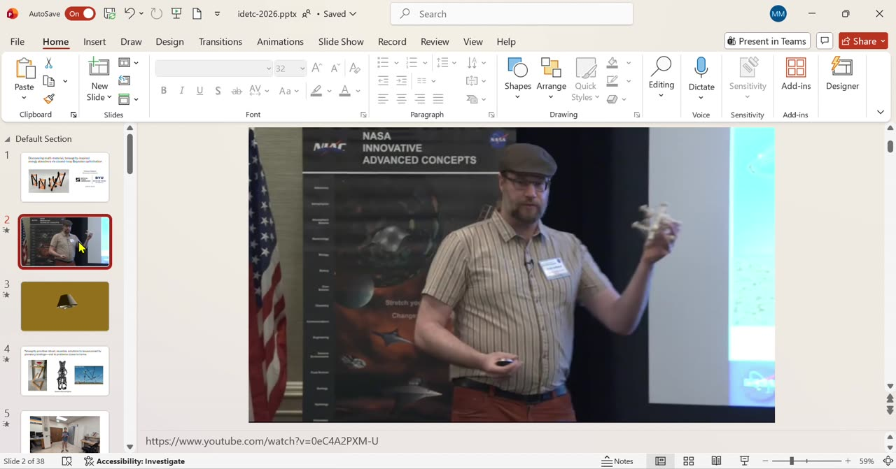

**Spoken lead-in:**

> Researchers at NASA found, through testing under some of the most rugged
> and harsh conditions on Earth, a technology with incredible energy
> absorption capabilities, and it inspired them to build this
> tensegrity-inspired robot.

Then the clip plays (Adrian Agogino's toy-throw bit).

**Your notes:**

- Possible joke afterward: "if you want to test whether a device survives
  harsh conditions, give it to a child." By [5:22] you were leaning toward
  excluding it.

### 3. Titan descent clip ([3:55](https://youtu.be/-0qPEmmgSBA?t=235))

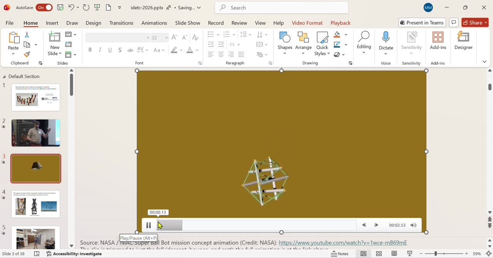

**Your notes (two options, you leaned toward the second):**

- Could omit this slide altogether, though "it's kind of fun to watch it go
  down" and you can talk over it.
- Preferred: move this clip so it runs *while* you deliver the "you have a
  package" narration from slide 1, and time it so the fall (starting about
  8 s into the clip) coincides with "what if you could just drop it onto
  the surface." Practice the timing.
- Then transition: "Researchers at NASA were inspired by a super rugged
  technology they found... it was able to take blow after blow," and play
  the toy-throw clip.

### 4. Hook slide: table, exosuit, Super Ball Bot ([5:29](https://youtu.be/-0qPEmmgSBA?t=329))

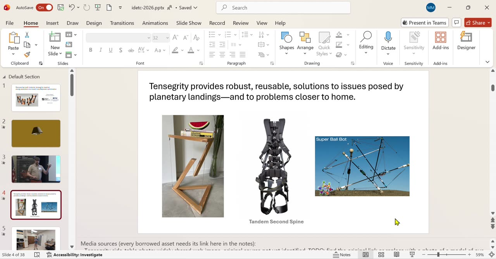

**Spoken script:**

> If the only use for this principle were a planetary lander, maybe it
> wouldn't matter much to most of us. But tensegrity actually has a lot
> more applications. Maybe you've seen something like this: this floating
> table. Tensegrity artwork is a lot more commonplace than tensegrity
> mechanical devices, and honestly, this table is what I show my parents
> when they ask what I research. It also has a variety of other uses, like
> this exosuit, designed to help construction workers and people who lift
> a lot take part of the load off their back. And because of its
> principles, tensegrity is very useful for energy-absorbing devices. In
> fact, tensegrity is fantastic because it can compact down to a very
> small shape, and then deploy to its full form with all of its
> energy-absorption capabilities.

**Your notes:**

- Possible poll here: "who here has heard of tensegrity?" (mirrors the
  Bayesian optimization poll later).
- Check exactly what the Tandem exosuit does before characterizing it.
- You noticed the anatomy slide comes later in the deck, and decided that
  is fine: this slide previews, the definition lands two slides later.

### 5. TensoLogic ball, compact and release ([9:00](https://youtu.be/-0qPEmmgSBA?t=540))

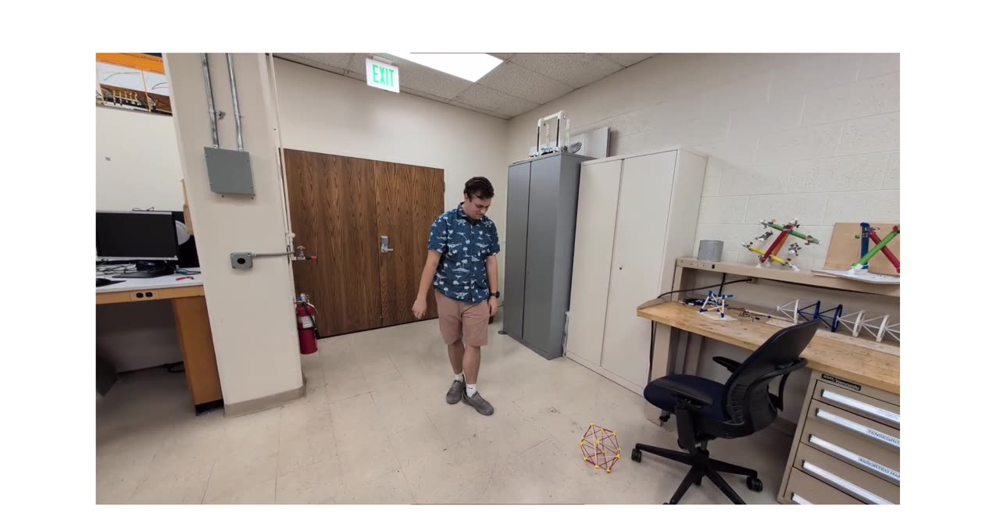

**Your notes:**

- Thinking of bringing the physical TensoLogic ball to the presentation
  instead of (or alongside) this video, partly because in the video "you
  get to see me struggle... with that wonderful noise."
- Live-prop plan: 3D print a clasp that holds it compacted, remove the
  clasp while talking, give it a brief toss and catch, or let it bounce.
- Risk acknowledged: fumbling it when nervous. But "doing that live can be
  really impactful."

*Suggestion:* the clasp idea de-risks itself nicely: if the live release
ever feels shaky in rehearsal, the same clasp removal works seated at the
podium table, and the video stays in the deck as backup either way.

### 6. Anatomy slide ([10:03](https://youtu.be/-0qPEmmgSBA?t=603))

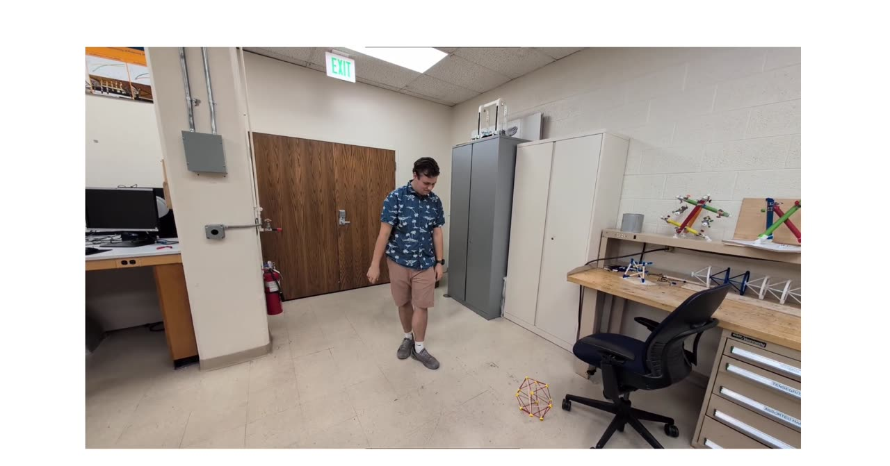

**Spoken script:**

> Let's take a second and just define what tensegrity is. Tensegrity is
> defined by having rigid struts suspended in a sea of tension elements.
> These green parts are the rigid elements, meaning they are constantly in
> compression; you can see the green arrows for where the forces are. The
> red parts represent cables that are in tension. You'll notice that none
> of the struts touch each other. They are all suspended in a state of
> self-tension. It's a bit like taking a spring and placing an object on
> top of it, so the spring is in a stressed state. The difference is that
> tensegrity devices are self-stressed: the stress is internal to the
> system, as if an object were resting on them, even before anything is.
> They are in a state of pre-stress.

**Your notes:**

- Delivery: "I have to really watch my arms during the presentation."
- Add the inextensible-cables point to your written definition: ideally
  the tendons behave as inextensible cables. Steel wire is the classical
  choice, but it makes the structure very stiff; softer cables can give
  better energy absorption, at least in low-impact cases. (This sets up
  the tensegrity-inspired definition later.)

### 7. Steve Mould 2D clip ([11:25](https://youtu.be/-0qPEmmgSBA?t=685))

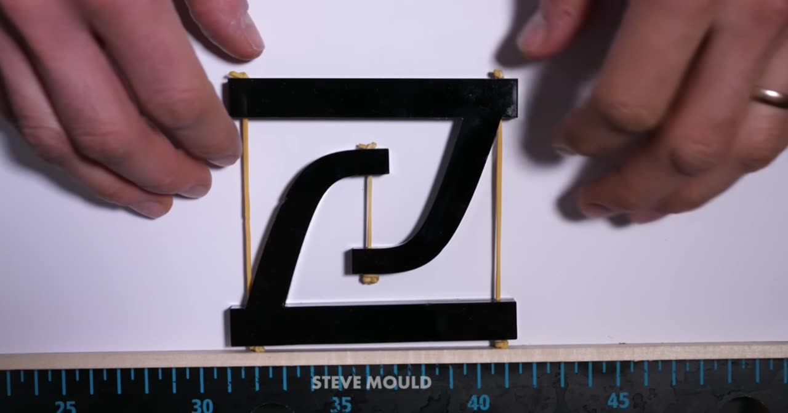

**Spoken lead-in:**

> Now, this doesn't seem like it would be a very stable structure, but the
> physics behind it actually make it very, very stable, and it means any
> impact it undergoes gets dispersed through the structure really well.
> Let's take a look at a 2D tensegrity object to illustrate how this
> works.

The clip plays (elastic bands stretch and restore equilibrium).

**Spoken wrap-up after the clip:**

> So tensegrity devices are actually quite stable, and any time you put a
> force on one, it distributes that force really well throughout the
> entire structure. Again: very good for energy absorption.

**Your notes:**

- Change the video to play automatically when the slide opens.

### 8. Assembly is slow: TensoLogic 12x video ([12:52](https://youtu.be/-0qPEmmgSBA?t=772))

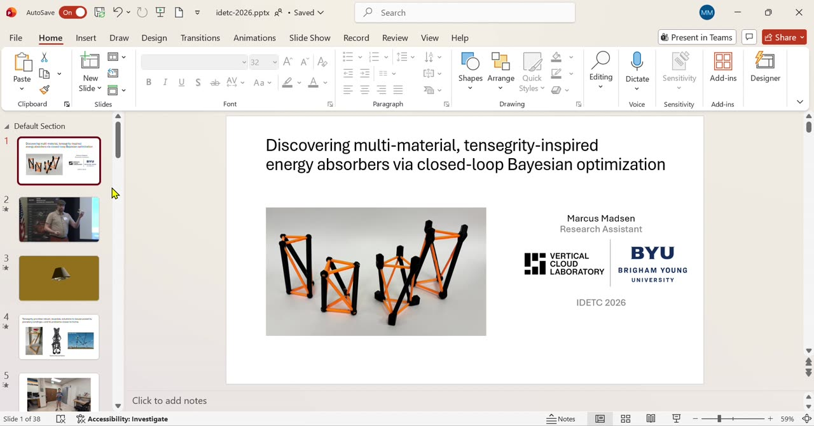

**Spoken script:**

> But not everything about tensegrity is ideal. The other properties are
> great: minimal mechanical grinding, because none of the parts touch;
> energy absorption, because impact disperses through the system really
> well. The biggest issue is that assembling these structures can be quite
> tedious. When you design them, you need every tendon cut to the right
> length so it has the right tension, and getting tension to be equivalent
> across the system is really, really difficult. You can see here that
> even with a kit, a simple T3 prism takes quite a bit of time, and if you
> scale up and add just a few more struts, the time it takes increases
> dramatically. So any time you want to design, build, or optimize these
> structures for a purpose, it takes a lot of time. It's a puzzle of
> figuring out how you are going to assemble it. That makes iteration
> very slow and makes these structures really difficult to optimize.

**Your notes:**

- "I'm obviously going to smooth that out. I'll probably write it out."
  (This section is that write-out; edit in place.)
- The hidden "Tensegrity's unique properties" slide is omitted for good;
  its two bullets (minimal grinding, force distribution) are now spoken
  here and at the Steve Mould wrap-up. You agreed with Sterling that the
  slide itself was awkward.

### 9. 3D-printed tensegrity, tensegrity-inspired ([14:27](https://youtu.be/-0qPEmmgSBA?t=867))

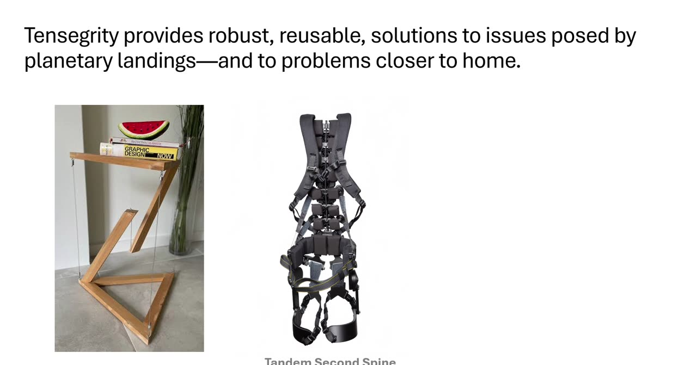

**Spoken script:**

> Perhaps it's this difficulty in assembling and creating these structures
> that has led to a wider sub-genre: 3D-printed tensegrity and
> tensegrity-inspired structures. I want to pause here and explain what
> "tensegrity-inspired" means. When the word tensegrity-inspired is used,
> it denotes a structure or concept that takes inspiration from
> tensegrity in one way or another, but omits one or more of the classical
> conditions. Perhaps it is not in a state of pre-stress but takes
> inspiration from the topology, the geometry, so it looks like a
> tensegrity structure without being pre-stressed. Or perhaps it does not
> have those ideal, inextensible cables.
>
> [Two-material structure, to be shown first:] This is a tensegrity device
> that's a lot easier to assemble, and you can actually tune the stress in
> it by how long these bands are printed before they're stretched, which
> is really helpful for quick iteration.
>
> [Mono-filament structure:] And this structure, though made entirely of
> one material and not pre-stressed, behaved similarly to a tensegrity
> structure in its stress-strain curve under quasi-static compression,
> which is nonlinear. The point is that even tensegrity-inspired devices
> still exhibit some of the same ideal mechanical properties that a true
> tensegrity device has.

**Your notes:**

- Swap the order: right image (two-material, Filipe) first, then the
  mono-filament Pajunen structure.
- Check the Pajunen material (a polyamide with a grade number) and decide
  whether to name it.

### 10. Dual-nozzle printing ([18:17](https://youtu.be/-0qPEmmgSBA?t=1097))

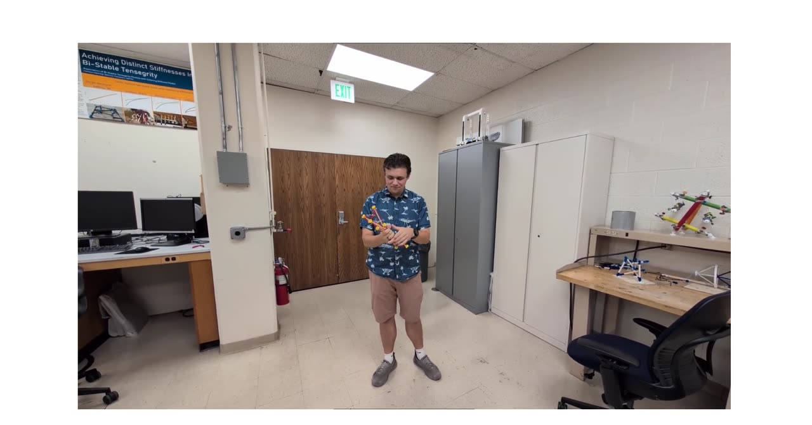

**Spoken script:**

> We wanted to take a step towards pre-assembled, 3D-printed tensegrity
> structures with dual-nozzle printing. What we've created here is a
> dual-filament, printed-as-is structure that is tensegrity-inspired.
> Tensegrity-inspired in this case because it is not pre-stressed; but
> instead of being all one filament, it has TPU, thermoplastic
> polyurethane, which has good damping properties, and these rigid PLA
> struts. So it takes heavy inspiration from the topology of a tensegrity
> structure, and it keeps part of the definition in that it has two
> materials: one that can act in tension when the structure is stressed,
> and the struts acting in compression.

**Your notes:**

- "This is the part I'm currently stumbling over most": why is this
  important? The framing you worked out on camera: print-in-place
  dual-filament structures with tensegrity topology are themselves
  somewhat novel (some professors we talked to didn't think it would be
  possible at all), but similar printed structures do exist, so the real
  novelty is not these objects; it is the intentional closed-loop
  optimization between them. "Something people have not done is an
  intentional closed-loop optimization process on these
  tensegrity-inspired structures, to get the geometry as ideal as
  possible. That is our entire goal."
- Double-check the TPU expansion and its damping properties before
  saying them.

*Suggestion:* that novelty sentence is strong enough to be the slide's
transition: "...struts acting in compression. Others have printed
structures like these. What no one had built is a loop that optimizes
them, and that loop is the rest of this talk."

### 11. Closed-loop workflow diagram ([20:56](https://youtu.be/-0qPEmmgSBA?t=1256))

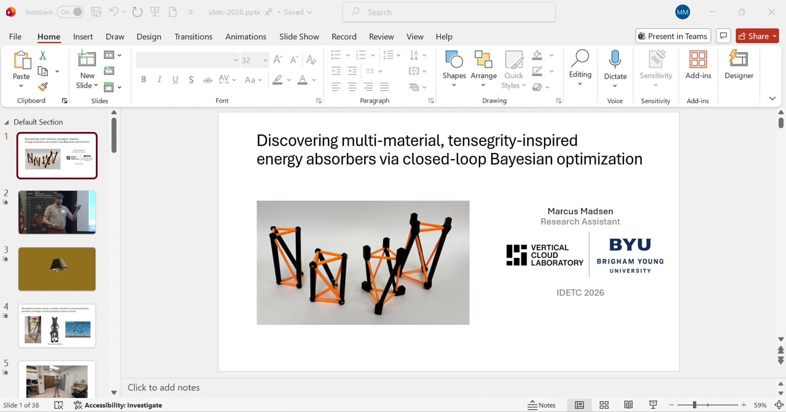

**Spoken script:**

> Our goal is to create these tensegrity-inspired structures, to be able
> to print them at all, and then to put them through a closed-loop
> optimization process to get the best energy and shock absorbers. We
> start with that goal, and then we design our experiments: the test we
> will measure them with. We make the materials, printing the structures.
> We test their performance. And then we loop: the results of each round
> determine where we test next, over and over, until we get a structure as
> optimized as possible, or we are satisfied, and we conclude the
> campaign.

**Your notes:**

- "Probably the most useful diagram I've ever seen AI come up with." The
  bottom-right node looked briefly funky to you, then fine.
- Still needs a worked-out introduction sentence for the slide.
- The "until funding runs out" joke: undecided (it lands at Sterling's
  expense; check with him).
- Later thought ([28:32]): maybe move this slide toward the BO side, walk
  through each loop step as its own beat, and maybe add a printing slide
  in the sequence. You wanted feedback on this before rearranging.

### 12. Search space: five geometry parameters ([23:00](https://youtu.be/-0qPEmmgSBA?t=1380) and [36:05](https://youtu.be/-0qPEmmgSBA?t=2165))

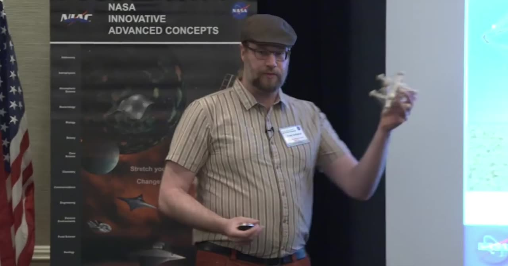

**Spoken script (second, fuller pass):**

> Because we're 3D printing them, we can control all the parameters of the
> structure. We can adjust the height of the model, the cable diameter,
> the triangle radius, the strut diameter, and the angle of twist between
> the triangles. And when we do this, we set specific geometric limits,
> for example the height can go from 60 to 110 millimeters, because some
> combinations of these are physically impossible. This is the search
> space in which we want to optimize our structure. Here are four of the
> nine starting designs, and these are the kind that we take and run
> through the drop tests.

**Spoken script (first pass, framing):**

> Let's look first at the parameters we're adjusting to optimize these
> structures. The T3 prism is relatively simple, and that's on purpose: we
> want to ensure the process works here so that we can apply it to other
> structures.

**Your notes:**

- You saw the note in the speaker notes ("Marcus: feel free to move,
  retitle, or hide this slide") and decided the slide is helpful and
  stays.
- The stepping-stone framing needs to land *earlier* in the talk: 3D
  printing is not the end goal; it is a stepping stone to quick iteration
  and testing, and the future targets are metamaterial-like lattices
  (Dr. Hill's interest, e.g., energy absorbers for package delivery,
  compared against foam) and crutch or walking-stick tips, so a real
  device made from this could be optimized. "It is a stepping stone in
  optimization; that is something to establish earlier on."
- Look up a proper definition of metamaterial before using the word.

### 13. Drop tower and instrumentation ([29:10](https://youtu.be/-0qPEmmgSBA?t=1750))

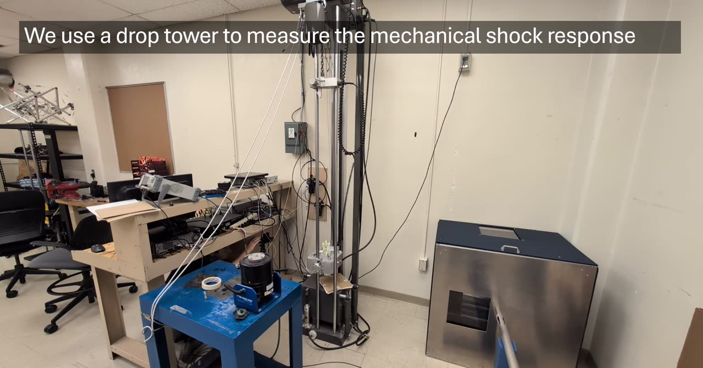

**Spoken script:**

> We want to optimize for energy absorption and shock response, so we set
> up a drop tower, where we can consistently drop from exactly the same
> height and deliver a nearly identical shock every time. In this video
> you can actually see my hand under the table taking the slow-motion
> video; we have a much safer way to do that now, a little more remotely.
> For our experiment, we take our specimens, strap them to this acrylic
> plate, and place two accelerometers: one at the top of the specimen and
> one at the bottom. That gives us the difference in acceleration between
> them when we drop. So from each drop we have a record of the
> acceleration that is input at the bottom of the specimen and the
> acceleration experienced at the top. We also capture slow-motion video.

**Your notes:**

- The hand-under-the-table aside is a keeper ("I think that's a good
  job/joke to put in there"); the "partially for fun" line about slow-mo,
  maybe not.
- Look into the acrylic plate: not fully confident on the material
  science of how well acrylic transmits shock; recollection is that
  magnesium is most ideal, aluminum second.
- Double-check what the slow-motion video actually tells us, so it can be
  described accurately.

### 14. Data slides: jolt, ringing, attenuation ([31:37](https://youtu.be/-0qPEmmgSBA?t=1897))

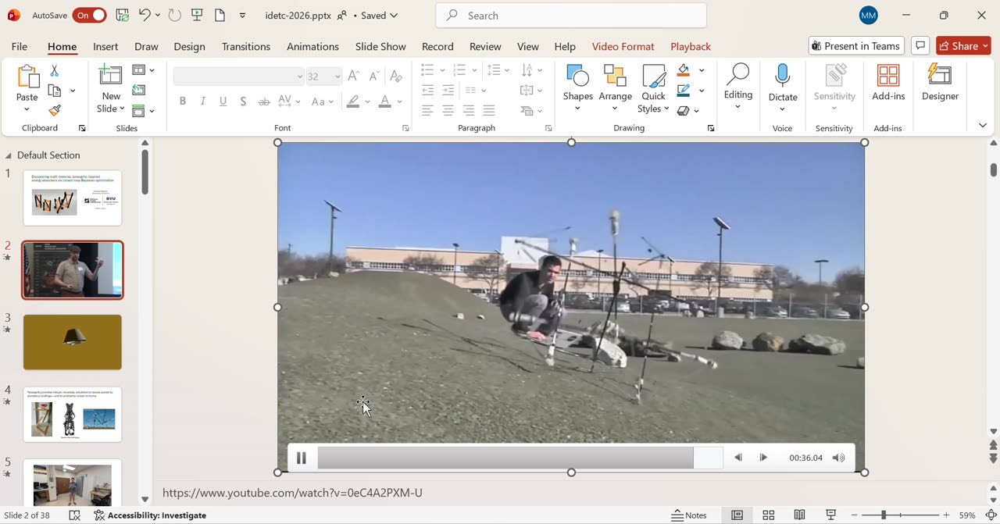

**What you want these slides to say:**

> We take the highest acceleration that the top of the structure
> undergoes, and compare it to the highest acceleration that the bottom of
> the structure undergoes, as a ratio between the two. If that number is
> greater than one, the shock is being amplified through the structure; it
> is worse at absorbing it. If it is less than one, and the closer it gets
> to zero (it will never reach zero), the better the structure is
> absorbing the shock. That is attenuation. We also look at how the shock
> reverberates through the structure in the milliseconds following: the
> quicker the oscillation dies back toward zero, the better the structure
> is absorbing that shock. And that is ultimately what we are looking to
> optimize: find the structure that best does that.

**Your notes:**

- "These slides definitely need some work" / "a little messy." Wanted:
  marker lines coming from the top of each peak (top sensor and bottom
  sensor) with the ratio shown, possibly written as math.
- Define attenuation and transmissibility properly (see
  [terms](#terms-to-clarify-and-where-to-look)); double-check the exact
  metric and the filtering.
- "I don't know why there's two of these": the stored deck has the jolt
  slide twice (slides 20 and 21) plus an untitled leftover (slide 19)
  whose figure still has the old "thousandths of a second (ms)" axis.
  Delete the duplicates.
- On the SAE J211 filter slide ([34:04]): "Is this AI's notes on this?
  Thank you, Claude." Note kept: understand the filter, decide whether to
  mention it aloud.

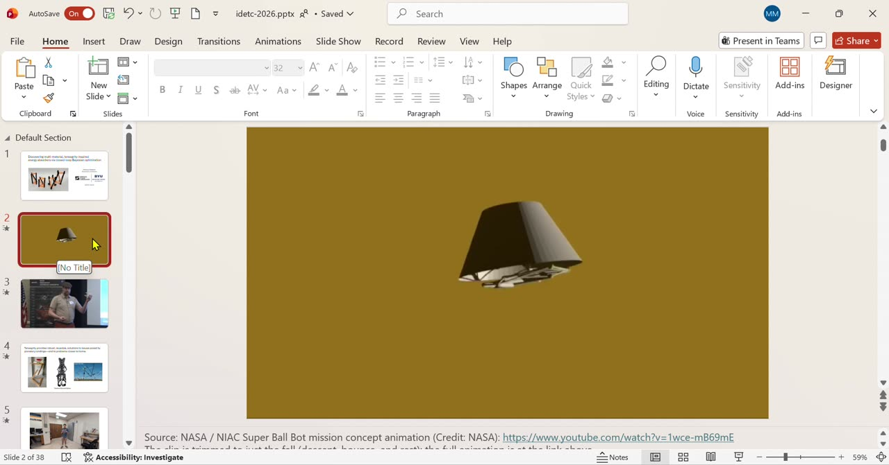

### 15. Make materials: printing details ([34:37](https://youtu.be/-0qPEmmgSBA?t=2077))

**What you want to add (possibly a new slide between the test-setup and
data blocks):**

> The next part is how we make our structures. We 3D print them as-is, in
> place. We've tested various methods for supports to get TPU to print
> well. TPU is hygroscopic, so it has to be kept dry, and because it's
> softer it jams in the printer more often. So we've built a relatively
> specialized setup out of on-the-market tools, and that's led to very
> consistent, relatively quick prints of these structures.

**Your notes:**

- Considered a mini navigation graphic (the loop diagram in a corner with
  the current stage highlighted) and decided it is probably unnecessary
  noise; say it vocally instead.

### 16. Bayesian optimization block ([37:44](https://youtu.be/-0qPEmmgSBA?t=2264))

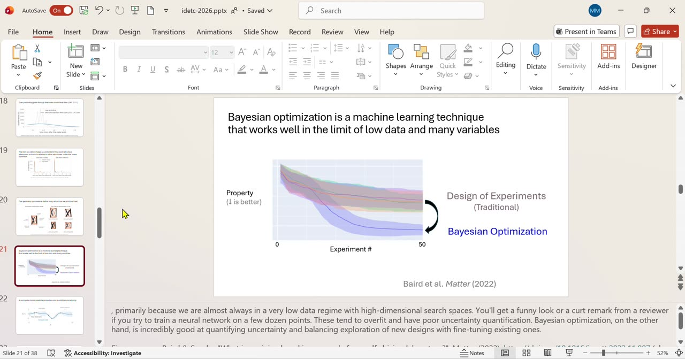

**Spoken script (intro slide):**

> We run these through our drop tests, but now we need a way to determine
> which structure is best and where we should test next. We could just do
> blind testing, thousands of structures across these parameters; we could
> go on for a very long time, and it would be very expensive in time and
> resources. We don't have infinite funding and we don't have infinite
> time. We need an optimization method that works well in the limit of low
> data and many variables. Who here has heard of Bayesian optimization?
> Traditional design of experiments, on this graph, only starts to
> optimize out here, and you can see it would take a long time to reach a
> true optimum of this property. Bayesian optimization, by around twelve
> to fifteen experiments, has already started this very steep improvement.
> And that is incredibly ideal for us.

**Spoken script (surrogate slide):**

> How does it work? You have a surrogate model, which is basically our
> best guess at reality. We are building a model to fit reality, and each
> test that we run and gather data on helps us pinch the model down toward
> what reality is. The black dots here are where we've made observations,
> and the bars extending from them are the standard deviation of our
> experiments, so there is some noise. As each point is added, the
> surrogate follows the true model really well.

**Spoken script (acquisition and loop):**

> The global optimum in the true model is what we want to discover, and we
> don't actually know the true model. The acquisition function helps us
> determine where we should test next. There are multiple ways of reading
> it, but all we need to know is that interpreting it tells us where to
> test next, we add data there, refit the surrogate to all of the data,
> and with just a few points we understand reality really well.

**Your notes:**

- Poll: "who here has heard of Bayesian optimization?" (hoping lab partner
  Chenquan raises his hand). Check pronunciation.
- Review the definition of traditional design of experiments.
- Re-review Sterling's speaker notes, especially what f(x) and x mean;
  "much better ways of wording" the loop close wanted.
- Sterling may have opinions on how this block is introduced.

### 17. "By connecting these ideas" ([42:04](https://youtu.be/-0qPEmmgSBA?t=2524))

**Spoken script:**

> With this, Bayesian optimization allows us to complete our loop fully.
> We can very quickly print the materials we've designed, run them through
> our designed experiment, and run the results through the Bayesian
> optimization process. By connecting all these ideas, we're able to
> iterate really quickly in this closed-loop optimization process.

**Your notes:**

- Unsure the slide reads well: the drop-tower photo is "a little janky"
  and the right-hand icon is "just a random symbol for a neural network."
  The note already typed in the slide proposes: printed-tensegrity image
  for the print step, drop-tower image for testing, black-box image for
  the BO step.

### 18. Future applications ([43:15](https://youtu.be/-0qPEmmgSBA?t=2595))

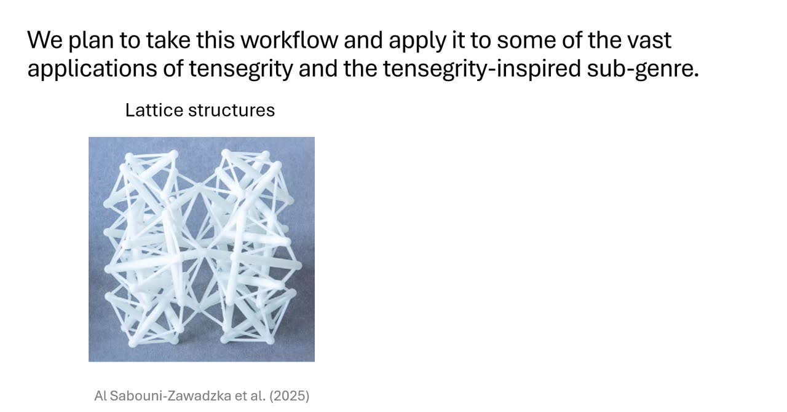

**Spoken plan:** reiterate how the workflow expands: lattice structures,
then the crutch and walking-stick tips ("this I'm a little more familiar
with").

**Your notes:**

- Look up the lattice paper cited on the slide (Al Sabouni-Zawadzka et
  al. 2025) or find a better example image of a lattice structure; right
  now it is only serving as "what a lattice looks like."
- Crutch tips: talk about partnering with them (team discussion item).

### 19. Closing and acknowledgments ([43:55](https://youtu.be/-0qPEmmgSBA?t=2635))

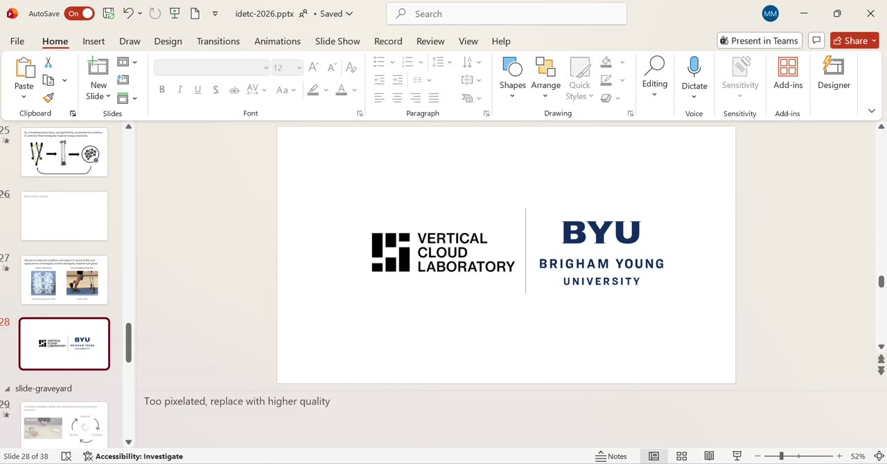

**Candidate closing line:**

> The faster we are able to iterate and advance ourselves, the better life
> we can enjoy living now, because our time is limited.

**Your notes:**

- Not sure if that is a good close or cheesy; decide.
- Wants some way to credit the team, Chenquan, Audrey, Sterling, and
  Dr. Hill, "because obviously I am not the only one doing this work,"
  whether or not it is spoken aloud. Aware Sterling may consider a name
  list noise; flagged for discussion.
- Keep a slide up during questions.
- The VCL + BYU logo image is too pixelated; replace with higher quality
  (note already typed on the slide).

*Suggestion:* the Doumont-style alternative to a general aphorism is to
bookend: put the Titan lander image back up and close with the concrete
version, e.g., "the next time someone needs to drop a package on another
world, a loop like this can hand them a tested design in weeks." Keeps
your sentiment, loses the cheese risk.

---

## Appendix: voice-to-text corrections

Recurring mishaps in the auto-transcript, corrected throughout this
document:

| Transcript said | Intended |
|---|---|
| "10-sacrity", "10 segredease", "tense equity", "10 Saturday" | tensegrity |
| "planetary ladder" | planetary lander |
| "regatrain" | rugged terrain |
| "two laws of printing" | dual-nozzle printing |
| "closed the federation process" | closed-loop optimization process |
| "thermo-polyurethane" | thermoplastic polyurethane (TPU) |
| "polymide with a specific like steel number" | a polyamide with a grade number (check the Pajunen paper) |
| "in the way of low low data" | in the limit of low data |
| "text and test next" | test next |
| "5th 1215 experiments" | about 12 to 15 experiments |
| "Chinquan" / "Chenquan" | lab partner's name, spelling to confirm |
| "Sterling Berg" | Sterling Baird |

Transcription was done locally with faster-whisper (small model) on the Box
download; the YouTube auto-captions were not used. Audio from embedded clips
(Steve Mould, NASA) bleeds into the transcript in places and was attributed
to the clips, not to Marcus.
