# Manuscript review video, session 1 of 3, part 1

Marcus Madsen's first recorded read-through of [`manuscript/manuscript.pdf`](../../manuscript/manuscript.pdf),
recorded 2026-09-02 and uploaded 2026-09-03 as
[youtu.be/2J5kxMXNCYY](https://youtu.be/2J5kxMXNCYY) (unlisted, 19 min 17 s, 2226 x 1280 at 30 fps).
It covers **pages 1 and 2 only**: title block, abstract, Introduction, and the Contributions list.
Everything from Section 2 onward is still unreviewed and is expected in the later sessions
described in [the plan comment on PR #76](https://github.com/vertical-cloud-lab/tensegrity-optimization/pull/76#issuecomment-5499997650).

The draft under review is the one built at commit `827301d`, the version with the violet
synthetic round-2 placeholder data.

**There are no comments on the video.** The YouTube API reports `comment_count: 0`, so there is
nothing to inlay at any timestamp. If comments are added later, re-running the pipeline in
[How this was produced](#how-this-was-produced) will pick them up and place them at their
timestamps.

## How to read this

Each of the 32 items below has the corrected transcript of what was said, a screenshot of what
was on screen at that moment, and a pointer into the LaTeX source. Screenshots live in
[`images/`](images/). Every timestamp links back into the video.

In the screenshots the reviewer's own selections are the anchor: he highlights the sentence he is
talking about in Acrobat before he talks about it, so the blue selection band in each crop is
literally what he is pointing at. In the collapsed "full screen" images, a **red box** marks that
selection, an **orange circle** marks the mouse pointer, and a **blue box** marks the region shown
in the main crop. Where he did not select anything, the mouse pointer is the anchor instead, so
each item also carries frames from two seconds before and two seconds after, since the pointer
often lands on the exact phrase for only a moment.

"Kind" in the table below is my classification, not his:

- **Change required**: he states the draft is wrong.
- **Change requested**: he wants it reworded and, in most cases, supplies the wording.
- **Verify** / **Confirm**: check something against the campaign or the code before the next draft.
- **Discussion needed**: blocked on a conversation with a named person.
- **Standing instruction**: a rule for all future edits, not a fix to one line.
- **Approved as written** / **Context** / **Deferred** / **Optional**: no edit owed.

## Item index

| # | Time | What it is | Kind |
|---|---|---|---|
| [1](#1-0044-to-0103--confirm-the-search-space-is-still-five-continuous-geometry-variables) | `00:44 to 01:03` | Confirm the search space is still five continuous geometry variables | Verify |
| [2](#2-0119-to-0124--projected-to-a-common-mass-budget-reads-as-fixed-mass-which-is-mostly-true) | `01:19 to 01:24` | "Projected to a common mass budget" reads as fixed mass, which is mostly true | Confirm |
| [3](#3-0140-to-0217--101-drops-per-specimen-is-now-21) | `01:40 to 02:17` | 101 drops per specimen is now 21 | Change required |
| [4](#4-0242-to-0247--define-transmissibility-in-parentheses-at-first-use-in-the-abstract) | `02:42 to 02:47` | Define transmissibility in parentheses at first use in the abstract | Change required |
| [5](#5-0304-to-0312--simulation-restricted-to-a-screening-role-is-read-as-the-proxy-variable-screen) | `03:04 to 03:12` | "Simulation restricted to a screening role" is read as the proxy-variable screen | Verify |
| [6](#6-0314-to-0327--confirm-any-simulation-work-actually-happened-before-the-abstract-leans-on-it) | `03:14 to 03:27` | Confirm any simulation work actually happened before the abstract leans on it | Verify |
| [7](#7-0335-to-0339--replace-the-second-peak-acceleration-ratio-with-transmissibility) | `03:35 to 03:39` | Replace the second "peak-acceleration ratio" with transmissibility | Change required |
| [8](#8-0348-to-0353--the-seed-and-round-2-numbers-are-expected-to-keep-moving) | `03:48 to 03:53` | The seed and round-2 numbers are expected to keep moving | Context |
| [9](#9-0405-to-0434--expect-five-or-more-bo-batches-the-abstract-cannot-narrate-all-of-them) | `04:05 to 04:34` | Expect five or more BO batches; the abstract cannot narrate all of them | Change likely |
| [10](#10-0459-to-0506--keep-the-closing-transfer-sentence-it-is-the-important-one) | `04:59 to 05:06` | Keep the closing transfer sentence; it is the important one | Approved as written |
| [11](#11-0543-to-0612--hypervolume-claims-deferred-for-a-closer-look) | `05:43 to 06:12` | Hypervolume claims deferred for a closer look | Deferred, follow-up owed |
| [12](#12-0613-to-0632--author-order-and-footnote-markers-are-fine-decide-the-email-question-with-dr-baird) | `06:13 to 06:32` | Author order and footnote markers are fine; decide the email question with Dr. Baird | Decision needed |
| [13](#13-0703-to-0722--reference-audit-deliberately-deferred-to-a-later-pass) | `07:03 to 07:22` | Reference audit deliberately deferred to a later pass | Deferred |
| [14](#14-0811-to-0813--rigid-soft-caveat-paragraph-verified-as-accurate) | `08:11 to 08:13` | Rigid-soft caveat paragraph verified as accurate | Approved as written |
| [15](#15-0822-to-0830--equivalence-to-an-ideal-cable-strut-prism-and-the-fdm-paragraph-verified) | `08:22 to 08:30` | "Equivalence to an ideal cable-strut prism" and the FDM paragraph verified | Approved as written |
| [16](#16-0906-to-0912--check-the-origami-and-honeycomb-sources-and-examples) | `09:06 to 09:12` | Check the origami and honeycomb sources and examples | Verify |
| [17](#17-0940-to-0942--pla-compression-stiffness-statement-verified) | `09:40 to 09:42` | PLA compression stiffness statement verified | Approved as written |
| [18](#18-1001-to-1100--the-gap-this-paper-addresses-sentence-is-awkward) | `10:01 to 11:00` | The "gap this paper addresses" sentence is awkward | Change requested |
| [19](#19-1104-to-1135--delete-the-round-2-placeholder-parenthetical-from-the-introduction) | `11:04 to 11:35` | Delete the round-2 placeholder parenthetical from the Introduction | Change required |
| [20](#20-1136-to-1210--flight-hardware-framing-is-fine-the-stepping-stone-point-could-be-sharper) | `11:36 to 12:10` | Flight-hardware framing is fine; the stepping-stone point could be sharper | Optional |
| [21](#21-1215-to-1315--pla-compression-members-and-tpu-tension-elements-overstates-the-load-paths) | `12:15 to 13:15` | "PLA compression members and TPU tension elements" overstates the load paths | Change required |
| [22](#22-1318-to-1335--replacement-wording-offered-for-the-tension-element-claim) | `13:18 to 13:35` | Replacement wording offered for the tension-element claim | Concrete wording |
| [23](#23-1336-to-1353--remain-untested-is-right-add-that-it-is-an-area-of-future-interest) | `13:36 to 13:53` | "Remain untested" is right; add that it is an area of future interest | Optional |
| [24](#24-1355-to-1412--contribution-2-still-says-101-repeated-drops) | `13:55 to 14:12` | Contribution 2 still says 101 repeated drops | Change required |
| [25](#25-1412-to-1415--sae-j211-filtering-is-fine) | `14:12 to 14:15` | SAE J211 filtering is fine | Approved as written |
| [26](#26-1416-to-1504--velocity-change-rig-health-gate-probably-cut-it-or-move-it-to-the-si) | `14:16 to 15:04` | Velocity-change rig-health gate: probably cut it or move it to the SI | Discussion needed |
| [27](#27-1506-to-1542--define-it-once-then-call-it-transmissibility-everywhere) | `15:06 to 15:42` | Define it once, then call it transmissibility everywhere | Change requested |
| [28](#28-1544-to-1640--cut-the-simulation-ladder-contribution) | `15:44 to 16:40` | Cut the simulation-ladder contribution | Change required, pending confirmation |
| [29](#29-1644-to-1712--contribution-5-is-labeled-planned) | `16:44 to 17:12` | Contribution 5 is labeled "planned" | Change required |
| [30](#30-1712-to-1800--standing-instruction-no-promised-contributions-and-color-every-placeholder) | `17:12 to 18:00` | Standing instruction: no promised contributions, and color every placeholder | Standing instruction |
| [31](#31-1805-to-1830--expect-real-tensegrity-to-behave-differently-from-tensegrity-inspired) | `18:05 to 18:30` | Expect real tensegrity to behave differently from tensegrity-inspired | Context |
| [32](#32-1831-to-1916--the-planned-quasi-static-extension-is-reported-separately-as-pending-reads-like-an-ai-status-report) | `18:31 to 19:16` | "The planned quasi-static extension is reported separately as pending" reads like an AI status report | Change requested |

## Cross-cutting themes

Six threads account for most of the 32 items.

**1. The per-specimen drop count is stale.** The campaign moved from 101 drops per specimen to 21,
and the draft still says 101 in eleven places (items [3](#3-0140-to-0217--101-drops-per-specimen-is-now-21)
and [24](#24-1355-to-1412--contribution-2-still-says-101-repeated-drops)). The change is not a
find-and-replace: the reviewer wants the move to 21 validated and justified in the text, and he
explicitly asked that the underlying drop data be checked by a person rather than by an agent.

**2. Name the objective once and then use the short name.** Three separate times he asks for
"filtered peak-acceleration ratio (transmissibility)" at first use and "transmissibility"
thereafter (items [4](#4-0242-to-0247--define-transmissibility-in-parentheses-at-first-use-in-the-abstract),
[7](#7-0335-to-0339--replace-the-second-peak-acceleration-ratio-with-transmissibility) and
[27](#27-1506-to-1542--define-it-once-then-call-it-transmissibility-everywhere)). He invites
pushback on the last one if there is a technical reason to keep the long form.

**3. The simulation content is probably coming out.** Raised as a question at
[03:14](#6-0314-to-0327--confirm-any-simulation-work-actually-happened-before-the-abstract-leans-on-it)
and resolved at [15:44](#28-1544-to-1640--cut-the-simulation-ladder-contribution): on the basis of
a comment near the bottom of issue #99 and the meeting of Tuesday 2026-09-01, the simulation ladder
looks dropped, so contribution 4, Section 3.5, and the abstract clause "with simulation restricted
to a screening role" all go with it. He asks for the decision to be double checked first, and
expects to have to justify the removal.

**4. Nothing that has not happened may be claimed as a contribution.** Contribution 5 is still
labeled "planned" (item [29](#29-1644-to-1712--contribution-5-is-labeled-planned)), which he calls
presumptuous, and the standing rule that follows
(item [30](#30-1712-to-1800--standing-instruction-no-promised-contributions-and-color-every-placeholder))
is the most consequential instruction in the video: every statement is either backed by data in
hand or visually marked as a placeholder, and promised work moves to future work phrased as
"in the future we plan to."

**5. The rigid and soft members are not pure compression and tension elements.** There is no
pretension at equilibrium, and under impact he has watched some cables stretch while others buckle
(items [21](#21-1215-to-1315--pla-compression-members-and-tpu-tension-elements-overstates-the-load-paths)
and [22](#22-1318-to-1335--replacement-wording-offered-for-the-tension-element-claim)). The
Introduction already says this correctly at `manuscript-body.tex:225`, which he approved at
[08:11](#14-0811-to-0813--rigid-soft-caveat-paragraph-verified-as-accurate); the Contributions list
contradicts it.

**6. In places the draft reports on the project instead of stating the work.** His sharpest phrasing
is at [19:00](#32-1831-to-1916--the-planned-quasi-static-extension-is-reported-separately-as-pending-reads-like-an-ai-status-report):
"it just, to me, sounds like this is AI reporting on what we've said we intend to do, rather than us
reporting it here." The Introduction parenthetical he asks to delete
(item [19](#19-1104-to-1135--delete-the-round-2-placeholder-parenthetical-from-the-introduction))
is the same fault in a different place.

## Open questions for the team

- **@sgbaird**: do all five authors list a BYU email, or only the corresponding authors?
  (item [12](#12-0613-to-0632--author-order-and-footnote-markers-are-fine-decide-the-email-question-with-dr-baird))
- **@achris0520 and Jinkwan Han**: is the velocity-change rig-health gate worth keeping in the
  paper at all? The reviewer's lean is to cut it from Contributions and, if kept, move it to the
  supplementary information.
  (item [26](#26-1416-to-1504--velocity-change-rig-health-gate-probably-cut-it-or-move-it-to-the-si))
- **Anyone**: is the search space still exactly five continuous geometry variables, or has infill
  percentage joined it? (item [1](#1-0044-to-0103--confirm-the-search-space-is-still-five-continuous-geometry-variables))
- **Anyone**: confirm the issue #99 simulation decision before the simulation content is removed.
  (item [28](#28-1544-to-1640--cut-the-simulation-ladder-contribution))

## Detailed items

### 1. 00:44 to 01:03 | Confirm the search space is still five continuous geometry variables

**Verify.** Reconcile the abstract against the search space the campaign is actually running. If infill percentage became a search variable, both the count in the abstract and the parameterization table have to change, and the count is repeated in the Contributions list and Methods.

> We should probably double check. I believe we're still at five continuous geometry variables. I know that we've now added in a couple of other things, like I believe infill percent is now added. We should just double check to make sure that this is correct in what we're doing.

**On screen** ([jump to 00:44 in the video](https://youtu.be/2J5kxMXNCYY?t=44)): Abstract lines iii to v. The text cursor is parked immediately after "five continuous geometry variables."

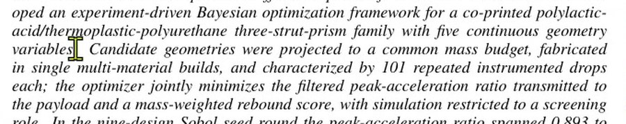

**Where in the source:** `manuscript/manuscript-body.tex:154` (abstract), plus the parameterization table in Section 3.1

Burst frames and full screen

Mouse pointer detected at (1024, 388) in the 2226 x 1280 frame.

**00:44 (2 s before)**

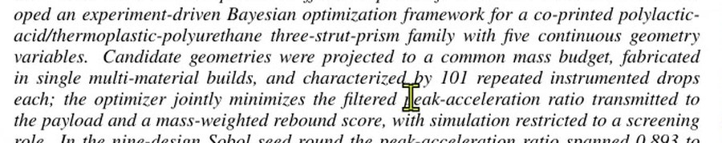

**00:48 (2 s after)**

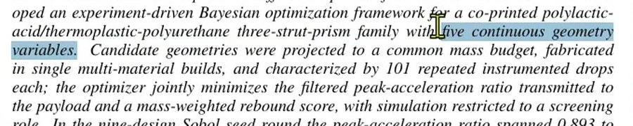

**Full screen at 00:46.** Red box: the reviewer's text selection. Orange circle: the mouse pointer. Blue box: the region cropped above.

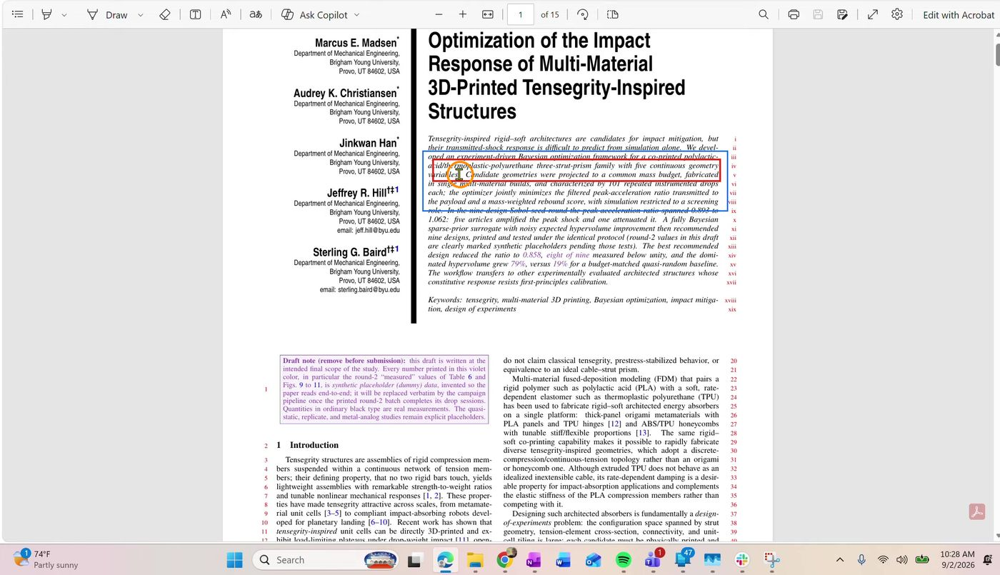

---

### 2. 01:19 to 01:24 | "Projected to a common mass budget" reads as fixed mass, which is mostly true

**Confirm.** No edit demanded. The word "mostly" is the interesting part: if the as-printed masses still spread around the target, the abstract should not imply the constraint is exact. Worth one sentence stating the achieved mass spread.

> I'm going to assume that this is just a way of saying we're using a fixed mass, which is mostly true.

**On screen** ([jump to 01:19 in the video](https://youtu.be/2J5kxMXNCYY?t=79)): Selection: "Candidate geometries were projected to a common mass budget,"

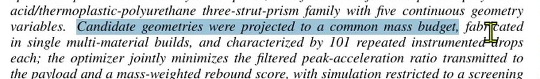

**Where in the source:** `manuscript/manuscript-body.tex:155`

Burst frames and full screen

Mouse pointer detected at (1560, 394) in the 2226 x 1280 frame.

**01:22 (2 s before)**

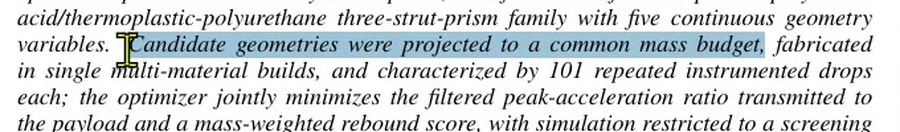

**01:26 (2 s after)**

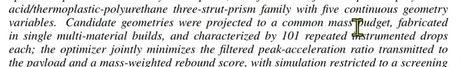

**Full screen at 01:24.** Red box: the reviewer's text selection. Orange circle: the mouse pointer. Blue box: the region cropped above.

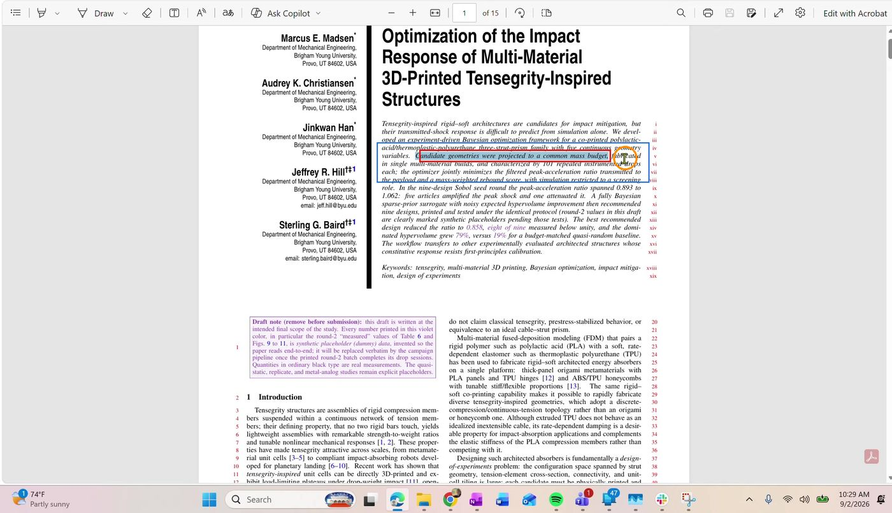

---

### 3. 01:40 to 02:17 | 101 drops per specimen is now 21

**Change required.** Change the per-specimen drop count from 101 to 21 everywhere, and re-derive the affected summary statistics. Second, explicit instruction: verify the underlying drop data by hand rather than delegating the check to an agent.

> Currently we were at 101 drops. However, we are adjusting that right now to 21 to do this. So maybe we should adjust the wording for this so that it's 21 drops each, as long as that doesn't sound too bad for the manuscript. That is what we're currently doing. Maybe we should make a note to just double check that that data is accurate. We should probably go through that more thoroughly than just having Claude do it.

**On screen** ([jump to 01:40 in the video](https://youtu.be/2J5kxMXNCYY?t=100)): Selection spans "characterized by 101 repeated instrumented drops each; the optimizer jointly minimizes the filtered peak-acceleration ratio transmitted to the payload and a mass-weighted rebound score, with simulation restricted to a screening [role]"

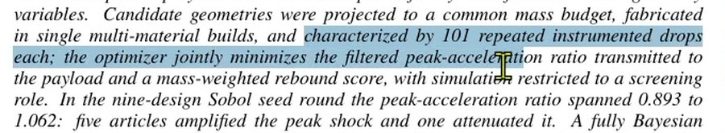

**Where in the source:** Nine places in `manuscript/manuscript-body.tex`: lines 156, 297, 839, 859, 1204, 1248, 1400, 1417, 1677. Two in `manuscript/supplementary.tex`: lines 201 and 274. (`supplementary.tex:294` says "issue #101", which is an issue number, not a drop count. Leave it.)

Burst frames and full screen

Mouse pointer was stationary here, so frame differencing found no pointer.

**01:42 (2 s before)**

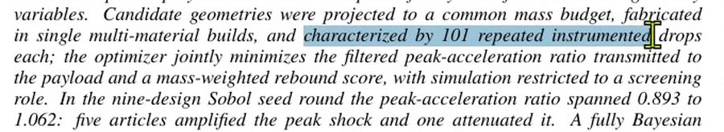

**01:46 (2 s after)**

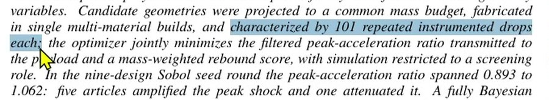

**Full screen at 01:44.** Red box: the reviewer's text selection. Orange circle: the mouse pointer. Blue box: the region cropped above.

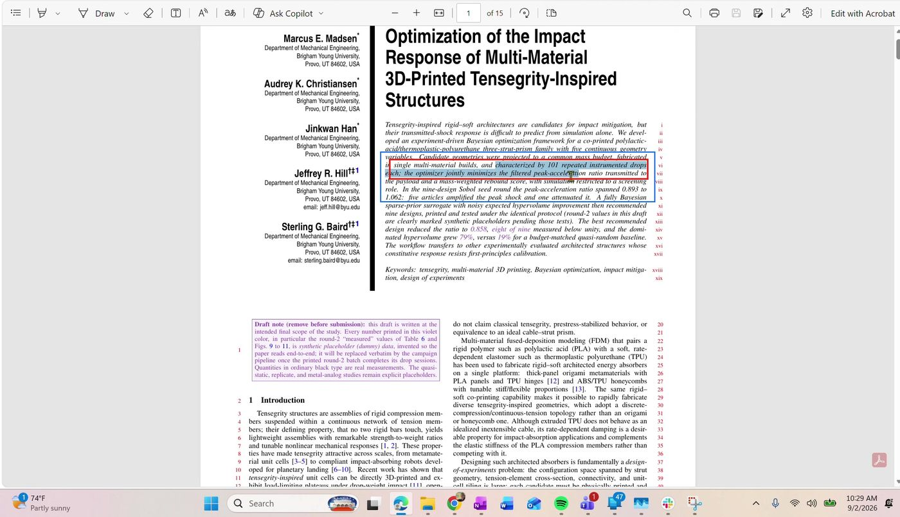

---

### 4. 02:42 to 02:47 | Define transmissibility in parentheses at first use in the abstract

**Change required.** At the abstract's first use, write "filtered peak-acceleration ratio (transmissibility)", then use transmissibility from that point on. This is the first of three separate times the same request comes up; see items 7 and 27.

> We could probably put in parentheses "transmissibility" right here, and use transmissibility in the future.

**On screen** ([jump to 02:42 in the video](https://youtu.be/2J5kxMXNCYY?t=162)): Selection: "acceleration ratio", inside "the filtered peak-acceleration ratio transmitted to the payload"

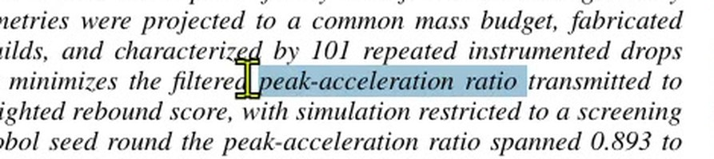

**Where in the source:** `manuscript/manuscript-body.tex:158`

Burst frames and full screen

Mouse pointer detected at (1320, 426) in the 2226 x 1280 frame.

**02:42 (2 s before)**

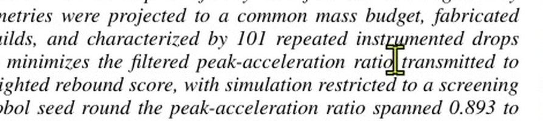

**02:46 (2 s after)**

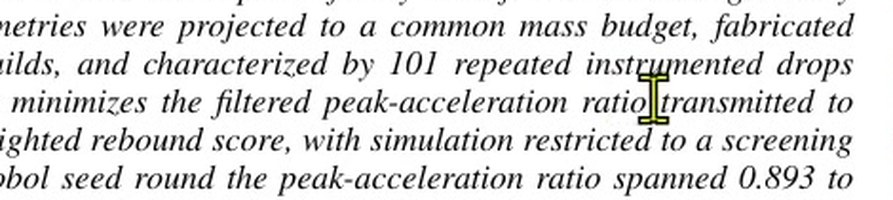

**Full screen at 02:44.** Red box: the reviewer's text selection. Orange circle: the mouse pointer. Blue box: the region cropped above.

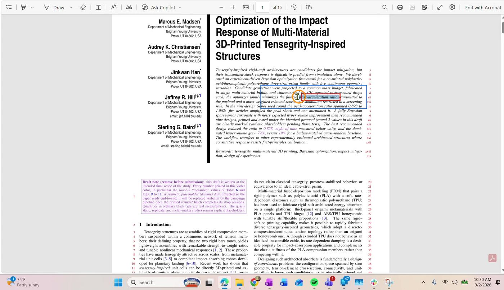

---

### 5. 03:04 to 03:12 | "Simulation restricted to a screening role" is read as the proxy-variable screen

**Verify.** Confirm that phrase is meant to name the simulation screening step and not something else. If simulation is cut (item 28), this clause goes with it.

> I'm going to guess this is what we're calling our proxy variable screen.

**On screen** ([jump to 03:04 in the video](https://youtu.be/2J5kxMXNCYY?t=184)): Selection lands on "with simulation restricted to a screening role."

**Where in the source:** `manuscript/manuscript-body.tex:159`

Burst frames and full screen

Mouse pointer detected at (1471, 450) in the 2226 x 1280 frame.

**03:13 (2 s before)**

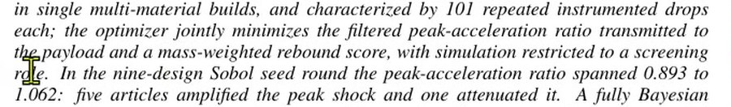

**03:17 (2 s after)**

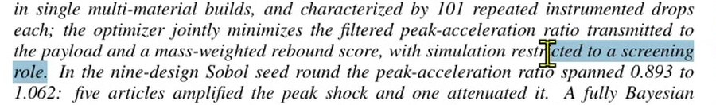

**Full screen at 03:15.** Red box: the reviewer's text selection. Orange circle: the mouse pointer. Blue box: the region cropped above.

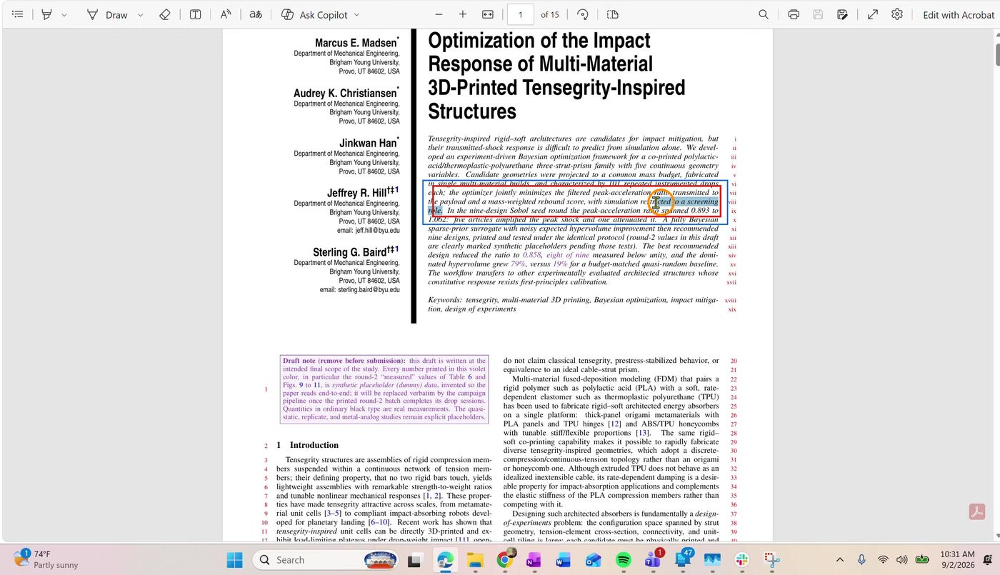

---

### 6. 03:14 to 03:27 | Confirm any simulation work actually happened before the abstract leans on it

**Verify.** This thread is left open here and closed at 15:44 to 16:40 (item 28), where the reviewer concludes from issue #99 and the meeting of Tuesday 2026-09-01 that the simulation work has been dropped. Treat items 5, 6 and 28 as one decision.

> Again, still need to double check and ensure we're actually doing any simulation data. It seems we've done a little bit. A report on that would probably be good to pull up. Maybe I'll do that really quick. All right, I'm pulling that up now.

**On screen** ([jump to 03:14 in the video](https://youtu.be/2J5kxMXNCYY?t=194)): Same abstract region; the reviewer leaves the PDF to look up the simulation report.

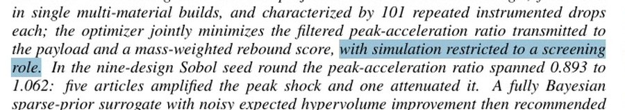

**Where in the source:** `manuscript/manuscript-body.tex:159`, Section 3.5, and contribution 4 at line 313

Burst frames and full screen

Mouse pointer detected at (1468, 334) in the 2226 x 1280 frame.

**03:23 (2 s before)**

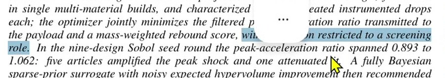

**03:27 (2 s after)**

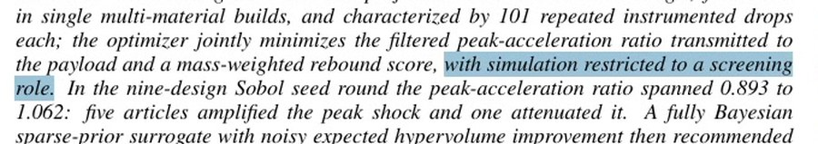

**Full screen at 03:25.** Red box: the reviewer's text selection. Orange circle: the mouse pointer. Blue box: the region cropped above.

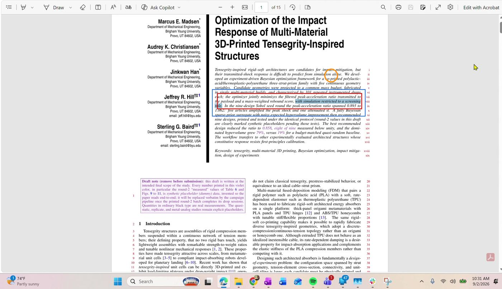

---

### 7. 03:35 to 03:39 | Replace the second "peak-acceleration ratio" with transmissibility

**Change required.** Direct consequence of item 4. Once transmissibility is defined at first use, every later occurrence in the abstract uses the short name.

> Yeah, just a note: probably replace this with "transmissibility" after putting that in earlier.

**On screen** ([jump to 03:35 in the video](https://youtu.be/2J5kxMXNCYY?t=215)): Selection: "peak-acceleration ratio" inside "In the nine-design Sobol seed round the peak-acceleration ratio spanned 0.893 to 1.062"

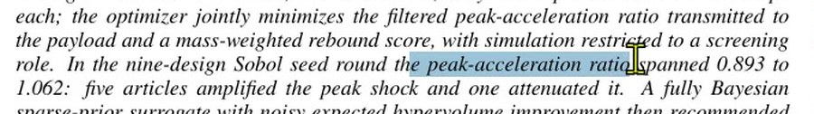

**Where in the source:** `manuscript/manuscript-body.tex:160`

Burst frames and full screen

Mouse pointer detected at (1469, 464) in the 2226 x 1280 frame.

**03:36 (2 s before)**

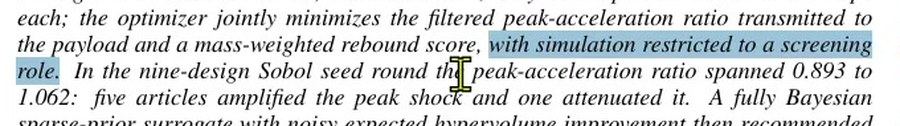

**03:40 (2 s after)**

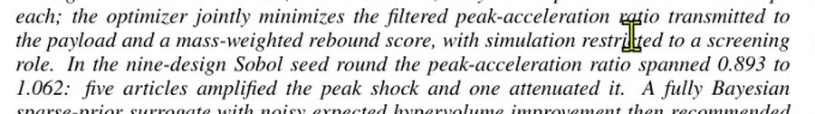

**Full screen at 03:38.** Red box: the reviewer's text selection. Orange circle: the mouse pointer. Blue box: the region cropped above.

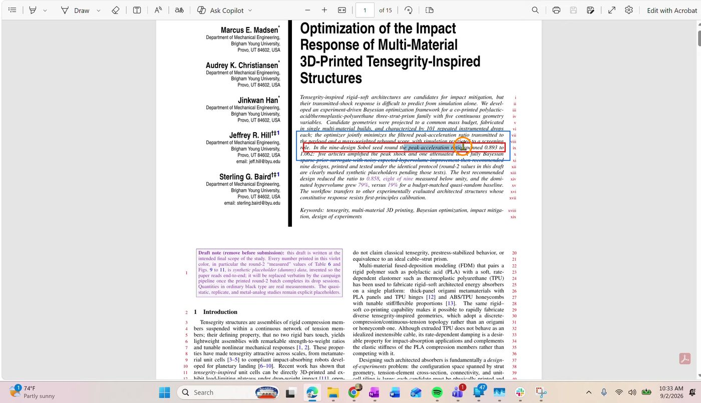

---

### 8. 03:48 to 03:53 | The seed and round-2 numbers are expected to keep moving

**Context.** No edit. Recorded so the numbers in this region are understood as live rather than final.

> This will of course be updated as our data gets updated, or as we add in more batches of Bayesian optimization data.

**On screen** ([jump to 03:48 in the video](https://youtu.be/2J5kxMXNCYY?t=228)): Selection starts at "A fully Bayesian sparse-prior surrogate with noisy expected hypervolume improvement then recommended nine designs..."

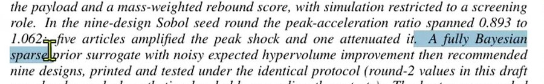

**Where in the source:** `manuscript/manuscript-body.tex:162` to `165`

Burst frames and full screen

Mouse pointer detected at (1017, 505) in the 2226 x 1280 frame.

**03:50 (2 s before)**

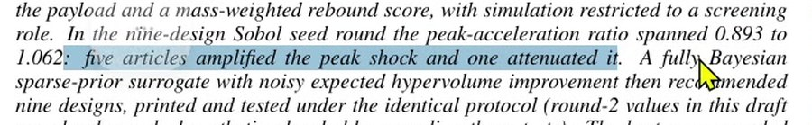

**03:54 (2 s after)**

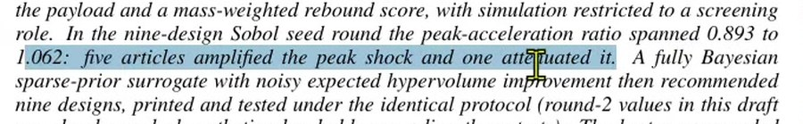

**Full screen at 03:52.** Red box: the reviewer's text selection. Orange circle: the mouse pointer. Blue box: the region cropped above.

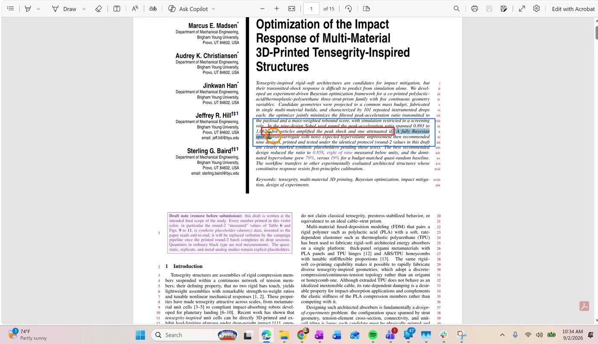

---

### 9. 04:05 to 04:34 | Expect five or more BO batches; the abstract cannot narrate all of them

**Change likely.** The abstract currently walks round 1 then round 2 in sequence. Plan a form that still works at five or more rounds: report the campaign in aggregate (budget, best design, gain over baseline) instead of per-round narration.

> Never mind, I see how it's doing this. It's running through exactly what we're doing. So I'm going to guess we may run through, or probably run through, at least five batches of this, depending on if each batch continues to improve. Maybe more. Maybe we'll kind of hit a peak relatively quickly. But if we do run through so many batches, we may not be able to discuss all five in order through here, as this is going through the first two.

**On screen** ([jump to 04:05 in the video](https://youtu.be/2J5kxMXNCYY?t=245)): Selection covers the recommend-and-test sentence and the round-2 placeholder parenthetical.

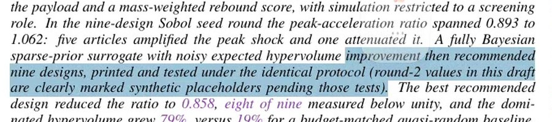

**Where in the source:** `manuscript/manuscript-body.tex:162` to `169`

Burst frames and full screen

Mouse pointer detected at (1140, 614) in the 2226 x 1280 frame.

**04:08 (2 s before)**

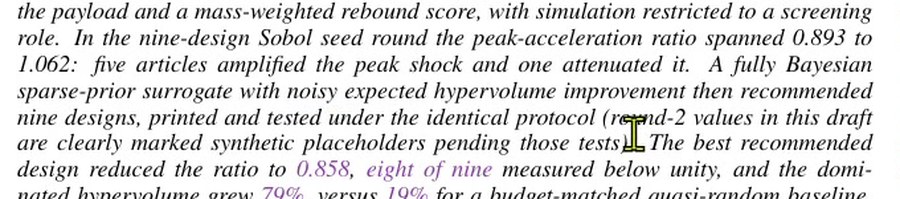

**04:12 (2 s after)**

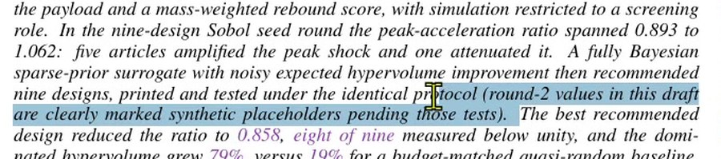

**Full screen at 04:10.** Red box: the reviewer's text selection. Orange circle: the mouse pointer. Blue box: the region cropped above.

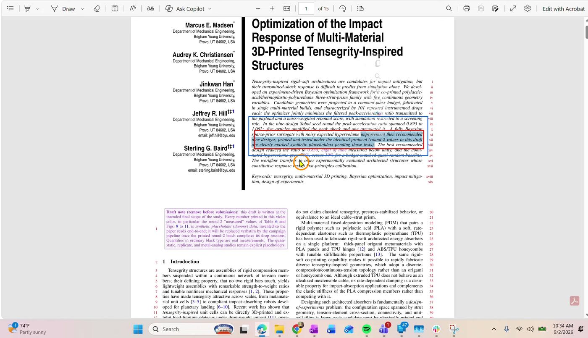

---

### 10. 04:59 to 05:06 | Keep the closing transfer sentence; it is the important one

**Approved as written.** No edit. Flagged as a line to protect during future rewrites.

> I like that last line. That's very important. [Then, reading the previous line:] Dominated hypervolume.

**On screen** ([jump to 04:59 in the video](https://youtu.be/2J5kxMXNCYY?t=299)): Selection: "constitutive response resists first-principles calibration."

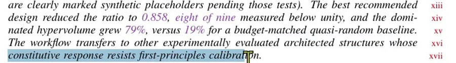

**Where in the source:** `manuscript/manuscript-body.tex:170` to `172`

Burst frames and full screen

Mouse pointer was stationary here, so frame differencing found no pointer.

**04:59 (2 s before)**

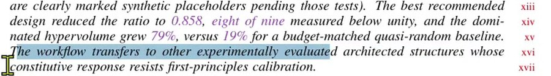

**05:03 (2 s after)**

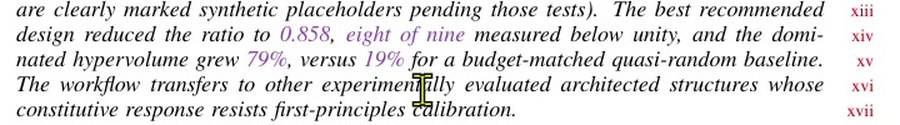

**Full screen at 05:01.** Red box: the reviewer's text selection. Orange circle: the mouse pointer. Blue box: the region cropped above.

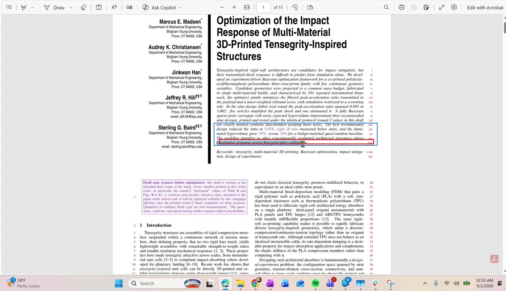

---

### 11. 05:43 to 06:12 | Hypervolume claims deferred for a closer look

**Deferred, follow-up owed.** Open item owned by the reviewer, not by the draft. The hypervolume growth numbers are placeholders and cannot be checked until the round-2 batch is measured.

> Okay, let's skip over hypervolume for now. I'm going to look into that a little bit more.

**On screen** ([jump to 05:43 in the video](https://youtu.be/2J5kxMXNCYY?t=343)): Page 1 abstract, the line "the dominated hypervolume grew 79%, versus 19% for a budget-matched quasi-random baseline." Both percentages are violet synthetic placeholders. The mouse is idling near the corresponding-author email block.

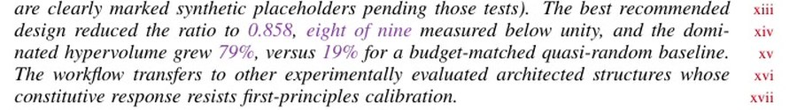

**Where in the source:** `manuscript/manuscript-body.tex:168` to `170`

Burst frames and full screen

Mouse pointer detected at (899, 647) in the 2226 x 1280 frame.

**06:04 (2 s before)**

**06:08 (2 s after)**

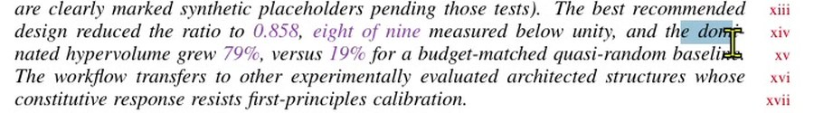

**Full screen at 06:06.** Red box: the reviewer's text selection. Orange circle: the mouse pointer. Blue box: the region cropped above.

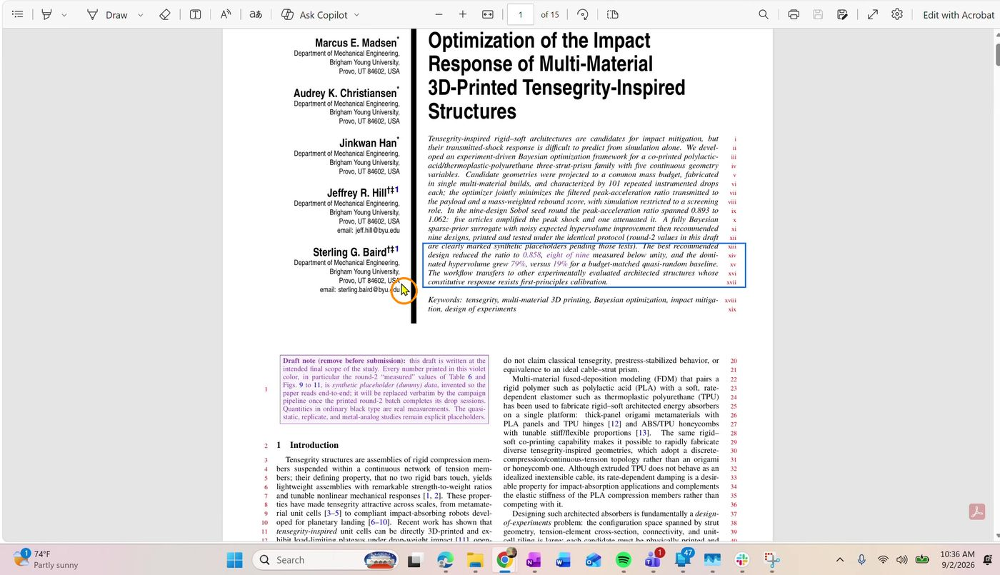

---

### 12. 06:13 to 06:32 | Author order and footnote markers are fine; decide the email question with Dr. Baird

**Decision needed.** Decide whether all five authors list a university email or only the corresponding authors. `manuscript-body.tex:198` already carries a TODO to confirm affiliations and add emails for M. Madsen, A. Christiansen, and J. Han, so this is the decision that closes it. @sgbaird is the one to answer.

> Author order all looks good. And I think these contributions here are good. I see no typos. I don't know if we want to put in our school emails right here. Should probably double check that with Dr. Baird. Make note of that.

**On screen** ([jump to 06:13 in the video](https://youtu.be/2J5kxMXNCYY?t=373)): The whole author block is selected, from Marcus E. Madsen through Sterling G. Baird. Only Jeffrey R. Hill and Sterling G. Baird currently show email addresses.

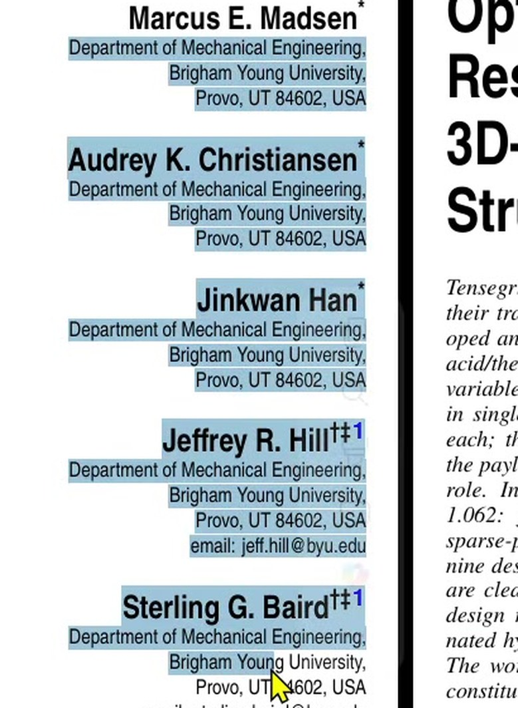

**Where in the source:** `manuscript/manuscript-body.tex:106` to `135`, TODO at line 198

Burst frames and full screen

Mouse pointer detected at (817, 769) in the 2226 x 1280 frame.

**06:13 (2 s before)**

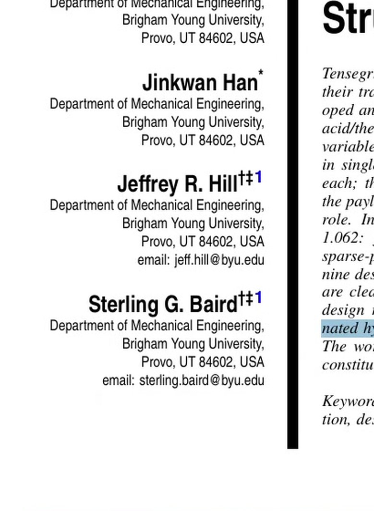

**06:17 (2 s after)**

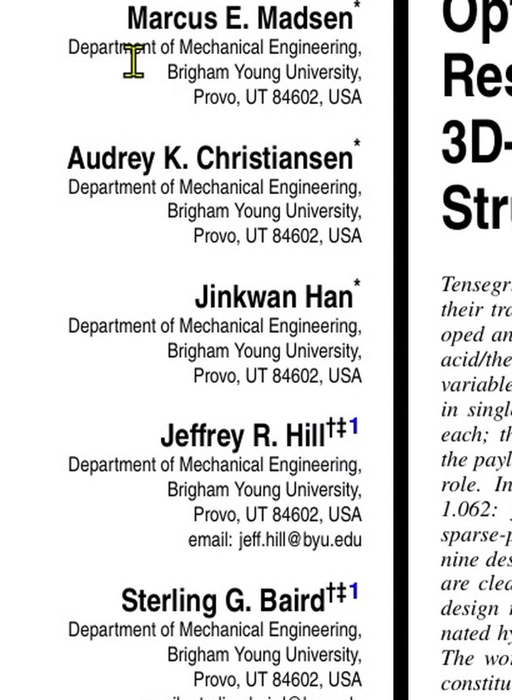

**Full screen at 06:15.** Red box: the reviewer's text selection. Orange circle: the mouse pointer. Blue box: the region cropped above.

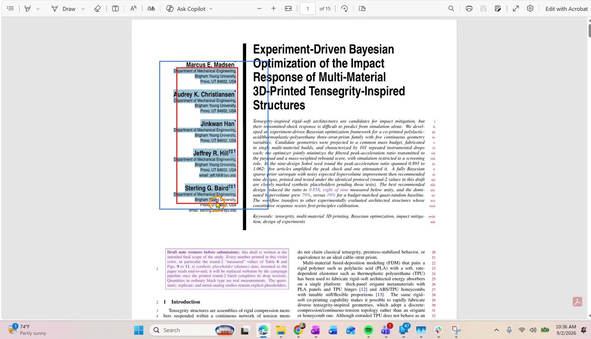

---

### 13. 07:03 to 07:22 | Reference audit deliberately deferred to a later pass

**Deferred.** No action for this pass. Recorded so nobody reads the absence of citation comments as approval of the bibliography.

> So we've got all these wonderful [citations]. We're going to go through, probably at the end, to make sure that all of these sources are good. I'm going to skip over those for right now in this run-through specifically and just focus on the text, but that is something I intend to do in a future run-through.

**On screen** ([jump to 07:03 in the video](https://youtu.be/2J5kxMXNCYY?t=423)): Selection covers the first Introduction paragraph with citations [1, 2], [3 to 5] and [6 to 10].

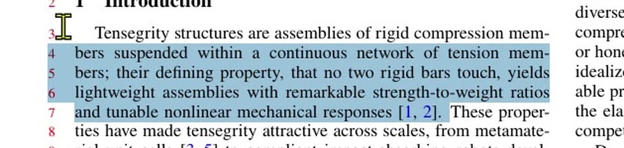

**Where in the source:** `manuscript/manuscript-body.tex`, Section 1

Burst frames and full screen

Mouse pointer detected at (605, 570) in the 2226 x 1280 frame.

**07:14 (2 s before)**

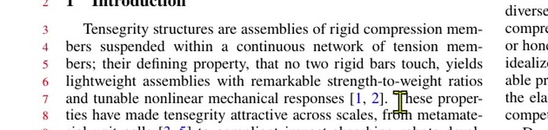

**07:18 (2 s after)**

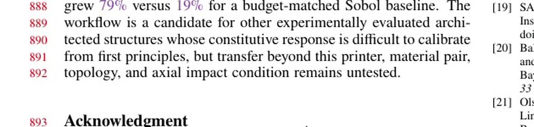

**Full screen at 07:16.** Red box: the reviewer's text selection. Orange circle: the mouse pointer. Blue box: the region cropped above.

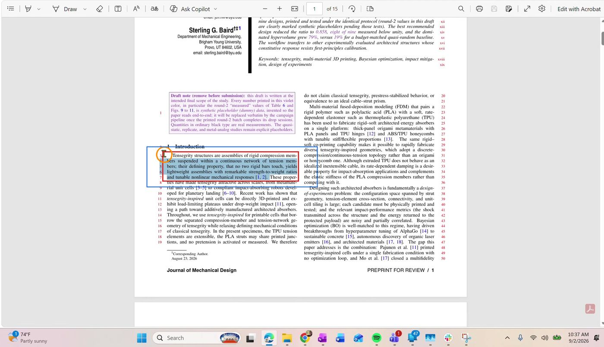

---

### 14. 08:11 to 08:13 | Rigid-soft caveat paragraph verified as accurate

**Approved as written.** No edit. This is the paragraph the reviewer later contrasts with the Contributions wording in item 21: the caveat here is correct, the Contributions sentence is the one that overstates.

> This is all true. That's good.

**On screen** ([jump to 08:11 in the video](https://youtu.be/2J5kxMXNCYY?t=491)): The pointer rests inside "In the present specimens, the TPU tension elements are extensible, the PLA struts may share printed junctions, and no pretension is activated or measured."

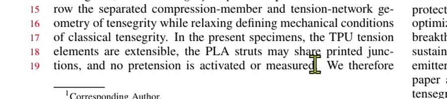

**Where in the source:** `manuscript/manuscript-body.tex:223` to `225`

Burst frames and full screen

Mouse pointer detected at (986, 742) in the 2226 x 1280 frame.

**08:09 (2 s before)**

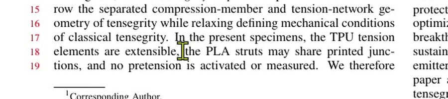

**08:13 (2 s after)**

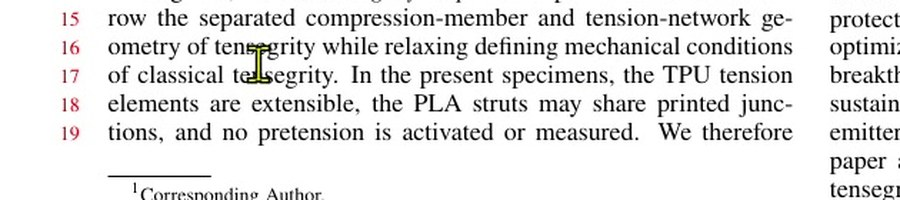

**Full screen at 08:11.** Red box: the reviewer's text selection. Orange circle: the mouse pointer. Blue box: the region cropped above.

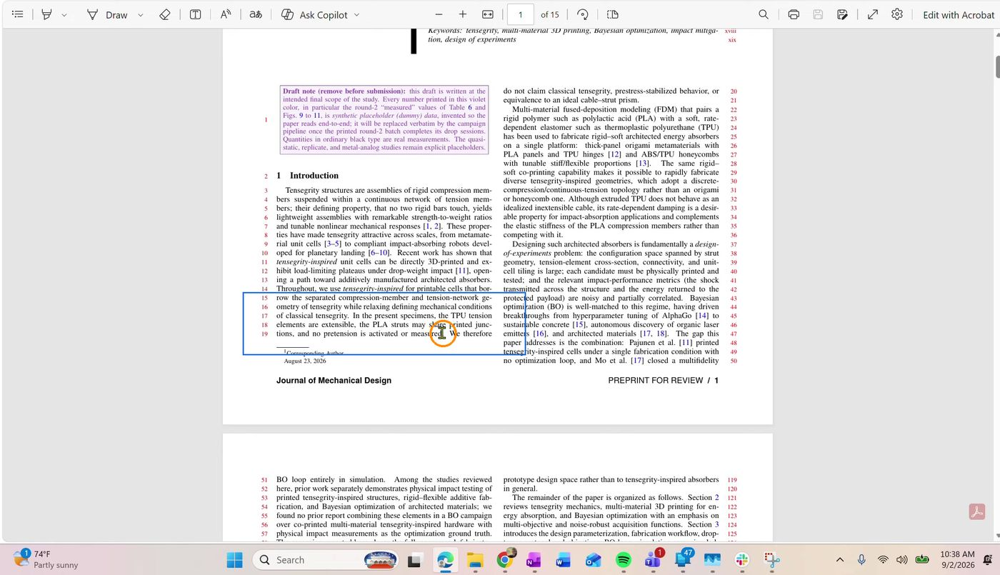

---

### 15. 08:22 to 08:30 | "Equivalence to an ideal cable-strut prism" and the FDM paragraph verified

**Approved as written.** No edit.

> Right. That's all wonderful.

**On screen** ([jump to 08:22 in the video](https://youtu.be/2J5kxMXNCYY?t=502)): Selection: "equivalence to an ideal cable-strut prism. Multi-material fused-deposition modeling"

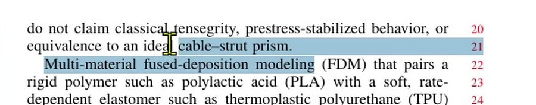

**Where in the source:** `manuscript/manuscript-body.tex:227` onward

Burst frames and full screen

Mouse pointer detected at (1281, 519) in the 2226 x 1280 frame.

**08:21 (2 s before)**

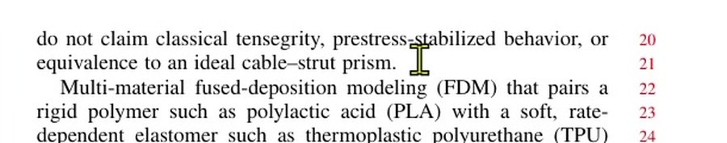

**08:25 (2 s after)**

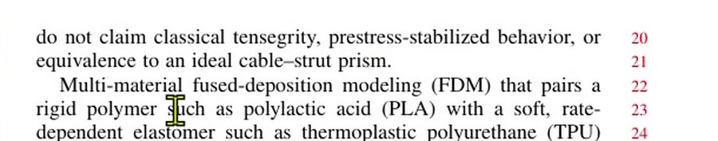

**Full screen at 08:23.** Red box: the reviewer's text selection. Orange circle: the mouse pointer. Blue box: the region cropped above.

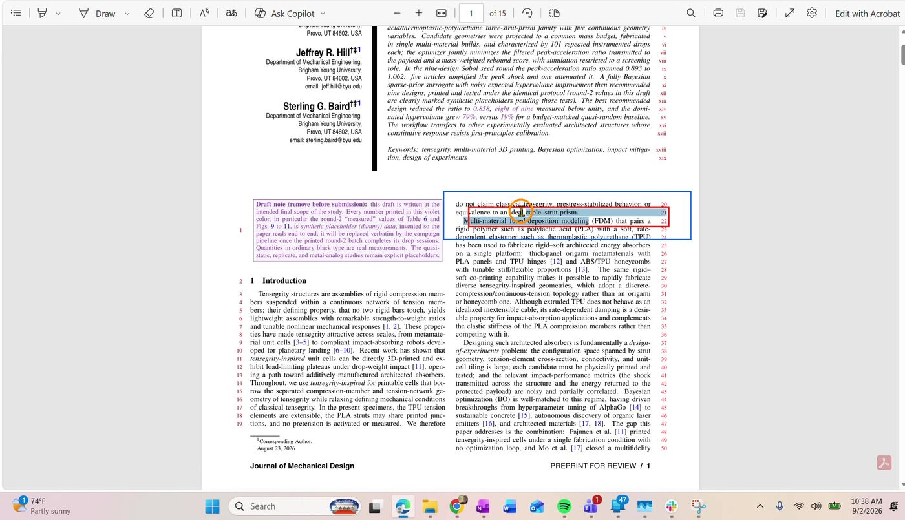

---

### 16. 09:06 to 09:12 | Check the origami and honeycomb sources and examples

**Verify.** Reviewer-owned follow-up: confirm that references 12 and 13 actually say what the sentence claims, and that these are the right exemplars.

> Yeah, I just want to make sure, in the future, make a note for me to check over these sources and examples.

**On screen** ([jump to 09:06 in the video](https://youtu.be/2J5kxMXNCYY?t=546)): Selection: "on a single platform: thick-panel origami metamaterials with PLA panels and TPU hinges [12] and ABS/TPU honeycombs with tunable stiff/flexible proportions [13]."

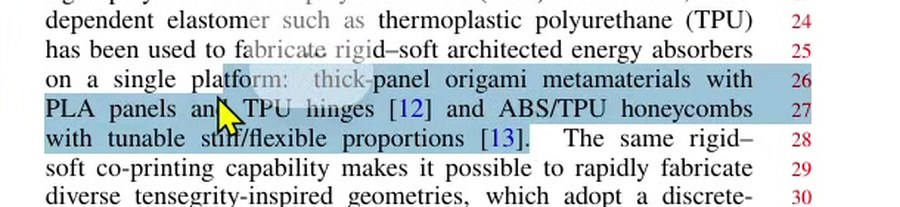

**Where in the source:** `manuscript/manuscript-body.tex`, Section 1, background paragraph

Burst frames and full screen

Mouse pointer detected at (1302, 434) in the 2226 x 1280 frame.

**09:06 (2 s before)**

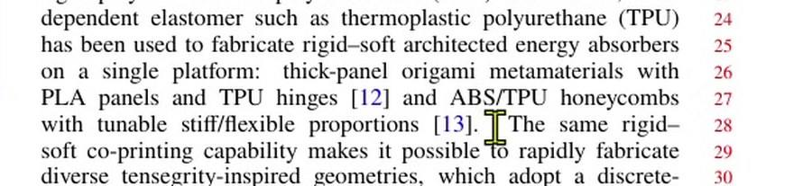

**09:10 (2 s after)**

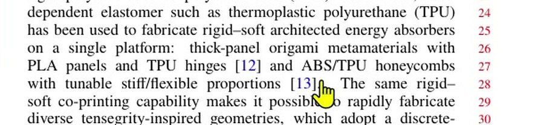

**Full screen at 09:08.** Red box: the reviewer's text selection. Orange circle: the mouse pointer. Blue box: the region cropped above.

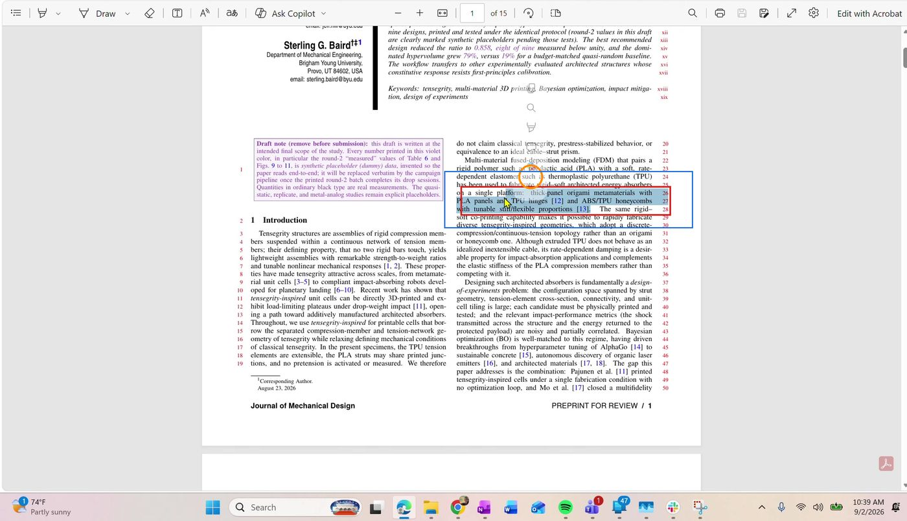

---

### 17. 09:40 to 09:42 | PLA compression stiffness statement verified

**Approved as written.** No edit.

> This is also true. That's good.

**On screen** ([jump to 09:40 in the video](https://youtu.be/2J5kxMXNCYY?t=580)): Selection: "the elastic stiffness of the PLA compression members rather than competing with it."

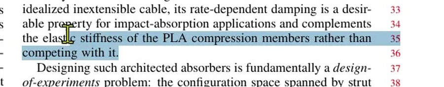

**Where in the source:** `manuscript/manuscript-body.tex`, Section 1

Burst frames and full screen

Mouse pointer detected at (1173, 648) in the 2226 x 1280 frame.

**09:38 (2 s before)**

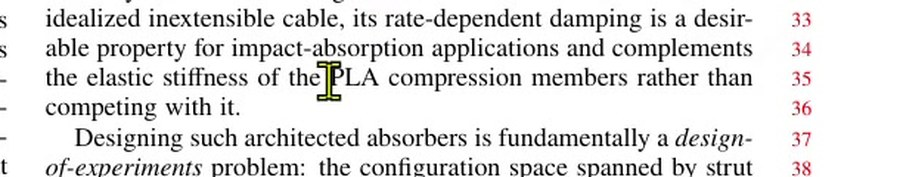

**09:42 (2 s after)**

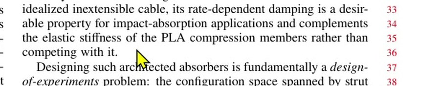

**Full screen at 09:40.** Red box: the reviewer's text selection. Orange circle: the mouse pointer. Blue box: the region cropped above.

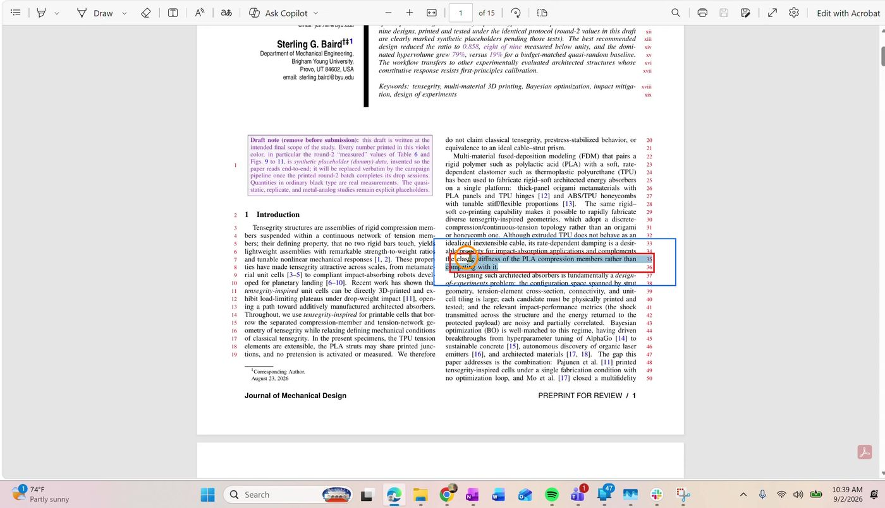

---

### 18. 10:01 to 11:00 | The "gap this paper addresses" sentence is awkward

**Change requested.** Minimum fix, which the reviewer offered himself: "The gap this paper addresses is the combination of these two ideas: ...". The colon and the explicit "these two ideas" tell the reader that what follows is the pair being combined.

> Something about the way that this part here is worded is awkward to me. "The gap this paper addresses is the combination." And then "Pajunen et al. printed tensegrity-inspired cells under a single fabrication condition with no optimization loop, and Mo et al. closed a multifidelity [BO loop]." So I see the point that this is getting across. I feel like there's probably a better way to word this. It might even just be adding in "the gap this paper addresses is the combination of these two ideas," just to hit it a little more on the head. Yeah, maybe we'll revisit that.

**On screen** ([jump to 10:01 in the video](https://youtu.be/2J5kxMXNCYY?t=601)): Selection: "and Mo et al." inside the gap sentence on page 1, right column, lines 47 to 50.

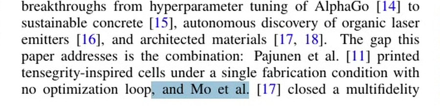

**Where in the source:** `manuscript/manuscript-body.tex:257`

Burst frames and full screen

Mouse pointer detected at (950, 894) in the 2226 x 1280 frame.

**10:25 (2 s before)**

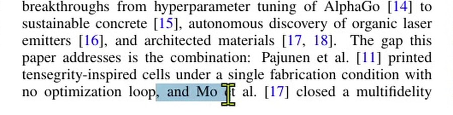

**10:29 (2 s after)**

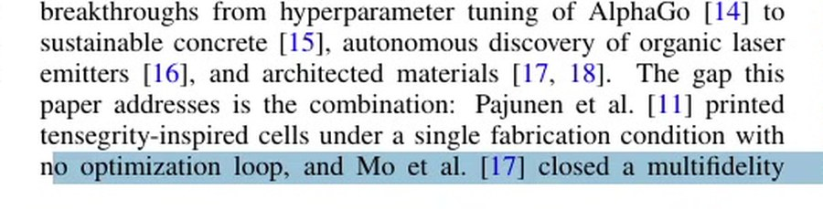

**Full screen at 10:27.** Red box: the reviewer's text selection. Orange circle: the mouse pointer. Blue box: the region cropped above.

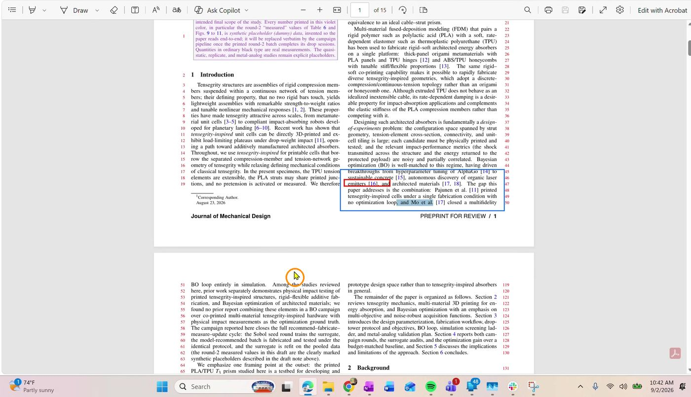

---

### 19. 11:04 to 11:35 | Delete the round-2 placeholder parenthetical from the Introduction

**Change required.** Delete the parenthetical. The same information already sits in the violet draft-note box at the top of page 1, so nothing is lost, and the sentence stops reading as an aside to the co-authors rather than to a referee.

> To be perfectly honest, I'm not really sure what this sentence is saying. I don't know if this is saying that they're just placeholders for future data. Assuming that this is talking about future data we're going to put into this, let's just remove this sentence here. Yeah, we don't need it.

**On screen** ([jump to 11:04 in the video](https://youtu.be/2J5kxMXNCYY?t=664)): Selection: "(the round-2 measured values in this draft are the clearly marked synthetic placeholders described in the draft note above)."

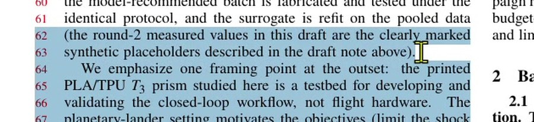

**Where in the source:** `manuscript/manuscript-body.tex:271` to `273`

Burst frames and full screen

Mouse pointer detected at (1040, 556) in the 2226 x 1280 frame.

**11:07 (2 s before)**

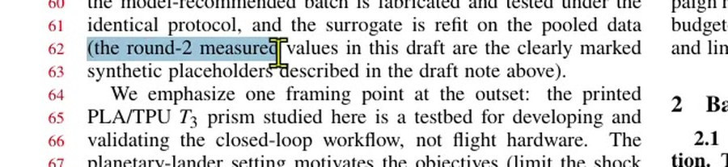

**11:11 (2 s after)**

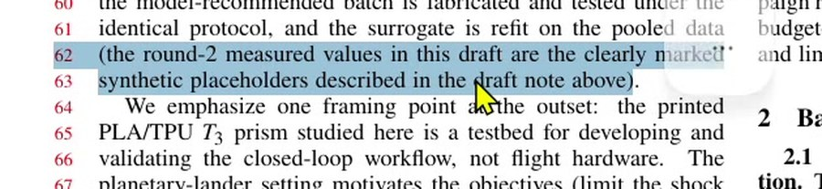

**Full screen at 11:09.** Red box: the reviewer's text selection. Orange circle: the mouse pointer. Blue box: the region cropped above.

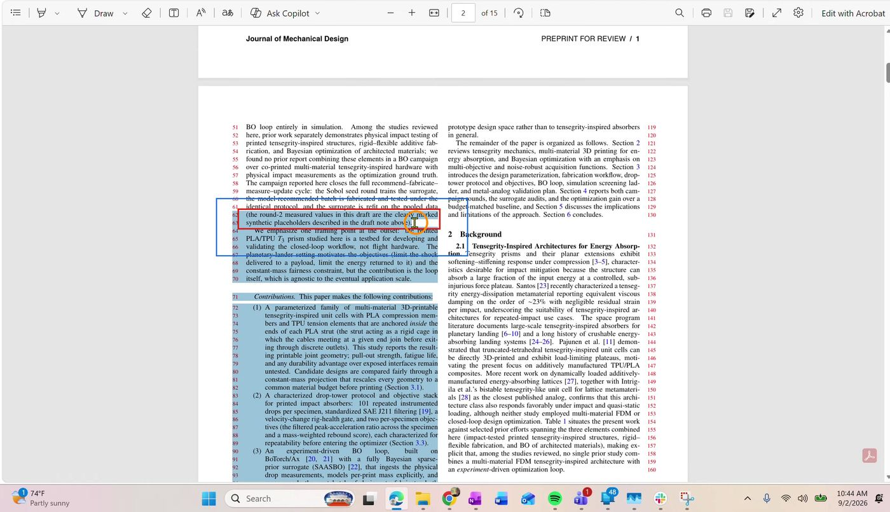

---

### 20. 11:36 to 12:10 | Flight-hardware framing is fine; the stepping-stone point could be sharper

**Optional.** Optional. The sentence survives, but the reviewer's own reading (the T3 prism is a stepping stone toward optimizing tensegrity-inspired objects generally) is sharper than "not flight hardware" and could replace or supplement it.

> "Flight hardware" is an interesting use case for this. I think that fits. I mean, the point of this intended statement is our emphasis that T3 prisms aren't the end of our testing, that this is just a stepping stone for future research in tensegrity-inspired objects, optimizing and creating them. So, not the worst statement, but interesting.

**On screen** ([jump to 11:36 in the video](https://youtu.be/2J5kxMXNCYY?t=696)): The pointer sits on "not flight hardware" in "the printed PLA/TPU T3 prism studied here is a testbed for developing and validating the closed-loop workflow, not flight hardware."

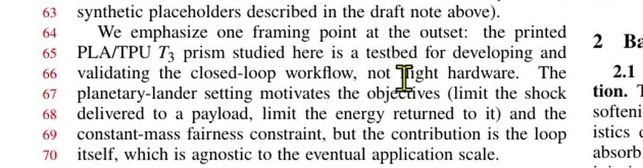

**Where in the source:** `manuscript/manuscript-body.tex:275` to `281`

Burst frames and full screen

Mouse pointer detected at (938, 472) in the 2226 x 1280 frame.

**11:38 (2 s before)**

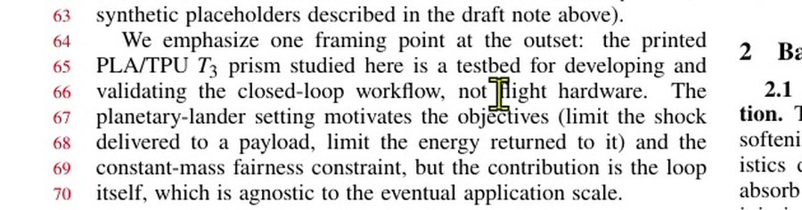

**11:42 (2 s after)**

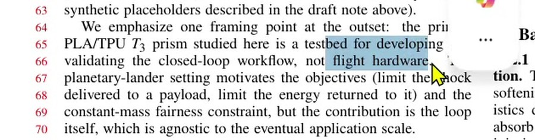

**Full screen at 11:40.** Red box: the reviewer's text selection. Orange circle: the mouse pointer. Blue box: the region cropped above.

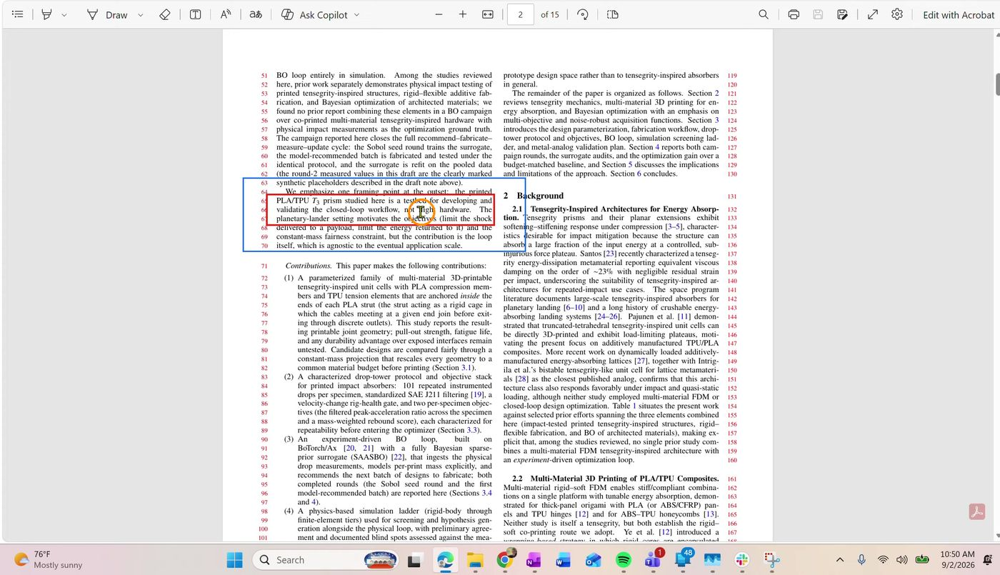

---

### 21. 12:15 to 13:15 | "PLA compression members and TPU tension elements" overstates the load paths

**Change required.** Physics correction, not style. There is no pretension at equilibrium, so the TPU members are not pure tension elements, and under impact the reviewer has observed some cables stretching while others buckle. The Contributions sentence has to stop asserting a pure tension and compression split. Note that the Introduction already states this correctly at line 225 (item 14); the two passages currently disagree.

> I think we should be careful in this wording, as when it says "PLA compression members and TPU tension members." They can act as such under certain loading conditions. However, the TPU does provide back some compressive value, and I find it unlikely... I mean, when the object is in equilibrium it is not prestressed, so the TPU cables aren't in pure tension. In fact, I'd say during a load, from the impacts I've seen, most of the time some cables will be stretching while others are buckling. So they're really not pure tension elements. We just want to be careful about the way we word this, just so it's not confusing in that matter.

**On screen** ([jump to 12:15 in the video](https://youtu.be/2J5kxMXNCYY?t=735)): Selection: contribution 1, "A parameterized family of multi-material 3D-printable tensegrity-inspired unit cells with PLA compression members and TPU tension elements that are anchored inside the ends of each PLA strut..."

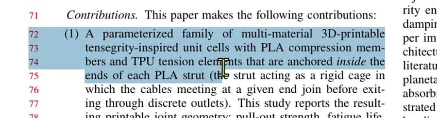

**Where in the source:** `manuscript/manuscript-body.tex:286` to `288`

Burst frames and full screen

Mouse pointer detected at (865, 670) in the 2226 x 1280 frame.

**12:16 (2 s before)**

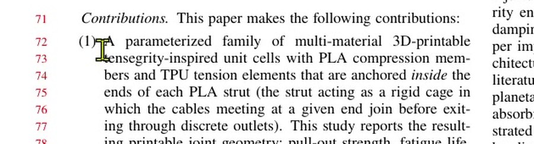

**12:20 (2 s after)**

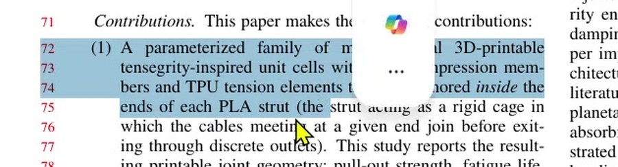

**Full screen at 12:18.** Red box: the reviewer's text selection. Orange circle: the mouse pointer. Blue box: the region cropped above.

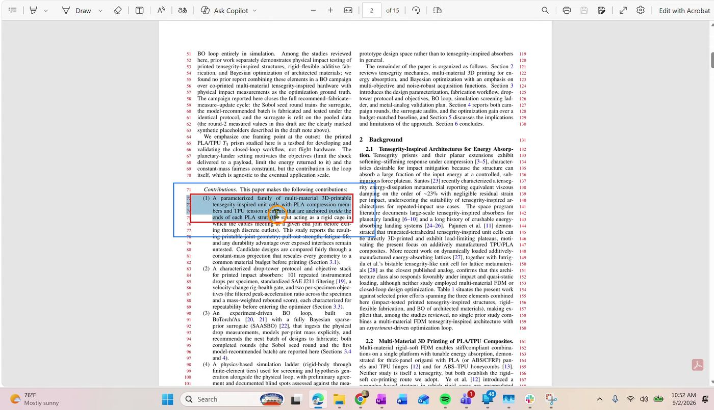

---

### 22. 13:18 to 13:35 | Replacement wording offered for the tension-element claim

**Concrete wording.** Use the reviewer's phrasing as the target: TPU is used in place of the tension elements of the traditional tensegrity topology, and PLA is in compression most of the time. That claims a substitution and a tendency rather than a mechanical state.

> We use TPU in place of tension elements on the traditional tensegrity topology, and PLA, which is probably most of the time in compression, is probably a pretty fair statement for this. Maybe for this part right here.

**On screen** ([jump to 13:18 in the video](https://youtu.be/2J5kxMXNCYY?t=798)): Still on contribution 1; the pointer moves across "A parameterized family of multi-material 3D-printable tensegrity-inspired unit cells..."

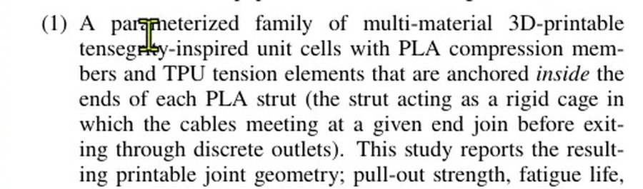

**Where in the source:** `manuscript/manuscript-body.tex:286` to `288`

Burst frames and full screen

Mouse pointer detected at (726, 631) in the 2226 x 1280 frame.

**13:18 (2 s before)**

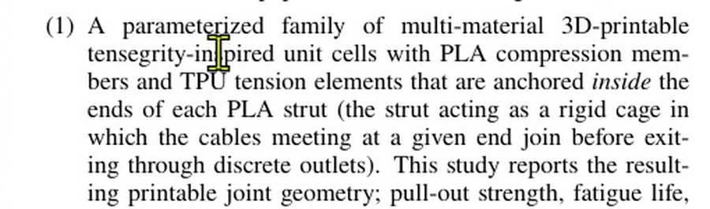

**13:22 (2 s after)**

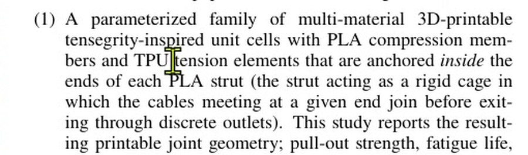

**Full screen at 13:20.** Red box: the reviewer's text selection. Orange circle: the mouse pointer. Blue box: the region cropped above.

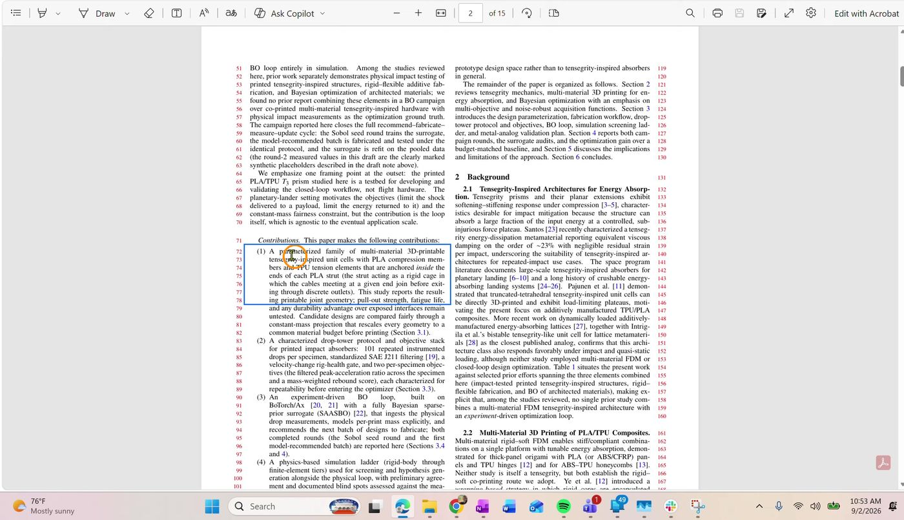

---

### 23. 13:36 to 13:53 | "Remain untested" is right; add that it is an area of future interest

**Optional.** Optional. Keep the honest "remain untested", and add a short clause marking pull-out and fatigue characterization as planned follow-on work, so the admission reads as scoping rather than as a hole.

> These parts do remain untested, but as an area of interest in future continued research. We'll probably make note of that elsewhere too, but making a small note there probably wouldn't be too bad.

**On screen** ([jump to 13:36 in the video](https://youtu.be/2J5kxMXNCYY?t=816)): Selection: "...This study reports the resulting printable joint geometry; pull-out strength, fatigue life, and any durability advantage over exposed interfaces remain untested."

**Where in the source:** `manuscript/manuscript-body.tex:292` to `294`

Burst frames and full screen

Mouse pointer was stationary here, so frame differencing found no pointer.

**13:43 (2 s before)**

**13:47 (2 s after)**

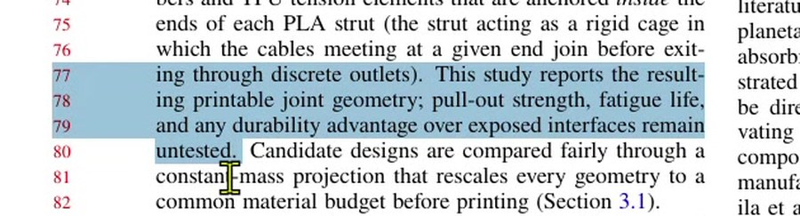

**Full screen at 13:45.** Red box: the reviewer's text selection. Orange circle: the mouse pointer. Blue box: the region cropped above.

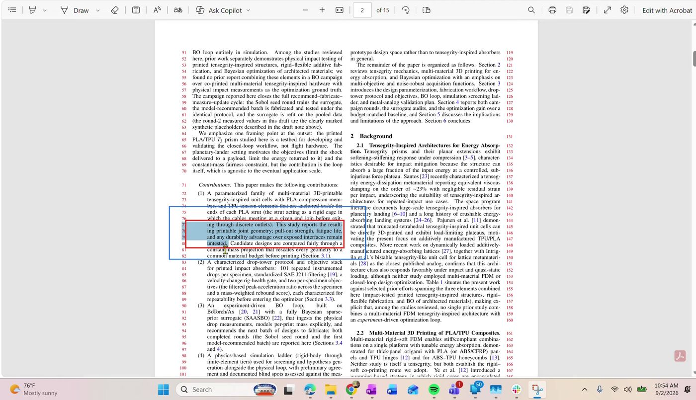

---

### 24. 13:55 to 14:12 | Contribution 2 still says 101 repeated drops

**Change required.** Same change as item 3, and the reviewer adds a second requirement: the move to 21 drops needs to be validated and justified in the text, not simply substituted.

> Couple notes here. "101 repeated drops." Right now we're looking at doing 21 drops per specimen, and again we need to validate that and justify it, but that's incorrect here.

**On screen** ([jump to 13:55 in the video](https://youtu.be/2J5kxMXNCYY?t=835)): Selection: contribution 2, "A characterized drop-tower protocol and objective stack for printed impact absorbers: 101 repeated instrumented drops per specimen..."

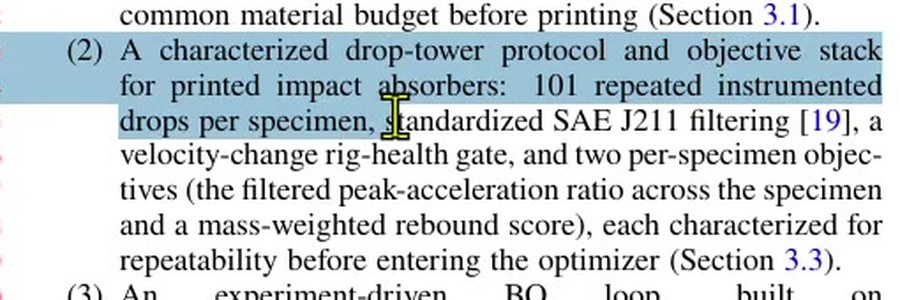

**Where in the source:** `manuscript/manuscript-body.tex:297`

Burst frames and full screen

Mouse pointer detected at (815, 725) in the 2226 x 1280 frame.

**14:01 (2 s before)**

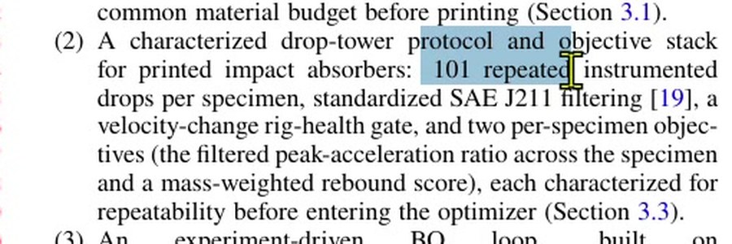

**14:05 (2 s after)**

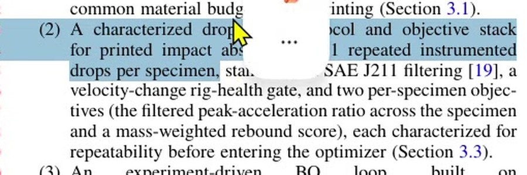

**Full screen at 14:03.** Red box: the reviewer's text selection. Orange circle: the mouse pointer. Blue box: the region cropped above.

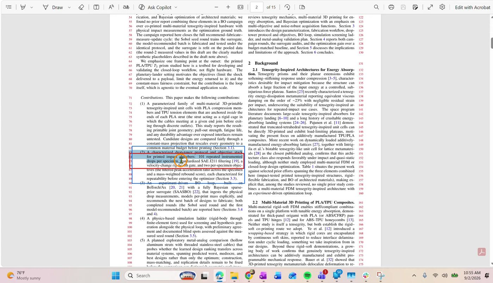

---

### 25. 14:12 to 14:15 | SAE J211 filtering is fine

**Approved as written.** No edit.

> Filter looks fine.

**On screen** ([jump to 14:12 in the video](https://youtu.be/2J5kxMXNCYY?t=852)): The pointer is on "standardized SAE J211 filtering [19]" in contribution 2.

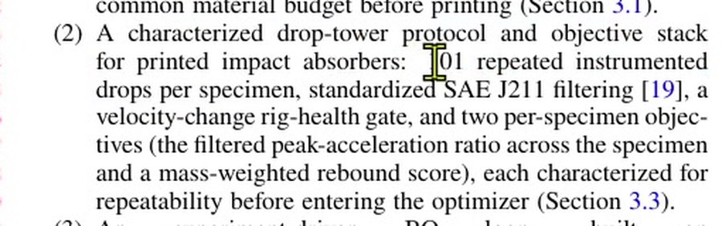

**Where in the source:** `manuscript/manuscript-body.tex:298`

Burst frames and full screen

Mouse pointer detected at (896, 709) in the 2226 x 1280 frame.

**14:11 (2 s before)**

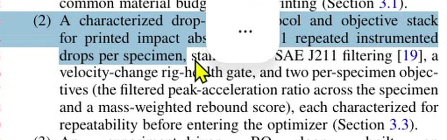

**14:15 (2 s after)**

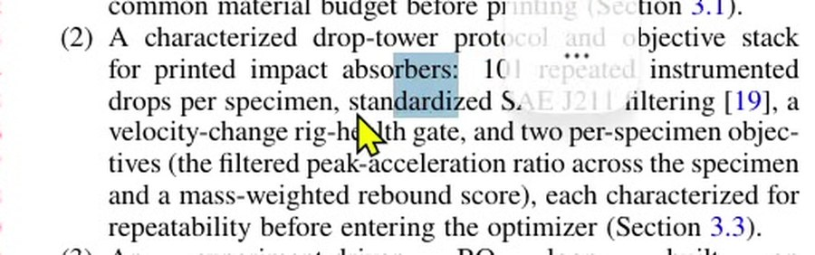

**Full screen at 14:13.** Red box: the reviewer's text selection. Orange circle: the mouse pointer. Blue box: the region cropped above.

---

### 26. 14:16 to 15:04 | Velocity-change rig-health gate: probably cut it or move it to the SI

**Discussion needed.** Blocked on a conversation with @achris0520 (Audrey K. Christiansen) and Jinkwan Han. The reviewer's stated lean is to drop it from the Contributions list and, if it is kept at all, move it to the supplementary information. The observation that the arrest velocity has been drifting and is stabilizing as more drops accumulate is itself worth capturing somewhere.

> I'm skeptical as to whether or not we need to include that we are ensuring... basically this velocity-change rig-health gate, where we're just measuring the arrest velocity of the drop-tower block to ensure that it's consistent. It has changed, stabilizing more as we do more drops. Let's make a note to discuss with Audrey and Jinkwan if that is really necessary. I'm leaning more towards omitting that, maybe adding that in as supplemental information.

**On screen** ([jump to 14:16 in the video](https://youtu.be/2J5kxMXNCYY?t=856)): The pointer sits directly on "velocity-change rig-health gate" in contribution 2.

**Where in the source:** `manuscript/manuscript-body.tex:299`, plus the drop-tower protocol section of `manuscript/supplementary.tex`

Burst frames and full screen

Mouse pointer was stationary here, so frame differencing found no pointer.

**14:33 (2 s before)**

**14:37 (2 s after)**

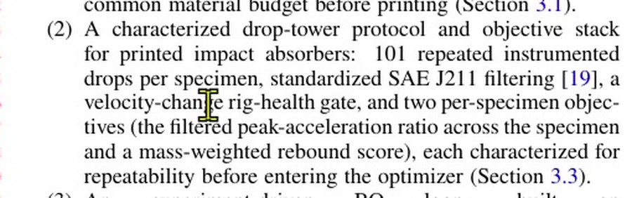

**Full screen at 14:35.** Red box: the reviewer's text selection. Orange circle: the mouse pointer. Blue box: the region cropped above.

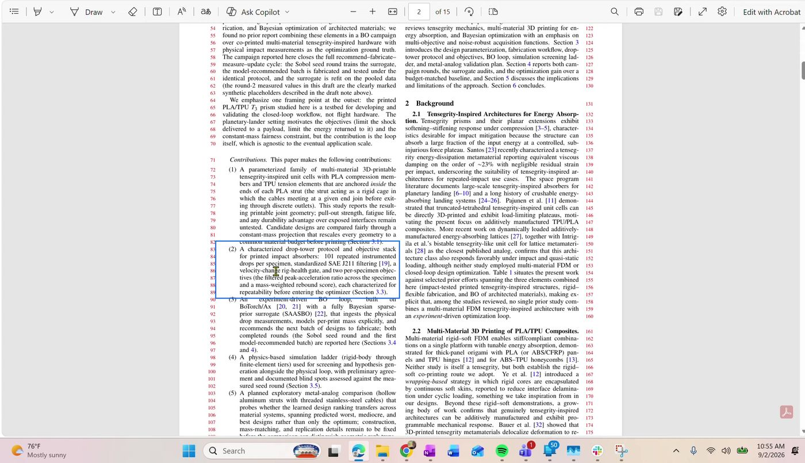

---

### 27. 15:06 to 15:42 | Define it once, then call it transmissibility everywhere

**Change requested.** Same request as items 4 and 7, now stated as a document-wide policy: define once early, use the short name thereafter. The reviewer explicitly invites pushback: if there is a reason the long form has to stay (for instance if a referee would read "transmissibility" as the frequency-domain quantity from vibration isolation rather than a peak ratio), say so instead of silently renaming.

> Again, this "filtered peak-acceleration ratio." I'm pretty sure we can just call this transmissibility. We could mention, explain what it is somewhere in the beginning of the paper, that it's a filtered peak-acceleration ratio, and then label it transmissibility, and then call it transmissibility thereafter. I think that would be good, as long as that's not improper. Maybe Claude can give feedback on whether or not, for some reason, it's better to just keep calling it this. But to me that's just extra words in the bag that don't need to be there.

**On screen** ([jump to 15:06 in the video](https://youtu.be/2J5kxMXNCYY?t=906)): Selection: "the filtered peak-acceleration ratio" inside contribution 2.

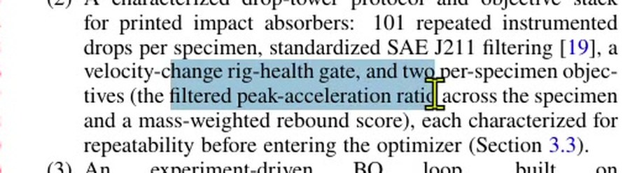

**Where in the source:** `manuscript/manuscript-body.tex:300`, and every occurrence of "filtered peak-acceleration ratio" thereafter

Burst frames and full screen

Mouse pointer detected at (947, 766) in the 2226 x 1280 frame.

**15:08 (2 s before)**

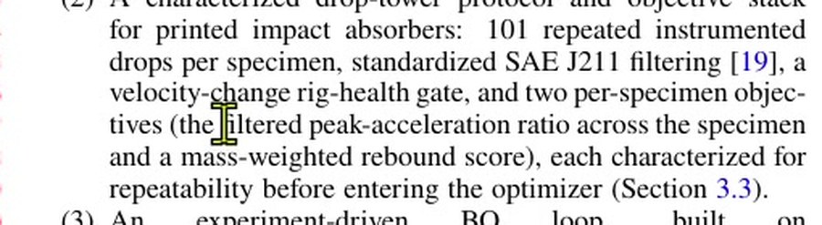

**15:12 (2 s after)**

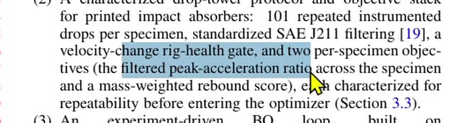

**Full screen at 15:10.** Red box: the reviewer's text selection. Orange circle: the mouse pointer. Blue box: the region cropped above.

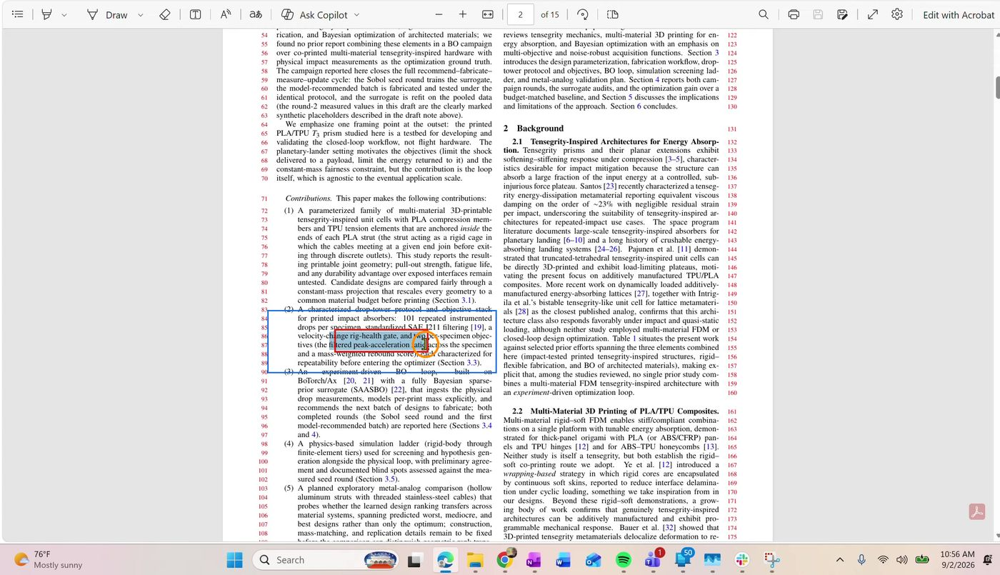

---

### 28. 15:44 to 16:40 | Cut the simulation-ladder contribution

**Change required, pending confirmation.** Remove the simulation-ladder contribution, and with it the simulation content it points at, on the basis of the issue #99 comment and the meeting of Tuesday 2026-09-01. Two riders from the reviewer: double check the decision before acting, and expect to have to justify dropping simulation in the paper. This also decides items 5 and 6, and reaches the abstract clause "with simulation restricted to a screening role."

> Going to echo again. I'm pretty sure, so from what I've gathered, this is on issue 99 on tensegrity-optimization, a comment made near the bottom reporting on the simulation data. And to me it looks like we've basically nixed it, from the conversation we recently had in our recent meeting on Tuesday, September 1st I believe it was. And it seems like we've mainly nixed the simulation data for this. We may need to justify it, but as of that, I think that means that this... again, we should double check this, but I think that means this section here should be nixed.

**On screen** ([jump to 15:44 in the video](https://youtu.be/2J5kxMXNCYY?t=944)): Selection: contribution 4, "A physics-based simulation ladder (rigid-body through finite-element tiers) used for screening and hypothesis generation alongside the physical loop, with preliminary agreement and documented blind spots assessed against the measured seed round (Section 3.5)."

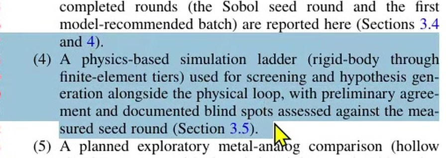

**Where in the source:** `manuscript/manuscript-body.tex:313` to `317` (contribution 4), Section 3.5, and the abstract at line 159

Burst frames and full screen

Mouse pointer detected at (910, 771) in the 2226 x 1280 frame.

**16:35 (2 s before)**

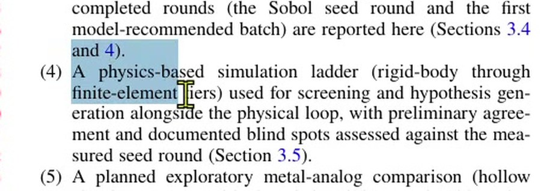

**16:39 (2 s after)**

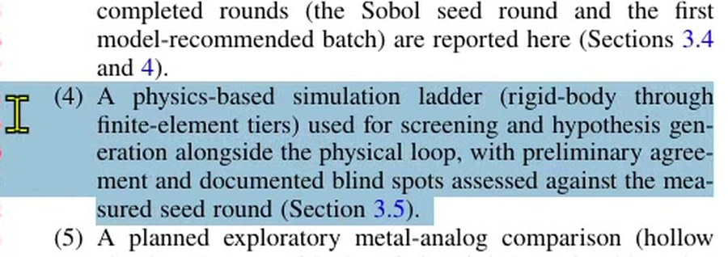

**Full screen at 16:37.** Red box: the reviewer's text selection. Orange circle: the mouse pointer. Blue box: the region cropped above.

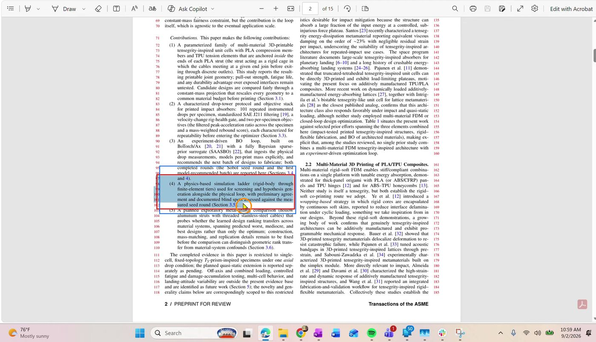

---

### 29. 16:44 to 17:12 | Contribution 5 is labeled "planned"

**Change required.** A Contributions list is a claim about completed work. Move the metal-analog comparison out of Contributions and into future work until it has been built and measured.

> Okay, this says it's planned. If this is our contributions, I'm going to guess these are things we should have already done. And stating something we plan to do as a contribution that we're giving seems to be presumptuous at best.

**On screen** ([jump to 16:44 in the video](https://youtu.be/2J5kxMXNCYY?t=1004)): The pointer is on "(5) A planned exploratory metal-analog comparison (hollow aluminum struts with threaded stainless-steel cables)..."

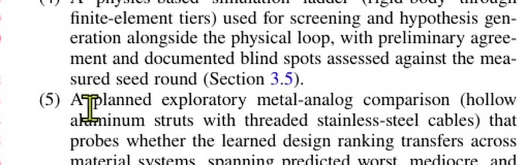

**Where in the source:** `manuscript/manuscript-body.tex:318` to `325`

Burst frames and full screen

Mouse pointer detected at (689, 795) in the 2226 x 1280 frame.

**16:44 (2 s before)**

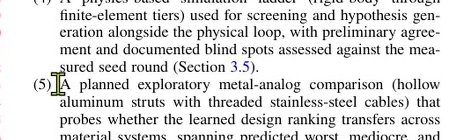

**16:48 (2 s after)**

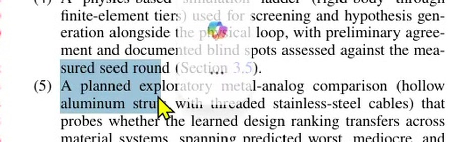

**Full screen at 16:46.** Red box: the reviewer's text selection. Orange circle: the mouse pointer. Blue box: the region cropped above.

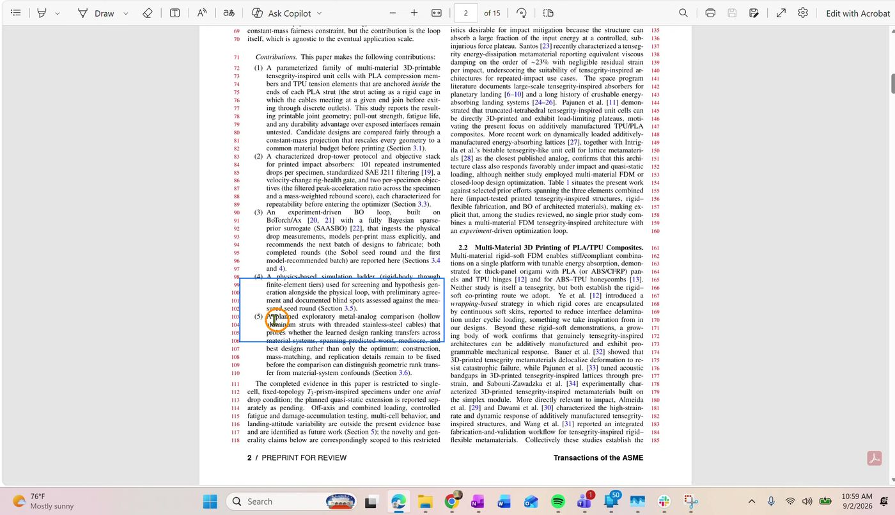

---

### 30. 17:12 to 18:00 | Standing instruction: no promised contributions, and color every placeholder

**Standing instruction.** Two standing rules for every future edit. First, every statement is either backed by data in hand or visually marked as a placeholder. The violet `\dummy{}` convention already exists for synthetic numbers; extend the same visual treatment to unfinished prose claims, not only to invented values. Second, by the final draft nothing may be claimed as a contribution on the strength of intent. Promised work belongs in future work, phrased as "in the future we plan to."

> I'm going to guess that this is a placeholder for when we do intend to do this over the next couple of weeks. Let's just make note that anything in the paper (this is for Claude), anything in the paper should either be something that we've done and we have data for; and if it's a placeholder, it should probably just be highlighted, maybe highlight it in a different color, so that it's clear to us that's a placeholder that we need to replace later. By the final draft of this paper there should be nothing that makes a claim as to, like, "our contribution is that we're going to do this." That should just be saved for "in the future we plan to do this," if that makes sense.

**On screen** ([jump to 17:12 in the video](https://youtu.be/2J5kxMXNCYY?t=1032)): Contribution 5 is on screen; the instruction is general and is addressed to Claude by name.

**Where in the source:** Repository-wide; the `\dummy{}` macro and draft-note box are defined in `manuscript/manuscript-body.tex`

Burst frames and full screen

Mouse pointer was stationary here, so frame differencing found no pointer.

**17:28 (2 s before)**

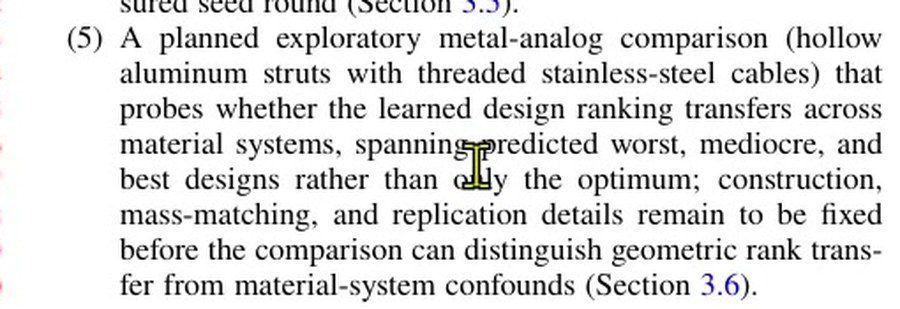

**17:32 (2 s after)**

**Full screen at 17:30.** Red box: the reviewer's text selection. Orange circle: the mouse pointer. Blue box: the region cropped above.

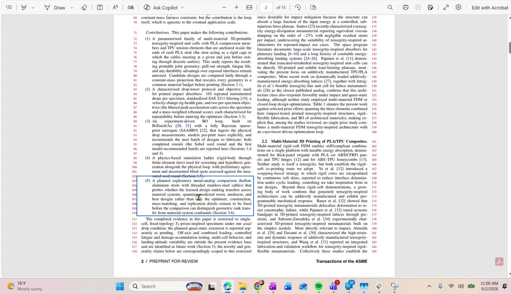

---

### 31. 18:05 to 18:30 | Expect real tensegrity to behave differently from tensegrity-inspired

**Context.** Not an edit. It sets the expectation for the metal-analog work: the reviewer predicts the hollow-aluminum and stainless-steel build, which is closer to a true tensegrity, will not match the printed tensegrity-inspired specimens even at identical topology. If that prediction holds, it changes what the comparison can claim. Decision window given as the two to three weeks following 2026-09-02.

> And we should theoretically have explored this over the next two or three weeks and figured out whether or not this is something we want to include in the paper. I already have a feeling that there's going to be some discrepancies in the way a true tensegrity structure would behave versus our tensegrity-inspired structures, even with the same topology.

**On screen** ([jump to 18:05 in the video](https://youtu.be/2J5kxMXNCYY?t=1085)): Selection still covers contribution 5, the metal-analog comparison.

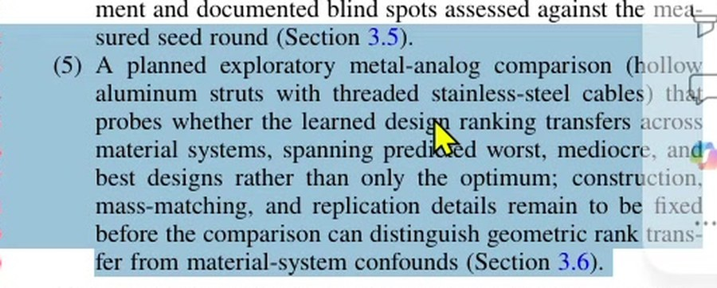

**Where in the source:** `manuscript/manuscript-body.tex:318` to `325`

Burst frames and full screen

Mouse pointer was stationary here, so frame differencing found no pointer.

**18:18 (2 s before)**

**18:22 (2 s after)**

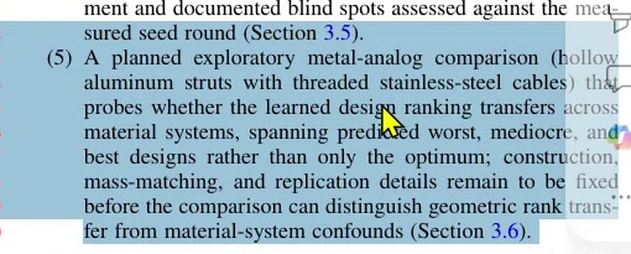

**Full screen at 18:20.** Red box: the reviewer's text selection. Orange circle: the mouse pointer. Blue box: the region cropped above.

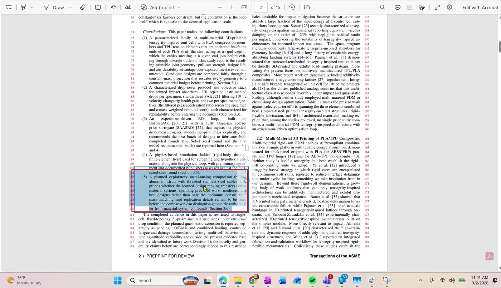

---

### 32. 18:31 to 19:16 | "The planned quasi-static extension is reported separately as pending" reads like an AI status report

**Change requested.** Replace the pending-status phrasing with the reviewer's own line: "quasi-static testing is planned as an extension for future work." Then apply the same treatment to the rest of that sentence and paragraph, which he flags collectively. This is the clearest statement of a voice problem that runs through the draft: the text reports on the project's intentions instead of stating the work.

> Again, this part here: "the planned quasi-static extension is reported separately as pending." Maybe we just change that to "quasi-static testing is planned as an extension for future work." It just, to me, sounds like this is AI reporting on what we've said we intend to do, rather than us reporting it here, if that makes sense. Yeah, see, it feels like it should be more intended for this, the rest of this sentence and paragraph going on right there.

**On screen** ([jump to 18:31 in the video](https://youtu.be/2J5kxMXNCYY?t=1111)): Selection covers "...arately as pending. Off-axis and combined loading, controlled fatigue and damage-accumulation testing, multi-cell behavior, and landing-attitude variability are outside the present evidence base and are identified as future work (Section 5);"

**Where in the source:** `manuscript/manuscript-body.tex:329` to `339`

Burst frames and full screen

Mouse pointer detected at (797, 895) in the 2226 x 1280 frame.

**19:08 (2 s before)**

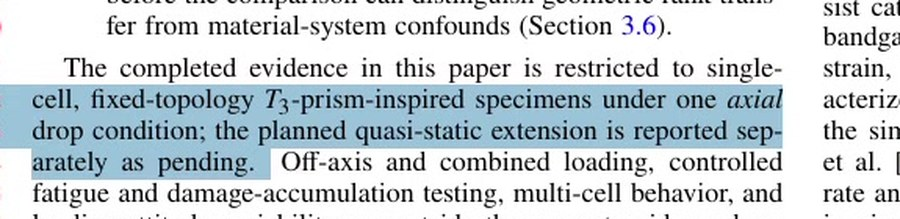

**19:12 (2 s after)**

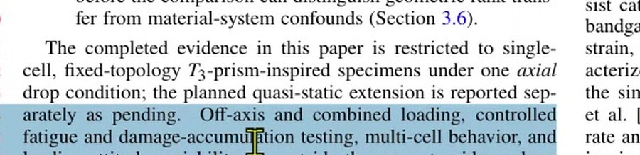

**Full screen at 19:10.** Red box: the reviewer's text selection. Orange circle: the mouse pointer. Blue box: the region cropped above.

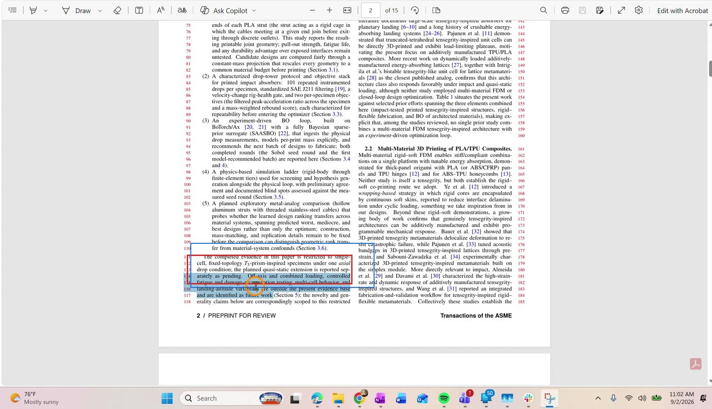

---

## Appendix A: corrected transcript

Two passes were run and merged. YouTube's own auto-captions are in
[`transcript-youtube-auto.json`](transcript-youtube-auto.json); a second pass with
`faster-whisper` `medium.en`, primed with the project's vocabulary, is in
[`transcript-whisper-medium-en.json`](transcript-whisper-medium-en.json). The table below is the
second pass with the corrections in [Appendix B](#appendix-b-transcription-corrections) applied.
Square brackets mark words inserted for readability or recovered from the other pass.

| Time | Corrected transcript |
|---|---|
| `00:00` | This is a first run through of a draft for a manuscript as it's currently written. |
| `00:07` | I'll be giving verbal feedback and just noting things that should be changed for feedback for Claude. |
| `00:18` | Okay, I'm just going to start reading through and I'll make notes as I do. |
| `00:44` | We should probably double check. |
| `00:47` | I believe we're still at five continuous geometry variables. |
| `00:53` | I know that we've now added in a couple other things like I believe infill percent is now added. |
| `01:00` | We should just double check to make sure that this is correct in what we're doing. |
| `01:19` | I'm going to assume that this is just a way of saying we're using a fixed mass, |
| `01:23` | which is mostly true. |
| `01:41` | Currently, we were at 101 drops. |
| `01:45` | However, we are adjusting that right now to 21 [drops] to do this. |
| `01:56` | So maybe we should adjust the wording for this so that it's 21 drops each. |
| `02:01` | As long as that doesn't sound too bad for the manuscript, that is what we're currently doing. |
| `02:08` | Maybe we should make a note to just double check that that data is accurate. |
| `02:12` | We should probably go through that more thoroughly than just having Claude do it. |
| `02:42` | We could probably put in parentheses transmissibility right here and use transmissibility in the future. |
| `03:04` | I'm going to guess this is what we're calling our proxy variable. |
| `03:12` | [… proxy variable] screen. |
| `03:14` | Again, still need to double check and ensure we're actually doing any simulation data. |
| `03:19` | It seems we've done a little bit. |
| `03:22` | A report on that would probably be good to pull up. |
| `03:24` | Maybe I'll do that really quick. |
| `03:26` | All right, I'm pulling that up now. |
| `03:35` | Yeah, just a note, probably replace this with transmissibility after putting that in earlier. |
| `03:48` | This will, of course, be updated as our data gets updated or as we add in more batches |
| `03:53` | of Bayesian optimization data. |
| `04:05` | Never mind, I see how it's doing this. |
| `04:07` | It's running through exactly what we're doing. |
| `04:11` | So I'm going to guess we may run through or probably run through at least five batches of this, |
| `04:17` | depending on if each batch continues to improve. |
| `04:22` | Maybe more, maybe we'll kind of hit a peak relatively quickly. |
| `04:26` | But if we do run through so many batches, we may not be able to discuss all five in |
| `04:33` | order through here as this is going through the first two. |
| `04:59` | I like that last line. |
| `05:01` | That's very important. |
| `05:06` | Dominated hypervolume. [Let's go up.] |
| `05:43` | Okay, let's skip over hypervolume for now. |
| `06:07` | I'm going to look into that a little bit more. |
| `06:13` | Author order all looks good. |
| `06:18` | And I think these contributions here are good. |
| `06:24` | I see no typos. |
| `06:26` | I don't know if we want to put in our school emails right here. |
| `06:29` | Should probably double check that with Dr. Baird. |
| `06:32` | Make note of that. |
| `07:03` | So we've got all these wonderful [citations]. |
| `07:06` | We're going to go through, probably at the end, to make sure that all of these sources are good. |
| `07:13` | I'm going to skip over those for right now in this run through specifically and |
| `07:17` | just focus on the text. |
| `07:20` | But that is something I intend to do in a future run through. |
| `08:11` | This is all true. |
| `08:13` | That's good. |
| `08:22` | Right. |
| `08:23` | That's all wonderful. |
| `08:24` | Yeah, I just want to make sure to in the future make note for me to check over these |
| `09:12` | sources and examples. |
| `09:40` | This is also true. |
| `09:42` | That's good. |
| `10:01` | Something about the way that this part here is worded is |
| `10:07` | awkward to me. |
| `10:10` | The gap this paper addresses is the combination. |
| `10:14` | And then “Pajunen et al. |
| `10:18` | printed tensegrity-inspired cells under a single fabrication condition with |
| `10:22` | no optimization loop. |
| `10:24` | And Mo et al. |
| `10:26` | closed a multifidelity [BO loop].” |
| `10:28` | So I see the point that this is getting across. |
| `10:35` | I feel like there's probably a better way to word this. |
| `10:43` | It might even just be adding in the gap this paper addresses is the combination |
| `10:49` | of these two ideas. |
| `10:53` | Just to hit it a little more on the head. |
| `11:00` | Yeah, maybe we'll revisit that. |
| `11:04` | To be perfectly honest, I'm not really sure what this sentence is saying. |
| `11:12` | I don't know if this is saying that they're just placeholders for future data. |
| `11:22` | Assuming that this is talking about future data we're going to put into this, |
| `11:25` | let's just remove this sentence here. |
| `11:32` | Yeah, we don't need it. |
| `11:36` | “Flight hardware” is an interesting use case for this. |
| `11:44` | I think that that fits. |
| `11:46` | I mean, the point of this intended statement is our emphasis that T3 prisms aren't the |
| `11:55` | end of our testing. |
| `11:56` | This is just a stepping stone for future research in tensegrity-inspired objects optimizing |
| `12:05` | and creating them. |
| `12:08` | So not the worst statement, but interesting. |
| `12:15` | I think we should be careful in this wording. |
| `12:19` | As when it says PLA compression members and TPU tension members, they can act as such |
| `12:31` | under certain loading conditions. |
| `12:34` | However, the TPU does provide back some compressive value, and I find it unlikely. |
| `12:45` | I mean, when the object's in equilibrium, it is not prestressed. |
| `12:48` | So the TPU cables aren't in pure tension. |
| `12:53` | In fact, I'd say during a load, from the impacts I've seen most of the time, some cables will |
| `12:59` | be stretching while others are buckling. |
| `13:01` | So they're really not pure tension elements. |
| `13:06` | We just want to be careful about the way we word this, just so it's not confusing |
| `13:15` | in that matter. |
| `13:18` | We use TPU in place of tension elements on the traditional tensegrity topology. |
| `13:26` | And PLA, which is probably most of the time in compression, is probably a pretty fair |
| `13:33` | statement for this. |
| `13:35` | Maybe for this part right here. |
| `13:37` | These parts do remain untested, but as an area of interest in future continued research. |
| `13:48` | We'll probably make note of that elsewhere, too. |
| `13:49` | But making a small note there probably wouldn't be too bad. |
| `13:55` | Couple notes here. |
| `14:00` | 101 repeated drops. |
| `14:04` | Right now we're looking at doing 21 drops per specimen. |
| `14:07` | And again, we need to validate that and justify it. |
| `14:11` | But that's incorrect here. |
| `14:14` | Filter looks fine. |
| `14:16` | I'm skeptical as to whether or not we need to include that we are ensuring the |
| `14:26` | basically this velocity-change rig-health gate, where we're just measuring the arrest |
| `14:32` | velocity of the drop-tower block to ensure that it's consistent. |
| `14:42` | It has changed. |
| `14:46` | Stabilizing more as we do more drops. |
| `14:51` | Let's make a note to discuss with Audrey and Jinkwan if that is really necessary. |
| `14:59` | I'm leaning more towards omitting that, maybe adding that in as supplemental information. |
| `15:04` | But yeah. |
| `15:06` | Again, this filtered peak acceleration ratio, I'm pretty sure we can just call this transmissibility. |
| `15:18` | We could mention, explain what it is somewhere in the beginning of the paper, |
| `15:22` | that it's a filtered peak acceleration ratio. |
| `15:25` | And then label it transmissibility. |
| `15:28` | And then call it transmissibility thereafter, I think would be good. |
| `15:31` | As long as that's not an improper, maybe Claude can give feedback on whether or not |
| `15:36` | for some reason it's better to just keep calling it this. |
| `15:39` | But to me, that's just extra words in the bag that don't need to be there. |
| `15:44` | Gonna echo again. |
| `15:48` | I'm pretty sure. |
| `15:50` | So from what I've gathered, this is on issue 99 on tensegrity-optimization, |
| `16:00` | a comment made near the bottom reporting on the simulation data. |
| `16:06` | And to me, it looks like we've basically nixed it from the conversation we recently had |
| `16:14` | in our recent meeting on Tuesday, September 1st, I believe it was. |
| `16:24` | And it seems like we've mainly nixed the simulation data for this. |
| `16:31` | And we may need to justify it. |
| `16:32` | But as of that, I think that means that this, again, we should double check this, |
| `16:39` | but I think that means this section here should be nixed. |
| `16:46` | Okay, this says it's planned. |
| `16:51` | If this is our contributions, I'm going to guess these are things we should have already done. |
| `16:58` | And stating something we plan to do as a contribution that we're giving |
| `17:04` | seems to be presumptuous at best. |
| `17:12` | I'm going to guess that this is a placeholder for when we do intend to do this over the next |
| `17:17` | couple weeks. |
| `17:18` | Let's just make note that anything in the paper, this is for Claude, |
| `17:24` | anything in the paper should either be something that we've done and we have data to do. |
| `17:31` | And if it's a placeholder, it should probably just be highlighted and maybe highlight it in |
| `17:38` | a different color so that it's clear to us that's a placeholder that we need to replace later. |
| `17:44` | Um, by the final draft of this paper, there should be nothing that makes a claim as to, |
| `17:55` | like, our contribution is that we're going to do this. |
| `17:59` | That should just be saved for in the future, we plan to do this, if that makes sense. |
| `18:05` | And we should theoretically have explored this over the next two or three weeks |
| `18:12` | and figured out whether or not this is something we want to include in the paper. |
| `18:16` | I already have a feeling that there's going to be some discrepancies in the way a true |
| `18:24` | tensegrity structure would behave versus our tensegrity inspired structures even with |
| `18:29` | the same topology. |
| `18:31` | Again, this part here, the planned quasi-static extension is reported separately as pending. |
| `18:41` | Maybe we just change that to quasi-static testing is planned as an extension for future |
| `18:49` | work. Maybe we just save, yeah, it just to me sounds like this is AI reporting on |
| `19:00` | what we've said we intend to do rather than us reporting it here, if that makes sense. |
| `19:09` | Yeah, see, it feels like it should be more intended for this, |
| `19:12` | the rest of this sentence and paragraph going on right there. |

## Appendix B: transcription corrections

Both automatic passes misheard project vocabulary. Corrections applied above, with the reasoning
where it is not obvious:

| Time | Auto-transcription heard | Corrected to |
|---|---|---|
| `01:19` | fixed mess | fixed mass |
| `01:45` | to 20 to do this | to 21 [drops] to do this |
| `03:53` | Bayesian information data | Bayesian optimization data |
| `05:06` | Dominated hypervolume allowed. | Dominated hypervolume. [Let's go up.] |
| `06:13` | Professor order all looks good. | Author order all looks good. |
| `06:18` | these contributions there are good | these contributions here are good |
| `07:03` | So we've got all these wonderful | So we've got all these wonderful [citations]. |
| `07:06` | way to go through probably at the end | We're going to go through, probably at the end, |
| `07:20` | that is something I tend to do | that is something I intend to do |
| `10:14` | And then Pajunet et al. | And then “Pajunen et al. |
| `10:18` | It listed print-intensegrity-inspired cells under seeing a fabrication condition with | printed tensegrity-inspired cells under a single fabrication condition with |
| `10:26` | Close fillet. | closed a multifidelity [BO loop].” |
| `11:36` | Flat hardware | “Flight hardware” |
| `12:45` | it's not pretty stressed | it is not prestressed |
| `12:48` | the TPU cables aren't in pure tension | the TPU cables aren't in pure tension |
| `14:26` | velocity change rate health gate | velocity-change rig-health gate |
| `14:32` | drop tar block | drop-tower block |
| `14:51` | Audrey and Jing Kuan | Audrey and Jinkwan |
| `15:50` | So from what I've generated from, this is on issue 99 on tensor optimization, | So from what I've gathered, this is on issue 99 on tensegrity-optimization, |

Judgment calls worth flagging:

- `01:45` The auto-transcription heard "adjusting that right now to 20 to do this." Eleven seconds
  later he says "21 drops each," and at `14:04` he says "21 drops per specimen," so the intent is 21.
- `05:06` He reads the phrase "dominated hypervolume" off the abstract, then says "let's go up"
  and scrolls. `faster-whisper` merged the two into "dominated hypervolume allowed"; the YouTube
  pass caught the scroll instruction.
- `14:51` "Audrey and Jing Kuan" is Audrey K. Christiansen and Jinkwan Han, both co-authors on the
  title page he had just been reading.
- `15:44` "Going to echo again" is transcribed correctly by both passes and is meant literally: he
  is repeating the simulation-data question he first raised at `03:14`.
- `12:19` He says "TPU tension members" where the manuscript says "TPU tension elements." Left as
  spoken, since the point he is making is about the claim, not the exact noun.

## How this was produced

The download ran on the lab Raspberry Pi rather than the CI runner, because YouTube blocks
datacenter IP ranges. Everything after the download ran on the runner.

1. **Download (Pi).** `yt-dlp` was fetched as a standalone zipapp into a scratch directory, so
   nothing was installed system-wide on a device that is carrying a live camera workload. Video
   (format 271, VP9 2226 x 1280) and audio (format 140, AAC) were pulled separately, rate-capped at
   2 MB/s, along with the info JSON, the auto-captions, and the comment section. The comment section
   came back empty. The scratch directory was removed afterward.
2. **Transfer.** `rsync` with `--bwlimit=1200` (about 1.2 MB/s) so the Pi's residential uplink was
   not saturated.
3. **Selection detection.** One frame per second was extracted and cropped to the Acrobat document
   viewport. Acrobat's text-selection band is a light desaturated blue, roughly RGB (155, 192, 218),
   which is separable from the manuscript's blue hyperlinks and violet placeholder text by color
   plus a horizontal-run test. That found 35 selection episodes, which line up almost one-to-one
   with the spoken remarks and gave the anchor for most items.
4. **Cursor detection.** For moments with no selection, frames 0.2 s to 1.5 s apart were differenced
   inside the document viewport; a small compact difference blob is the moving pointer. Detected
   positions are noted per item.
5. **Capture.** Three full-resolution frames per item at t minus 2 s, t, and t plus 2 s, plus an
   annotated full-screen frame at t.
6. **Reading.** Every crop was inspected visually to confirm which sentence was selected and where
   the pointer sat, and each item was matched against the LaTeX source to give a line number.
7. **Transcription.** `faster-whisper` `medium.en` on CPU with an initial prompt carrying the
   project vocabulary, merged with YouTube's auto-captions, then hand-corrected.

Regenerating this requires the video, `ffmpeg`, `pillow`, `numpy`, and `faster-whisper`.

## Scope note

This is a verbatim record of one reviewer's first pass over two pages. It deliberately does not
apply any of the changes. Item 30 in particular is a standing instruction about how the manuscript
should be written from here on, and is worth reading before the next editing pass.
